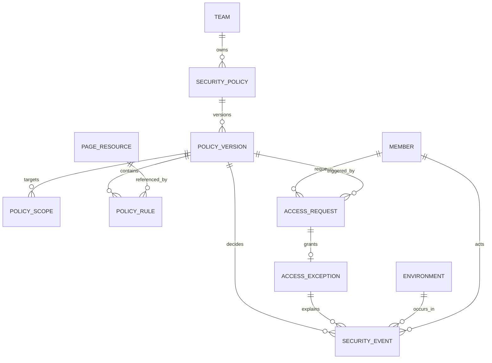

# YunLogin 安全策略产品设计方案

> 文档版本：v0.9  
> 需求 ID：PRD-20260821-SECURITY-DESIGN  
> 所属产品：YunLogin PC 端  
> 上位文档：`01-YunLogin安全策略产品需求分析.md`  
> 文档状态：评审稿  
> 最后更新：2026-08-21

## 0. 方案摘要

YunLogin 新增一级模块“安全中心”，以“访问策略”为一期核心，复用现有团队成员、部门、角色、环境、平台账号和日志能力。一期完成：

1. 管理员基于系统模板或自定义资源创建黑名单或白名单策略；
2. 策略作用于成员/部门/角色与环境/环境组/平台账号，可永久或定时生效；
3. 每个网页可配置允许/禁止访问、是否记录访问行为和限制网页元素；
4. 通用策略可限制查看密码、开发者工具、复制、上传、下载和打印；
5. 每次决策记录策略版本、网页/元素资源、客户端和执行结果；
6. 管理端可验证哪些客户端已同步并具备执行能力。

一期采用“系统硬拦截 > 常规禁止规则 > 白名单默认结果 > 默认允许”的确定性决策，不采用“最近编辑的策略获胜”。二期增加成员访问审批后，优先级扩展为“系统硬拦截 > 有效限时特例 > 常规禁止规则 > 白名单默认结果 > 默认允许”。

## 1. 信息架构与入口

### 1.1 导航建议

在 SystemFrame 左侧新增一级菜单“安全中心”，位于“团队”之后、“插件管理”之前。原因：安全策略未来会同时覆盖团队、环境、账号、浏览器能力、审批和日志，长期放在团队管理或设置中心都会造成职责混杂。

```text
安全中心
├─ 访问策略          一期，默认入口
├─ 网页资源          一期
├─ 通用策略          一期
├─ 访问日志          一期
├─ 事中监管          二期
├─ 告警方案          二期
├─ 监管日志          二期
├─ 访问审批          二期
├─ 网页水印          二期
└─ 安全概览          后续
```

原“团队 > 日志管理”继续承载登录、操作和权限日志；安全日志专门回答“浏览器运行时做出了什么安全决策”。安全事件同时写入通用操作日志的摘要，两者使用同一个 `event_id` 关联，避免两个孤立账本。

### 1.2 现有设置项重整

| 当前名称 | 建议处理 | 原因 |
|---|---|---|
| 环境安全策略 | 改名“代理筛选偏好” | 现有能力实际是换绑代理时隐藏已绑定/过期代理，不属于网页安全策略 |
| 环境安全监控 | 二期迁移到“安全中心 > 事中监管” | 目前仅有开关概念，没有监控对象、事件和生效规则 |
| 高风险操作提醒 | 二期纳入告警方案 | 提醒依赖可识别的事件，不应是无来源的独立开关 |

## 2. 角色与权限模型

### 2.1 角色原则

- 团队创建者拥有配置权限，但不默认绕过访问策略；
- 新增可授权的“安全管理员”和“安全审计员”能力，不强制新建系统角色，可通过既有自定义角色组合；
- 部门管理员只能管理授权部门及其可管理环境范围，服务端取两者交集；
- 二期审批人不能审批本人申请；如策略只有本人可审批，系统必须在发布前阻止；
- 普通成员默认只能看到本人申请和本人被允许查看的安全事件摘要。

### 2.2 权限标识

| 权限标识 | 能力 |
|---|---|
| `security:center:view` | 进入安全中心 |
| `security:policy:view` | 查看授权范围内策略 |
| `security:policy:manage` | 新建、编辑草稿、复制、停用策略 |
| `security:policy:publish` | 发布、回滚策略版本 |
| `security:resource:view` | 查看网页资源及匹配规则 |
| `security:resource:manage` | 新建/编辑自定义资源、提交系统模板纠错 |
| `security:approval:view` | 二期：查看授权范围内访问申请 |
| `security:approval:decide` | 二期：审批非本人申请 |
| `security:event:view` | 查看安全日志 |
| `security:event:sensitive:view` | 查看按规则解密后的完整 URL/设备信息；默认不开放 |
| `security:event:export` | 导出脱敏安全日志，导出动作自身入审计 |
| `security:breakglass:use` | 发起紧急解锁；必须二次验证和高优先级告警 |

前端隐藏只减少误操作，所有权限和数据范围必须由服务端校验。

## 3. 核心对象与关系



| 对象 | 业务职责 |
|---|---|
| `SecurityPolicy` | 策略主记录，保存名称、当前状态、当前发布版本和所有者 |
| `PolicyVersion` | 不可变发布快照，保存范围、规则、时间、审批和客户端能力要求 |
| `PolicyScope` | 成员/部门/角色与环境/环境组/平台账号的作用范围 |
| `PageResource` | 可复用网页定义，含平台、URL 匹配、风险等级、来源和版本 |
| `PolicyRule` | 对资源或动作的决策：记录、警告、审批或拦截 |
| `AccessRequest` | 二期：成员对一次命中发起的临时访问申请 |
| `AccessException` | 二期：审批产生的限时、限成员、限环境、限资源放行凭证 |
| `SecurityEvent` | 一次访问或动作的决策证据，引用策略版本和特例 |
| `PolicyBundle` | 下发客户端的签名策略包，按团队和环境裁剪 |
| `ClientCapability` | 客户端版本支持的页面、动作、元素、日志等能力集合 |

## 4. 访问策略列表

### 4.1 页面结构

页面使用项目 `design.md` 和既有列表组件，不单独创造视觉 Token。

```text
标题：访问策略                                      [新建策略]
说明：限制成员在已授权环境内访问敏感网页或执行高危动作

[关键词] [状态] [策略类型] [作用成员] [作用环境] [查询] [重置]

策略名称 | 类型 | 作用成员 | 作用环境 | 规则数 | 当前版本 | 生效时间 | 状态 | 客户端覆盖 | 操作
```

### 4.2 字段与操作

| 字段 | 规则 |
|---|---|
| 策略名称 | 2–40 字，同团队内不重名 |
| 类型 | 系统高危模板、自定义黑名单、白名单、通用策略 |
| 作用成员 | 展示成员数或“财务角色以外成员”等可解释摘要 |
| 作用环境 | 全部环境、环境组、指定环境、指定平台账号摘要 |
| 规则数 | 页面资源与动作规则数量 |
| 当前版本 | `vN`；点击查看发布人、发布时间、变更摘要 |
| 生效时间 | 永久或时区明确的日期/星期/每日时段 |
| 状态 | 草稿、待生效、生效中、已停用、已过期、发布失败 |
| 客户端覆盖 | 已生效/目标会话数；存在旧版本时展示风险状态 |
| 操作 | 编辑草稿、复制、查看版本、停用、回滚、归档 |

已发布版本不可直接修改。编辑会创建新草稿，发布后原版本保留。归档只隐藏策略，不删除历史和事件引用。

## 5. 新建/编辑策略

采用五步向导，避免把紫鸟的全部配置堆在一个长表单中。

### 5.1 第一步：基础信息

| 字段 | 必填 | 规则 |
|---|---|---|
| 策略名称 | 是 | 2–40 字，同团队唯一 |
| 策略说明 | 否 | 最多 300 字，说明风险和责任人 |
| 策略来源 | 是 | 系统模板 / 自定义 |
| 风险等级 | 是 | 低、中、高、关键；系统模板只读，自定义默认中 |
| 负责人 | 是 | 具备策略查看权限的成员，用于失效或冲突通知 |

系统模板创建时复制模板引用和当前模板版本，不复制成脱离来源的静态规则。模板升级必须生成预览，管理员确认后发布。

### 5.2 第二步：作用范围

#### 成员范围

- 全部成员；
- 指定成员；
- 指定部门（可选是否含子部门）；
- 指定角色；
- 排除成员/角色，用于表达“除财务角色外的成员”。

#### 资产范围

- 全部环境；
- 指定环境组；
- 指定环境；
- 指定平台账号；
- 指定平台类型或标签（后续增强）。

服务端最终范围为：`管理者可管成员 ∩ 策略成员范围` 与 `管理者可管环境 ∩ 策略资产范围`。成员变更部门/角色、环境换绑账号时实时重新计算，不把成员 ID 清单固化在已发布版本中；事件仍保存命中时的组织与资产快照。

#### 生效时间

- 永久；
- 指定开始/结束日期；
- 指定星期；
- 每日时间段；
- 时区固定保存为 IANA 时区，默认团队时区，不使用客户端本地时区决定安全结果。

### 5.3 第三步：策略模式与网页

| 模式 | 未匹配网页默认结果 | 添加网页后的配置 |
|---|---|---|
| 黑名单 | 允许访问 | 可禁止访问，也可允许访问但记录行为或限制元素 |
| 白名单 | 禁止访问 | 添加允许访问网页；允许页仍可记录行为或限制元素 |

管理员从网页资源库选择系统或团队资源，也可在权限范围内新建自定义资源。白名单发布前必须展示未列入网页将全部禁止访问的影响提示。

### 5.4 第四步：网页明细与元素限制

| 字段 | 一期规则 |
|---|---|
| 页面访问 | 允许 / 禁止 |
| 记录访问行为 | 开启 / 关闭；开启后记录页面与动作元数据 |
| 限制网页元素 | 未配置 / 已配置 N 项 |
| 元素限制类型 | 禁止查看 / 禁止点击 |
| 元素失效处置 | 记录并告警；高危页面建议直接改为整页禁止 |

一期支持的动作包括：

- `NAVIGATE`：地址栏、链接、书签、新窗口和服务端重定向产生的顶层页面访问；
- `ELEMENT_VIEW`、`ELEMENT_CLICK`：页面元素隐藏/禁用与点击阻止；
- 通用策略中的 `COPY`、`UPLOAD`、`DOWNLOAD`、`PRINT`、`DEVTOOLS`、`VIEW_CREDENTIAL`。

iframe、XHR/fetch、WebSocket 和 Service Worker 请求不在一期页面/元素控制的保证范围内，避免把 UI 拦截宣传成完整 DLP。元素未找到、匹配多个或客户端不支持时必须上报明确执行结果。

成员访问申请、审批人、申请时长和限时特例作为二期扩展，不出现在一期策略向导中。

### 5.5 第五步：影响预览与发布

发布前展示：

- 预计覆盖成员、部门、角色、环境、平台账号数量；
- 与现有策略的重叠和最终决策；
- 客户端版本不支持的目标会话；
- 近 7 天访问日志模拟命中数量（有历史数据后作为后续增强）；
- `*` 全站匹配、全部成员+全部环境、高危不可申请等危险组合的二次确认；
- 变更摘要和发布说明。

发布使用乐观锁和幂等键。同一草稿重复点击只产生一个版本。

## 6. 网页资源管理

### 6.1 资源类型

| 类型 | 维护方 | 规则 |
|---|---|---|
| 系统预设 | YunLogin | 只读引用、版本化升级、可提交纠错 |
| 团队自定义 | 安全管理员 | 当前团队可见，可编辑草稿，已发布引用保留旧版本 |
| 智能网页采集 | 后续 | 从环境内插件批量采集当前页面规范化 URL；采集不自动发布策略 |
| 元素资源 | 一期 | 保存元素定位、多语言/多站点变体和健康状态 |
| 元素采集 | 一期 | 管理员在环境内选择元素并命名；采集结果需测试后才能发布 |

### 6.2 字段

| 字段 | 规则 |
|---|---|
| 资源名称 | 2–60 字，如“Amazon 提现页面” |
| 平台 | Amazon、TikTok Shop、Shopee 等；支持“其他” |
| 站点/区域 | 美国、欧洲、日本等；可多选或通用 |
| URL 模式 | scheme、host、port、path、query 组成的结构化模式 |
| 查询参数 | 默认忽略；只保留参与页面身份判断的参数，敏感 token 禁止保存 |
| 风险类型 | 提现、收款账户、支付方式、子账号权限、敏感报表等 |
| 风险等级 | 低、中、高、关键 |
| 来源/版本 | 系统模板或团队自定义，显示更新时间和健康状态 |

### 6.3 URL 匹配规则

参考 Chrome Enterprise 的结构化过滤思想，但为业务管理员提供可视化构建器：

1. host 不区分大小写；path 和 query 默认区分大小写，可由系统模板明确覆盖；
2. URL 先去除 fragment、凭据、跟踪参数和敏感 token，再进行匹配与日志脱敏；
3. 支持精确 host、包含子域、精确 path、path 前缀和受控通配符；
4. 禁止在输入框中使用不可解释的正则表达式；
5. 多个资源同时匹配时，优先选择 host、path、query 更具体的资源用于展示，但策略决策仍合并所有有效规则；
6. 编辑器提供“输入测试 URL”，返回规范化结果、命中资源和不命中原因；
7. `*` 全站匹配只对拥有发布权限的用户开放，并要求二次确认；
8. 页面规则不自动覆盖 `chrome://`、扩展页、文件协议或开发者工具，这些由专用通用限制控制。

### 6.4 首批系统模板建议

| 平台类目 | 模板 |
|---|---|
| 资金 | 提现/打款、交易明细、结算报告、余额账户 |
| 收款 | 收款账户、银行卡、第三方支付方式新增/变更 |
| 账号控制 | 子账号新增、角色权限、登录/安全信息、二步验证设置 |
| 高风险运营 | 大额折扣、优惠券、价格批量修改、库存处置 |
| 浏览器通用 | 密码管理器、开发者工具、打印、下载、扩展管理 |

每个模板需经过产品、安全与目标平台运营三方验收，保留平台、站点、URL 样例和最后验证日期。

## 7. 策略决策引擎

### 7.1 输入

```json
{
  "team_id": "team_xxx",
  "member_id": "member_xxx",
  "role_ids": ["role_ops"],
  "department_path": ["dept_cn", "dept_store_a"],
  "environment_id": "env_xxx",
  "platform_account_id": "acct_xxx",
  "action": "NAVIGATE",
  "normalized_url": "https://seller.example.com/payments/withdraw",
  "occurred_at": "2026-08-21T08:30:00Z",
  "client_version": "x.y.z",
  "device_id": "masked-device-id"
}
```

### 7.2 决策优先级

```text
1. 系统硬拦截命中                 -> BLOCK
2. 二期启用后：有效 AccessException 精确命中 -> ALLOW + AUDIT
3. 收集全部作用域、时间和资源均命中的常规规则
4. 一期禁止规则优先               -> BLOCK / AUDIT / ALLOW
5. 白名单范围内未命中允许资源     -> BLOCK
6. 无匹配规则                     -> 默认 ALLOW
```

同级同严重度规则全部写入 `matched_rule_ids`，主展示策略按：资源更具体 > 成员更具体 > 环境更具体 > 策略优先级数值 > 策略 ID 稳定排序。排序只决定解释顺序，不改变安全结果。

### 7.3 与白名单的关系

一期白名单不是“比黑名单更高的允许规则”，而是把某个范围的默认结果从 `ALLOW` 改为 `BLOCK`：

```text
白名单范围内：命中白名单资源 -> 继续评估常规拒绝规则
             未命中白名单资源 -> BLOCK（原因：不在允许范围）
```

因此提现页即使位于允许域名内，仍可被更具体的高危黑名单拦截。二期上线后，只有有效限时特例可以放行普通拒绝规则，避免竞品“白名单优先”造成误放行。

### 7.4 决策输出

```json
{
  "decision": "REQUIRE_APPROVAL",
  "event_id": "evt_xxx",
  "policy_version_ids": ["pv_12", "pv_18"],
  "matched_resource_id": "res_withdraw",
  "matched_rule_ids": ["rule_120", "rule_181"],
  "reason_code": "FINANCE_PAGE_RESTRICTED",
  "can_request_access": true,
  "supported": true,
  "bundle_version": 42
}
```

## 8. 客户端执行与生效证明

### 8.1 策略下发

1. 发布服务生成不可变 `PolicyVersion`；
2. 编译为按团队/环境裁剪的 `PolicyBundle`；
3. 使用服务端签名，客户端验证签名、团队、环境、版本和有效期；
4. 环境启动前同步；运行期间通过推送和定时拉取更新；
5. 客户端回传 `bundle_version`、能力集合、同步时间和执行状态；
6. 管理端显示“已生效、同步中、版本过旧、能力不支持、同步失败”。

### 8.2 版本与降级

| 状态 | 普通策略 | 系统关键策略 |
|---|---|---|
| 有有效缓存包、暂时离线 | 按缓存版本执行并提示管理员 | 按缓存版本执行 |
| 无缓存且无法同步 | 可按团队设置阻止启动或允许并高危告警；默认阻止受控环境启动 | 阻止受控环境启动 |
| 客户端版本过旧 | 阻止启动要求升级，或管理员明确接受仅审计降级；不可静默 | 阻止启动 |
| 日志暂时上报失败 | 本地加密队列重试，不影响当前已计算的访问结果 | 同左；队列超阈值阻止继续进入关键页面 |
| 策略包签名失败/过期 | 丢弃新包，使用最近有效包并告警 | 无有效包时阻止受控环境启动 |

### 8.3 防绕过边界

- 顶层导航、新窗口、弹窗和重定向必须走统一拦截器；
- 地址栏、书签、历史记录、页面链接和脚本打开窗口不得拥有不同处理路径；
- 无头模式、RPA 和本地 API 启动环境时必须携带成员/服务身份并获取同一策略包；
- Incognito、扩展页和开发者工具由专用浏览器策略控制；
- 服务端不能把“事件没上报”当作“没有命中”，需监控客户端心跳和事件序号缺口；
- 一期不承诺阻止已加载页面通过 XHR 调用高危接口；元素和动作规则只约束用户界面路径，仍需平台自身权限补强。

## 9. 成员命中体验

### 9.1 整页拦截页

文案建议：

```text
此页面受团队安全策略限制
你当前没有访问该页面的权限。如因工作需要，可申请临时访问。

环境：Amazon-US-旗舰店
限制类型：资金操作页面
事件编号：SEC-20260821-XXXX

[返回上一页]
```

展示原则：

- 不展示其他成员、完整策略范围、内部规则 ID 或敏感 URL 参数；
- 一期统一显示“如需访问，请联系团队管理员”；二期允许申请的策略再展示“申请临时访问”；
- 返回上一页不可用时关闭当前页签或回到安全空白页；
- 拦截页本身不能通过修改 URL 参数绕过；
- 技术失败与策略拒绝使用不同页面，避免把系统故障伪装成权限问题。

### 9.2 元素与操作拦截（一期）

- 复制/下载/打印等动作就地阻止，并使用 Toast/Popover 说明；
- 二期允许申请时再提供“申请临时操作权限”；
- 不在 Toast 展示文件名中的敏感内容；
- 同一事件短时间重复触发合并展示，但服务端保留聚合次数和首末时间。

## 10. 访问审批（二期）

### 10.1 申请字段

| 字段 | 规则 |
|---|---|
| 申请人 | 服务端从会话读取，不可修改 |
| 环境/平台账号 | 命中时固化，不允许扩大范围 |
| 网页资源/动作 | 命中时固化并脱敏展示 |
| 触发策略版本 | 只读关联 |
| 申请理由 | 必填 10–300 字 |
| 期望时长 | 不超过策略上限 |
| 业务工单号 | 可选，最多 60 字 |

### 10.2 审批列表

Tab：待处理、已通过、已拒绝、已撤回、已过期。字段：申请时间、申请人、部门、环境、资源/动作、风险等级、申请时长、理由摘要、审批人、状态、操作。

### 10.3 审批规则

1. 服务端在审批时重新校验审批人权限、策略状态、申请状态和环境授权；
2. 申请人已失去环境权限时自动失效，不因特例恢复环境访问；
3. 审批通过创建不可编辑特例，审批记录本身不修改；
4. 审批人可提前撤销特例，撤销立即推送客户端；
5. 申请撤回仅在待处理状态允许；
6. 重复申请同一成员/环境/资源时返回现有待处理申请，避免刷屏；
7. 审批超时自动过期并通知申请人；
8. 拒绝需选择结构化原因，可附加说明；
9. 高风险审批建议要求二次身份验证，后续可增加双人会签。

## 11. 安全日志与调查

### 11.1 列表字段

| 字段 | 说明 |
|---|---|
| 事件时间 | 服务端接收时间与客户端发生时间均保留，列表默认服务端时间倒序 |
| 成员 | 事件发生时的成员/部门/角色脱敏快照 |
| 环境/平台账号 | 事件时资产快照，成员离职或环境删除后仍可解释 |
| 网页资源 | 资源名、平台、脱敏 URL；敏感 query 默认隐藏 |
| 动作 | 访问、复制、上传、下载、打印、开发者工具、查看密码等 |
| 最终结果 | 一期：允许、允许并记录、禁止访问、元素已限制、执行失败；二期增加要求审批、特例放行 |
| 触发策略 | 策略名与不可变版本 |
| 客户端 | 版本、能力、策略包版本、脱敏设备 ID |
| 事件编号 | 全链路追踪 ID |

### 11.2 详情决策链

```text
事件输入快照
  -> URL 规范化与匹配资源
  -> 命中的成员/资产/时间范围
  -> 命中的策略与规则列表
  -> 是否存在系统硬拦截/有效特例
  -> 最终结果与客户端执行结果
  -> 对应申请、审批、撤销和通知
```

### 11.3 日志安全

- `SecurityEvent` 只追加，不提供业务删除和修改；
- URL query、账号、IP、MAC、设备 ID 按权限脱敏；
- 页面正文、表单值、密码、Cookie、Token、文件正文默认不采集；
- 查看完整敏感值和导出本身生成新的安全审计事件；
- 客户端用单调事件序号上报，服务端检测缺口与重复；
- 事件写入使用幂等键，客户端重试不产生重复记录；
- 在线保留 180 天为建议值，最终以套餐、合规和成本评审为准。

## 12. 通用限制与安全概览

### 12.1 通用限制

一期提供团队级基线，成员范围支持全部、指定成员、部门和角色：

| 控制项 | 一期行为 | 后续扩展 |
|---|---|---|
| 查看密码 | 允许/禁止，可选记录尝试 | 按环境、网页和时段配置 |
| 开发者工具 | 允许/禁止；显示客户端最低版本 | 按环境配置，增加开启行为记录 |
| 打印 | 允许/禁止，可选记录尝试 | 按网页资源配置 |
| 扩展管理 | 展示既有权限入口和风险说明，不在一期新增拦截 | 禁止安装/卸载非受信扩展 |
| 网页水印 | 不在一期 | 二期按成员、管理端/环境场景和内容模板配置 |

每个控制项显示目标成员、支持客户端、最后发布人和更新时间。启用前预览受影响会话；禁用开发者工具等高影响能力需要二次确认。行为记录只保存动作元数据，不保存密码、页面正文或打印内容。

### 12.2 安全概览（后续）

概览用于发现问题，不替代日志事实表：

- 指标：受保护成员/环境、策略实际生效率、拦截事件、特例放行、执行失败、待处理申请；
- 趋势：按日展示拦截、申请、放行和执行失败；
- 排行：高频受限资源、成员、环境和动作；
- 待办：待审批、客户端版本过旧、策略同步失败、资源健康异常、紧急解锁待复核；
- 所有卡片均可带当前权限和时间范围跳转到安全日志或审批列表；
- 指标由事件事实聚合，不能用客户端 UI 点击埋点代替安全事件。

## 13. 紧急解锁（后续）

紧急解锁用于“所有审批人不可用但业务必须恢复”的极端情况，不作为日常放行入口。

1. 仅团队创建者或持有 `security:breakglass:use` 的指定成员可发起；
2. 必须二次身份验证；
3. 必填原因和关联工单；
4. 只能选择指定环境、资源和最长 30 分钟；
5. 系统硬拦截不可绕过；
6. 发起即通知其他创建者/安全管理员；
7. 创建、使用、到期和提前撤销均生成高优先级事件；
8. 每次使用后进入安全概览待复核队列。

## 14. 数据模型

### 14.1 SecurityPolicy / PolicyVersion

| 字段 | 类型 | 说明 |
|---|---|---|
| `policy_id` | string | 策略主 ID |
| `team_id` | string | 团队隔离键 |
| `name` | string | 当前名称 |
| `status` | enum | DRAFT/SCHEDULED/ACTIVE/DISABLED/EXPIRED/ARCHIVED |
| `current_version_id` | string/null | 当前发布版本 |
| `owner_member_id` | string | 负责人 |
| `version_no` | int | 单调递增 |
| `version_payload` | json | 不可变规则、范围、时间、审批和能力要求 |
| `payload_hash` | string | 完整性校验 |
| `published_by/at` | string/datetime | 发布审计 |
| `effective_from/to` | datetime/null | UTC 保存 |

### 14.2 PageResource / PolicyRule

| 字段 | 说明 |
|---|---|
| `resource_id/version` | 网页资源及不可变版本 |
| `source_type` | SYSTEM/TEAM |
| `platform/site` | 平台与站点 |
| `match_spec` | 结构化 scheme/host/port/path/query |
| `risk_type/risk_level` | 风险分类与等级 |
| `action` | NAVIGATE/COPY/UPLOAD/... |
| `effect` | AUDIT/WARN/REQUIRE_APPROVAL/BLOCK |
| `request_allowed` | 是否允许申请 |
| `required_capability` | 客户端所需能力 |

### 14.3 AccessRequest / AccessException

| 字段 | 说明 |
|---|---|
| `request_id` | 申请 ID |
| `source_event_id` | 原始命中事件 |
| `requester_member_id` | 申请人 |
| `policy_version_id` | 命中版本 |
| `environment_id/resource_id/action` | 固定最小范围 |
| `reason/business_ticket` | 申请理由与业务工单 |
| `requested_duration` | 申请时长 |
| `status/version` | 状态与乐观锁版本 |
| `decided_by/at/reason` | 审批信息 |
| `exception_id` | 放行凭证 ID |
| `valid_from/to` | 有效期 |
| `revoked_by/at` | 提前撤销 |

### 14.4 SecurityEvent

| 字段 | 说明 |
|---|---|
| `event_id/idempotency_key` | 事件 ID 与去重键 |
| `occurred_at/received_at` | 客户端与服务端时间 |
| `team/member/org_snapshot` | 团队、成员与组织快照 |
| `environment/account_snapshot` | 环境与账号快照 |
| `action/resource/url_redacted` | 动作、资源与脱敏 URL |
| `matched_policy_versions/rules` | 全部命中规则 |
| `exception_id` | 特例放行时关联 |
| `decision/enforcement_result` | 服务端决策与客户端执行结果 |
| `client/capability/bundle_version` | 生效证明 |
| `request_id` | 技术追踪 ID |

## 15. 接口建议

| 接口 | 方法 | 用途 |
|---|---|---|
| `/api/security/policies` | GET/POST | 查询、新建策略草稿 |
| `/api/security/policies/{id}/draft` | GET/PATCH | 编辑草稿，携带 version |
| `/api/security/policies/{id}/preview` | POST | 计算覆盖、冲突和能力缺口 |
| `/api/security/policies/{id}/publish` | POST | 幂等发布新版本 |
| `/api/security/policies/{id}/disable` | POST | 停用当前版本 |
| `/api/security/policies/{id}/rollback` | POST | 基于旧版本创建并发布新版本 |
| `/api/security/resources` | GET/POST | 网页资源列表与新建 |
| `/api/security/resources/test-match` | POST | 测试 URL 规范化和命中 |
| `/api/security/bundles/current` | GET | 客户端获取签名策略包 |
| `/api/security/bundles/ack` | POST | 客户端回传生效状态 |
| `/api/security/decisions` | POST | 在线决策或敏感动作复核 |
| `/api/security/events/batch` | POST | 幂等批量上报事件 |
| `/api/security/access-requests` | GET/POST | 查询/创建访问申请 |
| `/api/security/access-requests/{id}/approve` | POST | 审批通过，创建特例 |
| `/api/security/access-requests/{id}/reject` | POST | 审批拒绝 |
| `/api/security/exceptions/{id}/revoke` | POST | 提前撤销特例 |
| `/api/security/events` | GET | 查询安全日志 |

所有写接口携带团队上下文、权限校验、幂等键和服务端审计；拒绝返回稳定错误码，不向成员暴露内部匹配细节。

## 16. 状态与异常文案

| 场景 | 文案 |
|---|---|
| 页面被拦截 | 此页面受团队安全策略限制 |
| 可申请 | 如因工作需要，可申请临时访问 |
| 禁止申请 | 当前策略不允许申请访问，请联系团队管理员 |
| 已有待审 | 你的申请正在审批中，请勿重复提交 |
| 特例生效 | 临时访问已生效，将于 HH:mm 自动结束 |
| 特例到期 | 临时访问已结束，页面已重新受限 |
| 客户端过旧 | 当前客户端无法完整执行团队安全策略，请升级后再打开环境 |
| 策略同步失败 | 安全策略同步失败，为保护团队资产，当前环境暂不可打开 |
| 技术执行失败 | 安全控制执行异常，事件编号 SEC-XXXX；请联系管理员 |

## 17. 验收标准

### 17.1 一期功能验收

1. 管理员可用系统模板创建“除财务角色外成员禁止进入提现页”策略；
2. 指定成员在指定环境访问测试 URL 时被拦截，未命中的成员正常访问；
3. 地址栏、页面链接、新窗口和服务端重定向结果一致；
4. 命中事件包含成员、环境、资源、策略版本、客户端版本、结果和事件 ID；
5. 白名单范围外页面默认禁止，白名单允许页命中更具体黑名单时仍被禁止；
6. 元素禁止查看/点击可执行，未找到、多匹配和客户端不支持均形成明确日志；
7. 查看密码、开发者工具、复制、上传、下载和打印通用策略按范围生效；
8. 多策略冲突时结果符合固定优先级，日志可解释全部命中规则；
9. 客户端过旧、策略包无效或关键策略未同步时不能静默进入受控环境；
10. 历史策略版本和安全事件不可由业务界面删除或篡改。

### 17.2 安全与隐私验收

- 页面正文、密码、Cookie、Token 和文件正文不进入一期日志；
- URL 敏感参数默认脱敏；
- 普通成员不能查看其他成员申请或日志；
- 二期审批人不能审批本人申请；
- 所有导出、敏感详情查看、紧急解锁和策略发布均生成审计事件；
- 团队、环境、成员跨租户 ID 替换不能越权查询或决策；
- 本地待传事件加密，成功确认后按安全策略清理。

## 18. 后续交付物

进入实现前仍需补充：

1. 首批平台高危 URL 模板清单及逐站点验收证据；
2. 客户端拦截能力技术预研与版本矩阵；
3. 安全中心页面级 PRD 和 HTML 原型；
4. 服务端决策引擎、策略包签名和事件上报技术方案；
5. 日志保留、导出、通知渠道和套餐边界的业务确认；
6. 隐私、员工告知与截图/文件监管能力的专项合规评审。
