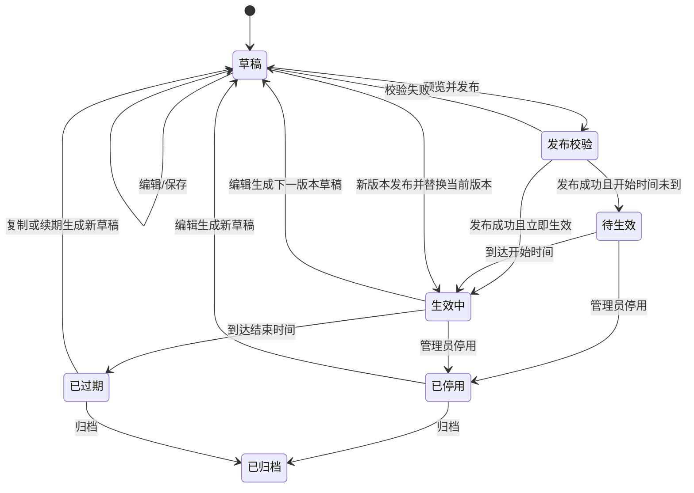
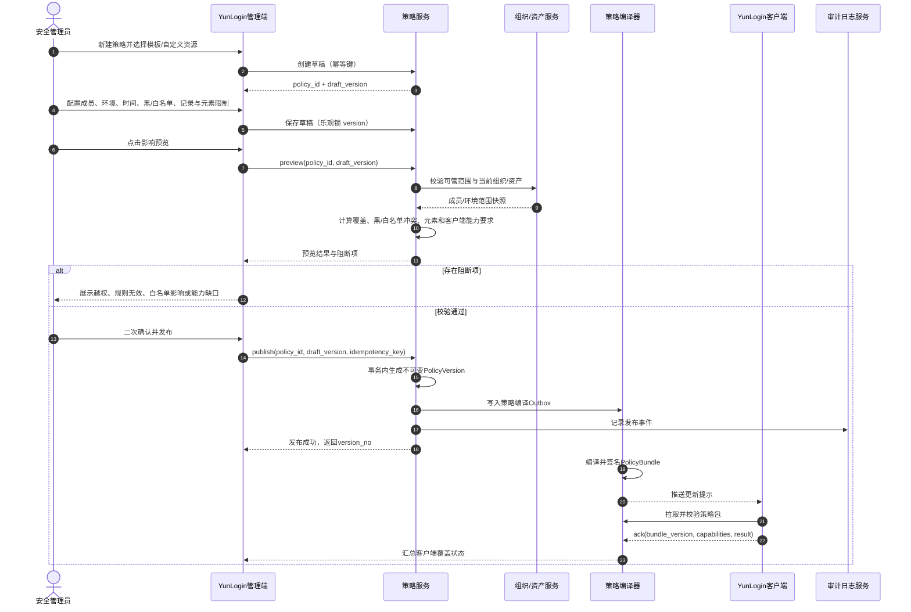
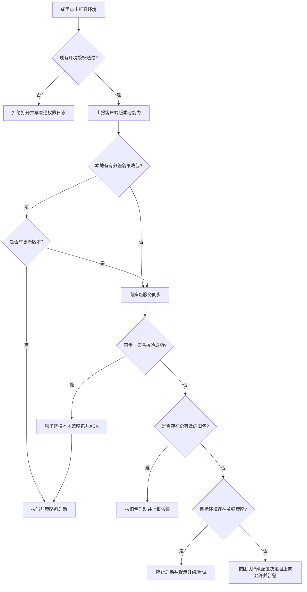
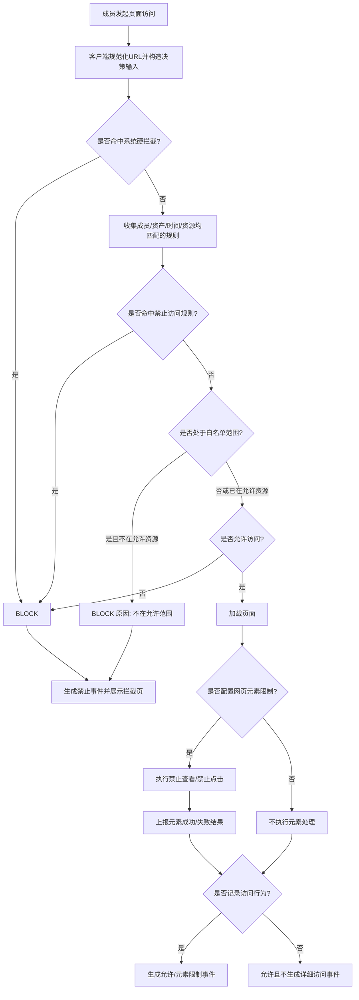
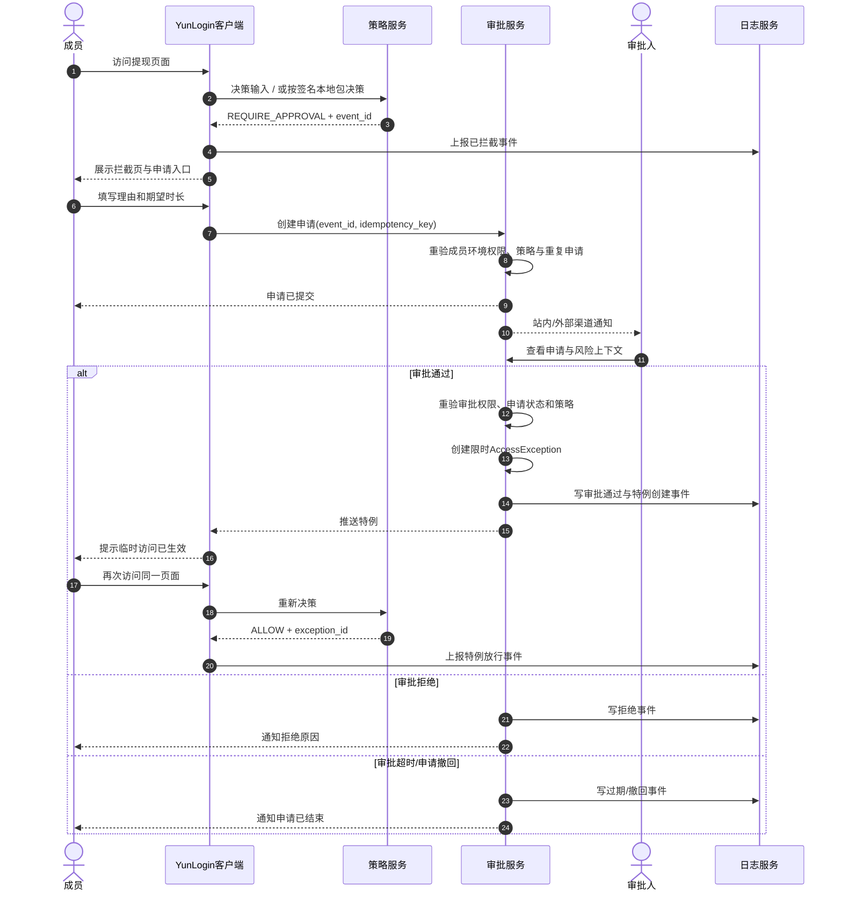
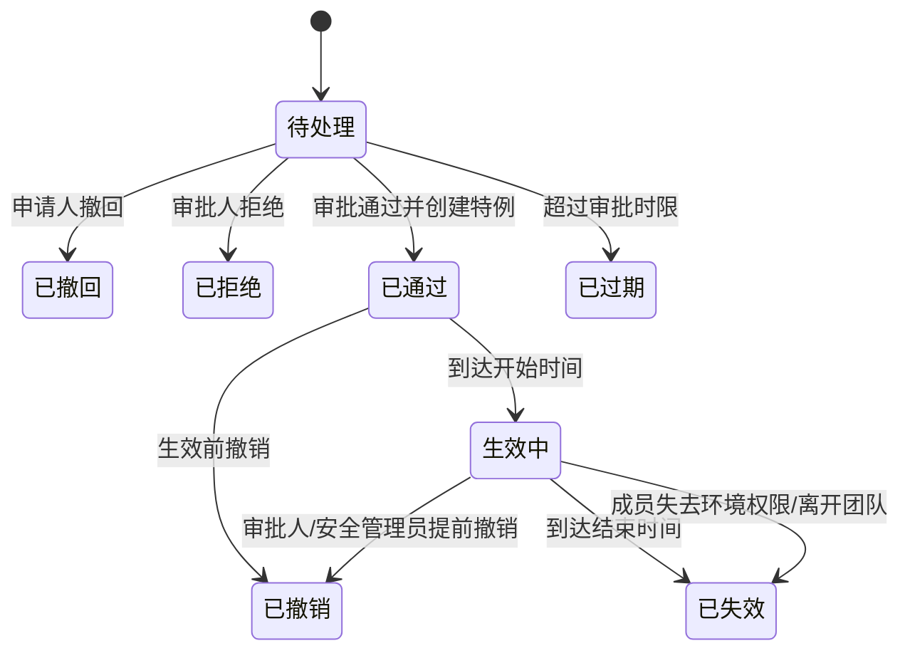
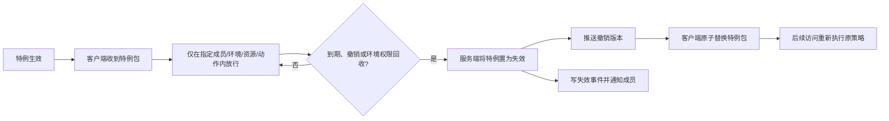
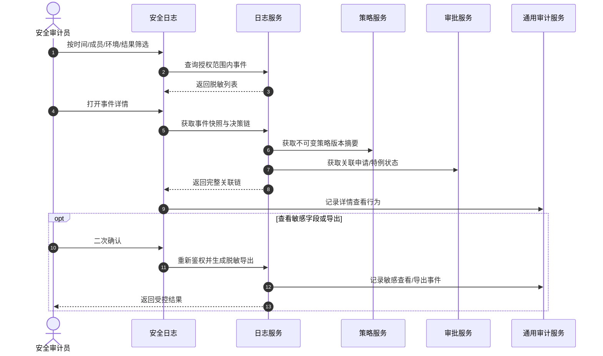

# YunLogin 安全策略业务流程

> 文档版本：v0.9  
> 需求 ID：PRD-20260821-SECURITY-FLOW  
> 适用系统：YunLogin 管理端、YunLogin 客户端、策略服务、审批服务、日志服务  
> 上位文档：`01-YunLogin安全策略产品需求分析.md`、`02-YunLogin安全策略产品设计方案.md`  
> 文档状态：评审稿  
> 最后更新：2026-08-21

## 0. 流程总览

安全策略按两期形成闭环。一期先完成访问控制：

```text
识别风险资源
  -> 创建并预览策略
  -> 发布与客户端确认生效
  -> 成员访问时执行黑/白名单、元素与通用限制
  -> 访问日志调查、优化与版本迭代
```

二期在此基础上增加事中监管、告警、成员访问审批、限时特例和网页水印。

安全策略不改变成员原有环境授权。任何临时特例也只能在成员仍有权使用该环境时生效。

## 1. 参与方与职责

| 参与方 | 职责 |
|---|---|
| 团队创建者 | 建立团队安全基线、授权安全角色、处理紧急解锁 |
| 安全管理员 | 维护网页资源、创建策略、预览影响、发布/停用/回滚 |
| 财务负责人/业务审批人 | 二期审核对应风险范围内的临时访问申请 |
| 部门管理员 | 在授权部门和资产交集内管理策略与申请 |
| 普通成员 | 在已授权环境工作，命中限制时提交必要的临时申请 |
| 安全审计员 | 只读查看事件、策略版本及二期审批链，执行受控导出 |
| YunLogin 管理端 | 一期提供配置、预览、访问日志和版本；二期增加监管与审批 |
| 策略服务 | 鉴权、版本化、范围解析、冲突计算、策略包编译和决策 |
| YunLogin 客户端 | 同步并校验策略包，在浏览器运行时执行拦截和事件上报 |
| 审批服务 | 二期管理申请状态、审批权限、特例生命周期和通知 |
| 日志服务 | 幂等接收安全事件、保留不可变快照、提供调查查询 |

## 2. 前置条件

### 2.1 组织与资产

1. 团队、成员、部门、角色、环境和平台账号均存在稳定 ID；
2. 成员已经通过现有环境授权获得环境使用权；
3. 安全管理员的可管成员和环境范围由服务端返回；
4. 环境可关联平台账号、平台类型、分组和标签；关联变化需触发策略范围重算；
5. 团队时区已配置；未配置时默认 `Asia/Shanghai` 并提示管理员确认。

### 2.2 客户端

1. 客户端上报版本、能力集合、设备标识和当前成员身份；
2. 客户端能校验签名策略包；
3. 页面导航必须统一经过拦截器；
4. 本地事件待传队列使用加密存储和单调序号；
5. 关键能力不满足时，管理端不得把该会话标记为“已生效”。

### 2.3 资源

1. 系统高危模板由 YunLogin 维护并版本化；
2. 自定义网页资源必须通过 URL 格式校验和至少一个测试样例；
3. URL 在保存和决策前按同一规范化规则处理；
4. 敏感 query、token、用户名和密码不进入资源模式或明文日志。

## 3. 策略生命周期



规则：

- 已发布 `PolicyVersion` 不可修改；
- “回滚”不是恢复旧行，而是基于旧快照创建一个新的递增版本并发布；
- 停用和到期不删除版本，也不影响历史事件解释；
- 策略主记录可归档，历史版本、申请、特例和事件仍可从关联详情访问；
- 同一时刻仅一个发布版本作为该策略的当前版本。

## 4. 创建与发布流程



### 4.1 发布校验清单

| 校验 | 失败处理 |
|---|---|
| 管理员拥有目标成员与环境管理权限 | 阻止发布，展示越权范围 |
| 策略名称、资源、处置、时间完整 | 阻止发布，定位字段 |
| 自定义 URL 有效且测试样例可命中 | 阻止发布 |
| 二期策略允许申请时至少一名合规审批人 | 二期阻止发布 |
| 二期审批人不能全部落入被限制且只能审批本人 | 二期阻止发布 |
| 所需客户端能力有最低版本 | 允许查看缺口；关键策略存在不支持会话时要求先升级或阻止发布 |
| 与现有策略重叠 | 不阻止；展示最终决策与原因 |
| `*`、全部成员、全部环境等高影响组合 | 二次确认并记录风险确认 |
| 系统硬拦截被尝试改为可申请 | 阻止发布 |

### 4.2 并发处理

- 草稿保存携带 `draft_version`；版本不一致返回最新草稿和冲突字段；
- 发布以 `policy_id + draft_version + idempotency_key` 去重；
- 两名管理员同时发布时，先成功者更新当前版本，后到者收到版本冲突，不得覆盖；
- 编译和推送通过 Outbox 异步执行，发布成功不等于所有客户端已生效；页面分开展示“管理端已发布”和“客户端覆盖率”。

## 5. 客户端启动与策略同步流程



### 5.1 生效状态定义

| 状态 | 定义 |
|---|---|
| 已生效 | 客户端 ACK 的 bundle 版本不低于目标版本，且支持策略所需全部能力 |
| 同步中 | 已收到推送但未 ACK |
| 版本过旧 | 客户端无法支持至少一个所需能力 |
| 使用旧包 | 新包同步失败，仍在有效期内的旧包执行中 |
| 同步失败 | 无可用包或签名/完整性校验失败 |
| 未知 | 客户端无近期心跳，不得计入已生效覆盖率 |

## 6. 一期运行时访问决策流程



### 6.1 URL 规范化

顺序固定为：

1. 解析 URL，拒绝无效或超长输入；
2. scheme 和 host 规范化，IDN 转换为统一形式；
3. 去除 fragment；
4. 移除 user/password；
5. 默认去除跟踪参数和敏感 token；
6. 按资源定义保留参与匹配的 query 键；
7. 生成用于匹配的 `normalized_url` 和用于日志的 `redacted_url`；
8. 资源选择以 host、path、query 更具体者优先展示，但合并所有有效策略规则。

### 6.2 冲突决策表

| 命中情况 | 结果 | 说明 |
|---|---|---|
| 系统硬拦截 + 任意规则 | 拦截 | 系统硬拦截不可被允许规则覆盖 |
| 二期：普通拦截 + 有效精确特例 | 放行并记录 | 特例必须同时匹配成员、环境、资源、动作和有效期 |
| 普通拦截 + 普通允许/记录 | 拦截 | 高严重度优先 |
| 二期：需要审批 + 允许并记录 | 需要审批 | 不因低风险规则误放行 |
| 两条普通拦截 | 拦截 | 日志保留全部命中规则 |
| 白名单允许域 + 更具体高危拦截页 | 拦截 | 白名单不覆盖拒绝规则 |
| 白名单范围内未命中任何允许资源 | 拦截 | 原因“不在允许范围” |
| 无规则 | 允许 | 一期默认可用；如启用白名单则按白名单结果 |

### 6.3 客户端执行确认

客户端先生成 `decision_id`，执行后上报：

- `BLOCKED_BEFORE_REQUEST`：请求发出前阻止；
- `BLOCKED_ON_REDIRECT`：重定向目标被阻止；
- `ALLOWED`：已放行；
- `FAILED_TO_ENFORCE`：规则已命中但技术执行失败；
- `UNSUPPORTED`：客户端缺少能力。

`FAILED_TO_ENFORCE` 和 `UNSUPPORTED` 必须是高优先级安全事件，不能记录成普通允许。

## 7. 命中拦截与访问申请流程（二期）



### 7.1 申请状态机



### 7.2 创建申请校验

1. 原始事件存在、属于当前成员且结果允许申请；
2. 原策略版本仍可解释，当前策略仍限制该访问；
3. 成员仍有环境授权；
4. 申请时长不超过策略上限；
5. 没有相同范围的待处理申请或有效特例；
6. 申请理由满足长度和敏感信息检查；
7. 幂等键重复时返回原申请。

### 7.3 审批通过校验

1. 审批人具备 `security:approval:decide` 且数据范围覆盖申请；
2. 审批人不是申请人；
3. 申请仍为待处理，版本未变化；
4. 成员仍在团队且有环境授权；
5. 策略未停用、资源未移除；若策略已不再限制，申请自动关闭为“无需审批”；
6. 特例的范围不可扩大；
7. 审批事务内创建唯一特例、更新申请、写 Outbox 和审计记录。

## 8. 特例到期与撤销流程（二期）



客户端使用服务端签发的 `valid_to` 和签名判断有效期；不能通过修改本机时间延长特例。运行中的已加载页面在特例到期后：

- 二期至少保证下一次顶层导航重新受控；
- 后续可在到期时刷新/关闭受控页签或禁用后续敏感动作；
- 不能承诺撤回已经提交给第三方平台的真实业务操作。

## 9. 安全日志调查流程



### 9.1 调查路径

1. 从异常账号或成员筛选安全事件；
2. 查看最终决策和客户端执行结果；
3. 核对命中的策略版本、网页资源版本和组织/环境快照；
4. 二期如为特例放行，查看申请理由、审批人、有效期和是否提前撤销；
5. 关联查看同一成员相邻时间的登录日志、操作日志和权限日志；
6. 形成调查结论，不修改原事件；
7. 需要调整策略时创建新草稿并走发布流程。

## 10. 策略编辑、停用与回滚

### 10.1 编辑

```text
生效版本 v3
  -> 管理员点击编辑
  -> 基于 v3 创建草稿
  -> v3 继续执行
  -> 草稿预览并发布为 v4
  -> v4 成为当前版本，v3 保留只读
  -> 客户端逐步 ACK v4
```

发布切换时不能出现“无策略空窗”。客户端原子替换整个策略包，不逐条增删。

### 10.2 停用

- 停用先二次确认影响成员、环境和现有特例；
- 停用只让策略不再参与新决策；历史事件仍引用原版本；
- 由该策略产生的待处理申请自动关闭为“策略已停用”；
- 二期已生效特例默认立即失效，除非策略明确配置“保留至到期”，建议默认立即失效；
- 停用事件写入权限/安全审计。

### 10.3 回滚

- 选择历史版本并查看与当前版本差异；
- 系统重新校验当前组织、资源和客户端能力，不能原样盲回滚；
- 确认后生成新版本号，如基于 v2 回滚时发布为 v5；
- 回滚不复活旧申请或已过期特例。

## 11. 异常与恢复流程

### 11.1 客户端版本过旧

| 场景 | 处理 |
|---|---|
| 只缺少后续能力，当前策略仅使用一期可用能力 | 允许打开，覆盖状态显示“部分能力可用” |
| 策略依赖缺失能力 | 普通策略由团队配置阻止或显式降级；默认阻止 |
| 系统关键策略依赖缺失能力 | 阻止受控环境启动，提供升级入口 |

### 11.2 策略同步失败

```text
同步失败
  -> 校验本地旧包
     -> 旧包有效：继续执行旧包，后台显示风险，指数退避重试
     -> 旧包无效：判断关键策略
        -> 有关键策略：阻止环境启动
        -> 无关键策略：按团队降级配置执行并高优先级告警
```

### 11.3 日志上报失败

1. 客户端将事件写入加密待传队列；
2. 按 `event_id` 幂等重试；
3. 服务端返回已接收的最高连续序号；
4. 队列达到容量/时长阈值时向管理员告警；
5. 关键页面事件长期无法上报时阻止继续访问关键页面；
6. 上报恢复后补传，保留 `occurred_at` 和 `received_at` 差异。

### 11.4 策略服务不可用

- 一期页面与元素访问优先由已签名本地包决策；
- 二期需要在线审批或撤销确认时，服务不可用则不创建未确认特例；
- 已签发且仍有效的特例可继续使用，到期不可延长；
- 紧急解锁需要服务端签发，离线不提供本地万能密码。

### 11.5 页面规则变化

- 系统模板定期验证测试 URL；
- 命中率突然降为零、平台重定向结构变化或大量未知页面时生成资源健康告警；
- 模板更新先生成新资源版本和影响预览；
- 未经管理员确认不静默扩大自定义策略范围；
- 关键模板可由 YunLogin 安全团队强制升级，但必须显示变更说明、版本和审计事件。

### 11.6 时钟偏差

- 策略服务按服务端时间判断策略生效；二期同时判断审批和特例有效期；
- 客户端使用服务端签发的时间基准与单调计时器执行本地策略和特例到期；
- 客户端时钟偏差超过阈值时告警，不允许通过修改系统时间改变策略或延长特例。

## 12. 典型业务场景

### 12.1 一期：非财务成员访问提现页

| 步骤 | 责任方 | 结果 |
|---|---|---|
| 1 | 安全管理员 | 选择系统模板“资金 > 提现/打款” |
| 2 | 安全管理员 | 成员范围选择“全部成员”，排除“财务”角色；环境范围选择全部 Amazon 店铺 |
| 3 | 系统 | 预览覆盖成员、环境、URL 与旧客户端缺口 |
| 4 | 安全管理员 | 发布黑名单策略，设置“禁止访问”和“记录访问行为” |
| 5 | 运营成员 | 在已授权 Amazon 环境访问提现页 |
| 6 | 客户端 | 在请求前拦截并记录事件 |
| 7 | 客户端 | 展示“此页面受团队安全策略限制”，一期不提供申请入口 |
| 8 | 安全管理员 | 在访问日志查看成员、环境、网页、策略版本和执行结果 |

### 12.2 一期：外包成员仅允许运营页面

1. 管理员为外包角色配置指定环境授权；
2. 建立白名单，允许商品、订单和客服页面；
3. 白名单范围外页面默认拦截；
4. 资金、权限和凭据页面仍由高危黑名单进一步拦截；
5. 外包合同到期后回收环境授权，白名单不恢复其环境访问；
6. 日志保留成员和授权发生时的快照。

### 12.3 一期：限制网页元素

1. 管理员为“收款账户设置”网页采集“新增银行卡”和“更换收款账户”按钮；
2. 在黑名单策略中允许查看页面，但配置禁止查看或禁止点击上述元素，并开启访问记录；
3. 成员打开页面后，客户端识别并限制元素；
4. 元素限制成功写入 `ELEMENT_RESTRICTED`；
5. 页面改版导致元素未找到时写入 `ELEMENT_NOT_FOUND`，管理端显示资源健康异常；
6. 管理员判断该风险不能接受元素失效时，将网页策略改为整页禁止。

### 12.4 二期：成员申请临时访问

1. 一期提现策略继续生效；
2. 管理员在二期为该策略开启“允许申请”，指定财务负责人审批和最长 30 分钟；
3. 运营成员命中后填写业务原因；
4. 财务负责人查看环境、网页、风险和理由后通过；
5. 系统创建仅该成员、该环境、该资源有效的 30 分钟特例；
6. 成员再次访问时放行，访问日志标记“特例放行”；
7. 到期或撤销后重新执行原禁止规则。

### 12.5 后续：创建者被策略命中

1. 创建者进入受策略限制的环境；
2. 因创建者没有天然豁免，客户端正常拦截；
3. 创建者不能审批本人申请；
4. 其他合规审批人可以限时放行；
5. 如无审批人且业务重大，可使用紧急解锁；
6. 紧急解锁必须二次验证、最长 30 分钟并通知其他安全管理员。

## 13. 事件与通知

| 事件 | 通知对象 | 默认渠道 | 去重规则 |
|---|---|---|---|
| 关键页面被拦截 | 一期：安全管理员，可选财务负责人 | 站内；后续外部渠道 | 同成员+环境+资源 5 分钟聚合 |
| 元素限制失败 | 一期：策略负责人、安全管理员 | 站内 | 同资源+页面版本聚合 |
| 新访问申请 | 二期：当前策略审批人 | 站内 | 同一待处理申请不重复推送 |
| 审批通过/拒绝 | 二期：申请人 | 客户端+站内 | 按申请 ID |
| 特例即将到期/已到期 | 二期：申请人 | 客户端 | 按特例 ID |
| 特例提前撤销 | 二期：申请人、安全管理员 | 客户端+站内 | 按撤销事件 |
| 策略同步失败/版本过旧 | 策略负责人、安全管理员 | 站内 | 同设备指数退避 |
| 执行失败 | 安全管理员 | 高优先级站内 | 单事件，不与普通拦截合并 |
| 紧急解锁 | 所有创建者/安全管理员 | 高优先级多渠道 | 不聚合 |

通知只包含脱敏信息，点击后仍需服务端鉴权。

## 14. 关键验收用例

| 用例 | 前置 | 操作 | 预期 |
|---|---|---|---|
| AC-01 非财务拦截 | 一期运营成员命中提现策略 | 访问提现 URL | 请求前阻止，展示联系管理员，日志为 BLOCK |
| AC-02 财务不命中 | 财务角色被策略排除 | 访问同一 URL | 正常访问；如配置审计则记录 AUDIT |
| AC-03 新窗口绕过 | 页面脚本打开受限 URL | 点击入口 | 新窗口内容未加载，结果与地址栏访问一致 |
| AC-04 重定向绕过 | 允许 URL 302 到受限 URL | 访问原 URL | 重定向目标被阻止并记录原始链路摘要 |
| AC-05 元素禁止查看 | 页面存在受限元素 | 打开页面 | 元素不可见，事件记录成功结果 |
| AC-06 元素失效 | 页面改版后元素未找到 | 打开页面 | 页面按访问规则处理；上报 ELEMENT_NOT_FOUND，不伪装成功 |
| AC-07 通用策略 | 成员被禁止使用开发者工具 | 尝试打开 | 动作被阻止且记录元数据 |
| AC-08 行为记录关闭 | 允许页面且关闭记录 | 正常访问 | 不生成详细访问事件，仅保留必要健康计数 |
| AC-09 多策略冲突 | 同时命中 AUDIT 与 BLOCK | 访问页面 | BLOCK，日志列出两条规则 |
| AC-10 白名单与高危页 | 域名在白名单，路径命中提现黑名单 | 访问提现路径 | BLOCK，不被白名单放行 |
| AC-11 旧客户端 | 客户端缺少策略所需能力 | 打开受控环境 | 按关键性阻止或显式降级，管理端不显示已生效 |
| AC-12 策略包篡改 | 本地包签名无效 | 启动环境 | 丢弃包；无有效旧包时阻止受控环境 |
| AC-13 日志断网补传 | 拦截时日志服务不可达 | 恢复网络 | 本地加密队列按事件 ID 补传且不重复 |
| AC-14 策略编辑 | v3 生效时编辑草稿 | 未发布前访问 | 继续按 v3；发布 v4 并 ACK 后按 v4 |
| AC-15 创建者受控 | 创建者在策略范围 | 访问受限页 | 正常拦截，不因身份自动绕过 |
| AC-16 二期特例最小范围 | A 环境审批通过 | 在 B 环境访问同一资源 | 仍被拦截 |
| AC-17 跨团队越权 | 替换 team/member/environment ID | 请求策略或日志 | 服务端拒绝且生成越权安全事件 |
| AC-18 URL 敏感参数 | URL 含 token/query | 命中并查看日志 | 匹配正确，列表与导出不出现 token 明文 |

## 15. 产品分期与灰度流程

### 15.1 一期 M1：策略与资源底座

- 完成网页/元素资源、URL 匹配、黑/白名单、作用范围、版本和影响预览；
- 管理端、服务端和客户端共享同一匹配测试集；
- 白名单大范围默认禁止需要二次确认。

### 15.2 一期 M2：客户端执行

- 完成整页访问、元素禁止查看/点击和通用策略；
- 验证地址栏、链接、新窗口、重定向和页面改版路径；
- 对旧客户端、策略包签名失败和同步失败执行明确降级规则。

### 15.3 一期 M3：访问日志与灰度

- 选少量内部团队先以“允许并记录”验证资源、范围和客户端覆盖；
- 再灰度启用黑名单整页/元素限制和白名单；
- 完成访问日志、断网补传、决策链和执行失败闭环；
- 不记录页面正文、截图、凭据或文件原文。

### 15.4 二期：监管、告警、审批与水印

- 复用一期资源、策略版本、事件和客户端能力；
- 上线事中监管、告警方案和监管日志；
- 为既有禁止策略增加访问申请和限时特例；
- 上线网页水印；
- 监管证据和外部通知需通过独立隐私与合规评审。

## 16. 流程待确认项

1. 一期元素限制是否同时要求禁止查看和禁止点击；本文按两种都纳入。
2. 一期通用策略是否确认包含复制、上传和下载；本文按包含处理。
3. 普通策略无有效缓存包时的团队级默认：阻止环境启动或允许并告警。
4. 在线访问日志保留、归档、导出和套餐限制。
5. 首批平台 URL 模板的业务负责人和持续维护机制。
6. 二期访问申请默认 SLA、最长时长和是否双人审批。
7. 二期特例到期时是否强制关闭已打开受限页签。
8. 二期首发外部通知渠道，以及监管是否包含截图或文件备份。
