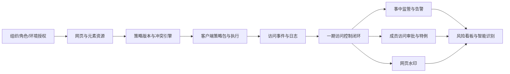

# YunLogin 安全策略产品规划

> 文档版本：v1.1  
> 规划 ID：ROADMAP-20260821-SECURITY  
> 所属产品：YunLogin PC 端  
> 关联文档：`01-YunLogin安全策略产品需求分析.md`、`02-YunLogin安全策略产品设计方案.md`、`03-YunLogin安全策略业务流程.md`  
> 文档状态：分期基线  
> 最后更新：2026-08-21

## 0. 规划结论

YunLogin 安全策略采用“先控制、再监管、后运营”的分期路线。

```text
一期：访问控制底座
黑/白名单 + 页面访问控制 + 元素限制 + 通用策略 + 访问日志 + 网页资源管理

二期：安全监管闭环
事中监管 + 告警方案 + 监管日志 + 成员访问审批 + 网页水印

后续：安全运营与智能风控
风险识别 + 证据增强 + 资源健康 + 外部集成 + 自动响应
```

一期的定位不是一个简单的 URL 拦截开关，而是一个可持续扩展的策略执行底座。二期和后续能力必须复用一期的成员/环境范围、网页资源、策略版本、客户端能力和安全事件模型，避免形成多套互不关联的配置和日志体系。

## 1. 规划目标

### 1.1 业务目标

1. 管理员可以对提现、收款账户、支付方式、账号权限等高危页面设置黑名单或白名单。
2. 管理员可以在不回收整个环境权限的情况下，细化网页访问范围和页面元素操作范围。
3. 管理员可以确认策略是否已下发到客户端，并通过访问日志还原“谁、在什么环境、访问了什么、命中了什么规则”。
4. 一期先建立稳定的控制与证据底座，二期再引入持续监管、告警和临时业务例外。
5. 产品规划避免一次性复制竞品全部能力，优先保证可解释、可追溯、可扩展。

### 1.2 规划原则

- **先强制控制，后持续监管**：先证明能稳定阻断，再扩展录像、截图、告警和文件证据。
- **先统一资源，后叠加能力**：黑名单、白名单、元素限制、监管和告警必须引用同一网页资源。
- **拒绝优先**：同一访问同时命中允许与禁止规则时，禁止规则优先；二期仅允许明确审批产生的限时特例放行。
- **日志先于看板**：先保证事件完整、可解释、不可篡改，再建设趋势和排行。
- **版本能力透明**：管理端必须区分“已发布”和“客户端已生效”。
- **最小采集**：一期不采集页面正文、输入值、截图、Cookie、Token 或文件原文。
- **分期不分裂架构**：二期功能通过扩展一期对象和事件实现，不重复建设范围、资源和审计模型。

## 2. 总体路线图

| 阶段 | 产品主题 | 核心结果 | 主要模块 | 发布门槛 |
|---|---|---|---|---|
| 一期 V1.0 | 访问控制底座 | 管理员能配置并验证网页与元素访问限制 | 访问策略、网页资源、通用策略、访问日志 | 高危页面可稳定拦截；黑/白名单冲突可解释；事件可追溯 |
| 二期 V1.5 | 安全监管闭环 | 从被动拦截扩展到事中发现、告警和受控放行 | 监管设置、告警方案、监管日志、访问审批、网页水印 | 告警准确；审批自动回收；监管数据权限与隐私规则通过评审 |
| 后续 V2.x | 安全运营与智能风控 | 从规则配置升级为持续风险运营 | 风险看板、异常检测、资源健康、外部通知/SIEM、自动响应 | 误报可控；模型/规则可解释；自动处置有回滚和人工接管 |

具体日历时间需要结合客户端拦截、元素控制和告警采集的技术预研结果再排定。本文以里程碑和退出条件管理范围，不先承诺未经评估的绝对日期。

## 3. 一期 V1.0：访问控制底座

### 3.1 一期目标

让管理员完成以下闭环：

```text
维护网页与元素资源
  -> 创建黑名单或白名单策略
  -> 选择成员与环境范围
  -> 配置是否禁止访问、是否记录、限制哪些元素
  -> 发布并确认客户端生效
  -> 成员访问时执行允许/禁止/元素限制
  -> 管理员在访问日志中查看决策证据
```

### 3.2 一期范围

#### A. 访问策略管理

| 能力 | 一期范围 |
|---|---|
| 策略列表 | 查询、状态、启停、编辑草稿、复制、版本、客户端覆盖状态 |
| 策略模式 | 黑名单、白名单 |
| 成员范围 | 全部成员、指定成员、部门、角色、排除成员/角色 |
| 资产范围 | 全部环境、环境组、指定环境、指定平台账号 |
| 生效时间 | 永久、日期区间、星期、每日时间段、团队时区 |
| 网页规则 | 引用系统预设或团队自定义网页资源 |
| 页面访问 | 可配置允许或禁止访问 |
| 行为记录 | 每条网页规则可配置是否记录访问行为 |
| 元素限制 | 可配置隐藏/禁用指定网页元素，并记录限制结果 |
| 版本管理 | 已发布版本不可直接修改；新草稿发布、停用、查看历史版本 |
| 影响预览 | 发布前展示覆盖成员、环境、网页、冲突和旧客户端缺口 |

#### B. 黑名单与白名单规则

| 模式 | 默认行为 | 添加网页后的行为 | 典型场景 |
|---|---|---|---|
| 黑名单 | 未配置网页默认允许 | 对指定网页设置禁止访问、允许但记录、允许但限制元素 | 限制提现、收款账户、子账号等少量高危页面 |
| 白名单 | 未配置网页默认禁止 | 添加允许访问网页；允许页仍可记录行为或限制元素 | 外包人员、实习人员只允许运营必需页面 |

统一页面规则字段：

```text
网页资源
├─ 页面访问：允许 / 禁止
├─ 记录访问行为：开启 / 关闭
└─ 限制网页元素：未配置 / 已配置 N 项
```

冲突规则：

1. 系统关键禁止规则优先。
2. 普通禁止规则优先于允许规则。
3. 白名单只改变未匹配网页的默认结果，不覆盖更具体的黑名单禁止。
4. 同级规则按资源、成员和环境的具体程度展示主命中原因，但所有命中规则都写入日志。
5. 不使用“最后编辑者获胜”或不可解释的隐式顺序。

#### C. 网页元素限制

一期元素控制是正式能力，不是概念占位：

- 网页资源可保存一个或多个元素资源。
- 元素可通过系统预设、管理员选择器采集或手工配置生成。
- 支持“禁止查看”“禁止点击”两种首期动作。
- 客户端加载页面后识别元素，执行隐藏、禁用或阻止点击。
- 页面元素未找到、找到多个或页面结构变化时不得静默视为成功，需上报 `ELEMENT_NOT_FOUND`、`ELEMENT_AMBIGUOUS` 等执行结果。
- 元素规则失效不等于整页规则失效；高危业务若不能接受元素失效，应直接使用整页禁止。
- 一期不承诺通过元素限制阻断平台后台 API、脚本或自动化调用。

#### D. 通用策略

一期通用策略不依赖某个网页资源，按成员/部门/角色及环境范围生效：

| 控制项 | 一期选项 | 日志 |
|---|---|---|
| 查看密码 | 允许 / 禁止 | 可记录查看尝试与结果，不记录密码内容 |
| 开发者工具 | 允许 / 禁止 | 记录开启尝试、结果和客户端能力 |
| 复制 | 允许 / 禁止 | 只记录动作元数据，不记录剪贴板正文 |
| 上传 | 允许 / 禁止 | 只记录动作与脱敏文件元数据，不保存文件原文 |
| 下载 | 允许 / 禁止 | 只记录动作与脱敏文件元数据 |
| 打印 | 允许 / 禁止 | 只记录动作，不保存打印内容 |

网页水印不进入一期，统一放在二期监管能力中。

#### E. 访问日志

一期日志只记录策略决策与客户端执行，不等于二期的全量事中监管日志。

| 字段 | 说明 |
|---|---|
| 操作时间 | 客户端发生时间与服务端接收时间 |
| 成员 | 事件时成员、部门和角色快照 |
| 环境/平台账号 | 事件时资产快照 |
| 操作类型 | 页面访问、元素查看/点击、密码、开发者工具、复制、上传、下载、打印 |
| 网页名称/URL | 资源名与脱敏 URL |
| 触发策略 | 策略名称、版本和规则 |
| 访问结果 | 允许、允许并记录、禁止访问、元素已限制、执行失败、客户端不支持 |
| 客户端信息 | 版本、能力、策略包版本、脱敏设备标识 |
| 事件编号 | 关联通用操作日志和技术排障 |

支持按时间、成员、环境、平台账号、网页、动作、结果和策略筛选；详情展示决策链。日志只追加，不提供业务删除或修改。

#### F. 网页资源管理

| 能力 | 一期范围 |
|---|---|
| 系统资源 | 平台、站点、网页名称、URL 模式、风险分类、版本、验证日期 |
| 团队资源 | 新建、编辑草稿、复制、停用、测试匹配 |
| URL 规则 | scheme、host、path、query 的结构化匹配及受控通配符 |
| 资源选择 | 在黑/白名单策略中复用同一资源 |
| 元素资源 | 元素名称、限制类型、定位规则、页面版本、健康状态 |
| 匹配测试 | 输入测试 URL，返回规范化结果、命中资源和不命中原因 |
| 失效反馈 | 元素未找到、URL 长期零命中、客户端不支持等健康提示 |

### 3.3 一期不包含

- 成员访问申请、审批、访问特例和移动端审批；
- 事中监管设置、连续浏览记录、告警方案和事中监管日志；
- 屏幕/网页水印；
- 默认采集页面截图、录像、键盘输入、Cookie、Token 或文件原文；
- 异常行为模型、风险评分、自动处置和外部 SIEM；
- 通过 URL/元素规则保证阻断所有 XHR、WebSocket、Service Worker 或平台后台 API。

### 3.4 一期里程碑

#### M1：策略与资源底座

交付：

- 安全中心导航与权限；
- 网页资源、URL 规范化、匹配测试；
- 黑/白名单策略草稿、成员/资产范围、时间范围；
- 策略版本与影响预览数据模型。

退出条件：

- 同一个测试 URL 在管理端预览、服务端和客户端得到相同资源匹配结果；
- 黑/白名单默认行为和冲突规则通过单元测试；
- 跨团队、跨部门、跨环境越权全部被服务端拒绝。

#### M2：客户端执行

交付：

- 签名策略包、环境启动同步和覆盖状态；
- 地址栏、链接、新窗口、重定向的整页访问控制；
- 元素采集、禁止查看/点击及失效状态；
- 查看密码、开发者工具、复制、上传、下载、打印通用策略。

退出条件：

- 高危页面在所有约定导航路径中执行结果一致；
- 元素规则失效可识别、可上报，不出现“管理端显示成功但客户端未执行”；
- 旧客户端、策略包签名失败和同步失败均按明确规则处理。

#### M3：访问日志与灰度

交付：

- 访问日志列表、筛选、详情决策链；
- 本地加密待传、服务端幂等、事件序号缺口检测；
- 系统高危网页模板首批包；
- 内部团队仅记录灰度、拦截灰度和回滚能力。

退出条件：

- 每个禁止、元素限制和执行失败事件均能关联策略版本、资源版本和客户端版本；
- 日志断网补传不重不漏；
- 试点团队误报、漏报和页面兼容问题完成复盘；
- 关键验收用例全部通过后才能扩大灰度。

### 3.5 一期成功指标

| 指标 | 定义 | 目标 |
|---|---|---|
| 应拦截页面正确拦截率 | 抽样确认被正确禁止的访问 / 应禁止访问 | 100% |
| 策略实际生效率 | 能力与策略版本均满足的目标会话 / 目标会话 | >= 99.5% |
| 决策可解释率 | 可还原范围、资源、规则、版本和执行结果的事件 / 策略事件 | 100% |
| 元素执行可观测率 | 有明确成功或失败结果的元素规则执行 / 元素规则执行 | 100% |
| 访问日志丢失率 | 服务端确认缺失且无法补传的应记录事件 / 应记录事件 | 0 |
| 高危误放行事故 | 已知规则应禁止但因冲突算法被允许的次数 | 0 |

## 4. 二期 V1.5：安全监管闭环

### 4.1 二期目标

在一期“已知资源、已知策略、已知事件”的基础上，增加持续监管、风险告警、临时业务例外和视觉追责能力。

### 4.2 二期范围

#### A. 事中监管设置

- 支持按平台账号监管或按成员监管；
- 配置监管成员、平台账号、环境和生效时段；
- 配置需要记录的访问与操作类型；
- 显示客户端版本、存储和隐私影响；
- 明确“记录中”状态是否向成员展示；
- 监管数据与一期访问日志使用同一事件 ID 和资源 ID。

#### B. 告警方案

- 告警方案名称、监控账号、生效成员、通知对象和说明；
- 系统预设规则：提现、收款账户、子账号、价格、优惠、库存等；
- 自定义网页/动作规则；
- 阈值、时间窗口、风险等级、去重和通知频率；
- 站内通知为基础，可扩展飞书、企业微信、邮件等渠道；
- 告警只负责发现和通知，不自动等同于访问拦截。

#### C. 事中监管日志

- 区分“全部监管记录”和“告警事件”；
- 按成员、账号、环境、网页、动作、时间和风险筛选；
- 关联一期访问策略结果，显示当时是允许、禁止还是执行失败；
- 高敏感网页日志默认遮蔽，完整查看需要独立权限和二次验证；
- 截图或文件证据若进入范围，必须先完成员工告知、保留期、下载权限和脱敏评审。

#### D. 成员访问审批

- 一期被禁止访问的成员可按策略发起临时申请；
- 申请固定到成员、环境、网页资源、动作和策略版本，不允许扩大范围；
- 审批通过创建限时访问特例，不修改原策略；
- 访问特例优先于普通黑/白名单规则，但不可绕过系统硬禁止；
- 申请人不能审批本人申请；
- 到期、撤销、成员离职或环境授权回收后自动失效；
- 支持站内审批，外部移动审批作为后续增强。

#### E. 网页水印设置

- 按成员/部门/角色和场景配置；
- 场景包括管理端和浏览器环境；
- 内容可选择成员名称、手机号脱敏片段、设备标识脱敏片段和自定义文本；
- 提供预览、密度/角度等展示配置，但视觉遵循项目 `design.md`；
- 水印不能替代下载、复制和截图等强制控制，只承担警示与追责辅助。

### 4.3 二期成功指标

| 指标 | 目标方向 |
|---|---|
| 告警有效率 | 经管理员确认有调查价值的告警占比持续提升 |
| 告警时效 | 高风险事件在约定 SLA 内通知到审批人/安全管理员 |
| 临时特例自动回收率 | 100% |
| 审批越权事故 | 0 |
| 监管事件与访问事件关联率 | 100% |
| 未经授权查看敏感监管数据 | 0 |

## 5. 后续 V2.x：安全运营与智能风控

后续能力根据一期、二期真实数据和客户反馈逐步选择，不在前两期底座未稳定时提前承诺：

- 安全概览、趋势、成员/环境/网页/动作排行；
- 异常时间、异常设备、异常地理位置和高频操作识别；
- 多规则组合、频次阈值和风险评分；
- 网页与元素资源自动健康检查、平台改版识别和模板灰度升级；
- 经合规评审后的截图、录像或文件传输备份；
- 双人审批、审批 SLA、移动端审批；
- Webhook、飞书、企业微信、邮件、SIEM 等外部集成；
- 自动停用环境、强制退出、撤销特例等响应动作；
- 策略模拟、历史回放和变更影响分析。

## 6. 能力依赖关系



二期不能跳过一期的资源、版本和事件底座。否则会出现同一网页在访问策略、监管规则和审批中分别维护三套 URL，造成规则漂移和日志无法关联。

## 7. 工作流与责任边界

| 工作流 | 产品/设计 | 客户端 | 服务端 | 测试/安全 |
|---|---|---|---|---|
| 网页资源 | 定义资源字段、平台模板和采集体验 | 页面/元素采集、匹配执行 | 资源版本、匹配测试、团队隔离 | URL/元素兼容矩阵、敏感参数检查 |
| 策略管理 | 黑/白名单、范围、状态、预览 | 获取并执行策略包 | 版本、冲突计算、编译、签名 | 冲突、越权、并发、回滚 |
| 通用策略 | 控制项和风险说明 | 浏览器能力拦截 | 范围与版本 | 多内核/多版本验收 |
| 访问日志 | 字段、筛选、详情决策链 | 事件生成、加密待传 | 幂等接收、不可变存储、查询 | 断网补传、脱敏、完整性 |
| 事中监管 | 监管对象、告警、通知 | 行为采集 | 规则计算、通知和存储 | 隐私、性能、误报 |
| 访问审批 | 申请与审批体验 | 特例执行与到期 | 状态机、权限、签发/撤销 | 越权、并发、时钟与到期 |

## 8. 关键技术预研与发布门槛

### 8.1 一期启动前必须完成的预研

1. Chromium 导航拦截覆盖地址栏、链接、新窗口、重定向、刷新和历史记录。
2. SPA 路由、iframe、脚本导航和下载行为的可控边界。
3. 元素定位方式、同名元素、多语言站点、动态加载和页面改版后的失效识别。
4. 查看密码、开发者工具、复制、上传、下载和打印在当前客户端架构中的真实可控性。
5. 策略包签名、离线缓存、版本切换和旧客户端处置。
6. 访问事件本地加密、批量上报、幂等和序号缺口检测。
7. 对 RPA、本地 API、无头模式和扩展绕过路径的能力边界。

### 8.2 一期发布 Gate

| Gate | 通过条件 |
|---|---|
| G0 技术可行性 | 页面访问和一期通用动作具有明确可控范围；不可控路径写入非目标和风险提示 |
| G1 规则一致性 | 管理端预览、服务端决策、客户端执行使用同一匹配测试集 |
| G2 安全性 | 越权、策略包篡改、日志伪造、敏感参数泄露测试通过 |
| G3 稳定性 | 页面拦截、元素控制、日志上报的性能和崩溃指标达到客户端基线 |
| G4 可运营性 | 资源版本、客户端覆盖、执行失败和日志缺口均可在管理端发现 |
| G5 灰度验证 | 内部试点完成仅记录→拦截两阶段验证，关键问题关闭 |

### 8.3 二期发布 Gate

- 监管数据范围、员工告知、保留期限和敏感查看权限完成合规评审；
- 告警规则具备去重、频控、误报反馈和关闭机制；
- 访问申请、审批、撤销、到期和离职失效全部通过并发与时钟测试；
- 水印在约定客户端版本和场景稳定显示，不影响核心操作；
- 截图、文件或录像若未通过合规与安全评审，不进入正式范围。

## 9. 风险与应对

| 风险 | 阶段 | 应对 |
|---|---|---|
| 一期范围较大，页面与元素控制同时交付 | 一期 | 拆为 M1/M2/M3；元素限制必须先完成技术预研和失效可观测 |
| 白名单误配置导致业务大面积不可用 | 一期 | 发布前影响预览、仅记录灰度、二次确认、快速停用与回滚 |
| 黑/白名单冲突导致高危页面误放行 | 一期 | 禁止优先；建立固定测试矩阵；日志展示全部命中规则 |
| 平台页面频繁改版 | 一期/后续 | 系统资源版本、元素健康状态、验证日期和失效告警 |
| 管理端显示启用但客户端未执行 | 一期 | 客户端 ACK、能力矩阵、执行结果；不以发布状态代替生效状态 |
| 访问日志采集敏感信息 | 一期 | 元数据最小化、URL 脱敏、无正文/凭据/文件原文、导出审计 |
| 监管范围扩大引发员工隐私问题 | 二期 | 单独合规评审、明确告知、最小保留、敏感查看二次验证 |
| 告警过多造成疲劳 | 二期 | 阈值、聚合、频控、风险等级、反馈闭环 |
| 审批变成长期开后门 | 二期 | 最小范围、限时、自动回收、申请人与审批人分离 |

## 10. 需求池优先级

### Must have：一期

- 黑名单、白名单；
- 页面允许/禁止；
- 访问行为记录；
- 页面元素禁止查看/点击；
- 通用策略；
- 访问日志；
- 网页与元素资源管理；
- 策略版本、客户端覆盖、执行失败和回滚。

### Should have：二期

- 事中监管设置；
- 告警方案；
- 事中监管日志；
- 成员访问审批与访问特例；
- 网页水印；
- 站内通知与基础外部通知。

### Could have：后续

- 智能风险识别；
- 双人/移动审批；
- 高级看板；
- 截图、录像、文件备份；
- 外部 SIEM 和自动响应。

### Won't have now

- 记录密码、Cookie、Token 或完整输入内容；
- 默认录制全部成员的完整浏览过程；
- 依赖不稳定元素规则承担全部高危资金防护；
- 在没有人工接管和回滚机制时自动封禁成员或环境。

## 11. 规划待确认项

1. 一期“限制网页元素”是否同时要求禁止查看和禁止点击，还是只做其中一种；本文按两种都纳入规划。
2. 一期通用策略是否确认包含复制、上传和下载；本文除密码、开发者工具、打印外，也纳入这三项。
3. 一期首批平台和系统高危网页模板清单及业务负责人。
4. 白名单是按整个平台环境启用，还是允许同一策略对部分网页使用白名单模式；本文按策略级模式设计。
5. 元素规则失效时是仅记录并告警，还是对关键页面自动升级为整页禁止；本文建议由策略显式配置，默认不自动升级。
6. 访问日志在线保留期限、导出格式和套餐限制。
7. 二期监管是否包含截图、文件备份；本文将其列为需专项合规评审的可选增强。
8. 二期访问审批的审批角色、最长时长、是否双人审批和外部通知渠道。
