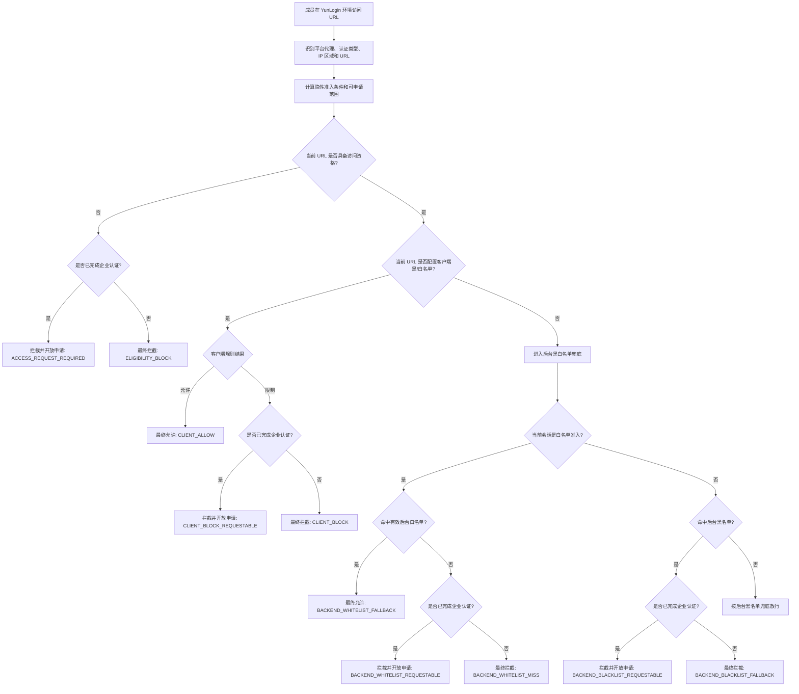

# YunLogin 安全策略生效规则说明

> 文档版本：v1.2
> 规则 ID：RULE-20260828-SECURITY-EFFECTIVE
> 适用产品：YunLogin 客户端、云登后台管理系统
> 适用能力：平台代理环境的后台黑白名单、客户端访问策略
> 文档状态：规则基线
> 最后更新：2026-08-28

## 1. 文档目的

本文统一说明以下两套安全规则如何组合生效：

1. 云登后台管理系统维护的平台代理域名黑名单、白名单；
2. YunLogin 客户端维护的成员级黑名单、白名单访问策略。

最终访问结果由“隐性准入条件、客户端网页规则、后台兜底规则”共同决定。总体原则为：

```text
先识别平台代理、认证类型和本地 IP 区域
  -> 计算当前会话的访问资格与申请资格
  -> 先校验不可绕过的身份/区域准入约束
  -> 对当前网页已配置的 YunLogin 客户端黑白名单规则优先决策
  -> 当前网页没有客户端黑白名单配置时，使用云登后台黑白名单作为兜底
  -> 被拦截网页仅对已认证企业开放访问申请
  -> 输出最终允许或拦截结果
```

本文中的“客户端优先”是指：在当前会话具备访问资格的前提下，当前网页已经配置客户端黑名单或白名单规则时，由客户端优先决定结果；当前网页没有配置客户端黑白名单规则时，才使用后台黑白名单决定默认结果。认证类型、inside/outside、网页访问资格和申请资格属于访问准入约束，不属于普通黑白名单冲突，不能被客户端白名单绕过。

## 2. 适用范围与边界

### 2.1 适用范围

后台黑白名单规则适用于使用平台代理的环境，并作为客户端没有有效命中时的兜底策略。客户端访问策略继续按照策略配置的成员、账号、环境及网页范围优先执行。

### 2.2 暂不推断的范围

以下情况在现有信息中没有明确规则，本文不作默认推断：

- 非平台代理环境是否执行同一套后台黑白名单；
- 企业认证 outside 对非黑名单域名的完整后台兜底范围；当前仅确认“后台黑名单不可访问”；
- 个人认证 outside 对非黑名单域名的完整后台兜底范围；当前仅确认“后台黑名单不可访问”；
- 后台策略、客户端策略或网络服务不可用时采用放行还是拦截；
- 域名、子域名、端口、路径、查询参数和通配符的具体匹配算法。

上述情况进入研发前需要单独确认，不能直接套用本文结论。

## 3. 术语定义

| 术语 | 定义 |
|---|---|
| 后台黑名单 | 云登后台管理系统维护的平台代理禁止访问域名集合 |
| 通用白名单 | 云登后台管理系统维护的基础允许域名集合 |
| 上桥白名单 | 团队申请并审核通过的上桥允许域名集合 |
| 有效后台白名单 | 根据认证类型和本地 IP 区域计算出的当前会话可用白名单集合 |
| 客户端黑名单策略 | YunLogin 客户端按成员、账号、环境等范围配置的策略容器；仅当前 URL 存在显式黑名单网页规则时，才输出客户端黑名单结果 |
| 客户端白名单策略 | YunLogin 客户端按成员、账号、环境等范围配置的策略容器；仅当前 URL 存在显式白名单网页规则时，才输出客户端白名单结果 |
| 客户端已配置网页 | 当前成员、账号、环境和 URL 命中客户端黑名单或白名单网页规则，客户端对该 URL 输出显式结果 |
| 客户端未配置网页 | 当前 URL 没有配置客户端黑名单或白名单网页规则；即使客户端存在其他网页策略，也不视为当前 URL 命中，转入后台兜底 |
| 后台兜底 | 客户端没有有效命中时，使用后台黑白名单计算默认结果 |
| 访问资格 | 根据平台代理、认证类型、本地 IP 区域和审批状态确定当前会话可访问的后台资源范围 |
| 访问申请资格 | 被拦截后是否展示申请入口；本规则仅对已完成企业认证的客户开放 |
| 最终允许 | 通过隐性准入约束，且客户端优先结果或后台兜底结果为允许 |
| 最终拦截 | 未通过隐性准入约束，或客户端优先结果/后台兜底结果为拦截 |

## 4. 总体优先级

安全策略采用“准入约束 > 客户端网页显式规则 > 后台兜底”的执行层级：

```text
优先级 0：隐性准入约束
  0.1 未认证只能访问后台白名单，不能申请白名单外域名
  0.2 outside 会话不能访问后台黑名单
  0.3 inside 会话按认证类型计算可访问白名单和可申请范围

优先级 1：YunLogin 客户端访问策略
  1.1 当前网页已配置客户端白名单或黑名单时，由客户端优先决定
  1.2 客户端白名单和黑名单在同一成员/会话内发生冲突时，白名单优先
  1.3 同时命中多个客户端黑名单时，限制访问优先
  1.4 当前网页未配置客户端黑白名单时，不视为客户端命中，进入后台兜底

优先级 2：云登后台管理系统兜底策略
  2.1 当前网页未配置客户端规则时，后台黑名单命中则拦截
  2.2 当前网页未配置客户端规则时，后台白名单命中则允许
  2.3 当前网页未配置客户端规则且不满足后台白名单时，按当前会话准入规则拦截
```

核心规则：

1. 客户端黑白名单是“当前网页已配置显式规则”时的普通业务访问结果第一决策来源；当前网页未配置客户端黑白名单时，后台黑白名单兜底。
2. 客户端白名单优先于同一成员/会话命中的客户端黑名单；同一成员/会话命中多个客户端黑名单时，任一限制规则都可导致拦截。
3. 客户端显式允许不等于获得访问资格；未认证、inside/outside、审批约束和“仅企业认证可申请”规则仍然有效。
4. outside 会话不能访问后台黑名单中的域名；该规则属于隐性准入约束。
5. 未认证会话只能访问后台白名单，不能对后台白名单外域名发起访问申请。
6. 后台白名单命中不代表一定最终允许；当网页已配置客户端黑名单时，仍可能被客户端优先拦截。
7. 后台普通规则不应反向覆盖已经生效的客户端网页结果；当网页未配置客户端规则时，后台承担兜底决策。
8. 任何网页被拦截后，仅已完成企业认证的客户可以发起访问申请；个人认证和未认证不展示申请入口。申请资格不等于客户端规则命中，审批结果需要回写为客户级白名单/临时例外后重新决策。

## 5. 云登后台管理系统兜底规则

后台黑白名单不是普通业务冲突中的第一优先级，而是在客户端没有有效命中时提供默认结果；同时，认证类型、inside/outside 和申请资格构成访问资格约束。

### 5.1 后台黑名单

在以下已确认的隐性规则场景中，使用平台代理的 outside 会话不能访问后台黑名单域名：

```text
outside + 后台黑名单命中 -> 最终拦截
```

该规则是区域访问资格约束。企业认证 outside 和个人认证 outside 均适用。客户端白名单不能突破该约束。

对于其他认证类型和 inside 会话，后台黑名单是否作为绝对禁止，还是仅在客户端无有效命中时作为兜底，需要以后端实际策略定义为准；本文不在未确认范围内扩展结论。

### 5.2 后台白名单

当客户端没有有效黑白名单命中时，后台白名单作为兜底允许集合。后台白名单是否同时承担“非白名单拦截”，由当前会话的认证类型和本地 IP 区域决定：

```text
客户端无有效命中 + 白名单准入会话 + 命中有效后台白名单 -> 兜底允许
客户端无有效命中 + 白名单准入会话 + 未命中有效后台白名单 -> 兜底拦截
客户端无有效命中 + outside 黑名单准入会话 + 命中后台黑名单 -> 兜底拦截
```

当客户端存在有效命中时，后台普通黑白名单不覆盖客户端结果；后台名单仍用于确认认证、区域和申请状态是否满足访问资格。

### 5.2.1 后台兜底适用条件

后台兜底只处理“当前 URL 没有客户端显式网页规则”的情况。客户端策略本身是否存在，不影响这个判断：

```text
客户端已配置其他网页规则，但当前 URL 无规则 -> 后台兜底
客户端没有任何策略，当前 URL 无规则 -> 后台兜底
客户端当前 URL 有黑/白名单显式规则 -> 客户端优先，后台不改写普通结果
```

因此，不能把“存在客户端白名单策略”直接等同于“所有未配置网页都允许”，也不能把“存在客户端黑名单策略”直接等同于“所有未配置网页都拦截”。

### 5.3 有效后台白名单与申请资格

| 认证类型 | 本地 IP 区域 | 默认可访问范围 | 白名单外申请 |
|---|---|---|---|
| 企业认证 | inside（国内） | 后台通用白名单 + 该客户已申请并审核通过的白名单 | 被拦截网页可申请；审批通过后加入当前客户可访问范围 |
| 企业认证 | outside（境外） | 默认不能访问后台黑名单；其他域名按客户端优先，后台黑名单兜底 | 已认证企业可申请被拦截网页；后台黑名单审批后是否可形成例外，待后端确认 |
| 个人认证 | inside（国内） | 电商等允许个人认证的部分白名单；社媒等不允许个人认证的白名单默认不可访问 | 不开放访问申请 |
| 个人认证 | outside（境外） | 不能访问后台黑名单；其他域名按客户端优先，后台黑名单兜底 | 不开放访问申请 |
| 未认证 | 不区分 | 后台白名单 | 不可以申请后台白名单外域名 |

### 5.4 后台规则的生效说明

1. 企业认证 inside：可访问后台通用白名单和该客户申请且审批通过的白名单；没有在当前白名单中的域名被拦截后，可以发起申请，审批通过后才获得访问资格。
2. 企业认证 outside：默认不能访问后台黑名单域名。被拦截后可展示企业认证客户的申请入口，但审批通过是否可以形成后台黑名单例外，需后端单独确认；在确认前不得自动放行。
3. 个人认证 inside：可访问后台标记允许个人认证的电商等部分白名单；标记为不允许个人认证的社媒等白名单默认不可访问，且不开放访问申请。被拦截网页的申请入口只向已完成企业认证的客户开放。
4. 个人认证 outside：不能访问后台黑名单域名。其他域名先执行客户端有效策略，客户端无有效命中时由后台黑名单作为兜底；被拦截后不开放访问申请。
5. 未认证：可以访问后台白名单中的域名；后台白名单外域名没有申请入口，不能通过审批获得访问，也不能由客户端白名单单独放行。

### 5.5 后台内部名单冲突

后台黑名单与后台白名单同时命中时，后台内部仍以黑名单为限制结果；但该后台结果只作为后台资格/兜底结果参与整体决策，是否被客户端显式规则覆盖，必须先判断该会话是否触发 5.1 所述的硬性区域约束：

```text
outside 硬性黑名单约束命中 -> 拦截
非硬性约束场景 + 客户端有有效显式结果 -> 以客户端结果为先
非硬性约束场景 + 客户端无有效结果 -> 后台黑白名单兜底
```

## 6. YunLogin 客户端优先规则

客户端是普通访问结果的第一决策来源。后台规则不再先行决定普通黑白名单冲突，而是在客户端没有有效命中时兜底；但客户端决策必须受到第 5 章身份、区域和申请资格约束。

### 6.1 客户端白名单优先

同一 URL、同一成员同时配置并命中客户端白名单和客户端黑名单规则时，白名单允许规则优先生效。

示例：

```text
URL：https://www.AAA.com/
白名单策略 A：允许访问
黑名单策略 B：限制访问
作用成员：W

客户端结果：允许访问
```

注意：该允许结果仍需满足当前会话的隐性准入条件。如果会话属于 outside 黑名单硬性约束，或未认证且 URL 不在后台白名单中，最终仍然拦截；除此之外，后台普通黑白名单不反向改写客户端的有效结果。

客户端白名单优先只针对“当前网页已经配置了客户端规则”的情况。客户端白名单策略存在，但当前 URL 没有配置任何客户端黑白名单网页规则时，不视为客户端白名单命中，按第 6.3 节进入后台兜底。

### 6.2 多个客户端黑名单限制优先

同一 URL、同一成员同时命中多个客户端黑名单策略时，只要任一黑名单规则限制访问，最终结果为限制访问。

示例：

```text
URL：https://www.AAA.com/
黑名单策略 A：允许访问
黑名单策略 B：限制访问
作用成员：W

客户端结果：限制访问
```

### 6.3 当前网页未配置客户端规则

客户端黑名单或白名单是按网页规则配置的，不是所有网页都会配置客户端规则。当前 URL 未出现在当前成员、账号和环境的任何有效客户端黑白名单规则中时，视为“客户端未配置该网页”，不直接套用客户端白名单或黑名单的模式默认结果，而是进入后台黑白名单兜底。

```text
当前 URL 有客户端显式黑/白名单规则 -> 客户端优先决定
当前 URL 没有客户端显式黑/白名单规则 -> 后台规则兜底决定
```

该规则适用于“客户端没有配置任何策略”和“客户端已配置其他网页、但没有配置当前网页”两种情况。

这里的“没有配置”按 URL 规则粒度判断，不按策略模式或策略是否存在判断。一个客户端可以同时存在黑名单策略和白名单策略，也可以只配置其中一种；只要当前 URL 没有被任何有效客户端网页规则明确允许或限制，就必须进入后台兜底。

客户端网页规则的合并方式：

1. 当前 URL 命中客户端白名单允许规则时，客户端结果为允许；
2. 当前 URL 命中客户端黑名单限制规则时，客户端结果为拦截；
3. 同一成员/会话同时命中客户端白名单允许和客户端黑名单限制时，白名单允许优先；
4. 同一成员/会话命中多个客户端黑名单时，只要一条规则限制访问，客户端结果为拦截；
5. 当前 URL 仅命中客户端黑名单允许规则时，客户端结果为允许；
6. 只有当前 URL 存在显式客户端规则，以上客户端优先规则才参与决策。

### 6.4 无客户端网页规则命中

当前成员、账号、环境和 URL 未命中任何有效客户端网页规则时，客户端不输出显式业务结果，转由后台黑白名单作为兜底。后台兜底结果依照当前会话的认证类型和本地 IP 区域执行。此时不能把客户端策略模式的默认行为直接当作最终结果。

### 6.5 网页被拦截后的申请规则

申请入口属于拦截后的业务动作，不属于黑名单或白名单本身：

1. 任何一层规则导致网页最终拦截后，只有已完成企业认证的客户可以看到“申请访问”入口。
2. 个人认证客户和未认证客户不展示申请入口，也不能通过客户端白名单、后台白名单或其他前端操作绕过拦截。
3. 企业认证客户提交申请时，申请对象至少绑定客户、成员/账号/环境、网页 URL、当前拦截原因和申请有效期，不能扩大为无范围的全站放行。
4. 企业认证 inside 因未进入当前后台白名单而被拦截时，审批通过后将该域名加入该客户的申请白名单，再重新执行客户端优先和后台兜底判断。
5. 企业认证客户因客户端显式黑名单被拦截时，审批是否生成可覆盖客户端黑名单的临时客户端白名单/访问特例，当前信息尚未确认；在该规则确认前，审批结果不能自动删除或改写客户端显式黑名单。
6. 申请审批通过不改变通用后台白名单，不影响其他客户、成员或环境；到期、撤销或权限回收后重新执行原有规则。

## 7. 跨系统组合规则

### 7.1 决策矩阵

| 会话/准入条件 | 当前网页客户端配置 | 后台兜底结果 | 最终结果 | 说明 |
|---|---|---|---|---|
| 普通会话，无身份/区域硬约束 | 已配置客户端黑名单限制 | 后台白名单 | 拦截 | 当前网页有客户端显式规则，客户端优先 |
| 普通会话，无身份/区域硬约束 | 已配置客户端白名单允许 | 后台黑名单 | 允许 | 客户端已有显式结果，后台黑名单只作为普通兜底，不覆盖客户端结果 |
| outside 会话 | 客户端白名单允许 | 后台黑名单 | 拦截 | outside 不能访问后台黑名单，隐性准入约束优先 |
| 未认证会话 | 已配置客户端白名单允许，但 URL 不在后台白名单 | 后台白名单未命中 | 拦截 | 未认证只能访问后台白名单，不能以客户端白名单获得资格 |
| 已满足当前认证/IP 准入条件 | 已配置客户端黑名单限制 | 后台白名单 | 拦截 | 客户端黑名单优先 |
| 已满足当前认证/IP 准入条件 | 已配置客户端白名单允许 | 后台白名单 | 允许 | 客户端白名单优先 |
| 白名单准入会话 | 当前网页未配置客户端规则 | 命中后台白名单 | 允许 | 后台白名单兜底允许 |
| 白名单准入会话 | 当前网页未配置客户端规则 | 未命中后台白名单 | 拦截 | 后台白名单兜底拦截 |
| outside 会话 | 当前网页未配置客户端规则 | 命中后台黑名单 | 拦截 | outside 黑名单硬约束命中 |
| outside 会话 | 当前网页未配置客户端规则 | 未命中后台黑名单 | 按后台实际规则 | 当前仅确认 outside 黑名单限制，不扩展其他白名单结论 |
| 同一成员/会话 | 当前网页配置客户端白名单允许 + 黑名单限制 | 任一普通后台结果 | 允许 | 客户端内部白名单优先，但仍受隐性准入约束 |
| 同一成员/会话 | 当前网页配置多个客户端黑名单，其中一条限制 | 任一普通后台结果 | 拦截 | 客户端同类黑名单中限制优先 |
| 不同客户端会话 A | 当前网页配置客户端黑名单限制 | 后台白名单 | A 拦截 | A 按客户端黑名单结果执行 |
| 不同客户端会话 B | 当前网页配置客户端白名单允许 | 后台白名单 | B 允许 | B 按客户端白名单结果执行 |
| 任意会话 | 当前网页未配置客户端规则 | 后台黑白名单按认证/IP 计算 | 按后台兜底结果 | 未配置网页不应被错误归入客户端白名单或黑名单 |

### 7.2 指定示例

#### 示例一：客户端黑，后台白

```text
客户端：黑名单限制
后台：白名单命中
最终：拦截
```

#### 示例二：客户端白，后台黑

```text
客户端：白名单允许
后台：黑名单命中
普通会话且无身份/区域硬约束：允许
outside 会话：拦截
```

客户端白名单优先于后台普通兜底结果，但不能绕过 outside 黑名单硬约束，也不能让未认证会话访问后台白名单外域名。

#### 示例三：后台白，客户端 A 黑、客户端 B 白

此处 A、B 表示不同客户端会话或不同成员分别命中不同客户端策略：

```text
后台：两端均满足当前会话准入条件
客户端 A：命中黑名单限制 -> A 最终拦截
客户端 B：命中白名单允许 -> B 最终允许
```

如果 A、B 实际是同一成员、同一会话同时命中的两条客户端策略，则按照客户端白名单优先，客户端结果为允许；但仍不能覆盖后台拦截。

#### 示例四：后台白，客户端白

```text
后台：命中当前会话有效后台白名单
客户端：命中白名单允许
最终：允许
```

## 8. 标准决策流程



## 9. 伪代码

```text
function decideAccess(context, url):
    normalizedDomain = normalize(url)

    eligibility = resolveEligibility(
        context.proxyType,
        context.certificationType,
        context.localIpRegion,
        commonWhitelist,
        approvedBridgeWhitelist,
        normalizedDomain
    )

    if not eligibility.accessAllowed:
        if eligibility.requestable:
            return BLOCK(ACCESS_REQUEST_REQUIRED)
        return BLOCK(ELIGIBILITY_BLOCK)

    clientPolicies = findClientPoliciesInScope(
        context.member,
        context.account,
        context.environment,
        context.occurredAt
    )

    clientRule = findExplicitClientPageRule(
        clientPolicies,
        normalizedDomain
    )

    if clientRule.isConfigured:
        if clientRule.decision == ALLOW:
            return ALLOW(clientRule.reasonCode)
        if eligibility.enterpriseCertified:
            return BLOCK_WITH_REQUEST(clientRule.reasonCode)
        return BLOCK(clientRule.reasonCode)

    if eligibility.fallbackMode == WHITELIST:
        if normalizedDomain in eligibility.effectiveBackendWhitelist:
            return ALLOW(BACKEND_WHITELIST_FALLBACK)
        if eligibility.enterpriseCertified:
            return BLOCK_WITH_REQUEST(BACKEND_WHITELIST_MISS)
        return BLOCK(BACKEND_WHITELIST_MISS)

    if eligibility.fallbackMode == BLACKLIST:
        if normalizedDomain in backendBlacklist:
            if eligibility.enterpriseCertified:
                return BLOCK_WITH_REQUEST(BACKEND_BLACKLIST_FALLBACK)
            return BLOCK(BACKEND_BLACKLIST_FALLBACK)
        return ALLOW(BACKEND_DEFAULT_ALLOW)

    return OUT_OF_SCOPE
```

## 10. 日志与可解释性要求

每次访问决策至少记录以下字段：

| 字段 | 说明 |
|---|---|
| `event_id` | 唯一访问事件编号 |
| `member_id` | 当前成员 |
| `environment_id` | 当前环境 |
| `account_id` | 当前账号 |
| `proxy_type` | 是否为平台代理 |
| `certification_type` | 企业认证或个人认证 |
| `local_ip_region` | 境内或海外 |
| `normalized_domain` | 规范化后的脱敏域名 |
| `eligibility_mode` | 当前会话使用白名单准入、黑名单准入或其他模式 |
| `eligibility_hard_block` | 是否命中不可绕过的身份/区域/申请资格限制 |
| `requestable` | 当前 URL 是否允许发起白名单访问申请 |
| `client_rule_configured` | 当前 URL 是否配置客户端黑名单或白名单规则 |
| `backend_blacklist_hit` | 是否命中后台黑名单 |
| `backend_whitelist_sources` | 命中的通用白名单、个人认证白名单或上桥白名单来源 |
| `backend_decision` | 后台兜底拦截、后台兜底允许或未参与普通决策 |
| `client_policy_ids` | 命中的客户端策略及版本 |
| `client_decision` | 客户端允许或限制 |
| `final_decision` | 最终允许或最终拦截 |
| `reason_code` | 最终判定原因码 |

建议原因码：

| 原因码 | 含义 |
|---|---|
| `BACKEND_BLACKLIST` | 命中后台黑名单 |
| `BACKEND_WHITELIST_MISS` | 未命中当前会话有效后台白名单 |
| `ELIGIBILITY_BLOCK` | 命中身份、区域或申请资格硬约束 |
| `ACCESS_REQUEST_REQUIRED` | 页面已拦截，但已完成企业认证，可发起访问申请 |
| `CLIENT_WHITELIST_ALLOW` | 客户端白名单对当前 URL 显式允许 |
| `CLIENT_BLACKLIST_ALLOW` | 客户端黑名单规则对当前 URL 显式允许，且没有更高优先级的客户端限制 |
| `CLIENT_BLACKLIST_BLOCK` | 客户端黑名单对当前 URL 显式限制 |
| `BACKEND_BLACKLIST_FALLBACK` | 客户端无有效命中，后台黑名单兜底拦截 |
| `BACKEND_WHITELIST_FALLBACK` | 客户端无有效命中，后台白名单兜底允许 |
| `BACKEND_DEFAULT_ALLOW` | 客户端无有效命中，当前会话按后台黑名单兜底规则放行 |

访问日志必须同时展示隐性准入层、客户端层和后台兜底层的判定链，不能只展示最终结果，否则无法解释“客户端黑、后台白”“客户端白、后台黑”“outside 黑名单限制”或“未认证不可申请”等情况。

## 11. 验收用例

| 用例 | 会话与后台配置 | 客户端配置 | 预期结果 |
|---|---|---|---|
| AC-01 | 后台白名单命中，普通会话 | 客户端黑名单限制 | 拦截，原因 `CLIENT_BLACKLIST_BLOCK` |
| AC-02 | 后台黑名单命中，普通会话且无隐性准入硬约束 | 客户端白名单允许 | 允许，客户端结果优先 |
| AC-03 | 后台黑名单命中，企业认证 outside | 客户端白名单允许 | 拦截，原因 `ELIGIBILITY_BLOCK` |
| AC-04 | URL 不在后台白名单，未认证 | 客户端白名单允许 | 拦截，原因 `ELIGIBILITY_BLOCK` |
| AC-05 | 后台白名单命中，满足认证/IP 准入 | 客户端白名单允许 | 允许，原因 `CLIENT_WHITELIST_ALLOW` |
| AC-06 | 后台白名单命中，满足认证/IP 准入 | 同一成员命中客户端白名单允许和黑名单限制 | 允许，原因 `CLIENT_WHITELIST_ALLOW` |
| AC-07 | 后台白名单命中，满足认证/IP 准入 | 两个客户端黑名单分别允许、限制 | 拦截，原因 `CLIENT_BLACKLIST_BLOCK` |
| AC-08 | 企业认证 inside，URL 不在默认后台白名单但可申请 | 客户端白名单允许 | 审批前拦截并可申请，审批通过后按客户端结果判定 |
| AC-09 | 企业认证 inside，URL 在客户申请且审批通过白名单 | 客户端白名单允许 | 允许，进入客户端优先决策 |
| AC-10 | 个人认证 inside，URL 属于社媒等“个人认证 = 否”白名单 | 客户端白名单允许 | 默认拦截，不开放访问申请 |
| AC-11 | 个人认证 inside，URL 属于电商等“个人认证 = 是”白名单 | 无客户端策略命中 | 后台白名单兜底允许 |
| AC-12 | 个人认证 outside，后台黑名单命中 | 客户端白名单允许 | 拦截，原因 `ELIGIBILITY_BLOCK` |
| AC-13 | 个人认证 outside，后台未命中黑名单 | 客户端黑名单限制 | 拦截，原因 `CLIENT_BLACKLIST_BLOCK` |
| AC-14 | 未认证，URL 在后台白名单 | 无客户端策略命中 | 允许，后台白名单兜底允许 |
| AC-15 | 未认证，URL 不在后台白名单 | 无论客户端是否配置白名单 | 拦截，不能发起访问申请 |
| AC-16 | 后台白名单通过 | 客户端无有效命中 | 按认证/IP 对应的后台兜底模式决定 |
| AC-17 | 后台白名单通过 | 客户端 A 黑、客户端 B 白 | A 拦截，B 允许，按各自会话分别计算 |
| AC-18 | 后台白名单通过 | 客户端存在其他网页策略，但当前 URL 未配置黑/白名单规则 | 不视为客户端命中，按后台黑白名单兜底 |

## 12. 待确认事项

以下问题不影响本文已确认的优先级，但会影响研发实现和完整验收：

1. 非平台代理环境是否完全跳过后台黑白名单，仅执行客户端访问策略。
2. 企业认证 outside 和个人认证 outside 对非后台黑名单域名是否采用“黑名单准入”模式；本文仅按当前补充信息确认 outside 黑名单不可访问。
3. 企业认证 inside 可申请的白名单范围、审批角色、审批时长、适用账号/环境和到期规则。
4. 个人认证 inside 对社媒等“个人认证 = 否”白名单的申请范围、审批角色和审批时长。
5. 未认证、认证中、认证失效团队使用平台代理时的默认访问结果。
6. “申请的白名单”与“申请的上桥白名单”是否为同一类资源，及其团队、环境、账号、生效时间范围。
7. 域名匹配是否包含子域名、端口、路径、查询参数和重定向目标。
8. 本地 IP 境内/海外的判定来源、刷新时机及切换网络后的重算机制。
9. 后台名单或客户端策略无法同步时，关键域名采用 fail-closed 还是缓存旧版本。
10. 同一成员同时命中多个客户端白名单策略时，是按允许域名并集计算，还是存在其他优先级。
11. 企业认证客户的申请审批通过后，是否以后台客户白名单、客户端临时白名单或独立访问特例的形式下发。

在上述问题确认前，开发与测试不得自行扩展规则。

## 13. 规则结论

最终生效逻辑可归纳为：

```text
客户端黑白名单是普通访问结果的第一决策来源
后台黑白名单在客户端无有效命中时作为兜底
认证类型、inside/outside 和申请资格先决定访问资格
客户端内部白名单优先于客户端黑名单
客户端多个黑名单中限制优先
仅已完成企业认证的客户可申请被拦截网页，审批通过后按申请结果重新获得资格
未认证只能访问后台白名单，不能申请白名单外域名
最终允许必须同时满足访问资格和客户端或后台兜底允许
```

本文是后台黑白名单与客户端访问策略的专项兼容规则。其他文档中如存在“后台优先”或“客户端禁止优先于客户端白名单”等不同口径，应以后续明确同步后的统一规则为准；本轮仅调整本说明文档，不自动修改其他 PRD。
