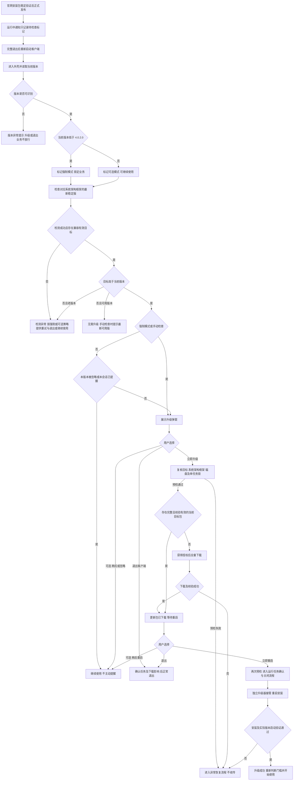
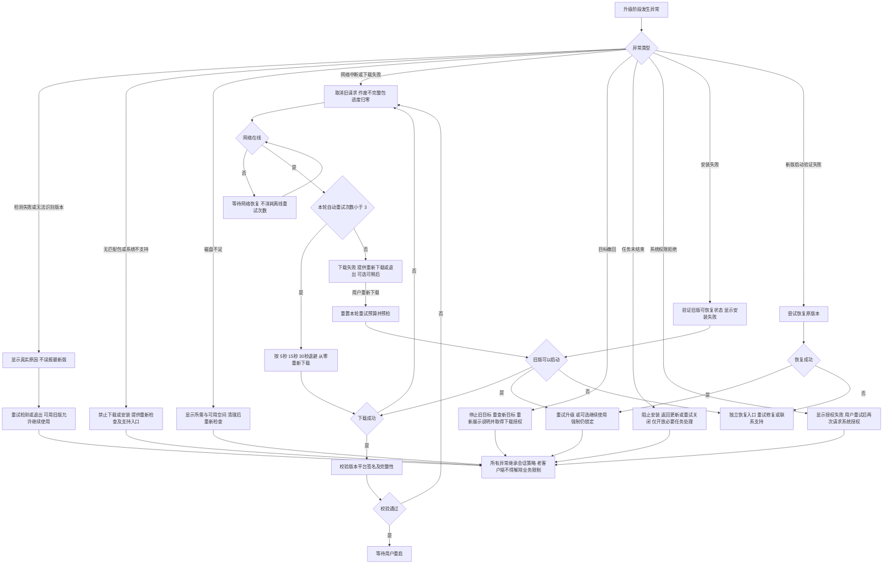
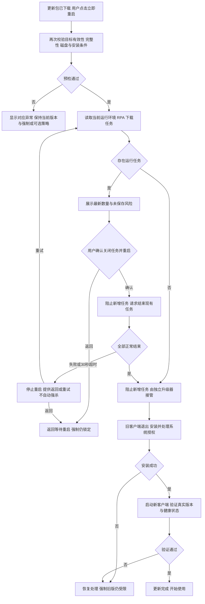

# YunLogin 客户端版本升级产品方案

版本：V1.0 · 2026-09-10 · Windows / macOS

本方案依据《客户端更新升级.md》及本次逐项确认编制。用户确认优先于附件旧流程。本文为产品与交互方案，尚未经过真实安装器、线上版本服务或用户测试验证。版本号、安装包大小与更新内容在原型中均为演示数据，不代表实际最新版本。

## 1. 目标与交付范围

让不可继续使用的老客户端完成升级，同时让仍受支持的旧客户端自主决定升级时机。下载与安装均由客户端升级流程完成，下载完成后经用户确认重启安装。覆盖检测、提示、下载、校验、重启、安装、结果确认及异常恢复。

交付：本方案、独立可交互的弹窗设计评审 HTML、主业务流程与异常流程 Mermaid 源码。评审 HTML 不创建第二套客户端外壳，不接入业务导航；真实产品由现有 SystemFrame 全局弹层承载。服务端仅定义必要的版本发布与更新策略，不制作后台管理页面。

## 2. 已确认规则

| 项目      | 最终规则                                            |
| ------- | ----------------------------------------------- |
| 老版本范围   | Windows、macOS 均为当前客户端版本严格低于 `4.0.2.0`           |
| 可继续使用范围 | `4.0.2.0` 及以上；低于对应平台最新稳定版时为可选升级                 |
| 强制目标    | 当前系统、架构和客户端框架匹配的最新稳定版；不得降级，也不得安装不匹配的包           |
| 强制拦截    | 允许启动并进入客户端外壳，随后全局弹窗锁定业务操作；仅可升级、重试、退出。不是禁止应用进程启动 |
| 提示时机    | 完整退出后重新启动，进入客户端时展示；最小化、恢复窗口不触发新提醒               |
| 运行中通知   | 仅记录新版本通知，下一次完整启动才重新检测和弹窗；不打断当前会话、不自动下载          |
| 可选忽略    | 支持“稍后再说”“不再提醒此版本”；新版本重新提醒；手动检查仍可发现已忽略版本         |
| 下载授权    | 点击“立即升级”后才下载；不预下载、不静默安装、不自动重启                   |
| 下载中断    | 不续传，作废未完成包，自动从 0% 重新下载；完整且校验通过的包可复用             |
| 重启与任务   | 用户确认后关闭环境、RPA、下载等运行任务，再重启升级；强制与可选流程一致           |
| 失败恢复    | 保留可恢复的旧版文件用于重新尝试；低于门槛的旧版仍锁定业务，重新登录进入后再次提示       |

### 2.1 建议默认值（产品建议，研发评审可调整）

- 更新检查超时 10 秒；明确检测失败后显示状态，不无限转圈。
- 单次升级下载最多自动重试 3 次，依次等待 5、15、30 秒；离线时等网络恢复，不空耗次数。超过次数进入“下载失败”，用户可手动开启新一轮重试。手动重试也从 0% 开始。
- 关闭任务超时 30 秒；超时阻止进入安装阶段，不强杀未确认结束的任务。
- 同一启动会话同一版本只主动提醒一次；按“平台 + 架构 + 渠道 + 目标版本”保存忽略偏好，不因重新登录重复提醒可选升级。
- 完整客户端更新不提供“暂停下载”，避免产生续传预期。可选下载支持后台进行；用户完整退出会中断下载，下次启动重新提示，获得授权后从 0% 下载。
- 版本比较使用四段非负整数按段比较，不按字符串或小数比较。低版本提示中的门槛固定为本期确认的 `4.0.2.0`；若未来调整门槛，需重新配置并验证强制分支。

## 3. 判断与提醒规则

### 3.1 决策顺序

1. 启动时读取当前版本及系统、CPU/安装架构、框架和渠道，开始检查。未确定是否低于门槛之前，不开放业务操作。
2. 若当前版本 `< 4.0.2.0`，立即标记本会话强制模式。检查失败、离线、未匹配到可用安装包都不能解除限制。
3. 若当前版本 `>= 4.0.2.0`，本会话允许使用；查不到更新时提示检查失败或稍后重试，不能误判“已是最新版”，也不能误设强制锁定。
4. 获取对应平台已正式发布、未撤回且兼容的最新稳定版。目标高于当前版本才升级；目标不高于当前版本时，可用客户端显示“当前已是最新可用版本”。若当前版本低于门槛而无合法目标，显示“暂未获取到可用更新”，仍保持锁定。
5. 可选升级先判断本版本是否被忽略、此次启动是否已提示；手动检查绕过提醒抑制。运行中发布通知只保存待检查标记，不触发弹窗或改变当前会话权限。
6. 检查完整缓存包。可复用的包仅在仍是当前有效目标、系统匹配、签名及完整性通过时进入“更新包已下载”；可选提醒被忽略时不擅自展示。未完成或校验失败的包必须重下。

版本异常（无法解析、缺失或不可信）不当作最新版；显示“无法识别当前版本”，保留升级与退出入口，等待修复。服务端不能用一个跨平台“全局最新版本号”替代 Windows/macOS 各自目标。

### 3.2 登录与业务边界

检测可在登录前启动，提示落在进入客户端后的全局层。强制模式：背景不可交互、锁定滚动、禁用快捷键启动环境/任务和业务深链，不能通过关闭遮罩、Escape、其他窗口或接口绕过限制。可访问登录恢复、网络诊断、更新、退出等维持升级所必需的能力。已知老版本的登录成功不代表可以调用业务。

同一运行会话收到更新通知时不新增强制拦截；执行门槛策略的启动会话与服务端鉴权应保持一致，避免一面承诺不中断、一面提前拒绝会话请求。重新启动或已锁定老客户端重新登录后重新执行强制校验。

## 4. 产品设计与弹窗文案

视觉引用 `design.md` §5.1、§5.6：居中 760px Modal、最大 92vw、圆角 8px、30% 黑色遮罩；标题 16px/600，正文 13px，辅助 12px，版本和进度为等宽数字。内容 padding 32px 24px，底栏顶部分隔线、按钮居右、间距 12px、32px 高、4px 圆角；主按钮为 primary，次按钮白底描边。顶部 × 仅出现在允许关闭的状态。

所有弹窗支持键盘焦点圈定及明确可读标题；进度数字不逐帧打断读屏，状态切换用礼貌播报。强制弹窗无 ×、无忽略选项，遮罩与 Escape 无效；“退出客户端”关闭应用，不返回业务首页。

|编号/场景|标题与正文|操作与行为|
|---|---|---|
|U01 强制升级|**当前版本过旧，请升级后继续使用**。当前版本 {current} 已不再支持使用。请升级至 {target}，完成后即可继续使用 YunLogin。展示系统、目标版本、包大小、发布日期及更新内容|退出客户端（次）／立即升级（主）；下载前预检|
|U02 可选升级|**发现新版本 {target}**。升级以体验新功能和改进。你也可以稍后升级，继续使用当前版本。展示当前/目标版本与发布说明|稍后再说（次）／立即升级（主）；勾选“不再提醒此版本”，点击稍后或 × 保存；立即升级清除本次忽略选择|
|U03 下载中|**正在下载更新**。正在下载 YunLogin {target}，显示百分比、已下载/总大小。辅助：下载中断后将重新下载，不支持断点续传|强制：退出客户端；可选：后台下载（关闭弹窗，任务仍运行）／退出客户端；业务入口显示下载进度|
|U04 网络中断|**网络连接已断开**。网络恢复后将自动重新下载，下载进度从 0% 开始|退出客户端；可选另有稍后再说，关闭提示但不取消已授权的自动重试|
|U05 自动重试|**下载中断，正在准备重新下载**。将在 {seconds} 秒后从 0% 重新下载。自动重试 {attempt}/3|退出客户端；可选可关闭到后台；不能用损坏文件跳过下载|
|U06 下载完成|**更新包已下载，重启后完成升级**。YunLogin {target} 已准备就绪。重启将关闭当前客户端，请先保存工作|强制：退出客户端／立即重启；可选：稍后重启／立即重启；此时尚未安装，不能称“已更新”|
|U07 运行任务确认|**关闭运行任务并重启？**。当前有 {environmentCount} 个浏览器环境、{rpaCount} 个 RPA 任务和 {downloadCount} 个下载任务。重启会关闭这些任务，未保存的内容可能丢失。请确认已保存工作|返回（次）／关闭任务并重启（主）；确认时重新读取实际任务，逐项请求结束；取消返回 U06，强制模式仍锁定|
|U08 关闭任务中|**正在关闭运行任务**。正在结束运行任务，请稍候。结束后将重启并安装更新|按钮禁用；任务结束失败进入 E07，不进入安装、不擅自强杀|
|U09 重启安装中|**正在安装更新**。正在安装 YunLogin {target}，完成后将自动启动。请勿关闭电脑|由升级器窗口展示，不依赖已关闭的客户端进程；无取消，不显示伪百分比|
|U10 升级成功|**YunLogin 已更新至 {target}**。客户端升级已完成，可以继续使用|开始使用；必须确认实际运行版本及启动健康状态，不仅依据安装器退出码|
|U11 已是最新版|**当前已是最新可用版本**。当前版本 {current}，暂时没有适用于此设备的更新|知道了；主要用于手动检查|
|U12 退出确认|**确认退出客户端？** 下载进行中：退出会中断本次下载，下次升级将重新下载。准备就绪：已下载的完整更新包将保留。若存在任务，补充任务数量及未保存风险|返回／退出客户端；确认后按应用正常退出流程关闭任务；退出失败不能伪造已退出|

### 4.1 异常文案与恢复动作

|编号|提示文案|操作与恢复|
|---|---|---|
|E01 检测超时/服务异常|暂时无法检查更新。请检查网络连接后重试。老版追加：当前版本过旧，完成升级后才能继续使用|重试检查；强制可退出，可选可继续使用；不能写“已是最新版”|
|E02 磁盘不足|磁盘空间不足，无法下载或安装更新。需要可用空间 {required}，当前可用 {available}。请清理空间后重试|重新检查／退出或稍后；按实际下载盘、暂存盘、安装盘分别检查；不要显示“新版本已就绪”|
|E03 无匹配安装包|暂未找到适用于当前设备的更新包。请稍后重试或联系支持|重新检查／退出或稍后；不建议用户跨架构强装，不回退到低于门槛的可用目标|
|E04 文件校验失败|更新包校验失败，将重新下载，请稍候|删除或隔离异常包，计入自动下载重试次数；重复失败用 E05；签名异常不可忽略|
|E05 自动重试用尽|更新包下载失败，已自动重试 3 次。请检查网络后重新下载|重新下载／退出或稍后；新一轮从 0% 开始|
|E06 目标版本撤回|此更新版本暂不可用，正在重新检查可用版本|禁止安装已撤回包；新目标必须重新展示版本说明并获得立即升级授权；强制不解锁|
|E07 任务关闭失败|部分任务未能关闭，暂时无法重启升级。请检查运行任务后重试|返回更新／重试关闭；允许受限任务管理进行保存、停止、退出，不开放其他强制锁定业务|
|E08 权限未授权|未获得安装更新所需权限。请授权后重试|重试安装，重新进入系统授权；不绕过系统授权。可选可返回旧版，强制仅返回升级限制页|
|E09 安装失败|更新安装未完成，已保留可恢复的原版本，请重试升级|重试安装／退出；可选可继续使用可启动旧版。只在确认可恢复后使用“已保留”文案；文件有效可复用，否则重新下载|
|E10 重启/启动验证失败|新版本未能正常启动，正在尝试恢复原版本|恢复成功后显示真实结果：已恢复至 {old}，请重试升级；强制仍锁定；恢复失败：客户端恢复失败，请联系支持修复，并提供错误编号和重试入口|
|E11 无法识别版本|无法识别当前客户端版本，请重新检查或联系支持|重新检查／退出；无法安全判断时不宣布版本受支持|

“联系支持”复用现有帮助渠道，具体链接由客户端配置提供；方案不编造客服电话或下载地址。原型只演示提示，不发送日志、不真实结束进程或下载包。

## 5. 升级状态与生命周期

|状态|进入条件|退出条件|
|---|---|---|
|CHECKING 检测中|完整启动、手动检查或检测重试|解析版本、目标与更新策略；失败进入检查异常|
|PROMPT 待用户决定|存在更新且满足提醒规则|立即升级→预检；可选跳过→继续使用；强制退出→退出流程|
|PREFLIGHT 预检|点击升级|目标仍有效、系统/架构/框架匹配、磁盘足够、单任务锁可用→下载或复用已验证完整包|
|DOWNLOADING 下载中|授权且预检通过|完整→VERIFYING；中断→RETRY_WAIT；完整退出→清理不完整包|
|RETRY_WAIT 等待重下|断网/连接中断/可重试下载错误|联网且退避到期→从零下载；预算用尽→DOWNLOAD_FAILED|
|VERIFYING 校验中|下载结束|签名、摘要、版本和平台均通过→READY；失败清理并重下|
|READY 等待重启|完整包已验证|用户立即重启→再次验证、任务确认；可选稍后→保留完整包|
|CLOSING_TASKS 关闭任务|用户明确确认|任务全部结束→重启安装；失败或超时→任务异常|
|INSTALLING 安装中|升级器接管、旧进程退出|成功→启动验证；失败→恢复旧版与错误提示|
|VERIFYING_START 启动验证|新进程启动|实际版本/健康检查通过→完成；失败→恢复处理|
|COMPLETED 完成|运行目标版本并确认可用|记录结果并开始使用|

强制/可选是当前启动会话的使用策略，不是下载状态；任何失败页都继承它。返回、重新登录、重试、应用恢复不能把强制误转可选。新进程验证成功后重新判断门槛，才解除旧版限制。

### 5.1 下载与文件规则

- 一个客户端只允许一个升级任务，同一目标的重复点击复用任务；双进程由安装器/升级服务互斥，不创建多个下载/安装。
- 未完成文件不续传，包括网络断开、下载进程崩溃、退出应用或机器重启；清理部分文件后使用全量请求重新下载，不发送分段续传请求。重新下载后进度、已下载字节重新归零。
- 网络恢复不等于旧请求仍可回写。每次下载有独立任务代次，旧请求的迟到进度或完成通知不得覆盖新一轮状态。
- 下载完成只是 READY，不修改在用程序。立即重启时再次检查目标是否撤回、安装包匹配/完整、磁盘和权限；重启安装前保留恢复所需文件。
- 完整、校验通过且目标仍有效的缓存包可复用。不能把“不续传”理解为每次都强制丢弃完整包，也不能把不完整包标记成 READY。
- 安装方式和恢复机制必须分别在 Windows/macOS 验证；若旧客户端本身没有内置升级能力，需要先明确旧版可执行的升级桥接方案，不能认为产品配置即可赋予旧程序新功能。

### 5.2 任务与退出规则

可选下载可放后台，任务继续运行；准备就绪后用户主动决定重启。没有运行任务时，点击“立即重启”已经构成重启同意，可直接进入重启安装。存在任务则必须展示最新数量，不能使用检测时的旧快照。

强制模式中的“返回更新”不恢复普通业务访问。为保存、停止既有任务，可进入严格受限的任务处理视图；禁止启动新任务。确认关闭到安装开始之间禁止新增任务，关闭失败不得继续安装。关闭窗口/快捷键退出与按钮退出统一经过应用退出协调器，不能绕过运行任务告知。升级器接管前失败均可回到更新流程。

## 6. 服务端与客户端职责

|角色|职责|
|---|---|
|发布运营|先完成官网对应安装包稳定验证，再发布客户端更新；填写版本说明、平台架构范围和正式发布时间；撤回异常发布|
|版本服务|按系统/架构/框架/渠道返回最新有效稳定目标、包大小、完整性校验与签名信息；提供稳定发布身份；已撤回目标不得安装|
|客户端|读取本机版本，执行门槛和提醒偏好、预检、下载、缓存、界面状态、任务关闭确认、启动验证结果展示|
|独立升级器|在主程序退出后执行安装，处理系统权限、文件替换、失败恢复与新客户端启动；留下必要恢复状态|
|业务服务|配合启动会话门槛控制业务权限，维持登录、更新及修复能力；不能仅依赖遮罩实现强制更新|

建议版本响应字段：`release_id`、`target_version`、`platform`、`arch`、`framework`、`channel`、`min_os_version`、`package_size`、`download_url`、`sha256`、`signature`、`release_notes`、`published_at`、`withdrawn`。这些字段是接口设计要求，不代表当前接口已存在。版本/包映射缺失时返回明确无兼容更新，不返回错误平台包。

偏好仅存忽略版本、作用范围和必要更新时间；不包含账号密码。任务持久化保存状态、目标身份、完整包校验结果及恢复线索；不保存可跨用户泄露的环境凭证。启动时重新验证持久化状态，不信任 READY 字符串。更新发布内容以纯文本展示，不执行发布说明中的 HTML/脚本。

## 7. 流程图

查看图形：[主业务流程 SVG](./主业务流程.svg) · [异常恢复流程 SVG](./异常恢复流程.svg) · [重启与任务处理流程 SVG](./重启与任务处理流程.svg)

可编辑源文件：[主业务流程](./主业务流程.mmd) · [异常恢复流程](./异常恢复流程.mmd) · [重启与任务处理流程](./重启与任务处理流程.mmd)

### 主业务流程

### 异常恢复流程

### 重启与任务处理流程

## 8. 验收清单

|编号|场景|预期|
|---|---|---|
|A01|Win/macOS 当前 4.0.1.9、4.0.2.0、4.0.2.1|分别强制、可选或最新、可选或最新；严格边界正确|
|A02|4.0.10.0 对比 4.0.2.0|按整数分段比较，不能误判老版本|
|A03|已知老版，检测超时/断网/无包|进入外壳但业务锁定，显示对应错误；可重试/退出，重新登录仍锁定|
|A04|可用旧版，检测失败|允许继续使用，不声称已最新版|
|A05|收到在线通知、窗口最小化后恢复|不新增提醒、不开始下载、不关闭任务；下次完整启动检查|
|A06|稍后再说、忽略本版本、发现更高版本|本会话不重复；忽略该目标后下次启动不提醒；新目标重新提醒，手动检查可查到忽略目标|
|A07|只打开提醒不点击立即升级|无安装包下载、无安装或重启|
|A08|下载 60% 断网后恢复|从 0% 重新下载，旧回调不覆盖进度；无续传请求|
|A09|连续失败与自动重试用尽|按 5/15/30 秒重试 3 次；预算用尽转人工重试，不无限自动循环|
|A10|磁盘不足、系统/架构不匹配、签名错误|阻止进入不安全阶段，提示真实原因，强制不解锁|
|A11|下载成功|显示等待重启，不提前报告更新完成；可选可稍后并复用有效完整包|
|A12|点击重启，有任务/任务关闭失败|确认当前数量；用户同意后关闭；失败不安装；无任务不重复确认|
|A13|强制模式返回/遮罩/Escape/快捷键|不能进入普通业务，退出需走正常退出协调流程|
|A14|目标撤回|停止安装，重新检测；变更目标须重新同意|
|A15|拒绝系统权限、安装失败、新版启动失败|进入真实错误/恢复状态；保留或恢复旧版，老版依旧锁定，不自动放行|
|A16|升级完成|实际运行目标版且健康检查通过，才解锁并报告成功|
|A17|关闭后再次完整启动，部分包/完整包|部分包重下；完整包有效可复用，但不未经确认自行重启安装|
|A18|重复点击、两个实例同时升级|仅一个升级任务；按钮反馈处理中，无重复安装|
|A19|760px/1280px 屏幕及键盘操作|弹窗不裁切，长更新说明独立滚动；焦点圈定、允许关闭时恢复焦点|

## 9. 发布前研发确认与指标

待技术评审：低于 4.0.2.0 的实际版本是否具备弹窗拦截、完整包下载和重启安装入口；Win/mac 各安装器/架构/框架的覆盖清单；系统最低版本；任务可安全结束的边界与超时行为；恢复文件存储容量；升级失败后的独立恢复入口。以上是实施依赖，不是已验证能力。

建议埋点：检查结果、提示曝光（强制/可选）、稍后/忽略、下载授权、从零重试次数、校验失败原因、READY、重启同意、任务关闭失败、安装结果、恢复结果、实际运行版本。记录 release_id、平台、阶段与脱敏错误编号，不上报环境账号或用户任务内容。

观察指标：符合条件启动会话的提醒覆盖率、主动升级点击率、下载完成率、自动重试恢复率、重启安装成功率、启动验证成功率、强制升级无法完成率。尚无线上数据，不给出虚构的成功率或耗时结论。

## 10. 对附件的修正

1. 删除自动静默下载与后台静默安装；统一用户点击后下载，经确认重启才安装。
2. 删除所有中断续传路径；改为从零重下、等待网络恢复和有界自动重试。
3. 区分强制锁定与可选继续使用；“保留旧版”不等于允许老版本业务访问。
4. 不在运行中立即弹更新提示；下次完整启动检查。
5. 磁盘不足不能提示“已就绪”；下载成功不能提示“升级完成”。
6. 重新绘制真正的异常决策与恢复流程，不沿用附件重复的角色职责图。
