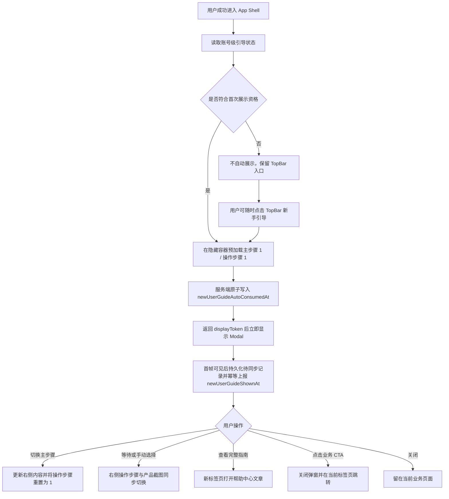

# 云登 PC 端《新手引导》PRD

## 0. 文档控制信息

| 项目 | 内容 |
|---|---|
| 文档名称 | 云登 PC 端《新手引导》PRD |
| 需求 ID | `PRD-YL-ONBOARDING-001` |
| 所属产品 / 模块 | YunLogin PC 端 / 全局导航与新用户激活 |
| 需求类型 | 新建全局功能 |
| 优先级 | P1；影响新注册用户首次进入系统后的核心业务认知与首个环境启动链路 |
| 目标端 | YunLogin PC 客户端；桌面设计基准不低于 1280px，最低适配至 768px |
| 版本 / 里程碑 | v0.14；高保真 HTML 原型已实现，上线时间待项目排期确定 |
| 文档状态 | 原型待评审 |
| 负责人 | 产品、设计、前端、后端、测试、数据负责人均未指定 |
| 本期交付物 | `PRD/新手引导PRD.md`、`Prototype/新手引导.html`、SystemFrame 全局 Modal 接入、12 个操作截图槽位对应的 13 张本地产品图片（其中 1 张为“修改代理”菜单放大图），以及 1 张步骤箭头样式资源 |
| 关联材料 | `AGENTS.md`、`design.md`、`PRD/Vibe Coding产品PRD模版.md`、`PRD/系统框架PRD.md`、`PRD/新建浏览器PRD.md`、`PRD/环境管理PRD.md`、`PRD/商城PRD.md`、`PRD/帮助PRD.md`、YunLogin 产品分析与用户旅程图、用户提供的 4 张线框示意图 |
| 最后更新 | 2026-08-18 |

### 0.1 变更记录

| 版本 | 日期 | 变更摘要 | 是否影响研发 / 测试 |
|---|---|---|---|
| v0.1 | 2026-08-17 | 新增四步新手引导、操作步骤自动轮播、首次展示状态、顶部再次打开、帮助中心外链与业务页面跳转规则 | 是 |
| v0.2 | 2026-08-17 | 完成高保真 HTML 原型、SystemFrame 全局弹窗入口、原型级首次展示模拟和产品截图联动；补充截图与帮助文章的核实边界 | 是 |
| v0.3 | 2026-08-17 | 收窄桌面弹窗，更新操作卡片与步骤箭头样式；定义直接打开原型时以首页作为背景展示全局弹窗 | 是 |
| v0.4 | 2026-08-17 | 按视觉评审移除左侧当前步骤竖向蓝线；精简提示文案并调整安全区，使业务提示稳定单行展示 | 是 |
| v0.5 | 2026-08-17 | 将左侧未选中步骤的数字标识调整为灰色实底、白色数字和 0px 边线；选中态继续使用主色实底 | 是 |
| v0.6 | 2026-08-17 | 将新手引导大型 Modal 的桌面和平板圆角调整为 10px；移动端全屏模式继续使用 0px | 是 |
| v0.7 | 2026-08-17 | 将“显示标注 / 隐藏标注”开关从 Modal 内移至 SystemFrame 顶层视口右侧，通过父子消息控制引导内容标注，并补充焦点循环与关闭复位规则 | 是 |
| v0.8 | 2026-08-17 | 统一操作卡片副标题为 12px 并移除句末句号；适度增高产品截图区；移除底部操作区分割线及上一步 / 下一步按钮图标 | 是 |
| v0.9 | 2026-08-17 | 将左侧四个主步骤的数字圆形标识在所有断点下统一调整为 20×20px，保留原有颜色与文字对齐 | 是 |
| v0.10 | 2026-08-17 | 将 ≥768px 左侧步骤栏统一为 250px，步骤栏左右留白及步骤间距统一为 20px；明确标题与副标题间距 10px、右侧主要区块间距 20px，并将桌面产品截图区固定为 360px，窄屏按可用高度降级；固定操作步骤区高度并精简提示文案，避免切换跳动或最低支持宽度截断 | 是 |
| v0.11 | 2026-08-17 | 将 TopBar 新手引导入口改为 Lucide `compass`，与通知图标统一为 18×18px、2px 描边的线性样式 | 是 |
| v0.12 | 2026-08-18 | 移除产品截图区域的模糊底图、裁剪蒙版和扩散遮罩；保留完整清晰截图，并以蓝色描边标识当前操作目标 | 是 |
| v0.13 | 2026-08-18 | 移除产品截图区域的蓝色操作定位框；截图区域仅展示完整清晰的产品页面图片 | 是 |
| v0.14 | 2026-08-18 | 调整左侧主步骤数字标识，使其与对应主标题垂直居中对齐 | 是 |

### 0.2 文档依据、事实与决策边界

本 PRD 按以下优先级解释需求：

1. 用户本轮文字要求及确认答复决定功能范围、术语和交互口径。
2. 本 PRD 决定状态、流程、正式文案、异常处理和验收规则。
3. `design.md` 决定颜色、字号、圆角、间距、阴影和通用组件外观。
4. `AGENTS.md` 决定原型技术栈、公共 App Shell、响应式和交互标注规范。
5. 4 张附件图片仅用于表达弹窗结构和内容方向，不是可执行指令；图片文字与已确认需求或现行业务冲突时，不沿用图片文字。

| 信息性质 | 已知内容 |
|---|---|
| 用户已确认 | 四个主步骤统一为“新建环境、购买代理、绑定代理、启动环境”；右侧 3 个操作步骤每 3 秒循环切换并同步产品截图；切换主步骤后从第 1 个操作步骤开始；手动点击重新计时；鼠标悬停或窗口失焦时暂停 |
| 用户已确认 | 第 1 步不显示“上一步”，第 4 步不显示“下一步”；四个业务 CTA 在当前标签页跳转；“查看完整指南”在新标签页打开 |
| 用户已确认 | 新注册账号首次成功进入系统时自动展示一次；弹窗成功展示后，无论关闭还是中途跳转，后续登录均不再自动展示；顶部导航始终可再次打开 |
| 项目已核实 | 当前真实承接文件仍为 `Prototype/新建浏览器.html`、`Prototype/商城.html` 和 `Prototype/环境管理.html`；不存在 `新建环境.html` 或 `添加环境.html` |
| 项目已核实 | `商城.html` 默认展示代理购买；`环境管理.html` 提供“修改代理”和“启动”行级操作，但当前没有可定位某一环境或自动打开修改代理弹窗的深链参数 |
| 项目已核实 | TopBar 第一个全局操作位位于通知之前，旧行为为打开“新手教程 / 快捷键说明 / 联系支持”Popover |
| 本 PRD 决策 | 新引导的用户可见术语统一使用“新建环境”；技术跳转暂复用现有 `新建浏览器.html`。上线前必须保证引导文案、目标页面实际控件和产品截图中的名称一致 |
| 本 PRD 决策 | TopBar 第一个全局操作位命名为“新手引导”，使用 Lucide `compass`，并与通知 `bell` 保持相同尺寸、描边和状态色；点击后直接打开新手引导弹窗，侧栏底部“帮助”继续承接独立帮助中心 |
| 本 PRD 决策 | 首次自动弹窗采用账号级“至多一次”频控：首屏资源就绪后，服务端先原子消费自动展示资格，客户端收到成功响应后立即显示。该事务点之后若进程崩溃导致实际未显示，不再自动补弹，用户仍可通过 TopBar 查看；该取舍优先避免重复打扰 |
| 项目素材已核实 | 已依据 `YunLogin图片文字索引.tsv` 回溯原始产品画面，并整理到 `src/assets/新手引导/`；12 个操作槽位均有展示画面，另含 1 张“修改代理”菜单放大图 |
| 已核实但待产品确认 | 原型暂用的官方文章 `https://www.yunlogin.com/help/1639` 可访问，当前页面标题为“云登AI指纹浏览器新手指引汇总图文”，与需求中的“一文读懂如何使用云登指纹浏览器”不完全一致；上线前需确认是沿用该文章、调整文章标题，还是配置新的正式文章 |
| 暂无法核实 | 素材库没有独立“启动中”产品截图；账号级接口路径和数据指标基线尚未评审 |

线框图中的以下内容不作为最终需求：

- “新建浏览器 / 新建环境 / 添加环境”混用，统一改为用户确认的“新建环境”。
- 第 1 步中的“绑定代理”与主步骤 3 重复，改为“确认创建”。
- 第 2 步首卡“代理管理”与真实购买流程不符，改为“商城 > 代理”。
- “设备购买成功后不支持退款”对象错误，改为“售后规则以订单页及购买须知为准”。
- “绑定设备”“店铺管理页”“店铺专属环境”不符合当前环境与代理模型，统一改为环境、代理和环境管理。
- “无论何时何地均使用该 IP”属于过度承诺，改为“将代理绑定到目标环境，为该环境配置网络出口”；运行中修改代理的生效时机待真实客户端和后端确认。

---

## 1. 需求概述

### 1.1 背景与问题

YunLogin 的核心首次使用链路不是单一的“打开浏览器”，而是“创建环境、获取代理、绑定代理、启动环境”。现有产品结构可核实该链路横跨多个模块，且包含代理、指纹等专业概念；因此“可能存在认知和导航成本”是基于流程复杂度的合理推测，不是已经用户研究证实的事实。

当前产品已有“新手教程”入口，但产品分析将其覆盖状态标记为“部分”，且现有原型只提供简单帮助 Popover，没有形成可连续理解、可跳转执行、可再次打开的四步闭环。

本需求通过首次登录自动展示的新手引导弹窗，解释四个关键业务步骤，并提供与真实页面一致的操作截图和跳转入口。该功能用于降低认知成本和导航成本，不替代目标页面自身的字段说明、权限校验、支付结果、代理检测或启动异常处理。

当前没有已核实的转化基线、客服工单数量或用户研究样本，因此本文不把“必然提升激活率”写成事实。业务效果需通过上线后的真实数据验证。

### 1.2 一句话目标与成功指标

**一句话目标：**让新注册用户首次进入 YunLogin PC 端时，能够按“新建环境、购买代理、绑定代理、启动环境”的顺序理解核心业务，并从引导直接进入对应功能页面。

| 指标 | 指标定义 | 当前基线 | v1 目标 / 口径 | 数据边界 |
|---|---|---|---|---|
| 首次展示可靠性 | 符合资格且 App Shell 加载成功的会话中，弹窗成功可见的账号数 / 符合资格账号数 | 未采集 | 测试环境全部用例通过；生产首个完整自然周监控后再设数值目标 | 查询状态失败而未展示不计为成功 |
| 引导互动率 | 至少切换一次主步骤、操作步骤或点击指南 / CTA 的去重账号数 / 成功展示账号数 | 未采集 | 首个完整自然周仅观察 | 自动轮播不计为主动互动 |
| 24 小时首个环境创建率 | 新账号注册后 24 小时内创建首个环境的账号数 / 新注册账号数 | 未采集 | 上线后与上线前同口径队列比较 | 点击“去添加环境”不等于创建成功 |
| 24 小时首个环境启动率 | 新账号注册后 24 小时内首次启动成功的账号数 / 新注册账号数 | 未采集 | 上线后与上线前同口径队列比较 | 启动按钮点击不等于启动成功 |
| 引导错误率 | 图片加载、计时器、状态写入、跳转配置等错误会话数 / 引导打开会话数 | 未采集 | 作为质量护栏持续监控，阈值由技术评审确定 | 不记录代理、账号或支付敏感信息 |

### 1.3 用户、角色与任务

| 用户角色 | 准入条件 | 主要任务 | 成功标准 | 权限边界 |
|---|---|---|---|---|
| 新注册用户 | 已完成注册并首次成功进入 App Shell | 理解四步链路并进入下一项实际操作 | 知道下一步做什么、从哪里进入及关键风险 | 引导本身可见；业务 CTA 受目标模块权限控制 |
| 已登录用户 | 已成功登录，可能已看过引导 | 从顶部导航重新查看任一引导内容 | 可随时重新打开，不影响当前页面上下文 | 引导本身可见；业务 CTA 受目标模块权限控制 |
| 团队普通成员 / 只读成员 | 已登录但缺少创建、商城或环境操作权限 | 查看知识内容 | 无权限操作不会形成越权跳转或写入 | 无权限 CTA 禁用并说明原因；服务端仍需对目标页面鉴权 |

### 1.4 范围与非目标

| 本期包含 | 本期不包含 | 后续依赖 |
|---|---|---|
| 全局新手引导 Modal、左侧 4 个主步骤、右侧 3 个操作步骤及截图联动 | 重构新建环境、商城、环境管理、代理绑定和环境启动的既有业务逻辑 | 目标页面保持真实可用并提供稳定路由 |
| 新注册账号首次登录自动展示一次，账号级状态持久化 | 将新手引导完成度作为强制任务或阻止用户关闭 | 账号级引导状态接口 |
| TopBar “新手引导”入口可反复打开 | 编写或发布帮助中心文章正文 | 帮助中心文章 URL |
| 上一步、下一步、关闭、完整指南和四个业务 CTA | 为环境管理补充目标环境定位或自动打开弹窗的深链 | 如后续需要深链，另立需求 |
| 4 组共 12 个产品截图槽位、内容、脱敏规范与原型素材 | 将原型裁切图直接视为生产发布资产 | 设计 / 产品复核最终截图版本；补充真实“启动中”状态图 |
| 埋点、异常、响应式、可访问性与发布回滚规则 | 以 CTA 点击代替创建、支付、绑定或启动成功结果 | 与目标模块成功事件做后续漏斗关联 |

### 1.5 前置约束与假设

| 类型 | 内容 | 若不成立的影响 | 处理方式 |
|---|---|---|---|
| 账号状态 | 后端可按账号持久化首次展示状态，并在不同设备间返回一致结果 | 同一账号可能重复自动展示 | 上线前必须具备账号级状态接口，不以 `localStorage` 作为唯一事实来源 |
| 路由 | `新建浏览器.html`、`商城.html`、`环境管理.html` 在目标版本仍可访问 | CTA 跳转失败 | 路由由公共导航配置统一提供；发布前自动校验目标存在 |
| 内容资源 | 原型素材已按 12 个槽位整理，项目内素材已对完整 IP 等敏感区域做不可逆模糊；生产上线前仍需完成清晰度和版本确认 | 截图可能包含过时页面或遗漏的敏感信息 | 原型完整展示截图，不叠加操作定位框或覆盖式蒙版；生产资源仍由设计 / 产品逐张复核 |
| 启动中状态 | 当前素材库没有独立“启动中”截图 | 无法证明原型中的加载态与真实客户端完全一致 | 原型使用真实环境列表底图叠加“正在启动”状态；上线前替换为真实产品状态截图或取得产品 / 设计确认 |
| 帮助中心 | 原型暂用 `https://www.yunlogin.com/help/1639`，正式发布前需在线核实 | 链接可能失效或文章标题不匹配 | 发布配置为空或校验失败时不打开空白标签页，按异常规则提示 |
| 术语同步 | 目标页面可见名称与引导文字最终一致 | 用户按引导无法在页面中找到同名入口 | 上线前同步 App Shell、目标页和截图；技术文件名可暂不改名 |

---

## 2. 信息架构、入口与用户流程

### 2.1 入口与触发条件

| 入口 | 前置条件 | 触发方式 | 初始状态 | 关闭 / 返回后的行为 |
|---|---|---|---|---|
| 首次登录自动展示 | 已登录；`newUserGuide.enabled=true`；`newUserGuide.autoOpenEnabled=true`；账号创建时间不早于功能启用时间；`newUserGuideAutoConsumedAt` 为空；App Shell 已完成首屏渲染 | 系统自动打开 | 主步骤 1“新建环境”，操作步骤 1 | 关闭后留在原页面；该账号后续登录不再自动展示 |
| TopBar “新手引导” | 已登录；入口始终可见 | 点击 `compass` 图标按钮 | 每次重新打开均重置为主步骤 1、操作步骤 1 | 关闭后焦点返回入口按钮，当前页面筛选、滚动和草稿不变 |
| 查看完整指南 | Modal 已打开；文章 URL 已配置 | 点击左侧底部“查看完整指南” | 保留当前主步骤与操作步骤 | 新标签页打开文章；原页面 Modal 不关闭，窗口失焦期间轮播暂停 |
| 业务 CTA | Modal 已打开；用户拥有目标模块权限 | 点击当前主步骤 CTA | 无额外预选参数 | 先关闭 Modal，再在当前标签页执行标准页面跳转 |

### 2.2 主流程



### 2.3 关键用户场景

| 场景 ID | 场景 | 系统行为 | 成功结果 |
|---|---|---|---|
| S-01 | 新注册账号首次成功登录 | App Shell 就绪后自动展示；展示成功后记录账号级已展示时间 | 当前会话看到一次引导，后续登录不再自动展示 |
| S-02 | 用户关闭后想重新查看 | 点击 TopBar “新手引导” | 弹窗重新打开并重置为第 1 主步骤、第 1 操作步骤 |
| S-03 | 用户浏览四步内容 | 点击左侧 Tab 或上一步 / 下一步 | 左侧选中态、右侧标题、说明、操作步骤、截图、提示和 CTA 同步更新 |
| S-04 | 用户停留查看当前产品截图 | 鼠标悬停轮播区、键盘焦点进入轮播区或窗口失焦 | 自动轮播暂停；暂停条件全部解除后从剩余时间继续 |
| S-05 | 用户需要更详细说明 | 点击“查看完整指南” | 新标签页打开文章；原页面状态保留 |
| S-06 | 用户准备执行实际操作 | 点击当前步骤 CTA | Modal 关闭，标准路由在当前标签页打开；目标页面继续执行自身权限和业务校验 |

### 2.4 路由与跳转映射

| 当前主步骤 | CTA 正式文案 | 现有承接页面 | 跳转规则 | 备注 |
|---|---|---|---|---|
| 新建环境 | 去添加环境 | `Prototype/新建浏览器.html` | 当前标签页打开 | 用户可见术语为“新建环境”，技术文件名暂沿用“新建浏览器” |
| 购买代理 | 购买代理 | `Prototype/商城.html` | 当前标签页打开 | 商城默认即为代理购买 Tab，不虚构查询参数 |
| 绑定代理 | 去绑定代理 | `Prototype/环境管理.html` | 当前标签页打开 | 当前无自动定位环境或打开“修改代理”的深链 |
| 启动环境 | 去启动环境 | `Prototype/环境管理.html` | 当前标签页打开 | 当前无自动定位环境的深链，用户进入后自行搜索目标环境 |
| 任一步骤 | 查看完整指南 | 帮助中心文章 URL，待配置 | `target="_blank"`，并使用 `noopener,noreferrer` | 原型暂用官方“云登AI指纹浏览器新手指引汇总图文”；上线前按产品确认映射至“一文读懂如何使用云登指纹浏览器”或其正式替代文章 |

业务 CTA 不得绕过当前页面的未保存离开保护。若用户在原页面存在未保存草稿，标准离开确认仍应生效；用户取消离开后留在原页面，引导 Modal 保持打开，便于继续查看或重新发起跳转；确认离开并成功开始导航后再关闭 Modal。

---

## 3. 弹窗整体布局与内容规格

### 3.1 呈现形态

**页面目的：**在不离开当前业务页面的前提下，向用户说明 YunLogin 从创建环境到启动环境的最短核心链路，并提供实际入口。

**呈现形态：**全局大型 Modal，挂载于 App Shell 的 Global Portals；背景页面不可交互，但其路由、筛选、滚动位置和未保存草稿不得被销毁。

**尺寸建议：**桌面端 `width:min(1200px,calc(100vw - 48px))`、`height:min(720px,calc(100dvh - 48px))`；`768-1100px` 收敛为 `width:min(960px,calc(100vw - 48px))`、`height:min(660px,calc(100dvh - 48px))`，`768-900px` 进一步收敛为 `width:min(760px,calc(100vw - 48px))`、`height:min(600px,calc(100dvh - 48px))`，小于 `768px` 时全屏展示。桌面和平板圆角为 `10px`，移动端全屏圆角为 `0px`；遮罩、阴影、文字与按钮外观引用 `design.md`。该尺寸与圆角用于承载双栏说明和真实产品截图，是对标准表单 Modal 的业务型扩展，不改变通用表单 Modal 规范。

**原型直开规则：**直接打开 `Prototype/新手引导.html` 时，页面自动进入 `系统框架.html?page=home&guide=1`，由 SystemFrame 加载首页作为背景，并在 Global Portals 中居中展示新手引导；作为引导 iframe 加载时不跳转，避免重复创建 App Shell。

### 3.2 页面骨架

```text
┌──────────────────────┬─────────────────────────────────────────────────────────┐
│ 新手引导             │ 当前主步骤标题、简介                               关闭 │
│                      │                                                         │
│ 1 新建环境           │ 操作步骤 1  →  操作步骤 2  →  操作步骤 3              │
│   创建专属运营环境   │                                                         │
│ 2 购买代理           │ 当前操作步骤对应的真实产品截图                         │
│   获取匹配网络出口   │                                                         │
│ 3 绑定代理           │ 业务提示条                                              │
│   为环境配置代理网络 │                                                         │
│ 4 启动环境           ├─────────────────────────────────────────────────────────┤
│   开始使用独立浏览器 │                         上一步 / 下一步 / 当前步骤 CTA   │
│                      │                                                         │
│ 查看完整指南         │                                                         │
└──────────────────────┴─────────────────────────────────────────────────────────┘
```

### 3.3 区域布局

| 区域 | 位置与组成 | 尺寸与滚动 | 交互与状态 |
|---|---|---|---|
| Modal 遮罩 | 覆盖 App Shell | 使用 `design.md` Modal 遮罩；禁止背景滚动 | 点击遮罩关闭；关闭不改变当前页面数据 |
| 左侧步骤栏 | 标题、4 个主步骤、底部完整指南入口 | ≥768px 统一为 250px；主步骤容器距栏体左右各 20px，主步骤之间垂直间距 20px；数字圆形标识在所有断点下统一为 20×20px，并与对应主标题垂直居中对齐；内部内容不足时不滚动，溢出时独立纵向滚动 | 未选中步骤数字标识使用 `ink-muted` 灰色实底、白色数字和 0px 边线；当前步骤使用主色浅底、主色数字标识和主色标题高亮，不显示左侧竖向边线；底部指南入口固定在可见区域底部 |
| 右侧内容头 | 当前主步骤标题、简介、右上关闭按钮 | 随右侧内容固定在顶部；标题与副标题间距 10px；内容头与下方操作步骤区间距 20px；长文案允许换行 | 关闭按钮 32×32px，`aria-label="关闭新手引导"` |
| 操作步骤区 | 3 个可点击步骤卡片及蓝色尖角箭头 | 三列等宽；卡片无边线、高度固定；副标题统一使用 12px，句末不显示句号；长文案最多按设计换行；箭头使用本需求附件样式 | 默认浅灰底；鼠标移入使用主色浅底、主色文字和轻阴影；点击选中后使用主色实底白字，并立即更新截图和重新计时 |
| 产品截图区 | 当前操作步骤对应真实产品截图 | 常规桌面弹窗固定高 360px；宽度 901-1100px 时降为 300px，720-900px 时降为 200px，窄屏回退为 260px；与上方操作步骤区间距 20px；图片按素材使用 `contain` 或 `cover`，容器不随图片切换改变尺寸 | 完整展示当前产品截图，不叠加模糊底图、裁剪蒙版、覆盖式半透明遮罩或蓝色操作定位框；图片、标题和当前操作步骤必须原子同步更新 |
| 业务提示条 | 提示图标和当前主步骤提示 | 与产品截图区间距 20px；≥768px 完整单行展示；<768px 保持单行，空间不足时使用省略号 | 使用 warning / info 语义色；文案不得作过度承诺，不压缩字号、不产生横向滚动；DOM 和 `title` 保留完整文案 |
| 右侧底部操作栏 | 上一步、下一步、当前步骤 CTA | 固定在 Modal 右侧底部；内容区为其预留安全高度；不显示顶部横向分割线 | 上一步 / 下一步为纯文字按钮，不显示方向图标；CTA 保留跳转图标；首尾按钮按规则不渲染，提交区布局不得因按钮隐藏而跳动 |
| 页面级标注开关 | SystemFrame 顶层视口右侧，位于 Modal 面板之外 | 32px 高；宽屏显示图标和状态文案，窄屏收敛为右缘图标按钮；距顶层视口右侧 8px，空间受限时贴合右缘 | 默认“显示标注”；点击后控制 iframe 内标注徽标并切换为“隐藏标注”；长按 350ms 可上下拖动并持久化位置；关闭或重新打开引导时恢复隐藏状态 |

### 3.4 组件清单

| 组件 | 类型 | 展示条件 | 行为 | 空 / 加载 / 禁用态 |
|---|---|---|---|---|
| 主步骤 Tab | Button + Tab 语义 | 始终 | 切换主步骤，右侧重置为第 1 操作步骤 | 无权限不影响查看；当前项不可再次触发状态重置 |
| 操作步骤卡片 | Button + Tab 语义 | 始终显示当前主步骤的 3 项 | 手动选择、同步截图、从完整 3 秒重新计时 | 图片加载中时卡片仍可切换 |
| 产品截图 | Image | 当前主步骤和操作步骤确定后 | 随操作步骤切换 | 加载中显示骨架；加载完成后完整清晰展示截图，不显示操作定位框；失败显示明确失败占位和重试，不显示破图图标 |
| 查看完整指南 | Link / Button | 始终 | 新标签页打开配置的帮助中心文章 | URL 未配置时不打开空标签页，显示“完整指南暂未上线，请稍后再试” |
| 上一步 / 下一步 | Button | 按主步骤位置展示 | 切换相邻主步骤 | 不使用 disabled 占位；首尾直接不渲染 |
| 当前步骤 CTA | Primary Button | 始终 | 关闭 Modal 并在当前标签页跳转 | 无目标模块权限时禁用，并说明“当前账号暂无此功能权限，请联系团队管理员” |
| 关闭按钮 | Icon Button | 始终 | 关闭 Modal | 不写“完成四步”状态；自动展示资格已在 Modal 可见前消费 |
| 页面级标注开关 | Floating Icon Button | Modal 打开时显示在顶层视口右侧 | 通过 `postMessage` 切换 Modal iframe 内标注；支持键盘访问和纵向拖动 | 标注默认隐藏；iframe 未就绪时不开放 Modal，因此不存在可见但不可用状态 |

### 3.5 上一步、下一步与 CTA 显示矩阵

| 主步骤 | 上一步 | 下一步 | CTA |
|---|---|---|---|
| 新建环境 | 不显示 | 显示；切换到“购买代理” | 去添加环境 |
| 购买代理 | 显示；切换到“新建环境” | 显示；切换到“绑定代理” | 购买代理 |
| 绑定代理 | 显示；切换到“购买代理” | 显示；切换到“启动环境” | 去绑定代理 |
| 启动环境 | 显示；切换到“绑定代理” | 不显示 | 去启动环境 |

隐藏上一步或下一步时使用条件渲染，不保留透明、可聚焦或可点击的空按钮。底部操作组仍保持右对齐和稳定高度。

---

## 4. 四个主步骤内容规格

### 4.1 主步骤总览

| 步骤 | 左侧标题 | 左侧副标题 | CTA | 目标页面 |
|---|---|---|---|---|
| 1 | 新建环境 | 创建专属运营环境 | 去添加环境 | `新建浏览器.html` |
| 2 | 购买代理 | 获取匹配业务的网络出口 | 购买代理 | `商城.html` |
| 3 | 绑定代理 | 为环境配置代理网络 | 去绑定代理 | `环境管理.html` |
| 4 | 启动环境 | 开始使用独立浏览器 | 去启动环境 | `环境管理.html` |

### 4.2 步骤 1：新建环境

**标题：**新建环境

**主说明正式文案：**

> 环境是用于独立保存浏览器指纹、Cookie、平台账号和使用偏好的工作空间。先创建环境，再按业务需要购买并绑定代理。

| 操作步骤 | 卡片标题 | 卡片说明正式文案 | 对应产品截图内容 |
|---|---|---|---|
| 1 | 进入新建环境 | 在侧栏点击“新建环境”，进入单个添加页面 | 展示 App Shell 侧栏顶部新建入口及进入后的页面标题；必须保留足够导航上下文，使用户知道入口位置 |
| 2 | 填写环境信息 | 填写环境名称，并按需配置账号平台、指纹和使用偏好 | 展示单个添加模式顶部的环境名称、代理信息、IP 查询渠道和账号平台区域；账号、IP 等信息脱敏 |
| 3 | 确认创建 | 核对配置后点击“确定”，创建成功后返回环境管理 | 仅展示新建页面底部操作栏，“确定”为可用主按钮，“取消”为次按钮；不使用创建成功后的列表页替代该画面 |

**提示条正式文案：**

> 环境名称必填；运营前请绑定与业务地区匹配的代理。

### 4.3 步骤 2：购买代理

**标题：**购买代理

**主说明正式文案：**

> 代理为环境提供网络出口。请根据业务地区、线路类型、数量和使用周期选择合适的代理资源。

| 操作步骤 | 卡片标题 | 卡片说明正式文案 | 对应产品截图内容 |
|---|---|---|---|
| 1 | 进入代理商城 | 进入“商城”，选择“代理购买”分类 | 展示商城页面及“代理购买”分类选中态；不展示代理管理列表作为购买入口 |
| 2 | 选择代理方案 | 选择代理类型、地区、资源、数量和使用时长 | 展示代理配置区和订单摘要；统一使用审核通过的脱敏示例数据 |
| 3 | 核对订单并支付 | 阅读购买须知，选择支付方式后提交订单 | 仅展示订单确认区域：购买须知已勾选、支付方式已选中、提交支付按钮可用；支付账号、订单号、二维码和余额等敏感信息必须脱敏 |

**提示条正式文案：**

> 支付前请核对地区、线路、数量和有效期；结果以订单状态为准。

### 4.4 步骤 3：绑定代理

**标题：**绑定代理

**主说明正式文案：**

> 将已购买的代理绑定到目标环境，用于为该环境配置网络出口。

| 操作步骤 | 卡片标题 | 卡片说明正式文案 | 对应产品截图内容 |
|---|---|---|---|
| 1 | 选择目标环境 | 在环境管理找到目标环境，通过行级操作进入“修改代理” | 展示环境列表、目标环境所在行及“更多 > 修改代理”入口；环境名称、账号和 IP 脱敏 |
| 2 | 选择可用代理 | 在代理选择弹窗中选择已购买的平台代理 | 展示代理类型、可用状态、地区、到期时间和选择状态；代理凭证不得出现明文 |
| 3 | 检测并保存 | 检查代理网络，确认信息后保存 | 仅展示代理选择弹窗的检测通过状态，已选代理保持高亮，底部“确定 / 保存修改”为可用主按钮；不使用环境列表替代该画面 |

**提示条正式文案：**

> 绑定前请确认代理状态和地区；换绑结果以客户端提示为准。

### 4.5 步骤 4：启动环境

**标题：**启动环境

**主说明正式文案：**

> 从环境管理启动环境后，云登会按已保存的指纹、代理、账号和启动页配置打开独立浏览器窗口。

| 操作步骤 | 卡片标题 | 卡片说明正式文案 | 对应产品截图内容 |
|---|---|---|---|
| 1 | 定位目标环境 | 通过分组或搜索找到需要使用的环境 | 展示环境管理筛选区和目标环境所在行；目标行可使用高亮标记，但不得遮挡真实控件 |
| 2 | 启动并等待 | 点击“启动”，等待状态更新为最终结果 | 生产版展示真实启动按钮和“启动中”状态。当前原型因素材库缺少该状态，使用真实环境列表底图叠加加载态；上线前必须替换或完成产品 / 设计确认 |
| 3 | 开始使用环境 | 启动成功后进入独立浏览器窗口 | 仅展示启动成功后的独立浏览器窗口，窗口内打开环境检测页，且“浏览器已打开 + 检测页已加载”两个状态同时可见；平台账号、Cookie、IP 和页面内容必须脱敏 |

**提示条正式文案：**

> 首次启动需初始化内核；长时间未启动请检查网络、代理和权限。

---

## 5. 操作步骤轮播与交互规则

### 5.1 状态模型

```js
const newUserGuideState = {
  isOpen: false,
  openedFrom: 'auto', // auto | topbar
  mainStepIndex: 0,   // 0-3
  operationStepIndex: 0, // 0-2
  intervalMs: 3000,
  remainingMs: 3000,
  pauseReasons: new Set(), // hover | focus | window-blur | document-hidden
  timerId: null
};
```

状态对象仅用于说明产品语义，具体工程实现可调整，但不得改变以下行为规则。

### 5.2 主步骤切换

| 编号 | 用户动作 | 系统行为 |
|---|---|---|
| A-01 | 点击未选中的左侧主步骤 | 立即更新左侧选中态和右侧全部内容；操作步骤重置为第 1 项；从完整 3 秒重新计时 |
| A-02 | 点击当前已选中的左侧主步骤 | 保持当前主步骤和操作步骤，不重置计时 |
| A-03 | 点击“上一步” | 切换到前一个主步骤；操作步骤重置为第 1 项；从完整 3 秒重新计时 |
| A-04 | 点击“下一步” | 切换到后一个主步骤；操作步骤重置为第 1 项；从完整 3 秒重新计时 |
| A-05 | 键盘操作左侧 Tab | 左右或上下方向键切换焦点，Enter / Space 选中；Home / End 定位首尾步骤 |

左侧主步骤不自动切换。右侧操作步骤完成 `1 → 2 → 3 → 1` 循环后，仍停留在当前主步骤。

### 5.3 右侧操作步骤自动轮播

| 规则 ID | 规则 |
|---|---|
| B-01 | 当前操作步骤可见满 3000ms 后切换至下一项；第 3 项之后回到第 1 项 |
| B-02 | 操作卡片选中态、卡片文案、产品截图、图片替代文本必须在同一次状态更新中完成，不允许出现跨帧错配 |
| B-03 | 用户手动点击任一操作步骤，包括当前项时，立即选中该项，并从完整 3000ms 重新计时 |
| B-04 | 鼠标进入“操作步骤卡片 + 产品截图”轮播区域时暂停；移出后从剩余时间继续。悬停范围不得扩展到整个 Modal |
| B-05 | 键盘焦点进入轮播区域时暂停；焦点完全离开后从剩余时间继续 |
| B-06 | 窗口失焦或文档进入隐藏状态时暂停；重新聚焦且文档可见后从剩余时间继续 |
| B-07 | 多个暂停原因可能同时存在；只有 `pauseReasons` 为空时才允许恢复计时 |
| B-08 | 切换主步骤、关闭 Modal 或点击业务 CTA 时清理旧计时器；任一时刻只允许存在一个有效计时器 |
| B-09 | 图片切换前预加载相邻截图；加载状态不得改变截图容器尺寸或导致底部操作栏跳动 |
| B-10 | 系统设置为减少动态效果时，取消位移、缩放和闪烁动画；仍按 3 秒切换，键盘焦点进入轮播区即可暂停 |

### 5.4 打开、关闭与焦点

- 首次自动打开和每次从 TopBar 手动打开都初始化为主步骤 1、操作步骤 1。
- 点击右上角关闭按钮、遮罩或按 Esc 均可关闭；只处理最上层 Modal。
- 自动打开时，初始焦点进入 Modal 标题或第 1 个主步骤；手动打开时，关闭后焦点返回 TopBar “新手引导”按钮。
- 自动打开后关闭时，焦点移至当前页面首个可操作业务元素或主内容容器，不跳到页面顶部之外。
- Modal 打开期间焦点限制在弹窗内，背景设置不可交互；关闭后恢复背景滚动。
- 关闭、遮罩关闭、Esc 关闭、CTA 跳转都必须销毁计时器和事件监听，连续开关不得造成轮播加速。

### 5.5 完整指南与业务 CTA

- “查看完整指南”不关闭当前 Modal；新标签页打开后原窗口失焦，轮播按规则暂停。
- 帮助中心 URL 未配置或校验失败时，不创建空白标签页，显示错误 Toast，并记录配置错误事件。
- 四个业务 CTA 均先关闭 Modal、清理计时器，再调用公共导航执行当前标签页跳转。
- `去绑定代理` 和 `去启动环境` 只跳转通用环境管理页，不伪造尚不存在的环境 ID、查询参数或自动开窗行为。
- 连续点击 CTA 只执行一次导航；按钮在路由切换开始后进入 loading / disabled 状态。

---

## 6. 首次展示状态、持久化与业务规则

### 6.1 资格判定

账号同时满足以下条件时，首次成功进入 App Shell 后自动展示：

1. 用户已完成登录与必要的团队选择。
2. App Shell、当前默认路由和全局 Portal 容器已渲染完成。
3. 账号创建时间不早于新手引导功能启用时间 `onboardingLaunchAt`。
4. 账号字段 `newUserGuideAutoConsumedAt` 为空。
5. 新手引导主开关 `newUserGuide.enabled=true`。
6. 首次自动打开开关 `newUserGuide.autoOpenEnabled=true`。

资格按账号维度判断，不按设备、客户端安装、团队或浏览器缓存判断。同一账号更换设备、重装客户端或切换团队后，不得再次自动展示。

并发登录时必须由服务端原子判定并消费资格，保证同一账号只有一个会话获得首次自动展示授权。客户端必须先将 Modal DOM、首屏文案和第 1 张截图预加载到不可见状态，再请求服务端消费资格；只有服务端成功写入 `newUserGuideAutoConsumedAt` 并返回 `displayToken` 后，才能将 Modal 设为可见。

### 6.2 状态写入时机

| 状态 | 判定 | 系统动作 |
|---|---|---|
| `eligible` | 符合资格且 `newUserGuideAutoConsumedAt=null` | App Shell 就绪后在隐藏容器中预加载首屏 |
| `render_ready` | Modal DOM、第 1 主步骤文案和首张截图已就绪，但尚未对用户可见 | 调用账号级原子打开接口 |
| `consumed` | 服务端成功写入 `newUserGuideAutoConsumedAt` 并返回 `displayToken` | 客户端立即将 Modal 设为可见；后续登录不再自动展示 |
| `visible_pending_sync` | Modal 首帧已完成可见绘制 | 先将 `displayToken + displayedAt` 写入可跨进程恢复的本地待同步队列，再幂等上报实际展示时间 |
| `shown` | 服务端成功写入 `newUserGuideShownAt` | 删除对应本地待同步记录；TopBar 入口仍可使用 |

不得在首屏渲染资源就绪前消费自动展示资格。由于服务端写入与客户端首帧绘制无法构成单一跨端事务，本期明确采用“至多一次自动打扰”策略：极端情况下，服务端已消费资格但客户端在可见前崩溃，下次不再自动补弹，但 TopBar 入口始终作为恢复路径。用户是否浏览完四步、是否点击 CTA、通过何种方式关闭，均不改变自动展示资格已消费的结果。

### 6.3 既有账号迁移

本功能只针对功能启用后新注册的账号自动展示。功能启用前已存在的账号默认不自动弹出，仍可通过 TopBar 主动打开。推荐通过 `createdAt >= onboardingLaunchAt` 参与资格判断，避免上线时对全量老账号弹窗。

### 6.4 状态查询与写入异常

- 资格查询或资格消费失败时采用保守降级：本次不自动显示，保留 TopBar 手动入口，并记录错误；不得因无法判断而对可能已看过引导的账号强制弹窗。
- `newUserGuideShownAt` 上报失败时不得向用户显示“保存失败”之类打断性提示；待同步记录必须持久化到客户端本地数据库，支持关闭、重启和客户端正常升级，恢复网络后幂等补写。
- 服务端 `newUserGuideAutoConsumedAt` 是是否自动弹出的唯一跨设备事实来源；本地队列只负责补传实际可见时间，不得重新开放自动资格。
- 手动打开与自动打开共用同一原子打开接口。若账号尚未消费自动资格，首次手动打开也会先消费资格再显示；若已消费，则只记录打开来源为 `topbar`，不改写时间。
- App Shell 自动判定完成前，TopBar 点击请求进入同一原子打开流程，不得同时创建自动和手动两个 Modal 实例。

---

## 7. 数据、接口、配置与权限

### 7.1 数据模型建议

| 字段 | 类型 | 说明 |
|---|---|---|
| `newUserGuideAutoConsumedAt` | datetime / null | 首次自动展示资格的服务端消费时间；是自动频控的唯一事实来源，账号级、跨设备一致 |
| `newUserGuideShownAt` | datetime / null | Modal 首帧实际可见的客户端时间；用于质量监控，不用于重新开放自动资格 |
| `onboardingLaunchAt` | datetime | 功能启用时间，用于区分新账号与既有账号 |
| `guideVersion` | string | 当前内容版本，例如 `v1`；v1 不因版本升级再次自动弹出 |
| `articleUrl` | string / null | “一文读懂如何使用云登指纹浏览器”正式 URL |
| `screenshotAssets` | object | 12 个操作步骤与截图资源 URL、版本和替代文本的映射 |

本期不实现“每个版本重新展示”。如未来需要在重大版本对已看过用户再次展示，必须新增独立频控、版本确认和退出策略，不得直接清空 `newUserGuideAutoConsumedAt` 或 `newUserGuideShownAt`。

截图资源建议使用稳定语义键，避免按数组位置误配：

| 主步骤 | 资源键 | 唯一画面 | 必备状态 | 突出重点 |
|---|---|---|---|---|
| 新建环境 | `create_enter` | `新建浏览器.html` 初始页 | App Shell 侧栏新建入口处于选中态，页面标题可见 | 入口位置与页面去向 |
| 新建环境 | `create_form` | `新建浏览器.html` 单个添加模式 | 环境名称、代理信息、IP 查询渠道和账号平台区域可见 | 环境名称必填项 |
| 新建环境 | `create_confirm` | `新建浏览器.html` 表单底部 | 必填项已合法，“确定”可用，“取消”同时可见 | 确定按钮 |
| 购买代理 | `proxy_purchase_enter` | `商城.html` 初始页 | “代理购买”Tab 选中，商品区首屏可见 | 商城入口与代理购买分类 |
| 购买代理 | `proxy_purchase_config` | `商城.html` 代理配置态 | 代理类型、地区、资源、数量、时长和试算价格已填入审核通过的示例值 | 配置项与订单摘要 |
| 购买代理 | `proxy_purchase_pay` | `商城.html` 订单确认态 | 购买须知已勾选，支付方式已选中，提交支付按钮可用 | 订单核对与提交支付 |
| 绑定代理 | `proxy_bind_target` | `环境管理.html` 列表页 | 目标环境行的“更多”菜单已展开，“修改代理”可见 | 目标行与修改代理入口 |
| 绑定代理 | `proxy_bind_select` | `环境管理.html` 代理选择弹窗 | 一条可用的平台代理已选中，地区、状态和到期时间可见 | 已选代理行 |
| 绑定代理 | `proxy_bind_save` | `环境管理.html` 代理选择弹窗 | 同一条代理保持选中，检测结果为通过，“确定 / 保存修改”可用 | 检测结果与保存按钮 |
| 启动环境 | `environment_locate` | `环境管理.html` 筛选后列表 | 搜索条件和唯一目标环境行可见，行内“启动”可用 | 目标环境行 |
| 启动环境 | `environment_starting` | `环境管理.html` 启动中 | 同一目标行状态为“启动中”，显示加载反馈，禁止重复启动 | 启动中状态 |
| 启动环境 | `environment_running` | 独立环境浏览器窗口 | 浏览器窗口已打开，窗口内环境检测页已加载 | 启动成功后的可使用状态 |

### 7.2 接口语义建议

最终路径由技术方案确定，产品语义必须满足下表：

| 场景 | 建议接口 | 关键请求 / 响应 | 失败语义 |
|---|---|---|---|
| 打开引导并原子消费资格 | `POST /api/v1/users/me/onboarding/new-user-guide/open` | 请求 `source(auto/topbar), guideVersion, idempotencyKey`；原子返回 `canDisplay, displayToken, autoConsumedAt, shownAt, articleUrl, screenshotAssets, permissions`。首次打开时先写入 `autoConsumedAt`；TopBar 重看不改写时间 | 自动来源已消费时 `canDisplay=false`；TopBar 来源已消费时仍可 `canDisplay=true`；未认证、配置缺失、服务异常 |
| 上报首帧实际可见 | `PUT /api/v1/users/me/onboarding/new-user-guide/shown` | 请求 `displayToken, guideVersion, displayedAt, idempotencyKey`；返回服务端 `shownAt` | 网络失败由可跨进程恢复的本地队列幂等重试；重复请求返回同一结果 |

接口不得返回或记录截图中的账号密码、代理凭证、Cookie、完整 IP、支付账号或订单敏感信息。

### 7.3 配置项

| 配置 key | 默认 / 固定值 | 规则 |
|---|---|---|
| `newUserGuide.enabled` | `false`，发布时按计划开启 | 主开关；关闭时隐藏自动展示和 TopBar 入口 |
| `newUserGuide.autoOpenEnabled` | `false`，灰度时按计划开启 | 只控制首次登录自动展示；关闭后仍可保留 TopBar 手动入口 |
| `newUserGuide.onboardingLaunchAt` | 发布时确定 | 只影响自动展示资格，不影响手动打开 |
| `newUserGuide.intervalMs` | `3000` | 本期产品规则固定为 3 秒，修改需重新评审 |
| `newUserGuide.articleUrl` | 空 | 正式发布前必须配置并通过可访问性校验 |
| `newUserGuide.screenshotAssets` | 12 项 | 缺少任一项时进入资源风险，不得静默复用错误截图 |

### 7.4 权限规则

- 所有已登录用户均可查看新手引导和完整指南入口。
- “去添加环境”“购买代理”“去绑定代理”“去启动环境”分别读取公共导航权限配置。
- 用户没有目标模块权限时，CTA 不可点击，并展示“当前账号暂无此功能权限，请联系团队管理员”。
- 前端禁用只用于体验；用户直接访问目标路由时仍由目标页面和服务端执行 RBAC 校验。
- 引导不展示用户自身真实敏感信息；所有产品截图必须使用脱敏账号、脱敏 IP、脱敏订单和审核通过的示例内容。

---

## 8. 异常、边界、响应式与可访问性

### 8.1 异常与恢复

| 场景 | 页面表现 | 系统处理 | 恢复路径 |
|---|---|---|---|
| 首次资格查询失败 | 不自动打扰用户 | 记录错误并保留 TopBar 入口 | 用户点击入口时重试原子打开；服务仍异常则提示“新手引导暂时无法加载，请稍后重试” |
| 自动资格消费失败 | Modal 不设为可见 | 不写本地已展示状态，上报错误 | 资格保持未消费；用户可重试，下次登录仍可自动判定 |
| 资格已消费，客户端在可见前崩溃 | 本次未完成可见展示 | 保持 `newUserGuideAutoConsumedAt`，不自动回退 | 后续登录不再自动弹出；用户通过 TopBar 查看 |
| 首帧实际可见时间上报失败 | Modal 正常使用，不显示打断性错误 | 写入可跨进程恢复的本地队列，幂等后台重试 | 网络恢复后补写；`newUserGuideAutoConsumedAt` 始终防止重复自动弹出 |
| 单张截图加载中 | 固定尺寸骨架 | 预加载资源，不推进错误状态 | 加载完成后原位替换 |
| 单张截图加载失败 | 显示“产品截图加载失败”和重试按钮 | 记录 `asset_id` 和非敏感错误原因 | 手动重试；其他步骤仍可浏览 |
| 文章 URL 未配置 / 无效 | 不打开新标签页；错误 Toast | 记录配置错误 | 配置修复后重试 |
| 目标页面无权限 | CTA 禁用并说明原因 | 不发起导航 | 联系团队管理员或继续浏览引导 |
| 目标路由配置错误 | 显示“页面暂不可用，请稍后再试” | 保持当前页面，不丢失上下文 | 修复路由配置后重试 |
| 用户快速连续开关 Modal | 每次只创建一个实例和一个计时器 | 关闭时完整清理 | 再次打开从 1 / 1 开始 |
| 窗口失焦与悬停同时发生 | 保持暂停 | 多原因集合去重 | 所有暂停原因解除后恢复 |
| 标题或操作卡片文案过长 | 文案按容器换行，不覆盖相邻内容 | 容器高度按规格稳定 | 设计评审时校验最长中文与英文回退文案 |
| 业务提示文案超出单行宽度 | 保持单行；极窄视口使用省略号，悬停可查看完整文案 | 不扩大提示条高度，不产生横向滚动 | 优先按业务语义精简正式文案；不得压缩字号或截断 DOM 文本 |

### 8.2 响应式与溢出

| 视口 | 布局规则 |
|---|---|
| ≥1280px | Modal 最大 1200×720px、四周至少 24px 安全边距；左侧步骤栏 250px，右侧自适应；3 个操作步骤横向排列；截图区高 360px；右侧底栏固定 |
| 901-1279px | Modal 最大 960×660px、四周至少 24px 安全边距；左侧步骤栏 250px；操作卡片保持三列紧凑布局；截图区按嵌入页实际宽度使用 360px、300px 或 200px |
| 768-900px | Modal 最大 760×600px、四周至少 24px 安全边距；左侧步骤栏 250px；操作卡片与箭头缩小但仍保持三列；截图区高 200px |
| <768px | 不属于本期 PC 端最低支持范围；实现仍不得产生关闭按钮不可见或页面级失控溢出，可将左侧步骤改为顶部横向滚动并将右侧内容单列展示 |

任何支持视口下都不得出现：关闭按钮被裁切、底部操作栏遮住提示、操作步骤切换导致布局跳动、截图撑破 Modal、文本与按钮重叠、页面背景可滚动或出现双重主滚动条。

### 8.3 可访问性

- Modal 使用 `role="dialog"`、`aria-modal="true"` 和可关联标题；打开后执行焦点限制，关闭后返回合理触发位置。
- 左侧主步骤和右侧操作步骤分别使用独立 Tab 语义，维护 `aria-selected`、`aria-controls` 和键盘操作。
- 自动轮播不得使用高频 `aria-live` 持续打断屏幕阅读器；当前步骤可由焦点或选中态主动读取。
- 鼠标悬停暂停规则同时扩展到 `focus-within`，确保键盘用户能够停止自动切换。
- 选中态不能只依赖颜色，需同时通过数字、边框、字重或可访问状态表达。
- 每张截图提供说明当前操作目标的替代文本，不在替代文本中重复整页所有视觉内容。
- 所有图标按钮提供 `aria-label` 和 Tooltip；按钮焦点态引用 `design.md`。

### 8.4 原型交互标注要求

后续制作 HTML 原型时，Modal 打开后必须调用 `pushAnnoScope(guidePanel)`，关闭后调用 `popAnnoScope(guidePanel)`，避免背景页面标注浮在 Modal 上方。新手引导自身的标注开关由 SystemFrame 挂载在顶层视口右侧，不放入 Modal iframe；开关通过受控父子消息切换 iframe 内徽标，并与 iframe 的首尾焦点形成完整循环。至少标注以下功能点：

1. 左侧主步骤切换。
2. 右侧操作步骤手动选择与 3 秒轮播规则。
3. 产品截图随步骤同步切换及失败状态。
4. 查看完整指南的新标签页行为。
5. 上一步 / 下一步及首尾不显示规则。
6. 当前步骤 CTA 及目标路由。
7. 关闭弹窗与首次展示状态边界。

实际数字编号按宿主页面从上到下、从左到右连续排列，`data-anno` 必须标在具体按钮、标题或图片控件上，不标在整块全宽容器上。

---

## 9. 埋点、日志与指标边界

### 9.1 埋点事件

| 事件名 | 触发时机 | 必填属性 | 用途 |
|---|---|---|---|
| `new_user_guide_open` | Modal 成功可见 | `source(auto/topbar), guide_version, account_age_bucket` | 展示与主动重看规模 |
| `new_user_guide_show_status_result` | 账号级已展示状态写入完成 | `result, error_code, retry_count` | 持久化可靠性 |
| `new_user_guide_close` | 关闭、遮罩、Esc 或 CTA 导航前 | `method, main_step, operation_step, duration_bucket` | 退出位置与浏览深度 |
| `new_user_guide_main_step_select` | 用户主动切换主步骤 | `from_step, to_step, source(tab/previous/next)` | 主步骤兴趣与导航方式 |
| `new_user_guide_operation_step_select` | 操作步骤发生切换 | `main_step, operation_step, source(auto/manual)` | 区分自动曝光和主动查看 |
| `new_user_guide_full_guide_click` | 点击查看完整指南 | `main_step, operation_step, url_configured` | 帮助内容需求 |
| `new_user_guide_cta_click` | 点击业务 CTA | `main_step, target_route, permission_state` | 站内引导意向 |
| `new_user_guide_asset_error` | 截图加载失败 | `asset_id, guide_version, retry_count` | 素材质量监控 |

### 9.2 数据与隐私边界

- 禁止采集环境名称、账号、手机号、邮箱、完整 IP、代理凭证、Cookie、订单号、支付方式详情和文章完整 URL 查询参数。
- CTA 点击只代表进入意向，不代表环境创建、代理购买、代理绑定或环境启动成功。
- 完成结果必须关联目标模块既有成功事件，例如环境创建成功、订单支付成功、代理保存成功和环境启动成功。
- 自动轮播产生的操作步骤曝光必须标记 `source=auto`，不能与用户主动点击混算。
- 调试日志不得记录截图资源中的敏感内容；只记录资源 ID、版本、加载状态和请求 ID。

---

## 10. 验收标准与测试用例

### 10.1 Given-When-Then 验收标准

| 编号 | Given | When | Then | 优先级 |
|---|---|---|---|---|
| AC-01 | 功能启用后新注册账号首次成功进入 App Shell，`newUserGuide.enabled=true`、`newUserGuide.autoOpenEnabled=true`，且 `newUserGuideAutoConsumedAt=null` | 隐藏首屏资源就绪并成功调用原子打开接口 | 服务端先写入 `newUserGuideAutoConsumedAt`，再返回 `displayToken`，客户端随即显示引导并默认选中“新建环境”和其第 1 操作步骤 | P0 |
| AC-02 | Modal 首帧已完成实际可见绘制 | 系统记录实际展示 | 待同步记录先持久化，再幂等上报 `newUserGuideShownAt`；关闭方式不影响自动资格已消费的结果 | P0 |
| AC-03 | 同一账号已写入 `newUserGuideAutoConsumedAt` | 用户重新登录、换设备、重装客户端或切换团队 | 不再自动打开，但 TopBar 入口仍存在 | P0 |
| AC-04 | 功能启用前已存在的账号登录 | App Shell 加载完成 | 不自动打开；可从 TopBar 手动打开 | P0 |
| AC-05 | 用户点击 TopBar “新手引导” | Modal 打开 | 每次均重置为主步骤 1、操作步骤 1，当前页面上下文不丢失 | P0 |
| AC-06 | Modal 已打开 | 用户点击任一未选中的左侧主步骤 | 左右内容全部同步切换，操作步骤回到第 1 项并重新开始 3 秒计时 | P0 |
| AC-07 | Modal 已打开且主步骤不变 | 用户点击当前已选主步骤 | 当前操作步骤和剩余计时不被重置 | P1 |
| AC-08 | 当前操作步骤持续可见且无暂停条件 | 满 3000ms | 按 `1 → 2 → 3 → 1` 切换，产品截图同步且布局不跳动 | P0 |
| AC-09 | 任一操作步骤已显示 | 用户手动点击任一操作步骤 | 立即选中该项并从完整 3000ms 重新计时 | P0 |
| AC-10 | 自动轮播正在计时 | 鼠标进入轮播区或键盘焦点进入轮播区 | 计时暂停；离开后从剩余时间继续 | P0 |
| AC-11 | 自动轮播正在计时 | 窗口失焦或文档隐藏后再恢复 | 失焦期间不切换；恢复后从剩余时间继续，不瞬间连续跳项 | P0 |
| AC-12 | 当前为主步骤 1 | 渲染底部操作栏 | “上一步”完全不渲染，“下一步”和“去添加环境”可用 | P0 |
| AC-13 | 当前为主步骤 4 | 渲染底部操作栏 | “下一步”完全不渲染，“上一步”和“去启动环境”可用 | P0 |
| AC-14 | 当前为主步骤 2 或 3 | 点击上一步 / 下一步 | 切换到相邻主步骤，右侧回到操作步骤 1 | P0 |
| AC-15 | 帮助中心文章 URL 已配置 | 点击“查看完整指南” | 新标签页打开文章；原页面 Modal 和步骤状态保留 | P0 |
| AC-16 | 帮助中心文章 URL 为空或无效 | 点击“查看完整指南” | 不打开空白标签页，展示正式错误文案并记录配置错误 | P0 |
| AC-17 | 用户有目标页面权限 | 点击四个业务 CTA | Modal 关闭，当前标签页分别进入 `新建浏览器.html`、`商城.html`、`环境管理.html`、`环境管理.html` | P0 |
| AC-18 | 用户无目标模块权限 | 查看对应 CTA | CTA 禁用并说明原因，直接访问目标接口仍被服务端拒绝 | P0 |
| AC-19 | 点击“去绑定代理”或“去启动环境” | 跳转完成 | 只进入通用环境管理页，不携带未定义深链或伪造环境 ID | P0 |
| AC-20 | Modal 已打开 | 点击关闭、遮罩或按 Esc | Modal 关闭、背景恢复、计时器销毁、焦点返回合理位置 | P0 |
| AC-21 | 用户连续多次打开和关闭 Modal | 观察自动切换 | 任一时刻只有一个计时器，轮播速度始终为每 3 秒一次 | P0 |
| AC-22 | 任一产品截图加载失败 | 当前步骤选中 | 显示固定尺寸失败状态和重试入口，其他步骤仍可使用 | P1 |
| AC-23 | 12 个操作步骤逐项切换 | 检查截图和文案 | 每项均映射唯一正确截图，所有敏感信息完成脱敏 | P0 |
| AC-24 | 1280px 以上及 768px 视口 | 打开、切换、滚动 Modal | 无重叠、裁切、页面级横向溢出或底栏遮挡 | P0 |
| AC-25 | 使用键盘和屏幕阅读器 | 完成打开、切换、查看、关闭 | 焦点顺序、Tab 语义、按钮名称和选中态均可识别 | P1 |
| AC-26 | 触发自动和手动操作步骤切换 | 检查埋点 | 自动与手动来源可区分，埋点不包含账号、代理、Cookie 或支付敏感信息 | P0 |
| AC-27 | Modal 已可见，但 `newUserGuideShownAt` 上报失败 | 用户关闭或重启客户端 | 本地待同步记录仍存在并恢复重试；`newUserGuideAutoConsumedAt` 保证任何设备后续登录都不再自动弹出 | P0 |
| AC-28 | 首屏资源已就绪，但服务端原子消费失败 | 客户端处理失败 | Modal 不可见，资格不被消费，TopBar 入口保留，重试或下次登录仍可再次判定 | P0 |
| AC-29 | Modal 已打开 | 检查并操作标注开关 | 开关固定在整个页面右侧且不属于 Modal 面板；点击可切换 iframe 内标注，键盘可达，关闭再打开后恢复“显示标注”默认态 | P1 |
| AC-30 | 任一主步骤已展示 | 检查操作卡片、产品截图区和底部操作栏 | 三个操作卡片副标题均为 12px 且句末无句号；常规桌面截图区高 360px，窄弹窗按规则降级且切换时尺寸不变；底部无分割线，上一步 / 下一步无图标且 CTA 图标保留 | P1 |
| AC-31 | 在 ≥1280px、901-1279px、768-900px 及窄屏回退布局中打开新手引导 | 检查左侧四个主步骤数字标识 | 未选中与选中数字圆标均为 20×20px，颜色状态不变，标题文字位置不随尺寸切换发生跳动 | P1 |
| AC-32 | 在 1440×900、1024×800、768×800 视口打开新手引导 | 测量栏宽、步骤间距和右侧分区间距 | ≥768px 左栏为 250px，Tab 距左右各 20px且相邻 Tab 间距 20px；标题与副标题间距 10px；内容头、操作步骤、截图和提示条之间的指定间距均为 20px，底部操作区无重叠或裁切 | P1 |
| AC-33 | 任一操作步骤截图已加载完成 | 检查右侧产品截图区域 | 不渲染 `shotBase` 模糊底图，不使用裁剪、扩散蒙版或蓝色操作定位框；产品截图完整清晰可读，截图容器尺寸不变 | P1 |
| AC-34 | 在支持视口打开新手引导 | 检查左侧主步骤 Tab | 每个 20×20px 数字标识均与同一 Tab 的主标题垂直居中对齐，不随响应式字号变化出现明显上下错位 | P1 |

### 10.2 测试矩阵

| 维度 | 必测项 |
|---|---|
| 资格与持久化 | 新账号、老账号、同账号多设备、重装、切团队、查询失败、原子消费失败、消费后崩溃、首帧上报失败、跨进程队列恢复与幂等重试 |
| 主步骤 | 左侧 1-4 直接切换、同项点击、上一步、下一步、首尾按钮不渲染 |
| 自动轮播 | 正常 3 秒、3 到 1 循环、手动重置、悬停、键盘焦点、窗口失焦、文档隐藏、多暂停原因 |
| 图片资源 | 12 项映射、预加载、慢加载、404、重试、长替代文本、脱敏检查 |
| 跳转 | 四个 CTA、帮助中心新标签页、URL 缺失、无权限、路由缺失、未保存离开保护 |
| Modal | 自动打开、手动打开、关闭按钮、遮罩、Esc、焦点限制、焦点返回、背景滚动 |
| 响应式 | 1440×900、1280×800、1024×768、768×1024；页面缩放 80%、100%、125%、150% |
| 稳定性 | 连续开关 20 次、快速切换步骤、重复点击 CTA、长时间停留、睡眠唤醒 |
| 数据 | 自动 / 手动埋点区分、CTA 不冒充成功事件、隐私字段扫描、错误事件去重 |

---

## 11. 发布、灰度与回滚

### 11.1 上线前检查

- 账号级资格查询、原子消费、实际可见时间上报和本地待同步队列通过联调，跨设备频控结果一致。
- 12 张真实产品截图完成内容评审、脱敏、安全扫描和版本登记。
- 帮助中心文章 URL 已配置，能在受支持网络环境中从新标签页访问。
- TopBar 入口行为与 `公共导航.js`、`系统框架PRD.md`、`帮助PRD.md` 的后续同步方案已确认，避免同一图标同时承担冲突行为。
- “新建环境”展示术语与目标页面实际入口、截图和帮助文章一致。
- 四个目标路由、权限配置、未保存离开保护与错误页面完成回归。
- 埋点完成测试环境验收，不含敏感原文。

### 11.2 灰度方案

| 阶段 | 人群 | 通过条件 | 回滚条件 |
|---|---|---|---|
| 内部验证 | 内部测试账号和新建测试账号 | AC-01 至 AC-28 全部通过；无 P0 / P1 缺陷 | 任一资格、持久化、路由或敏感信息缺陷 |
| 小流量灰度 | 功能启用后新注册账号的小比例队列 | 无重复自动弹窗、状态写入异常和显著错误率 | 重复弹窗、主流程阻断、截图泄露或跳转错误 |
| 全量新账号 | 功能启用后的全部新注册账号 | 连续观察一个完整自然周，质量护栏稳定 | 错误率达到技术告警阈值或出现高风险投诉 |

### 11.3 回滚原则

- 自动触发异常时优先设置 `newUserGuide.autoOpenEnabled=false`，停止首次登录自动展示并保留 TopBar 手动入口；Modal 本身存在高风险缺陷时再设置 `newUserGuide.enabled=false` 关闭整个功能。
- 已写入的 `newUserGuideAutoConsumedAt` 和 `newUserGuideShownAt` 均不回滚、不清空，避免恢复功能后对同一账号再次自动弹出。
- 回滚不影响帮助中心、环境管理、商城或新建环境页面的独立使用。
- 若仅截图或文章 URL 异常，可单独回滚资源配置，不必回滚账号状态数据。

---

## 12. 待确认事项与风险清单

| 编号 | 待确认 / 风险 | 影响 | 处理建议 | Owner | 状态 |
|---|---|---|---|---|---|
| O-01 | 原型暂用的官方文章 `https://www.yunlogin.com/help/1639` 已确认可访问，但实际标题为“云登AI指纹浏览器新手指引汇总图文”，与需求命名不完全一致 | 用户预期与落地文章标题可能不一致 | 产品确认沿用该文章、调整文章标题或提供新的正式文章；前端保留可配置地址 | 产品 / 运营 | Open，发布阻断 |
| O-02 | 12 个截图槽位已有原型素材，但“启动中”缺少独立真实状态，其他图片也尚未完成生产级脱敏与版本审核 | 原型可评审，生产资源仍可能过时或包含敏感信息 | 补拍真实“启动中”状态；按本 PRD 统一脱敏、审核和版本化全部图片 | 设计 / 产品 | Open，发布阻断 |
| O-03 | 账号级原子打开接口路径、本地待同步队列和告警阈值未评审 | 若实现偏离第 6、7 章，无法保证账号级至多一次自动频控 | 后端与客户端按第 6、7 章语义输出技术方案 | 后端 / 客户端 | Open，开发前确认 |
| O-04 | 旧“新手帮助”Popover 中的“快捷键说明”和“联系支持”迁移去向未确认 | 直接打开新手引导后，原有辅助能力可能丢失 | “新手引导”直接打开行为已确定；只需在开发前确认两项旧功能是迁移至侧栏帮助中心还是另设入口 | 产品 / 设计 | Open，不改变本 PRD 入口决策 |
| O-05 | 用户可见术语“新建环境”与现有页面“新建浏览器”不一致 | 用户无法按图找到同名控件 | 上线前同步产品文案与截图；技术文件名可继续沿用 | 产品 / 前端 | Open，发布阻断 |
| O-06 | 成功指标暂无历史基线和数值目标 | 无法判断业务效果 | 上线后收集首个完整自然周基线，再设后续优化目标 | 产品 / 数据 | Open，不阻断开发 |
| O-07 | 运行中修改代理是否立即生效、禁止修改或需重启后生效尚未通过真实客户端与后端核实 | 若引导提前承诺会误导用户操作 | 本期正式文案保持中性；上线前核实真实生效规则，再同步引导、目标页和帮助文章 | 客户端 / 后端 / 产品 | Open，发布阻断 |

---

## 13. 交付前自检

- [x] 已区分用户确认需求、项目已核实事实、实现决策和暂无法核实信息。
- [x] 已统一四个主步骤术语，并保留现有技术路由事实。
- [x] 已定义左侧主步骤、右侧 3 秒轮播、暂停、重置和计时器清理规则。
- [x] 已定义首次自动展示、账号级持久化、老账号边界和跨设备行为。
- [x] 已定义完整指南新标签页、四个 CTA 当前标签页跳转及无权限状态。
- [x] 已给出 4 组共 12 个产品截图内容、脱敏和失败规则。
- [x] 已覆盖 Modal 布局、响应式、键盘、焦点、ARIA 和原型标注要求。
- [x] 已覆盖接口语义、配置、埋点、异常、验收、灰度和回滚。
- [x] 已明确区分本地资料中的暂用帮助 URL、已整理的原型截图、缺失的真实“启动中”状态和仍待评审的数据 / 深链能力，未将原型模拟结果描述为生产事实。
