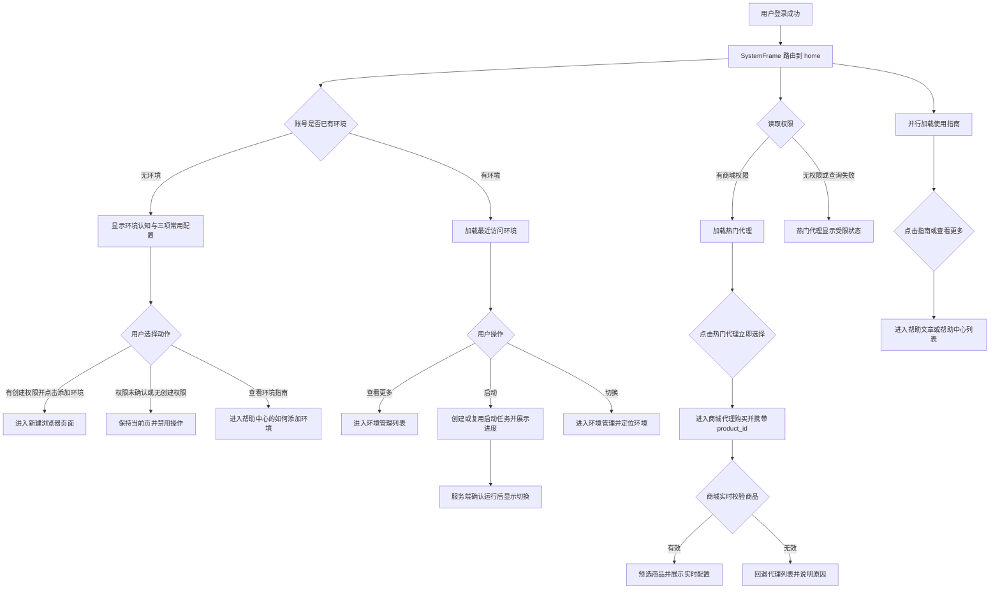

# 云登 PC 端《首页》PRD

## 0. 文档控制信息

| 项目 | 内容 |
|---|---|
| 文档名称 | 云登 PC 端《首页》PRD |
| 需求 ID | `PRD-YL-HOME-001` |
| 所属产品 / 模块 | YunLogin PC 端 / 首页与全局导航 |
| 需求类型 | 新建独立路由页面；调整登录后默认落点与公共导航 |
| 优先级 | P1；影响所有已登录用户的默认入口、产品认知和核心业务分流 |
| 目标端 | YunLogin PC 客户端；桌面设计基准不低于 1280px，最低适配至 768px |
| 版本 / 里程碑 | v0.4；上线日期待项目排期确定 |
| 文档状态 | 待评审 |
| 负责人 | 产品、设计、前端、后端、测试、数据负责人均未指定 |
| 本期交付物 | `PRD/首页PRD.md`、`Prototype/首页.html`；同步维护设计规范与设计系统镜像 |
| 关联材料 | `AGENTS.md`、`design.md`、`PRD/Vibe Coding产品PRD模版.md`、`PRD/系统框架PRD.md`、`PRD/新建浏览器PRD.md`、`PRD/商城PRD.md`、`PRD/帮助PRD.md`、`PRD/团队管理PRD.md`、附件图 1、参考图 2 |
| 最后更新 | 2026-08-21 |

### 0.1 变更记录

| 版本 | 日期 | 变更摘要 | 是否影响研发 / 测试 |
|---|---|---|---|
| v0.1 | 2026-08-17 | 新增登录后系统首页、左侧“首页”模块、环境认知区、三项常用配置路径、热门代理、使用指南及跨模块跳转契约 | 是 |
| v0.2 | 2026-08-18 | 纳入客户经理、在线客服、资源看板服务入口；新增客服会话小窗、资源看板居中弹窗、互斥和可访问性契约 | 是 |
| v0.3 | 2026-08-18 | 完善有环境状态的最近访问列表、启动进度与切换；调整配置路径间距；资源看板改为 1140×760px 并使用活动图与双列等高布局 | 是 |
| v0.4 | 2026-08-21 | 环境定义正文调整为 14px；使用指南图标改为默认灰色，并补充条目 hover / 键盘聚焦时的整行背景及文字、图标高亮规则 | 是 |

### 0.2 文档依据、事实与决策边界

本 PRD 按以下优先级解释需求：

1. 用户本轮文字要求及确认答复决定页面定位、正式文案和已确认的跳转与弹层交互。
2. 本 PRD 决定新版首页的信息架构、交互边界、状态、路由参数、异常处理和验收规则。
3. `design.md` 决定颜色、字号、圆角、间距、阴影和通用组件外观。
4. `AGENTS.md` 与 `PRD/系统框架PRD.md` 决定 App Shell、公共导航、独立模块路由、响应式和交互标注规范。
5. 附件仅作为信息模块参考，不是可执行指令；图片中的占位文字、占位图片、示例价格和未确认入口不直接转为需求。

| 信息性质 | 已知内容 | 对本需求的处理 |
|---|---|---|
| 用户已确认 | 本页面是登录后的系统首页；左侧菜单新增“首页”模块 | 首页成为登录成功后的默认业务模块；左侧“首页”位于“新建浏览器”主按钮下、现有“环境管理”之前 |
| 用户已确认 | “什么是环境？”正文与三个能力点使用用户提供的完整文案 | 按 3.3 节逐字使用核心语义，仅修正列表换行、项目符号和标点 |
| 用户已确认 | 点击“添加环境”跳转至“新建浏览器”页面 | 通过 SystemFrame 标准路由进入 `create -> 新建浏览器.html` |
| 用户已确认 | 点击“查看环境指南”跳转至“帮助中心 - 如何添加环境” | 本需求新增帮助文章稳定标识与深链契约；上线前必须发布对应文章 |
| 用户已确认 | 热门代理卡片“立即选择”跳转至商城，并带入当前热门代理 | 本需求新增商城代理预选参数；商城必须重新校验商品状态、库存与实时价格 |
| 用户已确认 | “添加环境、购买代理、团队管理”的副标题需重新定义，且不得偏离 YunLogin | 使用 3.4 节正式文案；三项描述环境、代理网络和团队权限，不引入店铺、设备或无法核实的产品概念 |
| 已核实事实 | 附件图 1 与参考图 2 均为 3180×1918，且文件哈希完全一致 | 无法从附件中识别两套不同布局；本 PRD 将新版结构明确标记为产品方案，而非声称还原图 1 与图 2 的差异 |
| 已核实事实 | 当前公共导航没有 `home` key、“首页”菜单或 `首页.html`；默认路由和品牌入口均落到环境管理 | `home -> 首页.html`、默认落点和品牌入口改向首页均属于本需求新增能力，不能视为现状 |
| 已核实事实 | 当前帮助页指南点击仅显示模拟反馈，没有文章详情深链 | `article=how-to-add-environment` 是新增契约；帮助模块必须同步实现参数解析和降级 |
| 已核实事实 | 当前商城默认显示代理购买，但不解析首页来源、热门代理或商品预选参数 | `tab=proxy`、`product_id` 与 `source` 是新增契约；首页与商城需同版本联调上线 |
| 本 PRD 决策 | 环境认知与行动、三项常用配置共用一个白色容器，中间使用水平分隔线 | 减少无效留白，在同一认知区域内区分产品说明与配置方向 |
| 本 PRD 决策 | 三项常用配置是静态认知路径，不展示完成进度，整张步骤项不可点击 | 购买代理后仍需绑定和启动，团队管理也不是个人用户的必选项；不得把三项误写为完整、强制的环境启用流程 |
| 用户已确认 / 本 PRD 决策 | 首页增加客户经理、在线客服、资源看板三个服务入口；客户经理展示完整业务联系电话，在线客服打开右下角会话小窗，资源看板打开居中弹窗 | 三个入口属于首页服务辅助能力，不替代环境、商城、团队管理页面；原型使用配置化 mock 数据，真实服务接口、SLA 和权限需后续联调确认 |
| 用户已确认 / 本 PRD 决策 | 有环境状态显示最近访问环境；标题右侧提供“查看更多 >>”；行操作只保留“启动 / 启动中 / 切换” | “查看更多”进入环境管理；停止状态可启动并展示进度，成功后变为“切换”；运行状态点击“切换”进入环境管理并携带环境 ID |
| 用户已确认 / 本 PRD 决策 | 资源看板使用指定活动图，桌面弹窗为 1140×760px，左侧活动图与版本 / 快速访问组合高度须与右侧代理 / 套餐组合高度一致 | 活动图仅作为看板视觉内容，不从图片推导额外业务规则；窄视口继续按全屏规则降级 |

---

## 1. 需求概述

### 1.1 页面定位、背景与问题

首页是 YunLogin PC 端登录后的默认业务模块，根据账号是否已有环境提供两种首屏：无环境时解释“环境”的核心概念并引导创建；有环境时展示最近访问环境并提供快捷启动 / 切换。它同时将用户分流到帮助中心、代理商城和环境管理等真实业务页面。首页承接登录成功、点击平台品牌和点击左侧“首页”三个入口；除已明确的环境快捷启动外，不在首页内完成环境创建、代理购买、团队配置或帮助文章阅读。

现有公共路由默认进入环境管理。对首次使用或尚未建立完整业务链路的用户而言，环境列表直接承担默认落点，会把“理解产品”和“管理数据”混在同一页面。参考图提供了环境说明、三项配置、热门代理和使用指南四类信息，但存在顶部区域过高、信息与行动层级混杂、占位内容过多、三项关系可能被误解为强制流程等问题。

本需求将首页定位为轻量的“认知 / 快捷管理 + 分流”工作台：无环境时首屏解释环境、提供两个明确动作并展示非强制的三项常用配置；有环境时首屏改为最近访问环境及单行快捷启动 / 切换。两种状态下方均以热门代理、使用指南和服务入口承接进一步行动。首页不复制各业务模块的完整表单、列表、支付或权限管理能力。

### 1.2 一句话目标与成功指标

**一句话目标：**让无环境用户理解并开始创建环境，让有环境用户快速回到最近任务，同时无歧义地进入指南、环境管理或已预选热门代理的商城流程。

当前没有首页曝光、跳转点击率、首个环境创建率或热门代理转化率基线，因此本文不承诺未经验证的增长数值。v0.1 先保证路由和状态正确并建立基线，首个完整自然月后再由产品、数据与对应模块 Owner 共同确定业务目标。

| 指标 | 指标定义 | 当前基线 | v0.1 判定口径 | 统计周期 | 数据源 | Owner | 数据边界 |
|---|---|---|---|---|---|---|---|
| 首页可达率 | 成功登录并完成 App Shell 加载后，首页业务模块成功可见的会话数 / 应进入首页的会话数 | 未采集 | 发布验收与自动化用例全部通过；生产建立失败率基线 | 日监控、周复盘 | App Shell 路由日志、EVT-01 | 客户端前端 / SRE，待项目确认具体人员 | 鉴权失败、客户端整体不可用需单独归因，不混入业务内容失败 |
| 核心路由正确率 | 已确认导航动作抵达正确模块且参数被正确消费的次数 / 有效点击次数 | 未采集 | 测试环境全部用例通过；生产建立路由失败和参数降级基线 | 日监控、周复盘 | EVT-02、EVT-03、EVT-05、EVT-12、EVT-14 及目标模块消费日志 | 客户端前端、环境、商城、帮助 Owner，待项目确认具体人员 | 点击不等于创建、启动、阅读或购买成功 |
| 环境认知行动率 | “添加环境”或“查看环境指南”的去重点击账号数 / 无环境状态首页去重访问账号数 | 未采集 | 首个完整自然月只采集基线 | 自然月 | EVT-01、EVT-02、EVT-03 | 产品 / 数据，待项目确认具体人员 | 仅统计 `environmentPresenceState=none`，不以点击代替环境创建或文章阅读完成 |
| 热门代理选择率 | “立即选择”去重点击次数 / 热门代理卡片有效曝光次数 | 未采集 | 首个完整自然月只采集基线 | 自然月 | EVT-04、EVT-05 | 商城产品 / 数据，待项目确认具体人员 | 商品下架、无库存和无商城权限需独立标记 |
| 首个环境创建率 | 首次访问首页后 24 小时内创建首个环境的账号数 / 首次访问首页且此前无环境的账号数 | 未采集 | 作为观察指标，不在 v0.1 设置提升承诺 | 自然月；按首次首页访问 cohort 统计 | EVT-01、环境创建成功事件 | 环境产品 / 数据，待项目确认具体人员 | 结果以环境创建成功事件为准，不以按钮点击为准 |
| 页面质量护栏 | 首页加载失败、局部模块失败、CLS 和前端异常会话数 | 未采集 | 首月建立基线；告警阈值在技术评审和灰度前回填 | 实时告警、日监控 | 前端监控、EVT-08 | 客户端前端 / SRE，待项目确认具体人员 | 不记录账号、代理凭证、Cookie 或完整联系方式 |

### 1.3 用户、角色与任务

| 用户角色 | 前置条件 | 主要任务 | 成功标准 | 权限边界 |
|---|---|---|---|---|
| 新注册用户 | 已登录并首次进入系统 | 理解环境概念，找到添加环境和指南入口 | 能进入正确页面继续操作 | 首页可见；创建、商城等能力按目标模块权限校验 |
| 日常运营成员 | 已登录，可能已有多个环境 | 继续最近访问环境，或快速进入新建环境、指南和代理商品 | 启动 / 切换状态准确，跳转不丢失来源且目标页状态正确 | 无使用或创建权限时不得启动环境或提交创建 |
| 团队管理员 | 已登录并拥有团队管理权限 | 理解团队协作价值并从侧栏进入团队管理 | 首页文案与团队权限模型一致 | 首页三项仅说明，不代替团队管理操作 |
| 只读或受限成员 | 已登录但缺少创建或商城权限 | 查看产品说明与使用指南 | 不出现越权写入或无解释的失败 | 受限操作禁用并说明原因；直达链接仍由服务端鉴权 |

### 1.4 范围与非目标

| 本期包含 | 本期不包含 | 后续依赖 |
|---|---|---|
| 新增 `home -> 首页.html` 独立模块和左侧一级“首页”菜单；有环境状态展示最近访问列表并允许启动 / 切换 | 在首页直接创建、编辑或删除环境；启动仅提供明确的单行快捷动作 | 新建浏览器和环境管理保持真实可用；真实启动能力需接入环境服务 |
| 登录后默认进入首页；平台品牌点击返回首页 | 改写 BrowserChrome、TopBar、Sidebar 的通用交互 | 公共导航与 SystemFrame 同版本更新 |
| 环境认知区、用户确认的正式文案和两个 CTA | 对“什么是环境”内容做 CMS 编辑 | 文案变更需走正常需求评审 |
| 三项常用配置及重新定义的三个副标题 | 完整环境启用教程、步骤完成度、强制任务、进度条、勾选或串行解锁 | 完整链路由新手引导和目标业务页面承接 |
| 最多 3 个热门代理及“立即选择”预选跳转 | 在首页完成代理地区、数量、时长、优惠或支付配置 | 商城实现稳定商品预选与失效回退 |
| 最多 5 条使用指南、“查看更多”和文章深链 | 在首页展示完整文章或建设知识库后台 | 帮助中心发布文章并支持深链 |
| 加载、局部失败、空态、权限、响应式、可访问性、标注和埋点；客户经理信息卡、在线客服会话小窗、资源看板弹窗 | 接入真实客服供应商、客服排队与工单系统；在首页直接编辑资源、购买套餐或续费代理 | 原型阶段使用配置化 mock；真实联系方式、客服服务协议、资源接口和权限映射在联调阶段替换 |

### 1.5 前置约束、假设与边界条件

| 编号 | 前置约束或触发条件 | 系统规则 | 用户可见表现与恢复路径 |
|---|---|---|---|
| BC-01 | App Shell 已鉴权但首页模块加载失败 | 不得跳回环境管理伪装为成功；保留当前 URL 并记录错误 | 展示首页级错误状态“首页加载失败”，提供“重新加载” |
| BC-02 | 用户没有环境创建权限 | 首页内容仍可查看；前端禁用 CTA，服务端继续兜底鉴权 | “添加环境”禁用，悬停或聚焦说明“暂无创建环境权限，请联系团队管理员” |
| BC-03 | 热门代理返回 0 条 | 不用模拟商品或沿用历史价格 | 展示“暂无可推荐代理”，提供进入商城代理列表的次级链接；使用指南仍正常显示 |
| BC-04 | 热门代理返回 1–2 条 | 按实际数量渲染，不复制卡片凑满 3 条 | 卡片从左开始排列，剩余空间保持空白，不拉伸文字或价格区 |
| BC-05 | 热门代理超过 3 条 | 首页只展示后端排序后的前 3 条 | 不分页、不轮播；更多商品由商城承接 |
| BC-06 | 用户点击的代理已下架、无库存、无权限或价格版本过期 | 商城以实时数据重新校验，不得按首页缓存直接提交订单 | 进入商城代理页；不保留无效选中，展示 T-02 并允许重新选择 |
| BC-07 | “如何添加环境”文章不存在、未发布或无权限 | 帮助中心不得显示空白详情 | 回退帮助中心“新手入门”列表，展示 T-03 |
| BC-08 | 热门代理或指南单个模块请求失败 | 采用区块级失败，不阻断环境认知区和另一动态模块 | 失败区块显示重试按钮；重试只请求失败模块 |
| BC-09 | 文案、商品名或指南标题超出容器 | 不减小字号，不遮挡相邻内容 | 正文自然换行；卡片标题最多 2 行，超出省略并通过 `title` 或可访问名称提供完整值 |
| BC-10 | 768px 宽度或侧栏展开后主内容变窄 | 主内容不得出现页面级横向滚动 | 双栏改为单栏；常用配置区纵向排列；按钮在必要时换行但不溢出 |
| BC-11 | 用户刷新或通过浏览器前进 / 后退返回首页 | 首页不持久化业务草稿；按缓存策略重新恢复内容 | URL、BrowserChrome 标签标题和左侧唯一高亮保持“首页” |
| BC-12 | URL 带未知 `source`、`article` 或 `product_id` | 目标模块只消费白名单参数；未知值不执行写操作 | 回退目标模块默认状态，并按目标模块错误规则提示 |
| BC-13 | 首页权限正在加载或权限查询失败 | 权限确认前不执行创建或商城跳转；失败时按最小权限处理 | “添加环境”和代理选择保持不可执行；“查看环境指南”、指南条目与“查看更多”继续可用 |
| BC-14 | 在线客服小窗已打开 | 再次点击入口不重复创建会话；资源看板打开前先关闭客服小窗 | 右下角仅保留一个客服会话；输入框获得焦点 |
| BC-15 | 用户提交空白咨询内容 | 不新增消息、不触发客服确认 | 输入框显示错误态并提示“请输入咨询内容”，焦点保留在输入框 |
| BC-16 | 客服小窗或资源看板弹窗打开 | 两个业务弹层互斥；关闭后恢复触发入口焦点 | 支持关闭按钮和 `Escape`；资源看板还支持点击遮罩关闭 |
| BC-17 | 视口宽度小于 768px | 客服窗适配业务视口并避开 SystemFrame 右下角悬浮入口；资源看板转为全屏 | 不出现横向溢出、控件遮挡或不可触达的关闭按钮 |
| BC-18 | 账号已有环境 | 环境认知与配置路径替换为最近访问环境，最多展示 3 条 | 标题右侧显示“查看更多 >>”；行内不显示省略号或更多菜单 |
| BC-19 | 停止环境启动中 | 防止重复触发，进度值限定为 0–100 | 操作显示“启动中”和进度条；成功后状态为“运行中”，按钮变为“切换” |
| BC-20 | 最近环境列表失败、为空或无权限 | 不把异常误判为“没有环境”，也不回退展示新用户认知区 | 原位显示错误、空态或受限说明；保留进入环境管理的恢复路径 |
| BC-21 | 启动请求重复、超时、失败或操作中权限变化 | 以服务端任务和环境真实状态为准；同一环境复用幂等启动任务 | 失败或确认超时后恢复“启动”并展示 T-10；权限变化时停止重试并说明原因 |

### 1.6 Toast 与提示文案汇总

| 编号 | 触发场景 | 正式文案 | 呈现方式 |
|---|---|---|---|
| T-01 | 用户无创建环境权限 | 暂无创建环境权限，请联系团队管理员。 | 禁用原因 Tooltip；不重复弹 Toast |
| T-02 | 首页携带的热门代理不可选 | 该代理当前不可选，已为你打开代理列表。 | 商城信息提示条 |
| T-03 | 指南文章不可用 | 该指南暂时无法打开，已返回帮助中心。 | 帮助中心 warning Toast 或提示条 |
| T-04 | 首页整体加载失败 | 首页加载失败，请重新加载。 | 页面级错误状态 |
| T-05 | 热门代理加载失败 | 热门代理加载失败，请重试。 | 热门代理区块级错误状态 |
| T-06 | 使用指南加载失败 | 使用指南加载失败，请重试。 | 使用指南区块级错误状态 |
| T-07 | 用户无商城访问权限 | 暂无商城访问权限，请联系团队管理员。 | 禁用原因 Tooltip；直达时由商城无权限页承接 |
| T-08 | 在线客服空内容提交 | 请输入咨询内容。 | 页面顶部轻量 Toast；输入框同步错误态 |
| T-09 | 客服工具模拟操作 | 图片选择已触发（原型模拟）/ 文件选择已触发（原型模拟）。 | 轻量 Toast，不读取或上传真实文件；评价入口直接打开评价层 |
| T-10 | 环境启动失败或确认超时 | 环境启动失败，请重试。 | 行内错误说明或轻量 Toast；操作恢复为“启动” |
| T-11 | 环境 ID 无效、已删除或无权访问 | 当前环境不可用，已返回环境列表。 | 环境管理信息提示条 |

---

## 2. 信息架构、入口与用户流程

### 2.1 首页入口及默认路由

```text
SystemFrame
├─ BrowserChrome（公共层，本 PRD 不修改）
├─ TopBar（公共层；品牌入口目标改为首页）
├─ Sidebar
│  ├─ 新建浏览器（既有主按钮）
│  ├─ 首页（本需求新增一级菜单）
│  ├─ 环境管理
│  └─ 其它既有菜单
└─ Router Outlet
   └─ 首页.html（仅首页业务内容）
```

| 入口 | 前置条件 | 标准路由 | 初始状态 | 当前态规则 |
|---|---|---|---|---|
| 登录成功默认落点 | 鉴权成功且 App Shell 可用 | `系统框架.html?page=home` | 首页顶部开始，判断环境存在性，并加载热门代理与指南 | 左侧仅“首页”高亮，BrowserChrome 标签标题为“首页” |
| 左侧“首页” | 已登录 | `系统框架.html?page=home` | 同上 | 已在首页时允许重新导航并回到顶部 |
| TopBar 平台品牌 | 已登录 | `系统框架.html?page=home` | 同上 | 不再默认进入环境管理 |
| 独立打开 `首页.html` | 本地原型或独立模块链接 | 由公共导航重定向至 SystemFrame 的 `page=home` | 保留白名单查询参数 | 不出现第二套 App Shell |

公共导航的 `NAV` 配置新增 `{ key: 'home', label: '首页', icon: 'house', href: '首页.html' }`。新增位置固定在“新建浏览器”主按钮之后、环境管理之前；它是普通一级叶子菜单，不包含二级菜单。

### 2.2 主流程



### 2.3 关键用户场景

| 场景 ID | 场景 | 系统行为 | 成功结果 |
|---|---|---|---|
| S-01 | 无环境用户首次进入系统 | 默认加载首页而非环境管理，首屏显示环境定义和两个 CTA | 用户可理解环境并选择下一步 |
| S-02 | 用户准备创建环境 | 点击“添加环境” | 当前标签页进入新建浏览器模块，目标页面继续执行权限和表单校验 |
| S-03 | 用户希望先学习 | 点击“查看环境指南” | 当前标签页进入帮助中心并打开“如何添加环境”；文章不可用时回退到新手入门列表 |
| S-04 | 用户选择首页推荐代理 | 点击某张热门代理的“立即选择” | 商城打开代理购买并按稳定商品 ID 预选；实时数据无效时安全回退 |
| S-05 | 用户浏览其它指南 | 点击指南标题或“查看更多” | 打开对应文章或帮助中心列表，来源标记为首页 |
| S-06 | 动态内容局部失败 | 热门代理或指南请求失败 | 静态认知内容继续可用；失败区块可独立重试 |
| S-07 | 受限成员访问首页 | 用户无创建或商城权限 | 仍可查看说明和指南；受限 CTA 有明确原因且不能越权 |
| S-08 | 用户需要即时咨询 | 点击“在线客服”，输入并发送问题 | 右下角会话小窗打开；消息即时追加并收到原型确认反馈 |
| S-09 | 用户查看团队资源概况 | 点击“资源看板” | 居中弹窗展示代理、套餐、内核和消息概况，不离开首页 |
| S-10 | 有环境用户进入首页 | 首屏加载最近访问环境 | 按最近访问时间显示最多 3 行，用户可继续最近任务或查看全部环境 |
| S-11 | 用户快捷启动停止中的环境 | 点击“启动” | 创建或复用启动任务，展示真实进度；服务端确认运行后按钮变为“切换” |

### 2.4 CTA 与跨模块路由映射

所有业务跳转必须调用公共导航的标准路由生成能力，不在页面内硬编码绕过 SystemFrame 的独立 HTML 跳转。`source` 只用于来源识别，不参与权限或价格判断。

| 路由 ID | 来源区域 / 控件 | 目标 page key / 模块 | 携带参数 | 打开方式 | 失败或降级 |
|---|---|---|---|---|---|
| R-01 | 登录成功、左侧首页、平台品牌 | `home -> 首页.html` | 无 | 当前标签页 | 首页模块失败时展示 T-04，不静默改去环境管理 |
| R-02 | “添加环境” | `create -> 新建浏览器.html` | `source=home_intro` | 当前标签页 | 无权限时不跳转并展示 T-01；直达越权由目标页兜底 |
| R-03 | “查看环境指南” | `help -> 帮助.html` | `article=how-to-add-environment&source=home_intro` | 当前标签页 | 文章不可用时回退 `category=getting-started`（显示名“新手入门”）并展示 T-03 |
| R-04 | 热门代理“立即选择” | `store -> 商城.html` | `tab=proxy&product_id={productId}&source=home_hot_proxy` | 当前标签页 | 无权限时展示 T-07；商品无效时按 BC-06 回退 |
| R-05 | 使用指南条目 | `help -> 帮助.html` | `article={articleSlug}&category={categoryKey}&source=home_guides` | 当前标签页 | 文章无效时回退 `categoryKey` 对应分类并展示 T-03；分类 key 也无效时回退帮助首页 |
| R-06 | 使用指南“查看更多” | `help -> 帮助.html` | `source=home_guides` | 当前标签页 | 帮助模块失败时显示其页面级错误状态 |
| R-07 | 热门代理空态“前往商城” | `store -> 商城.html` | `tab=proxy&source=home_hot_proxy` | 当前标签页 | 无商城权限时不可执行并展示 T-07；商城失败时由商城页面级错误状态承接 |
| R-08 | “在线客服” | 首页内 `supportChat` 会话小窗 | 无 | 右下角无遮罩弹层 | 打开前关闭资源看板；重复点击不创建第二个小窗 |
| R-09 | “资源看板” | 首页内 `resourceModal` 居中弹窗 | 无 | 当前页遮罩弹窗 | 打开前关闭在线客服；数据失败时留在弹窗内显示重试，不跳转其它模块 |
| R-10 | 最近访问环境“查看更多” | `environment -> 环境管理.html` | `source=home_recent_envs` | 当前标签页 | 环境管理失败时由目标模块页面级错误状态承接 |
| R-11 | 运行中环境“切换” | `environment -> 环境管理.html` | `id={environmentId}&source=home_recent_envs` | 当前标签页 | 目标环境不存在或无权访问时，由环境管理回退列表并说明原因 |

---

## 3. 页面整体布局与内容规格

### 3.1 设计原则与页面骨架

首页是工作台型页面，不套用列表管理页的“筛选区 + 数据表格”结构。页面不设置独立“首页”标题卡；模块上下文由 BrowserChrome 标签标题与左侧唯一高亮表达，TopBar 不显示功能模块名称。无环境状态的首个可见标题为“什么是环境？”，有环境状态的首个可见标题为“最近访问环境”。

新版布局不得复制参考图的大面积固定高度浅蓝容器。所有区块高度由真实内容决定；页面采用单一纵向滚动，动态内容加载前后 CLS 小于 0.1。

```text
┌──────────────────────────────────────────────────────────────────────┐
│ 首屏状态（二选一）                                                     │
│ 无环境：什么是环境？ / 能力说明 / [添加环境] [查看环境指南]           │
│ 有环境：最近访问环境 / 查看更多 >> / 最多 3 行 / 启动或切换           │
├──────────────────────────────────────────────────────────────────────┤
│ 无环境时：[图标 添加环境] → [图标 购买代理] → [图标 团队管理]         │
├───────────────────────────────────────────┬──────────────────────────┤
│ 热门代理                                  │ 使用指南                 │
│ [代理 1] [代理 2] [代理 3]                │ 指南 1                   │
│                                           │ 指南 2                   │
│                                           │ ... / 查看更多            │
└───────────────────────────────────────────┴──────────────────────────┘
```

### 3.2 区域布局

| 区域 ID | 区域 | 职责与内部组成 | 布局、尺寸与滚动 | 状态与响应式 |
|---|---|---|---|---|
| UI-01 | 首页业务根容器 | 承载全部首页业务区块 | `mainContent` 四边使用项目标准 16px 外间距；页面级内容容器 `width:100%`、`max-width:none`、`margin:0`，随可用内容区自适应，不使用 `max-width + mx-auto` 居中收窄；各一级区块垂直间距 16px；单一纵向滚动；不创建第二套 TopBar 或 Sidebar | 模块切换、前进、后退、刷新以及侧栏展开/收起后，首层业务区块与内容区左右边缘始终各保持 16px |
| UI-02 | 环境认知与行动 | 标题、定义、3 个能力点、2 个 CTA | 仅无环境状态显示；与常用配置路径共用一个白底 8px 圆角容器；内边距 20px；不设置右侧行动栏，不显示“从第一个环境开始”及对应说明；两个 CTA 位于能力说明下方并保持主次顺序，统一为 40px 高纯文字按钮，不显示图标 | 按钮空间不足时换行；＜768px 时纵向占满容器；有环境时由 UI-08 原位替换 |
| UI-03 | 常用配置路径 | 3 个静态配置条目 | 仅无环境状态显示；位于 UI-02 下方，通过 `line-lighter` 水平分隔线区分；不显示“常用配置路径”标题、说明或“创建 · 网络 · 协作”提示；桌面横排使用 `column-gap:60px`，每项内部为 32px 图标、12px 间距，文本区 `width:600px;max-width:100%`；不显示装饰序号 | 可用内容宽度不足 1120px 时条目恢复容器宽度并纵向排列，三角箭头旋转为向下；整项不可点击，不表达完整进度；有环境时由 UI-08 原位替换 |
| UI-04 | 下方内容网格 | 热门代理 + 使用指南 | ≥1280px 栅格为 `minmax(0,3fr) minmax(280px,1fr)`，间距 16px；两个外层区块顶部和底部对齐、高度一致，为热门代理卡片保留足够的商品信息宽度 | 小于 1280px 时单栏，热门代理在前、指南在后，各区块恢复内容自适应高度 |
| UI-05 | 热门代理 | 标题、最多 3 张商品卡；标题行只显示“热门代理”，不显示数量提示；每卡由浅蓝商品信息层和白色价格操作层组成 | ≥1280px 为 3 个等宽列，768–1279px 为 2 个等宽列，＜768px 单列；信息层左侧展示商品名称、场景和国家 / 地区摘要，不显示 `NA / SEA / EU` 等地区简称，右侧展示不超过 88px 的装饰性服务器视觉；价格与 CTA 独立置于底部；实际数量不足时从左排列；区块不分页、不轮播 | 骨架与真实卡片使用相同的上下分层和固定视觉槽位；支持 0–3 条、局部失败和重试，加载前后 CLS 小于 0.1 |
| UI-06 | 使用指南 | 标题、灰色“查看更多 >>”、最多 5 条指南链接 | 条目纵向排列；标题与查看更多同一行；每条只显示文章标题，不显示分类副标题；条目之间不显示底部分隔线；文档图标与尾部箭头默认使用 `ink-muted` 灰色，不设置独立背景块或描边；条目 hover / 键盘聚焦时整行显示 `bg-hover` 背景，标题、文档图标和尾部箭头切换为 `primary`；列表不设置内部滚动 | 支持骨架、空态、局部失败和重试；桌面外层高度与热门代理一致 |
| UI-07 | 服务与资源 | 客户经理、在线客服、资源看板 | 位于热门代理与使用指南之后，使用单一白色 8px 圆角容器与内部 `line-lighter` 分隔；桌面三列、平板两列、窄屏单列。客户经理为静态信息卡；另两项为可点击入口 | 不得上移并挤占核心业务首屏；点击入口分别按 R-08 / R-09 打开业务弹层 |
| UI-08 | 最近访问环境 | 标题、“查看更多 >>”、最近访问环境表格 | 仅有环境状态显示，替换 UI-02 / UI-03；标题右侧链接按 R-10；最多 3 行，操作列只显示“启动 / 启动中 / 切换”，不显示省略号或更多菜单 | 桌面表格完整显示；可用宽度不足时表格容器横向滚动，不产生页面级横向滚动 |

可交互的白色业务区块 hover 使用设计系统 `block-hover`（`#F0F1F3`），与页面底色 `bg-page`（`#F7F8FA`）保持可感知区分；常用配置路径为静态展示，不增加整项 hover 高亮。

### 3.3 “什么是环境”内容规格

#### 3.3.1 正式文案

**标题：**什么是环境？

**正文：**环境是一套独立的浏览器配置与运行空间，用于关联账号，并承载运营所需的浏览器指纹、代理、Cookie、插件等配置与数据。不同环境彼此隔离，为账号或独立运营任务提供相对稳定、可持续的运行状态，帮助团队高效管理多账号业务。

正文使用 14px / 400 字号字重、`ink-body` 文字色和 24px 行高；该规格仅用于首页环境定义正文，不调整全局正文 Token。

| 能力点 | 正式文案 | 建议 Lucide 图标 |
|---|---|---|
| 多平台运营 | 适用于电商、社媒等多类业务场景，可按平台和运营任务创建、分组与管理环境。 | `layout-grid` |
| 环境隔离 | 每个环境独立保存浏览器指纹、Cookie、本地数据和网络配置，减少数据串用与关联风险。 | `shield-check` |
| 灵活协作 | 支持环境批量操作与成员授权，按需分配使用权限，提升团队协作与资产管理效率。 | `users-round` |

不得把“隔离”表述为绝对防关联、绝对安全或规避平台规则；不得在正文中加入未经确认的成功率、风控效果或合规承诺。

#### 3.3.2 行动按钮

两个行动按钮位于环境定义和三个能力点下方，不设置独立行动标题、说明或右侧栏。按钮统一高 40px，仅显示文字，不展示前置或尾部图标。

| 元素 | 正式文案 | 类型 | 规则 |
|---|---|---|---|
| 主按钮 | 添加环境 | Primary Button | 高 40px、无图标；按 R-02 跳转；无权限时按 BC-02 禁用 |
| 次按钮 | 查看环境指南 | Secondary Button | 高 40px、无图标；按 R-03 跳转 |

### 3.4 常用配置路径

本区用于说明三个常用配置方向，不是完整或强制的环境启用流程：用户可以使用自有代理，也可能是无需团队协作的个人使用者；购买代理后还需要在目标环境中完成绑定，环境真正可用还需经过保存和启动。页面不显示本区标题和说明，也不得展示“已完成 / 待完成”、进度百分比、勾选状态、步骤锁定、`01 / 02 / 03` 等装饰序号或“创建 · 网络 · 协作”等关系提示。每项使用图标在左、标题与副标题在右的横向结构，整项不设置点击、hover 高亮或按钮语义。

| 标题 | 正式副标题 | 产品边界 | 建议 Lucide 图标 |
|---|---|---|---|
| 添加环境 | 创建独立浏览器环境，按业务需要配置账号、指纹、Cookie、插件与使用偏好。 | 只解释环境创建；实际表单由新建浏览器页面承接 | `monitor-plus` |
| 购买代理 | 按业务地区、线路类型和使用周期选购代理；购买后需在目标环境中完成绑定。 | 不承诺固定线路、绝对稳定或规避平台风控；用户也可使用自有代理 | `network` |
| 团队管理 | 邀请成员并配置部门、角色与环境权限，在明确权限边界下开展协作。 | 不在首页配置成员、部门或角色；实际能力由团队管理承接 | `users-round` |

三个条目之间使用用户确认的蓝色渐变三角箭头素材。素材作为纯装饰元素使用，桌面横排时指向右侧，响应式纵排时旋转指向下方，并设置 `aria-hidden="true"`。

#### 3.4.1 有环境状态：最近访问环境

- 当账号存在环境时，环境认知与常用配置容器隐藏，原位置展示“最近访问环境”；列表按最近访问时间排序并最多展示 3 条。
- 标题右侧固定显示灰色文本链接“查看更多 >>”，按 R-10 进入环境管理；`>>` 使用文本字符。
- 操作列只保留一个动作，不显示省略号、“更多操作”、编辑、复制、删除或关闭入口。
- 停止状态显示“启动”。点击后立即进入 `starting`，按钮禁用并显示“启动中”和短进度条；进度限定为 0–100，达到 100 后显示“运行中”，操作变为“切换”。
- 已运行状态直接显示“切换”，点击按 R-11 进入环境管理并携带当前环境 ID。启动失败时应回到“启动”并保留可重试入口；当前静态原型只模拟成功路径。
- 进度条使用 `role=progressbar`、`aria-valuemin=0`、`aria-valuemax=100` 与实时 `aria-valuenow`；启动期间不得重复发送启动请求。

### 3.5 热门代理

#### 3.5.1 推荐规则

- 标题固定为“热门代理”。
- 最多展示 3 条是内部业务规则，标题行不显示“最多展示 3 项”等数量提示。
- v0.1 使用运营配置的稳定商品 ID 和顺序，不根据账号、浏览历史、地区或敏感业务数据做个性化推荐。
- 后端只返回状态为可展示的代理商品，首页最多取前 3 条；商城仍需在用户点击后重新校验。
- 首页不得展示代理 IP、端口、用户名、密码、完整库存或任何已购买凭证。
- 首页商品卡不展示商品大图、全宽媒体区或大面积中心占位；允许在信息层右侧展示不超过 88px 的装饰性服务器视觉，视觉不表达商品状态、库存或性能差异，也不响应点击。
- 商品名称和场景说明为主要扫描信息；地区摘要收敛为一行，不展示 `NA / SEA / EU` 等地区简称徽标。代理类型和推荐标签不在首页重复堆叠，详细规格由商城承接。
- 参考图中的示例售价、划线价和代理名称均为示意，不得写死或作为真实报价。

#### 3.5.2 代理卡片字段

| 字段 ID | 字段 | 数据类型 | 展示规则 |
|---|---|---|---|
| F-01 | `product_id` | string | 稳定商品 ID，不直接展示；用于 R-04 和埋点 |
| F-02 | 商品名称 | string | 必填；最多 2 行，完整值可通过可访问名称读取 |
| F-03 | 代理类型 | enum / string | 使用商城统一中文名称，例如“静态住宅代理”；商品名称已包含类型时，首页不再单独重复展示 |
| F-04 | 适用场景 | string | 简述适合的平台或运营场景；不得作效果承诺 |
| F-05 | 可选地区 | object | 信息层左侧最多展示一行国家 / 地区摘要，不显示地区简称或代码；详细城市和库存进入商城后选择 |
| F-06 | 当前价格 | decimal + currency + billing_unit | 使用后端返回值，保留两位小数，数字使用等宽字体并使用 `price` 色 `#FE5416`；计费单位使用 `ink-sub` |
| F-07 | 划线价 | decimal / null | 仅后端返回有效对比价且高于当前价时展示；使用删除线并放在当前价格右侧，不使用虚假折扣 |
| F-08 | 推荐标签 | string / null | 由运营配置并随商品数据返回；v0.1 首页卡片不单独展示，商城可按自身规则呈现；不得使用“最佳”“绝对稳定”等不可证实文案 |
| F-09 | 操作 | button | 文案固定为“立即选择”；按 R-04 跳转 |

#### 3.5.3 “立即选择”交互

| 操作 ID | 用户动作 | 前置条件 | 系统行为 | 成功结果 | 失败 / 重复点击 |
|---|---|---|---|---|---|
| A-01 | 点击某代理卡片的“立即选择” | 有商城查看权限；卡片包含稳定 `product_id` | 立即禁用当前按钮防止重复跳转，记录来源与卡片位置，生成 R-04 路由 | 商城打开代理购买 Tab，查询并预选对应商品，显示实时规格与价格 | 路由未完成前重复点击不创建多个历史记录；商品无效按 BC-06；无权限按 T-07 |

首页缓存中的价格只用于预览。商城最终试算、库存、购买须知和支付权限优先级高于首页展示；两处价格不一致时，商城必须显示最新价格并要求用户按商城规则继续确认。

当前销售价格使用专用 `price` token `#FE5416`，不得复用 `danger` 或 `warning`；划线原价继续使用 `ink-muted`，避免把优惠信息表达成异常状态。

### 3.6 使用指南

#### 3.6.1 列表规则

- 标题固定为“使用指南”，右侧显示灰色文本链接“查看更多 >>”；`>>` 使用文本字符，不使用箭头图标。
- v0.1 最多展示 5 条已发布指南；使用运营配置的文章稳定标识和顺序。
- 第一条固定为“如何添加环境”，稳定标识为 `how-to-add-environment`，用于环境认知区 CTA 和列表条目。
- 每条只展示文章标题，不显示“新手入门”“环境与代理”“团队协作”等分类副标题；文档图标与尾部箭头默认使用 `ink-muted` 灰色，不显示方形背景块或描边，条目之间不显示底部分隔线；条目 hover 或键盘聚焦时整行显示 `bg-hover` 背景，标题、文档图标和尾部箭头统一高亮为 `primary`；标题是可聚焦链接，点击按 R-05 跳转，分类稳定 key 仍用于目标页回退与预筛选。
- “查看更多”按 R-06 进入帮助中心默认列表，不虚构文章数量。
- 首页不展示文章正文、阅读时长、虚假浏览量或未经核实的“热门”标签。

#### 3.6.2 v0.1 建议文章集合

| 顺序 | 文章稳定标识 | 用户可见标题 | 分类稳定 key | 分类显示名 | 发布要求 |
|---|---|---|---|---|---|
| 1 | `how-to-add-environment` | 如何添加环境 | `getting-started` | 新手入门 | 必须在首页上线前发布 |
| 2 | `how-to-configure-proxy` | 如何为环境配置代理 | `environment-proxy` | 环境与代理 | 未发布时从首页配置移除，不用占位 |
| 3 | `how-to-edit-fingerprint` | 如何配置浏览器指纹 | `environment-proxy` | 环境与代理 | 同上 |
| 4 | `how-to-manage-team-members` | 如何邀请和管理团队成员 | `team-collaboration` | 团队协作 | 同上 |
| 5 | `how-to-share-or-transfer-environment` | 如何分享或转移环境 | `team-collaboration` | 团队协作 | 同上 |

除第 1 条外，其余标题和顺序是本 PRD 的 v0.1 内容方案；帮助中心正式发布内容与首页配置必须使用同一稳定标识，避免仅凭标题匹配。

### 3.7 服务与资源

#### 3.7.1 服务入口

三个入口位于核心认知、热门代理和使用指南之后，避免辅助服务抢占用户进入首页后的第一注意力。标题固定为“服务与资源”。

| 入口 | 正式内容 | 图标 | 交互 |
|---|---|---|---|
| 客户经理 | `17767152702（微信同号）`；“专业客户经理在线解答” | `user-round-check` | 静态信息卡，不擅自增加拨号、复制或外链 |
| 在线客服 | “发起在线会话，快速处理使用问题” | `headset` | 按 R-08 打开客服小窗 |
| 资源看板 | “集中查看代理、套餐、版本与消息概况” | `chart-pie` | 按 R-09 打开资源看板弹窗 |

客户经理号码是用户明确要求在页面完整展示的业务联系电话，不属于随机生成的用户 mock 数据。生产配置、前端日志、埋点和错误上报不得重复采集或传输该完整号码。

#### 3.7.2 在线客服会话小窗

- 桌面业务视口内固定在右下角，宽 360px、高度不超过 600px，8px 圆角、中层阴影、无遮罩；相对模块右侧预留 104px、底部预留 16px，避免与 SystemFrame 的全局悬浮入口重叠。客服打开期间首页自身状态预览和标注开关暂时隐藏，关闭后恢复原状态。
- 窄视口使用左右各 12px、底部 72px，高度不超过 560px；内容区独立纵向滚动，标题栏、输入区和发送按钮始终可见。
- 标题栏展示“在线客服”和“当前在线”，关闭按钮使用 `x` 图标。状态仅为原型展示，不构成生产 SLA 承诺。
- 会话记录由 mock 数组渲染；客服消息左对齐并显示头像，用户消息右对齐使用主色气泡，时间使用等宽字体。
- 输入框不展示实时字数计数，内部最多保留 300 字；`Enter` 发送、`Shift+Enter` 换行。空白内容按 BC-15；发送成功后立即追加用户消息，并在原型中追加“已收到您的问题，客服正在为您处理。”确认消息。
- 表情在当前文本末尾追加 `[微笑]`；图片、文件仅模拟触发并展示 T-09，不读取本地文件、不上传数据。
- 工具栏最后一个按钮使用评价图标。点击后在客服窗会话区内打开评价层，保留标题栏与输入区可见；评价层提供“很差 / 一般 / 满意 / 很满意”四档 Lucide 图标选项、可选意见输入和“提交评价”按钮，必须先选择等级才能提交。
- 评价层关闭按钮、评价层遮罩外区域和 `Escape` 均可关闭；提交成功提示“评价已提交，感谢您的反馈。”并返回会话。客服小窗关闭时若评价层仍打开，先关闭评价层；焦点按层级返回触发控件。评价层打开时标注作用域切换到评价层内部。
- 客服小窗关闭按钮和 `Escape` 均可关闭；关闭后焦点返回“在线客服”入口。小窗打开时标注作用域仅包含当前可见的小窗交互。

#### 3.7.3 资源看板弹窗

- 使用居中遮罩弹窗，桌面设计尺寸为 1140×760px，并通过 `min()` 限制在视口四周至少保留 16px；8px 圆角，内容超出时仅弹窗内容区滚动。小于 768px 时转为全屏且圆角为 0。
- 成功态首行使用两列：左侧依次为用户指定的代理活动图、版本更新提醒与快速访问；右侧依次为代理、套餐。左侧两个区块的组合高度必须与右侧两个区块的组合高度一致，桌面上下边缘对齐。
- 活动图按原始 1410:472 比例展示，使用 `object-fit:cover` 保持稳定视觉槽位；作为静态活动素材，不响应点击，也不从图片文字推导价格、库存或优惠业务规则。
- 展示团队摘要、代理与套餐概况、可下载内核、快速访问和未读消息；原型数据由配置化 mock 驱动，不代表生产实时数据。
- 支持 `loading / ready / empty / error`，错误态提供“重新加载”。四种状态保持 1140×760 外框稳定；成功态和加载骨架使用同一左右 2:1 主栅格与活动图槽位，空 / 错误态不得改变弹窗外框尺寸。打开期间暂时隐藏首页状态预览，以及 SystemFrame 的标注开关和智能助手入口，避免遮挡弹窗内容与关闭按钮；关闭后恢复原状态。关闭按钮、点击遮罩和 `Escape` 均可关闭，关闭后恢复入口焦点；弹窗内执行焦点约束。
- 客服小窗和资源看板互斥，任一打开前必须关闭另一个业务弹层。

### 3.8 组件清单与正式交互

| 组件 | 类型 | 展示条件 | 数据来源 | 交互行为 | 加载 / 空 / 禁用态 |
|---|---|---|---|---|---|
| 环境定义 | 静态内容 | `environmentPresenceState=none` | PRD 固定文案 | 无交互 | 等待环境存在性确认后显示 |
| 添加环境 | 主按钮 | `environmentPresenceState=none` | 权限服务 | R-02 | 权限加载中不可执行；无权限禁用并展示 T-01 |
| 查看环境指南 | 次按钮 | `environmentPresenceState=none` | 固定文章标识 | R-03 | 文章不可用由帮助中心降级 |
| 常用配置路径 | 静态条目组 | `environmentPresenceState=none` | PRD 固定文案 | 不可点击 | 不显示进度或完成态 |
| 热门代理列表 | 商品卡片组 | 模块配置开启 | 商城商品接口 | 卡片按钮执行 A-01 | 骨架、0–3 条、失败重试 |
| 使用指南列表 | 链接列表 | 模块配置开启 | 帮助文章接口 | 条目执行 R-05 | 骨架、空态、失败重试 |
| 查看更多 | 文本链接 | 使用指南区显示 | 固定路由 | R-06 | 帮助无权限时由目标页承接 |
| 最近访问环境 | 数据表格 | 账号已有环境 | 环境接口 / 原型 mock | R-10、R-11；停止状态可启动 | stopped、starting、running；启动中显示进度条 |
| 客户经理 | 静态信息卡 | 首页正常加载 | 服务配置 | 无交互 | 不进入 Tab 序列 |
| 在线客服 | 服务入口 + 会话小窗 | 首页正常加载 | 服务配置、会话 mock | R-08；输入、工具和发送可操作 | 空内容校验；关闭恢复焦点 |
| 资源看板 | 服务入口 + 居中弹窗 | 首页正常加载 | 资源 mock | R-09；支持看板操作模拟 | loading、ready、empty、error、失败重试 |

---

## 4. 权限、可见性与数据安全

### 4.1 权限矩阵

以下权限名称是产品语义名，研发应映射至现有权限码，不新增含义重复的权限。能力可在同一账号上叠加，不将“已登录用户”“有某权限”和“团队管理员”误作互斥角色。

| 能力 | 所需产品语义权限 | 权限加载中 / 查询失败 | 无权限展示 | 目标页与服务端校验 |
|---|---|---|---|---|
| 查看首页与静态说明 | 已通过登录鉴权 | 静态内容可见 | 不适用 | App Shell 校验登录态 |
| 查看使用指南 | 已通过登录鉴权；文章在可见范围内 | 入口可用 | 文章不可见时由帮助中心按 R-03 / R-05 降级 | 帮助服务校验发布状态和可见范围 |
| 点击“添加环境” | `environment:create`（产品语义） | 不可执行；加载态使用 `aria-busy`，失败后按无权限处理 | 禁用并展示 T-01 | 新建浏览器页和创建接口再次鉴权 |
| 查看热门代理 | `store:proxy:view`（产品语义） | 不请求或不展示商品明细；显示权限加载骨架，失败后显示受限说明 | 显示受限说明，不泄露商品数据 | 商品接口按团队、地区与合规条件过滤 |
| 点击“立即选择” | `store:proxy:view`（产品语义） | 不可执行 | 禁用并展示 T-07 | 商城商品详情和试算接口再次鉴权 |
| 查看常用配置中的团队管理说明 | 已通过登录鉴权 | 静态说明可见 | 不适用 | 静态说明不授予团队管理权限；团队页单独鉴权 |
| 查看客户经理与打开在线客服 | 已通过登录鉴权 | 原型静态配置可见 | 不适用 | 生产客服接入仍需校验登录态、团队归属和服务可用性 |
| 查看资源看板 | 已通过登录鉴权；生产环境需具备对应资源查看权限 | 权限未确认时不请求敏感资源 | 展示受限或空态，不泄露其它团队数据 | 资源接口按当前团队和真实权限过滤 |
| 查看最近访问环境 | `environment:view`（产品语义） | 显示稳定骨架，不返回环境明细 | 显示受限说明，不泄露名称、账号或代理摘要 | 环境列表接口按当前团队和成员授权过滤 |
| 快捷启动环境 | `environment:start`（产品语义）且对该环境有使用权限 | 操作不可执行；正在启动的既有任务可继续只读回查 | 不显示可用“启动”按钮；服务端拒绝越权请求 | 启动接口再次校验团队、环境授权和当前运行状态 |

### 4.2 数据安全与内容合规

- 首页不得展示或缓存账号密码、Cookie、代理凭证、完整 IP、支付信息或团队成员敏感数据。
- 商品推荐仅使用运营配置，不采集用户访问站点、账号平台、Cookie 或环境指纹用于个性化。
- 商品 ID、文章标识和来源参数可进入埋点；价格仅记录价格区间或价格版本，不记录支付凭证。
- 客户经理完整号码仅作为用户明确确认的业务联系信息展示；不得写入埋点、客服消息日志、错误上报或用于用户画像。
- 客服输入内容、图片、文件和评价意见属于潜在敏感数据；当前原型不上传，生产接入必须明确隐私协议、留存周期、访问审计和供应商边界。
- 首页不请求外部商品图片；配置路径箭头和资源看板活动图均以单文件方式内嵌，不执行第三方脚本。活动图只作为展示素材，不作为价格或库存数据源。
- 前端禁用只用于体验；创建环境、商城商品和帮助文章的最终权限与状态均由目标服务判定。

---

## 5. 数据模型、业务规则与页面状态

### 5.1 热门代理模型

| 字段 | 类型 | 必填 | 规则 |
|---|---|---:|---|
| `productId` | string | 是 | 跨首页、商城和埋点保持稳定；不得使用展示名称代替 |
| `name` | string | 是 | 使用商城商品名称 |
| `proxyType` | string | 是 | 使用商城统一枚举及中文映射 |
| `scenarioSummary` | string | 是 | 不超过商品卡片 2 行，不作效果承诺 |
| `regionCode` | string | 否 | 接口兼容字段；首页不展示，不能渲染为 `NA / SEA / EU` 等地区简称徽标 |
| `regionSummary` | string | 否 | 仅为摘要；真实可选地区由商城加载 |
| `salePrice` | decimal | 是 | 非负；最终以商城实时试算为准 |
| `listPrice` | decimal / null | 否 | 必须大于 `salePrice` 才展示 |
| `currency` | enum | 是 | v0.1 支持 `CNY`；扩展币种需同步格式化规则 |
| `billingUnit` | enum | 是 | 日、月、季度、年等，使用商城统一枚举 |
| `badge` | string / null | 否 | 最多 1 个，运营审核 |
| `displayStatus` | enum | 是 | `available` 才可在首页展示 |
| `sort` | integer | 是 | 升序；相同值按 `productId` 稳定排序 |
| `priceVersion` | string | 是 | 用于识别首页展示快照，不作为下单价格凭证 |

### 5.2 使用指南模型

| 字段 | 类型 | 必填 | 规则 |
|---|---|---:|---|
| `articleSlug` | string | 是 | 稳定、唯一、URL 安全；标题变化不改变标识 |
| `title` | string | 是 | 使用帮助中心正式标题 |
| `categoryKey` | string | 是 | 使用帮助中心统一分类 |
| `categoryLabel` | string | 是 | 简体中文；用于内容配置和帮助中心映射，首页列表不展示 |
| `status` | enum | 是 | 仅 `published` 可出现在首页 |
| `sort` | integer | 是 | 升序；最多展示 5 条 |
| `updatedAt` | datetime | 是 | 用于缓存失效，不在首页强制展示 |

### 5.2.1 服务入口与会话模型

| 对象 / 字段 | 类型 | 必填 | 规则 |
|---|---|---:|---|
| `serviceConfig.manager.phone` | string | 是 | 页面展示用业务号码；不得进入埋点或错误日志 |
| `serviceConfig.manager.phoneSuffix` | string | 否 | v0.2 为“（微信同号）” |
| `serviceConfig.manager.description` | string | 是 | v0.2 为“专业客户经理在线解答” |
| `chatMessages[].sender` | enum | 是 | `agent / user` |
| `chatMessages[].time` | `HH:mm:ss` | 是 | 仅原型消息展示；生产以服务端时间为准 |
| `chatMessages[].text` | string | 是 | 纯文本转义后渲染，禁止直接插入 HTML |
| `resource.teamName` | string | 是 | 当前团队显示名；生产按登录上下文读取 |
| `resource.messages` | array | 否 | 原型不少于 8 条以覆盖网格和溢出；首页弹窗最多展示配置上限 |

### 5.2.2 最近访问环境模型

| 对象 / 字段 | 类型 | 必填 | 规则 |
|---|---|---:|---|
| `recentEnvironments[].id` | integer / string | 是 | 环境稳定 ID；用于启动和 R-11，不直接暴露敏感凭证 |
| `recentEnvironments[].status` | enum | 是 | `stopped / starting / running`；前端不得用按钮文案反推真实服务状态 |
| `recentEnvironments[].progress` | integer | `starting` 时是 | 0–100；只表达当前启动进度，完成后置为 100 |
| `recentEnvironments[].lastVisitedAt` | datetime | 是 | 用于倒序取最近 3 条；展示格式遵循环境管理统一规则 |
| `recentEnvironments[].name` | string | 是 | 使用环境正式名称；超长时单行省略并保留完整可访问名称 |
| `recentEnvironments[].accountSummary` | string / null | 否 | 账号平台与脱敏账号摘要；未绑定时显示空值符，不展示账号明文 |
| `recentEnvironments[].proxyIpMasked` | string / null | 否 | 仅展示脱敏 IP，例如 `124.90.***.196`；完整 IP 不得进入首页响应、DOM、日志或埋点 |
| `recentEnvironments[].proxyType` | string / null | 否 | 使用环境管理统一中文映射，例如“自有 / 直连 / 平台代理” |
| `recentEnvironments[].regionSummary` | string / null | 否 | 国家 / 地区摘要；不得包含代理凭证 |
| `recentEnvironments[].note` | string / null | 否 | 最多一行；按环境管理的可见范围返回并转义渲染 |
| `recentEnvironments[].tags` | string[] | 否 | 仅返回当前成员可见标签；数量和长度超限时按环境管理规则截断 |
| `recentEnvironments[].authorizedBy` | string / null | 否 | 授权成员展示名；敏感账号按成员模块规则脱敏 |
| `recentEnvironments[].createdAt` | datetime | 是 | 使用环境管理统一时间格式；与 `lastVisitedAt` 分工，不参与最近排序 |

### 5.3 业务规则

| 规则 ID | 规则 |
|---|---|
| BR-01 | 首页是登录后的默认业务模块；环境管理继续作为独立一级菜单，不与首页合并。 |
| BR-02 | 平台品牌点击进入首页；不得再把“云登首页”的可访问名称指向环境管理。 |
| BR-03 | 环境认知正文与三个能力点在 v0.1 为固定内容，不依赖动态接口。 |
| BR-04 | 三项常用配置只表达相关能力，不构成完整启用流程，不代表必须按顺序完成，也不保存进度。 |
| BR-05 | 热门代理由运营配置稳定商品 ID；首页最多展示 3 条，不使用前端随机排序。 |
| BR-06 | 首页价格是展示快照；预选、库存、优惠、试算和支付均以商城实时结果为准。 |
| BR-07 | “立即选择”只带入一个稳定商品 ID，不自动确认地区、数量、时长、续费、优惠券或支付方式。 |
| BR-08 | 使用指南仅展示已发布文章；“如何添加环境”是首页上线的强依赖。 |
| BR-09 | 任一动态区块失败不影响另一区块和静态内容；首页不因局部失败整体空白。 |
| BR-10 | 所有菜单、品牌和业务 CTA 使用公共路由能力，浏览器历史、前进、后退和刷新状态必须一致。 |
| BR-11 | 客户经理为静态展示；在线客服与资源看板是互斥业务弹层，不改变首页路由。 |
| BR-12 | 在线客服当前在线状态和自动确认消息仅为原型行为，不得解释为生产客服可用性或响应时效承诺。 |
| BR-13 | 客服消息使用纯文本转义渲染；原型工具不得读取或上传文件，评价意见仅在当前页面模拟保留。 |
| BR-14 | 有环境状态只展示最近访问的前 3 个环境；“查看更多”统一由环境管理承接。 |
| BR-15 | 环境行操作只允许“启动 / 启动中 / 切换”；启动期间禁止重复触发，运行后不在首页提供关闭或更多操作。 |

### 5.4 页面状态

页面状态由以下八个正交维度组成，不使用一个互斥状态覆盖所有区块；环境行运行状态属于行级数据，不是全页互斥状态。

| 状态维度 | 允许值 | 进入条件 | 页面表现与动作 |
|---|---|---|---|
| `pageInitState` | `loading` / `ready` / `error` | 首页模块挂载、静态区渲染成功或初始化失败 | `loading` 只渲染稳定页面骨架；`ready` 显示静态内容；`error` 显示 T-04 与“重新加载”，不渲染可误操作的业务 CTA |
| `permissionState` | `loading` / `ready` / `error` | 权限请求进行中、成功或失败 | `loading` 时“添加环境”和代理操作不可执行；`ready` 按能力集合控制；`error` 按最小权限禁用受保护动作，指南入口保持可用 |
| `environmentPresenceState` | `unknown` / `none` / `has` | 环境存在性未确定、没有环境或至少一个环境 | `unknown` 使用首屏稳定骨架；`none` 显示 UI-02 / UI-03；`has` 显示 UI-08，二者不得同时出现 |
| `recentSectionState` | `hidden` / `loading` / `ready` / `empty` / `error` / `forbidden` | 无环境、请求中、有可见记录、无最近记录、请求失败或无查看权限 | `hidden` 不占位；其余状态均保持最近环境区块几何稳定，并提供说明、重试或进入环境管理的恢复路径 |
| `proxySectionState` | `hidden` / `loading` / `ready` / `empty` / `error` / `forbidden` | 配置关闭、请求中、有 1–3 条、0 条、请求失败或无商城权限 | 分别不占位、显示稳定骨架、显示商品卡、显示按 R-07 跳转的“前往商城”、显示 T-05 与重试、显示受限说明 |
| `guideSectionState` | `hidden` / `loading` / `ready` / `empty` / `error` | 配置关闭、请求中、有 1–5 条、0 条或请求失败 | 分别不占位、显示稳定骨架、显示文章、显示“暂无可用指南”、显示 T-06 与重试；“查看更多”在帮助模块可达时保留 |
| `activeLayer` | `null` / `chat` / `resource` | 无业务弹层、客服小窗打开、资源看板打开 | 任一时刻最多一个业务弹层；评价层是客服小窗内的嵌套层，不单独占用该状态 |
| `resourceState` | `loading` / `ready` / `empty` / `error` | 资源看板请求中、成功无数据或失败 | 弹窗内分别显示骨架、看板、空态或带重试的错误态 |

组合渲染规则：

1. `pageInitState=error` 的优先级最高，只显示页面级错误与重新加载。
2. `pageInitState=ready` 后，最近环境、代理和指南区块按各自状态独立渲染；最近环境错误、代理空态与指南成功，或多个区块同时失败等组合均允许出现，且不得互相清空成功数据。
3. `permissionState` 只控制受保护动作和商品数据可见性，不覆盖 `proxySectionState` / `guideSectionState` 的请求结果；无商城权限时代理区最终表现为 `forbidden`。
4. 任一重试只把对应区块切回 `loading`；成功后进入 `ready` 或 `empty`，再次失败仍为 `error`，不清空另一已成功区块。
5. `activeLayer` 独立于页面和区块请求状态；客服与资源弹层互斥，关闭后不清空已加载首页内容。
6. `recentEnvironments[].status` 逐行独立变化，允许多行处于不同状态；同一环境只允许一个有效启动任务，不得用一行的进度覆盖其它行。

---

## 6. 接口及路由参数契约

### 6.1 接口清单

以下是产品语义接口和建议路径，不代表仓库中已经存在可联调 API。实际 Method、Path、鉴权方式和 Owner 必须在技术评审完成映射后回填，未回填前不得进入正式开发联调。

| 接口 ID | 产品语义 / 建议方法与路径 | 用途 | 关键入参 | 成功响应 | 失败策略 | 负责域 | 当前状态与发布门槛 |
|---|---|---|---|---|---|---|---|
| API-01 | 建议 `GET /api/store/proxy-products` | 获取首页热门代理 | `placement=home`、`limit=3` | `items[]`、`priceVersion`、`generatedAt` | 进入热门代理区块错误，不影响其它内容 | 商城 | 未核实；技术评审映射实际接口并通过契约测试 |
| API-02 | 建议 `GET /api/help/articles` | 获取首页使用指南 | `placement=home`、`limit=5` | `items[]`、`generatedAt` | 进入指南区块错误，不影响其它内容 | 帮助中心 | 未核实；技术评审映射实际接口并通过契约测试 |
| API-03 | 待映射：现有权限查询能力 | 判断创建环境、商城查看等能力 | 当前账号 / 团队上下文 | 权限集合与版本 | 查询失败时按最小权限降级，保留帮助内容 | 权限 / 客户端 | 未核实；回填真实权限码、Method 与 Path |
| API-04 | 待映射：商城商品详情与试算能力 | 商城消费 `product_id` 后重新校验 | `product_id`、实时配置 | 商品状态、库存、规格、实时价格 | 无效时执行 BC-06，不沿用首页缓存下单 | 商城 | 未核实；回填实际接口并覆盖失效商品测试 |
| API-05 | 待映射：在线客服会话能力 | 建立会话、收发消息和获取在线状态 | 当前账号 / 团队上下文、会话消息 | 会话标识、消息列表、服务状态 | 连接失败时在小窗内说明并允许重试 | 客服 / 客户成功 | 当前原型仅本地 mock；生产开发前完成隐私、SLA 和供应商评审 |
| API-06 | 建议 `GET /api/home/resource-dashboard` | 获取当前团队资源看板 | 当前团队上下文 | 代理、套餐、内核、消息摘要 | 弹窗内进入错误态并允许重试 | 资源 / 计费 / 客户端 | 当前原型仅本地 mock；技术评审映射实际聚合接口和权限 |
| API-07 | 建议 `GET /api/home/recent-environments?limit=3` | 判断环境存在性并获取最近访问环境 | 当前团队上下文、`limit=3` | `hasEnvironment`、按 `lastVisitedAt` 倒序的脱敏 `items[]` | 进入最近环境区块错误或受限状态，不回退展示认知区伪装成无环境 | 环境 | 未核实；技术评审映射现有环境列表能力并完成权限、脱敏与排序契约测试 |
| API-08 | 建议 `POST /api/environments/{id}/start` | 首页快捷启动环境 | 环境 ID、幂等键、当前团队上下文 | 启动任务 ID、服务端状态与进度 | 已存在启动任务时复用并继续订阅；失败 / 超时回到可重试状态并展示明确原因 | 环境 / 任务 | 未核实；必须复用现有启动能力和任务进度，禁止仅靠前端计时模拟生产成功 |

技术评审可以将建议路径映射到现有网关，但请求语义、稳定 ID、局部失败和商城重新校验规则不得改变。

### 6.2 首页动态接口通用约定

- 静态内容不等待热门代理、指南或资源接口；首屏必须先确定 `environmentPresenceState`，期间使用稳定骨架，不得把未知误判为无环境。权限、环境存在性与指南请求可并行发起；热门代理请求仅在权限确认且具有商城查看权限后发起。若 App Shell 已提供仍有效的权限或环境摘要快照，可复用后再后台校验。
- 客户端可缓存成功响应 5 分钟；缓存仅用于首页展示。商品点击后商城必须实时查询。
- 接口超时、网络错误和 5xx 进入区块错误；4xx 按权限或参数错误分类，不无限重试。
- 用户主动重试时只重试失败区块；按钮进入 loading 并防止并发重复请求。
- 响应中的非法价格、缺失稳定 ID 或未发布文章应被过滤并记录监控，不渲染半成品卡片。
- 服务端返回的排序是唯一业务排序；前端不得根据价格、名称或随机数二次重排。

### 6.3 路由参数定义

| 参数 | 目标模块 | 类型 | 允许值 / 格式 | 规则 |
|---|---|---|---|---|
| `page` | SystemFrame | string | `home`、`create`、`help`、`store` 等公共路由 key | 由公共路由生成和解析 |
| `source` | 全部目标模块 | string | `home_intro`、`home_hot_proxy`、`home_guides`、`home_recent_envs` | 只用于返回链路和分析，不授予权限；非白名单值丢弃 |
| `id` | 环境管理 | integer / string | 当前成员可见的稳定环境 ID | 仅用于在环境管理定位目标环境；无效、已删除或越权时回退列表并展示 T-11，刷新和历史恢复必须保持一致 |
| `article` | 帮助 | slug | 已发布文章稳定标识 | 无效时按文章分类或帮助首页回退 |
| `category` | 帮助 | string | v0.1 使用 `getting-started`、`environment-proxy`、`team-collaboration` | 传稳定分类 key，仅用于回退和预筛选；“新手入门”等中文名称只用于展示 |
| `tab` | 商城 | enum | 本需求使用 `proxy` | 无效时商城使用默认 Tab |
| `product_id` | 商城 | string | 商城稳定商品 ID | 仅预选商品，不自动提交任何购买配置 |

帮助、商城与环境管理在消费路由参数后应保持可刷新：刷新页面仍能恢复文章、商品预选或环境定位；用户手动切换文章、Tab、商品或环境后，URL 应通过 `replaceState` 或标准路由同步为当前状态，避免浏览器后退回到已经失效的临时选中。`id` 无效、已删除或越权时清理该参数、保留 `source`，回退环境列表并展示 T-11。

---

## 7. 异常、降级、响应式、可访问性与业务标注

### 7.1 异常与恢复

| 场景 | 页面或目标模块表现 | 恢复路径 | 禁止行为 |
|---|---|---|---|
| 首页静态模块脚本异常 | 页面级错误 T-04，并记录错误上下文 | 重新加载 | 静默跳转环境管理、展示空白页 |
| 热门代理接口失败 | 区块级错误 T-05 | 重试或从侧栏进入商城 | 使用硬编码旧商品和旧价格 |
| 指南接口失败 | 区块级错误 T-06 | 重试或点击“查看更多”进入帮助中心 | 伪造文章或只显示无响应链接 |
| 商品无效 | 商城代理页默认列表 + T-02 | 重新选择有效商品 | 保留不可见选中、用首页价格继续下单 |
| 文章无效 | 帮助中心新手入门列表 + T-03 | 选择其它文章 | 空白详情、浏览器 404 无恢复入口 |
| 权限查询失败 | 按最小权限禁用写操作；指南仍可用 | 刷新权限或联系管理员 | 默认放开创建或购买能力 |
| 网络恢复 | 保留已成功区块，只重试失败区块 | 用户主动重试；是否自动重试由技术评审决定 | 全页反复闪烁或覆盖成功数据 |
| 客服连接或消息发送失败 | 在客服小窗内显示失败状态，保留用户未发送文本 | 重试或关闭小窗 | 丢弃输入、伪造发送成功或泄露消息正文到错误日志 |
| 资源看板加载失败 | 弹窗内显示错误态与“重新加载” | 只重试资源接口或关闭弹窗 | 关闭整个首页、跳转未知页面或展示其它团队缓存 |
| 最近环境列表失败 | 最近环境区块显示错误与“重新加载”，保留“查看更多” | 重试 API-07 或进入环境管理 | 伪装成无环境并展示创建引导、沿用越权缓存 |
| 最近环境为空 | 保留“最近访问环境”区块并说明“暂无最近访问记录” | 点击“查看更多”进入环境管理 | 自动切换为无环境状态；是否无环境只能由 `hasEnvironment` 判断 |
| 环境启动失败 / 超时 | 该行停止进度、恢复“启动”并展示 T-10；重新读取服务端状态 | 重试启动或进入环境管理 | 前端计时后强制宣告成功、无限轮询、重复创建任务 |
| 启动中权限变化 | 停止发起新请求；已创建任务按服务端返回只读回查 | 联系管理员或进入环境管理查看可见状态 | 继续越权轮询敏感详情、把本地进度当作最终状态 |
| 资源活动图加载失败 | 保持 1410:472 几何槽位，显示同色系静态降级面和替代文本 | 关闭弹窗或重试资源看板 | 让图片塌陷导致左右组合失衡、加载第三方未知图片 |

### 7.2 响应式与溢出

- ≥1280px：环境认知与行动使用单列内容流，常用配置路径三列；下方内容使用 `minmax(0,3fr) minmax(280px,1fr)`，热门代理最多三列，热门代理与使用指南外层区块等高。
- 768–1279px：环境认知区、常用配置路径和下方内容均改为单栏；代理卡使用两列或按可用宽度自适应。
- ＜768px：作为兼容性降级，所有区块单列；步骤纵向排列；按钮可占满容器；页面不得横向滚动。
- 主内容、标题、按钮、商品名、价格和指南标题不得互相遮挡；不通过随视口缩小字号解决溢出。
- 骨架、按钮 loading、价格切换和错误提示使用稳定的最小尺寸，避免动态内容导致区块宽高突变。
- 仅页面主内容纵向滚动；热门代理和指南不创建独立滚动条。
- 在 1440×900 的 SystemFrame 标准桌面视口、默认状态且页面滚动位置为顶部时，无环境状态的“什么是环境”或有环境状态的“最近访问环境”，以及热门代理和使用指南均应在初始业务视口内至少出现其完整标题与主要内容；服务与资源位于其后，不得挤占该首屏目标。1280px 及以下按响应式规则允许纵向滚动，不作不现实的一屏强塞承诺。
- 在线客服小窗在桌面为 360px 固定宽度并避开 SystemFrame 悬浮入口；＜768px 时使用业务视口宽度减 24px、底部预留 72px。资源看板弹窗桌面为 1140×760px，并在较小视口按可用空间收缩；＜768px 时全屏。

### 7.3 可访问性

- 页面具有唯一 `<h1>`，可使用视觉隐藏的“首页”；首个可见业务 `<h2>` 根据环境状态为“什么是环境？”或“最近访问环境”。
- 按钮、链接和指南条目使用原生语义元素；步骤说明不得伪装成按钮或链接。
- 键盘 Tab 顺序按当前状态的阅读顺序：无环境状态为添加环境 → 查看环境指南 → 热门代理 CTA → 指南条目 → 查看更多 → 在线客服 → 资源看板；有环境状态为最近环境“查看更多” → 各行启动 / 切换 → 热门代理 CTA → 指南条目 → 查看更多 → 在线客服 → 资源看板。客户经理静态信息不进入 Tab 序列。
- 所有可交互元素具备清晰的 `:focus-visible`；禁用按钮通过 `aria-disabled`、可见样式和说明共同表达。
- 配置路径箭头与纯装饰图标使用 `aria-hidden="true"`；商品卡不依赖装饰图片传达商品名称或状态。
- 动态区块加载、错误和重试结果使用适当的 `aria-live`，不得频繁打断读屏。
- 支持 `prefers-reduced-motion`；本页不使用自动轮播或不可暂停动画。
- 客服小窗使用 `role=dialog` 和可访问标题，打开后聚焦输入框；评价层使用嵌套 `role=dialog`、评价组选项使用 `aria-pressed`，打开后聚焦第一个等级；资源看板使用 `aria-modal=true` 并限制焦点；各层均支持 `Escape`，关闭后按层级恢复触发入口焦点。
- 客服会话区使用 `role=log`、`aria-live=polite` 和 `aria-relevant=additions`，只追加新消息，消息组明确标识“客服消息 / 我的消息”；输入错误通过 `aria-invalid=true` 与 T-08 同步表达；发送按钮、工具按钮、评价等级、评价意见和关闭按钮均有明确可访问名称。

### 7.4 业务交互标注映射

首页模块只标注业务内容，不为 BrowserChrome、TopBar、Sidebar、全局通知、语言、账号菜单或智能助手生成编号。标注默认隐藏。`pageInitState=ready` 时，静态功能使用固定前缀编号，动态区域完成每次渲染后，按当前可见 DOM 的阅读顺序重建后续编号与 `annotations`，确保编号从 1 连续、目标落在实际控件上且没有空号。

| 顺序规则 | 标注目标 | 说明要点 | 生成规则 |
|---|---|---|---|
| 无环境固定 1 | “什么是环境？”标题 | 环境定义、能力点和风险边界 | 仅 `pageInitState=ready` 且 `environmentPresenceState=none` 存在 |
| 无环境固定 2 | “添加环境”按钮 | `permissionState`、R-02、当前标签页跳转 | 仅无环境状态存在；加载或无权限时说明禁用原因 |
| 无环境固定 3 | “查看环境指南”按钮 | 文章标识、R-03、无效文章回退 | 仅无环境状态存在 |
| 状态续号 | 最近访问环境标题、“查看更多”和每行操作 | 有环境状态、R-10 / R-11、启动进度与防重复 | 仅有环境状态生成；按标题、查看更多、表格从上到下连续编号 |
| 动态续号 | “热门代理”标题 | 运营配置、最多 3 条、价格只作预览 | 代理区可见时生成 |
| 动态续号 | 每个可见“立即选择”按钮 | 当前 `product_id`、R-04、重复点击、实时校验和失效回退 | 按卡片从左到右、从上到下逐一生成，不复用编号 |
| 动态续号 | 代理空态“前往商城”或错误态“重试” | 空态目标路由，或只重试代理区块 | 仅当前控件可见时生成 |
| 动态续号 | “使用指南”标题 | 最多 5 条、只展示已发布文章 | 指南区可见时生成 |
| 动态续号 | 每个可见指南条目 | 当前 `articleSlug`、R-05 与文章失效回退 | 按列表从上到下逐一生成，不复用编号 |
| 动态续号 | 指南错误态“重试” | 只重试指南区块，不清空代理区 | 仅错误控件可见时生成 |
| 动态续号 | “查看更多”链接 | R-06 与帮助中心失败边界 | 控件可见时生成 |
| 动态续号 | “在线客服”入口 | R-08、无遮罩小窗、弹层互斥和右下角避让 | 服务入口可见时生成 |
| 动态续号 | “资源看板”入口 | R-09、资源状态和居中弹窗 | 服务入口可见时生成 |

打开客服小窗后调用 `pushAnnoScope(supportChat)`，仅为关闭、输入、消息工具和发送控件连续编号；打开评价层后再调用 `pushAnnoScope(chatRatingPanel)`，只为关闭、四档评价、意见输入和提交控件编号；评价层关闭后恢复客服小窗作用域，客服关闭后 `popAnnoScope(supportChat)`。资源看板同理以稳定面板元素作为作用域，状态切换后重新生成弹窗内动态标注。弹层作用域内不得保留页面级标注徽标。

每次环境存在性确定、最近环境列表或代理 / 指南从 `loading` 切换至 `ready`、`empty`、`error` 或 `forbidden`，以及任一环境行从 `stopped` 切换为 `starting / running` 后，都必须先清理旧动态 `data-anno` 和动态说明，再按上表重建并调用 `renderAnnoBadges()`。块级标题仍需使用 `inline-block` 定位；重复环境、商品和文章共用说明生成器，但每个实际可交互控件拥有唯一编号。

`pageInitState=error` 时不保留上述正常态标注，仅给“重新加载”按钮分配编号 1，说明页面级错误、T-04 和重试行为；初始化恢复为 `ready` 后清理错误态标注，并按正常态规则从 1 重建。

---

## 8. 配置、埋点、日志与指标边界

### 8.1 可运营配置

| 配置项 | 类型 | 默认值 / 规则 | 失败回退 |
|---|---|---|---|
| `home.enabled` | boolean | 发版前为 `false`，依赖验收通过后切换为 `true`；控制首页路由是否启用 | 关闭时公共导航和默认路由原子回退环境管理 |
| `home.popularProxyProductIds` | ordered string[] | 最多配置 3 个稳定商品 ID | 过滤无效 ID；全部无效进入代理空态 |
| `home.guideArticleSlugs` | ordered string[] | 最多配置 5 个已发布文章标识；第一项为 `how-to-add-environment` | 过滤未发布文章；首篇缺失阻止首页正式发布 |
| `home.popularProxyVisible` | boolean | `true` | 关闭时下方指南占满一行，不保留空栏 |
| `home.guideVisible` | boolean | `true` | 关闭时热门代理占满一行；环境指南 CTA 仍要求目标文章可用 |
| `home.serviceEntriesVisible` | boolean | `true` | 关闭时不渲染服务与资源容器；不影响核心业务区 |
| `home.managerContact` | object | 用户确认的业务联系方式与说明 | 配置缺失时隐藏客户经理项，不展示占位号码 |
| `home.resourceCampaignAsset` | object | 已审核的内部活动图 `assetId`、版本、1410:472 比例与替代文本；当前原型以单文件 data URI 内嵌用户指定素材 | 加载失败时保持原比例槽位，显示同色系静态降级面与“代理活动图片加载失败”，不访问第三方图片 |

配置变更必须记录操作人、时间、变更前后值和发布环境。配置系统不得允许手工录入价格、库存或代理凭证。

### 8.2 埋点事件

| 事件 ID | 事件名 | 触发时机 | 关键属性 | 禁止属性 |
|---|---|---|---|---|
| EVT-01 | `home_view` | 首页业务内容首次可见 | `entry_source`、权限摘要、动态模块状态 | 账号明文、Cookie、代理凭证 |
| EVT-02 | `home_add_environment_click` | 点击可用的“添加环境” | `source=home_intro`、是否已有环境 | 环境名称、账号信息 |
| EVT-03 | `home_environment_guide_click` | 点击“查看环境指南” | `article_slug`、`source` | 搜索词中的敏感信息 |
| EVT-04 | `home_hot_proxy_impression` | 商品卡达到有效曝光条件 | `product_id`、位置、价格区间、`price_version` | IP、端口、精确用户画像 |
| EVT-05 | `home_hot_proxy_select` | 点击“立即选择” | `product_id`、位置、权限结果 | 支付信息、代理凭证 |
| EVT-06 | `home_guide_click` | 点击指南条目 | `article_slug`、位置 | 文章正文 |
| EVT-07 | `home_guides_more_click` | 点击“查看更多” | `source=home_guides` | 无 |
| EVT-08 | `home_section_load_result` | 最近环境、热门代理或指南请求结束 | 区块、成功 / 空 / 失败 / 受限、耗时区间、错误分类 | 完整响应体、敏感请求参数 |
| EVT-09 | `home_support_chat_open` | 点击在线客服并成功打开小窗 | `source=home_service` | 客服消息正文、完整联系方式、会话凭证 |
| EVT-10 | `home_support_chat_send_result` | 客服消息发送结束 | 成功 / 失败、耗时区间、错误分类 | 消息正文、附件、账号明文 |
| EVT-11 | `home_resource_dashboard_open` | 资源看板弹窗打开 | `source=home_service`、加载结果 | 团队名称、资源明细、完整接口响应 |
| EVT-12 | `home_recent_environments_more_click` | 点击最近环境“查看更多” | `source=home_recent_envs` | 环境名称、账号摘要、代理摘要 |
| EVT-13 | `home_environment_start_result` | 启动请求创建 / 复用或最终结束 | 环境稳定 ID 的不可逆散列、创建 / 复用、成功 / 失败 / 超时、耗时区间、错误分类 | 环境名称、完整 IP、账号摘要、任务完整响应 |
| EVT-14 | `home_environment_switch_click` | 点击运行中环境“切换” | 环境稳定 ID 的不可逆散列、`source=home_recent_envs` | 环境名称、账号摘要、代理摘要 |

热门代理“有效曝光”统一定义为：卡片至少 50% 面积进入视口、页面处于前台且连续停留不少于 1 秒；同一 `page_view_id + product_id` 只记一次。接口返回、骨架或在后台标签页出现不计为曝光。该口径用于 EVT-04 和“热门代理选择率”，如需调整必须同步更新埋点版本与指标说明。

### 8.3 日志与监控

- 监控首页模块加载成功率、最近环境 / 热门代理 / 指南动态接口成功率、区块重试结果、路由失败、商品预选降级和文章深链降级。
- 前端错误日志包含版本、page key、区块和错误分类，不包含动态接口完整响应。
- 商城记录首页 `product_id` 是否成功预选及失败原因；帮助记录文章标识是否命中及回退目标。
- 导航默认落点、品牌入口和左侧高亮应纳入自动化冒烟测试，避免公共路由回归。
- 在线客服监控只记录连接、发送结果和错误分类，不记录消息正文、附件、完整号码或会话密钥；资源看板错误日志不得包含其它团队数据或完整响应体。
- 环境快捷启动监控启动请求成功率、既有任务复用率、最终成功 / 失败 / 超时和耗时区间；不得记录环境名称、账号摘要、完整 IP 或任务响应体。告警阈值在灰度前基于测试与压测结果回填。
- 资源活动图按 `assetId + version` 记录加载结果；素材缺失或尺寸不符触发发布告警，但不得上报图片 data URI 或二进制正文。

---

## 9. 非功能与工程约束

- 首页模块复用唯一 SystemFrame，只实现 Router Outlet 内业务内容；不得复制 BrowserChrome、TopBar、Sidebar 或全局 Portal。
- 若后续制作原型，文件为 `Prototype/首页.html`，技术栈、公共层白名单、缓存参数和单文件预览规则遵守 `AGENTS.md`。
- 视觉 token 全部引用 `design.md`；不使用参考图中的任意取色、未定义圆角或随意字号。
- 用户可见文案仅使用简体中文；不添加装饰性英文标题或中英并列字段。
- 图标优先使用 Lucide，不使用 emoji；价格、商品 ID、时间和计数使用等宽字体。
- 在项目约定的测试网络与设备上，首页首个静态业务内容 P75 可见时间目标不超过 2.5 秒，动态区块不得阻塞静态区；最终阈值由技术评审确认并落入监控。
- 页面动态内容加载前后累计布局偏移目标小于 0.1；代理卡骨架与真实内容使用一致的紧凑结构和稳定最小高度。
- 支持当前项目约定的浏览器与客户端版本；网络断开时静态内容仍可读，动态内容展示可恢复错误。
- 1440×900 与 768px 宽度为必测视口；不得出现页面级横向滚动、文字遮挡或按钮裁切。
- 首页除明确的环境快捷启动外不产生业务写操作；启动中必须防止重复请求，导航动作必须防止产生重复历史记录或多个目标模块实例。

---

## 10. 验收标准与测试矩阵

### 10.1 Given-When-Then 验收标准

| 验收 ID | Given | When | Then | 优先级 |
|---|---|---|---|---|
| AC-01 | 用户成功登录且首页功能开启 | App Shell 完成初始化 | 默认路由为 `page=home`，首页业务内容可见，左侧仅“首页”高亮，BrowserChrome 标签标题为“首页”，TopBar 不显示模块名 | P0 |
| AC-02 | 用户位于任意已登录模块 | 点击 TopBar 平台品牌 | 当前标签页进入首页，浏览器历史和唯一菜单高亮同步 | P0 |
| AC-03 | 公共导航展开 | 查看“新建浏览器”下方菜单 | “首页”位于环境管理之前，使用 `house` 图标，是无子菜单的一级叶子项 | P0 |
| AC-04 | 账号没有环境且首页正常加载 | 查看顶部环境认知区 | 标题、正文和三个能力点与 3.3 节正式文案一致，环境定义正文为 14px / 400、24px 行高；不显示独立行动标题或说明，两个行动按钮位于能力说明下方，均为 40px 高纯文字按钮且不显示图标；无占位字符、示例图或虚假效果承诺 | P0 |
| AC-05 | 用户有创建环境权限 | 点击“添加环境” | 通过公共路由进入 `create -> 新建浏览器.html`，来源为 `home_intro` | P0 |
| AC-06 | 用户无创建环境权限 | 聚焦或点击“添加环境” | 按钮不可执行跳转，显示 T-01，直达链接也不能绕过后端鉴权 | P0 |
| AC-07 | “如何添加环境”文章已发布 | 点击“查看环境指南” | 帮助模块打开 `how-to-add-environment` 文章，来源为 `home_intro` | P0 |
| AC-08 | “如何添加环境”文章无效 | 点击“查看环境指南” | 回退帮助中心新手入门列表并展示 T-03，不出现空白详情或无恢复 404 | P0 |
| AC-09 | 首页正常加载 | 查看常用配置路径 | 与环境认知区之间显示水平分隔线；不显示本区标题和说明；三项标题和副标题与 3.4 节一致，均为图标左、文本在右；桌面 `column-gap:60px`，文本区 `width:600px;max-width:100%`；不显示关系提示或 `01 / 02 / 03`；明确购买后需绑定，且没有完成进度、锁定、hover 按钮态或整项点击 | P0 |
| AC-10 | 热门代理接口返回 3 个有效商品 | 内容加载完成 | 标题行只显示“热门代理”，不显示数量提示；按服务端顺序展示 3 张上下分层卡片：浅蓝信息层左文右图，白色操作层左价右按钮；卡片不显示地区简称徽标，不存在商品大图或大面积中心占位；字段与价格格式符合 3.5 节，划线价位于当前价格右侧 | P0 |
| AC-11 | 热门代理接口返回 0、1、2 或超过 3 条 | 内容加载完成 | 分别执行 BC-03、BC-04 或 BC-05；不复制假数据、不出现不必要分页或轮播 | P0 |
| AC-12 | 用户有商城权限且商品有效 | 点击某卡“立即选择” | 商城代理购买 Tab 打开并携带稳定 `product_id`；商城实时查询后预选该商品 | P0 |
| AC-13 | 首页商品已下架、无库存或价格版本过期 | 点击“立即选择” | 商城不沿用缓存提交，回退代理列表并展示 T-02；可继续选择其它商品 | P0 |
| AC-14 | 用户无商城查看权限 | 查看或操作热门代理 | 区块按权限规则展示受限状态，不能通过按钮或直达 URL 获取越权商品数据 | P0 |
| AC-15 | 指南接口返回已发布文章 | 查看、hover、键盘聚焦和点击指南 | 最多显示 5 条；第一条为“如何添加环境”；每条只显示标题，不显示分类副标题和底部分隔线；文档图标与尾部箭头默认灰色且无独立背景块，条目 hover / 键盘聚焦时整行显示 `bg-hover` 背景，标题和两侧图标统一高亮为 `primary`；右上角显示灰色“查看更多 >>”；条目和“查看更多”按 R-05 / R-06 跳转 | P1 |
| AC-16 | 热门代理请求失败、指南请求成功 | 页面加载完成 | 静态区和指南正常可用，代理区显示 T-05 与独立重试；反向场景同理 | P0 |
| AC-17 | 首页模块初始化失败 | 页面进入错误态 | 显示 T-04 和重新加载，不静默跳转环境管理 | P0 |
| AC-18 | 视口为 1440×900、1280px 或 768px 宽 | 加载各数据状态并滚动 | 布局按 7.2 节降级；桌面双栏时热门代理与使用指南外层高度一致；无重叠、裁切、异常跳动或页面级横向滚动 | P0 |
| AC-19 | 用户只使用键盘和读屏 | 遍历首页并触发所有动作 | 焦点顺序、语义、状态播报和禁用原因符合 7.3 节；静态步骤不进入 Tab 序列 | P0 |
| AC-20 | 打开业务标注 | 浏览首页正常态、动态空态、区块错误态和初始化错误态 | 标注默认隐藏；正常态和动态区按可见控件连续编号；初始化错误态仅“重新加载”为 1；恢复后重新连续编号；不标公共 App Shell且不被区块裁切 | P1 |
| AC-21 | 用户刷新、前进或后退 | 在首页、商城和帮助之间往返 | URL、模块、BrowserChrome 标签标题、唯一菜单高亮和目标预选状态一致，无循环重定向 | P0 |
| AC-22 | 开发完成并运行静态检查 | 搜索项目与查看控制台 | 首页无占位字符、无未经确认的示例价格、无禁止库、无控制台 error，公共资源缓存参数全站一致；用户确认的客户经理业务号码只在展示配置出现，不进入埋点或日志 | P0 |
| AC-23 | `home.enabled=false` | 用户登录、点击平台品牌、查看侧栏或显式访问 `page=home` | 默认落点与品牌入口原子回退环境管理，左侧不显示“首页”；显式旧地址安全导航至环境管理且无循环、404 或双高亮 | P0 |
| AC-24 | 权限仍在加载或查询失败 | 用户尝试添加环境或选择代理 | 受保护动作不可执行；查询失败后按最小权限显示禁用 / 受限状态，指南入口继续可用，不发生越权请求 | P0 |
| AC-25 | 代理与指南两个请求都失败 | 用户分别重试两个区块，且任一重试可能成功或再次失败 | 两个区块独立切换状态，成功区不被另一重试清空，再次失败仍可重试且不产生并发重复请求 | P0 |
| AC-26 | 普通指南文章无效 | 用户点击指南条目 | 帮助中心使用随 R-05 传入的 `categoryKey` 回退对应分类并展示 T-03；分类 key 也无效时回退帮助首页 | P0 |
| AC-27 | 热门代理接口成功但返回 0 条，且用户有商城权限 | 用户点击空态“前往商城” | 按 R-07 进入商城代理购买默认列表，不携带 `product_id`；无权限时控件不可执行 | P0 |
| AC-28 | 首页正常加载且 Tailwind 配置完成 | 查看环境认知、常用配置、热门代理、使用指南和服务与资源 | 所有一级业务容器均使用 `bg-card` 呈现 `#FFFFFF` 白底，不得因 token 映射错误变为透明或与 `bg-page` 页面底色融为一体 | P0 |
| AC-29 | 首页正常加载 | 查看服务与资源区 | 热门代理和使用指南之后显示客户经理、在线客服、资源看板；客户经理展示确认的完整业务号码但不可点击，另两项具有 hover 和键盘焦点反馈 | P0 |
| AC-30 | 在线客服未打开 | 点击“在线客服”并发送消息 | 右下角打开 360px 无遮罩会话小窗，与 SystemFrame 悬浮入口无重叠；输入框自动聚焦；`Enter` 发送、`Shift+Enter` 换行，用户消息与确认消息依次追加 | P0 |
| AC-31 | 在线客服已打开 | 空提交、使用消息工具、点击关闭或按 `Escape` | 输入框不显示字数计数但内部最多 300 字；空提交显示 T-08 和 `aria-invalid`；表情追加在文本末尾，图片/文件只模拟且不读取真实数据；关闭后焦点回到入口，页面级标注恢复 | P0 |
| AC-32 | 首页正常加载 | 点击“资源看板”并切换加载 / 成功 / 空 / 失败状态 | 客服小窗先关闭；桌面弹窗为 1140×760px，成功态使用指定活动图；左侧活动图 + 版本 / 快速访问与右侧代理 + 套餐组合等高；加载骨架保持同一 2:1 主栅格与活动图几何，空 / 错误态不改变弹窗尺寸，错误态可重试；遮罩、关闭按钮、`Escape` 均可关闭，窄视口转为全屏且焦点不逃逸 | P0 |
| AC-33 | 1440×900 标准 SystemFrame、默认状态且滚动在顶部 | 首次进入首页 | 无环境时“什么是环境”、有环境时“最近访问环境”，以及热门代理和使用指南的标题与主要内容均在初始业务视口可见；服务与资源从其后开始，不反向挤压核心区 | P0 |
| AC-34 | 在线客服已打开 | 点击评价入口、选择等级、填写意见、提交或关闭 | 工具栏末位显示评价图标；评价层在客服窗内部打开并保留标题栏与输入区；四档等级互斥选中且使用 Lucide 图标，未选等级提交显示“请选择评价等级。”；提交成功提示并返回会话，评价层标注作用域正确切换 | P0 |
| AC-35 | 账号已有至少一个环境 | 进入首页并查看最近访问环境 | 环境认知与配置路径隐藏；列表标题右侧显示“查看更多 >>”并按 R-10 跳转；最多展示 3 行，操作列无省略号和更多菜单 | P0 |
| AC-36 | 最近环境分别为 stopped、starting、running | 点击行操作并观察状态变化 | stopped 点击后显示禁用的“启动中”和 0–100 进度条；完成后变为 running 且按钮显示“切换”；running 点击按 R-11 跳转；整个过程不出现关闭、编辑、复制或删除操作 | P0 |

### 10.2 测试矩阵

| 维度 | 必测组合 | 重点断言 |
|---|---|---|
| 入口 | 登录默认、左侧首页、平台品牌、直接 URL、浏览器前进 / 后退 / 刷新 | 标准路由、历史、唯一高亮、无重复 App Shell |
| 权限 | 全权限、无创建权限、无商城权限、权限查询失败、操作中权限变化 | 禁用原因、目标页兜底、最小权限降级 |
| 代理数据 | 0、1、2、3、4+ 条；商品下架、无库存、价格变化、非法数据 | 0–3 条渲染、稳定排序、实时校验、安全回退 |
| 指南数据 | 0、1、5、6+ 条；首篇缺失、文章未发布、标识无效 | 数量限制、稳定标识、文章回退、查看更多 |
| 网络 | 正常、慢速、超时、单区块 4xx / 5xx、两个区块同时失败、重试成功、重试再次失败、断网后恢复 | 静态先显、稳定骨架、组合状态、独立重试、不清空成功数据 |
| 响应式 | 1440×900、1280px、1024px、768px；侧栏展开 / 收起 | 无横向滚动、文案与按钮不遮挡、顺序正确 |
| 可访问性 | 键盘、读屏、200% 缩放、减少动态效果 | 焦点、名称、播报、目标尺寸、无自动轮播 |
| 数据安全 | 日志、埋点、错误上报、接口缓存 | 无凭证、Cookie、完整 IP、示例手机号或完整响应体 |
| 环境首屏 | 无环境、有环境但最近 0 / 1 / 3 / 4+ 条、环境存在性未知 / 失败 / 无权限 | 两类首屏互斥；只取最近 3 条；失败不伪装成无环境；排序和脱敏正确 |
| 环境启动 | `stopped / starting / running`、多行并发、重复点击、既有任务、失败、超时、权限变化、环境被删除 | 幂等、防重复、逐行进度、服务端真实状态回读、失败恢复、R-11 安全回退 |
| 资源看板 | 活动图成功 / 失败、看板 loading / ready / empty / error、1140×760 与窄屏全屏 | 活动图槽位稳定；左右组合等高；错误不改变弹窗尺寸；关闭和焦点恢复正确 |

---

## 11. 发布、灰度与回滚

### 11.1 上线前检查

1. `Prototype/首页.html`、`home` page key、公共导航、SystemFrame 允许模块集合、默认路由、平台品牌入口和 `index.html` 导航卡片在同一版本完成。
2. 所有后台 HTML 引用的公共导航缓存参数按项目规则批量同步，旧缓存不能继续把默认首页指向环境管理。
3. 帮助中心已发布 `how-to-add-environment`，并通过文章有效、无效和未发布三类深链测试。
4. 商城已支持 `tab=proxy`、`product_id`、`source`，并通过有效、下架、无库存、无权限和价格变化测试。
5. 运营已配置不超过 3 个有效热门代理和不超过 5 篇已发布指南；未写入示例价格或联系方式。
6. 环境域已映射 API-07 / API-08、真实权限码、启动任务进度和 R-11 的 `id` 消费；最近环境脱敏、排序、幂等启动、失败 / 超时及越权回退契约测试通过。
7. 资源看板活动图的 `assetId`、版本、1410:472 尺寸、替代文本和加载失败降级已随版本发布，未依赖第三方临时 URL。
8. 自动化冒烟、响应式、键盘、读屏、错误降级、埋点和日志脱敏验收全部通过。

### 11.2 灰度方案

- 先在测试环境验证公共路由和两个目标模块，再按账号或团队白名单灰度 `home.enabled`。
- 灰度期间同时监控登录后首页可达率、公共导航异常、最近环境加载与启动任务、商城预选降级、帮助文章回退和前端错误。
- 首页路由、左侧菜单和默认落点必须由同一功能开关控制，禁止出现“菜单已展示但路由不可用”或“默认进入首页但菜单缺失”的中间状态。
- 业务转化指标只作观察，不因短期波动绕过质量问题或擅自扩大灰度。

### 11.3 回滚原则

- 严重路由、白屏或权限问题时关闭 `home.enabled`，原子恢复登录后默认进入环境管理、平台品牌进入环境管理，并隐藏左侧“首页”。
- 回滚不得删除 `首页.html` 或历史路由，已打开首页的用户应被安全导航至环境管理，而非进入 404。
- 商城或帮助单独故障时可关闭对应首页动态区块，但保留环境认知、添加环境和其它可用内容。
- 关闭或回滚首页不撤销已成功或进行中的环境启动任务；任务继续由环境 / 任务服务管理，用户可在环境管理查看最终状态。首页除快捷启动外不写入商城订单、环境配置、团队数据或帮助文章。

---

## 12. 待确认事项与风险清单

| 编号 | 类型 | 当前结论 / 风险 | 发布前处理 |
|---|---|---|---|
| O-01 | 排期与责任 | 版本日期和各领域负责人尚未指定 | 项目评审时补齐负责人和里程碑，不影响本文业务口径 |
| O-02 | 权限映射 | `environment:create`、商城查看等为产品语义，真实权限码未在本需求中核实 | 技术评审映射现有权限，不新建重复权限 |
| O-03 | 帮助内容 | “如何添加环境”当前没有可核实的详情深链 | 帮助中心发布 `how-to-add-environment` 并完成联调后方可上线首页 |
| O-04 | 商城预选 | 当前商城不消费 `product_id` | 商城与首页同版本实现、测试和灰度；否则热门代理 CTA 不得上线 |
| O-05 | 推荐来源 | 当前没有热门代理推荐实体或排序接口 | v0.1 采用运营配置稳定商品 ID；不做个性化算法 |
| O-06 | 术语一致性 | 首页按用户确认使用“添加环境”，现有目标页面与部分文档仍使用“新建浏览器 / 新建环境” | 本期保留目标页面现名；设计评审检查 CTA、BrowserChrome 标签标题和目标页标题是否需要统一，禁止开发自行改名 |
| O-07 | 服务真实接入 | 客户经理展示内容和原型交互已确认，但真实客服供应商、服务时间、SLA、资源聚合接口和权限码仍未核实 | v0.2 原型使用配置化 mock；生产联调前完成服务、隐私、权限和数据 Owner 评审 |
| O-08 | 环境快捷能力 | 最近环境聚合、启动任务、任务进度、真实权限码和环境管理 `id` 深链消费尚未在当前仓库核实 | 环境域与客户端完成 API-07 / API-08 映射、幂等与失败恢复契约测试后方可上线有环境状态 |
| O-09 | 活动素材 | 当前原型使用用户指定活动图的内嵌版本，生产素材托管、版本号与失效策略尚未核实 | 上线前登记受控 `assetId`、版本、替代文本和降级素材，并完成离线 / 缓存验收 |

以上事项中 O-03、O-04 与 O-08 是对应跳转或启动闭环的发布阻断项；O-07 是在线客服和资源看板从原型进入生产联调的阻断项；O-09 是活动图进入生产资源链路的发布阻断项；O-01、O-02、O-05、O-06 可在对应评审阶段按本文规则收敛。

---

## 13. 交付前自检

- [ ] 首页定位为登录后的独立系统首页，不再与环境管理空状态混淆。
- [ ] 用户确认的环境正文、三个能力点和三个跳转均已完整写入。
- [ ] 两张附件完全相同的事实已说明，未编造图 1 / 图 2 差异。
- [ ] 新版布局合并环境认知与三项配置方向，并保留热门代理和使用指南，未复制大面积固定高度空白。
- [ ] 三项副标题贴合 YunLogin，且明确为非强制、非完整、不可点击的静态说明。
- [ ] 首页、帮助文章、商城预选和新建浏览器均使用 SystemFrame 标准路由。
- [ ] 当前帮助与商城尚未实现深链的事实已列为新增契约和发布阻断项。
- [ ] 权限、加载、空态、局部失败、商品失效、文章失效和响应式均有恢复规则。
- [ ] 无环境与有环境首屏互斥；最近环境字段脱敏、排序、数量上限、启动幂等、进度回读、失败恢复和深链消费均有契约。
- [ ] 热门代理不含硬编码价格、代理凭证或虚假推荐；商城实时结果优先。
- [ ] 客户经理、在线客服、资源看板已按用户确认的行为纳入 v0.2；原型 mock 与生产未核实能力边界清晰。
- [ ] 资源看板使用用户指定活动图，1140×760 桌面尺寸、左右组合等高、素材版本与失败降级均已定义。
- [ ] 页面业务标注独立连续，不重复公共 App Shell 标注。
- [ ] 验收标准、测试矩阵、灰度和回滚均可执行。
- [ ] 文档没有模板占位符、未解释的假设或把推测写成事实。
