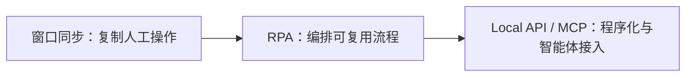
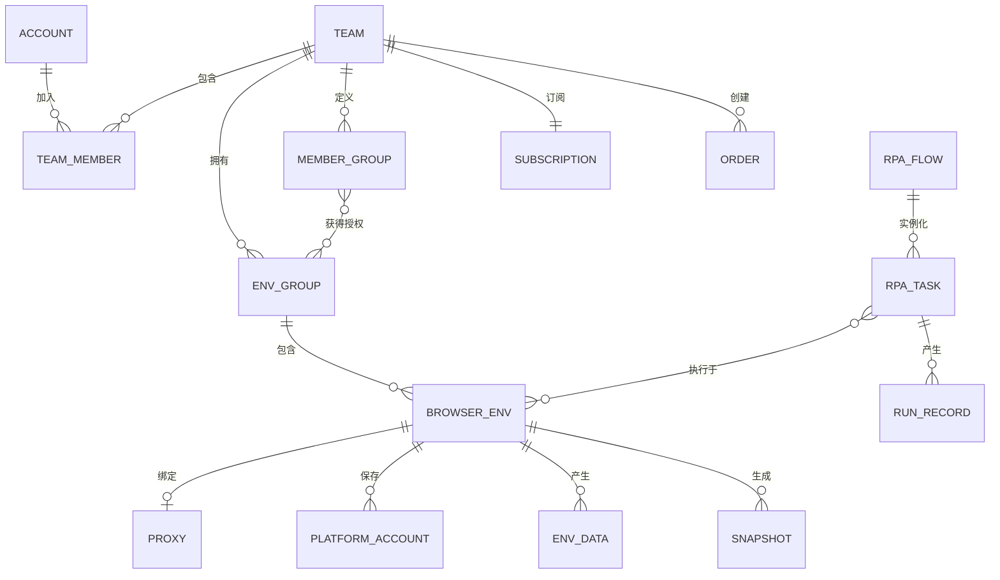
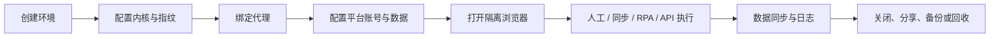
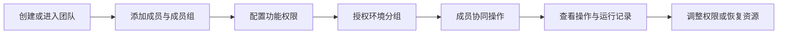
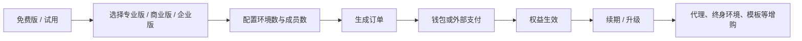

# AdsPower 产品架构

> 文档目标：用业务与产品视角解释 AdsPower 面向哪些用户、通过哪些触点提供服务、由哪些核心产品域组成、各域如何围绕“浏览器环境”协作，以及哪些能力属于外部生态。本文不把尚未公开的服务器、数据库、网络拓扑或算法实现写成已确认事实。

## 1. 架构结论

AdsPower 的核心不是一组平行页面，而是一套以“浏览器环境”为核心聚合对象、以“团队”为组织与计费边界、以“代理与自动化”为规模化能力、以“套餐与资源交易”为商业化支撑的多账号运营平台。

产品形成三条相互咬合的业务主链：

1. **环境运营链**：创建环境 → 配置指纹、代理与平台账号 → 打开隔离浏览器 → 同步或自动化执行 → 保存数据与审计。
2. **团队治理链**：创建团队 → 添加成员与成员组 → 分配功能和环境分组权限 → 协同使用 → 日志追踪与恢复。
3. **商业转化链**：免费体验 → 按环境数和成员数配置套餐 → 下单与支付 → 续期或升级 → 购买代理、终身环境、模板等增值资源。

## 2. 架构方法与边界

本架构采用“业务主链识别 + 横向分层 + 纵向支撑 + 外部边界”的方法：

- 横向按触点、用户、应用、核心域、基础能力和外部生态分层；
- 核心域按环境与指纹、代理与自动化、组织治理与商业化划分；
- 账号安全、运营服务、日志审计与恢复作为跨域支撑能力；
- 外部平台、代理供应商、云手机、浏览器扩展和支付渠道明确放在产品边界之外；
- 页面名称只作为能力入口，不直接等同于架构模块；模块名称优先表达业务职责。

## 3. AdsPower 产品架构图

图中虚线框表示 AdsPower 产品边界。底部生态层表示依赖或连接的外部平台与资源，不代表这些能力由 AdsPower 自建。该图表达产品能力和业务关系，不表示技术部署拓扑。

## 4. 分层架构

| 层级 | 主要组成 | 核心职责 | 关键输入 | 关键输出 |
|---|---|---|---|---|
| 触点层 | 官网、下载与帮助中心；Windows/macOS/Linux 桌面客户端；SunBrowser/FlowerBrowser；Local API、MCP 与自动化框架 | 承载获客、下载、配置、运行和程序化调用 | 用户操作、API/MCP 指令、官网访问 | 页面反馈、浏览器窗口、接口结果、帮助内容 |
| 用户层 | 个人运营者、团队管理员、团队成员、自动化开发者、采购/财务、合作伙伴 | 定义使用目标、权限范围和决策角色 | 账号身份、团队身份、工作职责 | 角色化入口、操作权限、采购决策 |
| 应用层 | 环境运营台、代理资源台、自动化中心、团队管理台、商业与费用中心 | 把核心能力组织成可完成任务的工作台 | 用户任务、业务规则、核心域能力 | 环境操作、资源绑定、任务执行、团队治理、订单处理 |
| 核心域 | 环境与指纹核心；代理与自动化核心；组织治理与商业核心 | 维护核心对象、规则、状态和跨域协作 | 环境配置、代理资源、流程、组织关系、套餐权益 | 可运行环境、自动化结果、授权结果、订单与权益状态 |
| 基础能力层 | 身份认证、环境隔离、浏览器内核、代理连通、流程调度、数据同步、计费与权益、日志审计与恢复 | 向多个业务域提供复用能力 | 核心域调用、策略配置 | 通用服务结果与一致性保障 |
| 外部生态层 | Facebook/Amazon/TikTok 等平台；FlashID 与代理供应商；DuoPlus；Chrome 扩展；支付渠道 | 提供账号运营目标、网络资源、云手机、扩展和支付能力 | AdsPower 的跳转、调用或资源请求 | 外部平台响应、代理、扩展、支付结果 |

## 5. 核心产品域

### 5.1 环境与指纹核心

“浏览器环境”是 AdsPower 最重要的业务对象。一个环境聚合了浏览器内核、操作系统与 User-Agent、代理、平台账号、Cookie、指纹参数、标签页、书签、应用、分组、标签和备注等配置。

| 子域 | 主要能力 | 关键对象 | 典型状态或规则 |
|---|---|---|---|
| 环境生命周期 | 新建、编辑、复制、打开、关闭、批量更新、删除、恢复 | 浏览器环境 | 未运行、运行中、已关闭、回收站中、已彻底删除 |
| 指纹与内核 | SunBrowser/FlowerBrowser、操作系统、UA、WebRTC、时区、位置、语言、分辨率、Canvas、WebGL、WebGPU、音频、媒体设备、CPU、内存等 | 指纹配置、浏览器内核 | 自动匹配、随机生成、手动指定；参数需要保持组合合理性 |
| 平台账号 | 目标平台、账号、密码、2FA、Cookie、启动标签页 | 平台账号资料 | 与环境绑定；分享时存在敏感信息披露范围 |
| 环境组织 | 分组、标签、备注、编号、搜索条件 | 环境分组、标签 | 环境必须归属分组；分组承担授权范围 |
| 数据与恢复 | Cookie、本地存储、书签、密码、插件数据、缓存、快照、回收站 | 环境数据、快照、回收项 | 回收站满 30 天后自动彻底删除；恢复时原分组不存在则取消分组配置 |
| 环境流转 | 导出、移动、分享 | 环境资料、分享记录 | 分享可选不可撤回或可撤回；默认共享平台、账号、密码、2FA、Cookies、指纹和 IP 等核心数据 |

### 5.2 代理与自动化核心

该域把“单个隔离环境”扩展为“可规模化运营的环境集群”。代理解决网络身份与地区问题；窗口同步、RPA、API/MCP 分别提供操作复制、流程编排和程序化控制。

| 子域 | 主要能力 | 与环境核心的关系 |
|---|---|---|
| 代理资源 | 导入代理、动态代理、集成代理、地区与协议选择、代理检查、续期、购买与绑定 | 每个环境可绑定代理；代理作为独立资源可被管理、检查和复用 |
| 窗口同步 | 主控窗口、被控窗口、同步输入/点击/滚动/标签页等操作 | 把一次人工操作复制到多个已打开环境 |
| RPA 流程 | 流程创建、节点编排、条件与循环、网页操作、数据处理、流程模板 | 对一个或多个环境执行可复用业务流程 |
| RPA 任务 | 环境范围、定时或立即执行、并发和异常策略、运行记录 | 将流程实例化，并记录执行结果与失败信息 |
| Cookie 机器人 | 目标网站、随机滚动、停留时长、不加载图片/视频、无头运行、完成后关闭 | 面向新环境进行网站预热并形成相关浏览记录 |
| Local API 与 MCP | 环境、分组、窗口、自动化等能力的程序化调用 | 把产品能力开放给脚本、自动化框架或智能体工具链 |

自动化能力呈现清晰的三级梯度：

### 5.3 组织治理与商业核心

团队既是协作单元，也是环境、成员、权限、日志和套餐权益的主要边界。

| 子域 | 主要能力 | 关键规则 |
|---|---|---|
| 团队与成员 | 团队信息、新建/切换团队、成员添加、编辑、移除、成员组 | 成员通过团队获得产品资源和权限；销售对接通过扫码添加销售经理完成 |
| 权限体系 | 功能权限、环境分组授权、账号安全、异常登录校验、删除环境、成员管理等细粒度权限 | 权限作用于成员或成员组；环境资源再通过分组控制可见和可操作范围 |
| 审计治理 | 操作日志、RPA 运行记录、登录活动、全局设置、回收站 | 关键操作需要可检索、可追踪；恢复与彻底删除规则必须区分 |
| 套餐权益 | 免费版、试用、专业版、商业版、企业版 | 套餐按浏览器环境数与团队成员数组合；企业版支持询价 |
| 费用与订单 | 钱包、充值、订单、付款方式、续期、自动续订 | 成员单价为 5 美元，不设阶梯价；支付渠道与手续费在订单环节体现 |
| 增值资源 | 终身环境、代理/流量包、付费模板、推广奖励 | 在订阅之外形成按资源或交易计费的收入 |

## 6. 横向能力支撑

| 支撑域 | 覆盖能力 | 横向服务对象 |
|---|---|---|
| 账号与安全 | 注册登录、验证码、第三方登录、密码、身份验证器、异常登录验证、登录活动、个人设置 | 所有触点、团队与商业交易 |
| 运营与服务 | 帮助中心、机器人、更新中心、任务中心、消息中心、网络诊断、语言、主题 | 用户操作与客户端运行全过程 |
| 治理与恢复 | 操作日志、RPA 运行记录、回收站、缓存、快照、云端存储、数据同步 | 环境、自动化、成员和管理员操作 |
| 计费与权益 | 套餐额度、环境价格、成员价格、订单、钱包、支付、续期 | 团队、环境资源和增值服务 |

## 7. 关键对象关系

对象关系中的关键判断：

- **环境是能力聚合对象**：代理、账号、指纹、数据、应用和自动化任务最终都围绕环境建立关系。
- **分组是资源授权桥梁**：团队成员不必逐个获得环境权限，而是通过成员/成员组与环境分组的关系批量授权。
- **团队是商业边界**：套餐、订单、钱包、环境额度和成员额度共同作用于团队。
- **自动化是环境的执行层**：流程本身可复用，任务选择环境并产生运行记录。

## 8. 三条核心业务链

### 8.1 环境运营链

### 8.2 团队治理链

### 8.3 商业转化链

## 9. 外部集成与产品边界

| 外部对象 | 关系 | 边界判断 |
|---|---|---|
| Facebook、Amazon、TikTok 等业务平台 | 作为目标网站和账号运营场景 | 平台账号与页面不属于 AdsPower；AdsPower 提供隔离环境和运营工具 |
| FlashID 及其他代理供应商 | 提供代理资源，AdsPower 负责选择、绑定、检查和管理入口 | 代理供给与环境绑定能力应分开表达，不应把所有代理资源画成自建网络 |
| DuoPlus 云手机 | 从云手机入口连接外部云手机产品 | 在现有边界下属于外部生态，不等同于 AdsPower 内建云手机子系统 |
| Chrome 扩展与应用生态 | 为环境提供扩展能力 | 扩展来源和扩展运行能力需与 AdsPower 自有功能区分 |
| Alipay、WeChat Pay、Card、PayPal 等 | 完成订单支付 | AdsPower 管理订单和权益，支付渠道完成外部资金处理 |
| Selenium、Puppeteer、Playwright 等 | 通过程序化接口连接浏览器环境 | 框架本身属于外部开发工具，AdsPower 提供可被调用的环境能力 |

## 10. 架构特征与风险

### 10.1 架构优势

- 核心对象明确：环境把指纹、网络、账号、数据和执行能力收敛到一个可管理单元。
- 自动化梯度完整：兼顾非技术用户、运营人员与开发者。
- 团队治理与环境分组结合，适合多账号、多成员和多业务线协作。
- 商业化不只依赖订阅，还可通过环境额度、成员、代理、终身环境和模板形成扩展收入。
- 外部生态丰富，减少平台自建所有资源的成本。

### 10.2 架构风险

- 环境配置项众多，创建、批量修改、全局设置和自动化之间容易出现规则覆盖冲突。
- 环境包含账号、密码、Cookie、2FA 和指纹等敏感信息，分享、导出、同步和快照需要严格的权限与审计。
- 代理、扩展、云手机和支付依赖外部服务，供应稳定性、兼容性和故障归因会影响端到端体验。
- 套餐权益、按量资源、终身环境和多类订单并存，容易增加计费解释与售后处理复杂度。
- RPA、窗口同步、Local API 和 MCP 可能出现能力重叠，需要清楚定义各自适用场景和权限边界。

## 11. 已确认、推断与待核实边界

| 类型 | 内容 |
|---|---|
| 已确认的产品事实 | 环境、代理、窗口同步、RPA、API/MCP、团队、成员、权限、日志、全局设置、费用、套餐、终身环境、回收站和外部云手机入口等产品能力；成员单价 5 美元；回收站 30 天规则 |
| 基于产品关系的架构判断 | 环境是核心聚合对象；团队是组织与计费边界；自动化构成三级能力梯度；分组承担资源授权桥梁 |
| 尚未核实的技术事实 | 服务端部署、数据库与对象存储、环境隔离实现、指纹生成算法、密码/Cookie 加密方式、同步一致性、代理路由与故障切换、API/MCP 鉴权和限流机制 |
| 暂不纳入 | DuoPlus 云手机内部功能、未提供的模板交易后台、企业版定制交付流程、后台运营系统和供应商结算系统 |

## 12. 参考

- [图解：支付系统产品架构](https://www.woshipm.com/pd/6170931.html)：用于提炼业务主链、横向分层、纵向支撑和“三图两表”的产品架构表达方法。
- [AdsPower 官网](https://www.adspower.net/)：用于产品触点和服务边界校验。

