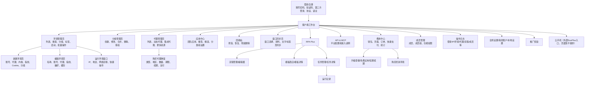
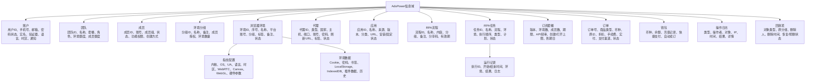

# AdsPower 产品结构图、功能结构图、信息结构图

## 1. 术语口径

- 产品结构图：以页面/入口为骨架，表达页面、功能、信息和跳转。
- 产品功能结构图：按业务能力表达“能做什么”。
- 产品信息结构图：按业务对象表达“管理什么数据”。

## 2. 产品结构图

## 3. 产品功能结构图

```mermaid
flowchart TD
  ROOT["AdsPower"]
  ROOT --> ID["身份与安全"]
  ID --> ID1["注册账号"]
  ID --> ID2["登录账号"]
  ID --> ID3["找回密码"]
  ID --> ID4["绑定身份与第三方账号"]
  ID --> ID5["配置登录与双重验证"]
  ROOT --> E["管理浏览器环境"]
  E --> E1["创建/编辑/复制环境"]
  E --> E2["配置账号和Cookie"]
  E --> E3["配置内核与指纹"]
  E --> E4["启动/关闭环境"]
  E --> E5["搜索/筛选/分组/标签"]
  E --> E6["导入/导出/移动/分享环境"]
  E --> E7["清理/备份/恢复环境数据"]
  ROOT --> P["管理代理资源"]
  P --> P1["添加/编辑/删除代理"]
  P --> P2["测试/筛选/标记代理"]
  P --> P3["购买/续期静态代理"]
  P --> P4["购买动态流量包"]
  P --> P5["使用集成代理"]
  ROOT --> T["开展团队协作"]
  T --> T1["创建/切换团队"]
  T --> T2["创建/邀请/管理成员"]
  T --> T3["管理成员分组"]
  T --> T4["分配功能权限"]
  T --> T5["授权环境分组"]
  ROOT --> A["执行自动化"]
  A --> A1["同步窗口操作"]
  A --> A2["创建/编辑/分享RPA流程"]
  A --> A3["创建普通/计划任务"]
  A --> A4["查看运行记录"]
  A --> A5["调用Local API"]
  A --> A6["接入MCP平台"]
  ROOT --> X["扩展应用与模板"]
  X --> X1["安装/更新/移除应用"]
  X --> X2["分类/固定/分配应用"]
  X --> X3["搜索/筛选/使用模板"]
  ROOT --> G["治理与审计"]
  G --> G1["配置全局/本地策略"]
  G --> G2["查看操作日志"]
  G --> G3["恢复/彻底删除数据"]
  ROOT --> C["订阅与商业服务"]
  C --> C1["试用/升级/续期套餐"]
  C --> C2["购买终身环境"]
  C --> C3["充值/管理钱包和订单"]
  C --> C4["参与推广奖励"]
```

## 4. 产品信息结构图

## 5. 关键对象映射

| 对象 | 主要页面 | 主要功能 |
|---|---|---|
| 浏览器环境 | 环境管理、新建/编辑、回收站 | 创建、编辑、启动、分享、删除、恢复 |
| 代理 | 代理管理、新建/编辑环境、购买代理 | 添加、绑定、购买、续期、测试 |
| 团队/成员 | 团队信息、成员管理、分组授权 | 邀请、分组、授权、审计 |
| RPA流程 | 流程管理、模板商店 | 编辑、复制、分享、导出、实例化任务 |
| RPA任务 | 任务管理、任务详情、运行记录 | 调度、执行、查看结果 |
| 套餐/订单 | 免费试用、升级、续期、费用中心 | 试用、购买、充值、续订、筛选订单 |

## 6. 补充后的导航、功能与对象结构

| 一级域 | 二级结构 | 已确认功能/对象 |
|---|---|---|
| 账号与帮助 | 注册、登录、忘记密码、多语言、帮助、机器人小A | 手机/邮箱验证、第三方登录、协议弹窗、外部帮助 |
| 环境 | 新建环境、环境管理、回收站 | 五类配置Tab、筛选、批量处理、单行操作、恢复 |
| 代理 | 代理列表、动态代理、集成代理、更多资源 | 导入、检测、续期、标签、购买、供应商配置 |
| 应用生态 | 团队应用、推荐应用、精选资源 | Chrome URL添加、搜索、启停、资源分类 |
| 自动化 | 窗口同步、流程、任务、运行记录、模板 | 同步控制、流程复用、任务调度、结果追踪、模板交易 |
| 团队与治理 | 团队、成员、分组、日志、全局设置 | 权限、授权、审计、公共策略 |
| 商业化 | 套餐、终身环境、代理、流量包、付费模板 | 订阅、补差、续期、永久买断、资源购买 |
| 外部生态 | DuoPlus、FlashID、Chrome应用商店 | 云手机跳转、代理供给、扩展获取 |

信息结构补充：付费模板应与订单建立关联；外部云手机只保留“入口/跳转目标/授权状态”等AdsPower侧信息，DuoPlus实例数据是否回流尚无法确认。
