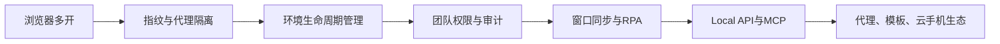

# AdsPower 产品背景

> 日期：2026-08-11

## 1. 行业背景

跨境电商、社媒营销、联盟营销、广告投放和数据采集通常需要在同一组织内管理大量平台账号。传统浏览器共用设备指纹、Cookie、本地存储和网络出口；大量账号还会带来重复登录、代理管理、权限交接、批量操作和审计问题。

指纹浏览器的产品机会，是把账号运行所需的浏览器、设备指纹、网络代理和本地数据封装为相互隔离的“浏览器环境”，再围绕环境提供团队协作和自动化能力。

## 2. 产品由来与定位

AdsPower官网将产品定位为多账号安全管理的指纹浏览器，主张在同一设备创建独立环境，并以批量操作、自动化和团队权限降低运营成本。客户端进一步表明，它已经从浏览器工具扩展为包含环境、代理、应用、RPA、API/MCP、费用和治理的工作台。

## 3. 目标市场

- 联盟营销：多广告与联盟账号运营。
- 跨境电商：Amazon、eBay、Shopify、Shopee、Temu等多店铺。
- 数字与社媒营销：Facebook、Google Ads、TikTok、Instagram等账号矩阵。
- 数据采集：结合代理、指纹环境和Local API执行自动化。
- 流量套利、票务管理、SEO与SERP监测。

以上是官网目标场景，不代表这些场景中的具体行为均合规；用户仍需遵守目标平台条款及当地法律。

## 4. 核心用户问题

1. 不同账号需要相互隔离且保持长期稳定的登录环境。
2. 大量环境、代理、账号和标签需要统一管理。
3. 团队成员需要按职责访问资源，并留下审计记录。
4. 重复操作需要窗口同步、RPA或API自动化。
5. 跨设备运营需要在便利性、数据同步和本地安全之间平衡。

## 5. 产品演进逻辑

产品壁垒并非单一指纹参数，而是环境资产、团队治理、自动化执行和外部资源生态的组合。

## 6. 产品与技术背景

- 浏览器内核：SunBrowser（Chromium）与FlowerBrowser（Firefox）。
- 指纹对象：UA、Canvas、WebGL、WebGPU、WebRTC、时区、语言、硬件参数等。
- 自动化：窗口同步、可视化RPA、Local API和MCP；官网称Local API兼容Selenium、Puppeteer和Playwright。
- 客户端：官网显示8.7.23支持macOS 11+、Windows 10+和Ubuntu Desktop 22.04+。
- 安全：官网展示SOC 2 Type II、ISO 27001、ISO 27701及加密、本地存储等说明；具体认证范围需以证书为准。

## 7. 商业背景

AdsPower采用免费获客与多元变现组合：

- 免费版提供2个环境和1名超级管理员。
- 专业版、商业版按环境阶梯与成员数量订阅。
- 企业版面向5000以上环境并提供询价。
- 终身环境采用一次性买断。
- 代理、动态流量包和付费RPA模板形成增值收入。
- 推广返现和合作伙伴中心承担渠道增长与生态扩张。

## 8. 生态背景

- DuoPlus承载外部云手机服务。
- FlashID在客户端承担代理资源购买入口。
- Chrome应用商店为扩展来源。
- 合作伙伴覆盖支付、代理、建站、营销、选品和跨境工具。

这使AdsPower更接近“多账号运营基础设施入口”，但也提高了第三方服务质量、隐私、结算和售后边界管理要求。

## 9. 竞争与差异化假设

以下为分析判断，不是已核实市场结论： 

- 免费2环境和细粒度环境阶梯有利于降低首次采用门槛。
- 窗口同步、RPA、API/MCP形成从运营人员到开发团队的自动化梯度。
- 团队权限、审计与安全认证有利于向企业客户扩张。
- 代理、模板和云手机生态可以提高客单价，但也可能稀释核心产品边界。

## 10. 当前信息缺口

- DuoPlus内部产品与价格暂不提供。
- API/MCP真实调用、并发和错误处理暂缓。
- 认证证书、用户规模、效率提升等官网口径尚未独立核验。
