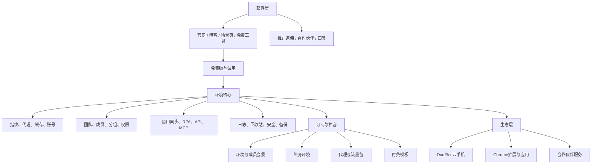

# AdsPower 商业需求文档（BRD）

> 文档性质：已上线竞品商业需求还原与分析  
> 产品：AdsPower 指纹浏览器  
> 版本：V2.0  
> 日期：2026-08-11

## 1. 文档目的

本文从商业视角还原AdsPower的市场选择、目标用户、核心价值、产品组合、收费方式、增长路径、生态策略与经营约束，用于竞品研究、产品规划和商业模式对比。

本文面向已上线竞品研究。涉及公司内部收入、成本、转化率、客户结构和经营指标的内容未公开，因此只分析可观察到的商业机制，不虚构内部数据。

## 2. 商业摘要

AdsPower以“浏览器环境”为核心商品和资源单位，为需要在同一设备管理多个互联网账号的个人与组织提供环境隔离、代理绑定、团队权限、自动化和审计能力。

产品采用低门槛免费版获取个人用户，通过环境数量、团队成员、订阅周期和企业定制实现分层收费；同时通过终身环境、代理资源、动态代理流量包、付费RPA模板等方式增加非订阅收入。

其商业逻辑可以概括为：

## 3. 商业背景

### 3.1 行业问题

跨境电商、社媒运营、联盟营销、广告投放、数据采集等业务通常具有以下特征：

- 同一操作者或团队需要管理大量平台账号；
- 不同账号需要相对独立的Cookie、缓存、设备指纹和网络出口；
- 账号、代理、密码、标签和责任人容易散落在表格或多个工具中；
- 团队成员变更、设备更换和权限交接可能带来账号安全风险；
- 大量重复操作需要批量执行、窗口同步或自动化脚本；
- 业务规模增长后，需要审计、备份、恢复和标准化流程。

### 3.2 商业机会

传统浏览器解决“访问网站”，指纹浏览器解决“以独立且可持续的环境管理账号”。当浏览器环境成为可配置、可授权、可自动化、可审计的资产后，产品便可从单人工具扩展为团队工作台。

AdsPower进一步把代理、应用、模板、云手机和合作伙伴服务接入产品，形成围绕多账号运营的资源入口，从而增加用户黏性和变现渠道。

### 3.3 产品定位

AdsPower的核心定位是多账号安全管理与自动化运营平台，主要价值不在普通网页浏览，而在以下组合：

1. 浏览器环境隔离；
2. 代理与指纹配置；
3. 多环境批量管理；
4. 团队权限与操作审计；
5. 窗口同步、RPA、Local API和MCP自动化；
6. 代理、模板、扩展及云手机生态。
AdsPower 是一款专为跨境人打造的指纹浏览器，致力解决跨境电商账号矩阵登录问题，目前已通过所有网站检测。平台提供独特的浏览器指纹配置、专业的浏览器自动化、高效的团队协作功能，对数据的存储及传输进行安全加密，为您的跨境多账号运营保驾护航！

## 4. 市场与用户

### 4.1 目标行业

| 行业场景 | 典型业务 | 核心诉求 |
|---|---|---|
| 跨境电商 | Amazon、eBay、Shopify、Shopee、Temu等多店铺 | 店铺环境隔离、稳定登录、团队交接 |
| 联盟营销 | 联盟账号、广告账号和落地页运营 | 多账号管理、投放扩量、重复操作自动化 |
| 数字营销 | Facebook Ads、Google Ads、TikTok Ads | 广告矩阵、批量操作、权限和审计 |
| 社媒营销 | Facebook、Instagram、TikTok、YouTube等账号矩阵 | 养号、内容分发、互动与账号安全 |
| 数据采集 | 公开网页、商品、评论、SERP数据采集 | 多网络环境、指纹模拟、API自动化 |
| SEO与SERP | 多地区关键词排名和竞品监测 | 地区环境、代理、批量查询 |
| 流量套利 | 多渠道流量和广告变现 | 多账号、批量运营、成本控制 |
| 票务管理 | 多票务账号与重复操作 | 环境隔离、效率和操作一致性 |

### 4.2 用户分层

| 用户层级 | 规模特征 | 主要需求 | 对应商业承接 |
|---|---|---|---|
| 体验用户 | 1人、1～2个环境 | 验证隔离环境是否可用 | 免费版 |
| 个人专业用户 | 1人、10～100环境 | 稳定管理、低成本扩容 | 专业版、终身环境 |
| 中小团队 | 2人以上、200～5000环境 | 成员权限、批量管理、自动化 | 商业版、成员增购 |
| 大型企业 | 5000以上环境 | 大规模并发、定制、服务与安全 | 企业版询价 |
| 技术团队 | 有开发与数据能力 | API、脚本、智能体和运行稳定性 | Local API、MCP、企业服务 |
| 生态客户 | 同时采购代理、模板或云手机 | 一站式资源获取 | 代理、模板、外部生态 |

### 4.3 关键角色

- 超级管理员：购买套餐、管理团队、分配功能权限和查看费用；
- 团队管理员：管理成员、分组、环境及流程；
- 运营人员：创建或使用环境，执行账号操作；
- 自动化人员：设计RPA流程、创建任务和查看运行记录；
- 开发人员：通过Local API或MCP控制环境；
- 财务或采购人员：管理钱包、订单、续费与支付；
- 合作伙伴：提供代理、云手机、扩展、营销或支付服务。

## 5. 用户任务、痛点与收益

| 用户任务 | 现有痛点 | 产品收益 |
|---|---|---|
| 创建多个稳定账号环境 | 共用指纹和缓存、重复配置 | 环境模板化、指纹隔离、批量创建 |
| 为账号配置网络 | 代理来源分散、测试和续期麻烦 | 导入、检测、购买、关联和自动续期 |
| 管理大量账号资料 | 表格分散、搜索困难、易遗漏 | 分组、标签、备注、组合筛选 |
| 团队分配账号 | 直接共享密码、权限过大 | 成员、角色、功能权限和分组授权 |
| 执行重复操作 | 人工耗时、步骤不一致 | 窗口同步、RPA和计划任务 |
| 开发批量工具 | 普通浏览器环境不稳定 | Local API、Selenium、Puppeteer、Playwright |
| 追踪问题和责任 | 无日志、误删难恢复 | 操作日志、运行记录、回收站和快照 |
| 按业务规模付费 | 固定套餐浪费、扩容不灵活 | 环境阶梯、成员增购、多周期折扣 |

## 6. 价值主张

### 6.1 核心价值

- 隔离：每个账号使用独立环境、缓存、指纹和代理；
- 稳定：保存账号状态，减少反复登录和设备变化；
- 效率：批量管理、窗口同步、RPA和API降低重复劳动；
- 协作：将环境按团队、成员和分组授权；
- 治理：以操作日志、回收站、快照和安全策略降低管理风险；
- 扩展：通过代理、应用、模板、云手机和合作伙伴补充资源。

### 6.2 不同用户的购买理由

| 用户 | 主要购买理由 |
|---|---|
| 个人用户 | 免费起步、按环境扩容、一次性终身环境 |
| 运营团队 | 批量环境、窗口同步、成员协作和流程复用 |
| 企业客户 | 大规模环境、权限审计、安全认证与定制服务 |
| 技术团队 | Local API、自动化框架兼容、MCP接入 |

## 7. 商业模式

### 7.1 收入结构

| 收入类型 | 商品 | 收费方式 | 商业作用 |
|---|---|---|---|
| 订阅收入 | 专业版、商业版、企业版 | 环境数＋成员数＋周期 | 核心经常性收入 |
| 买断收入 | 终身环境 | $15/环境，一次性 | 承接低订阅意愿用户 |
| 资源收入 | 静态代理、动态流量包 | IP、期限或GB计费 | 增加客单价和使用便利性 |
| 内容交易 | 付费RPA模板 | 单模板购买 | 变现自动化知识资产 |
| 企业服务 | 5000以上环境、成员与定制 | 询价 | 高客单与服务收入 |
| 渠道增长 | 推广返佣、合作伙伴 | 佣金或联合营销 | 获客与生态扩张 |

### 7.2 免费到付费的分层

- 免费版提供2个浏览器环境和1个超级管理员；
- 专业版覆盖10～100环境；
- 商业版覆盖200～5000环境；
- 企业版面向5000以上环境并支持询价；
- 团队成员单独计费，使个人规模和协作规模可以分别扩展；
- 季付、半年付、年付折扣提高预付比例并降低流失；
- 终身环境补充订阅之外的低门槛永久方案。

### 7.3 价格设计逻辑

环境采用分段累进计价：

| 环境数量区间 | 单价/环境/月 |
|---|---:|
| 0～10 | $0.90 |
| 10～100 | $0.30 |
| 100～400 | $0.25 |
| 400～800 | $0.15 |
| 800～1000 | $0.13 |
| 1000～10000 | $0.10 |
| 10000～50000 | $0.05 |
| 50000～100000 | $0.03 |
| 100000以上 | $0.01 |

该设计同时满足三类目标：小用户价格易理解；规模用户边际成本持续下降；环境增长直接推动收入增长。200环境月费为 `10×0.90＋90×0.30＋100×0.25＝$61`。

成员价格与环境价格分离，新增成员固定为$5/人/月，不采用阶梯价格。该设计避免纯个人用户为团队功能付费，也让团队扩张产生额外收入。

## 8. 产品商业架构

## 9. 核心商业需求

### 9.1 获客与转化

| 编号 | 商业需求 | 商业目的 |
|---|---|---|
| BRD-A01 | 官网按功能、行业场景和资源内容组织流量入口 | 承接不同搜索意图 |
| BRD-A02 | 提供免费2环境，无需信用卡即可体验 | 降低首次试用门槛 |
| BRD-A03 | 官网、登录页、客户端均提供注册、下载和升级入口 | 缩短转化路径 |
| BRD-A04 | 用博客、帮助、视频、RPA模板和免费工具持续获客 | 获取自然流量并教育用户 |
| BRD-A05 | 提供邀请码与推广返佣 | 建立低成本推荐增长渠道 |
| BRD-A06 | 支持多语言、多币种和多支付渠道 | 服务全球用户并提高支付成功率 |

### 9.2 账号与首次体验

| 编号 | 商业需求 | 商业目的 |
|---|---|---|
| BRD-B01 | 支持手机、邮箱及第三方账号注册登录 | 降低账号创建阻力 |
| BRD-B02 | 注册后直接进入产品并提供默认环境 | 缩短首次价值达成时间 |
| BRD-B03 | 用首次说明引导编辑或打开环境 | 帮助用户理解核心对象 |
| BRD-B04 | 提供忘记密码、身份验证器和异常登录保护 | 降低账号流失与安全事件 |
| BRD-B05 | 提供帮助中心和机器人咨询 | 降低学习与客服成本 |

### 9.3 环境商品化

| 编号 | 商业需求 | 商业目的 |
|---|---|---|
| BRD-C01 | 将浏览器环境定义为核心资源与计费单位 | 建立可扩展收费基础 |
| BRD-C02 | 支持创建、复制、编辑、分享、导入导出、删除恢复 | 覆盖环境完整生命周期 |
| BRD-C03 | 支持指纹、代理、账号、Cookie、应用和高级设置 | 提高环境可用性和专业价值 |
| BRD-C04 | 支持分组、标签、备注和组合搜索 | 降低规模化管理成本 |
| BRD-C05 | 支持批量修改环境、代理和指纹 | 推动用户从少量环境扩展到大规模环境 |
| BRD-C06 | 支持缓存同步、快照和云端存储选项 | 增加环境资产沉淀和迁移成本 |

### 9.4 团队协作与企业化

| 编号 | 商业需求 | 商业目的 |
|---|---|---|
| BRD-D01 | 团队作为权限、资源和费用边界 | 支撑组织采购和统一治理 |
| BRD-D02 | 成员可按账号创建或邮箱邀请加入 | 覆盖内部成员与外部协作 |
| BRD-D03 | 功能权限和分组授权独立配置 | 满足岗位分工和最小权限 |
| BRD-D04 | 记录登录、环境、代理、流程、成员等操作日志 | 支撑责任追溯与安全管理 |
| BRD-D05 | 支持团队切换和多个团队 | 服务代理商、多项目和多组织场景 |
| BRD-D06 | 企业版通过二维码添加销售经理，由销售完成询价和方案对接 | 承接大型客户非标准需求 |

### 9.5 自动化与技术扩展

| 编号 | 商业需求 | 商业目的 |
|---|---|---|
| BRD-E01 | 窗口同步复制键盘、鼠标、文本和标签页操作 | 服务无代码批量操作用户 |
| BRD-E02 | RPA支持流程设计、模板复用、任务调度和运行记录 | 沉淀可复制业务流程 |
| BRD-E03 | 模板商店同时提供免费与付费模板 | 降低RPA门槛并创造内容收入 |
| BRD-E04 | Local API兼容Selenium、Puppeteer和Playwright | 吸引开发与数据团队 |
| BRD-E05 | MCP连接AI编码工具和智能体 | 扩展AI自动化场景 |
| BRD-E06 | 不同套餐设置创建次数、打开次数、API频率等额度 | 通过使用规模驱动升级 |

### 9.6 代理与生态资源

| 编号 | 商业需求 | 商业目的 |
|---|---|---|
| BRD-F01 | 支持自有代理导入、检测、标签和关联环境 | 保留用户已有供应链 |
| BRD-F02 | 提供静态数据中心、静态住宅和动态住宅资源 | 在产品内完成代理采购 |
| BRD-F03 | 支持代理期限、地区、数量和自动续期 | 提升资源复购与连续性 |
| BRD-F04 | 集成多家代理供应商 | 降低单一供应商依赖 |
| BRD-F05 | 应用中心支持Chrome扩展与团队应用 | 扩展环境能力 |
| BRD-F06 | 云手机跳转DuoPlus并明确外部服务边界 | 补充移动端运营场景 |

### 9.7 计费、支付与留存

| 编号 | 商业需求 | 商业目的 |
|---|---|---|
| BRD-G01 | 环境采用累进阶梯计价 | 鼓励规模增长并保持价格竞争力 |
| BRD-G02 | 环境和成员分别计费 | 同时捕获资源规模与协作价值 |
| BRD-G03 | 支持月、季、半年、年等周期及折扣 | 提高预付和留存 |
| BRD-G04 | 支持套餐升级、补差和续期 | 降低扩容摩擦 |
| BRD-G05 | 支持多币种钱包和多支付渠道 | 提升跨地区支付成功率 |
| BRD-G06 | 支付前展示订单、折扣、手续费和最终金额 | 降低价格争议 |
| BRD-G07 | 支持终身环境与订阅共存 | 覆盖不同付费偏好 |
| BRD-G08 | 代理可从团队钱包自动续期 | 减少资源中断并促进复购 |

## 10. 核心商业链路

### 10.1 个人用户转化

`场景内容或口碑 → 注册 → 免费2环境 → 创建环境 → 绑定代理 → 打开账号 → 环境数量不足 → 升级专业版或购买终身环境`

### 10.2 团队客户转化

`个人使用 → 创建团队 → 邀请成员 → 分组授权 → 批量环境 → 增购成员与环境 → 使用日志和安全策略 → 商业版/企业版`

### 10.3 自动化深化

`人工操作 → 窗口同步 → 保存RPA流程 → 创建计划任务 → 查看运行记录 → Local API/MCP集成 → 更高环境和调用额度`

### 10.4 生态增购

`环境创建 → 缺少代理 → 产品内购买代理 → 自动续期 → 使用应用/RPA模板 → 跳转云手机或合作伙伴服务`

## 11. 增长与留存机制

### 11.1 获客机制

- 行业场景页覆盖明确搜索需求；
- 博客和教程覆盖问题型、指南型关键词；
- 免费工具吸引指纹和IP检测需求；
- 免费版降低体验门槛；
- 推广佣金最高30%，激励用户和渠道推荐；
- 合作伙伴中心与外部工具互相导流。

### 11.2 激活机制

- 注册成功直接进入环境管理；
- 系统提供默认环境和首次说明；
- 新建环境集中配置账号、代理和指纹；
- 免费2环境允许用户完成真实业务验证。

### 11.3 留存机制

- Cookie、LocalStorage、书签、插件和历史形成环境资产；
- 团队权限和分组形成组织协作关系；
- RPA流程、任务与模板形成自动化资产；
- 代理关联和自动续期增加持续使用需求；
- 操作日志、回收站和快照提高组织迁移成本。

### 11.4 扩张机制

- 环境数量增长驱动阶梯订阅；
- 团队人数增长驱动成员增购；
- 自动化规模增长驱动API和企业能力；
- 代理、模板和终身环境提高单客户收入；
- 多团队和企业定制承接组织扩张。

## 12. 渠道与生态策略

AdsPower的生态不是简单链接集合，而是围绕多账号业务的上下游资源网络：

| 生态类型 | 代表 | 与核心产品的关系 |
|---|---|---|
| 代理资源 | FlashID、集成代理商 | 为环境提供网络出口 |
| 云手机 | DuoPlus | 扩展移动端多账号场景 |
| 浏览器扩展 | Chrome应用商店、团队应用 | 增强环境内功能 |
| 自动化内容 | RPA模板 | 降低流程搭建门槛 |
| 支付与金融 | 多支付渠道、合作伙伴 | 支撑跨地区交易与跨境业务 |
| 营销与选品 | PrimeSpy等 | 延伸客户业务链路 |
| 内容与社区 | 博客、视频、帮助、跨境导航 | 获客、教育和支持 |

商业收益可能包括直接销售、联合营销、渠道佣金、客户导流和生态黏性。具体分成模式未公开。

## 13. 安全、合规与信任需求

### 13.1 账号与数据安全

- 登录验证码、身份验证器和异常登录提醒；
- 网络白名单和登录安全策略；
- 成员与功能权限隔离；
- 操作日志与运行记录；
- 敏感数据本地保存和同步开关；
- 环境删除后的回收与恢复机制。

### 13.2 企业信任

官网展示SOC 2 Type II、ISO 27001、ISO 27701，并说明使用AES-256、RSA和SHA-512。对企业采购而言，认证范围、证书有效期、数据处理地域、分包商清单和安全事件响应能力比营销文案更重要。

### 13.3 使用合规

产品需明确不提供违法网络访问能力，代理资源由第三方供应，用户必须遵守所在地区法律与目标平台规则。“降低账号关联风险”不能表达为保证账号不被封禁。

## 14. 客户服务与运营支撑

- 帮助中心、视频教程和机器人咨询承担自助支持；
- 更新中心向用户传达内核、功能和兼容性变化；
- 任务中心和消息中心承载异步状态；
- 企业版由销售经理承接需求确认、报价和后续商务对接；
- 代理、云手机、应用等第三方服务需要明确售后责任主体；
- 价格、优惠、退款、发票和自动续订规则需要跨官网与客户端保持一致。

## 15. 商业指标框架

以下是分析竞品商业表现时应关注的指标框架，不代表AdsPower已公开这些指标。

| 阶段 | 指标 |
|---|---|
| 获客 | 官网访问、自然搜索占比、注册成本、推荐注册占比 |
| 激活 | 注册完成率、首个环境创建率、首个环境打开率、首开耗时 |
| 转化 | 免费转付费率、试用转付费率、专业版转商业版率 |
| 扩张 | 客户环境数增长、付费成员增长、代理与模板附加购买率 |
| 留存 | 月/季/年续费率、环境月活率、团队月活率、净收入留存 |
| 自动化 | 窗口同步使用率、RPA任务数、任务成功率、API活跃团队数 |
| 质量 | 启动成功率、代理可用率、崩溃率、恢复率、支持工单量 |
| 风险 | 异常登录、权限事件、退款率、支付失败率、合规投诉 |

## 16. 商业优势

1. 免费2环境降低首次体验成本。
2. 环境阶梯计价同时适配个人、中小团队和大规模企业。
3. 环境、成员、代理、模板和终身环境构成多元收入组合。
4. 窗口同步、RPA、API和MCP覆盖从无代码到开发者的自动化层级。
5. 团队权限、日志、安全策略和认证支持企业化销售。
6. 代理、扩展、云手机和合作伙伴构成多账号运营生态。
7. Windows、macOS和Linux客户端扩大可服务市场。

## 17. 商业风险与问题

### 17.1 价格复杂度

环境累进计价、成员费、周期折扣、补差、手续费、钱包优惠和代理价格叠加后，用户理解成本较高。官网与客户端对套餐周期的表达也存在差异。

### 17.2 产品边界扩张

代理、云手机、应用、模板和合作伙伴能提高客单价，但过多外部资源会增加质量控制、隐私、支付、售后和品牌责任风险。

### 17.3 合规与品牌风险

指纹浏览器可能被用于违反目标平台规则的活动。产品需要持续强调合规用途、供应商责任和用户行为边界，避免营销表述构成不当承诺。

### 17.4 技术与供应风险

- 浏览器内核需要持续跟随Chrome和Firefox更新；
- 目标网站反自动化策略持续变化；
- 代理质量影响环境稳定性；
- API与RPA规模增加会提高并发和运维压力；
- 外部供应商中断可能直接影响用户业务。

### 17.5 企业销售风险

大型客户不仅关注环境数量，还会要求数据地域、身份管理、审计导出、服务等级、迁移工具、采购合同和安全评估。当前公开信息不足以确认这些企业能力的完整程度。

## 18. 竞品研究结论

AdsPower不是单纯出售“防关联浏览器”，而是在出售可规模化管理的浏览器环境资产。环境数量决定资源收入，成员数量决定协作收入，自动化能力提高使用深度，代理和模板提高附加收入，企业版和生态合作扩大商业上限。

其值得重点借鉴的商业设计包括：

- 以免费环境完成低成本获客；
- 以累进阶梯兼容不同客户规模；
- 将环境与成员拆分计费；
- 用自动化能力促进从个人工具向团队平台升级；
- 用代理、模板和外部生态扩大客单价；
- 用安全认证、权限和审计进入企业市场。

需要谨慎看待的部分包括价格复杂度、外部生态责任、营销承诺、合规风险以及官网与客户端口径一致性。

## 19. 已知信息缺口

- 企业版真实合同价格与服务等级；
- 各收入类型占比及客户结构；
- DuoPlus与代理供应商的商务分成和数据边界；
- Local API与MCP的实际额度、稳定性和企业支持；
- 退款、税费、发票和不同地区支付规则；
- 安全认证证书的完整范围和有效期。
