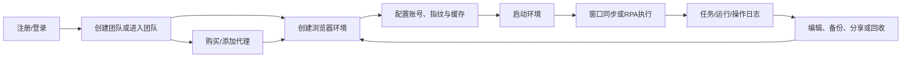

# AdsPower 产品分析报告

> 分析日期：2026-08-11  
> 产品版本：AdsPower Browser 8.7.23｜2.8.7.7

## 1. 产品模块概况

| 目录 | 图片数 | 主要覆盖 |
|---|---:|---|
| 环境管理 | 41 | 新建、编辑、指纹、代理、缓存、标签、搜索、偏好、本地设置、任务/消息/更新中心 |
| 代理管理 | 17 | 代理列表、动态/集成代理、添加编辑删除、购买代理、流量包、地区价格 |
| 任务管理 | 11 | 全部/平台/计划任务、创建任务、任务详情、执行环境和运行记录 |
| 流程管理 | 11 | 流程编辑器、设置、创建任务、分组、移动、复制、分享、导入导出、删除 |
| 登录 | 10 | 登录、注册、找回密码、协议、隐私、多语言、帮助中心 |
| 应用中心 | 9 | 团队应用、推荐应用、精选资源、添加、更新、设置、分类、移除 |
| 操作日志 | 9 | 登录、IP、打开、环境、分组、标签、代理、流程、成员日志 |
| 成员管理 | 7 | 成员列表、功能权限、分组、新建成员方式、编辑/删除分组 |
| 分组管理 | 6 | 创建、修改、合并、删除、授权 |
| 窗口同步 | 6 | 窗口列表、操作台、文字/标签页管理、设置、小组件 |
| 模版商店 | 5 | 模板列表、详情、免费/付费、排序、定制 |
| 费用中心 | 5 | 余额、充值、钱包币种、订单筛选、快捷支付/自动续订 |
| 续期 | 4 | 30/90/180/360天价格与折扣 |
| 升级套餐 | 3 | 专业版、商业版、企业版示例档位 |
| 团队信息 | 3 | 团队切换、管理、新建团队限制 |
| 回收站 | 3 | 列表、筛选、恢复、彻底删除 |
| API&MCP | 2 | MCP平台配置及 Cloud Code/Codex/Cluster/OpenCode 接入说明 |
| 免费试用 | 2 | Free/Trial权益、领取更多试用 |
| 推广奖励 | 1 | 推荐奖励、收益和排行榜区域 |
| 购买终身环境 | 1 | 永久环境购买与支付方式 |
| 运行记录 | 1 | RPA运行记录列表 |
| 全局设置 | 2 | 账号安全、多开、网址、标识、IP、同步、浏览器启动、书签等 |

## 2. 产品定位

AdsPower 是面向多账号运营和团队协作的指纹浏览器工作台。核心价值并非单纯“创建浏览器”，而是围绕独立浏览器环境形成一套资源、权限、自动化和审计体系：

1. 为每个业务账号创建隔离环境；
2. 配置浏览器指纹、代理、平台账号和缓存数据；
3. 通过分组、标签、成员权限和分享支持团队协同；
4. 通过窗口同步、RPA Plus、Local API、MCP 提升批量操作效率；
5. 通过日志、回收站、数据备份和全局安全策略实现治理；
6. 通过套餐、终身环境、代理、流量包和应用生态实现商业化。

## 3. 目标用户与场景

| 用户 | 目标 | 对应能力 |
|---|---|---|
| 跨境电商运营 | 隔离管理多店铺、多平台账号 | 环境、账号平台、代理、分组、标签 |
| 社媒/广告投放团队 | 批量管理账号并保持指纹一致 | 指纹配置、缓存、团队权限、窗口同步 |
| 自动化运营人员 | 批量执行重复任务 | RPA流程、模板商店、计划任务、运行记录 |
| 开发/技术团队 | 程序化控制浏览器环境 | Local API、MCP、多语言/平台接入 |
| 团队管理员 | 分配环境和功能权限、审计成员操作 | 成员管理、分组授权、操作日志 |
| 个人/小团队 | 低成本获得固定环境 | Free、Trial、专业版、终身环境 |

## 4. 核心业务闭环

## 5. 功能分析

### 5.1 账号、登录与安全

- 支持手机号/邮箱注册、邮箱验证、忘记密码。
- 登录页提供 Google、Facebook、VK 等第三方入口。
- 支持简体中文、English、Русский、Português、Tiếng Việt及更多语言。
- 展示用户协议、隐私政策、帮助中心和机器人客服入口。
- 我的账户包括邮箱绑定、手机号/密码修改、实名认证、身份验证器、第三方账号绑定、登录活动、默认接收团队、语言、时区、通知和注销。
- 全局安全含邮箱异地登录提醒、登录失败提醒、登录IP白名单、双重验证、异地登录验证强度、删除环境/成员操作控制。

### 5.2 浏览器环境生命周期

- 新建环境：平台、账号密码、Cookie、代理、浏览器内核、操作系统、指纹、分组、标签等。
- 编辑环境：名称、账号、备注、序号、标签、代理、指纹、偏好。
- 启动后入口展示IP、地区、复制/刷新、网络诊断、更多操作。
- 缓存：清除缓存、云端存储、备份快照；可同步 Cookie、已保存密码、书签、Local storage、IndexedDB、插件数据、历史记录等，具体受套餐/设置影响。
- 管理工具：搜索组合条件、分组筛选、批量移动、批量导出、自定义快捷区。
- 删除进入回收站；回收站支持恢复和彻底删除。

### 5.3 指纹与浏览器控制

指纹/环境维度包括：浏览器内核、操作系统、User Agent、语言、时区、WebRTC、地理位置、分辨率、字体、Canvas、WebGL、AudioContext、媒体设备、硬件并发、内存、设备名称、MAC、蓝牙、电池、端口扫描防护等。

全局/偏好设置还覆盖：多开模式、网址访问限制、本地访问、自定义环境标识、IP自动代理、IP查询渠道、数据同步、书签、浏览器启动行为、Google登录策略、网页翻译、开发者工具限制、文本复制和移动端模拟等。

### 5.4 代理资源

- 代理列表支持添加、编辑、删除、测试、标签和筛选。
- 代理来源包括自有添加、动态代理和集成代理资源。
- 添加/编辑字段可见：代理类型、IP查询渠道、主机、端口、账号、密码、刷新URL、备注。
- 商城内提供 FlashID 静态数据中心、静态ISP住宅、动态住宅流量包。
- 购买代理时存在地区、数量、自动续期、期限、钱包优先和多支付渠道。

### 5.5 团队与权限

- 团队切换、团队管理、新建团队；免费团队仅允许一个，继续新建需升级。
- 成员可通过账密创建或邮箱邀请。
- 成员分组包含名称、描述和权限模板。
- 功能权限覆盖团队、环境、分组、应用、回收站、RPA、代理、费用、成员、操作日志和全局设置等模块。
- 分组管理支持创建、修改、合并、删除与授权；删除警告表明可能同时删除分组内环境和数据。

### 5.6 自动化

- 窗口同步：选择主控/被控环境、同步排列、文字管理、标签页管理、输入延迟、设置窗口布局、桌面小组件。
- RPA Plus：流程画布、节点配置、任务流程分组、复制模板、分享、置顶、导出、删除、获取分享流程。
- 任务管理：全部任务、平台任务、计划任务；支持创建任务、选择环境、执行顺序/随机、普通/计划任务、优先执行和立即执行。
- 任务详情包含任务信息、运行环境和运行记录；可配置任务线程数。
- 模板商店支持平台分类、搜索、免费/付费筛选、最近更新/最多使用、详情、保存流程、保存并创建任务和定制模板。
- API&MCP：支持 Cloud Code、Codex、Cluster、OpenCode 等平台配置指引，但完整API接口目录和调用效果仍待补充。

### 5.7 应用生态

- 应用中心分团队应用、推荐应用、精选资源。
- 支持应用安装/添加、团队固定策略、分类、搜索、更新、设置和移除。
- 应用卡片示例包含 AdsPower Authenticator、AdsPower Assistant、翻译、Cookie工具、加密钱包和AI工具等。

### 5.8 治理、日志与商业化

- 操作日志按登录、IP、打开、环境、分组、标签、代理、流程和成员分类。
- 费用中心管理多币种钱包、充值、订单类型筛选、快捷支付与自动续订。
- 商业化包括 Free/Trial、专业版/商业版/企业版订阅、短期续期、终身环境、代理/IP、动态流量包和应用/模板生态。
- 推广奖励页面提供收益指标、推广链接/素材和邀请排行榜。

## 6. 产品优势

1. **环境生命周期完整**：创建、编辑、启动、缓存、备份、分享、删除和恢复形成闭环。
2. **团队治理较深**：成员分组、功能权限、环境分组授权、操作日志均有独立入口。
3. **自动化层次丰富**：窗口同步适合低门槛同步操作，RPA适合可视化流程，API/MCP适合开发者。
4. **商业模式多元**：订阅、终身环境、代理、流量包和生态资源覆盖不同付费意愿。
5. **安全和一致性能力突出**：指纹、代理、数据同步、全局安全策略共同支撑多账号场景。

## 7. 体验风险与改进建议

### 7.1 信息架构复杂

环境、分组、代理、应用、RPA、任务、日志和设置入口数量多，且部分能力在环境快捷菜单、顶部工具栏、侧栏和弹窗重复出现。建议提供角色化首页、全局搜索和“当前环境操作中心”。

### 7.2 RPA概念层级较多

流程、模板、任务、计划任务、平台任务、运行记录容易混淆。建议在首次进入时用固定术语链路解释：`模板 → 流程 → 任务 → 执行实例/运行记录`。

### 7.3 价格透明度不足

套餐通过滑杆动态计价，代理又叠加时长折扣和手续费。建议增加完整价格矩阵、计价公式、续订价说明和最终金额拆分。

### 7.4 高风险操作需强化

删除分组可能删除环境和数据，回收站又存在彻底删除。建议增加受影响数据清单、二次输入确认、可恢复期限及管理员审计提醒。

## 8. 未覆盖与待补充项

以下功能仍未完整覆盖：

1. **云手机**：已确认入口跳转外部DuoPlus；页面、套餐、实例和操作暂不提供。
2. **套餐完整价格矩阵**：基准档位四期限及多档短期补差已补充，但全部环境阶梯仍未穷尽。
3. **套餐全部时长价格**：专业版10、商业版200、企业版5000环境已补充四期限月均价；其他档位仍缺失。
4. **代理全部组合**：单IP同价地区可按统一公式类推；多IP数量折扣及动态流量包定制价仍缺失。
5. **企业版完整权益**：企业版页面下半部分被截断，专属服务未完整展示。
6. **API完整能力**：缺少本地API接口清单、鉴权、请求响应、错误状态和调用日志。
7. **MCP运行结果**：有配置说明，但缺少连接成功、工具列表或执行结果。
8. **帮助中心文章详情**：只有帮助首页。
9. **应用详情与付费规则**：多数只有列表卡片，缺少详情、权限、定价、安装结果。
10. **模板实际价格**：已补充一个$6模板结算示例，其余模板仍未覆盖。
11. **通知中心完整分类与操作**：仅弹窗概览。
12. **优惠码、退款、发票、自动续订取消结果**：入口或筛选存在，但完整流程缺失。

## 9. 详细功能补充

### 9.1 账号、登录与页面框架

- 注册当前仅支持 `+86` 手机号；验证码前有滑动图形验证；密码要求8～20位且同时包含数字、大小写字母；可填写邀请码。
- 注册需勾选用户协议与隐私政策，协议在应用内弹窗展示；注册成功后直接进入平台。登录输入框兼容邮箱或手机号，并支持记住密码和忘记密码。
- 忘记密码支持手机或邮箱验证码验证；第三方注册/登录支持Google、Facebook、VK。
- 支持简体中文、English、Русский、Português、Tiếng Việt等语言；帮助中心使用系统默认浏览器打开；右下角有“机器人小A”咨询浮窗。
- 登录后默认进入环境管理。首次进入有默认环境及说明弹窗，可在弹窗中编辑环境、打开环境或关闭提示。
- 顶部工具区包含PrimeSPY、出口网络、更新、任务、消息和账号菜单；账号菜单包含个人设置、推广奖励、语言、外观、网络诊断和退出登录。
- 内容区可提示未设置密码或未绑定身份验证器。用户说明显示“前往验证”提示跳转一次后便不再展示，即使验证未完成也会消失，存在安全提醒过早消失风险。

### 9.2 环境、代理、应用与窗口同步补充

- 新建环境包含基础设置、代理信息、账号平台、指纹配置、高级设置五个Tab，右侧有概要卡片。
- 环境管理支持组合搜索、打开状态筛选、标签筛选、刷新、分页、批量操作；单行支持打开、编辑、复制、删除、缓存数据、Cookie机器人及修改代理/账号/指纹。
- 代理管理包含代理列表、动态代理、集成代理、更多资源。新增代理支持HTTP、HTTPS、SSH、Socks5，单次最多500条，并支持IPv4/IPv6、多种账号密码/刷新URL格式。
- FlashID代理购买页在检测为中国大陆网络时显示不可购买提示与合规声明；可选静态数据中心、静态ISP住宅、动态住宅，并可设置到期前24小时从团队钱包自动续期。
- 应用中心的团队应用可通过Chrome应用商店URL添加；精选资源分云手机、社媒管理、聚合聊天、虚拟卡、广告投放、选品工具、网盟。
- 窗口同步支持键盘、鼠标、操作台、子窗口、仿真速度、外观和快捷键设置，并提供窗口管理、文本管理和标签页管理。

### 9.3 商业化与外部生态修订

- **终身环境**：$15/环境；首次购买会将已有2个免费环境升级为终身环境；最多额外购买8个、合计最多10个；可与订阅套餐并存，套餐到期后仍可用；支付成功立即生效且不退款。
- **云手机**：入口跳转至外部DuoPlus平台 `https://my.duoplus.cn/`；云手机页面暂不提供，因此不能分析其实例、操作与价格。
- **付费模板**：“Facebook：自动群发私信”订单金额$6.00、手续费$1.12、Alipay实付$7.12；仅代表单个模板。
- **套餐**：专业版10环境、商业版200环境、企业版5000环境提供30/90/180/360天月均价，并包含多环境档位的剩余1天补差示例。
- **代理**：同基础价国家/地区最终支付价一致，按统一计价规则计算。

### 9.4 当前仍暂缓或未覆盖

1. DuoPlus云手机页面、实例、功能及价格：暂不提供。
2. API完整能力和MCP执行结果：暂缓。
3. 帮助中心文章详情：暂缓。
4. 应用详情、权限、收费及安装结果：暂缓。
5. 通知中心完整分类：暂缓。
6. 优惠码、退款、发票、自动续订取消：暂缓。
7. 套餐全部阶梯完整期限价仍未穷尽；已有多档“更改套餐补差”不能替代完整订阅价。
8. 其余付费模板、动态代理大客户定制价及多IP数量折扣仍缺失。

## 10. 官网产品与市场分析

官网入口：[AdsPower官网](https://www.adspower.net/)。

### 10.1 已访问菜单清单

| 菜单域 | 已访问页面 |
|---|---|
| 功能 | [多账号管理](https://www.adspower.net/multi-account-management)、[窗口同步](https://www.adspower.net/synchronizer)、[RPA](https://www.adspower.net/rpa)、[Local API](https://www.adspower.net/local-api)、[批量环境管理](https://www.adspower.net/multi-profiles-management)、[团队协作](https://www.adspower.net/teamwork)、[账号安全](https://www.adspower.net/account-security) |
| 外部功能 | 云手机跳转DuoPlus |
| 场景 | [场景总览](https://www.adspower.net/solutions)、[联盟营销](https://www.adspower.net/solutions/affiliate-marketing)、[跨境电商](https://www.adspower.net/solutions/e-commerce)、[数字营销](https://www.adspower.net/solutions/digital-agency)、[社媒营销](https://www.adspower.net/solutions/social-marketing)、[网络爬虫](https://www.adspower.net/solutions/web-scraping)、[流量套利](https://www.adspower.net/solutions/traffic-arbitrage)、[票务管理](https://www.adspower.net/solutions/ticketing)、[SEO与SERP](https://www.adspower.net/solutions/seo-serp) |
| 资源 | [博客](https://www.adspower.net/blog)、跨境导航、[合作伙伴](https://www.adspower.net/partner)、帮助中心、视频教程、[免费工具](https://www.adspower.net/free-tools)、[RPA模板](https://www.adspower.net/rpa-details)、[推广返现](https://www.adspower.net/referral-program) |
| 商业与交付 | [价格](https://www.adspower.net/pricing)、[下载](https://www.adspower.net/download)、预约演示、登录、注册 |

### 10.2 产品与市场结论

- 官网将产品价值归纳为独立浏览器环境、批量操作、降低设备成本和团队治理，覆盖联盟营销、跨境电商、数字营销、社媒营销、数据采集、流量套利、票务和SEO监测等场景。
- 多账号管理页明确双内核：基于Chromium的SunBrowser和基于Firefox的FlowerBrowser，并支持环境批量导入、指纹自定义和本地缓存备份。
- 窗口同步仅支持SunBrowser；官网称同步窗口数量不设上限，但实际能力仍受设备性能和套餐约束。
- Local API定位为AI智能体与企业自动化执行环境，官网明确兼容Selenium、Puppeteer和Playwright。
- 官网安全页展示SOC 2 Type II、ISO 27001、ISO 27701，并宣称使用AES-256、RSA、SHA-512及本地敏感数据存储。认证真实性和具体证书范围仍应通过证书文件独立核验。
- 下载页显示8.7.23版本，支持macOS 11+、Windows 10+和Ubuntu Desktop 22.04+；页面发布日期为2026-07-28。
- 推广返现页宣称最高30%佣金；这属于营销规则，实际比例应以账号后台和活动条款为准。
- 官网免费工具是外部检测工具聚合入口，包括BrowserScan、Whoer、BrowserLeaks等，不是客户端核心能力。

### 10.3 营销口径说明

- “降低封号风险”“提升90%效率”“900万用户”等属于官网营销或运营口径，不能等同独立实测结论。
- 产品宣传中的用户规模、效率提升和风险降低属于营销口径，不应直接等同于独立测评结果。
