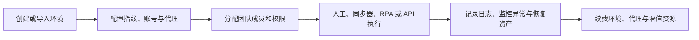
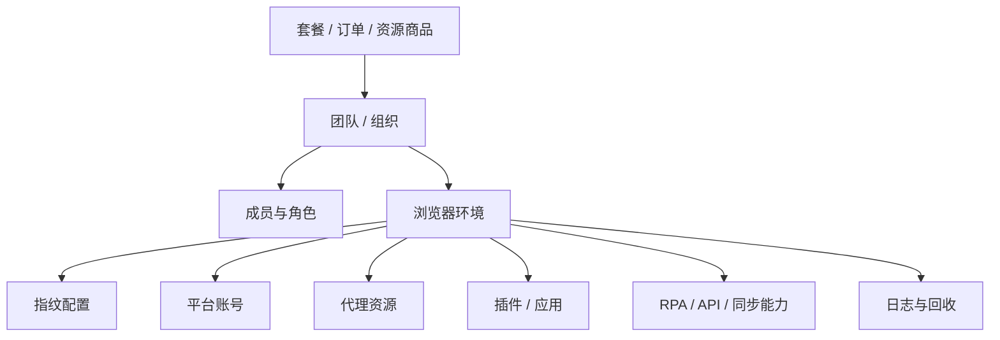

# YunLogin 与 AdsPower 竞品分析报告

> 报告日期：2026-08-13  
> 产品证据快照：YunLogin 2026-08-12；AdsPower 2026-08-11  
> YunLogin 客户端版本：V4.0.2.4；AdsPower 客户端样本版本：8.7.23 / 2.8.7.7  
> 服务对象：产品规划、管理层汇报、销售竞争支持、融资与市场研究  
> 非本报告范围：YunLogin 功能优先级、版本排期、路线图  
> 配套文件：[YunLogin 与 AdsPower 竞品对比矩阵.xlsx](./outputs/019ff91a-00b9-79b3-a937-14cf1ab77e9f/YunLogin与AdsPower竞品对比矩阵.xlsx)

## 1. 执行摘要

### 1.1 核心结论

1. **两款产品的核心架构高度同构。** 双方都以“浏览器环境”为核心资产，把账号、代理、指纹、Cookie、插件/应用和自动化能力封装为可创建、分配、运行、审计和回收的业务对象。因此，竞争已经不只是浏览器多开或指纹参数数量，而是环境资产治理、团队协作、自动化执行与商业生态的组合竞争。【已核实事实 + 分析判断】

2. **YunLogin 更像“环境资产中枢 + 团队治理 + 代理交易闭环”。** 当前材料显示，YunLogin 把环境、代理、账号、部门、角色、分享转移、日志、回收站、商城、购物车、云币、订单和续费放在同一个管理中心中，尤其适合人民币结算、平台代理采购和组织内资产流转较重的运营团队。【已核实事实 + 合理推断】

3. **AdsPower 的差异化证据更集中在“自动化入口梯度 + 全球商业化 + 外部生态”。** 窗口同步、RPA、Local API 与 MCP 接入入口形成由业务人员到开发者的分层路径；免费版、Trial、专业/商业/企业版、终身环境、代理流量包和付费模板构成更长的获客与变现阶梯；多币种和多地区支付覆盖也更完整。MCP 的工具清单、调用结果与稳定性尚未完整核验。【已核实事实 + 待核实边界】

4. **当前材料不能支持“AdsPower 去重后 759 项、YunLogin 263 项，所以 AdsPower 功能更多”的结论。** AdsPower 原始清单有 783 个功能项，其中 99 个标为“核心补充/建议补充/建议方案”，并非已观察到的上线事实；其清单还拆到按钮、字段和状态，而 YunLogin 主要以用户能力为颗粒度。按严格证据口径，现有资料也不足以把任何一项能力定性为“AdsPower 明确具备且 YunLogin 明确不支持”，只能区分“已确认差异”“一侧材料未覆盖”和“实现路径不同”。【方法论结论】

5. **核心环境与团队能力不是简单的有无之争，主要是深度、证据和体验路径之争。** YunLogin 已确认环境创建/迁移、三类代理来源、部门与角色、分享转移、RPA、本地 API、日志和回收；AdsPower 在窗口同步、MCP 接入入口、企业安全策略、全球支付和生态合作方面的公开证据更强。相反，YunLogin 在环境跨团队分享、平台/自有/API 代理统一管理、商城购物车与云币闭环方面的材料更完整。【已核实事实】

6. **价格只能在明确币种、周期与权益口径后比较，不能直接比较综合性价比。** YunLogin 提供人民币小额付费套餐样本与较深的长期周期折扣；AdsPower 提供美元计价的免费、试用、企业询价和终身买断梯度。两者原币种金额不能直接排序，汇率、活动、成员费、手续费、功能权益、代理质量和服务边界均会改变真实总成本。【已核实事实 + 边界判断】

7. **管理层应把竞争判断分成四条线，而不是汇总成单一总分：** 核心产品能力、组织与安全治理、自动化与开发者生态、获客与商业化。单一加权总分会掩盖证据缺口，也会把不同目标客户的价值偏好误当成统一优劣。【分析判断】

### 1.2 一页式竞争判断

| 竞争维度 | YunLogin 当前表现 | AdsPower 当前表现 | 结论性质 |
|---|---|---|---|
| 核心环境资产 | 环境统一承载账号、代理、指纹、Cookie、插件、RPA；创建、迁移、分享、转移和回收链路完整 | 环境统一承载指纹、代理、账号、Cookie、应用和自动化；批量、跨设备与恢复证据已见，但规则完整性不一 | 核心同构，路径各有侧重 |
| 指纹与浏览器 | 参数域覆盖较完整，支持真实、随机、噪声、自定义、匹配 IP 等策略 | 双内核与 WebGPU 等公开证据更突出 | 不宜按参数数量判胜负 |
| 代理能力 | 平台代理、自有代理、代理 API 与商城交易闭环 | 集成代理、静态/动态资源和供应商生态更丰富 | YunLogin 强在统一交易链；AdsPower 强在资源形态证据 |
| 团队治理 | 部门树、系统/自定义角色、操作级权限、数据范围、分享转移、三类日志 | 成员组、环境组授权、安全策略、异常邮件、IP 白名单、2FA 等证据更突出 | YunLogin 偏组织资产治理；AdsPower 偏企业安全治理 |
| 自动化 | 可视化 RPA、本地 API、插件市场已形成；窗口同步仅见入口/权限线索 | 窗口同步、RPA、Local API 与 MCP 接入入口 | AdsPower 当前证据领先，但 MCP 深度待核实 |
| 商业化 | 套餐、代理、购物车、云币、优惠券、订单、续费一体化 | 免费、Trial、多版本、终身环境、代理流量、付费模板、多币种支付 | YunLogin 更集中；AdsPower 更分层 |
| 国际化与生态 | 当前材料以人民币、支付宝/微信和客户经理服务为主 | 多币种、本地支付、合作伙伴、推荐计划和外部服务入口更明确 | AdsPower 当前证据领先 |
| 价格入口 | 人民币小额付费样本与长期折扣明确 | 免费入口和规模阶梯清晰，但另有成员费/手续费 | 原币种不可直接比较；需按汇率、周期与权益测算 |

## 2. 研究方法与证据边界

### 2.1 为什么主报告用 Markdown，Excel 作为附件

本项目不适合只用 Excel。产品架构、用户任务、商业模式、风险边界和竞争含义需要连续叙事与图像证据，Markdown 导入飞书后更适合管理层阅读、评论和长期维护；功能与价格涉及多维筛选、证据状态和结构化复核，Excel 更适合作为底表。

因此采用组合交付：

- **飞书/Markdown 主报告**：承载结论、架构图、场景分析、销售话术边界和研究判断。
- **Excel 对比矩阵**：承载能力域、证据状态、差异类型、来源、置信度和可筛选明细。
- **Markdown 模板**：用于后续新增竞品或滚动更新，避免每次重新定义口径。

### 2.2 证据等级

| 等级 | 定义 | 本报告使用规则 |
|---|---|---|
| A：产品事实 | 客户端实际页面、已有逐项操作记录、价格页快照、本地产品文档中的明确事实 | 可直接写“已具备/已显示”，同时标注版本或日期 |
| B：官方自述 | 官网、帮助中心、条款、官方博客或官方营销页 | 写“官方称/官网展示”，不能自动视为独立验证 |
| C：合理推断 | 由多个事实形成的定位、战略或体验判断 | 必须标“合理推断/分析判断”，不得伪装成官方定位 |
| D：待核实 | 一侧材料没有覆盖、规则不完整、来源无法独立复核 | 写“当前材料未确认”，不得写“没有/不支持” |

### 2.3 比较单位

本报告以“用户可完成的能力”为统一比较单位，不以按钮数、字段数、页面数或功能清单总数为单位。对比状态分为：

- **核心同构**：目的与关键闭环基本一致。
- **YunLogin 特色**：YunLogin 证据更完整或实现路径更适合特定场景。
- **AdsPower 证据更强**：AdsPower 有明确产品/公开证据，YunLogin 当前材料不足。
- **路径差异**：双方都解决同一问题，但组织、交易、自动化或交互路径不同。
- **待核实**：证据不足，不能判断产品有无或优劣。

### 2.4 研究限制

- 两套功能清单的拆分颗粒度不同，不能用去重后的 759 与 263 直接计算覆盖率；AdsPower 原始 783 个功能项中另有 99 个属于补充或建议，而非产品事实。
- AdsPower 的用户规模、环境规模、效率提升、认证与安全能力主要来自官方自述；本报告未完成独立审计。
- YunLogin 的部分高影响流程未实际提交，包括支付、充值、邀请成员、权限变更、API Key 创建和永久删除。
- 两家代理商品不是同质资源；未控制 ASN、IP 纯净度、成功率、带宽、故障替换和 SLA，不能按页面单价判定优劣。
- 用户提供的四篇竞品分析参考链接用于章节设计参考；本次执行期间外部页面未能稳定回读，因此本报告没有引用或复述其具体结论。
- 原始产品截图中含测试手机号、IP、MAC、团队 ID、终端识别码等信息；本报告只使用已核验且适合流转的架构图和旅程图。
- 本地 Markdown 中的图片和 Excel 链接只用于本机阅读；发布到飞书时必须转为飞书图片块/附件并回读验证，未上传的本地路径不算远端交付完成。

## 3. 市场问题与产品类别

跨境电商、社媒营销、广告投放、联盟营销和数据采集团队通常要同时管理大量账号。其核心问题不是“多开几个浏览器窗口”，而是为每个账号长期保持稳定且相互隔离的身份环境，并在多人协作时控制谁能查看、启动、修改、转移或删除这些资产。

典型任务链为：

由此可见，指纹浏览器产品实际上横跨四个市场层次：

1. **身份隔离工具**：提供独立 Cookie、本地存储、浏览器指纹和网络出口。
2. **多账号运营工作台**：提供环境分组、标签、搜索、批量操作、插件和账号绑定。
3. **团队资产治理平台**：提供组织、角色、数据范围、审批、审计、分享转移和回收。
4. **自动化与资源生态**：提供同步器、RPA、Local API/MCP 接入、代理资源、模板和合作伙伴服务。

YunLogin 与 AdsPower 都已经跨过第一层，竞争重心位于第二至第四层。【合理推断】

## 4. 产品概览与定位

| 维度 | YunLogin | AdsPower |
|---|---|---|
| 官方/页面定位证据 | 页面合规文案称其为面向电商营销场景的工具型软件，并说明不提供翻墙服务，代理由第三方供应商提供 | 官网将其定位为多账号安全管理的指纹浏览器 |
| 分析定位 | 面向跨境业务多账号团队的“指纹浏览器 + 环境资产运营工作台” | 面向全球多账号团队的“指纹浏览器 + 自动化与生态平台” |
| 核心资产 | 浏览器环境 | 浏览器环境/Profile |
| 主要用户 | 个人运营者、团队管理员、自动化运营者 | 个人/中小团队运营者、企业管理员、自动化与开发者用户 |
| 核心场景 | 环境创建与迁移、代理与账号绑定、团队分配、分享转移、RPA/API、代理采购 | 环境管理、窗口同步、RPA、Local API、MCP 接入入口、团队协作、全球支付与生态服务 |
| 商业边界 | 环境/成员套餐、静态代理、云币、优惠券、购物车、订单与续费 | 免费/Trial/订阅/企业询价/终身环境、成员、代理流量、付费模板与合作生态 |
| 主要证据风险 | 国际化、窗口同步、企业商务层和公开信任材料不足 | 规模、鉴证/认证和效率数据以官方自述为主，需独立核验 |

需要避免两个概念混淆：

- YunLogin 的“云登助手”是客户经理、在线客服、帮助中心和资源看板入口，不是 AI 助手。
- AdsPower 中的 DuoPlus 是外部云手机服务入口，现有材料不能证明其是 AdsPower 内部产品能力。

还需要明确公司主体边界：现有联系页与用户协议记录显示，AdsPower 的开发运营与知识产权主体为 `SUNFLOWER TECH PTE. LTD.`，广州标品软件有限公司是中国大陆授权代理与销售方。两者的产品入口和品牌合作不能自动证明股权控制、统一收入或同一法人经营。【官方主体资料记录】

## 5. 用户与核心任务对比

| 用户角色 | 关键任务 | YunLogin 支撑 | AdsPower 支撑 | 竞争判断 |
|---|---|---|---|---|
| 个人运营者 | 快速创建、稳定启动并低成本维护多个隔离环境 | 单个/批量/文件导入/一键迁移，平台代理与自有代理，快速启动和缓存管理 | 免费入口、批量环境、代理、双内核、同步器和终身环境 | YunLogin 偏运营闭环；AdsPower 偏低门槛获客与自动化 |
| 团队管理员 | 分配环境与代理、控制权限、审计操作、回收资产 | 部门树、系统/自定义角色、数据范围、分享转移、三类日志、30 天回收 | 成员组、环境组授权、安全设置、异常邮件、IP 白名单、2FA、回收 | 双方核心同构，治理重点不同 |
| 自动化运营者 | 批量执行重复任务并监控结果 | 可视化 RPA、本地 API、插件；API 限流和部分接口已记录 | 窗口同步、RPA、Local API、MCP 接入入口、模板交易 | AdsPower 的入口梯度更清晰、公开证据较多，MCP 执行深度待核实 |
| 财务/采购 | 采购环境、成员与代理，管理续费和支付 | 商城、购物车、云币、优惠券、订单、自动续费 | 多版本套餐、多币种钱包、多支付、代理/模板/买断环境 | YunLogin 强在集中式人民币结算；AdsPower 强在全球化和商品层级 |
| 管理层/安全负责人 | 掌握资产规模、风险与责任边界 | 资源看板、登录/操作/权限日志、高风险提醒、设备退出 | 企业安全策略、异常登录、IP 白名单、2FA、鉴证/认证展示 | 两者都可支撑，但 AdsPower 的外部信任材料更丰富 |

## 6. 产品架构对比

> 下列两张图均为根据产品模块与业务对象整理的“产品能力分析模型”，不是技术部署图。YunLogin 图中的窗口同步尚未完成实现核验；AdsPower 图中的快照及部分 API/MCP 细节含推导或未完整核验项，均须以本报告正文的证据边界为准。

### 6.1 YunLogin 产品架构

YunLogin 的架构围绕管理中心展开。环境资产、代理、账号、团队、日志、插件、API、RPA、商城、费用和回收站处于同一产品壳层内，交易与资产管理耦合较紧。这有利于形成“采购资源—配置环境—分配成员—执行任务—审计续费”的闭环。【已核实事实 + 合理推断】

### 6.2 AdsPower 产品架构

AdsPower 的架构同样以环境为中心，但从网站、下载、帮助中心到客户端，再到 Local API、MCP 接入入口、代理、模板、伙伴与推荐计划，外部触点和生态层更突出。其自动化层呈现“同步器—RPA—Local API/MCP 接入”的分级路径；具体 MCP 工具与执行结果未完整核验。【已核实事实 + 待核实边界】

### 6.3 分层对比

| 架构层 | YunLogin | AdsPower | 含义 |
|---|---|---|---|
| 访问与身份 | 账号密码、短信/邮件验证码、微信/钉钉扫码、团队选择、设备退出 | 账号体系、团队访问、2FA 和安全策略 | YunLogin 登录方式证据更细；AdsPower 企业安全策略证据更突出 |
| 环境资产层 | 环境、指纹、账号、代理、Cookie、插件、缓存、标签/分组 | Profile、指纹、账号、代理、Cookie、应用、分组与跨设备数据 | 核心同构 |
| 组织治理层 | 团队、部门、成员、角色、数据权限、审批、分享转移、日志、回收 | 团队、成员组、环境组、授权、安全策略、审计和回收 | YunLogin 更强调组织树与资产流转；AdsPower 更强调安全政策 |
| 自动化层 | 插件、RPA、本地 API | 窗口同步、RPA、Local API、MCP 接入入口 | AdsPower 的入口梯度更清晰，但 MCP 工具与执行结果未完整核验 |
| 商业交易层 | 套餐、代理、购物车、云币、优惠券、订单、自动续费 | 多版本套餐、终身环境、代理/流量包、模板、多币种支付 | YunLogin 交易集中；AdsPower 商品层级多 |
| 服务生态层 | 客户经理、7×24 客服、帮助中心、资源看板 | 官网内容、伙伴、推荐计划、外部云手机与代理生态 | AdsPower 全球获客与合作生态证据更强 |

## 7. 产品结构与核心业务链

### 7.1 核心数据对象

双方共同的数据骨架可以抽象为：

差异在于商业和治理对象的组织方式：

- YunLogin 将平台代理、自有代理、代理 API、分享记录、转移记录、云币、优惠券、购物车和订单作为显式对象，资产和交易关系较清晰。
- AdsPower 将免费、Trial、专业/商业/企业、终身环境、代理流量和模板商品形成多层商业对象，并通过伙伴与推荐计划连接外部生态。

### 7.2 YunLogin 已核验用户旅程

YunLogin 的主旅程为：登录与团队选择 → 创建环境 → 配置代理和账号 → 启动运营 → 团队协作 → 自动化扩展 → 安全审计 → 费用续费。实测已完成账号密码登录、团队选择、进入一级模块，并验证环境启动、状态变化和关闭闭环；高影响动作只核验到提交前。【已核实事实】

## 8. 功能能力深度对比

### 8.1 能力域总览

| 能力域 | YunLogin 证据 | AdsPower 证据 | 对比状态 | 判断 |
|---|---|---|---|---|
| 注册登录与设备 | 多种验证码/扫码登录、团队选择、设备列表与远程退出 | 登录、团队访问、2FA 与安全策略 | 路径差异 | YunLogin 入口证据更细；AdsPower 安全策略更突出 |
| 环境创建与导入 | 单个、批量、XLS/XLSX/CSV、≤10MB/≤300 条、一键迁移 24 小时 | 单个/批量和导入证据已见；跨设备见于设置/套餐权益；数据迁移只确认到套餐权益，具体对象与记录规则未核验 | 路径差异 | YunLogin 对导入约束和迁移规则证据更细；AdsPower 的迁移闭环待核实 |
| 指纹配置 | 地区、屏幕/字体、Canvas/WebGL、Audio、媒体、硬件、WebRTC 等 | UA、Canvas、WebGL、WebGPU、WebRTC、时区、语言、硬件等 | 核心同构 | 需靠真实反检测效果验证，不能按参数数目下结论 |
| 环境生命周期 | 搜索、保存搜索、筛选、自定义列、启动/关闭、克隆、标签、分组、缓存、回收 | 分组、批量管理、跨设备同步、回收恢复 | 核心同构 | 双方核心操作均有证据；跨设备与恢复规则完整性不一，交互效率需任务实测 |
| 代理管理 | 平台、自有、API 三源；批量最多 500 行、检测、去重、授权和环境分配 | 集成代理、静态数据中心、静态 ISP、动态住宅、检测和供应商生态 | 路径差异 | YunLogin 管理闭环更集中；AdsPower 商品形态更多 |
| 平台账号与凭据 | 独立账号库、密码、2FA、凭据锁定、导入和绑定环境 | 账号信息随环境管理，批量和安全能力 | YunLogin 特色 | 当前 YunLogin 对独立账号资产证据更完整 |
| 团队与权限 | 部门树、子部门、成员转移、系统/自定义角色、操作级权限和数据范围 | 成员组、权限、环境组授权和团队协作 | 路径差异 | YunLogin 组织结构证据更细 |
| 分享与跨团队转移 | 多团队 ID 分享、有效期、缓存、备注、附件、取消分享；环境/平台代理转移记录 | 环境分享已确认；Trial 权益页称无限分享；数据迁移仅套餐权益显示，具体对象与记录规则未核验 | 路径差异 | YunLogin 分享和跨团队转移字段证据更完整；AdsPower 的分享权益与迁移规则需分开核实 |
| 插件/应用 | 市场、搜索、安装、多来源、可见范围、环境分配 | 应用中心与 Chrome 生态 | 核心同构 | 生态规模与审核质量未同口径核验 |
| 窗口同步 | 仅确认到权限/入口线索；具体同步控制未核实 | 35 项同步控制证据，覆盖点击、输入、滚动、标签页等；仅支持 SunBrowser | AdsPower 证据更强 | 不得把竞品参考模型当 YunLogin 已实现功能；AdsPower 也存在内核限制 |
| RPA | 模板、市场、可视化流程、环境分配、计划/优先任务、线程、本地执行与日志 | 可视化 RPA、模板市场、任务执行与付费模板 | 核心同构 | AdsPower 商业化证据更强；双方失败恢复均需核实 |
| 本地 API / MCP | 本地 API，POST+JSON、每接口每秒最多 1 次，兼容 Selenium/Puppeteer，部分接口与错误码 | Local API，官方称兼容 Selenium/Puppeteer/Playwright；另有 MCP 接入入口 | AdsPower 证据更强 | YunLogin 基础 API 已确认；AdsPower MCP 工具清单/结果、双方完整鉴权和版本策略均待核实 |
| 日志、风控与回收 | 登录/操作/权限日志、高风险提醒、凭据锁定、设备退出、30 天回收 | 异常邮件、失败登录、IP 白名单、2FA、高风险操作、回收 | 路径差异 | YunLogin 资产追溯完整；AdsPower 策略证据更强 |
| 费用与订单 | 套餐、代理、购物车、云币、优惠券、订单、续费 | 套餐、钱包、订单、代理、模板与续费 | 核心同构 | YunLogin 集中购物车证据更完整；AdsPower 商品类别更多 |
| 客服与帮助 | 客户经理、7×24 客服、帮助中心、资源看板 | 帮助中心、官网内容、企业服务和伙伴体系 | 路径差异 | 服务质量和 SLA 均无独立验证 |

### 8.2 浏览器环境与指纹

双方的指纹参数域已经覆盖浏览器、系统、硬件、网络与媒体设备等常见维度。真正影响客户价值的不是参数是否出现在表单，而是：

- 环境多次启动时指纹是否稳定；
- 指纹与代理地域、语言、时区和 WebRTC 是否一致；
- 内核升级后环境是否兼容；
- 目标网站账号登录成功率与风控率；
- 批量创建、克隆和迁移是否引入重复特征；
- 异常时能否定位到代理、指纹、Cookie、插件或自动化步骤。

现有文档没有提供同场景检测通过率、长期稳定性、账号存活率或内核兼容率，因此不能宣称任何一方“反检测能力更强”。【证据不足，不等于能力相同】

### 8.3 代理与资源采购

YunLogin 的平台代理、自有代理、代理 API 三源并存，且与商城、购物车、云币、订单和自动续费连接，形成从采购到环境分配的内部闭环。AdsPower 的代理结构在静态数据中心、静态 ISP、动态住宅流量和供应商生态方面更丰富。

对客户的实际含义是：

- 需要统一采购、分配、授权和续费的国内团队，YunLogin 当前路径更集中。
- 需要多国家动态住宅流量或多供应商选择的全球团队，AdsPower 当前商品证据更丰富。
- 任何代理价格比较都应加入成功率、故障率、替换时间和人工成本，页面单价只是采购成本的一部分。

### 8.4 团队治理、安全与审计

YunLogin 更强调“资产属于哪个团队/部门、谁能操作、如何分享转移、如何追溯和恢复”；AdsPower 更强调“团队访问策略、异常登录、IP 白名单、2FA 和高风险操作”。两者并非互斥，但反映了不同的治理入口。

对于管理层采购，应分别验证：

1. 最小权限能否落到环境、代理、账号和操作动作；
2. 离职成员的环境、凭据、代理和任务能否一键回收；
3. 分享/转移后的所有权、缓存、Cookie 和日志如何处理；
4. 高风险操作是否支持告警、审批、阻断与追责；
5. 认证范围是否覆盖实际产品、组织和数据处理流程。

AdsPower 官网展示 SOC 2 Type II 鉴证报告、ISO 27001/27701 认证及加密/本地存储说明，这些应表述为“官方展示”，在融资、审计或大客户投标中仍需核验报告/证书主体、范围和有效期。SOC 2 Type II 不是认证。【官方自述，未独立核验】

另外，现有 AdsPower 清单显示，环境分享默认包含平台、账号密码、2FA、Cookies、指纹和 IP 等核心数据；环境名称、代理、备注、标签页、书签及浏览器保存密码等另有可选项，“可撤回分享/不可撤回分享”的模式选择也已确认。但敏感信息二次提示，以及发起撤回后的数据处置、记录与接收方停用规则未确认。企业采购应把敏感数据授权、最小披露和撤回后处置列为专项核验。其应用中心也明确暂不支持团队强制安装、禁止成员关闭和版本锁定，因此不能从“团队应用”入口推导出成熟的企业扩展治理。【已核实事实 + 风险判断】

### 8.5 自动化与开发者能力

AdsPower 当前形成三层自动化入口梯度：

YunLogin 已确认可视化 RPA、本地 API 和插件市场，能够覆盖业务人员与开发者两类扩展方式；但窗口同步的具体动作、MCP、API 鉴权、完整错误码、版本兼容、并发、告警和失败重试未由当前材料确认。AdsPower 的 MCP 也只确认到接入入口，工具清单、连接成功和执行结果尚未完整核验。

这意味着 AdsPower 的优势首先是**入口梯度与证据覆盖**，而不是已经被证明在所有任务上效率更高。要形成可用于销售或产品决策的强结论，仍需以相同任务脚本测试成功率、耗时、资源占用、恢复成本和学习成本。

## 9. 商业模式与价格对比

### 9.1 商业模式

| 变现/获客入口 | YunLogin | AdsPower | 竞争含义 |
|---|---|---|---|
| 免费入口 | 当前价格材料未确认独立免费套餐 | 免费 2 环境、1 名超级管理员 | AdsPower 的自助获客阶梯更明确 |
| Trial | 当前材料未确认 | 12 环境、2 成员，$14/月并含 1 天试用证据 | AdsPower 的付费试用路径更明确 |
| 标准订阅 | 10～5000 快捷档位并支持连续调整 | 专业版 10～100、商业版 200～5000 | 双方均按环境规模收费，分层不同 |
| 企业方案 | 当前材料未确认企业档、询价或服务边界 | 5000 以上企业版与询价 | 只能写“YunLogin 未确认”，不能写“明确没有” |
| 成员增购 | ¥19/人，最终受周期/折扣影响 | $5/人/月，长期周期随折扣 | 需按同周期、同角色权益比较 |
| 买断环境 | 当前材料未确认 | $15/终身环境，存在数量和退款规则 | AdsPower 提供订阅之外的付费偏好 |
| 代理 | 家庭住宅静态、云平台静态、自有代理/API | 静态数据中心、静态 ISP、动态住宅流量包 | 商品形态不同，不可直接比价格 |
| 自动化内容 | RPA 模板市场已确认，付费规则未确认 | 已确认付费 RPA 模板样本 | AdsPower 内容变现证据更强 |
| 钱包与支付 | 人民币云币、支付宝、微信、CDKEY | USD/BRL/PLN/VND 与多地区支付方式 | 目标市场和结算复杂度不同 |
| 渠道生态 | 客户经理与服务入口 | 合作伙伴、推荐计划和外部服务 | AdsPower 的规模化渠道证据更强 |

### 9.2 套餐价格快照

以下为页面时点性事实，不代表长期标准价，也不把美元换算成人民币：

| 场景 | YunLogin（2026-08-12） | AdsPower（2026-08-11） | 说明 |
|---|---:|---:|---|
| 入门免费 | 未确认 | 2 环境，$0 | 未确认不等于没有 |
| 10 环境 / 30 天 | ¥16.15 | 环境商品 $9.00/月；成员另计 | YunLogin 当前含 8.5 折页面活动 |
| 200 环境 / 30 天 | ¥256.79 | 环境商品 $61.00/月；成员另计 | AdsPower 为分段累进计价 |
| 5000 环境 / 30 天 | ¥1,288.60 | 官网：5000 以上企业档询价；客户端样本：环境 $597 + 4 名成员 $20 = $617/月 | 官网与客户端为两套展示口径，且币种不同，不宜直接排序 |
| 10 环境 / 360 天 | ¥114.00/整个周期 | 官网年付 8 折，完整订单额需按配置 | YunLogin 当前为 5 折页面活动 |
| 新增成员 | ¥19/人，周期/折扣影响最终金额 | $5/人/月 | 需确认免费管理员和权限权益 |

YunLogin 当前 30/90/180/360 天页面折扣为 8.5/8/7.5/5 折；AdsPower 公开样本为月付、季付 9 折、半年 8.5 折、年付 8 折。YunLogin 长周期页面折扣更深，但这也可能带来活动依赖、续费价格预期和单位收入压力，不能只视为优势。【事实 + 分析判断】

### 9.3 价格判断边界

- 不使用固定汇率得出“便宜 X%”作为主结论；如需财务测算，应在 Excel 中把汇率作为可编辑假设。
- AdsPower 常见支付样本存在 `订单金额 × 2% + $1` 的手续费；YunLogin 当前样本未见同类费用。手续费是否普遍适用仍以最终支付页为准。
- YunLogin 的家庭住宅静态代理在活动条件下有折扣和首月减免，活动截止 2026-09-09；不能当成长期价格。
- YunLogin 已确认代理不能退换、套餐减配不退费；AdsPower 终身环境明确不退款。双方其他退款、税费、发票和续费失败规则都不完整。

## 10. 体验与运营效率判断

### 10.1 YunLogin

优势证据：

- 环境、账号、代理、组织、日志、交易和回收都在管理中心内，运营链路连续。
- 创建环境支持单个、批量、文件导入和一键迁移，适合存量账号迁入。
- 部门、角色、数据范围、分享和跨团队转移形成较完整的资产治理闭环。
- 人民币云币、购物车、优惠券和续费符合国内采购与财务习惯。

体验风险：

- 环境、指纹、代理和权限术语密集，新用户需要较高配置认知。
- 成员、账号、环境与权限关系分散在多个模块，跨对象排障成本可能较高。
- 同地区多张代理资源卡的供应商、质量、库存、替换与售后解释不足。
- RPA/API 的失败重试、告警和资源占用规则未形成完整证据。

### 10.2 AdsPower

优势证据：

- 免费、Trial 和清晰版本梯度降低自助体验与升级门槛。
- 同步器、RPA、Local API 与 MCP 接入入口适配不同技术能力的用户。
- 多币种、多支付、伙伴与推荐计划更适合全球获客和渠道增长。
- 企业安全策略和鉴证/认证展示便于大客户沟通，但不等于完成采购审查。

体验风险：

- 产品、代理、模板、外部云手机和合作生态扩大后，第三方质量、隐私、结算与售后边界更复杂。
- 多版本、成员费、手续费、买断环境与增值商品增加了价格理解成本。
- 官网规模与安全指标以官方自述为主，不能替代产品稳定性和客户结果验证。
- 自动化能力丰富不等于任务成功率更高，仍需相同任务实测。
- 窗口同步仅支持 SunBrowser；团队应用强制安装、禁止关闭和版本锁定明确暂不支持。

## 11. SWOT

### 11.1 YunLogin SWOT

| 类别 | 内容 | 证据性质 |
|---|---|---|
| Strengths | 环境资产中枢完整；平台/自有/API 代理三源统一；部门、角色、数据权限、分享转移、日志和回收链路细；商城/购物车/云币/订单闭环；人民币小额付费入口与长期折扣样本明确 | 产品事实 |
| Weaknesses | 窗口同步、MCP、国际支付、企业商务层、公开安全信任材料的证据不足；术语和跨模块关系复杂；自动化异常闭环不完整 | 事实 + 待核实 |
| Opportunities | 国内跨境团队的一体化采购与资产治理；从环境管理延伸到运营资产平台；以代理质量和服务闭环强化交易价值；通过标准化证据提升大客户可信度 | 分析判断 |
| Threats | AdsPower 的全球品牌、自动化入口梯度和生态分发形成进入壁垒；深折扣可能影响长期价格锚点；代理供应链质量会反向影响核心产品口碑 | 分析判断 |

### 11.2 AdsPower SWOT

| 类别 | 内容 | 证据性质 |
|---|---|---|
| Strengths | 自动化入口梯度已形成；免费到企业及买断的商业阶梯；多币种和多支付；伙伴、推荐计划、代理和模板生态；企业安全材料丰富 | 产品事实 + 官方自述 |
| Weaknesses | 商品与生态边界复杂；手续费和多层价格增加理解成本；公开规模与安全结论仍需独立核验；部分外部服务并非内部能力 | 事实 + 分析判断 |
| Opportunities | 通过 MCP/API 接入扩大开发者与 AI 自动化场景；用企业服务和全球渠道提升大客户渗透；通过模板与代理提高客单价 | 分析判断 |
| Threats | 人民币结算和本地服务更强的竞品可能在国内采购中形成压力；生态第三方问题可能传导至品牌；目标平台规则与监管变化会影响整个品类 | 分析判断 |

## 12. 销售竞争支持

### 12.1 更适合优先主张 YunLogin 的场景

| 客户情境 | 可主张价值 | 必须出示的证据 | 话术边界 |
|---|---|---|---|
| 国内团队希望人民币统一采购 | 云币、支付宝/微信、套餐与代理购物车、优惠券和订单闭环 | 当前套餐页、商城、费用管理与订单记录 | 不承诺所有代理资源长期同价或可退款 |
| 团队组织层级与资产交接复杂 | 部门树、自定义角色、操作级权限、数据范围、分享转移和回收 | 团队管理、分享转移、日志和回收证据 | 不把未实测的审批/异常规则说成完整 SLA |
| 同时使用平台代理和自有代理 | 平台、自有、API 三源统一管理、检测与环境分配 | 代理管理与环境绑定流程 | 不承诺所有供应商质量等同 |
| 迁移存量环境 | 文件导入、一键迁移、24 小时链接及指纹/Cookie 迁移 | 创建环境和迁移规则 | 分享接收权限与到期缓存规则仍需核实 |
| 偏好人民币小额付费与年付折扣 | 人民币定价、云币结算和长期周期折扣样本 | 标注日期的价格快照 | 跨币种成本需按可编辑汇率、成员、手续费和权益测算 |

### 12.2 AdsPower 更有说服力的场景

| 客户情境 | AdsPower 证据 | YunLogin 应答边界 |
|---|---|---|
| 需要窗口批量同步操作 | 同步器及细分动作证据较细 | 当前不能声称 YunLogin 已有等价完整能力 |
| 开发者希望接入 MCP/Playwright | Local API、MCP 接入入口与 Playwright 官方自述 | YunLogin 已确认本地 API 与 Selenium/Puppeteer，但 MCP/Playwright 未确认；AdsPower MCP 执行深度也待核实 |
| 全球团队需要本地支付 | 多币种及多地区支付方式 | YunLogin 当前以人民币、支付宝/微信和云币为主 |
| 客户从免费试用逐步扩容 | 免费、Trial、专业/商业/企业和终身环境 | YunLogin 是否有等价入口需产品/商务核实 |
| 大客户要求认证材料 | 官网展示 SOC 2 Type II 鉴证报告、ISO 27001/27701 认证 | 不否认竞品材料，但建议客户核验报告/证书主体、范围和有效期 |

### 12.3 常见异议的证据化回答

| 客户异议 | 建议回答 | 禁止回答 |
|---|---|---|
| “AdsPower 功能是不是更多？” | 两家清单颗粒度不同，且 AdsPower 原始清单含补充/建议项。核心环境、代理、团队、RPA 和 API 均已覆盖；应按您的任务逐项演示和测试。 | “YunLogin 263 项，AdsPower 去重后 759 项，所以少很多/完全一样。” |
| “YunLogin 是否一定更便宜？” | YunLogin 有人民币小额付费与长期折扣样本，但是否更便宜取决于汇率、周期、成员、手续费、代理质量、权益和服务，需按同一任务测算。 | “一定便宜 X%，性价比最高。” |
| “YunLogin 有窗口同步/MCP 吗？” | 当前材料未完成等价能力核验，可现场确认具体需求和版本。 | 把竞品参考模型或权限入口当成已实现功能。 |
| “AdsPower 的鉴证/认证是否更安全？” | 其官网展示 SOC 2 Type II 鉴证报告和 ISO 认证；范围和有效期应核验，产品安全还需结合数据流、权限和事件响应。 | “有认证就绝对安全”或“认证没有意义”。 |
| “代理谁更好？” | 应在同地区、同类型、同协议下测试成功率、延迟、故障率、替换和 SLA。 | 只按单个页面价格判断质量。 |

## 13. 管理层与融资视角

### 13.1 竞争壁垒拆解

| 壁垒 | YunLogin 当前基础 | AdsPower 当前基础 | 观察指标 |
|---|---|---|---|
| 环境数据与迁移成本 | 账号、代理、指纹、Cookie、插件、缓存、分享转移 | 环境、跨设备数据、应用和自动化 | 活跃环境、迁移成功率、切换成本、数据留存 |
| 组织治理 | 部门、角色、数据范围、日志和回收 | 团队权限、安全策略和审计 | 团队规模、权限模板复用、离职回收时长、风险事件 |
| 自动化生态与内容积累 | RPA 模板与 API | 同步器、RPA、Local API、MCP 接入入口、付费模板 | 模板供给/使用/成功率、API 活跃开发者、任务留存 |
| 资源交易 | 套餐、静态代理、购物车、云币和续费 | 套餐、静态/动态代理、模板、钱包 | 代理渗透率、复购率、毛利、退款和替换成本 |
| 品牌与渠道 | 客户经理和服务入口 | 内容、伙伴、推荐计划、全球支付 | 获客渠道结构、CAC、转化周期、伙伴贡献、地区收入 |
| 信任与合规 | 产品内合规说明、安全/审计能力 | 鉴证/认证与安全官方材料 | 报告/证书范围、安全事件、SLA、合规审计通过率 |

### 13.2 尚不能回答的融资问题

现有产品材料不能支持以下结论，融资或市场研究中应另行取数：

- 市场规模、份额、增长率和行业排名；
- 两家真实用户数、付费团队数、活跃环境数和地区收入；
- ARR、ARPU、毛利率、续费率、净收入留存、CAC 和回收期；
- 代理和支付业务的收入确认、供应商集中度与毛利；
- RPA/API 的真实使用率、任务成功率和对留存的因果影响；
- 安全事件、账号风控结果、平台封禁率和监管风险暴露。

把上述未知项留空比用官方营销口径补齐更可靠。

## 14. 战略含义（不含功能优先级与版本路线）

1. **YunLogin 的竞争叙事应围绕“多账号运营资产平台”，而不是只围绕指纹参数。** 环境、代理、账号、组织、审计和交易闭环已经支持更高层的价值主张。【分析判断】

2. **对 AdsPower 的竞争不应采用全量功能追赶逻辑。** 同步器、MCP、全球支付、企业信任和渠道生态分别服务不同客户群，需要先验证目标客户价值，不能把竞品存在等同于需求成立。【分析判断】

3. **销售与产品应共用同一证据矩阵。** “已确认”“官方自述”“合理推断”“待核实”必须在演示、报价、投标和融资材料中保持一致，避免将待核实项说成缺失或将入口线索说成完整能力。【方法论建议】

4. **价格竞争应从页面金额升级为任务总拥有成本。** 对环境、成员、代理、支付、失败重试、人工配置和售后替换建立同口径成本，才能判断真正的价格优势。【分析判断】

5. **外部信任材料需要与内部产品能力同时建设和验证。** 认证、合规、安全说明、SLA、事故响应和数据流说明会直接影响企业采购，但必须以可核验范围为准。【分析判断】

## 15. 结论

YunLogin 与 AdsPower 已经处于同一产品类别的同一核心战场：以浏览器环境承载多账号身份，通过代理、团队、自动化和商业资源完成规模化运营。

YunLogin 当前最清晰的竞争基础是：**环境资产闭环、三类代理统一管理、组织与资产流转、人民币交易闭环，以及人民币小额付费与长期折扣入口。** AdsPower 当前最清晰的竞争基础是：**窗口同步、RPA、Local API 与 MCP 接入入口构成的自动化入口梯度，免费到企业及买断的商业梯度，全球支付和合作生态，以及更丰富的公开信任材料。**

这不是“谁功能项更多”的问题，而是两条平台化路径的竞争。YunLogin 偏向把运营资产和交易链做深，AdsPower 偏向把自动化、全球商业化和生态触点做宽。最终胜负需要用目标客户的任务成功率、团队治理效率、总拥有成本、续费与信任指标验证，而不是用页面数量或营销口径替代。

## 附录 A：关键本地证据

### YunLogin

- [产品架构](../YunLogin产品分析/YunLogin产品架构.md)
- [产品结构](../YunLogin产品分析/YunLogin产品结构.md)
- [产品功能清单](../YunLogin产品分析/YunLogin产品功能清单.md)
- [产品价格清单](../YunLogin产品分析/YunLogin产品价格清单.md)
- [用户旅程图](../YunLogin产品分析/云登指纹浏览器用户旅程图.md)

### AdsPower

- [产品架构](../Adspower产品分析/Adspower产品架构.md)
- [产品结构](../Adspower产品分析/Adspower产品结构.md)
- [产品功能清单](../Adspower产品分析/Adspower产品功能清单.md)
- [产品价格清单](../Adspower产品分析/Adspower产品价格清单.md)
- [产品分析报告](../Adspower产品分析/Adspowe产品分析报告.md)
- [商业需求文档](../Adspower产品分析/Adspower商业需求文档BRD.md)
- [产品背景](../Adspower产品分析/Adspower产品背景.md)
- [公司背景分析](../Adspower产品分析/广州标品软件有限公司背景分析报告.md)

## 附录 B：官方公开来源索引

> 下列链接来自现有产品分析材料中的来源记录。本次报告执行期间未能稳定回读外部页面，涉及动态价格、版本、规模与认证的内容必须在对外发布前再次核验。

- [AdsPower 官网](https://www.adspower.net/)
- [多账号管理](https://www.adspower.net/multi-account-management)
- [窗口同步](https://www.adspower.net/synchronizer)
- [RPA](https://www.adspower.net/rpa)
- [Local API](https://www.adspower.net/local-api)
- [多环境管理](https://www.adspower.net/multi-profiles-management)
- [团队协作](https://www.adspower.net/teamwork)
- [账号安全](https://www.adspower.net/account-security)
- [定价](https://www.adspower.net/pricing)
- [合作伙伴](https://www.adspower.net/partner)
- [推荐计划](https://www.adspower.net/referral-program)
- [2025 年度回顾](https://www.adspower.net/blog/adspower-2025-annual-review)

## 附录 C：更新规则

- 动态价格、活动、版本和公开数据每次对外使用前重新核验，并记录日期。
- 新增证据先更新对应能力行，再同步复核受影响的执行摘要、SWOT、销售话术、价格判断和结论，并保留历史版本或变更记录。
- “材料未覆盖”只有在获得明确“不支持”证据后，才可升级为“明确缺失”。
- 任何功能优劣结论至少需要一项可复现任务或客户结果指标支持。
- 对现有飞书文档做后续修改时，按照团队约定使用紫色文字并配合删除线；新建文档首次写入保持正常样式。
- 飞书发布时需上传三张图片和 Excel 附件、替换本地链接并回读；仅写入含本地路径的 Markdown 不视为完成归档。
