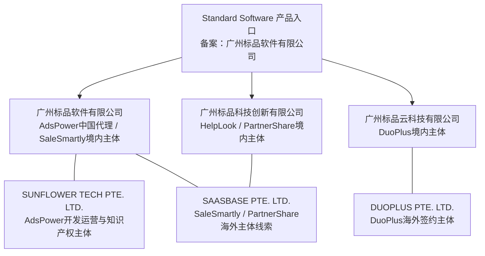
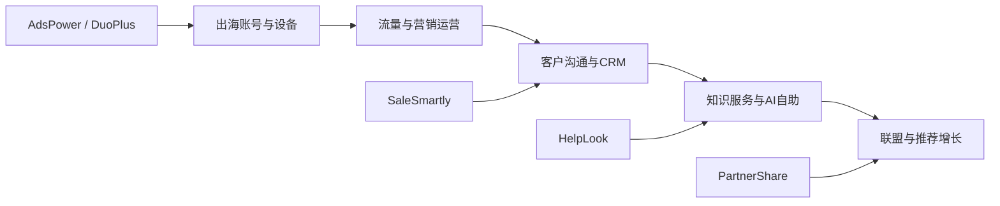

# 广州标品软件有限公司背景分析报告

> 调研日期：2026-08-12  
> 调研范围：广州标品软件有限公司及公开材料能够证明存在品牌、运营或生态关联的 AdsPower、SaleSmartly、DuoPlus、HelpLook、PartnerShare，以及 SHOPLINE 合作页面。  
> 重要说明：公开网站能证明多个品牌属于同一“标品软件产品入口”及相互合作生态，但不足以证明全部境内外主体之间的股权控制关系。本报告不把品牌关联自动等同于工商控股。

## 1. 执行摘要

广州标品软件有限公司可被理解为一家面向中国企业出海的 SaaS 运营与服务主体。其公开产品生态覆盖出海业务的五个关键环节：

1. **账号与设备基础设施**：AdsPower 管理桌面浏览器环境，DuoPlus 管理移动端云手机环境；
2. **客户沟通与转化**：SaleSmartly 聚合海外社媒、独立站和私域沟通；
3. **内容与服务承载**：HelpLook 建设帮助中心、知识库、博客和 AI 问答；
4. **渠道增长与佣金结算**：PartnerShare 为出海 SaaS 提供联盟推广、邀返和推广市场；
5. **生态渠道合作**：与 SHOPLINE 等建站、支付、代理、营销和跨境服务商互换流量、联合获客。

从商业模式看，这不是单一指纹浏览器公司的简单横向扩品，而更像围绕“企业出海获客—运营—沟通—服务—增长”的工具组合。各产品普遍采用免费版或免费试用获客、按规模分层订阅、附加资源增购、企业定制和联盟分销，形成典型的 **PLG（产品驱动增长）+ 内容获客 + 联盟渠道 + 销售辅助** 的混合模式。

但需要修正一个关键前提：**AdsPower 并非由广州标品软件有限公司单独开发和拥有。** [AdsPower 联系页](https://www.adspower.net/contact-us)与[用户协议](https://www.adspower.net/terms-of-use)明确写明，产品由新加坡主体 `SUNFLOWER TECH PTE. LTD.` 开发运营并拥有相关知识产权，广州标品软件有限公司是中国大陆官方授权代理商和合法代理销售方。类似地，DuoPlus、HelpLook、PartnerShare 也各有独立境内运营主体；因此更准确的研究对象是“广州标品软件及其关联产品生态”，而不是把所有产品直接归为同一法人名下。

## 2. 信息性质与可信度规则

| 标记 | 定义 | 使用原则 |
|---|---|---|
| 已核实事实 | 官方协议、官网主体声明、ICP备案、政府名单或多个独立来源一致支持 | 可作为报告结论 |
| 官方自述 | 产品官网自行公布的用户量、增长率、案例数据或认证描述 | 可以引用，但不能视作独立审计结果 |
| 合理推测 | 根据产品、价格、渠道和主体关系形成的商业分析 | 必须说明推理依据 |
| 无法核实 | 收入、利润、成本、融资、股权、员工总数等缺乏可靠公开资料 | 不给出确定数字 |

## 3. 公司主体与历史沿革

### 3.1 广州标品软件有限公司

| 项目 | 调研结果 | 性质 |
|---|---|---|
| 企业名称 | 广州标品软件有限公司 | 已核实事实 |
| 统一社会信用代码 | 91440101MA5D7T0PXR | 工商聚合资料，建议必要时再向国家企业信用信息公示系统复核 |
| 成立日期 | 2020-04-24 | 工商聚合资料 |
| 法定代表人 | 陈哲颖 | 工商聚合资料 |
| 企业类型 | 有限责任公司（自然人独资） | 工商聚合资料 |
| 所属行业 | 软件和信息技术服务业 | 工商聚合资料 |
| 注册地址 | 广州市天河区员村三横路东巷1号之二3楼1031房 | 工商聚合资料及 SaleSmartly SDK 隐私政策相互支持 |
| 前身名称 | 广州散步去信息科技有限公司 | 广东省高新技术企业更名名单支持；统一信用代码一致 |
| 经营方向 | 软件开发、信息系统集成、信息技术咨询、数据处理、网络技术、营销策划等 | 工商聚合资料 |
| 政府认定 | 入选[广东省 2024 年技术先进型服务企业名单](https://gdstc.gd.gov.cn/attachment/0/568/568105/4636583.pdf) | 政府文件 |
| 高新技术企业线索 | [广东省高新技术企业更名名单](https://gdstc.gd.gov.cn/attachment/0/551/551310/4436757.pdf)显示原“广州散步去信息科技有限公司”证书编号 GR202344008364 更名为广州标品软件有限公司 | 政府文件；证书当前有效性仍需单独查验 |

成立年份存在两种口径：工商资料显示法人于 2020 年成立，部分公司介绍写“创立于 2019 年”。合理解释是业务或 AdsPower 项目在 2019 年启动，而当前广州法人在 2020 年注册；在缺少官方历史说明前，两者不能强行合并为同一事件。

### 3.2 境内外产品运营主体

| 品牌/网站 | 中国大陆主体 | 海外主体或开发主体 | 已确认关系 |
|---|---|---|---|
| Standard Software | 网站备案归属广州标品软件有限公司 | 未公开 | [产品入口页](https://standard-software.co/)列出 AdsPower、SaleSmartly、PartnerShare、HelpLook、DuoPlus |
| AdsPower | 广州标品软件有限公司 | SUNFLOWER TECH PTE. LTD. | 海外主体开发运营并拥有知识产权；广州标品为中国大陆官方授权代理与销售方 |
| SaleSmartly | 广州标品软件有限公司 | SAASBASE PTE. LTD. | 官网、SDK隐私政策及页脚共同支持境内外双主体运营线索 |
| DuoPlus | 广州标品云科技有限公司 | DUOPLUS PTE. LTD. | [DuoPlus 用户协议](https://www.duoplus.cn/terms-of-use/)显示中国大陆用户与广州标品云签约；大陆外用户与海外主体签约 |
| HelpLook | 广州标品科技创新有限公司 | 未确认；产品生态页与 SAASBASE 存在共享主体线索 | 官网明确由广州标品科技创新运营 |
| PartnerShare | 广州标品科技创新有限公司 | SAASBASE PTE. LTD. | 官网页脚明确同时列出两个主体 |

### 3.3 主体关系判断

图中的连接表示公开材料能观察到的品牌、运营、授权或共同产品入口关系，**不表示已核实股权控制**。若需要做投资、采购或法律尽调，应进一步获取三家广州公司的股东、最终受益人、历史变更和境外主体注册资料。

## 4. 公司定位与战略主线

[Standard Software 首页](https://standard-software.co/)使用“用优质的产品和服务，加速国内企业出海”作为总定位。其产品矩阵并非围绕某一技术栈，而是围绕出海企业的连续经营任务：

这一组合具有三个战略特点：

- **同一客群、多场景扩张**：产品共同服务跨境电商、海外社媒、独立站、联盟营销、出海 SaaS 和全球客户服务团队；
- **从工具向经营工作流延伸**：从账号环境管理扩展至客户会话、知识内容、AI 服务和推广者结算；
- **双向生态导流**：各品牌在合作伙伴页互相展示，并共同连接代理、建站、支付、营销、物流等第三方服务。

## 5. 产品矩阵分析

### 5.1 产品总览

| 产品 | 核心定位 | 核心用户 | 主要能力 | 主要付费单位 | 经营角色 |
|---|---|---|---|---|---|
| AdsPower | 跨境多账号安全管理与自动化指纹浏览器 | 跨境卖家、社媒/广告/联盟团队、数据与自动化团队 | 隔离环境、指纹、代理、团队权限、窗口同步、RPA、Local API/MCP | 环境数、成员数、订阅周期、增值资源 | 旗舰流量入口与桌面端账号基础设施 |
| DuoPlus | 面向移动 App 与社媒运营的云手机 | TikTok/社媒运营、跨境电商、应用测试、无人直播、团队运营 | ARM 云手机、GPS/SIM 模拟、同步、RPA、API、ADB、团队、代理、云号码 | 云手机台数、开机时长、包月开机 | 移动端基础设施，补齐 AdsPower 的手机场景 |
| SaleSmartly | 企业出海全渠道私域沟通与客户参与平台 | 跨境电商、独立站、B2B、客服、销售和私域团队 | 全渠道消息、CRM、自动化、AI机器人、翻译、数据分析、团队协作 | 套餐、成员/账号规模、AI积分、邮件等附加项 | 承接从流量到沟通、销售和复购 |
| HelpLook | 一站式 AI 知识库、帮助中心与内容门户 | SaaS、内容团队、客服、内部知识管理团队 | 编辑后台、门户、小部件、权限、数据分析、AI问答、AI搜索、API | 站点/月、成员、AI次数、流量 | 客户自助服务、内容资产与 AI 服务层 |
| PartnerShare | 出海 SaaS 联盟增长、邀返和推广市场 | SaaS品牌主、AI工具、代理服务商、推广者、内容发布方 | 链路追踪、佣金规则、反作弊、自动打款、推广市场、邀返组件 | 月订阅、推广市场服务费、成交额度与增值服务 | 获客渠道基础设施及产品生态流量中枢 |

### 5.2 AdsPower

AdsPower 是产品生态中最成熟、公开规模最大的品牌。产品围绕“浏览器环境”形成账号隔离、代理、自动化和团队治理能力。官网列出的目标场景包括跨境电商、联盟营销、数字营销、社媒营销、网络爬虫、流量套利、票务和 SEO/SERP。

商业化采用永久免费环境、专业/商业/企业订阅、环境与成员扩容、终身环境、代理资源和 RPA 模板等组合。[官方 2025 年总结](https://www.adspower.net/blog/adspower-2025-annual-review)称累计用户超过 900 万、累计管理环境超过 22 亿、同比增长 25%、拥有 300 多个全球合作伙伴和 1.5 万名推广达人。这些数字是官方自述，并非审计口径。

AdsPower 的经营价值不仅是订阅收入，还包括：

- 为公司生态带来跨境卖家和营销团队流量；
- 为 DuoPlus、SaleSmartly 等产品提供相近客群的交叉销售机会；
- 通过合作伙伴中心连接代理、支付、建站、营销和行业服务；
- 通过 Local API、RPA 和 MCP 提高技术型客户的使用深度和迁移成本。

### 5.3 DuoPlus

DuoPlus 把桌面指纹环境延伸到移动端云手机，强调真实 ARM 设备、云端 Android、独立存储、全球 GPS/SIM/基站模拟和浏览器直接控制。它与 AdsPower 的关系更接近互补而非替代：AdsPower 服务网页/桌面账号环境，DuoPlus 服务 App/移动社媒账号环境。

其价格结构体现典型的资源型 SaaS/云服务特征：云手机台数与持有期是一层收费，开机时长或包月开机是另一层收费。官网当前展示免费体验、数量越多单价越低、按分钟开机和包月开机等方案。由此推测，DuoPlus 的毛利受 ARM 设备、机房、带宽、存储、代理和并发利用率影响，经营重点应是提高设备利用率与预付周期，而不只是售出设备数量。

### 5.4 SaleSmartly

SaleSmartly 是产品矩阵中最接近客户收入链路的产品。它聚合 WhatsApp、Facebook Messenger、Instagram、TikTok、Telegram、LINE、Email、微信和站内聊天，向上承接广告、独立站和社媒流量，向下连接客服、CRM、自动化、AI、翻译、分析和群发。

产品采用 Free、Pro、Max、Custom 四层套餐：Free 用于低量体验，Pro 承接成长型团队，Max 开放 API、Webhook、聊天记录导出和客户经理，Custom 面向大型企业。AI助理积分、邮件代发等属于附加收入。该定价说明其核心计费逻辑由团队规模、接入渠道/账号数、联系人或会话规模、高级集成和 AI 使用量共同决定。

SaleSmartly 使产品生态从“安全运营账号”进入“沉淀客户并转化收入”的环节，因此可能拥有更高的业务价值解释空间，但也面临 Meta/WhatsApp/TikTok 等平台接口政策、消息费用、数据合规和渠道稳定性风险。

### 5.5 HelpLook

HelpLook 以零代码知识库、帮助中心、官方博客和 AI 问答为核心。它连接内容生产、知识发布、访客搜索、自助客服、留资和数据分析，适合 SaaS、教育、医疗、金融、法律以及内部知识管理等更广泛行业。

官网公开套餐为体验版、标准版、商业版、企业版，按站点/月订阅，并通过成员、AI次数、AI小部件、翻译和流量形成增购。该产品的收入成本关系较清晰：知识库本身具有较高软件毛利，AI问答会产生模型推理成本，存储与CDN产生资源成本，因此套餐通过 AI 次数和流量额度控制边际成本。

### 5.6 PartnerShare

PartnerShare 同时服务品牌主与推广者，是典型双边平台：品牌主创建联盟计划和邀返规则，推广者选择产品并按成交获得佣金。平台提供点击—注册—成交追踪、佣金计算、反作弊、提现和代发。

其商业模式同时包含：

- SaaS 订阅：免费、入门、专业、企业版；
- 推广市场服务费：免费版费率较高，付费套餐费率下降；
- 代发佣金、白标、自定义域名、广告位和专属服务；
- 双边网络效应：更多品牌吸引更多推广者，更多推广者提高品牌入驻价值。

这也是公司自身营销能力的产品化：AdsPower 等产品本来就依赖推广返佣和合作伙伴，PartnerShare 可把内部增长经验转化为独立 SaaS，并反过来为整个产品矩阵提供联盟渠道。

## 6. 服务用户群体

### 6.1 核心共同客群

| 客群 | 主要需求 | 对应产品组合 |
|---|---|---|
| 跨境电商卖家 | 多店铺、多账号、移动设备、客服、独立站转化 | AdsPower + DuoPlus + SaleSmartly |
| 海外社媒与广告团队 | 多账号隔离、批量运营、自动化、私信转化 | AdsPower + DuoPlus + SaleSmartly |
| 出海 SaaS 与开发者工具 | 帮助中心、AI知识库、联盟获客、客服与API | HelpLook + PartnerShare + SaleSmartly |
| 外贸 B2B 与制造业 | 多渠道询盘、翻译、客户沉淀、知识服务 | SaleSmartly + HelpLook |
| 联盟营销与内容推广者 | 多账号运营、推广产品、追踪和佣金 | AdsPower + PartnerShare |
| 中大型全球团队 | 成员权限、审计、API、定制、安全与客户经理 | 五个产品的高级或企业版本 |

### 6.2 用户规模分层

公司产品普遍使用相似的分层策略：

- **个人与微型团队**：免费版、低额度、低门槛自助注册；
- **成长型团队**：按环境、成员、站点、账号或设备扩容；
- **专业团队**：自动化、批量操作、API、数据导出和高级权限；
- **企业客户**：定制价格、私有化或白标、客户经理、安全合规和迁移支持；
- **生态伙伴**：佣金、联合营销、推广市场、技术集成和互换流量。

## 7. 商业模式与盈利逻辑

### 7.1 收入来源

| 收入类型 | 对应产品 | 典型形式 | 收入特征 |
|---|---|---|---|
| SaaS订阅 | 全产品 | 月付、季付、年付、多年付 | 核心经常性收入；长周期折扣换取现金流和留存 |
| 席位/规模扩容 | AdsPower、SaleSmartly、HelpLook | 环境、成员、社媒账号、站点、联系人 | 随客户业务规模自然增长 |
| 云资源计费 | DuoPlus | 云手机、开机分钟、包月开机 | 与基础设施成本强相关 |
| 用量计费 | HelpLook、SaleSmartly | AI次数/积分、流量、邮件 | 将模型、带宽和第三方成本传导给客户 |
| 一次性买断 | AdsPower | 终身环境 | 提前回收现金，承接低订阅意愿用户 |
| 交易服务费 | PartnerShare | 推广市场成交费、佣金代发 | 与客户增长结果绑定，具有平台属性 |
| 增值资源 | AdsPower、HelpLook、SaleSmartly | 代理、模板、小部件、翻译、邮件 | 提升 ARPU 和产品便利性 |
| 企业服务 | 全产品 | 定制、白标、私有化、迁移、专属客户经理 | 高客单、销售驱动、交付成本更高 |
| 渠道合作 | 全生态 | 推荐返佣、联合活动、技术合作 | 主要作用是降低获客成本，也可能产生渠道收入 |

### 7.2 成本结构推测

以下为基于产品形态的合理推测，非公司公开财务：

| 成本项 | 影响产品 | 主要驱动因素 |
|---|---|---|
| 研发与安全 | 全产品 | 浏览器内核更新、云设备、消息渠道、AI能力、API、数据安全 |
| 云计算与存储 | 全产品 | 环境数据、聊天记录、知识库文件、日志、分析数据 |
| 硬件与带宽 | DuoPlus | ARM设备、机房、网络、存储和开机并发 |
| 第三方平台成本 | SaleSmartly | 官方消息渠道、云托管号、邮件发送、翻译或第三方API |
| AI模型推理 | SaleSmartly、HelpLook、DuoPlus AI | Token/积分消耗、知识检索、上下文长度 |
| 支付与佣金结算 | 全产品、PartnerShare | 支付手续费、退款/拒付、跨境结算、推广者打款 |
| 客服与本地化 | 全产品 | 多语言、7×24服务、区域社群、企业客户支持 |
| 获客与渠道 | 全产品 | SEO内容、推广返佣、合作伙伴、活动和销售团队 |
| 合规与风控 | 全产品 | GDPR/隐私、数据跨境、平台政策、反作弊、内容和账号滥用风险 |

### 7.3 盈利能力判断

无法从公开资料确认公司营收、净利润、现金流、融资或各产品收入占比。只能进行结构性判断：

- HelpLook、PartnerShare 和成熟的 SaleSmartly 套餐理论上具有较高软件毛利，但 AI、渠道和交易服务会增加可变成本；
- AdsPower 的浏览器内核、安全对抗、客服和持续兼容成本较高，但用户规模和订阅复购可形成规模效应；
- DuoPlus 资产和资源属性最重，盈利能力高度依赖设备利用率、采购成本、带宽和开机计费设计；
- 多产品共享研发基础、支付、账号、客服、内容、渠道和海外主体，可能形成成本协同；但产品过多也会带来管理复杂度和资源分散。

## 8. 业务模式

### 8.1 从获客到扩张的标准漏斗

### 8.2 PLG 与销售混合

公司并非纯自助 SaaS，也不是传统项目制销售：

- 个人和小团队可以自助注册、免费体验、在线购买；
- 复杂产品通过帮助中心、模板、教程和产品内引导降低上手门槛；
- PartnerShare、企业版、白标、私有化和大型团队使用预约演示、表单和客户经理；
- 免费产品积累大量使用者，企业权限、API、用量和服务需求再推动销售介入。

这是典型的 **PLG 获取线索，销售承接高价值客户** 的模式。

### 8.3 产品间协同

| 协同方向 | 可能路径 | 商业价值 |
|---|---|---|
| AdsPower → DuoPlus | 网页多账号用户扩展到移动 App 多账号 | 扩大设备场景和客单价 |
| AdsPower/DuoPlus → SaleSmartly | 账号和流量运营转入客户沟通与私域 | 从运营工具延伸到收入转化 |
| SaleSmartly → HelpLook | 客服高频问题沉淀为帮助中心和AI知识库 | 降低人工客服成本，提高自助率 |
| 全产品 → PartnerShare | 建立推广返佣和合作伙伴体系 | 降低获客成本，放大口碑和渠道 |
| PartnerShare → 全产品 | 推广市场、导航和内容分发 | 为产品矩阵提供新增流量 |

公开材料能证明相互展示和合作，但尚未证明账号、账单、客户数据或产品功能已经实现深度统一；因此“协同路径”主要是商业推断。

## 9. 营销与获客模式

### 9.1 SEO 与内容营销

各品牌均建设了大量场景型内容：平台账号管理、跨境电商、社媒运营、独立站、客服转化、知识库、AI 和联盟增长。其内容通常采用“行业问题—教程/解决方案—产品植入—免费试用”的结构。

优势是能够覆盖大量长尾搜索意图，持续获得自然流量；风险是内容量过大时可能出现同质化、低信息密度或案例证据不足。

### 9.2 对比页与替代关键词

AdsPower、SaleSmartly、HelpLook 和 DuoPlus 均发布竞品对比或替代方案页面，如 AdsPower vs GoLogin/Multilogin、SaleSmartly vs Respond.io/WATI、HelpLook vs GitBook/Document360、DuoPlus vs 模拟器/其他云手机。这是一种直接承接高购买意向搜索的 BOFU（漏斗底部）策略。

### 9.3 联盟与推荐返佣

AdsPower 官方称拥有 1.5 万名推广达人和 300 多个合作伙伴；多个产品提供推广返现入口。PartnerShare 又把推广者发现、追踪、佣金和打款产品化，表明联盟营销不是附属活动，而是公司增长体系的重要组成部分。

### 9.4 生态合作

合作对象覆盖 SHOPLINE、独立站平台、支付、代理、营销、物流、广告、选品和行业媒体。[SHOPLINE 合作伙伴目录](https://cnpartner.shopline.com/partners/guang-zhou-biao-pin-ruan-jian-you-xian-gong-si)将广州标品软件有限公司-AdsPower列为运营服务伙伴，并展示多个服务地区和语言。合作价值包括：

- 共享相近客群；
- 联合内容、活动和优惠；
- 产品集成或使用场景互补；
- 通过合作伙伴背书降低信任成本；
- 让工具进入建站、支付、物流和营销的完整解决方案。

用户提供的 `cnpartner.shopline.com/partner-blog` 是 SHOPLINE 整体合作资讯页，并非广州标品公司的自有网站。其价值是证明 SHOPLINE 生态渠道存在；直接关联广州标品的证据应以 SHOPLINE 的 AdsPower 合作伙伴详情页和合作文章为准。

### 9.5 社群、本地化与客服

AdsPower 官方 2025 总结称提供全语言 7×24 支持，并通过企业微信、Telegram、WhatsApp、Email、Messenger、LINE、Zalo 和聊天插件服务用户；招聘材料称业务本地化延伸到俄罗斯、越南、巴西、印度等地区。即使这些口径仍属官方自述，也能说明其全球化不只依靠英文官网，而包含区域客服、社群和本地语言运营。

### 9.6 促销与价格心理

常见策略包括年付折扣、限时活动、免费额度、首购赠送、阶梯单价、免费试用和企业询价。核心逻辑是：

- 免费降低试用门槛；
- 阶梯价鼓励客户扩容；
- 年付提高预收和留存；
- 企业询价保留价格歧视和服务空间；
- 增值资源把单一订阅转化为多次购买。

## 10. 客户案例与证据质量

### 10.1 可观察案例类型

| 来源 | 案例形式 | 可支持的结论 | 限制 |
|---|---|---|---|
| SHOPLINE AdsPower伙伴页 | 跨境从业者使用虚拟机后改用 AdsPower、社媒多账号运营 | 能说明合作生态与典型使用场景 | 客户身份和量化效果披露有限 |
| AdsPower博客专项调查 | Google验证码问题复现、客户现场排查 | 能说明技术支持和问题研究流程 | 由品牌自行发布，不是独立测试 |
| DuoPlus合作文章 | 与云巴巴建立联盟，共同服务跨境卖家 | 能说明渠道合作和解决方案销售 | 主要是合作宣发，缺少商业结果数据 |
| SaleSmartly行业方案 | 零售、教育、医疗、制造、物流等行业流程及提升指标 | 能说明产品横向拓展意图 | 多为匿名/模板化案例，指标需谨慎使用 |
| HelpLook客户案例与资源域名 | 多行业帮助中心、说明书和知识门户 | 能说明平台被用于多种内容场景 | 需逐个确认客户授权与实际付费关系 |
| PartnerShare推广市场 | AdsPower、IPFoxy、Adpos等产品及佣金规则 | 能证明推广市场实际展示产品 | 页面示例与真实交易规模应区分 |

### 10.2 案例可信度判断

公开案例大多由产品方发布，常见匿名角色、示例姓名或概括性指标。它们适合证明“产品希望解决什么问题”和“典型使用方法”，不足以独立证明普遍 ROI。对于 42% 转化提升、50% 效率提升等数字，应标记为官方案例口径，除非能获得客户名称、基线、样本、周期和第三方佐证。

## 11. 技术与产品能力

### 11.1 可确认的技术方向

| 技术方向 | 产品表现 |
|---|---|
| 浏览器内核与指纹 | AdsPower 的 Chromium/Firefox 双内核、指纹参数、环境隔离和持续内核更新 |
| 自动化 | AdsPower/DuoPlus 的窗口同步、RPA、Local API/API、MCP、ADB |
| 云端移动设备 | DuoPlus 的 ARM 云手机、GPS/SIM/基站模拟、云端存储和多端控制 |
| 全渠道通信 | SaleSmartly 的多社媒接入、会话路由、CRM、自动化、Webhook/API |
| AI 与知识检索 | SaleSmartly AI 机器人、HelpLook AI问答/搜索、DuoPlus AI Agent |
| 内容与门户 | HelpLook 的编辑器、Markdown、门户、JS小部件、API、权限和数据分析 |
| 归因与结算 | PartnerShare 的点击/注册/成交追踪、佣金计算、反作弊和自动打款 |
| 安全与治理 | 多产品公开 ISO 27001/27701、权限、审计、加密、备份等能力 |

### 11.2 技术组织信号

招聘材料显示公司关注 Linux 运维、Shell/Python 自动化、应用环境安全、系统与数据备份。AdsPower 2025 官方总结称全年完成 14 次浏览器内核升级，更新速度为行业平均的 2～3 倍。两者共同说明其核心技术组织需要持续处理浏览器兼容、安全、运维和全球服务稳定性，但具体团队规模、研发投入和基础设施架构未公开。

### 11.3 安全与合规

AdsPower、SaleSmartly 和 HelpLook 均展示信息安全或隐私认证。广州标品软件也入选广东省技术先进型服务企业名单。需要注意：

- 认证应核验证书主体、编号、范围、有效期及覆盖产品；
- 数据跨境路径、存储地区、分包商和境内外主体责任需要看具体协议；
- 指纹浏览器、云手机、社媒自动化可能被滥用于违反平台条款或法律的行为；
- 官方条款明确将 AdsPower 定位为商业用户工具，并保留对违法或违约使用终止服务的权利。

## 12. 服务模式

| 服务类型 | 主要方式 | 适用客户 |
|---|---|---|
| 自助服务 | 官网注册、免费版、在线购买、帮助中心、教程、更新日志 | 个人与小团队 |
| 在线人工支持 | 站内聊天、邮件、企业微信、社媒消息渠道 | 常规付费用户 |
| 多语言与区域服务 | 多语言网站、客服、区域社群和本地化内容 | 全球用户 |
| 产品顾问与演示 | 预约演示、表单、微信/Telegram联系 | 中大型团队和复杂产品采购 |
| 专属客户经理 | Max/企业版、PartnerShare企业版、HelpLook企业版 | 企业客户 |
| 技术接入 | API、Webhook、SDK、RPA、MCP、白标或嵌入 | 开发者和平台型客户 |
| 生态服务 | 合作伙伴中心、推广市场、联合解决方案 | 品牌主、服务商和推广者 |

## 13. 行业领域与经营情况

### 13.1 覆盖行业

公司起点明显偏跨境电商、社媒营销、广告投放和联盟营销。随着 SaleSmartly 与 HelpLook 发展，服务范围扩展到制造、物流、零售、教育、医疗、金融、法律、SaaS 和内部知识管理。

这种扩张可以降低单一跨境赛道风险，但会增加行业解决方案深度要求。跨境团队需要平台账号、设备和语言能力；医疗、金融、企业知识库则更关注数据治理、权限、合规和可审计性。两者的购买标准并不完全相同。

### 13.2 经营信号

| 信号 | 观察 | 解读 |
|---|---|---|
| 官方产品规模 | AdsPower 称 900万+用户、22亿+环境、2025年增长25% | 若口径准确，旗舰产品已有显著规模；仍需审计验证 |
| 产品矩阵 | 五个品牌覆盖基础设施、沟通、知识和增长 | 已从单产品向多产品组合发展 |
| 政府认定 | 技术先进型服务企业、高新技术企业更名记录、服务贸易奖励名单线索 | 支持软件与服务出口经营属性 |
| 全球化 | 多语言、多币种、多支付、海外主体、区域客服 | 具备跨境 SaaS 运营基础 |
| 渠道网络 | SHOPLINE 等生态、300+合作伙伴、推广达人和PartnerShare | 联盟及生态获客能力较强 |
| 商业化深度 | 订阅、用量、资源、交易费、企业服务并存 | 收入来源多元，但计费和运营复杂度较高 |
| 融资与财务 | 无可靠公开数据 | 无法判断资本结构、盈利和现金流 |

### 13.3 生命周期判断

基于产品成熟度，合理推测公司处于“旗舰产品规模化 + 第二曲线产品扩张”阶段：AdsPower承担成熟流量与现金流角色，SaleSmartly扩展客户转化场景，DuoPlus扩展移动设备场景，HelpLook和PartnerShare分别切入AI知识服务与增长基础设施。

这类阶段的关键挑战不是再增加更多工具，而是：

- 第二曲线能否获得独立市场份额，而非只依赖内部导流；
- 产品之间能否形成账号、数据、渠道、客户成功或套餐协同；
- 是否能在全球合规、平台依赖和服务成本上保持稳定；
- 多主体、多品牌是否会提高合同、数据和售后责任理解成本。

## 14. 竞争优势判断

### 14.1 潜在优势

1. **跨境场景积累**：账号、设备、代理、社媒、独立站、客服和联盟形成连续场景；
2. **成熟旗舰产品导流**：AdsPower 的规模可为新产品提供用户、品牌和合作伙伴基础；
3. **PLG能力可复用**：免费版、帮助中心、内容、模板和产品内升级在多个品牌重复出现；
4. **联盟渠道产品化**：PartnerShare 将自身推广经验转为产品，形成增长基础设施；
5. **境内外双主体运营**：有利于本地支付、合同、客服与全球市场服务；
6. **自动化与AI贯穿**：RPA、API、MCP、AI客服、AI知识库和AI Agent覆盖多个产品。

### 14.2 潜在弱点

1. **主体关系复杂**：用户难以快速判断开发者、销售方、签约方、数据控制者和售后责任；
2. **平台依赖显著**：浏览器内核、社媒API、云资源、代理、支付与大模型变化会影响产品；
3. **合规敏感**：多账号、防关联、自动化和群发类产品天然容易触碰平台政策和滥用风险；
4. **多产品资源分散**：每个赛道都有成熟国际竞品，研发、销售和品牌投入可能被摊薄；
5. **公开案例证据偏弱**：大量匿名、示例化或官方自述案例，不利于大型企业严谨采购；
6. **品牌定位跨度扩大**：从跨境账号基础设施到通用知识库、零售和医疗客户参与，品牌聚焦可能下降。

## 15. 风险分析

| 风险 | 具体表现 | 潜在影响 |
|---|---|---|
| 法律主体风险 | 多个境内外主体分别开发、运营、销售或签约 | 合同、发票、退款、数据责任和知识产权边界复杂 |
| 平台政策风险 | Meta、TikTok、Google、Amazon等调整API或风控 | 账号运营效果、渠道接入和自动化能力受限 |
| 滥用风险 | 多账号、自动化、群发、云设备可被用于违规活动 | 品牌、支付、渠道和合规风险 |
| 数据与隐私风险 | 账号、Cookie、聊天、客户资料、知识文档跨产品处理 | 数据泄露、跨境传输与监管责任 |
| 供应商风险 | 代理、支付、云资源、AI模型、消息通道依赖第三方 | 成本波动、服务中断和故障归因困难 |
| 商业化复杂度 | 订阅、用量、资源、交易费和多币种支付并存 | 客户理解、计费准确性和售后成本上升 |
| 内容可信度风险 | SEO内容与匿名案例大量使用效果指标 | 可能降低专业采购者信任 |
| 竞争风险 | 每个产品均进入竞争激烈的全球 SaaS 赛道 | 获客成本上升、价格竞争和功能追赶压力 |

## 16. 综合判断

广州标品软件及其关联生态的核心能力，可以概括为“面向出海企业持续复制 SaaS 产品并以内容、免费体验、联盟和生态合作规模化分发”。它的真正壁垒可能不只是 AdsPower 的浏览器指纹技术，而是四类能力的组合：

1. 跨境企业用户与场景理解；
2. 多产品 PLG 和订阅商业化能力；
3. 多语言客服、本地化和全球支付运营；
4. 合作伙伴、推广者和内容流量网络。

从产品战略看，其矩阵已经覆盖“环境—设备—沟通—知识—增长”，具备构建出海 SaaS 工具集团的轮廓。短期最有价值的协同是客群互导和联盟获客；长期是否能形成真正的平台协同，取决于统一身份、数据连接、套餐组合、客户成功、开发接口和合规治理是否能够跨产品复用。

不能从现有公开信息得出的结论包括：集团真实股权结构、创始人与核心团队、员工总数、融资轮次、营收、利润、各产品收入占比、客户付费率、流失率和基础设施成本。任何对这些指标的确定描述都属于无依据推断。

## 17. 建议继续尽调的问题

### 17.1 公司与资本

- 三家广州主体的股东、最终受益人和相互投资关系；
- SUNFLOWER TECH、SAASBASE、DUOPLUS 等海外主体的股东和董事；
- 品牌、商标、软件著作权和核心专利分别归属谁；
- 是否存在融资、对赌、股权激励或重大关联交易。

### 17.2 财务与经营

- 各产品 ARR、收入增速、毛利率和净收入留存；
- 免费转付费率、CAC、LTV、续费率和退款/拒付率；
- AdsPower 对整体收入和利润的贡献度；
- DuoPlus 硬件利用率及 SaleSmartly 消息渠道成本；
- AI功能的单位成本和付费转化情况。

### 17.3 产品与技术

- 多产品是否共享账号、团队、账单、支付和客户数据；
- AdsPower 指纹算法、云端同步和敏感数据加密边界；
- DuoPlus 设备自有、租赁或供应商合作模式；
- SaleSmartly 各消息通道是官方 API、BSP 合作还是云托管方案；
- HelpLook/AI数据是否用于模型训练，模型与向量数据库供应商是谁；
- PartnerShare 归因、反作弊、代发和跨境佣金合规机制。

### 17.4 客户与市场

- 具名付费客户、合同规模和真实案例基线；
- 用户按国家、行业和公司规模的分布；
- 各产品独立获客与内部导流占比；
- 海外本地团队、客服 SLA 与合作伙伴贡献；
- 与主要国际竞品相比的赢单/输单原因。

## 18. 主要资料来源

### 18.1 官方与政府资料

- [标品软件产品入口](https://standard-software.co/)
- [AdsPower 联系我们](https://www.adspower.net/contact-us)
- [AdsPower 用户协议](https://www.adspower.net/terms-of-use)
- [AdsPower 2025 年度总结](https://www.adspower.net/blog/adspower-2025-annual-review)
- [AdsPower 合作伙伴中心](https://www.adspower.net/partner)
- [DuoPlus 官网](https://www.duoplus.cn/)
- [DuoPlus 用户协议](https://www.duoplus.cn/terms-of-use/)
- [DuoPlus 价格](https://www.duoplus.cn/pricing/)
- [SaleSmartly 官网](https://www.salesmartly.com/)
- [SaleSmartly 价格](https://www.salesmartly.com/pricing/)
- [SaleSmartly SDK 隐私政策](https://www.salesmartly.com/html/sdk/privacy_cn.html)
- [HelpLook 官网](https://www.helplook.net/)
- [HelpLook 价格](https://www.helplook.net/pricing)
- [PartnerShare 官网及价格](https://www.partnershare.net/)
- [SHOPLINE AdsPower 合作伙伴详情](https://cnpartner.shopline.com/partners/guang-zhou-biao-pin-ruan-jian-you-xian-gong-si)
- [广东省 2024 年技术先进型服务企业名单](https://gdstc.gd.gov.cn/attachment/0/568/568105/4636583.pdf)
- [广东省高新技术企业更名名单](https://gdstc.gd.gov.cn/attachment/0/551/551310/4436757.pdf)

### 18.2 行业与辅助资料

- [扬帆出海企业页](https://www.yfchuhai.com/enterprise/10228986.html)
- [快出海 AdsPower 企业页](https://www.kchuhai.com/company/view-13841.html)
- [广州标品软件安全岗位招聘转载](https://www.zhousa.com/archives/68027.html)

辅助资料只用于补充线索；当其与官方协议、政府文件冲突时，以后者为准。
