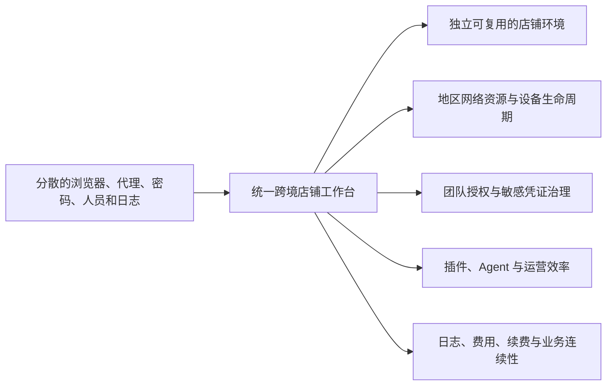
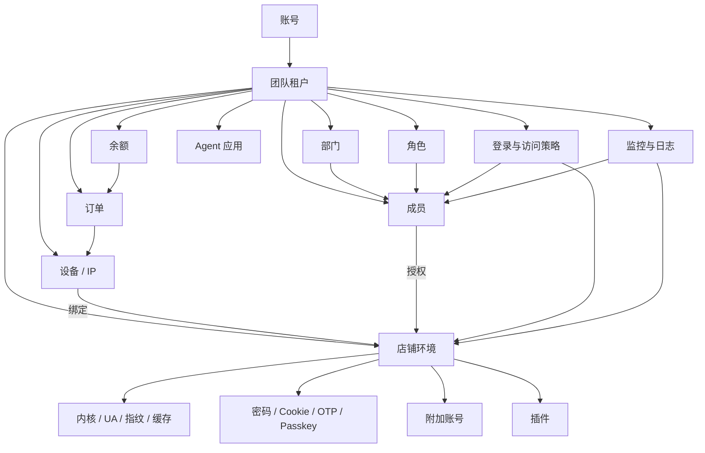
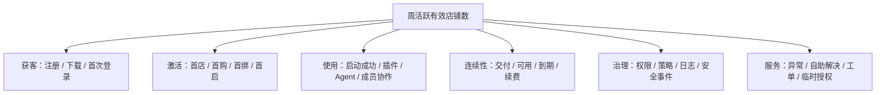

# EaseGlobal Browser 产品分析报告

> 产品：EaseGlobal Browser / 网易跨境浏览器  
> 报告性质：外部产品分析与策略建议  
> 文档版本：V1.0  
> 文档日期：2026-08-14  
> 适用对象：产品负责人、业务负责人、商业化负责人、设计与研发负责人、安全与客户服务负责人

## 1. 管理层摘要

### 1.1 一句话判断

**EaseGlobal Browser 正在从“跨境店铺专用浏览器 + 网络设备”工具，演进为以店铺资产为核心、同时覆盖设备资源、团队权限、敏感凭证、安全审计、插件、Agent 和费用管理的跨境电商运营工作台。**

从当前功能结构看，它已经不是早期工具或单点代理采购产品，但仍不能认定为成熟、稳定的企业级平台。更准确的阶段判断是：

> **核心业务闭环已建立，规模化与组织治理能力已展开，当前瓶颈从“有没有功能”转向“跨模块是否连续、规则是否一致、承诺是否可信、异常是否可恢复”。**

### 1.2 五项核心结论

1. **产品中心对象是店铺，不是浏览器窗口。**环境、设备、成员、密码、Cookie、OTP、Passkey、附加账号、插件和监控均围绕店铺组织；这使产品具备从工具走向运营基础设施的基础。
2. **当前最明确的商业化资源是平台设备/IP。**设备按地区、供应商/线路、时长和数量售卖，通过长周期折扣、换 IP 权益、余额与自动续费形成预付和续费；团队、插件和 Agent 的独立标准收费尚未核实。
3. **首次价值发生在店铺成功启动，不发生在注册、建店或支付。**现有路径跨越官网、客户端、团队、店铺、设备和浏览器环境，激活链路较长，缺少统一任务和状态管理。
4. **产品竞争力更可能来自“对象 + 资源 + 治理 + 工作流”的组合，而非单一环境隔离宣称。**底层隔离强度、IP 独享性和第三方平台风控结果仍需独立技术验证，不能直接视为已形成壁垒。
5. **当前最高优先级不是继续扩充功能，而是建立一致性与信任。**设备购买与交付透明度、权限单一规则源、到期连续性、异常诊断、敏感数据治理、品牌与文档版本一致性应优先于大范围扩张 Agent 场景。

### 1.3 产品健康度总览

以下是产品结构与流程完整度判断，不是用户满意度、稳定性测试或内部经营评分。

| 维度 | 当前判断 | 关键表现与问题 |
|---|---|---|
| 跨境场景匹配 | 较强 | 平台/站点、地区设备、店铺凭证、多人运营和风险控制均围绕跨境店铺设计 |
| 功能广度 | 强 | 覆盖官网、账号、团队、店铺、设备、安全、插件、Agent、费用和服务 |
| 核心业务闭环 | 中高 | 能完成建店、设备购买/添加、绑定、访问、续费和费用查询 |
| 首次价值连续性 | 中低 | 注册、下载、建店、设备和首启跨多个模块，支付到交付存在等待 |
| 团队与权限治理 | 中 | 对象和能力较完整，但权限结果难预测，规则口径存在冲突 |
| 商业化清晰度 | 中 | 设备/IP 价格与续费明确；优惠券叠加、退款例外、团队/Agent 定价不清 |
| 安全可信度 | 中 | 有凭证托管、策略、日志、水印等能力，但底层安全主张未独立验证 |
| Agent 产品化 | 早期 | 有入口、应用、权限提示和定制需求，但标准场景、SLA、结果和计费边界不清 |
| 官网移动体验 | 弱 | 390px 视口仍保留约 1250px 宽页面，导航和注册弹窗越界 |
| 文档与版本治理 | 中低 | 存在 V2.1.0/2.0.70、旧品牌、旧界面、重复分类和规则冲突 |
| 实际使用与经营效果 | 未知 | 活跃、转化、留存、收入、故障和客户满意度仍需内部数据验证 |

## 2. 分析边界

- 本报告不是网易内部产品文档，不代表其正式战略、路线图、收入结构或技术架构；
- 未核实客户数量、市场份额、收入、毛利、转化率、留存率、NPS 和客服工单量；
- 未执行真实支付、退款、开票、自动续费扣款、换 IP、到期注销和数据删除；
- 未独立验证浏览器指纹隔离、网络延迟、IP 独享性、凭证加密、内部访问控制或第三方平台风控效果；
- 地区、价格、库存和促销会动态变化，不等于长期完整目录。

## 3. 产品定位

### 3.1 产品类别

EaseGlobal Browser 不能只归类为“指纹浏览器”。从产品对象与工作流看，它同时具备四种属性：

| 属性 | 产品承接 | 价值 |
|---|---|---|
| 店铺环境工具 | 内核、UA、指纹、缓存、启动与页面设置 | 让不同店铺在独立、可复用环境中运行 |
| 网络设备资源平台 | 平台设备购买、自有设备接入、检测、绑定、换 IP、续费 | 把地区网络资源嵌入店铺工作流 |
| 团队运营管理平台 | 团队、成员、部门、角色、授权、凭证和策略 | 支撑多人、多店铺和组织治理 |
| 运营扩展平台 | 插件、Agent、监控、日志、反馈与服务 | 提高运营效率并形成持续使用价值 |

因此更准确的产品定位是：

**面向跨境电商卖家和运营团队的一站式店铺环境、网络设备、团队协作与运营安全工作台。**

### 3.2 产品边界

**产品明确承接：**

- 多平台、多站点、多店铺环境管理；
- 全球地区网络设备的购买或自有接入；
- 凭证托管、成员授权与安全策略；
- 插件、Agent 和运营辅助；
- 费用、续费、发票与客户支持。

**产品不应被理解为：**

- 对任何第三方平台“绝对不会关联”或“保证账号安全”的工具；
- 提供无限制互联网访问的翻墙服务；
- 已经完成企业级安全认证或经过独立攻击测试的平台；
- 所有地区长期有库存、固定 IP 永不变化或设备绝对唯一的承诺。

### 3.3 核心价值主张



产品最有价值的不是单个功能，而是让同一店铺的环境、网络、人员、凭证和费用在一个系统中保持关联。

## 4. 用户与使用场景

### 4.1 目标用户分层

| 用户类型 | 核心场景 | 主要价值 | 主要风险 |
|---|---|---|---|
| 个人或小型卖家 | 少量店铺、快速获得目标地区网络 | 低门槛建店、购买设备、保存环境 | 配置复杂、首购风险、缺少专业管理员 |
| 中小运营团队 | 多成员、多平台、多店铺协作 | 统一设备、凭证、授权与续费 | 权限误配、交接、到期中断 |
| 品牌或精品团队 | 高价值店铺、严格账号保护 | 最小权限、策略、监控和日志 | 安全主张、敏感数据和审计可信度 |
| 店群或矩阵团队 | 大量店铺、重复运营任务 | 批量建店、标签、插件和 Agent | 规模操作错误、设备共享和异常诊断 |
| 代运营与多项目组织 | 多部门、多客户、多责任边界 | 团队隔离、角色、日志和临时授权 | 客户数据边界、权限回收和责任追踪 |
| 财务与采购 | 多设备、多订单、充值和开票 | 余额、订单、发票、自动续费 | 对账差异、扣款失败和非意愿续费 |

### 4.2 决策角色

| 角色 | 主要目标 | 影响的产品结果 |
|---|---|---|
| BOSS / 团队创建者 | 控制团队资产、费用和最高权限 | 采购、续费、规模和最终治理责任 |
| 运营主管 / 店铺管理员 | 建店、分配、处理日常异常 | 激活、使用深度和功能渗透 |
| 普通运营成员 | 快速使用已授权店铺 | 日活跃、任务完成和异常反馈 |
| 超级管理员 / 安全负责人 | 权限、登录、访问和审计 | 企业信任、风险控制和采购扩张 |
| 财务 / 采购 | 金额、支付、对账、发票和续费 | 支付成功、预付周期和业务连续性 |
| 客服 / 技术支持 | 快速定位并恢复问题 | 工单率、解决时长和高敏授权风险 |

### 4.3 核心用户任务

1. 把一个跨境店铺建立为可持续管理的独立环境；
2. 为该店铺配置合适地区和线路的有效设备；
3. 在不直接共享密码的情况下把店铺交给成员使用；
4. 通过策略、监控和日志约束高风险行为；
5. 使用插件或 Agent 提高重复运营效率；
6. 通过提醒、余额、续费和扩容保持业务不中断。

## 5. 核心产品模型

### 5.1 核心业务对象



### 5.2 对象模型的产品意义

| 对象 | 产品作用 | 商业作用 | 关键风险 |
|---|---|---|---|
| 团队 | 承载组织、权限、资产和费用 | 支撑多人采购与长期留存 | 租户边界、最高权限和团队转移 |
| 店铺 | 聚合环境、设备、凭证、成员和插件 | 形成长期业务资产和迁移成本 | 配置错误、删除、转让和共享关联 |
| 设备 | 提供地区网络能力和访问条件 | 当前最明确的付费 SKU | 库存、质量、适配、交付与到期 |
| 成员 / 角色 | 分配使用权和管理权 | 支撑团队规模扩张 | 权限叠加、越权和回收不完整 |
| 凭证 | 降低账号信息直接共享 | 提高团队协作价值 | 集中托管后的加密、访问和审计责任 |
| 策略 / 日志 | 约束行为并追踪结果 | 提升企业采购可信度 | 误拦截、口径冲突和日志保留 |
| 插件 / Agent | 扩展运营任务 | 潜在增值和生态能力 | 第三方权限、任务失败和计费边界 |
| 余额 / 订单 | 完成支付、续费和对账 | 支撑预付和经常性收入 | 扣款失败、发票、退款和对账差异 |

### 5.3 核心闭环


其中，`店铺首次启动`应被视为激活终点；`续费后继续运营`构成商业与留存闭环。

## 6. 产品能力全景与完整度

### 6.1 评估标准

本报告只评估产品能力与流程完整度，不评估代码质量、性能、稳定性或真实使用效果：

| 等级 | 定义 |
|---|---|
| L1 概念 | 只有宣传、入口或说明，没有完整操作 |
| L2 可进入 | 有页面和部分操作，但结果、异常或边界不完整 |
| L3 可闭环 | 主流程可完成，存在基础状态和结果 |
| L4 可规模化 | 支持批量、权限、生命周期、异常或组织治理 |
| L5 已验证 | 除产品闭环外，还完成可靠性、使用数据和持续效果验证 |

当前没有内部使用数据和技术测试结果，因此任何模块都不评为 L5。

### 6.2 能力矩阵

| 能力域 | 主要能力 | 完整度 | 核心优势 | 主要缺口 |
|---|---|---:|---|---|
| 官网获客与注册 | 官网、活动、邀请、下载、咨询、注册、协议、反馈 | L3 | 入口较完整，活动与人工咨询并存 | 移动端不适配；弹窗较多；价格与承诺分散 |
| 账号与团队进入 | 手机登录、账号登录、团队创建/切换、账号安全 | L3 | 兼顾个人手机号和组织账号 | 改绑手机依赖原号；密码与恢复规则不完整 |
| 首页与新手引导 | 新手任务、热门设备、最近店铺、发布和功能引导 | L3 | 能承接新用户和回访用户 | 引导围绕功能而非成功首启；多弹窗可能叠加 |
| 店铺环境管理 | 单个/批量建店、环境、标签、筛选、凭证、转让、删除 | L4 | 店铺对象完整，支持规模操作与多类凭证 | 配置认知负担高；高风险操作影响范围不总是清晰 |
| 设备资源管理 | 平台设备、自有设备、购买、检测、绑定、换 IP、续费、到期 | L4 | 商品采购与店铺工作流连接紧密 | SKU 决策复杂；库存、交付、退款例外和恢复不充分 |
| 团队与权限 | 成员、部门、角色、店铺/附加账号授权、状态管理 | L3 | 覆盖组织分工和对象授权 | 最终权限难预测；暂停、日志和访问策略口径冲突 |
| 安全与审计 | 登录限制、访问策略、水印、密码/F12/打印、监控、日志 | L3 | 从登录到操作留痕的能力较宽 | 安全承诺尚缺独立技术验证；权限和保留规则不完整 |
| 插件管理 | Chrome 商店、自研上传、权限确认、自动/手动分配、更新 | L3 | 同时支持外部生态与团队插件 | 插件供应链、签名、版本固定、回滚和权限治理不足 |
| Agent 与自动化 | Agent 入口、应用、权限提示、限时体验、定制需求、MCP 服务露出 | L2 | 有从工具走向自动化运营的方向 | 核心场景、执行状态、结果、SLA、人工接管和计费不清 |
| 费用与续费 | 充值、对公、订单、余额、优惠券、发票、自动续费 | L3 | 设备商业闭环基本成立 | 对账关联、扣款失败重试、宽限期、退款和红冲规则不足 |
| 帮助与服务 | 88 篇文章、问题反馈、日志、客服、临时授权 | L3 | 内容广、步骤和图片丰富 | 版本落后、旧品牌/旧图、重复分类、规则冲突和高敏提示不足 |

### 6.3 总体判断

产品能力呈现出明显的“核心对象较成熟、跨域一致性不足”特征：

- 店铺与设备已经达到可规模化管理水平；
- 团队、安全、费用已具备闭环，但缺少统一规则结果和异常恢复；
- Agent 已有战略位置，但仍处于能力露出和需求探索阶段；
- 官网、客户端、帮助中心和版本内容没有完全同步，影响对外信任和内部验收。

## 7. 核心功能与业务逻辑分析

### 7.1 店铺是主资产，设备是使用前提

店铺承载平台、站点、浏览器环境、登录凭证、成员授权、附加账号、插件和监控。设备承载实际网络访问条件。一台设备可以绑定多个店铺，但页面对同平台多店共享设备给出关联风险警告。

这形成两个重要逻辑：

1. 店铺是长期积累的业务资产；
2. 有效设备是店铺进入实际使用的必要条件，也是当前付费资源。

因此产品不应把“建店成功”呈现为完整成功，而应明确区分：

- 已创建；
- 待绑定设备；
- 设备配置中；
- 可启动；
- 启动异常；
- 即将到期；
- 已中断。

### 7.2 凭证托管降低共享，但提高平台责任

产品支持密码、Cookie、OTP、Passkey 和附加账号，并通过授权和自动回填减少成员直接看到密码明文。这一设计能降低群聊、表格或人工传递带来的暴露面。

但集中托管也意味着更高责任：

- 谁可以添加、查看、编辑、授权和删除；
- 数据如何加密、密钥如何管理；
- 哪些内部人员或客服可以访问；
- 导出、复制、临时授权和日志如何控制；
- 成员离职、团队转让、店铺删除时如何清理。

产品内容多次使用“不会泄露”“内部人员也无法获取”等绝对化表述，但前台遮罩、回填和授权行为不能证明底层加密与内部访问控制。

### 7.3 权限模型完整，但缺少可预测结果

成员最终权限来自角色、部门数据范围、店铺授权、附加账号授权、凭证授权、登录控制和访问策略的共同作用。产品已覆盖较多企业治理对象，但用户需要理解多层规则的交集。

当前主要问题不是缺少开关，而是：

- 用户难以预判某成员“最终能看什么、能做什么”；
- 暂停成员是否保留或取消授权，存在冲突；
- 全团队日志的查看角色存在冲突；
- 访问策略究竟由团队管理员还是仅超级管理员配置存在冲突；
- 店铺侧授权把“选择成员”误写为“勾选店铺”。

产品应建立单一权限规则源，并提供成员最终权限预览、变更影响和撤销结果。

### 7.4 设备生命周期较完整，但商业信任成本高

平台设备支持选择、购买、配置、绑定、换 IP、续费和到期；自有设备支持多协议录入和检测。这说明设备不是一个简单代理字段，而是完整商品与生命周期对象。

同时，购买决策需要用户理解：

- 地域与具体地区；
- 供应商/线路和资源类型；
- 月基价与时长成交价；
- 库存和预计交付；
- 换 IP 权益；
- 适配网站与访问限制；
- 不可退款或不可直接更换设备规则。

这使设备选购成为整个旅程最大的决策摩擦。页面应从“商品列表”升级为“业务适配决策器”。

### 7.5 插件是扩展机制，Agent 是下一增长假设

插件已经具备商店添加、自研上传、权限确认、自动或手动分配和更新等基础机制，能够承接第三方或团队内部运营工具。

Agent 则更接近战略探索：产品显著展示 Agent，提供应用、权限提示、限时体验、定制需求和 MCP 服务入口，但尚未形成统一的产品合同：

- 哪些应用已经正式可用；
- 需要哪些输入和权限；
- 任务如何运行、暂停、失败和重试；
- 结果如何验证；
- 何时人工接管；
- 如何审计和计费。

在这些问题明确前，Agent 更适合作为待验证增值方向，而不是已成熟的核心卖点。

## 8. 商业模式与价格逻辑

### 8.1 商业主线

| 能力 | 当前收费状态 | 商业作用 |
|---|---|---|
| 平台设备/IP | 按数量和时长预付 | 当前直接收入主线 |
| 设备续费 | 手动续费或余额自动续费；失败重试和宽限期尚不明确 | 经常性收入与业务连续性 |
| 长周期购买 | 1/3/6/12/24 个月；实际经营效果待内部数据验证 | 提高预付周期并降低短期流失 |
| 免费换 IP 权益 | 6/12/24 个月赠送 1/3/6 次，次数和可选范围受规则限制 | 降低长周期购买顾虑 |
| 自有设备 | 独立收费、额度或套餐限制尚未确认 | 降低迁移门槛 |
| 团队、安全、插件 | 独立价目尚未确认，也不能据此判断永久免费 | 提高设备价值和组织留存 |
| Agent | 标准收费、成本、SLA 和定价单位尚未确认 | 潜在增值、项目制或高阶套餐 |

### 8.2 价格组织逻辑

购买页面的可靠关系是：

```text
地域分组 → 具体地区 → 供应商/线路 → 设备 SKU 与月基价
设备 SKU → 购买时长价格矩阵 → 数量 → 优惠券 → 最终应付
```

页面以 1/3/6/12/24“个月”展示时长，实际按 30/90/180/360/720 天计算。因此这里的“月”是固定 30 天倍数，不等同自然月；购买页、协议、订单和到期时间应统一展示这一口径。

主要首月档位包括：

| 月基价 | 首月成交价 | 实际支付比例 | 页面标签样本 |
|---:|---:|---:|---|
| ¥69 | ¥49 | 71.01% | 7.1 折 |
| ¥79 | ¥59 | 74.68% | 7.4 折 |
| ¥89 | ¥69 | 77.53% | 7.7/7.8 折 |
| ¥88 | ¥74.80 | 85.00% | 8.5 折 |
| ¥98 | ¥83.30 | 85.00% | 8.5 折 |

香港腾讯云 12 个月原价 ¥828、成交价 ¥499，实际支付比例 60.27%，折扣标签为 6.0 折。这说明折扣标签更像近似解释，实际成交价更可能来自后台 `SKU × 时长` 价格矩阵。

### 8.3 商业化判断

**优势：**

- 设备商品与店铺实际使用强绑定，付费不是孤立购买；
- 长周期折扣、换 IP 权益和自动续费构成清晰的预付与续费机制；
- 自有设备降低迁移门槛，平台设备提供一站式增量采购；
- 团队、凭证、日志和插件提高持续使用价值。

**短板：**

- 用户需要进入购买页才能充分理解价格；
- 折扣标签不能精确复算成交价；
- 优惠券门槛、叠加和分摊尚未核实；
- 不可退款和交付等待提高首购风险；
- 团队、店铺、插件和 Agent 的套餐边界不清；
- 余额自动续费失败后的恢复机制不足。

完整逐地区与时长价格将在后续《EaseGlobal Browser产品价格清单.md》中单独交付，本报告不重复价格明细。

## 9. 用户体验分析

### 9.1 当前旅程

用户需要经历九个阶段：

1. 认知与评估；
2. 注册、下载与首次登录；
3. 团队进入与新手引导；
4. 创建店铺环境；
5. 选择并购买或添加设备；
6. 交付、绑定与首次启动；
7. 团队协作与安全配置；
8. 日常运营与异常处理；
9. 续费、扩容与退出。

详细旅程与情绪假设见 [EaseGlobal Browser用户旅程图.md](./EaseGlobal%20Browser用户旅程图.md)。

### 9.2 体验优势

| 优势 | 用户价值 |
|---|---|
| 店铺、设备、成员和凭证关系明确 | 用户能围绕实际业务对象管理，而不是管理零散浏览器配置 |
| 支持单个和批量操作 | 能同时服务少量店铺与规模化团队 |
| 设备购买与自有接入并存 | 降低首次使用和迁移阻力 |
| 凭证类型丰富 | 覆盖密码、Cookie、OTP、Passkey 和附加账号等真实场景 |
| 团队与安全能力较宽 | 支撑授权、登录约束、访问控制、水印、监控和审计 |
| 帮助中心步骤和图片丰富 | 大量复杂操作有公开自助说明 |
| 插件和 Agent 有扩展空间 | 能承接不同平台和运营任务的差异化需求 |

### 9.3 体验断点

| 断点 | 根本问题 | 用户后果 | 业务后果 |
|---|---|---|---|
| 注册到首启跨多个模块 | 缺少跨模块激活状态机 | 注册后仍不知道下一步，可能无法获得价值 | 激活和首购流失 |
| 设备 SKU 决策复杂 | 供应链目录直接暴露给用户，缺少业务推荐 | 害怕买错、无法判断价格与适配 | 弃单、咨询和售后争议 |
| 支付到交付存在等待 | “交易成功”和“业务可用”状态分离 | 重复操作、焦虑或误判失败 | 客服成本和交付争议 |
| 权限结果不可预测 | 多层规则没有统一结果预览 | 越权、误封或依赖人工试错 | 安全风险和企业采购阻力 |
| 异常诊断分散 | 设备、策略、并发、客户端和站点错误没有统一归因 | 普通成员不知道找谁或怎么恢复 | 自助解决率低、工单增加 |
| 到期连续性不足 | 提醒、余额、扣款、解绑和恢复没有形成清晰状态机 | 店铺可能意外中断 | 续费损失和客户信任下降 |
| 官网移动端不可用 | 桌面布局直接缩到小屏 | 导航、阅读和注册受阻 | 移动流量转化损失 |

### 9.4 首次价值定义

**建议将激活事件定义为：首个店铺绑定有效设备，并成功启动目标平台环境。**

这个定义优于注册、下载、建店或支付，因为它同时证明：

- 用户理解了团队和店铺对象；
- 用户获得了可用设备；
- 店铺与设备关系正确；
- 客户端能够运行；
- 用户第一次完成核心业务任务。

## 10. 安全、隐私与治理分析

### 10.1 现有安全能力

- 密码、Cookie、OTP、Passkey 和附加账号托管；
- 成员、部门、角色、店铺和附加账号授权；
- 登录终端、地区、时间和异常登录控制；
- 页面/元素访问策略、密码显示、开发者工具、打印和水印限制；
- 店铺监控、登录日志、操作日志和访问记录；
- 插件权限提示与分配；
- 反馈、日志上传和限时临时授权。

### 10.2 主要安全风险

| 风险 | 具体表现 | 判断 |
|---|---|---|
| 绝对安全承诺 | 产品内容出现“不会泄露”“内部人员也无法获取”等表述 | 前台遮罩和回填不能证明底层加密与内部访问控制 |
| 高敏凭证集中 | 平台托管多类账号和二步验证信息 | 必须具备最小权限、强审计、密钥轮换和事件响应 |
| 临时授权 | 客服可能获得店铺或诊断访问 | 需要明确范围、时长、可见数据、禁止动作、录像/日志和随时撤销 |
| 插件供应链 | 支持商店插件和自研上传 | 需要签名、来源、权限、版本固定、灰度与回滚治理 |
| 本地记住密码 | 账号登录可在本地缓存密码 | 需要说明加密、共享电脑风险和清除路径 |
| 第三方音视频测试 | 引导用户访问外部测试站并授权摄像头/麦克风 | 应明确第三方隐私风险和测试后撤权 |
| 安装排障 | 建议关闭安全软件、开启任何来源或使用 `--no-sandbox` | 需要最小化授权、风险说明和恢复步骤 |
| 日志与数据保留 | 有多类日志和监控，但保留、导出与删除规则不完整 | 企业采购和隐私合规边界不清 |

### 10.3 治理建议

1. 为密码、Cookie、OTP、Passkey、插件和临时授权建立统一敏感数据等级；
2. 用单一权限矩阵驱动产品、帮助中心、测试和客服手册；
3. 所有高敏操作显示授权人、范围、时间、原因和审计记录；
4. 安全营销只描述可验证能力，避免绝对结果承诺；
5. 安装和故障处理必须给出风险、最小操作和恢复步骤；
6. 明确日志、凭证和团队数据的保留、导出、转移与删除规则。

## 11. 产品与内容一致性

### 11.1 已确认的不一致

| 类型 | 具体表现 | 影响 |
|---|---|---|
| 版本 | 官网下载为 V2.1.0，Windows/Mac 更新日志停在 2.0.70 | 用户无法确认当前能力、修复和兼容范围 |
| 品牌 | ZC、跨境通、NeteaseZCBrowser、EaseGlobal Browser 等旧名混用 | 影响品牌识别和搜索 |
| UI | 多篇帮助文章使用旧导航、旧表单或新旧截图混合 | 用户找不到当前入口，客服成本增加 |
| 分类 | 白名单文章误归更新日志；多个节点跨分类重复 | 搜索和维护成本增加 |
| 客服内容 | 官网七鱼客服首屏主要展示“网易跨境支付”热门问题，实际点开的回答仍是付款业务 | 浏览器用户进入错误知识上下文，增加转人工和离开 |
| 权限 | 暂停成员、全团队日志、访问策略管理员范围冲突 | 可能导致越权、误配或错误验收 |
| 操作正文 | OTP 第二入口和店铺侧授权对象与图片不一致 | 用户按文档操作会进入错误路径 |
| 账号安全 | 修改密码介绍写原密码 + 新密码，但操作步骤只有一个密码字段 + 短信 | 恢复和安全逻辑难理解 |
| 设备承诺 | “固定/静态”宣传与协议“不保证永久不变或唯一”并存 | 容易形成支付争议 |
| 设备时长 | 页面展示 1/3/6/12/24 月，实际按固定 30/90/180/360/720 天计算 | “月”与自然月的预期不一致，可能影响到期理解 |
| 价格 | 折扣标签与成交价并非始终精确等价 | 用户难以复算价格 |

### 11.2 根因判断

这些问题更像是产品快速扩展后，规则分散在产品、帮助中心、协议、旧页面和运营文案中，没有形成统一发布基线。

建议建立：

- 业务规则单一来源；
- 权限矩阵版本化；
- 商品术语字典；
- 发布前产品/文档/客服联合验收；
- 文章适用版本、最近验证时间和失效提示；
- 旧品牌、旧截图和重复节点清理机制。

## 12. 产品演进阶段判断

更新日志显示产品从 1.0.0（2023-11-29）发展到 2.0.70（2026-05-28），官网下载页当前为 V2.1.0。日志本身不完整，因此以下为能力演进推导：


| 阶段 | 能力特征 | 产品目标判断 |
|---|---|---|
| 基础工具 | 店铺环境、设备访问、账号与客户端 | 解决单店或少量店铺的环境与网络问题 |
| 团队治理 | 成员、角色、OTP、账号保护、屏幕与访问控制 | 从个人工具转向多人团队 |
| 规模运营 | 批量建店、标签、插件、监控、换 IP、团队书签 | 提高多店与组织管理效率 |
| 自动化探索 | Passkey、Agent 应用、定制需求、MCP 服务露出 | 向运营任务自动化和潜在增值扩张 |

当前产品的主要矛盾也随之变化：早期是能力覆盖，当前则是跨模块连续性、规则统一和自动化产品边界。

## 13. 产品优势与潜在壁垒

### 13.1 已有优势

1. **垂直领域对象较完整。**产品不是通用浏览器外壳，而是围绕跨境店铺、设备、凭证和团队形成业务模型；
2. **设备供应与使用工作流打通。**购买、检测、绑定、换 IP、续费和到期都在同一平台内；
3. **团队协作和敏感凭证覆盖广。**满足多人、多角色、多店铺的真实运营复杂度；
4. **店铺生命周期与批量能力较强。**支持从少量店铺到批量导入和规模管理；
5. **安全、审计、插件与 Agent 提供扩张空间。**产品能够从“访问工具”进入“运营过程”；
6. **帮助内容覆盖广。**88 篇文章提供大量步骤、图片和异常说明，具备自助服务基础。

### 13.2 潜在壁垒判断

| 壁垒假设 | 现有基础 | 还需验证 |
|---|---|---|
| 店铺对象与组织工作流沉淀 | 店铺连接环境、设备、凭证、成员、插件和日志 | 用户迁移率和长期留存数据 |
| 网络设备供应与交付能力 | 多地区、多供应商、库存、换 IP 与续费 | 资源质量、成本、SLA 和稳定性 |
| 企业治理复杂度 | 角色、授权、策略、日志和凭证 | 权限正确性、安全审计和企业采用情况 |
| 插件与 Agent 生态 | 商店、自研插件、Agent 和 MCP 方向 | 开发者/客户采用、任务成功率和商业模式 |
| 环境隔离和账号安全技术 | 有相关陈述 | 独立技术测试、第三方审计和真实风险结果 |

真正可持续的壁垒需要同时满足“功能存在、用户采用、效果可靠、难以迁移”。目前只确认第一部分，不能把宣传承诺直接写成技术壁垒。

## 14. SWOT 分析

以下 SWOT 是产品分析推导，不是网易内部战略判断，也未引入外部竞品数据。

| 类型 | 判断 |
|---|---|
| Strengths 优势 | 跨境场景聚焦；店铺与设备核心对象清晰；功能覆盖广；团队、凭证和审计完整度较高；设备商业闭环明确；支持插件和 Agent 扩展 |
| Weaknesses 劣势 | 首次价值链路长；设备 SKU 和价格决策复杂；权限结果难预测；安全绝对化表述；官网移动体验弱；文档、版本和品牌不一致；Agent 产品合同不清 |
| Opportunities 机会 | 把购买页升级为业务适配推荐；建立跨模块激活与诊断；强化企业安全治理；将 Agent 聚焦到可量化运营任务；形成设备、团队和自动化套餐 |
| Threats 风险 | 云厂商/运营商/住宅资源波动；第三方电商平台规则变化；高敏凭证或插件安全事件；不可退款与交付争议；同类能力趋同；支持复杂度和服务成本持续上升 |

## 15. 关键问题与优先级

### 15.1 优先级原则

优先处理同时影响以下两项以上的问题：

- 首次价值；
- 付费信任；
- 业务连续性；
- 敏感数据与权限；
- 客服成本；
- 企业扩张。

### 15.2 问题清单

| 优先级 | 问题 | 用户影响 | 业务影响 |
|---|---|---|---|
| P0 | 注册到成功首启缺少统一激活任务 | 用户跨模块迷失，注册后仍不可用 | 激活与首购流失 |
| P0 | 设备价格、库存、适配和不可退款叠加 | 首购信心低，容易买错 | 弃单、咨询和支付争议 |
| P0 | 支付到交付、绑定和首启状态不连续 | 用户不知道是否成功或如何恢复 | 重复操作、工单和交付争议 |
| P0 | 权限规则与内容冲突 | 越权、误封、凭证暴露 | 企业信任和安全风险 |
| P0 | 到期、余额不足和设备注销缺少连续恢复 | 店铺意外中断 | 续费损失与客户流失 |
| P1 | 异常归因分散 | 普通成员难以自助恢复 | 客服成本和停工时间增加 |
| P1 | 敏感凭证、插件和临时授权治理不一致 | 用户不清楚数据边界 | 安全与合规采购阻力 |
| P1 | 品牌、版本、配图和文档不一致 | 用户无法按文档操作 | 支持成本和发布质量下降 |
| P1 | 官网移动端注册不可用、客服知识内容错配 | 移动访问受阻或进入错误服务上下文 | 获客损失、转人工和服务成本增加 |
| P2 | Agent 场景、结果和商业边界不清 | 用户难以理解价值和风险 | 无法形成稳定增值收入 |

## 16. 产品策略建议

### 16.1 战略方向

建议把产品目标从“增加更多浏览器、网络和自动化功能”调整为：

> **让跨境团队以最少决策成本，持续、安全地运行每一个有效店铺。**

这一方向把产品优先级收敛到三个结果：

1. 更快达到成功首启；
2. 更少发生配置、权限和设备中断；
3. 更多店铺、成员和设备进入稳定续费与扩容。

### 16.2 Now / Next / Later

由于没有网易内部排期、团队容量和工程评估，本路线图是相对优先级建议，不是承诺日期。

#### Now：先修复价值链与信任基础

| 项目 | 用户问题 | 预期结果 | 主要指标 | 建议牵头角色 |
|---|---|---|---|---|
| 跨模块激活状态机 | 不知道建店、购设备、绑定和启动的下一步 | 从登录连续完成成功首启 | 首启成功率、注册到首启时长 | 产品 + 客户端 |
| 设备购买与交付透明化 | SKU 难选、库存不稳、价格和条款难理解 | 提高首购信任并减少争议 | 选购完成率、弃单位置、交付成功率、争议率 | 商业化 + 设备供应 |
| 权限单一规则源与最终预览 | 多层权限结果不可预测且文档冲突 | 权限结果可解释、可测试、可审计 | 授权完成率、权限拒绝、越权事件、回退率 | 平台 + 安全 |
| 到期与自动续费连续性 | 余额不足或到期可能导致中断 | 提前发现并恢复续费失败 | 续费率、扣款失败、到期中断率 | 费用 + 设备 |
| 官网移动注册、客服与内容治理 | 小屏无法注册；客服知识错配；版本和品牌不一致 | 减少获客损失并提高公开信息可信度 | 移动注册率、客服转人工率、文档错误率、版本同步时长 | 增长 + 内容 + 服务 |

#### Next：提高规模运营与自助恢复

| 项目 | 假设 | 预期结果 | 推进前置 |
|---|---|---|---|
| 设备适配推荐与替代 SKU | 根据平台、站点、地区和预算推荐能降低选择成本 | 减少弃单和买错设备 | 建立 SKU、库存、站点与故障数据 |
| 统一诊断中心 | 把设备、策略、并发、客户端和站点错误统一归因 | 提高自助解决并降低工单 | 统一错误码和责任归属 |
| 权限模板与敏感能力分级 | 岗位模板和风险分级能减少复杂配置 | 提高团队激活和安全可控性 | 权限规则源完成 |
| 企业费用与对账增强 | 订单、余额、充值和发票可关联 | 提高财务使用和续费效率 | 明确账本、退款和红冲规则 |
| 插件供应链治理 | 来源、权限、版本和回滚可控 | 降低第三方与自研插件风险 | 插件签名与版本策略 |
| 产品与服务指标体系 | 用漏斗、交付、续费和故障数据驱动迭代 | 结束仅按功能交付判断产品健康 | 埋点口径和数据责任人 |

#### Later：在验证充分后扩展商业边界

| 项目 | 战略假设 | 升级到 Next 的信号 |
|---|---|---|
| Agent 场景产品化 | 高频重复任务能形成明确效率价值 | 重点场景任务成功率、节省时间和复用率达到内部标准 |
| Agent 增值计费 | 可按应用、任务量、执行时长或套餐收费 | 成本可测、SLA 可定义、客户付费意愿得到验证 |
| 企业套餐与服务等级 | 团队、安全、设备和服务可形成分层套餐 | 有清晰客户分层、使用差异和服务成本数据 |
| 开放集成与生态 | ERP、平台和自动化接口可增强工作流粘性 | 核心闭环稳定且有足够第三方集成需求 |

### 16.3 当前不建议优先投入

| 暂不优先项 | 原因 | 重新评估条件 |
|---|---|---|
| 继续堆叠低频功能入口 | 当前主要问题是连续性和一致性，不是功能数量不足 | 首启、交付、权限和续费 P0 指标稳定 |
| 大范围扩张 Agent 应用数量 | 现有场景的输入、权限、结果和 SLA 尚未形成标准 | 核心 Agent 场景完成验证并可重复交付 |
| 直接推出复杂席位/店铺套餐 | 没有使用分层、成本和付费意愿数据 | 建立用户分群和资源成本模型 |
| 使用绝对化安全与防关联承诺 | 前台行为不能证明底层技术结果 | 完成独立安全测试、审计和可验证 SLA |
| 把桌面客户端全部功能搬到移动网页 | 当前情况只支持修复官网转化，不支持高成本重建完整移动运营 | 有明确移动运营任务和足够使用需求 |

## 17. 衡量指标

### 17.1 建议北极星与商业指标

- **产品北极星：周活跃有效店铺数**，即当周至少成功启动一次且绑定有效设备的店铺数；
- **商业主指标：活跃付费设备数及续费收入**；
- **核心激活事件：首个店铺绑定有效设备并成功启动。**

店铺数反映使用深度，设备数反映付费资源。因为一台设备可能绑定多个店铺，两者必须联合观察。

### 17.2 指标树



### 17.3 指标定义建议

| 指标 | 建议定义 | 用途 |
|---|---|---|
| 首次登录率 | 注册用户中在客户端完成首次登录的比例 | 衡量网页到客户端转换 |
| 首店创建率 | 首次登录用户中成功创建店铺的比例 | 衡量对象理解与建店阻力 |
| 首购转化率 | 进入购买页用户中完成设备支付的比例 | 衡量商品与价格信任 |
| 首启成功率 | 首次登录用户中完成有效设备绑定并成功启动的比例 | 核心激活指标 |
| 注册到首次价值时长 | 注册到成功首启的中位时长 | 衡量整个激活链路效率 |
| 设备交付成功率 | 已支付平台设备中在承诺时间内可用的比例 | 衡量供应与交付 |
| 店铺启动成功率 | 启动请求中成功进入店铺环境的比例 | 衡量日常可靠性 |
| 权限配置回退率 | 权限变更后短期内被撤销或修改的比例 | 识别权限难理解和误配 |
| 自助解决率 | 无需人工客服即可恢复的异常比例 | 衡量诊断与帮助价值 |
| 设备续费率 | 到期设备中成功续费的比例 | 衡量商业连续性 |
| 到期中断率 | 因未续费、扣款失败或余额不足导致中断的比例 | 续费守护指标 |
| Agent 任务成功率 | 符合定义的 Agent 任务中达到业务成功条件的比例 | Agent 产品化前提 |

目前没有内部基线，因此不填写虚构目标值。应先采集 4-8 周数据，再按地域、供应商、团队规模、获客来源和新老用户分层设定目标。

## 18. 主要风险

| 风险 | 影响 | 建议控制 |
|---|---|---|
| 设备供应和质量波动 | 库存不足、交付失败、访问不稳定 | 供应商 SLA、库存状态、替代 SKU、质量监控和异常补偿 |
| 第三方平台规则变化 | 登录、验证、插件或自动化能力失效 | 平台适配监控、灰度更新、风险提示和快速回滚 |
| 高敏凭证安全事件 | 客户资产、声誉和合规风险 | 分级加密、最小权限、审计、密钥轮换和事件响应 |
| 权限规则错误 | 越权、误拦截和数据暴露 | 单一规则源、自动化测试、最终预览和变更审计 |
| 不可退款与交付争议 | 支付转化下降、客服与投诉成本增加 | 下单前检测、清晰条款、失败例外和可追踪交付 |
| 自动续费中断或非意愿扣款 | 业务中断或用户投诉 | 余额预测、多级提醒、失败重试、明确关闭和扣款通知 |
| 插件与 Agent 执行风险 | 页面数据泄露、误操作或任务失败 | 权限收窄、隔离、审计、人工接管和回滚 |
| 文档与产品漂移 | 用户误操作、错误验收和工单增加 | 发布门禁、文章版本、自动失效和定期回归 |
| 功能复杂度持续上升 | 新用户难激活，运营与客服成本扩大 | 任务导向导航、分层配置、统一诊断和产品删减机制 |

## 19. 待验证问题

### 19.1 用户与经营

1. 不同团队规模的真实活跃、留存和付费差异是什么？
2. 用户在哪一步流失：注册、下载、建店、选设备、支付、交付、绑定还是启动？
3. ¥49 热门设备对首购、续费和扩容的长期贡献是什么？
4. 设备数量、店铺数量和成员数量之间的典型关系是什么？
5. 注册后人工销售或客服介入的覆盖率和增量效果是什么？

### 19.2 产品与体验

1. 用户更常“先建店”还是“先购设备”，两条路径谁的首启成功率更高？
2. 用户能否正确理解供应商、线路、IP 类型和价格矩阵？
3. 普通成员遇到设备、策略或并发异常时能否自助恢复？
4. 权限模板、最终预览和岗位默认值能否减少配置回退？
5. 到期提醒、自动续费和余额预测能否真正减少中断？

### 19.3 技术、安全与服务

1. 环境隔离、指纹、缓存和本地数据的真实边界是什么？
2. 平台设备的独享性、质量、地区准确性和供应商 SLA 如何验证？
3. 密码、Cookie、OTP 和 Passkey 的加密、密钥、内部访问和删除机制是什么？
4. 日志、监控和临时授权的保留、可见、导出和撤销规则是什么？
5. 插件与 Agent 的权限隔离、执行审计、失败回滚和人工接管如何实现？

## 20. 结论

EaseGlobal Browser 已经搭建出围绕跨境店铺的完整产品骨架：

**团队定义组织边界，店铺承载业务资产，设备提供付费网络资源，成员与凭证支撑协作，策略与日志承担治理，插件与 Agent 扩展运营能力，费用和续费维持商业连续性。**

它当前最有价值的产品资产不是某个单点功能，而是这些对象已经形成关系。它当前最大的产品风险也来自这些关系：一旦激活、商品、权限、敏感数据、到期或文档规则不一致，问题就会跨模块放大。

因此，下一阶段最合理的产品策略不是优先增加更多能力，而是先完成四件事：

1. 让用户从登录连续到达成功首启；
2. 让设备购买、交付和续费变得可解释、可预测、可恢复；
3. 让权限、安全与高敏数据规则只有一个可信答案；
4. 在真实任务成功、成本与审计边界明确后，再扩大 Agent 商业化。
