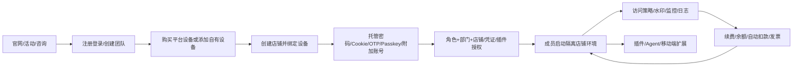

# EaseGlobal Browser 产品功能清单

> 日期：2026-08-14  
> 产品版本：当前能力涉及 2.1.0，但更新日志仅到 2.0.70，存在版本断层。  
> 重要边界：服务端权限、网络隔离、安全加密、支付、交付和第三方平台风控效果均未完成独立技术或交易验证。

## 1. 官网、获客与公开信息

| 功能 ID   | 功能         | 入口 / 角色              | 前置           | 功能逻辑                               | 状态、异常与边界                             |
|---|---|---|---|---|---|
| WEB-001 | 官网首页       | `kuajing.163.com`；访客 | 可联网          | 展示品牌、价值主张、产品能力、下载和转化入口             | 页面可访问；宣传效果未验证                        |
| WEB-002 | 顶部导航       | 官网顶栏；访客              | 无            | 在首页、核心功能、帮助等公开内容间跳转                | “核心功能”存在展开菜单；全部外链以公开页面为边界            |
| WEB-003 | 首页轮播       | 首屏轮播；访客              | 无            | 切换不同产品/活动信息                        | 存在多张轮播；转化效果未核实                    |
| WEB-004 | 免费注册 CTA   | 顶栏、首屏、侧边入口；访客        | 无            | 打开手机号注册弹窗                          | 空提交、无效邀请码等有前端反馈                      |
| WEB-005 | 手机号与短信码注册  | 注册弹窗；访客              | 手机号可接码       | 输入手机号、验证码并同意协议后提交                  | 未发送真实短信；频控、风控与成功结果未核实                |
| WEB-006 | 邀请码        | 注册弹窗展开项；访客           | 打开注册弹窗       | 可选填写邀请码并校验                         | 无效邀请码有提示；权益计算未覆盖                     |
| WEB-007 | 用户协议与隐私政策  | 注册弹窗、页脚；访客           | 无            | 打开并阅读公开法律文本                        | 条款执行未验证                        |
| WEB-008 | Windows 下载 | 官网下载入口；访客            | Windows 10+  | 下载 Windows 安装包                     | 当前安装包完整性、签名和兼容性未独立检测                 |
| WEB-009 | macOS 下载   | 官网下载入口；访客            | macOS 10.12+ | 下载 Intel/M 系列兼容客户端                 | 兼容 Intel/M 系列客户端；实际安装未执行                     |
| WEB-010 | 移动端入口      | 下载页二维码；访客/已注册用户      | 微信           | 进入“网易跨境助手”小程序，而非独立 iOS/Android App | 远程能力需登录及店铺授权；仅提供小程序入口                  |
| WEB-011 | 顶部活动广告     | 官网横幅；访客              | 无            | 展示活动并可关闭/跳转                        | 支持关闭；活动规则可能动态变化                   |
| WEB-012 | 浮动活动广告     | 官网浮层；访客              | 无            | 展开、关闭或跳转活动                         | 弹层与注册弹窗可能叠加                          |
| WEB-013 | 购买咨询       | 右侧悬浮入口；访客            | 无            | 悬停/点击展示二维码或咨询卡                     | 未添加联系人、未发送消息                         |
| WEB-014 | 立即体验       | 右侧悬浮入口；访客            | 无            | 引导注册、下载或进入平台                       | 目标链路受登录态影响                           |
| WEB-015 | 问题反馈       | 官网反馈浮层；访客            | 无            | 填写问题、联系方式并提交                       | 空内容有校验；未产生真实提交                       |
| WEB-016 | 官网移动适配     | 390px 移动视口；访客        | 手机浏览器        | 应承载浏览、注册和咨询                        | 仍保留约 1250px 桌面宽度，导航和约 850px 注册弹窗越界 |

## 2. 账号、登录、安装与团队进入

| 功能 ID    | 功能               | 入口 / 角色                | 前置           | 功能逻辑               | 状态、异常与边界                           |
|---|---|---|---|---|---|
| AUTH-001 | 客户端注册            | 登录页“立即注册”；访客           | 手机号可接码       | 手机号 + 短信码 + 协议完成注册 | 注册后需回登录页再次取码登录                   |
| AUTH-002 | 验证码登录            | 登录页；主账号/成员             | 已注册并可接码      | 手机号取验证码后进入所属团队     | 频控、验证码失效文案未完整覆盖                    |
| AUTH-003 | 账号密码登录           | 登录页“账号登录”；主账号/成员       | 已有账号密码       | 使用成员名/账号和密码登录      | 错误次数、锁定和找回流程未完整覆盖                  |
| AUTH-004 | 保存登录号码           | 登录页；用户                 | 曾登录          | 保存历史手机号码供切换        | 2.0.20 新增；敏感信息保留周期未说明        |
| AUTH-005 | 团队创建             | 首次进入；团队创建者             | 主账号未加入目标团队   | 创建唯一团队名称并成为 Boss   | 重名会阻断；团队删除规则未覆盖                    |
| AUTH-006 | 多团队选择/切换         | 登录或账号菜单；多团队成员          | 同一手机号属于多个团队  | 选择当前工作租户           | 跨团队店铺、设备和账单不可据此推断可共享               |
| AUTH-007 | 成员首次激活           | 成员首次登录；普通成员            | 管理员已创建成员     | 通过密码/短信完成首次激活      | 移动端远程要求子账号先在 PC 激活并绑手机             |
| AUTH-008 | 修改个人密码           | 账号管理；本人                | 原凭证或短信验证     | 提交新密码并重新登录         | 对是否需原密码存在口径冲突                 |
| AUTH-009 | 修改绑定手机           | 账号管理或管理员编辑；本人/Boss/管理员 | 原手机可接码或管理员有权 | 变更登录和安全通知号码        | “原号停机”场景仍要求原号验证码，恢复链缺失             |
| AUTH-010 | 修改昵称/团队名         | 账号或成员管理；本人/管理员         | 有相应权限        | 修改后要求重新登录          | 团队名唯一；不清空成员配置和日志                   |
| AUTH-011 | 账号退出             | 顶部账号菜单；登录用户            | 已登录          | 结束当前会话并回登录页        | 多终端会话是否同时失效未覆盖                     |
| AUTH-012 | 在线更新             | 客户端更新提示；用户             | 已安装客户端       | 检查并安装新版本           | 更新日志落后于当前 2.1.0 能力；失败回滚未覆盖           |
| AUTH-013 | 重新安装             | 官网下载/排障；用户             | 已有系统权限       | 下载新包覆盖或重装          | 部分排障建议关闭安全软件或 `--no-sandbox`，安全风险高 |
| AUTH-014 | Windows/macOS 双端 | 下载与更新日志；用户             | 满足系统要求       | 两个平台维持大致一致功能线      | 未做跨端逐项一致性验收                |
| AUTH-015 | 忘记密码/账号恢复        | 登录相关页面；用户              | 可证明账号所有权     | 应完成身份验证与凭证重设       | 当前没有完整、统一的自助恢复链                  |

## 3. 应用框架、首页与新手引导

| 功能 ID   | 功能         | 入口 / 角色        | 前置     | 功能逻辑                    | 状态、异常与边界                  |
|---|---|---|---|---|---|
| APP-001 | 顶部业务导航     | 登录后管理端；成员      | 已登录    | 首页、店铺、设备、团队、费用之间切换      | 可见项应受角色权限影响，服务端拦截未实测      |
| APP-002 | 左侧产品导航     | 管理、插件、Agent；成员 | 已登录    | 在管理工作台、扩展与 Agent 间切换    | Agent 独立成熟度低于管理模块         |
| APP-003 | 当前团队/账号    | 顶栏账号区；成员       | 已登录    | 展示余额、通知、身份和账号菜单         | 精确字段随角色变化                 |
| APP-004 | 消息通知       | 顶部铃铛；成员        | 已登录    | 承接更新、审核、到期等站内消息         | 消息分类、已读和保留期未完整覆盖          |
| APP-005 | 首页新手任务     | 首页；新用户         | 已登录    | 引导购买设备、添加店铺和访问店铺        | 当前更偏功能步骤，未证明完成后一定达到首启成功   |
| APP-006 | 热门设备       | 首页；有购买权成员      | 已登录    | 展示香港、美国硅谷、日本东京等价格锚点并跳购买 | “49 元/月”是活动价，不是全球统一价     |
| APP-007 | 最近店铺       | 首页；有店铺授权成员     | 已有店铺   | 快速回到近期业务对象              | 空态、排序和数量上限未完整覆盖           |
| APP-008 | 快捷购买设备     | 首页；有购买权成员      | 已登录    | 进入购买设备页                 | 权限依赖订单与卡券查看               |
| APP-009 | 快捷添加店铺     | 首页；有店铺操作权成员    | 已登录    | 进入单个新增店铺流程              | 无设备时建店可保存，但不可真正访问         |
| APP-010 | 发布/更新引导    | 首页或顶部；用户       | 已登录    | 展示版本、功能或运营信息            | 更新日志与当前能力不同步              |
| APP-011 | 多步新手引导浮层   | 首次进入各模块；新用户    | 触发首次访问 | 高亮菜单、字段与下一步             | 包含 18 个引导页面；跳过/重置规则未完整覆盖 |
| APP-012 | 空状态与引导 CTA | 店铺/设备等空列表；新用户  | 对象为空   | 用按钮承接创建、购买或导入           | 是否按权限显示未实测                |
| APP-013 | 帮助入口       | 底部/侧边问号；成员     | 已登录    | 打开帮助中心或客服               | 页面上下文与帮助文章版本可能不一致         |
| APP-014 | 页面反馈/诊断入口  | 底部或店铺更多；成员     | 已登录    | 收集问题、日志或诊断信息            | 日志可能含账号、Cookie、路径等敏感信息    |

## 4. 店铺环境与账号资产

| 功能 ID     | 功能                | 入口 / 角色              | 前置               | 功能逻辑                        | 状态、异常与边界                   |
|---|---|---|---|---|---|
| STORE-001 | 店铺列表              | 店铺管理；获授权成员           | 已登录              | 查看本人有权店铺及核心状态               | 可见范围由角色、部门和对象授权共同决定        |
| STORE-002 | 平台/站点筛选           | 店铺列表；成员              | 有店铺数据            | 按平台、站点过滤                    | 支持平台集合随版本变化                |
| STORE-003 | 关键词搜索             | 店铺列表；成员              | 有店铺数据            | 按店铺名称等检索                    | 字段匹配范围未完整说明                |
| STORE-004 | 标签筛选与管理           | 店铺列表；有店铺操作权成员        | 已有标签或店铺          | 以标签组织、筛选店铺                  | 标签数量、颜色和删除影响未完整覆盖          |
| STORE-005 | 排序/置顶             | 店铺列表；成员              | 有店铺              | 按序号/时间等排序并置顶                | 2.0.30 后优化；多人排序是否共享未说明     |
| STORE-006 | 单个添加店铺            | 添加店铺；有操作店铺权限         | 已登录              | 平台/站点 + 店铺名称为最小必填，附加配置可选    | 保存不等于可访问；必须绑定有效设备          |
| STORE-007 | 批量添加店铺            | 批量导入；管理员             | 下载并填写模板          | 上传模板、校验并创建多行店铺              | 单次最多 300 行；错误行需修正          |
| STORE-008 | 编辑店铺              | 列表更多/编辑；有操作权限成员      | 店铺存在             | 修改名称、站点、环境、凭证、设备和授权         | 高敏变更影响范围未总是清晰展示            |
| STORE-009 | 删除店铺              | 列表更多；有删除权限成员         | 店铺存在             | 确认后删除业务对象                   | 凭证、云缓存、录像、日志的级联保留未完整说明     |
| STORE-010 | 店铺转让              | 店铺操作；管理角色            | 目标成员/团队条件满足      | 调整店铺管理归属                    | 跨团队转让、账单和设备归属未完整覆盖         |
| STORE-011 | 批量打开店铺            | 店铺列表；获授权成员           | 多个店铺均可访问         | 对选中店铺批量启动                   | 2.0.70 新增；并发与失败汇总未完整覆盖     |
| STORE-012 | 访问店铺              | 列表“访问店铺”；获授权成员       | 有效设备、授权和并发名额     | 启动隔离窗口，经确认页进入第三方平台          | 启动慢可关闭重试；失败需进入诊断           |
| STORE-013 | 店铺信息确认页           | 启动过程中；成员             | 发起访问             | 展示店铺、设备/IP 等信息后再次确认访问       | 启动中展示该确认页；IP 地理准确性未验证        |
| STORE-014 | 绑定平台设备            | 新增/编辑店铺；有操作权限成员      | 有可用设备            | 搜索、单选设备并建立店铺关系              | 一设备可绑定多店，但同平台多店会提示关联风险     |
| STORE-015 | 绑定自有设备            | 新增/编辑店铺；有操作权限成员      | 自有设备已录入并检测       | 将第三方代理用于店铺网络                | 连通性和第三方平台适配需另行验证           |
| STORE-016 | 店铺未绑定设备状态         | 店铺列表/启动；成员           | 店铺无设备            | 保留店铺对象但禁止进入实际运营             | 恢复方式是绑定有效设备                |
| STORE-017 | 授权成员              | 新增/编辑或列表“授权成员”；管理员   | 成员和店铺存在          | 店铺与成员建立多对多授权                | 授权仍叠加角色、部门、登录和安全策略         |
| STORE-018 | 共用人数/并发限制         | 店铺配置；管理员             | 店铺存在             | 设无限制、1 人或自定义人数              | 超限后的强退能力不完整，不能补写         |
| STORE-019 | 浏览器内核             | 店铺环境配置；有操作权限成员       | 店铺存在             | 为店铺选择 Chromium 内核版本         | 修改后可能需清缓存；版本与 UA 不匹配会警告    |
| STORE-020 | User-Agent/操作系统标识 | 店铺环境配置；有操作权限成员       | 店铺存在             | 设置 UA 与系统标识                 | 与内核差异过大会提示兼容/风控风险          |
| STORE-021 | 打开方式              | 店铺配置；成员              | 店铺存在             | 打开平台默认页或恢复上次标签页             | 恢复范围是该店铺环境                 |
| STORE-022 | 本地缓存清理            | 店铺更多；有操作权限成员         | 店铺关闭或可清理         | 只清本机数据                      | 不等于清云端、Cookie、设备或凭证        |
| STORE-023 | 云端缓存清理            | 店铺更多；有操作权限成员         | 有云端同步数据          | 清本地+云端并可选择保留 Cookie         | 影响登录态，操作需明确范围              |
| STORE-024 | 全量缓存/Cookie 清理    | 店铺更多；有操作权限成员         | 店铺存在             | 清除本地、云端及 Cookie             | 不会自动解绑设备、删除凭证或授权           |
| STORE-025 | Cookie 导入         | 店铺更多或环境内插件；高敏操作人员    | 有标准 Cookie JSON  | 数据校验后写入目标店铺会话               | 格式失败有提示；过期、域冲突和大小限制未说明     |
| STORE-026 | 账号密码托管            | 新增/编辑店铺；管理员          | 有第三方账号           | 保存账号密码并在店铺中回填               | 官方称加密且内部人员不可获取，未独立验证   |
| STORE-027 | 账号保护              | 店铺环境；管理员配置、成员使用      | 已托管账号            | 限制成员输入为托管账号并隐藏明文            | 防止旁路获取的技术强度未验证             |
| STORE-028 | OTP 密钥托管          | 店铺编辑/风控中心；有二步验证权限人员  | 有 OTP 密钥         | 生成、查看或代填动态验证码               | 当前重点支持亚马逊；时间偏差、密钥失效未覆盖     |
| STORE-029 | OTP 授权            | 店铺或二步验证管理；管理员        | 已绑定 OTP          | 默认全员或手动选择成员                 | 入口说明存在错误，第二入口实际位于风控中心  |
| STORE-030 | Passkey 托管        | 店铺/亚马逊流程；有操作授权店铺权限人员 | 客户端 2.1.0+、亚马逊账号 | 创建或绑定密钥并在登录时调用              | 当前仅重点覆盖亚马逊；之后仍可能触发 OTP     |
| STORE-031 | Passkey 解绑        | 店铺配置；有权限人员           | 已绑定 Passkey      | 解除网易店铺与密钥关系                 | 不删除亚马逊侧 Passkey，也不删除网易密钥对象 |
| STORE-032 | 附加账号              | 店铺配置；管理员/获授权成员       | 店铺存在             | 管理邮箱、支付、ERP 或自定义相关账号        | 附加账号可有独立授权范围               |
| STORE-033 | 自定义平台             | 添加店铺；有操作权限成员         | 有目标 URL          | 配置自定义网址与基础回填                | 官网平台的账号保护能力不能自动外推到自定义站点    |
| STORE-034 | 文件隔离              | 店铺环境；获授权成员           | 店铺已启动            | 上传/下载按店铺和成员组织               | 配额、恶意文件扫描和清理周期未说明          |
| STORE-035 | 个人书签              | 店铺环境；登录成员            | 客户端 2.0.60+      | 仅创建者可见并跨电脑云同步               | 历史书签升级后默认归个人书签             |
| STORE-036 | 团队书签              | 店铺环境；获授权成员           | 客户端 2.0.60+、有店铺权 | 对该店铺全体获授权成员可见               | 全员能否编辑、冲突合并未完整说明           |
| STORE-037 | 问题诊断              | 店铺更多；成员              | 店铺启动或访问异常        | 收集环境与网络信息辅助排障               | 诊断项、自动修复和脱敏规则未完整覆盖         |
| STORE-038 | 店铺状态模型            | 店铺列表；成员              | 店铺存在             | 可归纳为未绑设备、可访问、访问中、受限、设备过期/中断 | 是跨页面合理推断，不是官方状态枚举          |

## 5. 设备购买、资源管理与生命周期

| 功能 ID   | 功能           | 入口 / 角色            | 前置            | 功能逻辑                               | 状态、异常与边界                               |
|---|---|---|---|---|---|
| DEV-001 | 设备列表         | 设备管理；有查看设备权限成员     | 已登录           | 查看可用、即将过期、已过期等设备                   | 还存在“更换中”等状态                        |
| DEV-002 | 购买设备入口       | 首页/设备管理；有购买权限成员    | 已登录           | 进入平台设备商品目录                         | “购买设备”权限自动依赖查看设备、订单与卡券                 |
| DEV-003 | 地域分组         | 购买设备；购买者           | 无             | 在港澳台、中国大陆、美国、亚太、欧洲、北美、南美、中东、非洲间选择  | 美国与北美是业务目录口径，不是严格地理分类                  |
| DEV-004 | 具体地区选择       | 购买设备；购买者           | 已选地域          | 选择国家、城市或线路地区                       | 共 74 个不重复地区选项；库存会动态变化                 |
| DEV-005 | 供应商/线路 SKU   | 购买设备；购买者           | 已选地区          | 在腾讯云、阿里云、运营商、静态住宅、网易自建等商品间选择       | 同一地区可有多个基价和适配说明                        |
| DEV-006 | 平台推荐筛选       | 购买设备；购买者           | 明确目标平台        | 按亚马逊、TikTok Shop、TEMU、Shopee 等过滤推荐 | 推荐依据现有使用数据，仅供参考，不等于平台保证                |
| DEV-007 | 只看有货         | 购买设备；购买者           | 目录已加载         | 隐藏缺货 SKU                           | 缺货不等于该地区/供应商不存在                        |
| DEV-008 | 地区/供应商搜索     | 购买设备；购买者           | 目录已加载         | 搜索并定位商品                            | 搜索匹配字段未完整说明                            |
| DEV-009 | 月基价          | 商品卡；购买者            | 选择 SKU        | 展示 SKU 每月基准价                       | 基价不是最终实付；参考价多为 ¥69/79/88/89/98         |
| DEV-010 | 购买时长         | 购买设备；购买者           | 选中 SKU        | 选择 1/3/6/12/24 个月                  | 实际固定 30/90/180/360/720 天，不是自然月         |
| DEV-011 | 时长折扣         | 购买设备；购买者           | 选中时长          | 以一位小数“几折”解释促销                      | 标签是近似解释，不能作为精确结算因子                     |
| DEV-012 | 设备数量         | 购买设备；购买者           | SKU 有库存       | 步进增减数量并放大订单                        | 无数量阶梯折扣；受库存/上限约束                   |
| DEV-013 | 优惠券          | 购买设备/续费；购买者        | 账户有可用券        | 在时长价格后选择券并抵扣                       | 叠加与分摊规则未知                  |
| DEV-014 | 协议勾选         | 订单区；购买者            | 即将支付          | 同意服务协议与设备购买须知后购买                   | 不可退款等高风险条款需在支付前理解                      |
| DEV-015 | 支付方式         | 费用支付页；购买者/财务       | 创建订单          | 使用余额、微信或支付宝等支付                     | 未进行真实扣款；失败、退款例外未核实                     |
| DEV-016 | 设备交付         | 支付后；购买者            | 支付成功          | 平台配置并在设备管理交付                       | 通常 5-15 分钟；超时联系在线客服                 |
| DEV-017 | 缺货预约         | 购买设备；购买者           | SKU 库存为 0     | 预约补货并等待提醒                          | 部分 SKU 当前无库存；缺货不等于未提供                |
| DEV-018 | 添加单个自有设备     | 设备管理；有设备操作权成员      | 有第三方代理        | 填主机、端口、认证与协议后检测保存                  | 支持 HTTP、HTTPS、SOCKS5、SSH、SSL；凭证安全未独立验证 |
| DEV-019 | 批量添加自有设备     | 设备管理；管理员           | 有多条代理资料       | 批量录入并校验                            | 行数、失败回滚与重复判断未完整覆盖                      |
| DEV-020 | 网络检测         | 添加/设备管理；成员         | 设备已录入         | 检查连通、出口地区和平台访问提示                   | 检测结果不是第三方平台长期可用保证                      |
| DEV-021 | 手动续费         | 可用设备“续费设备”；有续费权限成员 | 设备仍可续费        | 选时长/券并支付后顺延到期                      | 续费价格和库存变化处理未完整说明                       |
| DEV-022 | 自动续费         | 支付/设备设置；购买者        | 团队余额充足        | 到期前 1 日从余额扣款                       | 失败重试、宽限期和价格变更通知不清                      |
| DEV-023 | 到期提醒         | 设备列表/短信；相关成员       | 距到期 7 天       | 进入即将过期并提醒续费                        | 接收角色与通知偏好未完整说明                         |
| DEV-024 | 到期失效与解绑      | 设备生命周期；团队          | 到期未续费         | 设备不可用、店铺无法访问并自动解绑/移除               | 无法找回；不存在明确的宽限期                      |
| DEV-025 | 更换 IP        | 可用设备更多；有更换设备权限成员   | 有剩余次数且 SKU 支持 | 在同价格、同供应商范围选新设备                    | 库存不足、无次数或折算后不足 1 个月会阻断                 |
| DEV-026 | 更换后自动承接绑定    | 换 IP 流程；管理员        | 选择自动更新        | 新设备承接旧设备所绑店铺                       | 另一选项会自动解绑，需手工重绑                        |
| DEV-027 | 免费更换次数       | 购买/续费；购买者          | 选 6/12/24 个月  | 分别赠 1/3/6 次                        | 次数与设备关联且不可共用；策略可调整                     |
| DEV-028 | 静态住宅时长折算     | 换 IP；管理员           | 旧设备为静态住宅      | 按已使用天数折算新设备时长                      | 折算不足 1 个月禁止下一步                         |
| DEV-029 | 平台可达性提示      | 商品详情；购买者           | 已选 SKU        | 展示高速访问、无法访问和选购建议                   | 中国大陆/HK 等存在明确平台限制；购买前需核对               |
| DEV-030 | 不可退款/不可直接换设备 | 购买页与帮助；购买者         | 支付前           | 明示产品特殊性和售后限制                       | 交付失败、IP 不可用等例外未说明，不应推定“一律无补偿”          |

## 6. 团队、部门、成员、角色与授权

| 功能 ID    | 功能     | 入口 / 角色             | 前置           | 功能逻辑                             | 状态、异常与边界                    |
|---|---|---|---|---|---|
| TEAM-001 | 成员列表   | 团队管理；管理员            | 已有团队         | 查看成员、部门、角色和状态                    | 数据范围受组织层级限制                 |
| TEAM-002 | 添加成员   | 所有成员“添加成员”；有操作成员权限者 | 部门和角色存在      | 填部门、名称、密码、手机、角色、真实姓名后提交          | 名称唯一；密码强度和席位上限未完整说明         |
| TEAM-003 | 编辑成员   | 成员更多“编辑”；管理员        | 成员存在         | 修改部门、名称、密码、手机、角色等                | 名称或密码变化要求重新登录               |
| TEAM-004 | 暂停成员   | 成员更多；管理员            | 成员正常         | 立即禁止登录和访问                        | 是否删除授权存在冲突：一说取消，一说保留配置  |
| TEAM-005 | 恢复成员   | 暂停成员更多；管理员          | 成员已暂停        | 恢复登录和使用                          | 若授权被删除还是冻结，需实机确认            |
| TEAM-006 | 删除成员   | 暂停成员更多；管理员          | 成员已暂停        | 二次确认后永久删除                        | 不可恢复；资产移交规则未完整覆盖         |
| TEAM-007 | 部门树    | 团队管理“部门管理”；管理员      | 已有团队         | 建立多级组织结构                         | 是数据范围基础，不只是显示分组             |
| TEAM-008 | 添加部门   | 部门管理；管理员            | 选择上级部门       | 创建同级或下级部门                        | 名称和层级上限未完整说明                |
| TEAM-009 | 编辑部门   | 部门更多；管理员            | 部门存在         | 修改名称或上级                          | 调整后成员数据范围变化                 |
| TEAM-010 | 删除部门   | 部门更多；管理员            | 部门无成员        | 删除空部门                            | 有成员时明确阻断                    |
| TEAM-011 | 成员调部门  | 成员编辑；有操作成员权限者       | 目标部门存在       | 选择新部门并提交                         | 变更同时影响可管理数据范围               |
| TEAM-012 | 默认角色   | 角色管理；团队             | 已建团队         | 企业合伙人/主管/专员对应超级管理员/管理员/普通成员      | 名称是业务模板，最终能力仍看权限项           |
| TEAM-013 | 自定义角色  | 角色管理“添加角色”；超级管理员    | 有角色配置权限      | 选择角色类型和权限树后创建                    | 权限依赖会自动联动部分前置项              |
| TEAM-014 | 编辑角色   | 角色更多；超级管理员          | 角色存在         | 修改权限并提交                          | 对已绑定成员的生效时点未完整说明            |
| TEAM-015 | 复制角色   | 角色更多；超级管理员          | 角色存在         | 复制已有权限模板                         | 新角色命名、成员迁移未完整覆盖             |
| TEAM-016 | 删除角色   | 角色更多；超级管理员          | 角色存在         | 删除角色定义                           | 角色仍有成员时的处理未说明               |
| TEAM-017 | 角色层级限制 | 角色/成员管理；管理员         | 已配置角色        | 管理员只能操作同级以下对象                    | 超级管理员也不能越过团队创建者边界           |
| TEAM-018 | 店铺授权   | 店铺或成员侧；管理员          | 店铺、成员存在      | 建立多对多访问关系                        | 角色有功能权但未获对象授权仍不能访问          |
| TEAM-019 | 附加账号授权 | 店铺配置；管理员            | 附加账号存在       | 可单独收窄相关账号使用成员                    | 不应等同主店铺授权                   |
| TEAM-020 | OTP 授权 | 店铺/风控中心；管理员         | OTP 密钥存在     | 默认或手工选择可看/代填成员                   | 属于独立凭证授权层                   |
| TEAM-021 | 插件分配   | 插件权限管理；管理员          | 插件已添加        | 全店铺或按店铺、成员分配                     | 属于独立插件授权层                   |
| TEAM-022 | 登录终端限制 | 成员登录限制/风控中心；管理员     | 成员存在         | 不限、首终端免审后续审核、每个新终端审核             | 可信终端撤销规则未说明                 |
| TEAM-023 | 登录地区限制 | 成员登录限制；管理员          | 成员存在         | 不限或异地登录需审核                       | 按与上次地区是否一致判定，受本机网络影响      |
| TEAM-024 | 登录时间限制 | 成员登录限制；管理员          | 成员存在         | 配置日期区间和每日时段                      | 时间超限审核后还需同步修改限制             |
| TEAM-025 | 登录申请   | 受限登录页；成员            | 命中终端/地区/时间规则 | 填原因并提交审批                         | 申请过期、撤回和重提规则未说明             |
| TEAM-026 | 登录审核   | 风控中心/站内消息；更高角色      | 有待审核申请       | 查看详情、调整限制并通过/拒绝                  | 角色口径与菜单命名存在漂移          |
| TEAM-027 | 登录日志   | 操作日志页；管理员/成员        | 有查看权限        | 按成员、日期查看时间、IP、归属地                | 对谁能看全团队存在冲突               |
| TEAM-028 | 操作日志   | 操作日志页；管理员/成员        | 有查看权限        | 按成员、类型、日期查看管理与业务动作               | 超级管理员与团队管理员口径冲突，需实机确认 |
| TEAM-029 | 权限依赖   | 角色权限树；管理员           | 配置角色         | 购买/续费/操作成员等会依赖查看类权限              | 具体服务端计算顺序未验证                |
| TEAM-030 | 最终权限交集 | 全产品；成员              | 账号有效         | 角色 × 部门范围 × 对象授权 × 登录/访问策略共同决定结果 | 是当前产品关系归纳，不是源码级判定顺序        |

## 7. 安全策略、监控与审计

| 功能 ID   | 功能          | 入口 / 角色                | 前置         | 功能逻辑                           | 状态、异常与边界                     |
|---|---|---|---|---|---|
| SEC-001 | 通用策略        | 团队管理；管理员               | 有策略配置权     | 统一配置高敏行为限制                     | 角色权限表未列全量安全项                 |
| SEC-002 | 禁止查看密码      | 通用策略；管理员配置、非 Boss 成员受控 | 已托管密码      | 默认禁止成员查看密码框明文                  | 只能确认前台策略，无法确认是否可通过其他途径获取       |
| SEC-003 | 禁止开发者工具/F12 | 通用策略；管理员               | 已启用        | 阻止成员开启开发者工具                    | 快捷键之外的旁路和服务端防护未验证            |
| SEC-004 | 禁止打印        | 通用策略；管理员               | 已启用        | 阻止成员打印店铺页面                     | 打印到 PDF、截图和拍屏旁路未说明           |
| SEC-005 | 屏幕水印        | 通用策略；管理员               | 选择成员、场景和内容 | 在管理后台/店铺环境叠加成员名、手机号后 6 位或自定义水印 | 用于追责，不等同防止拍屏                 |
| SEC-006 | URL 访问策略    | 风控/访问策略；超级管理员等         | 有目标成员和店铺   | 以预设或自定义 URL 黑名单限制访问            | 入口名和可配置角色存在冲突              |
| SEC-007 | 页面元素限制      | 访问策略；超级管理员等            | 可选择页面元素    | 屏蔽或禁用页面内敏感操作                   | 第三方改版可能导致选择器失效               |
| SEC-008 | 命中拦截页       | 店铺环境；受限成员              | 命中策略       | 显示无访问权限或阻断操作                   | 当前文案需实机核对            |
| SEC-009 | 策略命中记录      | 操作日志等；管理者              | 有日志权限      | 记录成员、店铺和命中动作                   | 记录字段、保留期和导出未完整覆盖             |
| SEC-010 | 店铺监控开关      | 团队安全/监控配置；管理员          | 选店铺和成员     | 开启店铺屏幕录像                       | 停止配置不删除既有录像                  |
| SEC-011 | 监控录像列表      | 监控日志；管理员               | 有录像        | 查看成员、店铺、终端、起止与时长               | 近 30 天；权限边界不完整            |
| SEC-012 | 录像回放        | 监管详情；管理员               | 录像可用       | 通过播放器、时间轴、倍速回看                 | 官方称加密保存，密钥和下载权限未说明       |
| SEC-013 | URL/动作检索录像  | 监管详情；管理员               | 录像有事件索引    | 按网址、点击、输入、进入页面等筛选              | 索引准确率和遗漏未验证                  |
| SEC-014 | 日志与录像分工     | 安全闭环；管理者               | 有数据        | 登录日志看会话入口，操作日志看管理动作，录像看屏幕行为    | 三者互补，不能相互替代；属于分析归纳           |
| SEC-015 | 临时授权客服      | 问题排障；店铺管理者             | 明确店铺与问题    | 为客服临时开放指定店铺环境                  | 时效、可见数据、撤销和审计范围需进一步核验        |
| SEC-016 | 防关联能力陈述     | 官网/帮助；所有用户             | 使用独立店铺和设备  | 以隔离缓存、Cookie、内核、网络等降低关联       | 官方称隔离缓存、Cookie、内核、网络等以降低关联；不能据此宣称“绝对不会关联”；第三方还看支付、行为等信号 |

## 8. 费用、订单、余额、发票与续费

| 功能 ID | 功能 | 入口 / 角色 | 前置 | 功能逻辑 | 状态、异常与边界 |
|---|---|---|---|---|---|
| BILL-001 | 订单明细 | 费用管理；有订单权限成员 | 有订单 | 按日期、类型、状态查看订单 | 类型至少含设备购买、续费、余额充值 |
| BILL-002 | 订单状态 | 订单明细；成员 | 有订单 | 展示待支付、支付成功、已关闭等状态 | 取消、超时关闭和异常订单恢复未完整说明 |
| BILL-003 | 余额明细 | 费用管理；财务/管理员 | 有资金变化 | 查看充值、消费、退款或系统调整 | 冻结余额、在途款未说明 |
| BILL-004 | 在线充值 | 费用管理；财务/管理员 | 选择金额与支付方式 | 微信/支付宝等充值团队余额 | 限额、到账延迟和实名要求未完整说明 |
| BILL-005 | 对公转账 | 充值页；财务 | 核对收款主体 | 按页面账户汇款并提交“我已汇款” | 流程说明存在新旧混杂；未进行真实转账 |
| BILL-006 | 余额支付 | 设备订单支付；购买者 | 余额足够 | 从团队余额扣款完成订单 | 余额不足出现确认/充值引导；真实扣款未执行 |
| BILL-007 | 微信/支付宝支付 | 支付页；购买者 | 创建待支付订单 | 选择第三方渠道并完成支付 | 未实付；渠道手续费、超时和退款未覆盖 |
| BILL-008 | 优惠券/卡券 | 购买/续费；有卡券权限成员 | 有可用券 | 在订单中选择并抵扣 | 门槛、有效期、叠加和退券规则未核实 |
| BILL-009 | 自动续费设置 | 设备支付/续费；购买者 | 余额账户可扣 | 开启后到期前 1 日扣款 | 失败重试、通知和宽限期未知 |
| BILL-010 | 可开票订单 | 费用管理；财务 | 有符合条件订单 | 从订单选择开票范围 | 可开票时间、税率和最小金额未完整说明 |
| BILL-011 | 发票申请 | 开票页；财务 | 填抬头和收件信息 | 提交并查看开票状态 | 红冲、拆票和电子/纸票差异未完整覆盖 |
| BILL-012 | 资金与业务订单双账本 | 费用管理；财务 | 有交易 | 业务订单记录购买/续费，余额明细记录资金进出 | 是页面关系归纳；对账主键未公开 |
| BILL-013 | 退款 | 订单/售后；财务 | 发生可退款例外 | 理论上回到原路或余额并进入明细 | 平台设备主规则为售后不退换，但异常交付例外未说明 |
| BILL-014 | 团队/安全/插件/Agent 定价 | 各模块；决策者 | 无 | 应解释是否免费、套餐内或增值收费 | 当前无独立标准价，不能据此宣称永久免费 |

## 9. 插件、浏览器工具与协作扩展

| 功能 ID | 功能 | 入口 / 角色 | 前置 | 功能逻辑 | 状态、异常与边界 |
|---|---|---|---|---|---|
| EXT-001 | 插件列表 | 左侧“插件”；有插件查看权成员 | 已登录 | 查看名称、版本、类型、开发者、分配方式和操作 | 列表存在；配额和审核状态未完整覆盖 |
| EXT-002 | Chrome 应用商店搜索 | 插件页；管理员 | 可访问商店 | 搜索并进入扩展详情 | 第三方可用性受商店与网络影响 |
| EXT-003 | 商店插件添加 | 插件详情；管理员 | 选择扩展 | 阅读权限、勾选风险确认并添加 | 插件可能读取店铺页面数据 |
| EXT-004 | 商店插件自动更新 | 插件列表；团队 | 已添加商店插件 | 跟随商店版本自动更新 | 版本锁定、灰度和回滚未说明 |
| EXT-005 | 自研插件上传 | “上传自研插件”；管理员 | 有 `.crx`/`.zip` | 填名称/说明并上传包 | 格式错误或损坏会失败；签名校验未完整说明 |
| EXT-006 | 自研插件手动更新 | 插件更多；管理员 | 自研插件已存在 | 替换插件包并重启环境生效 | 私钥连续性和版本回滚风险未充分说明 |
| EXT-007 | 插件编辑/删除 | 插件更多；管理员 | 插件存在 | 修改信息或删除 | 对正在运行店铺的影响未完整说明 |
| EXT-008 | 全局自动分配 | 插件权限；管理员 | 插件存在 | 自动提供给全部店铺 | 权限变更需重启店铺环境 |
| EXT-009 | 按店铺分配 | 插件权限“店铺”；管理员 | 插件与店铺存在 | 选择可加载插件的店铺 | 不等同店铺访问授权 |
| EXT-010 | 按成员分配 | 插件权限“员工”；管理员 | 插件与成员存在 | 收窄可使用插件的成员 | 与店铺选择共同作用，最终交集未实测 |
| EXT-011 | CRX 打包 | Chrome 扩展页；开发者/管理员 | 有源插件 | 打包扩展并生成 `.pem` | 私钥泄露和丢失会影响更新连续性 |
| EXT-012 | 内置网页翻译 | 店铺窗口；成员 | 客户端 1.6.0+ | 右键或地址栏翻译，切源/目标语言 | 官方称支持 73 种语言及任意页面，未全量验证 |
| EXT-013 | 第三方翻译插件 | 插件商店；管理员/成员 | 可添加插件 | 以第三方扩展补充翻译 | 页面内容可能发送至第三方，隐私提示不足 |
| EXT-014 | 浏览器设置 | 设置页；用户/管理员 | 已登录 | 默认浏览器、缩放、窗口、启动、下载、网络、缓存路径等 | 全部字段与团队继承逻辑未完整覆盖 |
| EXT-015 | 终端识别码 | 浏览器设置/登录控制；成员/管理员 | 已安装客户端 | 展示用于终端审核的识别码 | 重装、硬件变化和隐私保留规则未说明 |
| EXT-016 | MCP 服务设置露出 | 设置页；用户 | 当前版本包含入口 | 提供 MCP 服务相关设置 | 当前版本可见 MCP 服务相关设置入口 |
| EXT-017 | 视频认证媒体测试 | 店铺环境；成员 | 客户端 1.5.5+、设备可用 | 测试摄像头/麦克风并使用 Amazon Chime 共享窗口/屏幕 | 是否被亚马逊接受取决于第三方流程 |
| EXT-018 | 远程移动访问 | 微信小程序；主账号/已激活成员 | 绑手机、有店铺授权 | 远程启动店铺，处理消息、验证码、简单订单/申诉 | 官方称免费且不限时；不适合长时间运营 |

## 10. Agent 与自动化探索

| 功能 ID | 功能 | 入口 / 角色 | 前置 | 功能逻辑 | 状态、异常与边界 |
|---|---|---|---|---|---|
| AGT-001 | Agent 一级入口 | 左侧“Agent”；成员 | 已登录 | 进入 Agent/应用工作区 | 入口明确，但未形成完整任务合同 |
| AGT-002 | Agent 应用列表 | Agent 页；成员 | 进入模块 | 浏览可用应用或能力卡 | 包含 15 个页面；正式可用清单需逐应用确认 |
| AGT-003 | Agent 应用详情 | Agent 卡片；成员 | 选择应用 | 查看场景、权限或体验信息 | 输入、输出、运行时长和错误规范未统一 |
| AGT-004 | 限时体验 | Agent 页；成员 | 满足活动/权限条件 | 开启试用能力 | 试用额度、到期后数据和正式价格未核实 |
| AGT-005 | 权限提示 | Agent 使用前；成员/管理员 | 选择应用 | 展示 Agent 访问资源所需权限 | 最小权限、撤销和审计未形成明确合同 |
| AGT-006 | 我要定制 | Agent 页弹窗；团队决策者 | 有需求 | 填写定制场景和联系方式后提交 | 未发送真实需求 |
| AGT-007 | 任务运行状态 | Agent；成员 | 创建任务 | 应覆盖排队、运行、暂停、成功、失败、重试 | 当前页面未完整展示，不能补写为已实现 |
| AGT-008 | 结果验证与人工接管 | Agent；成员/管理员 | Agent 已执行 | 应查看产出并在异常时接管 | 当前没有统一流程说明 |
| AGT-009 | Agent 审计 | Agent/团队日志；管理员 | Agent 执行 | 应关联操作者、资源、动作和结果 | 当前没有端到端流程说明 |
| AGT-010 | Agent 计费/SLA | Agent；决策者 | 使用正式服务 | 应说明计费单位、额度、服务水平与失败补偿 | 标准收费和 SLA 未核实 |

## 11. 客服、帮助中心、反馈与版本内容

| 功能 ID | 功能 | 入口 / 角色 | 前置 | 功能逻辑 | 状态、异常与边界 |
|---|---|---|---|---|---|
| SUP-001 | 帮助中心目录 | 官网/客户端问号；所有用户 | 可联网 | 8 个板块组织 88 个文章节点 | 节点含跨板块重复，不等于 88 个独立功能 |
| SUP-002 | 帮助文章图文步骤 | 帮助中心；所有用户 | 选择节点 | 展示正文、字段、操作和图片 | 77 篇有图、11 篇纯文字 |
| SUP-003 | 常见问题 | 帮助中心；所有用户 | 无 | 覆盖上手、设备、Cookie、OTP、插件、安装与版本 | 13 个节点 |
| SUP-004 | 店铺管理帮助 | 帮助中心；管理员/成员 | 无 | 覆盖店铺、设备绑定、凭证、缓存、Passkey、移动端等 | 20 个节点 |
| SUP-005 | 设备/团队/安全帮助 | 帮助中心；管理员/成员 | 无 | 覆盖采购、续费、换 IP、权限、策略、日志与监控 | 28 个节点 |
| SUP-006 | 费用/更新/其他帮助 | 帮助中心；所有用户 | 无 | 覆盖资金、开票、自动续费、设置、文件、书签、认证等 | 27 个节点 |
| SUP-007 | 在线客服/顾问 | 官网二维码或客户端入口；用户 | 无 | 转人工咨询选购或故障 | 未发送消息；客服知识上下文存在错配风险 |
| SUP-008 | 问题反馈 | 客户端/官网；用户 | 填问题与联系方式 | 上传图片、提交问题 | 日志和截图可能包含敏感数据；未真实提交 |
| SUP-009 | 本地日志收集 | 排障文档；用户 | 可访问系统目录 | 按路径获取客户端日志并交客服 | 提交前应脱敏；文章提示不足 |
| SUP-010 | 临时店铺授权 | 排障；店铺管理者 | 明确目标店铺 | 为客服建立临时访问 | 范围、期限、撤销和留痕需进一步核验 |
| SUP-011 | Windows 更新日志 | 帮助中心；用户 | 无 | 按版本查看功能演进 | 只到 2.0.70，而当前 Passkey 要求 2.1.0 |
| SUP-012 | Mac 更新日志 | 帮助中心；用户 | 无 | 按版本查看功能演进 | 同样只到 2.0.70；与当前下载能力不同步 |
| SUP-013 | 品牌与旧图兼容 | 帮助文章；所有用户 | 无 | 历史内容仍可供参考 | 部分图片仍为“网易ZC浏览器/跨境通”或旧菜单 |
| SUP-014 | 内容冲突治理 | 帮助中心；内容运营 | 无 | 应统一权限、入口、版本和状态口径 | 已确认成员暂停、日志角色、访问策略、OTP 入口等冲突 |

## 12. 功能逻辑总览



核心授权逻辑是以下交集，而不是“有角色就能操作”：

```text
最终可用能力 = 账号有效
             ∩ 登录终端/地区/时间通过
             ∩ 角色具有功能权限
             ∩ 部门数据范围包含目标对象
             ∩ 获得店铺/附加账号/凭证/插件授权
             ∩ 设备有效且已绑定
             ∩ 店铺并发名额可用
             ∩ 页面/元素/高敏动作策略允许
```

该顺序是基于页面关系的合理推断；真实服务端鉴权顺序尚未实测验证。

## 13. 关键状态与异常缺口

| 对象 | 已确认状态 | 未充分覆盖 |
|---|---|---|
| 店铺 | 已创建未绑设备、可访问、访问中、受限、设备失效 | 批量启动部分失败、强制退出、删除后凭证/录像级联 |
| 设备 | 待交付、可用、已绑定、即将过期、已过期、更换中、已移除 | 交付失败补偿、自动续费失败宽限、异常退款 |
| 成员 | 待激活、正常、暂停、已删除 | 暂停时授权究竟删除还是冻结、删除前资产移交 |
| 订单 | 待支付、支付成功、已关闭 | 取消、重复扣款、异常关闭、退款和退券 |
| Agent | 入口、应用、权限提示、限时体验、定制 | 排队/运行/暂停/重试/结果/人工接管/审计/SLA/计费 |

---

**结论：**产品已经形成“店铺资产 + 设备/IP + 组织权限 + 安全审计 + 费用续费”的完整闭环。清单中最需要继续验证的不是更多按钮，而是跨模块规则是否一致：成员暂停是否保留授权、最终权限如何预览、设备交付失败与不可退款如何协调、自动续费失败如何恢复，以及 Agent 是否具备可执行、可验证、可审计的完整任务合同。
