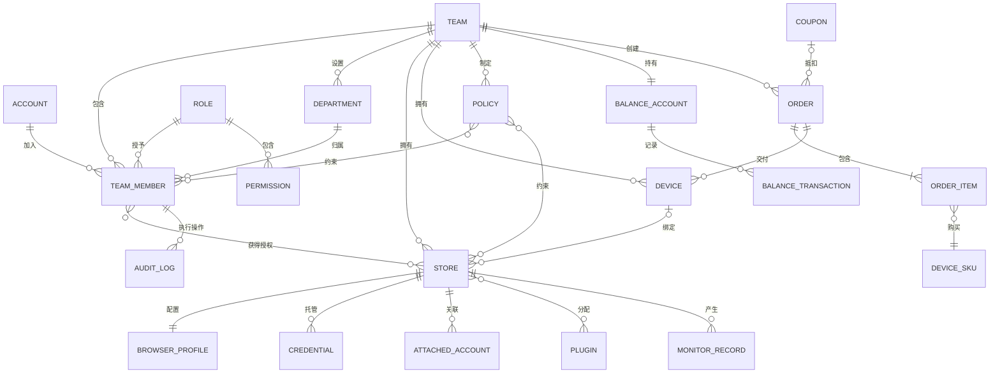
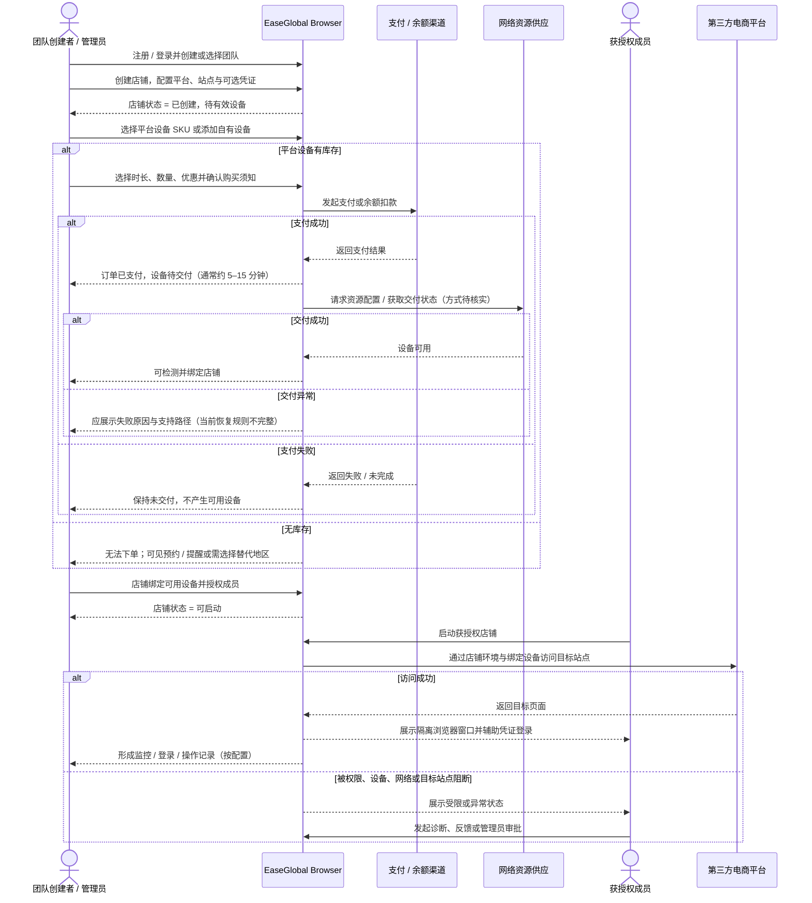
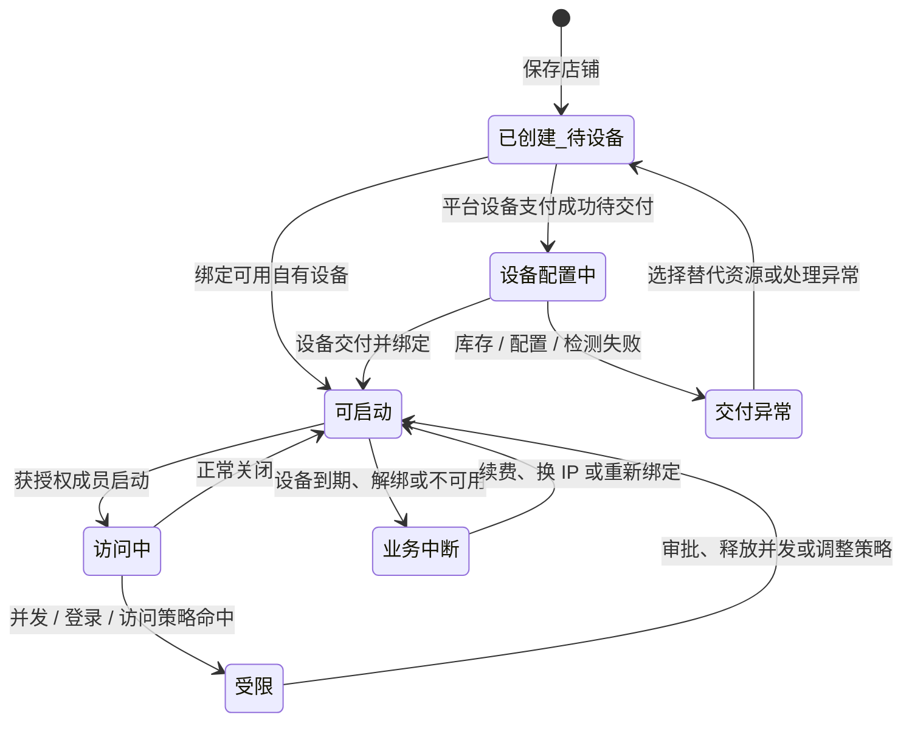
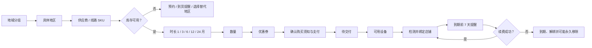
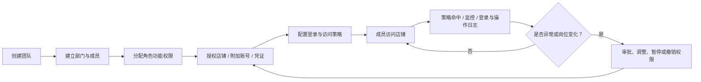
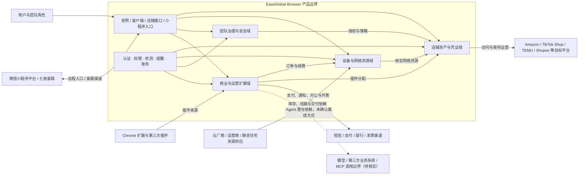

# EaseGlobal Browser 产品架构

> **文档目标**：从业务与产品视角说明 EaseGlobal Browser 面向谁、通过哪些触点提供服务、由哪些稳定产品域构成、各域如何围绕“店铺环境”协作，以及哪些能力依赖外部生态。  
> **主要受众**：管理层、产品团队、业务架构、研发与测试负责人、解决方案与客户成功团队。  
> **版本 / 日期**：V1.0 / 2026-08-14。  
> **非范围**：后台运营系统、供应商结算系统、未公开的服务端部署、数据库、加密算法、环境隔离实现、Agent 执行基础设施及内部经营数据。

## 1. 先给结论

### 1.1 架构结论

EaseGlobal Browser 不是由“店铺管理、设备管理、团队管理”等菜单平行拼成的工具集合。更准确的产品架构是：

> **以店铺环境为核心业务资产，以团队为租户与治理边界，以设备 / IP 为店铺可访问的前置资源与当前最明确的付费商品，再用凭证托管、安全策略、插件、Agent、账务与服务能力形成持续运营闭环。**

四个稳定产品域分别承担不同职责：

1. **店铺资产与凭证域**：把平台、站点、浏览器环境、登录凭证、附加账号和成员访问关系聚合为可持续运营的店铺资产；
2. **设备与网络资源域**：把地区网络资源组织为可选择、购买、交付、检测、绑定、换 IP、续费和到期处置的设备对象；
3. **团队治理与安全域**：通过团队、部门、成员、角色、对象授权、登录限制、访问策略、监控和日志治理资产使用；
4. **商业与运营扩展域**：通过余额、订单、优惠券、充值、开票、自动续费形成交易闭环，并用插件、Agent、活动、邀请和服务扩展价值。

### 1.2 核心对象与边界

| 架构要点 | 判断 |
|---|---|
| 核心聚合对象 | **店铺环境**。设备、浏览器参数、密码、Cookie、OTP、Passkey、附加账号、成员授权、插件和监控均围绕店铺建立关系 |
| 组织边界 | **团队**。成员、部门、角色、店铺、设备、策略、日志与费用均归属团队语境；底层租户隔离实现待核实 |
| 商业边界 | **设备 / IP 订单与续费**是当前最明确的标准化收费主线 |
| 使用前置 | 店铺必须绑定有效设备才能启动；一台设备可绑定多个店铺，但同平台共享存在关联风险提示 |
| 凭证边界 | 密码、Cookie、OTP、Passkey 和附加账号用途、权限与生命周期不同，不应合并成单一“密码能力” |
| Agent 边界 | Agent 已包含应用、权限提示与定制入口；任务运行、SLA、人工接管、外部调用和计费尚未形成明确产品合同 |
| 外部责任边界 | 目标电商平台、网络资源供应、支付 / 短信 / 发票、Chrome 扩展与微信 / 客服渠道不属于产品自有能力 |

### 1.3 三条业务主链

1. **首次价值与持续运营链**：注册 / 下载 → 进入团队 → 创建店铺 → 购买或添加设备 → 交付、检测与绑定 → 成功启动目标站点 → 成员持续运营；
2. **团队治理链**：创建团队 → 建部门、成员与角色 → 分配店铺和凭证 → 配置登录 / 页面 / 元素策略 → 使用中监控 → 日志追踪 → 暂停、撤销或调整权限；
3. **商业连续性链**：选择地区和供应 SKU → 选择时长、数量与优惠 → 支付 → 设备交付 → 到期提醒 → 手动或自动续费 → 换 IP / 扩容 → 继续绑定店铺使用。

首次价值终点不是“注册成功”或“创建店铺成功”，而是：

> **至少一个店铺绑定有效设备，并成功启动到目标站点。**

## 2. 产品架构图

可编辑源文件：[EaseGlobal Browser 产品架构图.svg](./assets/EaseGlobal%20Browser产品架构图.svg)

主图采用“触点 → 用户 → 应用 → 核心域 → 基础能力 → 外部生态”的横向分层，并在右侧增加跨域治理与连续性支撑。虚线大框是 EaseGlobal Browser 产品边界；底部外部生态不代表网易自建资源或系统。

图中不包含数据库、微服务、消息队列、指纹生成算法、代理调度算法、密钥管理或供应商结算等内容，这些技术实现当前无法核实。

## 3. 分层架构

| 层级 | 主要组成 | 核心职责 | 关键输入 | 关键输出 |
|---|---|---|---|---|
| 触点层 | 官网、注册、下载、帮助中心；Windows / macOS 客户端；店铺隔离窗口；微信小程序远程入口；客服与反馈 | 承接获客、安装、配置、店铺访问、远程应急和问题处理 | 用户访问、账号信息、客户端操作、反馈 | 注册 / 登录结果、业务工作台、浏览器窗口、帮助与工单入口 |
| 用户层 | 个人 / 小型卖家、BOSS / 创建者、超级管理员 / 管理员、店铺管理员 / 运营成员、安全 / 财务 / 支持角色 | 定义业务目标、操作责任、采购决策与权限范围 | 账号身份、团队身份、角色、部门和对象授权 | 角色化任务、可见数据、允许或拒绝的操作 |
| 应用层 | 首页与新手引导、店铺运营台、设备资源台、团队与安全治理台、插件 / Agent / 费用服务 | 按用户任务组织跨域能力，形成可操作工作台 | 用户意图、对象状态、权限与业务规则 | 店铺、设备、授权、策略、订单、插件或 Agent 结果 |
| 核心域层 | 店铺资产与凭证、设备与网络资源、团队治理与安全、商业与运营扩展 | 维护核心对象、状态、规则与跨域关系 | 店铺配置、网络资源、组织关系、商品与交易信息 | 可运行店铺、可用设备、授权结果、交易与扩展能力 |
| 基础能力层 | 身份认证、团队切换、权限校验、敏感遮罩、浏览器环境、网络检测、凭证辅助、搜索筛选批量、提醒、账务权益 | 为三个及以上核心域提供一致的产品级复用能力（不表示后端服务拆分） | 账号、策略、对象状态、用户操作 | 认证 / 校验、状态反馈、批量结果、提醒和账务结果 |
| 外部生态层 | 第三方跨境平台；云厂商、运营商和静态住宅供应；支付 / 短信 / 银行 / 发票；Chrome 扩展；微信小程序与七鱼客服 | 提供目标业务场景、网络资源、交易与通知渠道、插件来源和外部运行渠道（具体集成方式待核实） | 产品的业务请求、资源选择或外部跳转 | 站点响应、设备资源、支付 / 短信 / 发票结果、扩展或客服响应 |

## 4. 核心产品域

### 4.1 店铺资产与凭证域

**职责**：把一个第三方平台账号所需的站点、浏览器环境、网络绑定、凭证、成员和运营扩展收敛为可管理店铺资产。

| 子域 | 关键能力 | 核心对象 | 规则与边界 |
|---|---|---|---|
| 店铺生命周期 | 单个 / 批量创建、编辑、搜索、筛选、排序、标签、打开、转让、删除 | 店铺 | 批量模板单次最多 300 行；高风险修改可能影响缓存、登录态或归属 |
| 平台与环境 | 平台、站点、自定义 URL、Chromium 内核、UA、操作系统标识、打开方式、缓存 | 店铺环境配置 | UA 与内核差异会提示；可恢复上次标签页；清缓存分本地、保留 Cookie 和全部清理 |
| 设备绑定 | 从可用设备中搜索并绑定、解绑 | 店铺、设备 | 店铺没有有效设备不能启动；一台设备可绑定多店；同平台共享会提示关联风险 |
| 账号 / 密码 | 登录账号托管、密码回填、账号保护、密码显示限制 | 主账号凭证 | 普通成员可在不查看明文的情况下使用回填；底层加密未独立验证 |
| Cookie | 管理端或插件导入、环境保持登录态、清理策略 | Cookie 数据 | Cookie 与密码不是同一对象；有效性由第三方站点决定 |
| OTP / Passkey | 二步验证码查看 / 代填、亚马逊 Passkey 托管与绑定 | OTP 密钥、Passkey 密钥 | 当前 Passkey 重点支持亚马逊类平台且要求客户端 2.1.0+；Passkey 后仍可能触发 OTP |
| 附加账号 | 保存邮箱、支付、ERP 等关联账号并独立授权 | 附加账号 | 授权范围可与主店铺不同 |

店铺不是一个网页快捷方式，而是环境、网络、身份、授权和运营状态的聚合对象。产品的主要激活、留存和治理动作最终都落在店铺上。

### 4.2 设备与网络资源域

**职责**：把地区网络资源商品化，并维护从选择、购买或录入到绑定、换 IP、续费和移除的完整生命周期。

| 子域 | 关键能力 | 核心对象 | 规则与边界 |
|---|---|---|---|
| 平台设备商品 | 地域、具体地区、供应商 / 线路、SKU、月基价、库存、时长、数量 | 设备 SKU | 地域主要承担目录分组；具体地区与供应商 / 线路共同决定可售 SKU 和价格 |
| 自有设备接入 | 单个 / 批量录入、协议、地址、端口、账号、密码、网络检测 | 自有设备 | 支持 HTTP、HTTPS、SOCKS5、SSH、SSL；检测通过后进入可用状态 |
| 设备购买 | 选择 SKU、1 / 3 / 6 / 12 / 24 月、数量、优惠券、支付 | 购买项、订单 | 时长以 30 / 90 / 180 / 360 / 720 天口径计算；折扣标签不总能精确复算成交价 |
| 交付与检测 | 支付后配置、状态反馈、网络 / 站点可达检测 | 设备实例 | 交付通常需约 5–15 分钟；库存和供应会影响交付 |
| 绑定与使用 | 设备绑定一个或多个店铺、解绑 | 设备实例、绑定关系 | 绑定关系决定店铺网络入口；同平台多店共享存在业务风险 |
| 换 IP | 同供应商、同价资源范围内更换，继承或解除原绑定 | 换 IP 权益、设备实例 | 6 / 12 / 24 月分别可见 1 / 3 / 6 次免费换 IP；次数按设备归属，不能共用 |
| 到期与续费 | 7 天提醒、手动续费、余额自动续费、到期移除 | 到期状态、续费订单 | 自动续费于到期前 1 日扣余额；未续费后可能自动解绑并永久移除 |

设备不是店铺表单中的一个代理字段，而是“商品对象 + 交付对象 + 时效权益对象”。设备域同时连接店铺使用价值与商业交易，是当前架构中最明确的收入桥梁。

### 4.3 团队治理与安全域

**职责**：控制谁能在什么组织范围、什么时间与终端、对哪些店铺和敏感对象执行哪些动作，并留下可追踪记录。

| 子域 | 关键能力 | 核心对象 | 规则与边界 |
|---|---|---|---|
| 组织结构 | 团队创建 / 切换、部门层级、成员添加 / 修改 / 禁用 / 调整 | 团队、部门、成员 | 团队承载资产与费用；成员存在待激活、正常、受限 / 禁用等状态 |
| 角色与功能权限 | 系统角色、自定义角色、功能操作权限 | 角色、权限项 | BOSS / 创建者、超级管理员、管理员、普通成员的范围不同；最终权限矩阵存在口径冲突 |
| 数据与对象授权 | 部门数据范围、店铺授权、附加账号授权、凭证操作权限 | 授权关系 | 成员最终能力来自角色、数据范围、对象授权与动态策略的交集 |
| 登录控制 | 登录时间、终端、地区、异常登录审批 | 登录策略、登录申请 | 被策略拦截时进入审批 / 拒绝状态；具体管理员范围存在口径冲突 |
| 访问策略 | URL 黑白名单、页面 / 元素限制、密码显示、F12、打印、水印 | 访问策略 | 既有页面级也有元素级限制；策略命中与管理员配置口径需统一 |
| 监控与日志 | 店铺监控 / 录像、访问命中、登录日志、操作日志 | 监控记录、审计日志 | 用途不同，不应统称“日志”；保留期、导出和删除规则未完整公开 |

该域不是简单 RBAC，而是“角色功能权限 + 部门数据范围 + 店铺 / 凭证对象授权 + 登录与访问动态策略”的组合模型。当前主要风险不是开关不足，而是最终结果难预测且规则口径不一致。

### 4.4 商业与运营扩展域

**职责**：完成资源交易、续费与企业对账，并通过插件、Agent、活动和支持能力扩大使用深度。

| 子域 | 关键能力 | 核心对象 | 规则与边界 |
|---|---|---|---|
| 资金与订单 | 余额、充值、订单、余额明细、优惠券 | 余额账户、订单、优惠券、交易记录 | 订单账本与余额账本承担不同对账用途；优惠券叠加和分摊规则未完整公开 |
| 续费与发票 | 手动 / 自动续费、对公转账、开票 | 续费订单、发票申请 | 自动续费从余额扣款；余额不足重试、宽限期、红冲规则待核实 |
| 插件生态 | Chrome 商店添加、自研上传、权限确认、更新、自动 / 手动分配 | 插件、插件版本、分配关系 | 可面向团队、店铺或成员分发；签名、版本固定、灰度和回滚机制未公开 |
| Agent 应用 | Agent 入口、应用列表、权限提示、限时体验、定制需求 | Agent 应用、定制需求 | 已有应用入口与方向；输入输出、运行状态、失败重试、SLA、审计和收费均待核实 |
| 增长与服务 | 活动、优惠、邀请分享、反馈、问题诊断、店铺临时授权 | 邀请、活动、反馈、临时授权 | 临时授权可能进入店铺后台，需限定范围、时长、禁止动作和留痕；具体工单闭环未完整公开 |

插件已具备完整的分发入口，Agent 仍处于能力露出和场景验证阶段。两者不能在成熟度上等量齐观；主图因此对 Agent 使用虚线能力卡。

## 5. 核心对象关系

关键关系解释：

- **设备与店铺不是一一对应**：一个店铺当前选择一台设备，一台设备可以服务多个店铺；产品同时提示同平台共享设备可能增加关联风险；
- **成员与店铺是多对多**：角色只决定功能范围，成员还需要对象授权才能进入具体店铺；
- **凭证从属于店铺语境但不是同一种对象**：账号 / 密码、Cookie、OTP、Passkey 和附加账号各有不同规则；
- **订单购买 SKU，交付设备实例**：页面先选择地区 / 供应 / 时长 / 数量，再形成订单并等待设备配置；
- **策略跨越成员与店铺**：登录策略面向账号 / 终端，访问策略面向成员在店铺环境中的页面和元素行为。

## 6. 核心业务时序

### 6.1 首次价值链

> 下图是业务时序，不代表实际系统 API、队列或同步调用实现。

### 6.2 店铺状态机

### 6.3 设备购买与续费链

### 6.4 团队治理链

## 7. 集成关系与外部边界

### 7.1 集成关系图

### 7.2 外部对象与责任边界

| 外部对象 | 与产品的关系 | EaseGlobal Browser 可见职责 | 不应外推的责任 |
|---|---|---|---|
| Amazon、TikTok Shop、TEMU、Shopee、Walmart 等 | 店铺的目标平台与业务页面 | 建立店铺环境、绑定设备、辅助登录、配置策略与记录 | 第三方账号状态、风控判断、页面可用性和平台业务结果不由浏览器保证 |
| 云厂商、运营商、静态住宅资源供应商 | 提供地区、线路、库存与设备资源 | 商品展示、购买入口、交付状态、检测、绑定、换 IP、续费 | 资源池归属、供应商调度、唯一性、永久不变和全部站点可访问不能默认保证；具体供给链待核实 |
| 微信 / 支付宝 / 银行与发票服务 | 完成充值、支付、对公入账或开票 | 管理订单、余额、支付选择、回查入口和发票申请 | 资金清结算、银行处理和税务系统内部不在当前产品边界 |
| 短信服务 | 注册 / 登录验证码与到期通知 | 发起验证码和提醒、展示结果 | 短信通道商、频控与灾备未公开 |
| Chrome 扩展与第三方插件 | 提供外部运营功能 | 安装 / 上传入口、权限提示、版本与分配管理 | 插件自身行为、数据处理和第三方服务结果需要独立治理 |
| 微信小程序平台 | 承载“网易跨境助手”远程入口 | 绑定手机、提供获授权店铺的远程访问 | 微信运行平台、账号体系和审核规则属于外部生态 |
| 七鱼客服 | 官网客服会话渠道 | 提供客服入口和会话承接 | 当前首屏主要展示“网易跨境支付”问题，不能把渠道内容视为浏览器自有知识已正确配置 |
| Agent 模型 / 第三方业务系统 / MCP | 可能支撑 Agent 执行与系统连接 | 可见 Agent 应用、权限提示、定制入口及设置中 MCP 露出 | 模型厂商、数据流、调用对象、鉴权、任务调度、SLA 与计费均未核实 |

## 8. 核心对象清单

| 对象 | 关键属性 / 关系 | 生命周期 | 归属与权限 | 主要风险 |
|---|---|---|---|---|
| 账号 | 手机号、团队账号、密码、绑定手机、所属团队 | 注册 / 激活 → 登录 → 修改 → 退出 / 恢复待核实 | 个人身份，可加入多个团队 | 手机丢失、改绑依赖原号、恢复规则不完整 |
| 团队 | 名称、创建者、成员、部门、角色、店铺、设备、费用 | 创建 → 配置 → 扩张 → 转移 / 解散待核实 | BOSS / 创建者为最高边界 | 租户边界、最高权限、资产迁移与注销 |
| 部门 | 名称、层级、成员、数据范围 | 新建 → 调整 → 删除 | 管理员按数据范围操作 | 删除后成员与授权结果口径需明确 |
| 成员 | 手机、姓名、部门、角色、状态、授权对象 | 待激活 → 正常 → 受限 / 禁用 → 调整 / 删除 | 受角色、部门、对象授权和策略共同约束 | 最终权限难预测、暂停 / 删除后的残留权限 |
| 角色 | 名称、功能权限项、适用成员 | 创建 / 编辑 → 分配 → 失效 | 团队管理员配置，最高边界待核实 | 权限冲突、缺少影响预览 |
| 店铺 | 平台、站点、名称、标签、环境、设备、成员、凭证 | 已创建待设备 → 可启动 → 访问中 / 受限 → 中断 / 删除 | 团队拥有；成员按对象授权访问 | 误删、转让范围、共享设备关联风险 |
| 浏览器环境配置 | 内核、UA、系统标识、缓存、打开方式 | 创建 → 编辑 → 生效 → 清理 / 重置 | 随店铺权限控制 | 参数不一致、清缓存导致登录态丢失 |
| 设备 SKU | 地域、地区、供应商 / 线路、月基价、库存、时长价表 | 上架 → 可售 / 缺货 → 调价 / 下架 | 商业配置，后台规则未覆盖 | 折扣不可复算、库存变化、术语混淆 |
| 设备实例 | 网络类型、协议、地址、状态、到期、换 IP 权益、绑定店铺 | 待交付 / 待检测 → 可用 → 已绑定 → 临近到期 → 续费或移除 | 团队拥有；操作受设备权限控制 | 交付失败、不可退款、到期中断、共享关联 |
| 凭证 | 账号 / 密码、Cookie、OTP、Passkey | 添加 / 导入 → 授权使用 → 更新 / 失效 → 解绑 / 删除 | 挂在店铺语境；敏感权限应独立控制 | 加密、内部访问、导出、轮换和删除未证实 |
| 附加账号 | 类型、账号、凭证、关联店铺、授权成员 | 添加 → 授权 → 使用 → 修改 / 删除 | 可独立于主店铺授权 | 边界不清导致越权或交接遗漏 |
| 策略 | 登录终端 / 时间 / 地区、URL、页面元素、敏感操作、水印 | 创建 → 启用 → 命中 / 审批 → 调整 / 停用 | 团队级配置，作用于成员与店铺 | 规则冲突、误拦截、管理员范围不一致 |
| 监控 / 日志 | 店铺监控、访问记录、登录日志、操作日志 | 触发 → 记录 → 查询 / 导出 → 到期删除待核实 | 管理角色查看范围存在口径差异 | 高敏内容、保留期、删除、导出与审计可信度 |
| 订单 | 类型、SKU、时长、数量、原价、优惠、实付、状态 | 待支付 → 已支付 → 交付 / 续费 → 完成 / 异常 | 团队费用边界；财务 / 管理角色 | 对账、退款例外、支付失败和状态回查 |
| 余额账户 | 充值、扣款、余额明细、自动续费 | 充值 → 可用 → 扣款 / 退款待核实 → 对账 | 团队资金账户 | 余额不足、失败重试、异常扣款 |
| 优惠券 | 适用 SKU、门槛、有效期、状态 | 领取 → 可用 → 已使用 / 过期 | 作用于订单结算 | 叠加、分摊与失效规则不完整 |
| 插件 | 渠道、版本、权限、状态、分配范围 | 添加 / 上传 → 权限确认 → 分配 → 更新 / 禁用 / 删除 | 团队管理，作用于店铺或成员 | 供应链、权限扩张、版本回退 |
| Agent 应用 | 场景、权限提示、体验状态、定制需求 | 展示 / 申请 → 运行链路待核实 | 团队 / 成员权限边界未完整公开 | 数据、外部调用、失败、人机接管、成本与审计 |

## 9. 横向治理能力

| 治理能力 | 适用域 | 主要机制 | 架构缺口 |
|---|---|---|---|
| 身份与访问 | 触点、店铺、设备、团队、费用、插件 / Agent | 手机验证码、团队账号、团队切换、角色、部门数据范围、对象授权 | 缺少统一的最终权限预览、变更影响和恢复路径 |
| 敏感数据治理 | 店铺、凭证、附加账号、插件、临时授权 | 密码遮罩 / 回填、凭证权限、插件权限提示、临时授权告知 | 加密、密钥、内部访问、导出、轮换、保留与删除未核实 |
| 策略与审计 | 团队、成员、店铺、凭证 | 登录控制、页面 / 元素策略、水印、监控、登录 / 操作日志 | 角色口径、日志保留、导出、删除和不可抵赖性不完整 |
| 状态与恢复 | 店铺、设备、订单、登录、访问 | 设备检测 / 交付 / 到期、审批、反馈、诊断、换 IP、重新绑定 | 交付失败、余额不足、宽限期、旧设备恢复和跨域诊断不完整 |
| 商业与权益 | 设备、订单、余额、优惠券、续费 | 时长价表、订单、充值、余额扣款、自动续费、开票 | 折扣计算、优惠叠加、退款例外、失败重试和红冲规则不完整 |
| 内容与服务 | 官网、客户端、帮助、客服、更新 | 88 篇帮助文章、更新入口、问题反馈、七鱼客服 | 品牌 / UI / 权限口径不一致；客服知识上下文错配 |

## 10. 架构特征与主要风险

### 10.1 架构优势

- **核心对象明确**：店铺把环境、设备、凭证、成员和策略集中到一个可持续运营单元；
- **资源交易嵌入业务链**：设备购买不是孤立商城，而是直接连接店铺能否启动；
- **凭证类型较完整**：密码、Cookie、OTP、Passkey 与附加账号覆盖多种跨境登录场景；
- **团队治理跨度较宽**：组织、权限、动态策略、监控和日志形成从事前到事后的控制链；
- **商业闭环已建立**：选择、支付、交付、绑定、提醒、续费和换 IP 构成可观察闭环；
- **扩展方向明确**：插件已有分发机制，Agent 具备向运营生产力扩展的战略位置。

### 10.2 架构风险

| 风险 | 架构原因 | 影响 |
|---|---|---|
| 店铺与设备跨域状态不一致 | 店铺能否启动依赖设备交付、检测、绑定与到期，状态分散在多个模块 | 用户支付后仍可能不知道下一步，异常归因困难 |
| 权限结果不可预测 | 角色、部门、店铺、附加账号、凭证与动态策略叠加 | 越权、误拦截、客服成本和企业信任受损 |
| 高敏对象集中 | 密码、Cookie、OTP、Passkey、监控和临时授权都进入平台 | 平台安全责任显著提高，前台遮罩不能代替底层安全证明 |
| 商品术语与价格口径不一致 | “月”与固定天数、折扣标签与成交价、固定 / 静态 / 独享混用 | 支付争议、售后成本和采购信心下降 |
| 外部依赖影响核心价值 | 目标平台、网络供应、支付、短信、插件与客服均在外部边界 | 即使内部页面可用，外部波动也可能阻断首次价值和续费 |
| Agent 能力合同不完整 | 入口和宣传先于场景、状态、SLA、审计与计费规则 | 无法稳定进入生产流程，也难形成可信增值收入 |
| 内容基线分裂 | 官网、客户端、帮助中心、更新日志和客服知识未统一 | 架构规则无法被用户、客服、测试与销售一致执行 |

## 11. 适用边界

| 类别 | 内容 |
|---|---|
| 产品范围 | 官网、注册 / 登录、桌面客户端、隔离浏览器窗口、小程序入口，以及店铺、设备、团队、成员、部门、角色、凭证、策略、监控、日志、订单、余额、优惠券、发票、插件、Agent 和反馈能力 |
| 核心结构 | 店铺是核心聚合对象；团队是组织与费用边界；设备是当前主要付费资源；四个核心域通过三条业务主链协作 |
| 未实测业务边界 | 团队 / 店铺 / 席位 / Agent 收费，优惠券叠加，数量阶梯价，交付失败补偿，自动续费失败重试与宽限，最终权限矩阵，日志保留，插件回滚，Agent SLA 与计费 |
| 未实测技术边界 | 环境隔离原理、指纹生成、防关联效果、租户隔离、凭证加密和密钥管理、数据同步一致性、供应商路由、支付对账、日志防篡改、MCP / API 鉴权限流、Agent 执行与数据流 |
| 非范围 | 网易后台运营、供应商后台、结算系统、客户业务后台、第三方平台内部、云厂商资源池、支付机构系统、微信 / 七鱼系统内部；这些只作为外部依赖 |

## 12. 待确认事项与优先级

1. **P0：统一跨域状态机**。确认订单、设备交付、设备绑定、店铺可启动和异常恢复是否有统一状态与诊断码；
2. **P0：建立最终权限矩阵**。明确 BOSS、超级管理员、管理员、部门、店铺、凭证与访问策略叠加后的唯一结果；
3. **P0：补齐设备逆向规则**。明确缺货、交付失败、IP 不可用、不可退款例外、续费失败、宽限与旧绑定恢复；
4. **P0：完成敏感数据安全说明**。明确凭证加密、密钥、内部访问、临时授权、日志、导出、保留和删除；
5. **P1：建立商品与内容单一口径**。统一地区、供应商、静态 / 固定 / 独享、月 / 固定天数、折扣、帮助和客服口径；
6. **P1：明确 Agent 产品边界**。定义可用场景、输入输出、权限、状态、结果、失败、人工接管、审计、外部调用、SLA 与计费；
7. **P2：评估架构效果**。用激活率、首启成功率、交付时长、续费率、异常率、权限事件与服务成本衡量架构效果。

## 13. 变更记录

| 版本 | 日期 | 变更 |
|---|---|---|
| V1.0 | 2026-08-14 | 首次建立 EaseGlobal Browser 产品架构；输出主架构图、集成关系图、核心业务时序、分层表、核心域表、对象表、边界与不确定性 |
