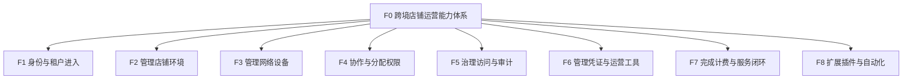
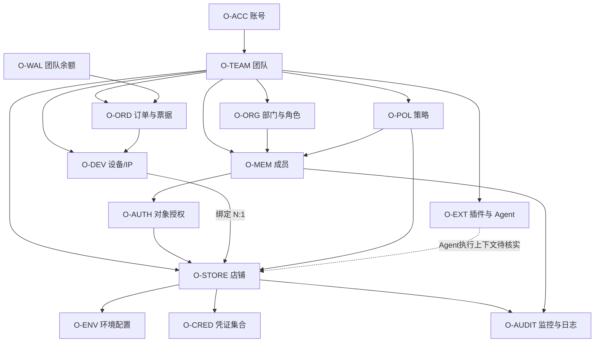
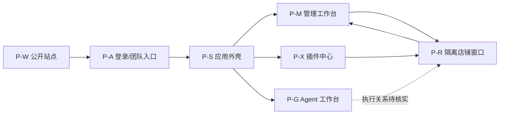
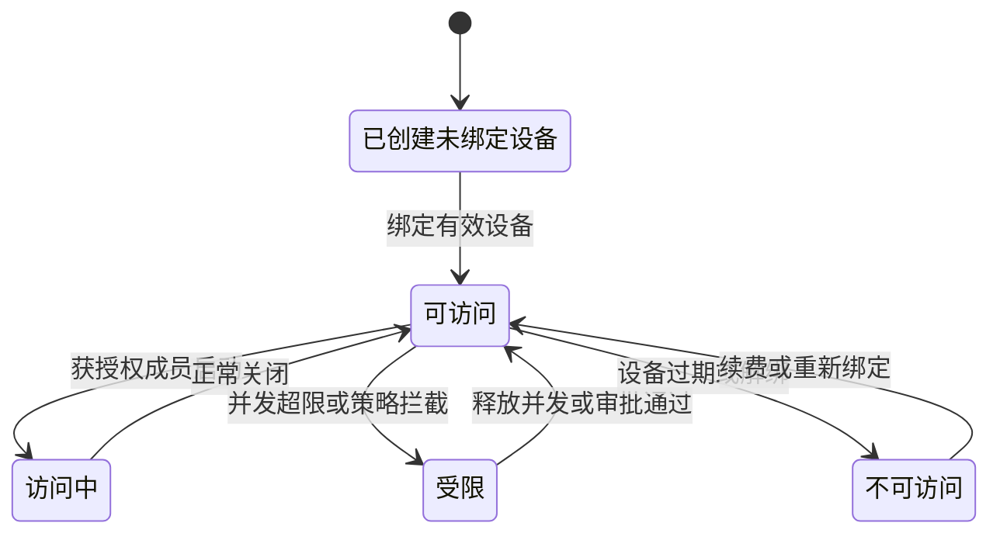
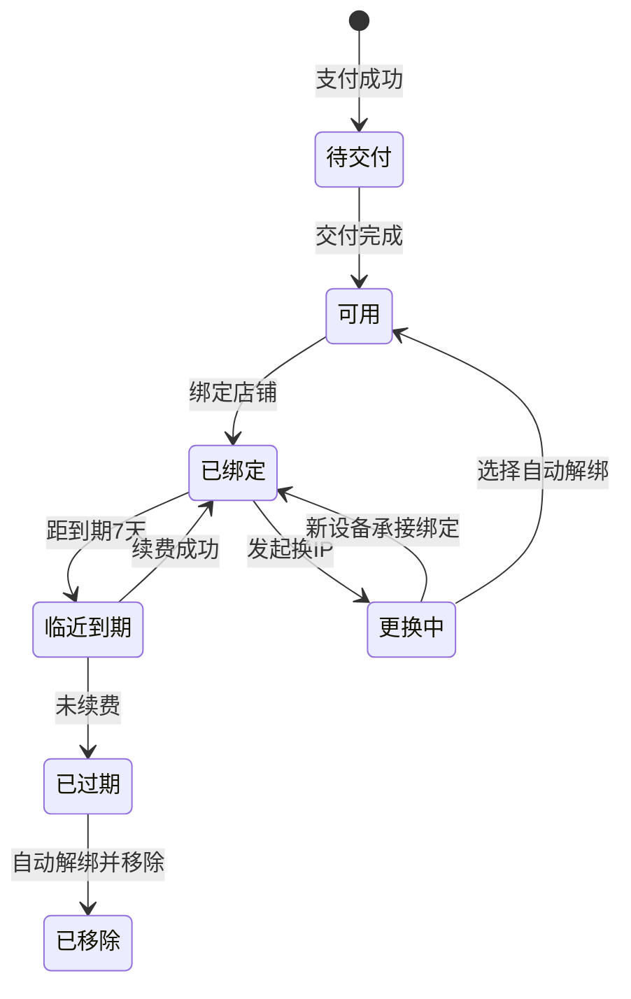
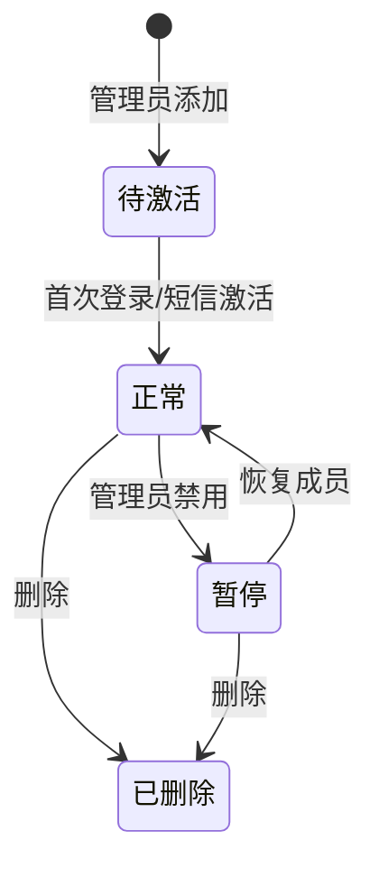
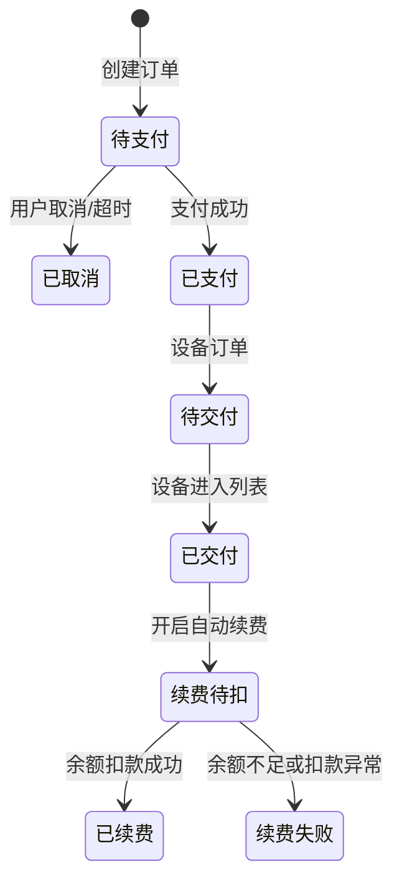
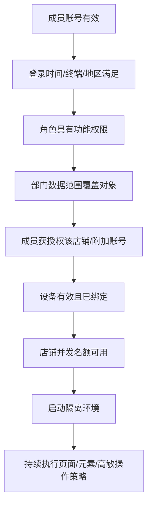

# EaseGlobal Browser 产品结构

> 产品：EaseGlobal Browser / 网易跨境浏览器  
> 文档类型：产品结构图、产品功能结构图、产品信息结构图  
> 文档版本：V1.0  
> 文档日期：2026-08-14  
> 适用对象：产品、业务、设计、研发、测试、数据、安全与管理者

## 1. 文档说明

### 1.1 目的与术语口径

本文用三种互不替代的结构回答不同问题：

| 图类型 | 本文采用的定义 | 回答的问题 | 明确不表达 |
|---|---|---|---|
| 产品功能结构图 | 按业务能力组织功能 | 产品能做什么？ | 不按导航照抄，不展开字段 |
| 产品信息结构图 | 按业务对象归一字段、关系与状态 | 产品管理什么信息？ | 不按页面重复字段，不伪装成数据库 ER 图 |
| 产品结构图 | 以页面/容器为骨架，组合功能、信息、状态和跳转 | 用户在哪看到什么、做什么、去哪里？ | 不展开视觉尺寸、控件样式和技术部署 |

本文的“产品结构图”不是“产品架构图”。技术组件、服务端、数据存储、加密实现和第三方接口部署不在本文范围内。

### 1.2 版本范围与目标读者

- **范围**：公开官网、登录与客户端入口、管理工作台、隔离店铺窗口、插件中心、Agent 工作台、帮助/反馈/更新等支撑触点；
- **重点**：店铺、设备、团队、权限、凭证、安全、费用、插件和 Agent 的页面与对象关系；
- **非范围**：源码、真实服务端判定顺序、数据库表结构、浏览器指纹隔离强度、IP 独享性、真实支付/退款和第三方平台风控效果；
- **目标读者**：管理者先看总图与结构结论；产品/设计看页面映射；研发/数据看对象关系；测试看状态与追踪矩阵。

### 1.3 图例与交付物

- 蓝色：店铺与平台核心；绿色：设备与资源；紫色：团队、扩展与自动化；红色：安全、敏感信息与异常；黄色：商业计费；灰色虚线：待核实或弹窗/抽屉；
- 实线：确定的关系；虚线：架构判断、可选路径或待核实关系；
- 每张图同时提供 `.svg`、`.png`，并由可编辑渲染源统一生成。

| 图 | PNG | SVG |
|---|---|---|
| 产品结构总图 | [打开 PNG](./assets/EaseGlobal%20Browser产品结构总图.png) | [打开 SVG](./assets/EaseGlobal%20Browser产品结构总图.svg) |
| 管理工作台分域图 | [打开 PNG](./assets/EaseGlobal%20Browser产品结构-管理工作台分域图.png) | [打开 SVG](./assets/EaseGlobal%20Browser产品结构-管理工作台分域图.svg) |
| 产品功能结构图 | [打开 PNG](./assets/EaseGlobal%20Browser产品功能结构图.png) | [打开 SVG](./assets/EaseGlobal%20Browser产品功能结构图.svg) |
| 产品信息结构图 | [打开 PNG](./assets/EaseGlobal%20Browser产品信息结构图.png) | [打开 SVG](./assets/EaseGlobal%20Browser产品信息结构图.svg) |
| 统一可编辑渲染源 |  | [打开 CJS](./assets/EaseGlobal%20Browser结构图-渲染源.cjs) |

## 2. 结构结论

1. **店铺是页面与信息结构的中心对象。**设备、环境、成员、凭证、附加账号、插件、策略、监控和日志最终都围绕店铺发生。
2. **设备是店铺从“已创建”进入“可使用”的前置对象。**没有有效设备时店铺不能完成访问，设备到期会导致业务中断。
3. **团队是租户、权限和费用边界。**成员最终权限不是单一角色决定，而是角色功能权限、部门数据范围、对象授权和动态策略共同作用。
4. **应用外壳实际承载三类工作区。**“管理”承接核心资产与治理，“插件”承接扩展分发，“Agent”承接自动化探索；三者共享团队、账号和余额上下文。
5. **商业闭环以设备订单为主线。**地区/供应商/SKU、时长、数量和优惠共同决定订单；续费、换 IP、余额和发票延长设备生命周期。
6. **当前主要结构问题不是缺页面，而是跨域连续性。**建店、购设备、交付、绑定、首启、授权、治理和续费跨多个页面，状态口径与恢复路径没有完全统一。

## 3. 产品功能结构图

### 3.1 功能总览

### 3.2 功能分域与逻辑

| 功能域 | 二级能力 | 关键叶子功能 | 规则、异常与边界 |
|---|---|---|---|
| F1 身份与租户进入 | 账号、校验、团队、客户端 | 注册/登录账号；校验短信与协议；创建/切换团队；维护密码/手机号；安装/更新客户端 | 登录控制可能拒绝或进入申请；无团队、待验证、更新失败需独立状态 |
| F2 管理店铺环境 | 建店、环境、生命周期、批量 | 创建/批量导入；编辑/复制/转让；筛选/标签；配置内核/UA/打开方式；导入 Cookie；清缓存；启动/关闭/删除 | 批量导入单次最多 300 行；店铺未绑定设备不能启动；清缓存的本地、云端、Cookie 影响不同 |
| F3 管理网络设备 | 采购、自有设备、检测、绑定、续费、换 IP | 购买平台设备；添加/批量导入自有设备；检测网络；绑定/解绑；续费/自动续费；更换 IP | 交付通常 5-15 分钟；设备可绑定多店但存在关联风险；到期会解绑并移除；余额不足恢复机制不完整 |
| F4 协作与分配权限 | 组织、成员、角色、数据范围、对象授权 | 创建部门；添加/激活/暂停成员；创建角色；分配功能权限；配置数据范围；授权店铺/附加账号；回收权限 | 最终权限为多层交集；暂停是否删除授权存在口径冲突；缺少统一最终权限预览 |
| F5 治理访问与审计 | 登录控制、访问策略、通用限制、水印、录像、日志 | 限制时间/终端/地区；审批登录；限制 URL/元素/密码/F12/打印；配置水印；开启录像；查询日志 | 页面元素限制依赖第三方页面结构；录像保留口径为近 30 天；角色和入口名称存在口径冲突 |
| F6 管理凭证与运营工具 | 凭证、附加账号、书签、文件、翻译、视频 | 托管密码；导入/同步 Cookie；配置/授权 OTP；绑定/解绑 Passkey；管理附加账号；分发书签；隔离文件；翻译/视频认证 | OTP 与 Passkey 不是替代关系；Passkey 当前聚焦亚马逊类平台；凭证加密实现未独立验证 |
| F7 完成计费与服务闭环 | 余额、支付、优惠、订单、发票、支持 | 充值；选择支付方式/对公汇款；使用优惠券；查询余额/订单；取消待支付订单；申请发票；反馈/临时授权排障 | 已售设备原则上不退换；退款例外、红冲、失败重试和宽限期不完整 |
| F8 扩展插件与自动化 | 插件、分配、Agent 应用、任务 | 获取 Chrome 插件；上传/更新自研插件；确认权限；按店铺/成员分配；选择 Agent 应用/技能；创建/查询任务 | 插件供应链与回滚规则不足；Agent 执行状态、结果、SLA、人工接管和计费边界未完整核实 |

### 3.3 跨域公共能力

- 搜索、筛选、排序、分页、标签和批量操作；
- 角色与对象权限校验、禁用态和无权限态；
- 空状态、加载状态、错误状态、确认弹窗和取消/撤销；
- 消息、到期提醒、更新提示、使用指南、帮助和客服；
- 登录日志、操作日志、访问命中和监控留痕。

需要说明：部分页面具备这些能力，不代表所有模块已使用同一套公共组件或同一套服务端规则。

## 4. 产品信息结构图

### 4.1 核心对象关系

### 4.2 对象字典

| 对象 ID | 对象 | 标识与关键字段 | 主要关系 | 关键状态/边界 |
|---|---|---|---|---|
| O-ACC | 账号 | 账号标识、手机号、昵称、密码状态、团队成员关系 | 一个账号可进入一个或多个团队 | 待验证、正常、受登录控制；注销与恢复规则不完整 |
| O-TEAM | 团队 | 团队 ID、名称、创建者、余额、资产汇总 | 1:N 部门、角色、成员、店铺、设备、策略、订单 | 当前账号可切换团队；转移/解散规则未完整核实 |
| O-ORG | 部门与角色 | 部门 ID、父部门、角色 ID、名称、类型、功能权限、数据范围 | 部门/角色关联成员 | 启用、删除；角色最终效果需与对象授权共同判断 |
| O-MEM | 成员 | 成员 ID、账号、名称、部门、角色、授权店铺数、最近登录 | N:1 团队；N:M 店铺 | 待激活、正常、暂停、删除；暂停关系语义有冲突 |
| O-AUTH | 对象授权 | 成员、店铺、附加账号范围、凭证使用范围、生效时间 | 连接成员、店铺、附加账号与凭证 | 生效、冻结、回收为归纳结论；具体状态字段未全部可见 |
| O-STORE | 店铺 | 店铺 ID、名称、平台、站点、账号、标签、并发数、设备、成员、时间 | N:1 设备；1:1 环境；1:N 凭证/附加账号；N:M 成员 | 待绑定、可访问、访问中、受限、不可访问/中断 |
| O-ENV | 环境配置 | 内核、UA、OS 标识、打开方式、缓存策略、Cookie 同步方式 | 从属于一个店铺 | 本地缓存、云端缓存和 Cookie 状态相互独立；完整指纹字段未核实 |
| O-DEV | 设备/IP | 设备 ID、名称、IP、地区、供应商、线路、协议、认证、库存、绑定店铺、到期时间 | 团队拥有；订单购买；绑定一个或多个店铺 | 待交付、可用、已绑定、临期、过期、移除、更换中 |
| O-CRED | 凭证集合 | 账号、密码、Cookie、OTP 密钥/授权、Passkey 密钥/绑定 | 从属于店铺；使用权受授权控制 | 有效、失效、解绑、权限受限；底层加密和密钥管理未核实 |
| O-ATT | 附加账号 | 类型、名称、登录账号、凭证、授权成员 | 从属于店铺，授权可比主店铺更窄 | 正常、受限、删除；具体类型枚举不完整 |
| O-POL | 策略 | 策略 ID、类型、适用成员、适用店铺、规则、处置 | 作用于成员和店铺 | 可确认启用/停用/命中；草稿、优先级、冲突合并规则未完整可见 |
| O-AUDIT | 监控与日志 | 店铺、成员、终端、IP、URL、动作、对象、时间、结果、截图/录像 | 来源于成员、店铺、策略和管理操作 | 录像保留口径近 30 天；日志保留和导出权限未完整核实 |
| O-PLUGIN | 插件 | 名称、版本、来源、开发者、权限、分配方式、更新状态 | 分配给店铺/成员 | 未添加、已添加、待重启生效、待手动更新 |
| O-AGENT | Agent 应用/任务 | 应用名称、场景、标签、任务数；任务输入、状态、结果、Token | 团队上下文可见；与店铺/成员的执行关系待核实 | 空任务可见；执行中、成功、失败、人工接管字段未完整核实 |
| O-WAL | 团队余额 | 余额、充值/消费/退款明细、渠道、时间、类型 | 支付订单和自动续费 | 可用余额可见；冻结、失败重试和宽限期未说明 |
| O-ORD | 订单 | 订单号、商品类型、地区/供应商/SKU、时长、数量、原价、折扣、实付、支付方式 | 订单行关联设备；可使用余额/券 | 待支付、已支付、已取消；退款和异常状态不完整 |
| O-COUPON | 优惠券 | 券名称、门槛、优惠、有效期、适用范围 | 作用于订单 | 可用、已用、过期；叠加规则未核实 |
| O-INVOICE | 发票 | 关联订单、抬头、税号、金额、收件信息、状态 | 由可开票订单发起 | 申请/处理中/完成的页面状态可见性有限；红冲/拆票未说明 |
| O-RENEW | 续费设置 | 设备、续费时长、开关、扣款时间、余额要求 | 关联设备、团队余额和续费订单 | 开启/关闭；扣款成功/失败与重试机制未完整核实 |

### 4.3 关键关系与约束

| 关系 | 基数/约束 | 产品含义 |
|---|---|---|
| 团队—成员 | 1:N | 团队是成员权限、资产和费用边界 |
| 成员—店铺 | N:M，经 O-AUTH | 获得店铺授权仍需叠加角色、数据范围、登录和访问策略 |
| 店铺—设备 | 多店可绑定同一设备；单店当前选择一个设备 | 共享设备会触发关联风险提示；店铺没有有效设备不能启动 |
| 店铺—环境配置 | 1:1 产品配置关系 | 内核、UA、缓存和打开方式随店铺保存 |
| 店铺—凭证/附加账号 | 1:N | 密码、Cookie、OTP、Passkey 和附加账号用途不同，不应合并为一个“登录信息”字段 |
| 策略—成员/店铺 | N:M | 同一成员和店铺可能同时受到多条规则约束；冲突优先级未核实 |
| 订单—设备 | 1:N 订单行归纳 | 一个订单按数量形成设备资源；交付完成后进入设备列表 |
| 余额—订单 | 团队级支付 | 企业内成员购买/续费时共享团队余额 |
| 插件—店铺/成员 | N:M | 插件分配是独立授权层，不等同店铺访问授权 |
| Agent—店铺/成员 | 待核实 | 页面显示 Agent 应用与任务，但完整执行上下文和权限对象当前待核实 |

### 4.4 敏感信息与可见性

账号密码、Cookie、OTP、Passkey、附加账号、设备认证信息、录像、日志、反馈附件和临时授权均属于高敏或潜在高敏信息。页面遮罩、自动回填和权限开关是可见事实；加密算法、密钥托管、内部人员访问、导出控制、删除证明和留存策略尚未独立验证，不能从信息结构图反推其安全实现。

## 5. 产品结构图

### 5.1 页面与触点总图

产品主路径为：

### 5.2 触点级页面映射

| Page ID | 页面/容器 | 关键信息 | 主要功能 | 主要状态 | 关键去向 |
|---|---|---|---|---|---|
| P-W01 | 官网首页 | 产品价值、能力、品牌、活动 | 浏览、下载、注册、咨询 | 轮播、广告展开/关闭、移动越界 | P-W02、P-W03、P-A01 |
| P-W02 | 下载/注册入口 | 客户端版本、系统要求、手机号、邀请码、协议 | 下载、注册、获取验证码 | 空值、邀请码错误、短信校验 | P-A01、P-A02 |
| P-W03 | 帮助中心 | 8 板块、88 文章节点、正文与图片 | 搜索/浏览文章、切换节点 | 正常、重复节点、旧版本内容 | 外部链接、客户端下载 |
| P-W04 | 服务协议/隐私政策 | 服务边界、数据与责任条款 | 阅读、滚动、返回 | 长文、外链 | P-W01 |
| P-W05 | 活动/咨询/反馈弹窗 | 活动、二维码、联系方式、反馈表单 | 展开、关闭、提交 | 空内容校验、弹窗叠加 | P-W01、外部客服 |
| P-A01 | 客户端登录 | 手机号/账号、验证码/密码、协议 | 登录、切换方式、注册 | 待验证、失败、受登录控制 | P-A03、P-M01 |
| P-A02 | 客户端注册 | 手机号、短信码、协议 | 注册、回到登录 | 校验失败、注册成功 | P-A01 |
| P-A03 | 团队创建/选择 | 团队列表、团队名称、角色 | 创建团队、选择团队 | 无团队、多团队、受限 | P-S01 |
| P-A04 | 安装与更新 | 版本、系统要求、更新信息 | 安装、在线更新、重新安装 | 更新中、失败、需重启 | P-A01、P-S01 |
| P-A05 | 账号管理 | 昵称、团队、登录密码、手机号 | 改名、改密、换绑手机 | 短信校验、原号不可用恢复缺口 | P-S01、退出登录 |
| P-S01 | 应用外壳 | 当前团队、余额、通知、账号、主入口 | 切换管理/插件/Agent、团队、账号 | 无团队、余额不足、消息/更新提示 | P-M、P-X、P-G、P-A05 |
| P-R01 | 隔离店铺窗口 | 第三方页面、网络、标签页、店铺上下文 | 登录平台、运营、翻译、使用插件 | 访问中、策略拦截、并发超限、网络异常 | P-M10、支持触点 |
| P-R02 | 微信小程序远程入口 | 获授权店铺、远程画面 | 应急访问与轻操作 | 需绑手机、首次 PC 激活、功能受限 | P-R01 |

### 5.3 管理工作台分域图

### 5.4 管理工作台页面映射

#### 首页与店铺

| Page ID | 页面/容器 | 关键信息 | 主要功能 | 状态/异常 | 去向 |
|---|---|---|---|---|---|
| P-M01 | 首页 | 最近店铺、热门设备、使用指南 | 添加店铺、购买设备、进入最近店铺 | 无店铺、无设备、新手引导 | P-M10、P-M25、P-W03 |
| P-M11 | 全部店铺 | 名称、平台、账号、设备、授权成员、标签、时间 | 筛选、搜索、排序、启动、批量操作 | 空列表、未绑定、受限 | M-10、P-R01 |
| P-M12 | 待绑定店铺 | 未绑定有效设备的店铺 | 购买/绑定设备 | 无库存、待交付、绑定失败 | P-M25、M-20、P-M22 |
| P-M13 | 专属平台分类 | 平台/站点、平台店铺数 | 按平台查看与管理 | 平台空态 | P-M11 |
| P-M14 | 附加账号 | 类型、账号、关联店铺、授权成员 | 新增、编辑、授权、删除 | 凭证受限、无权限 | M-10 |
| P-M15 | 转让店铺 | 店铺、来源/目标团队、状态 | 发起/确认转让 | 权限不足、目标异常；完整规则待核实 | P-M11 |
| P-M16 | 店铺标签 | 标签名称、关联店铺数 | 创建、编辑、删除、应用 | 重名、删除影响 | P-M11 |
| M-10 | 店铺操作弹窗/抽屉 | 添加、批量模板、配置、授权、设备、缓存、删除影响 | 保存、确认、取消 | 校验失败、批量错误、风险确认 | P-M11、P-M12 |

#### 设备与交易

| Page ID | 页面/容器 | 关键信息 | 主要功能 | 状态/异常 | 去向 |
|---|---|---|---|---|---|
| P-M21 | 设备导览/热门设备 | 设备说明、热门地区、价格、指南 | 购买、查看指南 | 新账号导览 | P-M25、P-W03 |
| P-M22 | 可用设备 | 名称、IP、地区、供应商、绑定店铺、到期时间 | 详情、绑定、续费、自动续费、换 IP | 正常、已绑定、临近到期 | M-20、P-M11 |
| P-M23 | 即将过期 | 设备、剩余时间、绑定关系 | 续费、开启自动续费 | 到期前 7 天提醒 | M-20、P-M41 |
| P-M24 | 已过期 | 过期设备、原绑定、到期时间 | 查看、重新购买/绑定 | 已过期、已移除；旧对象不可恢复 | P-M25、P-M12 |
| P-M25 | 购买设备向导 | 地域、地区、供应商/线路、SKU、库存、时长、数量、优惠、金额 | 选择、计算、下单、支付 | 无库存、待支付、支付失败、待交付 | M-20、P-M43、P-M22 |
| P-M26 | 添加自有设备 | 协议、主机、端口、账号、密码、名称 | 单个/批量添加、检测 | 格式错误、检测失败 | P-M22、P-M12 |
| M-20 | 设备交易/生命周期弹窗 | 订单确认、续费、绑定、换 IP、自动续费 | 提交、取消、选择承接/解绑 | 不可取消、换 IP 额度不足、余额不足 | P-M22、P-M43 |

#### 团队、安全与日志

| Page ID | 页面/容器 | 关键信息 | 主要功能 | 状态/异常 | 去向 |
|---|---|---|---|---|---|
| P-M31 | 成员/部门/角色 | 成员、部门树、角色、授权店铺、状态、最近登录 | 添加、编辑、暂停、删除、授权 | 待激活、正常、暂停、删除 | M-30、P-M35 |
| P-M32 | 风控中心 | 登录控制、登录申请、二步验证 | 配规则、审批、管理 OTP 授权 | 拒绝、待审批、权限不足 | M-30、P-M35 |
| P-M33 | 安全策略 | 访问策略、通用策略、访问日志 | 限制 URL/元素/密码/F12/打印，配置水印 | 启用、停用、命中、页面结构失效 | M-30、P-M35 |
| P-M34 | 店铺监控 | 监控店铺、适用成员、录像列表、时间、URL/动作 | 开启/停止、筛选、回放、截图 | 无录像、近 30 天、无权限 | M-30、P-M35 |
| P-M35 | 日志 | 登录日志、操作日志、访问命中、结果 | 筛选、查看详情、追溯 | 空态、权限口径冲突 | P-M31、P-M33、P-M34 |
| M-30 | 权限/策略弹窗 | 成员、角色、功能权限、数据范围、店铺/附加账号、策略范围 | 保存、授权、撤销、确认影响 | 冲突、无权限、成员暂停 | P-M31～P-M35 |

#### 费用

| Page ID | 页面/容器 | 关键信息 | 主要功能 | 状态/异常 | 去向 |
|---|---|---|---|---|---|
| P-M41 | 账户充值 | 团队余额、金额、微信/支付宝/对公 | 输入金额、支付、刷新余额 | 待支付、到账延迟、充值不可退款 | P-M42、P-M43 |
| P-M42 | 余额明细 | 类型、金额、时间、来源 | 筛选、查看 | 空态、对账差异 | P-M43 |
| P-M43 | 订单列表 | 订单类型、金额、支付方式、状态、时间 | 支付、取消、筛选、查看发票 | 待支付、已支付、已取消 | P-M44、P-M22 |
| P-M44 | 发票管理 | 可开票订单、抬头、税号、金额、收件信息 | 申请、查看状态 | 资料错误、处理中、红冲规则缺失 | P-M43 |
| P-M45 | 我的卡券 | 券、门槛、优惠、有效期、状态 | 查看、选用 | 可用、已用、过期；叠加规则未知 | P-M25 |
| M-40 | 资金与票据弹窗 | 支付、取消、开票、自动续费 | 确认、取消 | 余额不足、支付失败、失败重试未知 | P-M41～P-M45 |

### 5.5 插件、Agent 与支持页面映射

| Page ID | 页面/容器 | 关键信息 | 主要功能 | 状态/异常 | 去向 |
|---|---|---|---|---|---|
| P-X01 | 插件列表 | 名称、版本、类型、开发者、分配方式 | 添加、更新、移除、分配 | 空态、已添加、待重启、待更新 | M-X01～M-X03、P-R01 |
| P-X02 | Chrome 应用商店 | 插件详情、权限、来源 | 搜索、获取 | 外部站点、供应链风险 | P-X01 |
| M-X01 | 上传自研插件 | `.crx`/`.zip`、名称、说明、版本 | 上传、更新 | 格式错误、更新失败 | P-X01 |
| M-X02 | 插件权限确认 | 插件请求权限与风险提示 | 确认、取消 | 高权限风险 | P-X01 |
| M-X03 | 插件分配 | 全部或指定店铺/成员 | 自动/手动分配 | 无权限、需重启生效 | P-X01、P-R01 |
| P-G01 | Agent 应用中心 | 多店巡检、选品、复盘、履约、客服、营销等应用卡 | 搜索、选择应用 | 应用可见不等于执行闭环 | P-G05 |
| P-G02 | 自动化 | 自动化入口、任务上下文 | 选择/创建任务 | 完整编排和状态待核实 | P-G05 |
| P-G03 | 技能中心 | 技能目录 | 浏览、选择 | 技能输入输出待核实 | P-G05 |
| P-G04 | 内容库 | 内容资产入口 | 浏览、复用 | 对象与版本规则待核实 | P-G05 |
| P-G05 | 任务列表与输入 | 任务、搜索/筛选、输入框、执行入口、Token | 新建、查询、执行 | 空任务可见；执行中/成功/失败/接管待核实 | P-G01～P-G04 |
| M-G01 | 我要定制 | 需求描述与提交入口 | 提交定制需求 | 空值、提交结果待核实 | P-G01 |
| P-H01 | 更新/消息 | 版本、更新说明、通知 | 查看、更新、关闭 | 未读、更新失败 | P-A04、P-S01 |
| P-H02 | 问题反馈 | 问题、联系方式、图片 | 提交 | 空值校验、附件含敏感数据 | 客服 |
| M-H03 | 临时授权排障 | 店铺、范围、时效、客服 | 授权、撤销 | 高敏、范围/时效需确认 | P-R01、客服 |
| P-H04 | 帮助/本地日志 | 文章、日志路径、诊断信息 | 查文档、收集日志 | 旧版本内容、日志含敏感信息 | P-W03、客服 |

## 6. 关键对象状态与页面联动

### 6.1 店铺状态

### 6.2 设备状态

### 6.3 成员状态

“暂停是否取消店铺授权”存在口径冲突。因此图中只确认访问被立即禁止，不把授权关系物理删除作为已确认事实。

### 6.4 订单与续费状态

“超时”“续费失败重试”“宽限期”是应有状态，但当前未完整给出，需产品方确认。

## 7. 角色与权限结构

一次成员访问可归纳为以下判定链，但实际服务端判定顺序尚未确认：

| 角色 | 主要页面 | 可确认责任 | 当前边界 |
|---|---|---|---|
| 团队创建者/Boss | 全工作台 | 最高团队、资产和费用控制 | 是否能被转移、回收和审计需补充 |
| 超级管理员 | 团队、安全、日志、资产 | 接近全量管理能力 | 不能据此推断可越过创建者边界 |
| 管理员/自定义角色 | 授权范围内页面 | 按功能权限和数据范围管理 | 访问策略与全团队日志权限存在口径冲突 |
| 普通成员 | 获授权店铺与隔离窗口 | 访问店铺并完成运营 | 默认不应查看密码/F12/打印；具体最终权限需计算 |
| 财务/采购 | 费用、设备 | 充值、下单、续费、对账、开票 | 是否存在独立标准角色未核实 |
| 客服/支持 | 反馈、临时授权、日志 | 在用户授权下排障 | 授权范围、时效、访问留痕和撤销证明需明确 |

## 8. 功能—对象—页面追踪矩阵

| 关键任务 | 功能 ID | 核心对象 | 页面/容器 ID | 成功结果 | 主要异常/验收点 |
|---|---|---|---|---|---|
| 注册并进入团队 | F1 | O-ACC、O-TEAM、O-MEM | P-W02、P-A01～P-A03 | 进入正确团队外壳 | 短信失败、无团队、多团队、登录限制 |
| 创建单个店铺 | F2 | O-STORE、O-ENV、O-CRED | P-M11、M-10 | 店铺创建并标示待绑定或可访问 | 必填校验、环境冲突、权限不足 |
| 批量导入店铺 | F2 | O-STORE、O-ENV | P-M11、M-10 | 合法行创建，错误行可定位 | 单次 300 行、模板错误、部分失败 |
| 购买平台设备 | F3、F7 | O-DEV、O-ORD、O-WAL、O-COUPON | P-M25、M-20、P-M43 | 支付后进入待交付并最终可用 | 无库存、金额变化、支付失败、交付等待 |
| 添加自有设备 | F3 | O-DEV | P-M26 | 检测通过后进入设备列表 | 协议/地址/端口/认证错误、检测失败 |
| 绑定设备并首启 | F2、F3 | O-STORE、O-DEV、O-ENV | P-M12、P-M22、M-20、P-R01 | 店铺可启动并打开目标平台 | 设备过期、绑定风险、网络异常、并发超限 |
| 托管和使用凭证 | F6 | O-CRED、O-AUTH、O-STORE | M-10、P-R01、P-M32 | 授权成员可登录且无需看明文 | OTP/Passkey 失效、越权查看、解绑不同步 |
| 授权成员 | F4 | O-MEM、O-AUTH、O-STORE、O-ATT | P-M31、M-30 | 最终权限按预期生效 | 角色/数据范围/授权/策略交叉，暂停语义冲突 |
| 配置访问治理 | F5 | O-POL、O-MEM、O-STORE | P-M32、P-M33、M-30 | 命中规则时按预期拦截或记录 | 页面改版失效、规则冲突、审批与日志可见性 |
| 开启监控并审计 | F5 | O-AUDIT、O-STORE、O-MEM | P-M34、P-M35 | 可筛选、回放和追溯 | 无权限、无录像、保留期、停止配置不删旧录像 |
| 添加并分配插件 | F8 | O-PLUGIN、O-STORE、O-MEM | P-X01、P-X02、M-X01～M-X03 | 重启后在目标店铺生效 | 高权限、来源风险、版本更新、回滚缺口 |
| 创建 Agent 任务 | F8 | O-AGENT | P-G01～P-G05 | 任务执行并产生可解释结果 | 状态、SLA、Token、权限和人工接管当前待核实 |
| 续费或更换 IP | F3、F7 | O-DEV、O-RENEW、O-WAL、O-ORD | P-M22、P-M23、M-20、P-M41 | 设备继续可用或新设备承接绑定 | 余额不足、换 IP 额度、不可取消、到期时间变化 |
| 申请发票 | F7 | O-INVOICE、O-ORD | P-M43、P-M44、M-40 | 发票状态可追踪 | 抬头错误、红冲/拆票/税率规则缺失 |
| 反馈并授权排障 | F7 | O-STORE、O-AUDIT | P-H02、M-H03、P-H04 | 问题被提交且授权可撤销 | 日志/截图/店铺含敏感数据、授权范围与时效 |

## 9. 结构问题与待确认项

### 9.1 已确认的结构或内容问题

1. 88 个帮助节点存在跨板块重复，不能等同 88 个独立功能；
2. 当前下载与 Passkey 使用 2.1.0，Windows/Mac 更新日志停在 2.0.70；
3. 旧品牌、旧菜单和新页面并存；
4. 成员暂停、全团队日志可见角色、访问策略配置角色存在口径冲突；
5. 设备页面按 1/3/6/12/24 月展示，正文按 30/90/180/360/720 天计算；
6. 官网 390px 视口保留约 1250px 宽布局，导航和注册弹窗横向越界；
7. 建店、购设备、交付、绑定、首启、授权与续费没有统一任务状态页；
8. Agent 有入口、应用、任务和定制需求，但执行闭环与商业边界尚未清晰。

### 9.2 必须向产品方确认

| 待确认项 | 影响的图 | 为什么重要 |
|---|---|---|
| 成员暂停是冻结授权还是删除授权 | 功能、信息、产品结构 | 决定恢复结果、审计和离职流程 |
| 角色、数据范围、对象授权和策略冲突优先级 | 功能、信息 | 决定最终权限预览与测试用例 |
| 设备交付失败、退款例外、自动续费失败重试与宽限期 | 功能、产品结构 | 决定商业信任和业务连续性 |
| Agent 任务输入、状态机、权限、结果、SLA、Token 和人工接管 | 三类图 | 决定 Agent 是入口还是可验收产品能力 |
| 凭证、录像、日志和临时授权的加密、留存、导出、删除与内部访问 | 信息结构 | 决定企业安全和合规边界 |
| 团队转移/解散、店铺转让和资产清理规则 | 产品、信息结构 | 决定租户生命周期和数据归属 |

> 本文是外部产品结构分析，不代表网易内部信息架构、数据模型、技术实现或正式路线图。价格、库存、页面和文档可能随版本变化，涉及决策时应重新实时核验。
