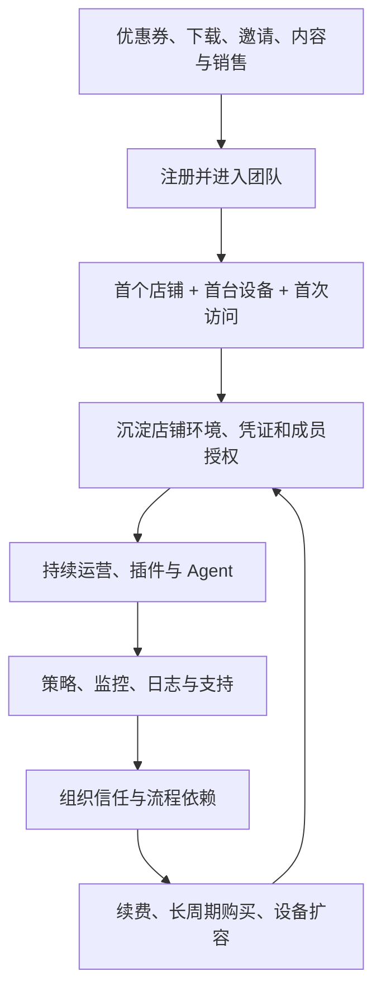
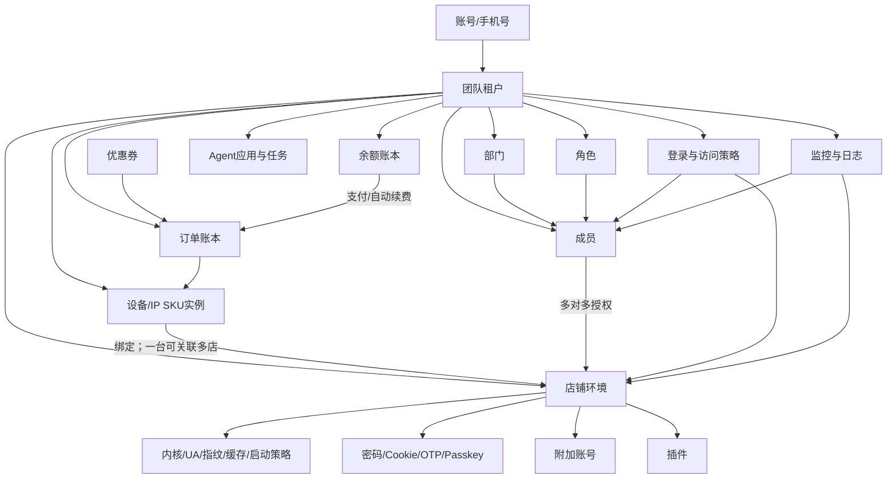
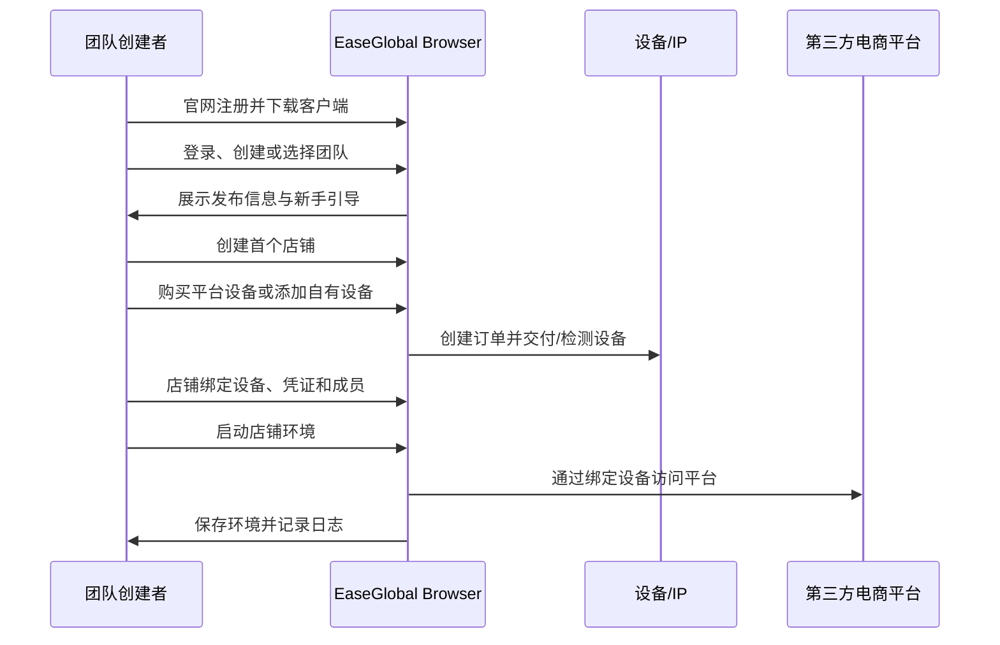

# EaseGlobal Browser 商业需求文档（BRD）

> 产品：EaseGlobal Browser / 网易跨境浏览器  
> 文档性质：已上线产品的商业需求还原与分析，不代表网易内部原始 BRD  
> 版本：V1.0  
> 文档日期：2026-08-14  
> 适用对象：产品负责人、业务负责人、商业化负责人、运营负责人、研发与设计负责人

## 1. 文档目的

本文归纳 EaseGlobal Browser 的商业定位、目标用户、核心业务对象、价值主张、商业闭环、价格机制、业务需求、经营指标与风险边界。

本文用于：

- 理解网易跨境浏览器为什么存在、服务谁、依靠什么形成付费与留存；
- 为后续用户旅程、产品分析、产品架构、产品结构、功能清单、价格清单提供统一商业基线；
- 为后续与 YunLogin 的竞品对比建立统一业务口径；
- 明确当前产品结论、商业判断、未实测边界和待确认问题。

本文不虚构网易的收入、成本、客户规模、转化率、毛利率、内部 KPI 或技术实现。

## 2. 适用边界

- “纯净环境”“安全加密”“不会关联”“全球加速”等产品承诺仍需独立技术测试，不能直接等同于隔离强度、IP 独享性或第三方平台风控结果；
- 地区库存、供应商、促销价、优惠券和折扣会动态变化，本文价格用于还原当前定价逻辑，不构成长期报价承诺；
- 团队席位、店铺数量、插件和 Agent 的独立收费方式尚未确认；
- 设备支付、退款、发票、自动续费扣款、换 IP 和到期注销的完整结果仍需真实业务验收；
- 本文不推测网易内部收入、成本、客户规模、转化率、毛利率、内部 KPI 或技术实现。

## 3. 商业摘要

EaseGlobal Browser 不是单一的“指纹浏览器”，而是一套面向跨境电商团队的店铺运营工作台。产品以**团队**作为租户与权限边界，以**店铺环境**作为业务资产，以**设备/IP**作为访问资源和当前最明确的付费商品，再通过凭证托管、成员授权、安全策略、插件、Agent、监控与日志形成持续使用和组织留存。

其商业闭环可以概括为：


产品的主要商业逻辑是：

1. 以免费注册、客户端下载和新手引导降低进入门槛；
2. 以“店铺必须绑定有效设备才能访问”连接使用价值与付费资源；
3. 以地区、供应商/线路、购买时长和数量组织设备 SKU；
4. 以长周期折扣、免费换 IP 次数、余额和自动续费提高预付与续费概率；
5. 以店铺环境、凭证、授权、策略、插件和日志增加迁移成本与团队黏性；
6. 以 Agent 和自动化能力拓展从“账号安全使用”到“运营效率提升”的价值空间。

团队席位、店铺数量、插件或 Agent 是否形成独立标准收费尚未确认。因此，本 BRD 将**设备/IP 订购与续费**定义为当前明确的商业化主线，其他能力定义为留存、增值或潜在商业化能力。

## 4. 商业背景与机会

### 4.1 目标行业问题

跨境电商团队的日常运营同时面临账号、网络、人员和流程四类复杂性：

- 多平台、多站点、多店铺需要长期稳定的独立登录环境；
- 店铺网络资源来自不同国家、地区和供应商，采购、检测、续期与切换分散；
- 密码、Cookie、OTP、Passkey 和附加账号属于高敏凭证，直接共享会增加泄露风险；
- 成员、部门和岗位不断变化，店铺授权、登录时间和终端范围需要动态治理；
- 登录、页面访问、关键操作和问题排查需要留痕，才能承担责任追溯；
- 运营人员重复执行上架、订单、营销、客服等工作，存在自动化需求；
- 普通浏览器、代理工具、密码表格和团队管理工具分散，切换成本高且缺少统一控制。

### 4.2 商业机会

当“店铺”被抽象成可配置、可授权、可绑定网络、可托管凭证、可审计的数字资产后，产品可以从浏览器工具扩展为团队运营基础设施。

设备/IP 是其中最容易被标准化和按时间收费的资源；店铺环境和团队治理则提高设备资源的持续使用价值。两者组合后，商业机会不只是出售代理，而是把网络资源嵌入店铺工作流，在用户完成建店、授权、凭证托管和审计配置后形成持续续费关系。

### 4.3 产品定位

**产品定位：**面向跨境电商卖家和运营团队的一站式店铺环境、网络设备、团队协作与运营安全工作台。

**不是：**面向任意互联网多账号场景的泛用匿名工具，也不是承诺绕过第三方平台规则的翻墙服务。

**核心价值组合：**

- 店铺环境隔离与浏览器参数管理；
- 全球地区设备/IP 的选择、购买、绑定、换 IP 和续费；
- 密码、Cookie、OTP、Passkey 与附加账号的集中管理；
- 成员、部门、角色、店铺授权和登录控制；
- 访问策略、水印、监控、登录日志和操作日志；
- 插件分发、Agent 应用和自动化能力；
- 余额、订单、优惠券、充值、开票与自动续费。

## 5. 目标市场、用户与决策角色

### 5.1 目标业务场景

| 场景 | 典型规模 | 核心任务 | 主要购买理由 |
|---|---|---|---|
| 跨境电商个人卖家 | 1 人、少量店铺 | 稳定访问单一或多个跨境店铺 | 快速获得适配地区的设备并保存登录环境 |
| 中小运营团队 | 多成员、多平台、多店铺 | 店铺分配、协作、交接和网络资源管理 | 减少共享密码，统一设备、授权与续费 |
| 品牌/精品团队 | 高价值店铺、强安全要求 | 控制账号访问、敏感操作和审计 | 账号保护、策略、监控和最小权限 |
| 店群/矩阵团队 | 大量店铺和重复操作 | 批量建店、批量授权、标签和自动化 | 规模管理、批量处理、插件和 Agent |
| 代运营/多项目组织 | 多部门、多团队、多客户 | 数据隔离、组织分工和责任追踪 | 团队租户、部门、角色、日志和临时授权 |
| 财务与采购 | 多设备、多订单 | 充值、对账、开票、续费和成本控制 | 余额账本、订单明细、卡券和自动续费 |

### 5.2 用户与购买决策角色

| 角色 | 关键目标 | 关键权限/功能 | 商业影响 |
|---|---|---|---|
| BOSS/团队创建者 | 控制团队资产、费用与最高权限 | 团队、成员、设备、店铺、费用、安全策略 | 主要购买和续费决策者 |
| 超级管理员 | 代管组织与全局配置 | 成员、部门、角色、日志、访问策略 | 承担落地和扩容推动 |
| 店铺管理员/运营主管 | 分配店铺与处理日常异常 | 店铺、设备、授权、标签、监控 | 决定产品日常渗透深度 |
| 普通运营成员 | 安全、快速地使用获授权店铺 | 店铺启动、凭证代填、插件、Agent | 决定活跃与留存 |
| 安全/风控负责人 | 降低凭证和误操作风险 | 登录控制、访问策略、水印、监控、日志 | 推动企业治理采购 |
| 财务/采购人员 | 控制充值、订单、发票与续费 | 余额、订单、开票、卡券 | 影响续费效率和客单价 |
| 技术/客服支持 | 定位客户端或店铺问题 | 日志、反馈、临时授权、诊断 | 影响交付成功和服务成本 |

## 6. 用户任务、痛点与商业收益

| 用户任务 | 传统方式的痛点 | EaseGlobal Browser 的产品承接 | 对业务的收益 |
|---|---|---|---|
| 创建多个店铺环境 | 配置分散、浏览器状态混用 | 店铺对象、独立环境、内核/UA/指纹参数 | 降低重复配置与环境混用 |
| 为店铺配置地区网络 | 外部采购、检测和续费割裂 | 平台设备购买、自有设备、检测与绑定 | 缩短从采购到使用的路径 |
| 管理登录凭证 | 密码和验证码在群聊或表格流转 | 密码、Cookie、OTP、Passkey、附加账号托管 | 减少明文共享和交接摩擦 |
| 分配店铺给成员 | 权限过大、离职难回收 | 角色、部门、店铺授权、登录限制 | 支撑最小权限与快速回收 |
| 约束高风险操作 | 依靠培训，缺少系统拦截 | 页面/元素策略、密码/F12/打印限制、水印 | 降低误操作与数据外泄风险 |
| 追踪问题和责任 | 缺少统一记录 | 店铺监控、登录日志、操作日志、访问记录 | 支撑事中发现与事后追溯 |
| 执行重复运营工作 | 人工耗时、步骤不一致 | 插件、Agent 应用、自动化运营 | 提高标准化和执行效率 |
| 管理费用和到期 | 订单、充值、续费分散 | 余额、订单、卡券、自动续费、开票 | 减少设备中断和对账成本 |

## 7. 产品商业模型

### 7.1 收入与价值主线

| 收入/价值类型 | 当前收费方式 | 商业作用 |
|---|---|---|
| 平台设备/IP | 按设备数量与购买时长预付 | 当前最明确的直接收入 |
| 设备续费 | 手动续费或余额自动续费 | 经常性收入和留存 |
| 长周期购买 | 1/3/6/12/24 个月，通常周期越长折扣越深 | 提高预付金额、降低短期流失 |
| 自有设备接入 | 独立收费尚未确认 | 降低迁移门槛，保留用户既有资源 |
| 团队/安全/插件 | 独立价目尚未确认 | 提高付费设备的使用价值和迁移成本 |
| Agent/自动化 | 标准收费尚未确认 | 潜在增值、定制和高阶版本能力 |

### 7.2 增长与留存飞轮



### 7.3 商业关键判断

| 关键判断 | 产品含义 | 待确认问题 |
|---|---|---|
| 设备/IP 是当前主收费资源 | 购买、充值、订单、续费和换 IP 均围绕设备形成闭环 | 其他模块是否存在套餐或额度收费 |
| 店铺是核心使用资产 | 授权、凭证、环境、插件和监控围绕店铺沉淀 | 店铺活跃与长期留存的实际关系 |
| 长周期折扣用于提高预付与留存 | 长周期通常折扣更深，并增加换 IP 权益 | 各周期对续费和现金流的真实贡献 |
| 团队治理提高迁移成本 | 角色、凭证、策略和日志形成组织配置资产 | 不同团队规模的留存差异 |
| Agent 用于扩展效率与客单价值 | Agent 应用与定制需求扩展到运营任务 | 标准场景、成本、SLA 和定价单位 |

## 8. 核心业务对象与关系



### 8.1 对象定义

| 对象 | 商业含义 | 核心规则 |
|---|---|---|
| 账号 | 登录产品的个人身份 | 支持手机号验证码和团队账号密码登录；可属于多个团队 |
| 团队 | 数据、权限和费用的组织边界 | 承载成员、部门、角色、店铺、设备、策略、日志和费用 |
| 店铺 | 可持续运营的隔离浏览器资产 | 配置平台、站点、凭证、设备、成员和浏览器环境；无有效设备不能访问 |
| 设备 | 以地区网络/IP 形式交付的时效资源 | 可平台购买或录入自有代理；有状态、库存、到期、续费和换 IP |
| 成员/角色/部门 | 组织协作与治理对象 | 角色决定功能权限，部门决定数据范围，店铺授权决定可访问对象 |
| 凭证 | 支撑登录的高敏数据集合 | 密码、Cookie、OTP、Passkey 和附加账号用途不同，不能视为同一能力 |
| 策略/日志 | 风险控制和责任追溯层 | 约束登录、页面、元素和敏感操作，并记录访问与操作 |
| 订单/余额/优惠券 | 商业交易对象 | 订单记录业务消费，余额记录资金变化，优惠券影响结算 |
| 插件/Agent | 运营效率扩展对象 | 按团队、店铺或成员分发；Agent 还包含定制需求入口 |

## 9. 核心业务流程

### 9.1 首次价值闭环



首次价值不是“注册成功”，而是**至少一个店铺绑定有效设备并成功启动到目标站点**。因此注册、建店、购设备、绑定和首次访问应作为一条连续激活漏斗管理。

### 9.2 设备购买与续费闭环


已核实的业务约束：

- 地域、地区、供应商/线路共同决定可售 SKU 和月基价；
- 购买时长采用 1、3、6、12、24 个月展示，实际对应 30、90、180、360、720 天；
- 设备购买后通常需要 5-15 分钟配置；
- 页面明确提示购买成功后不支持退款或设备更换；
- 6/12/24 个月分别赠送 1/3/6 次免费更换 IP，次数与设备关联、不能共用；
- 自动续费从余额扣款，并在到期前 1 日执行；
- 到期前 7 天有提醒；到期后可能自动解绑并永久移除，需重新购买和绑定；
- 换 IP 受同供应商、同价资源、剩余额度和权限等条件约束。

## 10. 购买设备价格逻辑

### 10.1 地域目录与覆盖

当前价格目录整理出 9 个地域分组和 74 个不重复地区选择：

| 地域分组 | 地区选择数 | 代表地区 |
|---|---:|---|
| 港澳台 | 2 | 中国香港、中国台湾 |
| 中国大陆 | 16 | 深圳、广州、佛山、福州、杭州、义乌、宁波、武汉、青岛、南京、北京、太原、上海、苏州、成都、嘉兴 |
| 美国 | 12 | 弗吉尼亚、硅谷、洛杉矶、旧金山、圣何塞、拉斯维加斯、西雅图、纽约、华盛顿、达拉斯、芝加哥、夏威夷 |
| 亚太 | 15 | 日本东京/大阪/丰田/札幌/千叶、澳大利亚悉尼、韩国首尔、菲律宾马尼拉、越南河内/胡志明、新加坡、印度尼西亚雅加达、泰国曼谷、马来西亚吉隆坡、澳大利亚 |
| 欧洲 | 12 | 英国伦敦、德国法兰克福/柏林、法国巴黎、意大利罗马/米兰、俄罗斯、波兰华沙、西班牙巴塞罗那/马德里、乌克兰、意大利 |
| 北美 | 4 | 墨西哥、墨西哥城、加拿大、加拿大多伦多 |
| 南美 | 7 | 巴西、萨皮兰加、圣保罗、阿根廷、智利、哥伦比亚、玻利维亚拉巴斯 |
| 中东 | 3 | 阿联酋迪拜、沙特利雅得、伊拉克巴格达 |
| 非洲 | 3 | 埃及开罗、南非约翰内斯堡、莫桑比克马普托 |
| **合计** | **74** | 当前整理结果，不承诺等于实时全量库存 |

“美国”和“北美”在页面中是两个独立业务分组。这是平台的商品目录口径，不是严格地理学分类。

### 10.2 首月成交价档位

在数量为 1、无优惠券抵扣时，主要出现以下档位：

| 月基价 | 首月订单价 | 实际支付比例 | 折扣标签 | 典型资源/地区 |
|---:|---:|---:|---|---|
| ¥69.00 | ¥49.00 | 71.01% | 7.1 折 | 香港腾讯云、深圳阿里云、美国硅谷、英国伦敦、德国法兰克福 |
| ¥79.00 | ¥59.00 | 74.68% | 7.4 折 | 武汉阿里云、青岛同价档 |
| ¥89.00 | ¥69.00 | 77.53% | 7.7/7.8 折 | 宁波移动、佛山/义乌/太原等运营商档 |
| ¥88.00 | ¥74.80 | 85.00% | 8.5 折 | 越南河内/胡志明、墨西哥城等静态住宅档 |
| ¥98.00 | ¥83.30 | 85.00% | 8.5 折 | 中国台湾、美国多数城市、欧洲多数城市、南美/中东/非洲地区 |

中国香港腾讯云月基价 ¥69，购买 12 个月的原价为 ¥828，订单价为 ¥499，折扣标签为 6.0 折。实际支付比例为 `499 ÷ 828 = 60.27%`，并不等于精确的 60.00%。

### 10.3 时长折扣矩阵

| SKU/基价档 | 1 个月 | 3 个月 | 6 个月 | 12 个月 | 24 个月 |
|---|---:|---:|---:|---:|---:|
| 公有云 ¥69 档 | 7.1 折 | 7.0 折 | 6.4 折 | 6.0 折 | 6.0 折 |
| 阿里云 ¥79 档 | 7.4 折 | 7.4 折 | 6.8 折 | 6.5 折 | 6.5 折 |
| 运营商 ¥89 档 | 7.7/7.8 折 | 7.8 折 | 7.4 折 | 6.7 折 | 6.7 折 |
| 静态住宅 ¥88/¥98 档 | 8.5 折 | 8.5 折 | 8.0 折 | 8.0 折 | 7.5 折 |

该矩阵仅代表当前档位组合，不应外推为所有供应商永久使用同一折扣表。¥89 档同时存在 7.7 与 7.8 两种首月标签，说明折扣更可能属于具体 SKU 或促销配置，而不是只按基价统一。

### 10.4 价格计算逻辑

价格计算关系为：

```text
标价金额 = 月基价 × 购买月数 × 设备数量
时长促销小计 = 后台“SKU × 时长”价格矩阵 × 设备数量
若优惠券可叠加：最终应付金额 = 时长促销小计 - 实际抵扣金额
时长优惠 = 标价金额 - 时长促销小计
总优惠 = 标价金额 - 最终应付金额
```

折扣标签更像价格解释标签，不是必须参与结算的精确计算因子。`¥69 × 12 × 6.0 折 = ¥496.80`，但订单价是 ¥499。因此更合理的实现判断是：**后台先维护 SKU 与购买时长对应的实际成交价，前端再用一位小数折扣进行近似展示。**

优惠券入口位于数量之后、订单金额之前。能否与全部时长促销叠加、是否有门槛、是否按设备分摊，仍需通过真实结算或后台规则确认。

### 10.5 地区、供应商与价格的逻辑关系

价格不满足“同一大区一个价格”的简单模型，对应层级为：


归纳结论：

1. **地域决定目录，不直接决定价格。**同一地域内可能同时存在 ¥69、¥79、¥88、¥89、¥98 档。
2. **具体地区决定供应可得性。**例如中国大陆不同城市展示腾讯云、阿里云、移动、联通、电信等不同组合；部分城市出现库存不足和预约提醒。
3. **供应商/线路决定月基价与适配说明。**公有云、运营商、静态住宅和网易自建是不同商品族，不应只用“代理地区”解释价格。
4. **时长决定价格矩阵与换 IP 权益。**长周期通常折扣更深，并增加免费换 IP 次数。
5. **数量按设备扩展。**数量受步进和库存约束；数量阶梯折扣尚未确认。
6. **优惠券属于结算层。**它位于时长价格之后，但叠加规则尚未核实。
7. **¥49 是获客锚点，不是全球统一价格。**首页和热门设备突出中国香港、美国硅谷、日本东京 ¥49/月，而大量静态住宅地区为 ¥83.30/月。

### 10.6 分区域价格特征

| 地域 | 主要成交档位 | 解释 |
|---|---|---|
| 港澳台 | 香港 ¥49/¥69；台湾 ¥83.30/¥98 | 同一分组内因资源类型不同形成明显价差 |
| 中国大陆 | ¥49/¥69、¥59/¥79、¥69/¥89 | 城市与供应商共同决定档位；存在库存不足 |
| 美国 | 硅谷、弗吉尼亚等有 ¥49/¥69；多数城市 ¥83.30/¥98 | 公有云低价入口与静态住宅高价资源并存 |
| 亚太 | ¥49/¥69、¥74.80/¥88、¥83.30/¥98 | 日本、东南亚、澳大利亚内部也存在不同资源档 |
| 欧洲 | 伦敦、法兰克福有 ¥49/¥69；多数地区 ¥83.30/¥98 | 少量公有云锚点，大量静态住宅档 |
| 北美 | 墨西哥城 ¥74.80/¥88；其余地区多为 ¥83.30/¥98 | 地区与静态住宅 SKU 再分层 |
| 南美 | 当前主要为 ¥83.30/¥98 | 未出现低价公有云成交档 |
| 中东 | 当前主要为 ¥83.30/¥98 | 未出现低价公有云成交档 |
| 非洲 | 当前主要为 ¥83.30/¥98 | 未出现低价公有云成交档 |

### 10.7 价格策略推导

以下为商业策略判断，不代表网易内部定价策略：

- 以 ¥49 热门设备作为低门槛入口，降低用户首次购买决策成本；
- 以供应稀缺性、线路类型和供应商成本形成 SKU 基价差，而不是按洲统一加价；
- 以长周期折扣换取预付现金流和更低的短期流失；
- 以免费换 IP 次数降低用户对长周期资源失效的担忧；
- 以不可退款规则和 5-15 分钟配置等待降低库存与交付逆向成本，但也提高首次购买信任门槛；
- 以优惠券、邀请奖励和注册活动推动首购，具体补贴成本与转化效果待内部数据确认。

## 11. 核心商业需求

### 11.1 获客与注册

| 编号 | 商业需求 | 业务目的 | 优先级 |
|---|---|---|---|
| BRD-A01 | 官网应清晰传达店铺环境、网络设备、团队治理和 Agent 四类价值 | 避免产品被理解为单一代理或普通浏览器 | P0 |
| BRD-A02 | 官网、下载页和客户端应保持注册、登录、下载与立即体验入口一致 | 缩短从了解产品到进入平台的路径 | P0 |
| BRD-A03 | 支持手机号验证码注册，并明确协议、隐私与邀请码 | 降低注册门槛并承接推荐增长 | P0 |
| BRD-A04 | 优惠券、热门设备和限时活动应明确适用 SKU、时长与有效期 | 降低价格误解和售后争议 | P0 |
| BRD-A05 | 邀请奖励应可查看规则、进度、奖励状态与异常原因 | 建立可追踪的低成本获客渠道 | P1 |
| BRD-A06 | 销售和客服触达应基于用户同意并可追溯来源 | 兼顾线索转化与隐私合规 | P1 |

### 11.2 激活与首次价值

| 编号 | 商业需求 | 业务目的 | 优先级 |
|---|---|---|---|
| BRD-B01 | 注册后应引导用户完成团队选择、首个店铺、设备和首次启动 | 把激活定义为业务价值而非注册成功 | P0 |
| BRD-B02 | 新手引导应根据当前状态继续，不重复阻断已完成用户 | 降低首次进入平台的干扰 | P0 |
| BRD-B03 | 首页应区分新用户任务和已有店铺用户的最近访问 | 同时服务激活和高频回访 | P0 |
| BRD-B04 | 热门设备应能一键带入地区、SKU 和价格页 | 缩短首次设备购买路径 | P0 |
| BRD-B05 | 店铺未绑定设备、设备库存不足或配置中时，应给出明确下一步 | 降低激活流失和客服成本 | P0 |

### 11.3 店铺资产与凭证

| 编号 | 商业需求 | 业务目的 | 优先级 |
|---|---|---|---|
| BRD-C01 | 店铺应作为平台、站点、环境、设备、成员和凭证的统一业务对象 | 建立长期可管理的运营资产 | P0 |
| BRD-C02 | 支持单个与批量建店、编辑、标签、排序、搜索和筛选 | 支撑从少量到规模化运营 | P0 |
| BRD-C03 | 店铺必须绑定有效设备才能启动，并明确共享设备的关联风险 | 连接产品价值与设备商业化 | P0 |
| BRD-C04 | 密码、Cookie、OTP、Passkey 和附加账号应按不同敏感等级授权 | 降低凭证泄露与越权风险 | P0 |
| BRD-C05 | 店铺删除、转让、清缓存、改内核等不可逆或高风险操作应二次确认 | 防止运营资产误损坏 | P0 |
| BRD-C06 | 店铺转让应明确凭证、Cookie、设备、二步验证和日志的迁移范围 | 支撑组织交接和客户转移 | P1 |

### 11.4 设备商品化与交付

| 编号 | 商业需求 | 业务目的 | 优先级 |
|---|---|---|---|
| BRD-D01 | 设备商品应按地域、地区、供应商/线路、库存、时长和数量组织 | 建立可扩展 SKU 模型 | P0 |
| BRD-D02 | 价格页应同时展示月基价、时长成交价、折扣、优惠额和最终金额 | 让用户理解价格而不是只看到折扣标签 | P0 |
| BRD-D03 | 页面应明确交付时间、可访问范围、不可退款和设备更换规则 | 降低支付争议 | P0 |
| BRD-D04 | 支持平台设备和自有设备，并提供连通性与站点可达性检测 | 承接新购和迁移用户 | P0 |
| BRD-D05 | 支持绑定、解绑、换 IP、到期提醒、手动续费和自动续费 | 完成设备全生命周期 | P0 |
| BRD-D06 | 库存不足应支持预约、到货提醒和替代 SKU 推荐 | 减少有需求但无库存的流失 | P1 |
| BRD-D07 | 换 IP 权益应展示剩余次数、可选范围、继承绑定和失败原因 | 提升长周期购买信心 | P1 |

### 11.5 团队协作与安全治理

| 编号 | 商业需求 | 业务目的 | 优先级 |
|---|---|---|---|
| BRD-E01 | 团队作为店铺、设备、成员、费用和日志的租户边界 | 支撑组织采购和统一治理 | P0 |
| BRD-E02 | 支持成员、部门、角色和店铺授权的组合权限模型 | 满足岗位分工与最小权限 | P0 |
| BRD-E03 | 登录终端、地区、时间和异常登录应可限制或审批 | 降低账号被盗与异地风险 | P0 |
| BRD-E04 | 页面、元素、密码显示、F12、打印和水印应可按对象配置 | 控制高风险操作和数据外泄 | P1 |
| BRD-E05 | 登录日志、操作日志、访问策略命中和店铺监控应可检索与导出 | 支撑审计、复盘和责任追踪 | P1 |
| BRD-E06 | 暂停、删除成员和删除部门时应明确店铺授权的保留或回收结果 | 避免权限残留和文档冲突 | P0 |

### 11.6 插件、Agent 与运营扩展

| 编号 | 商业需求 | 业务目的 | 优先级 |
|---|---|---|---|
| BRD-F01 | 支持 Chrome 商店插件和团队自研插件的安装、更新、禁用与分配 | 扩展运营工具生态 | P1 |
| BRD-F02 | 插件权限应在安装前告知，并支持按团队、店铺或成员收窄 | 控制供应链与数据访问风险 | P1 |
| BRD-F03 | Agent 应以明确的业务场景、输入、输出、权限和运行状态呈现 | 从概念展示转为可用生产力 | P1 |
| BRD-F04 | Agent 定制需求应有提交、受理、评估、报价/排期和结果反馈 | 承接非标准企业需求 | P2 |
| BRD-F05 | Agent 若形成付费，应明确按应用、任务量、执行时长或套餐的计费单位 | 建立可理解的增值商业模式 | P2 |

### 11.7 费用、服务与留存

| 编号 | 商业需求 | 业务目的 | 优先级 |
|---|---|---|---|
| BRD-G01 | 订单账本与余额账本应分离，并能按类型、时间和状态查询 | 支撑财务对账 | P0 |
| BRD-G02 | 支持余额充值、微信/支付宝/对公等渠道及支付状态回查 | 提高支付成功率 | P0 |
| BRD-G03 | 优惠券应展示门槛、适用 SKU、有效期、叠加和使用状态 | 降低促销争议 | P0 |
| BRD-G04 | 自动续费应明确扣款时点、余额不足重试、通知和关闭路径 | 降低非意愿中断 | P0 |
| BRD-G05 | 发票应关联可开票订单、抬头、进度、失败与红冲规则 | 满足企业采购 | P1 |
| BRD-G06 | 反馈、日志和临时授权应形成可追踪工单并支持提前撤销 | 提高问题解决效率并控制高敏授权 | P1 |

## 12. 优先级与阶段目标

| 阶段 | 核心目标 | 必须完成的业务闭环 |
|---|---|---|
| P0：可购买、可使用、可续费 | 让用户稳定完成首个店铺的付费使用 | 注册 → 团队 → 店铺 → 设备购买/添加 → 绑定 → 启动 → 订单/余额 → 到期提醒/续费 |
| P1：可协作、可治理、可扩展 | 让团队把更多店铺和成员迁入平台 | 批量建店、凭证托管、角色授权、登录控制、监控日志、插件、换 IP、发票和工单 |
| P2：可自动化、可增值 | 提升运营效率和高阶客单价值 | Agent 场景化、定制流程、增值计费、自动化运行指标和企业服务 |

## 13. 经营指标体系

### 13.1 北极星与商业主指标

建议采用双指标，而不是只看注册量：

- **产品北极星：周活跃有效店铺数**，即当周至少启动一次且绑定有效设备的店铺数；
- **商业主指标：活跃付费设备数及续费收入**，反映实际付费资源规模和持续性。

一台设备可以绑定多个店铺，因此只看店铺数会高估收入，只看设备数又会忽略使用深度。两者需要联合观察。

### 13.2 漏斗指标

| 阶段 | 建议指标 |
|---|---|
| 获客 | 官网访问、注册按钮点击、注册成功率、下载完成率、活动/邀请来源占比 |
| 激活 | 首次登录率、团队创建/加入率、首店创建率、首设备选择率、首购率、首绑率、首次启动成功率 |
| 时效 | 注册到首店、首店到首设备、支付到交付、交付到首次启动的中位时长 |
| 付费 | 设备付费转化率、首单金额、设备数量、SKU/地区收入结构、优惠券使用率 |
| 预付 | 3/6/12/24 月订单占比、平均预付月数、长周期换 IP 权益使用率 |
| 留存 | 7/30/90 日活跃店铺留存、设备续费率、自动续费开启率、余额不足失败率 |
| 扩张 | 团队成员数、店铺数、设备数、插件数、Agent 使用数的净增长 |
| 安全 | 异常登录、策略命中、越权拦截、凭证暴露和高风险操作事件 |
| 服务 | 设备交付成功率、工单率、临时授权率、平均解决时长、退款/争议率 |

本文没有网易内部基线，不能为以上指标填写真实目标值。正确做法是先取当前 4-8 周基线，再按地域、供应商、团队规模和获客来源分层设目标。

## 14. 依赖与约束

### 14.1 外部依赖

- 云厂商、运营商和静态住宅资源供应商的库存、质量、成本与交付 SLA；
- Amazon、TikTok Shop、TEMU、Shopee、Walmart、Mercado Libre、Coupang 等第三方平台规则变化；
- 短信、支付、对公转账、发票和企业身份服务；
- Chromium 内核、插件商店、操作系统和网络协议兼容性；
- Agent 模型、任务执行环境、第三方系统接口和人工交付能力。

### 14.2 业务约束

- 页面明确不提供翻墙服务，并限制可访问网站范围；
- 设备购买后通常不可退款或直接更换，必须在支付前充分告知；
- 固定 IP、静态住宅、独享和唯一性不能混为同一承诺；
- 店铺、Cookie、密码、OTP、Passkey 和临时授权均涉及高敏数据；
- 一台设备可绑定多个店铺，但同平台多店共享网络可能增加关联风险；
- 产品同时包含网页管理端、客户端和移动端远程能力，版本和权限口径必须一致。

## 15. 风险与应对

| 风险 | 问题表现与影响 | 建议 |
|---|---|---|
| “静态/固定 IP”承诺冲突 | 帮助内容强调地址固定，服务协议又不保证永久不变或唯一 | 统一商品术语，购买页直接展示可变更条件、独享性和 SLA |
| 折扣标签与实际价格不完全等价 | ¥69×12×6 折不等于实际订单价 ¥499 | 以实际成交价为主，折扣标签注明近似值或统一计算规则 |
| 地区库存和供应商波动 | 部分地区库存不足或无法下单 | 增加库存状态、预约、替代地区和交付预期 |
| 不可退款提高首购阻力 | 用户支付前承担资源适配风险 | 提供下单前检测、明确适配范围、有限异常补偿和客服确认 |
| 设备共享引发店铺关联风险 | 系统允许一设备多店，同时给出风险提示 | 按平台和店铺给出风险分级，默认推荐一店一设备 |
| 高敏凭证集中带来安全责任 | 密码、Cookie、OTP、Passkey、附加账号均可托管 | 最小权限、加密、访问审计、导出限制、密钥轮换和泄露响应 |
| 临时授权扩大客服访问边界 | 技术人员可能进入店铺并登录账号 | 明确授权人、范围、时长、录像/日志、禁止动作和随时撤销 |
| 第三方插件供应链风险 | 插件可读取页面、Cookie 或 DOM | 权限告知、签名/来源校验、版本固定、灰度和回滚 |
| 文档与产品版本不一致 | 下载页已到 V2.1.0，公开更新日志停在 2.0.70；旧品牌混用 | 建立随版本发布的文档验收与失效提示 |
| 权限口径冲突 | 暂停成员授权、日志查看人、访问策略管理员范围存在文档冲突 | 用单一权限矩阵驱动产品、文档和测试 |
| 移动网页可用性不足 | 官网移动宽度、导航和注册弹窗存在裁切 | 将官网注册与活动页纳入响应式验收 |
| Agent 商业定位不清 | 有应用、权限提示和定制入口，但标准套餐/计费不明确 | 先明确核心场景、SLA、成本和定价单位，再扩大曝光 |

## 16. 非目标

本 BRD 不承担以下内容：

- 不宣称网易已实现或通过某种底层防关联、安全、加密或合规认证；
- 不推测网易内部收入、成本、毛利、客户量、组织架构和销售政策；
- 不把当前整理的 74 个地区选择写成永久、实时、100% 可售地区；
- 不输出完整逐地区价格清单，完整价格表将在后续《EaseGlobal Browser产品价格清单.md》中交付；
- 不代替后续产品功能清单、用户旅程、产品架构和三类产品结构图；
- 不在本文件中提前完成 YunLogin 竞品对比；
- 不把用户单次操作观察写成平台长期、全用户通用规则。

## 17. 待确认问题

### 17.1 商业与定价

1. 除设备/IP 外，团队席位、店铺数量、插件和 Agent 是否有套餐或隐性额度？
2. SKU 的后台主键由地区、供应商、线路类型、IP 类型和站点适配中的哪些字段组成？
3. 折扣标签是四舍五入、截断还是人工配置？为什么 12 个月 ¥499 显示 6.0 折？
4. 优惠券能否与时长促销叠加，是否按订单、设备或 SKU 分摊？
5. 数量增加是否有批量折扣、企业报价或库存锁定？
6. 不可退款规则在交付失败、IP 不可用、供应商故障时有哪些例外？
7. 长周期换 IP 次数用尽后的价格、可选范围和继承时长如何计算？

### 17.2 激活与留存

1. 新用户的核心激活事件在内部定义为什么：首店、首购、首绑还是首次站点访问？
2. 设备支付到交付的 5-15 分钟承诺是否有分地区 SLA 和失败补偿？
3. 自动续费余额不足后重试几次，是否有宽限期和多渠道通知？
4. 设备到期永久移除前是否允许短期恢复，原 IP 或绑定关系能否保留？
5. 热门设备 ¥49 对首购转化、后续扩容和地区迁移的实际贡献是多少？

### 17.3 安全与权限

1. BOSS、超级管理员、团队管理员的最终权限矩阵和不可越过边界是什么？
2. 凭证分别如何加密、授权、导出、轮换和审计？
3. 临时授权期间技术人员可见和可执行的动作有哪些，是否全程留痕？
4. 店铺监控、登录日志和操作日志的保留期、导出和删除规则是什么？
5. 一设备多店的推荐上限和风险提示是否应按平台动态配置？

### 17.4 Agent 与增值能力

1. Agent 当前可正式使用的应用、成功标准、运行限制和权限范围是什么？
2. “暂无权限/限时免费优先体验”对应什么套餐、白名单或商业阶段？
3. Agent 定制是标准产品需求收集、项目制交付还是付费企业服务？
4. Agent 的任务失败、人工接管、数据边界、审计与成本控制如何设计？

## 18. BRD 验收标准

后续产品方案应至少满足以下商业验收：

1. 用户能从官网注册并完成客户端首次登录，不因活动弹窗或引导阻断核心流程；
2. 用户能在一个连续流程内完成首店、首设备、绑定和首次启动；
3. 购买页能解释地域、地区、供应商、月基价、时长成交价、优惠和最终金额；
4. 支付前明确库存、适配、交付、不可退款、换 IP 和到期规则；
5. 设备从购买、自有接入、检测、绑定、换 IP、提醒、续费到到期均有可追踪状态；
6. 店铺、成员、角色、部门、凭证和策略之间的权限结果可预测、可审计；
7. 订单、余额、优惠券、自动续费和发票能完成企业对账闭环；
8. 插件、Agent 和临时授权的高敏权限有明确告知、收窄和撤销能力；
9. 产品、官网、帮助中心和更新日志使用统一品牌、版本和规则口径；
10. 核心漏斗、设备收入、长周期占比、续费、交付与安全指标可被埋点和分层分析。

**文档结论：**EaseGlobal Browser 的商业核心不是单独出售“浏览器”或“代理”，而是用店铺环境承载账号资产，用设备/IP 建立时效付费，用团队、安全与自动化提升持续使用价值。当前最需要统一的是价格计算口径、设备承诺、权限规则和 Agent 商业边界；这些问题直接影响首购信任、续费稳定性和企业化扩张。
