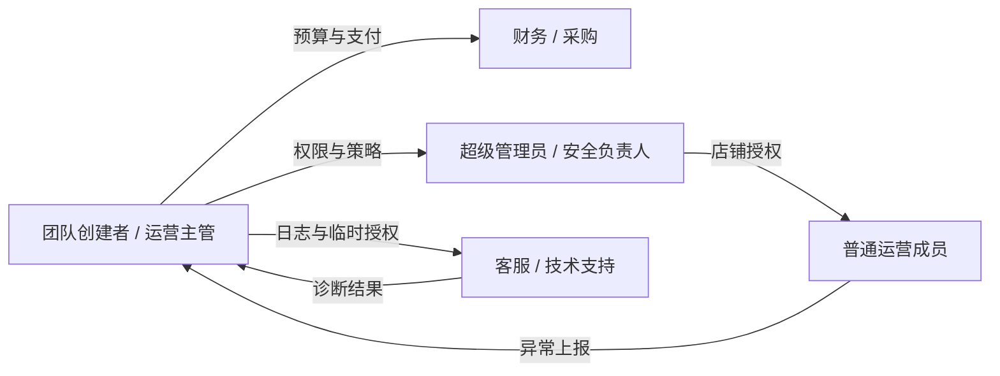
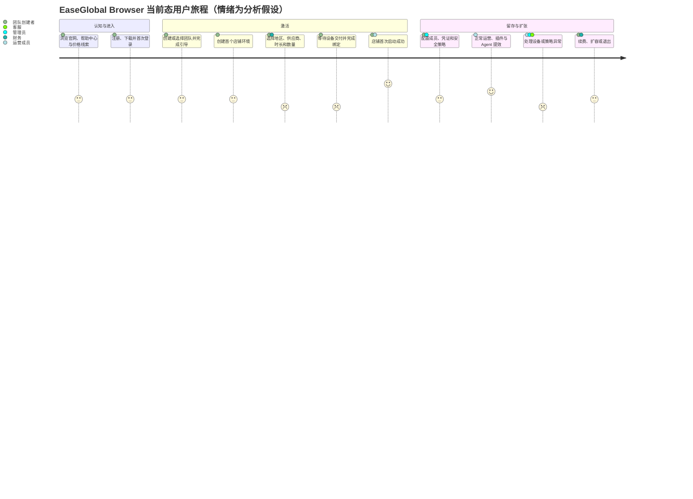
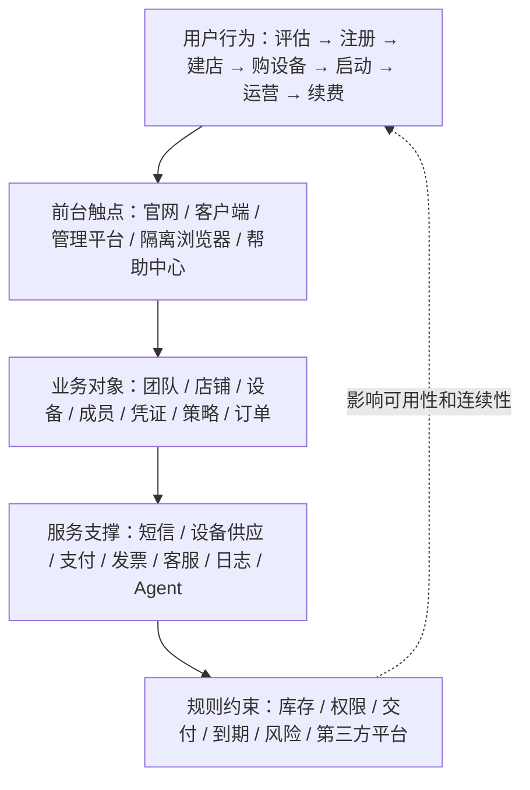

# EaseGlobal Browser 用户旅程图

> 产品：EaseGlobal Browser / 网易跨境浏览器  
> 旅程类型：当前态端到端用户旅程  
> 主角色：中小跨境电商团队的团队创建者 / 运营主管  
> 文档版本：V1.0  
> 文档日期：2026-08-14

## 1. 文档目的

本文梳理用户从了解 EaseGlobal Browser 到持续运营、续费扩容及退出的完整旅程。

本文重点回答：

1. 用户在每个阶段想完成什么；
2. 用户需要经过哪些页面、对象和角色；
3. 每个阶段的当前产品表现、主要痛点和机会；
4. 哪些体验结论仍需真实用户和业务数据验证；
5. 哪些断点直接影响首次价值、付费转化、业务连续性和组织留存。

本文不是用户访谈报告，也不代表网易内部已经定义的旅程、指标或情绪评分。

## 2. 使用边界

- 当前未纳入真实用户访谈、可用性测试、NPS、满意度或行为分析数据；
- 情绪分值是基于任务复杂度和流程风险的分析假设，不是用户评分；
- 真实支付、退款、发票、自动续费扣款、换 IP 和到期注销仍需完整业务验收；
- “纯净环境”“固定 IP”“防关联”等产品承诺仍需底层技术验证；
- 地区、库存、价格和促销会动态变化，不能视为永久规则。

## 3. 角色模型

### 3.1 主角色

本旅程不把购买者、管理员、普通运营和财务虚构成同一个人。为了保留端到端连续性，主路径选择最可能跨越全部阶段的行为角色：

**中小跨境电商团队的团队创建者 / 运营主管**

| 维度 | 行为特征 |
|---|---|
| 核心任务 | 让目标店铺尽快获得可用环境和有效设备，并在后续运营中保持人员、凭证、网络和费用可控 |
| 决策范围 | 产品选型、团队创建、店铺配置、设备选择、成员授权、异常处理和续费协调 |
| 成功标准 | 有效设备成功绑定店铺并完成首次启动；之后店铺可以稳定运营且到期不中断 |
| 主要风险 | 买错地区或资源、设备不可用、不可退款、权限泄露、店铺关联、到期中断和高敏凭证暴露 |
| 建模性质 | 基于产品对象和业务流程建立的角色原型，不是经过访谈验证的研究 Persona |

本文不补充年龄、性别、收入、城市等未经用户研究验证的人口统计特征。

### 3.2 协作角色与交接

| 协作角色 | 主要进入阶段 | 核心诉求 | 与主角色的交接 |
|---|---|---|---|
| 普通运营成员 | 团队协作、日常运营 | 快速进入获授权店铺，不接触不必要的密码和配置 | 接收店铺授权并完成实际运营 |
| 超级管理员 / 安全负责人 | 团队搭建、安全治理、异常处理 | 最小权限、异常拦截、敏感操作留痕 | 接管权限模板、策略和审计配置 |
| 财务 / 采购 | 设备购买、充值、续费、开票 | 金额透明、支付成功、账目可追溯、避免业务中断 | 确认预算、充值、支付和续费 |
| 客服 / 技术支持 | 交付异常、网络或客户端故障 | 获得足够诊断信息，同时限制对店铺和凭证的访问 | 通过日志、反馈或可撤销临时授权介入 |

## 4. 用户旅程总览图

可编辑渲染源：[EaseGlobal Browser 用户旅程图-渲染源.html](./assets/EaseGlobal%20Browser用户旅程图-渲染源.html)。

### 4.1 情绪变化说明

情绪低点集中在设备选择和支付后交付阶段；首次启动成功是最明确的价值跃迁。日常运营不是稳定的高分阶段：正常使用时效率较高，但设备失效、并发、策略拦截或客户端异常会使体验迅速下滑。

## 5. 当前态端到端旅程矩阵

| 阶段 | 用户目标 | 主要行为 | 核心触点 | 情绪假设 | 主要痛点 | 产品机会 | 建议指标 |
|---|---|---|---|---|---|---|---|
| 1. 认知与评估 | 判断产品是否适合自己的平台、地区和团队 | 浏览官网、功能、帮助中心、优惠和价格线索；咨询客服 | 官网、活动横幅、注册弹窗、下载、帮助中心、客服二维码 | 3/5，中性评估 | 价值承诺和服务边界分散；正式价格需进入购买页；官网移动端裁切和弹窗可能干扰阅读 | 以平台、地区和团队规模组织方案；公开价格样例、设备承诺和风险边界 | 官网到注册点击率、帮助中心到下载率、咨询率、移动端退出率 |
| 2. 注册、下载与首次登录 | 顺利获得账号并进入客户端 | 手机注册、短信验证、下载、安装、客户端登录 | 注册弹窗、短信、下载页、安装包、客户端登录页 | 3/5，存在跨端摩擦 | 网页注册、下载安装、客户端登录是多个触点；验证码或安装失败会中断 | 注册后展示连续任务和进度；提供平台匹配的安装诊断 | 注册成功率、下载完成率、安装成功率、首次登录率、注册到登录时长 |
| 3. 团队进入与新手引导 | 明确当前团队和最短下一步 | 创建或选择团队，查看发布弹窗、功能介绍和首页任务 | 团队选择、发布信息、新手引导、首页、热门设备 | 3/5，信息较多 | 多类弹窗和功能引导可能叠加；只介绍功能不等于完成业务激活 | 使用状态型任务清单串联建店、设备、绑定和启动；已完成步骤不重复 | 团队创建/加入率、引导完成率、跳过率、下一步点击率 |
| 4. 创建店铺环境 | 建立可持续运营的店铺资产 | 选择平台/站点，填写名称，配置环境、凭证、成员；或批量导入 | 店铺列表、新增/批量新增、环境配置、凭证和授权 | 3/5，认知负担上升 | 店铺、环境、凭证、设备和成员概念密集；建店成功仍可能不可启动 | 分离最小建店与高级配置；实时显示缺失条件和配置影响 | 首店创建率、创建成功率、字段报错率、创建耗时、导入错误率 |
| 5. 选择并购买/添加设备 | 获得目标地区和平台适配的网络资源 | 选择地域、地区、供应商/线路、时长、数量、优惠券并支付；或录入自有代理并检测 | 购买设备、库存、价格明细、优惠券、协议、支付、设备检测 | 2/5，决策低点 | SKU 复杂、库存动态、折扣非精确因子；不可退款提高首购风险；适配和独享边界不充分 | 提供平台/站点推荐、价格拆解、库存替代、下单前检测和清晰条款 | SKU 选择完成率、库存满足率、首购转化率、支付成功率、弃单位置 |
| 6. 交付、绑定与首次启动 | 让首个店铺成功访问目标站点 | 等待约 5-15 分钟交付，查看设备状态，绑定店铺并首次启动 | 订单状态、设备列表、绑定弹窗、店铺启动、隔离浏览器窗口 | 等待 2/5 → 成功 5/5 | 支付成功不等于业务可用；等待过程不确定；绑定失败或站点不可达会卡住激活；多店共享设备有风险 | 用统一激活进度展示交付、检测、绑定、启动；失败给出明确恢复动作 | 支付到交付时长、交付成功率、绑定成功率、首次启动成功率、注册到首次价值时长 |
| 7. 团队协作与安全配置 | 让成员以最小权限使用店铺 | 邀请成员，设置部门、角色、店铺授权、凭证、登录控制、访问策略、水印和插件 | 成员、部门、角色、店铺授权、凭证、策略、插件 | 3/5，规则复杂 | 角色、数据范围、对象授权和策略叠加后结果难预测；权限口径存在冲突 | 提供最终权限预览、岗位模板、高敏凭证分级和变更影响说明 | 邀请激活率、授权完成率、权限拒绝率、配置回退率、高敏权限数量 |
| 8. 日常运营与异常处理 | 稳定、高效地运营多个店铺 | 启动最近店铺，使用凭证、插件或 Agent；处理设备、并发、策略和客户端异常；查看日志并反馈 | 首页、店铺列表、浏览器窗口、插件、Agent、监控日志、反馈、客服、临时授权 | 正常 4/5 → 异常 2/5 | 异常来源分散；普通成员不易判断责任方；插件、Agent 和临时授权涉及高敏数据 | 建立统一诊断中心；提示责任角色和恢复动作；限制临时授权范围和时长 | 周活跃有效店铺、启动成功率、异常率、自助解决率、工单率、平均解决时长 |
| 9. 续费、扩容与退出 | 保持业务连续并控制长期成本 | 查看到期提醒，充值、手动/自动续费、换 IP、增购设备、开票；退出时回收权限和资产 | 到期提醒、余额、订单、续费、优惠券、发票、成员和店铺管理 | 3/5，担心中断 | 自动续费依赖余额；失败重试和宽限期不清；到期后可能解绑并移除；退出时凭证和权限回收复杂 | 多渠道提醒、余额预测、失败重试、到期影响预览和离场检查清单 | 续费率、自动续费开启率、扣款失败率、到期中断率、平均预付月数、设备净增 |

## 6. 分阶段详细旅程

### 6.1 阶段一：认知与评估

**进入状态：**用户存在多店铺环境、地区网络、团队协作或自动化需求，但尚未确认产品是否匹配。

**行为路径：**

1. 从官网、活动、邀请或搜索进入产品；
2. 浏览核心功能、AI 功能、品牌动态和帮助中心；
3. 查看下载入口、优惠券、热门设备或咨询二维码；
4. 判断支持的平台、地区、设备类型和团队能力；
5. 进入注册或离开。

**当前表现与旅程判断：**

- 产品提供首页、核心功能、AI、下载、帮助、活动、注册和购买咨询入口；
- 官网移动端尚未形成完整响应式布局，导航和注册弹窗可能越界；
- 用户此时更关心平台适配、地区资源、成本和风险，而不是功能数量；
- 各内容入口的真实转化和离开原因尚待行为数据确认。

**退出标准：**用户相信产品大概率能覆盖目标平台、地区和团队场景，并愿意注册或咨询。

### 6.2 阶段二：注册、下载与首次登录

**进入状态：**用户已经产生尝试意愿，但尚未进入管理平台。

**行为路径：**

1. 输入手机号和短信验证码并同意协议；
2. 可选填写邀请码；
3. 下载与操作系统匹配的客户端；
4. 完成安装并在客户端再次登录；
5. 进入团队选择或产品首页。

**当前表现与旅程判断：**

- 注册表单校验手机号、6 位验证码和协议勾选；邀请码可展开并校验有效性；
- 产品提供 Windows 和 Mac 安装指导，部分安装指导包含降低系统安全限制的操作；
- 短信频控与注册后人工客服触达是否为稳定机制尚未确认；
- 网页注册到客户端登录之间缺少持续进度，容易放大流失；
- 短信送达率、安装失败率和注册后销售触达比例尚待业务数据确认。

**退出标准：**账号可用、客户端安装完成，用户首次进入平台。

### 6.3 阶段三：团队进入与新手引导

**进入状态：**用户已登录，但尚未明确团队、资产和下一步任务。

**行为路径：**

1. 创建团队、选择已有团队或接受邀请；
2. 查看版本发布、功能引导或新手引导；
3. 进入首页，查看新用户任务或热门设备；
4. 决定先建店还是先购买设备。

**当前表现与旅程判断：**

- 产品提供团队切换、新手引导、更新提示、首页引导和热门设备入口；
- 产品介绍、发布信息和业务任务同时出现时会争夺用户注意力；
- 激活任务应围绕“店铺可成功启动”，而不是围绕“看完引导”；
- 用户选择“先建店”或“先购设备”的实际比例尚待验证。

**退出标准：**用户知道自己所在团队，并进入首店与首设备的连续任务。

### 6.4 阶段四：创建店铺环境

**进入状态：**用户已进入团队，准备把业务店铺变成平台可管理资产。

**行为路径：**

1. 单个新增或批量新增店铺；
2. 选择平台、站点并填写店铺基本信息；
3. 配置内核、UA、指纹、缓存、启动页和其他环境参数；
4. 按需要添加密码、Cookie、OTP、Passkey 或附加账号；
5. 选择授权成员或稍后配置；
6. 保存店铺并返回列表。

**当前表现与旅程判断：**

- 店铺聚合平台、站点、环境、设备、成员、凭证、插件和监控；
- 支持单个与批量新增、编辑、标签、排序、筛选、转让和删除；
- 店铺没有绑定有效设备时不能完成实际启动；
- 完成“新增店铺”不等于完成“可用店铺”，产品需显式显示缺失条件；
- 不同平台所需的最小环境字段和默认值有效性仍需专项验证。

**退出标准：**店铺对象创建成功，关键配置有效，待绑定设备或已满足设备条件。

### 6.5 阶段五：选择并购买或添加设备

**进入状态：**用户已有目标店铺和地区，需要获得可用网络资源。

**行为路径：**

1. 选择平台设备或自有设备；
2. 平台设备依次选择地域、地区、供应商/线路、时长和数量；
3. 查看月基价、时长成交价、折扣、库存、换 IP 权益和订单金额；
4. 选择优惠券并完成支付，或充值后用余额支付；
5. 自有设备填写协议、主机、端口、账号等信息并检测连通性。

**当前表现与旅程判断：**

- 设备商品按地域、地区、供应商/线路、时长、数量和优惠券组织；
- 部分地区会出现库存不足；长周期通常折扣更深，并增加免费换 IP 次数；
- 折扣标签是近似解释，不能稳定复算实际成交价；
- 已售设备通常不支持退款或直接更换；
- 库存、适配、不退款和价格不透明共同构成全旅程最强决策摩擦；
- 优惠券叠加、批量折扣、退款例外和支付失败恢复尚需真实交易验证。

**退出标准：**平台设备订单已支付或自有设备检测通过，资源进入交付或可绑定状态。

### 6.6 阶段六：交付、绑定与首次启动

**进入状态：**用户已经选择资源，但店铺尚未产生实际业务价值。

**行为路径：**

1. 查看订单或设备配置状态；
2. 等待约 5-15 分钟完成设备交付；
3. 检查设备可用性、地区、到期时间和站点访问能力；
4. 将设备绑定到目标店铺；
5. 启动店铺环境并完成目标平台登录；
6. 确认首页或店铺列表可再次进入。

**当前表现与旅程判断：**

- 平台设备购买后需要约 5-15 分钟配置；
- 设备支持绑定多个店铺，但同平台多店共享网络存在关联风险；
- 店铺启动依赖有效设备；
- 真正的首次价值应定义为“有效设备绑定店铺并成功启动”，而不是注册、建店或支付成功；
- 交付成功率、站点可达率、失败补偿和 SLA 尚需真实业务验证。

**退出标准：**首个店铺通过有效设备成功启动，用户第一次获得完整产品价值。

### 6.7 阶段七：团队协作与安全配置

**进入状态：**主角色已跑通个人路径，需要让团队在可控权限下协作。

**行为路径：**

1. 邀请成员并设置状态；
2. 创建部门和角色，配置数据范围；
3. 授权店铺、附加账号和敏感凭证；
4. 配置登录终端、地区、时间和审批；
5. 设置访问策略、水印、密码显示、开发者工具和打印限制；
6. 安装并分配插件；
7. 查看最终成员使用结果。

**当前表现与旅程判断：**

- 团队、部门、角色、成员、店铺授权和动态策略共同决定权限；
- 暂停成员授权、日志查看人和访问策略管理员范围存在规则口径冲突；
- Cookie、OTP、Passkey、密码、附加账号和临时授权均属于高敏能力；
- 用户最需要的不是更多权限开关，而是“这个成员最终能做什么”的结果预览；
- 权限合并算法、凭证加密方式和日志保留期仍需内部确认与技术验证。

**退出标准：**成员只看到并能操作被授权的店铺和能力，关键动作可追溯。

### 6.8 阶段八：日常运营与异常处理

**进入状态：**店铺、设备和成员已配置，产品进入高频使用阶段。

**行为路径：**

1. 从首页最近使用或店铺列表启动店铺；
2. 使用密码代填、OTP、Passkey 或附加账号；
3. 使用团队插件或 Agent 执行运营任务；
4. 处理设备不可用、并发、策略拦截、客户端和第三方站点异常；
5. 查看登录日志、操作日志、店铺监控和访问记录；
6. 提交反馈、上传日志或给予限时临时授权；
7. 恢复业务并记录处理结果。

**当前表现与旅程判断：**

- 首页、店铺列表、插件、Agent、日志、反馈、客服和临时授权共同承接日常运营；
- Agent 提供应用入口、权限提示和定制需求，但标准可用范围和计费尚不明确；
- 异常来源跨越设备、权限、并发、客户端和第三方站点，普通成员难以自行判断责任方；
- 正常运营和异常处理的情绪差异很大，不能用单一满意度描述这一阶段；
- 插件与 Agent 的任务成功率、客服临时授权实际范围仍需验证。

**退出标准：**日常任务完成；异常时能够明确责任方、恢复动作和审计记录。

### 6.9 阶段九：续费、扩容与退出

**进入状态：**设备即将到期、团队规模变化，或业务准备停止使用。

**行为路径：**

1. 接收到期提醒并查看影响店铺；
2. 充值余额，选择手动续费或开启自动续费；
3. 根据地区、店铺或成员增长增购设备；
4. 按权益与条件更换 IP；
5. 查询订单、余额和优惠券并申请发票；
6. 停用时回收成员、凭证、店铺、设备和临时授权；
7. 确认数据、日志和费用处理结果。

**当前表现与旅程判断：**

- 到期前 7 天进行提醒，自动续费在到期前 1 日从余额扣款；
- 到期后设备可能自动解绑并永久移除，需要重新购买和绑定；
- 余额、订单、优惠券、充值、发票和自动续费构成费用闭环；
- 续费是“避免业务中断”的连续性决策，不只是价格决策；
- 余额不足重试、宽限期、原 IP 恢复、退出数据导出和删除结果仍需确认。

**退出标准：**续费后业务连续，扩容后资源可用；或退出后权限、凭证、设备和费用均完成闭环。

## 7. 关键时刻与断点优先级

| 优先级 | 关键时刻 / 断点 | 用户影响 | 商业影响 | 建议动作 |
|---|---|---|---|---|
| P0 | 注册、建店、购设备、绑定和启动分散在多个模块 | 注册后仍可能得不到实际价值 | 激活率和首购转化受损 | 建立跨模块激活状态机，以“成功首启”为统一终点 |
| P0 | 首购同时承担库存、适配、价格和不可退款风险 | 用户难以判断是否值得支付 | 弃单、咨询和争议增加 | 下单前检测；透明展示 SKU、成交价、交付、退款例外和替代资源 |
| P0 | 支付成功到设备可用之间存在约 5-15 分钟等待 | 用户不知道是否需要继续操作 | 重复操作、客服咨询和交付争议 | 展示实时状态、预计完成时间、失败原因和补救路径 |
| P0 | 到期或余额不足可能导致解绑和业务中断 | 店铺无法继续运营，恢复成本高 | 续费收入和客户信任受损 | 到期影响预览、多渠道提醒、余额预测、失败重试和宽限策略 |
| P0 | 权限组合结果难预测且存在冲突 | 可能越权、误封或暴露凭证 | 企业客户安全风险和服务成本上升 | 建立单一权限矩阵和最终权限预览，统一产品、文档与测试规则源 |
| P1 | 一台设备可绑定多个店铺，但同平台共享存在关联风险 | 用户可能为节省成本选择高风险配置 | 风险事件反向伤害产品信任 | 默认推荐一店一设备，批量绑定前按平台提示并二次确认 |
| P1 | 异常分散在设备、策略、并发、客户端和第三方站点 | 普通成员无法判断如何恢复 | 自助解决率低，客服成本高 | 统一诊断码、责任角色和恢复动作，支持安全的远程协助 |
| P1 | Cookie、OTP、Passkey、插件和临时授权的安全口径不一致 | 高敏数据的可见范围难理解 | 阻碍企业采购和规模使用 | 敏感能力分级告知、最小授权、审计、到期和一键撤销 |
| P2 | Agent 的场景、权限、成功标准和计费边界不清 | 用户难以建立稳定预期 | 难形成可信增值购买理由 | 先聚焦可量化任务，再定义 SLA、人工接管和计费单位 |

## 8. 关键价值时刻

### 8.1 决策时刻：设备 SKU 选择

用户必须把业务需求翻译为地域、地区、供应商/线路、时长和数量。页面可见五类主要首月成交档位，但价格并非按大区简单分层。用户如果不能理解 SKU、库存、适配、交付和退款边界，就会在支付前停止。

### 8.2 首次价值时刻：有效设备绑定后成功启动

注册、下载、建店和支付都只是前置动作。只有店铺通过有效设备成功启动并能够访问目标平台，用户才第一次获得端到端价值。这一事件应成为激活漏斗的统一终点。

### 8.3 留存时刻：组织资产被持续管理

店铺环境、凭证、成员授权、设备、策略、插件、日志和费用逐步沉淀后，产品从单次代理采购变成日常运营基础设施。续费价值来自业务连续性与组织治理，而不只是折扣。

## 9. 前台触点与服务依赖

这不是技术架构图。它只说明用户体验跨越多个前台触点，并受到商品、权限、交付、费用和服务规则共同影响。

## 10. 包容性与可访问性检查

| 场景 | 当前表现或未测边界 | 风险判断 | 建议 |
|---|---|---|---|
| 移动端官网注册 | 390×844 视口仍保持约 1250px 页面宽度，导航和 850px 注册弹窗越界 | 用户可能无法完成注册或关闭弹窗 | 建立真正响应式布局；弹窗宽度受视口约束；保证触控和关闭路径可达 |
| 短信验证 | 注册和登录依赖手机号与验证码 | 收不到短信、异地号码或辅助设备用户会被阻断 | 提供明确倒计时、重试、错误原因和替代验证/人工恢复路径 |
| 信息密度 | 店铺环境、设备 SKU 和权限页面字段较多 | 低经验用户容易误配 | 分层展示基础/高级配置；提供示例、默认值和即时影响说明 |
| 颜色与状态 | 尚未完成色觉、对比度和屏幕阅读器测试 | 若只依赖颜色表达库存、错误或权限，信息可能丢失 | 颜色之外同时使用文字、图标和状态标签，检查对比度 |
| 键盘操作 | 尚未完成全流程键盘和焦点顺序测试 | 复杂弹窗、下拉框和表格可能不可达 | 对注册、建店、购买、授权和续费执行键盘专项验收 |
| 安装指导 | Mac/Windows 安装指导包含系统安全设置操作 | 低技术用户可能误解风险或无法恢复设置 | 明确风险、适用条件和恢复步骤；提供签名、版本与安装诊断 |

## 11. 旅程指标体系

### 11.1 核心价值指标

- **建议激活事件：**首个店铺绑定有效设备并成功启动；
- **产品北极星：**周活跃有效店铺数；
- **商业主指标：**活跃付费设备数及续费收入。

以上均为产品分析建议，不是网易已确认的内部指标。

### 11.2 阶段指标

| 阶段 | 核心指标 | 诊断指标 |
|---|---|---|
| 认知评估 | 官网到注册/下载转化率 | 功能页到帮助中心、咨询率、移动端退出率 |
| 注册登录 | 首次登录率 | 短信成功率、下载完成率、安装失败率、注册到登录时长 |
| 团队引导 | 团队创建/加入率 | 引导完成/跳过、下一步点击、重复弹窗率 |
| 创建店铺 | 首店创建率 | 表单报错、创建耗时、批量导入错误率 |
| 设备选购 | 首购转化率 | SKU 选择完成、库存满足、弃单位置、支付失败率 |
| 交付首启 | 首次启动成功率 | 支付到交付、绑定失败、站点不可达、注册到首次价值时长 |
| 团队安全 | 成员授权完成率 | 邀请激活、权限拒绝、配置回退、高敏权限数量 |
| 日常运营 | 周活跃有效店铺 | 启动成功、异常率、自助解决、工单率、解决时长 |
| 续费退出 | 设备续费率 | 自动续费开启、扣款失败、到期中断、平均预付月数、净增设备 |

本文没有内部数据基线，因此不填写虚构目标值。应先收集 4-8 周数据，再按地域、供应商、团队规模和获客来源分层设定目标。

## 12. 后续研究验证计划

### 12.1 需要验证的核心问题

1. 用户如何决定“先建店”还是“先购设备”；
2. 用户是否理解地区、供应商/线路、IP 类型、月基价和时长成交价；
3. 不可退款、交付等待和库存如何影响首购；
4. 用户如何理解角色、店铺授权、凭证授权和策略叠加；
5. 普通运营成员遇到异常时能否判断原因和责任人；
6. 到期提醒和自动续费能否真正避免业务中断。

### 12.2 建议的形成性研究

| 方法 | 建议样本 | 核心任务 | 产出 |
|---|---:|---|---|
| 主角色访谈 + 可用性测试 | 6-8 名团队创建者/运营主管 | 从注册到首店、首设备、绑定和首次启动 | 任务完成、时间、错误、信心和关键误解 |
| 协作角色测试 | 3-5 名普通运营成员 | 接受邀请、找到店铺、启动、处理授权或设备异常 | 权限理解、异常恢复和求助路径 |
| 管理与安全访谈 | 3-5 名管理员/安全负责人 | 设计角色、授权敏感凭证、查看日志并回收权限 | 权限心智模型和治理风险 |
| 财务/采购访谈 | 3-5 名财务或采购角色 | 理解价格、充值、支付、续费和发票 | 价格信任、对账和连续性需求 |

样本数用于形成性研究和发现主要可用性问题，不用于统计推断。正式量化结论仍需更大样本和真实行为数据。

## 13. 结论

EaseGlobal Browser 的用户旅程不是“注册后打开一个浏览器”，而是跨越**团队、店铺、设备、成员、凭证、策略和费用**的组织级任务链。

当前旅程的三个核心判断是：

1. **最大决策摩擦在设备选购。**地区、供应商、库存、时长、价格和不可退款共同影响首购信任；
2. **首次价值发生在成功首启。**只有有效设备绑定店铺并成功启动，前序注册、建店和支付才真正转化为业务价值；
3. **长期留存来自业务连续性和组织治理。**权限、凭证、日志、插件、Agent、余额与续费共同决定产品能否从工具变成运营基础设施。
