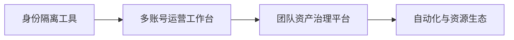
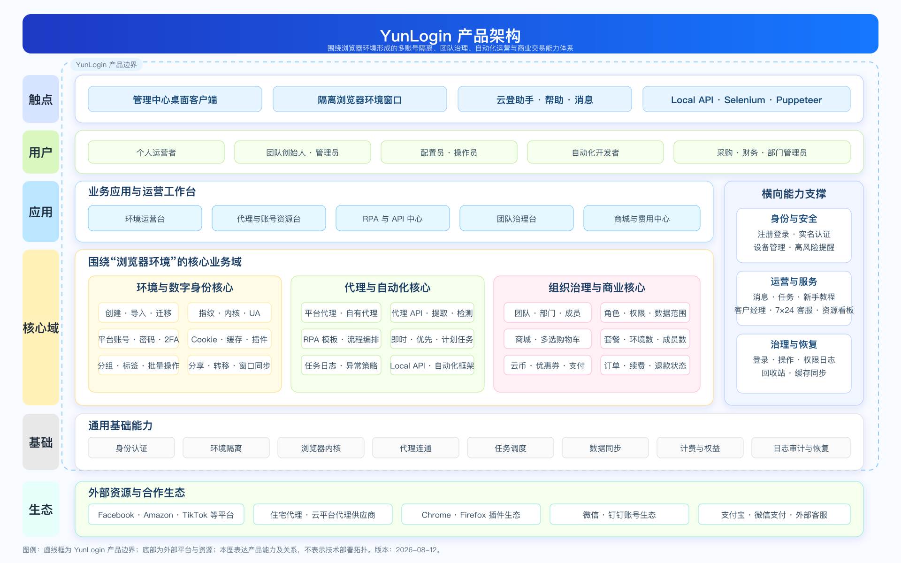
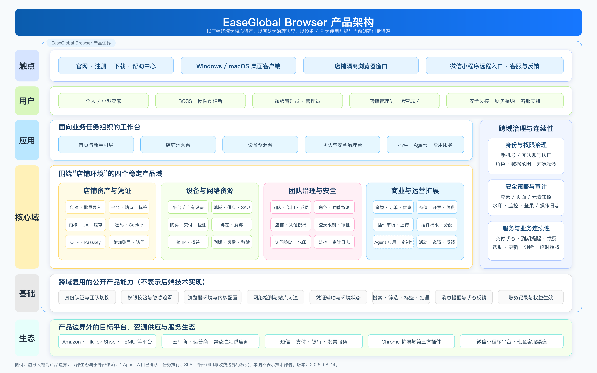
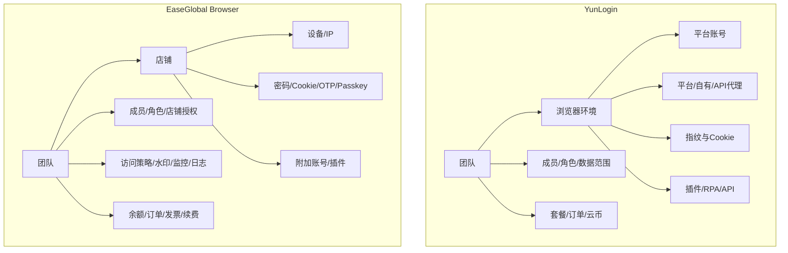
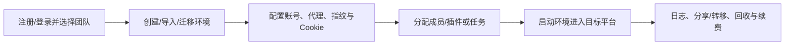
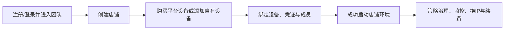

# YunLogin 与 EaseGlobal Browser 竞品分析报告

> 报告日期：2026-08-14  
> YunLogin 证据快照：2026-08-12  
> EaseGlobal Browser 证据快照：2026-08-14  
> 服务对象：管理层、产品规划、销售竞争支持  
> 决策问题：两者核心竞争关系是什么；各自在什么客户情境更有说服力；价格能否直接比较；YunLogin 应建立什么差异化  
> 非报告范围：市场份额、公司收入、融资、真实封禁率、真实网络质量、安全技术审计、版本排期  
> 配套附件：[YunLogin 与 EaseGlobal Browser 竞品对比矩阵.xlsx](./outputs/404447cb-7229-43b6-bc52-4577d5de3e06/YunLogin与EaseGlobal Browser竞品对比矩阵.xlsx)

## 0. 结论先行

YunLogin 与 EaseGlobal Browser 属于直接竞争集合，但不能把两者简化为“同一种指纹浏览器的功能多少比较”。两者都服务多账号、多成员和跨境运营，也都把浏览器隔离单元、网络资源、团队权限、日志、插件和计费放入统一产品；真正差异在于产品用什么对象组织业务：

- **YunLogin 以浏览器环境为核心资产。**环境连接账号、代理、指纹、Cookie、插件和自动化任务，适合跨平台、跨业务和已有资源较复杂的团队。
- **EaseGlobal Browser 以跨境店铺为核心资产。**店铺连接平台、设备/IP、密码、Cookie、OTP、Passkey、附加账号、成员、访问策略和监控，更贴近电商店铺治理。

因此，管理层最重要的判断不是“谁功能更多”，而是：YunLogin 是否继续强化通用环境资产、开放代理和自动化优势，同时补上企业客户能直接感知的凭证治理与店铺内安全控制。

## 1. 执行摘要

### 1.1 七项核心结论

1. **核心架构重叠，但主资产不同。**双方都覆盖“建立隔离单元—配置网络—分配成员—进入第三方平台—审计—续费”的闭环；YunLogin 的主对象是环境，EaseGlobal 的主对象是店铺。这一差异会进一步影响导航、权限、首次价值、价格组织和销售语言。【A 产品事实 + C 分析判断】

2. **EaseGlobal 当前最强的差异证据是店铺凭证与行为治理。**密码、Cookie、OTP、Passkey、附加账号、页面/元素访问策略、密码/F12/打印限制、水印、店铺监控和移动端远程入口形成较完整的垂直治理组合。前台功能存在不等于其底层加密、隔离或安全结果已被独立验证。【A/B + 边界】

3. **YunLogin 当前最强的差异证据是环境弹性、资产流转和可执行自动化。**细粒度指纹、多来源代理、整环境迁移、跨团队分享/转移、30 天回收站、可视化 RPA 和本地 API 已形成清晰产品合同；EaseGlobal 的 Agent/MCP 仍以入口、应用和方向性露出为主。【A 产品事实】

4. **双方组织治理都不是简单有无之争。**YunLogin 更强调部门、角色、数据范围、申请审批、分享转移和误删恢复；EaseGlobal 更强调店铺/凭证授权、登录条件、页面行为限制、录像与水印。EaseGlobal 当前存在暂停成员、全团队日志、访问策略管理员范围等帮助口径冲突，治理可预测性是其明显风险。【A 产品事实】

5. **商业模式组织方式不同。**YunLogin 的已确认收入层包括环境套餐、额外成员、代理资源、云币、购物车和续费；EaseGlobal 的明确收入主线是设备/IP 预付与续费，团队、店铺、插件和 Agent 是否另行收费尚未由当前材料确认。不能把“未公开价格”写成“免费”。【A + D 待核实】

6. **当前不能判定谁更便宜。**YunLogin 的“家庭住宅静态/云平台静态代理”和 EaseGlobal 的“公有云/运营商/静态住宅设备”没有统一供应商、ASN、带宽、纯净度、换 IP、退款、SLA 与交付口径；即使同为中国香港或美国，页面单价也不是严格同质商品。【方法论结论】

7. **YunLogin 不应机械复制“店铺+设备”外壳。**更合理的路径是在环境资产中枢上增加可选业务语义层、强化凭证与最终权限治理，并把现有 RPA/API 转化为可度量的自动化结果。这样既回应 EaseGlobal 的垂直优势，也不牺牲 YunLogin 的通用性。【C 战略判断】

### 1.2 一页式竞争判断

| 竞争维度 | YunLogin 当前表现 | EaseGlobal Browser 当前表现 | 领导层判断 |
|---|---|---|---|
| 核心资产 | 浏览器环境 | 跨境店铺 | 直接竞争，产品心智不同 |
| 网络资源 | 平台代理、自有代理、代理 API | 平台设备、自有设备；设备是店铺启动前提 | YunLogin 更开放；EaseGlobal 商业绑定更强 |
| 浏览器与指纹 | 多类内核/OS/UA及图形、音频、硬件、网络指纹参数 | Chromium 内核、UA、OS 标识、缓存与打开方式 | YunLogin 当前细粒度证据更强 |
| 凭证 | 独立平台账号、密码、2FA、Cookie、凭据锁定 | 密码、Cookie、OTP、Passkey、附加账号及授权 | EaseGlobal 当前垂直凭证证据更强 |
| 团队与权限 | 部门、系统/自定义角色、数据范围、申请审批、分享转移 | 部门、成员、角色、店铺/附加账号/凭证授权、登录限制 | 能力同构，治理对象不同 |
| 行为安全 | 高风险提醒、设备退出、凭据锁定、三类日志 | 页面/元素策略、密码/F12/打印、水印、录像、日志 | EaseGlobal 当前证据更深；规则一致性较弱 |
| 自动化 | 可视化 RPA、计划任务、本地 API、插件 | 插件、Agent 应用/定制入口、MCP 露出 | YunLogin 当前可执行证据领先 |
| 资产恢复 | 分享/转移、30 天回收站 | 店铺转让；统一恢复规则未确认 | YunLogin 当前证据更完整 |
| 移动应急 | 当前材料未确认同等入口 | 微信小程序远程访问获授权店铺 | EaseGlobal 特色，但不是完整移动客户端 |
| 商业化 | 软件套餐+成员+代理+云币/购物车 | 设备/IP 预付+续费；其他套餐边界待核实 | YunLogin 收入层更多；EaseGlobal 更聚焦设备 |
| 价格 | 软件与代理价格样本较完整 | 74 地区选择、SKU 与时长矩阵较完整 | 价格透明度各有侧重，商品不完全同质 |
| 内容与信任 | 产品材料较完整，公开帮助中心覆盖待专项核验 | 88 节点/474 张图全量覆盖，但存在旧品牌、旧图和冲突 | EaseGlobal 内容量大，内容一致性是风险 |

### 1.3 50 项统一能力的分布

配套矩阵按 50 项“用户可完成的能力”对齐，不统计按钮、字段或帮助文章数量：

| 对比状态 | 项数 | 含义 |
|---|---:|---|
| 路径差异 | 19 | 双方都解决问题，但主对象、流程、权限或收费路径不同 |
| EaseGlobal 证据更强 | 13 | EaseGlobal 当前材料更完整，不等于 YunLogin 明确不支持 |
| YunLogin 特色 | 10 | YunLogin 当前材料更完整，不等于 EaseGlobal 明确不支持 |
| 核心同构 | 8 | 关键闭环基本一致，应转向效率、稳定性和结果验证 |
| 明确缺失 | 0 | 当前没有一项同时满足“一方有事实、另一方明确写不支持” |

这些数量用于定位验证重点，不是产品评分，也不能计算成覆盖率或市场强弱。

### 1.4 暂时不能下的结论

- 不能判断两者的真实环境隔离强度、账号存活率或第三方平台封禁率；缺少同设备、同代理、同账号和同任务的受控测试。
- 不能判断谁的代理/设备质量更高；缺少供应商、ASN、带宽、独享性、故障率、替换率和 SLA 对齐。
- 不能判断谁更安全；前台限制、帮助文案和“不会泄露”等陈述不是技术审计。
- 不能判断 EaseGlobal 的团队、店铺、插件和 Agent 一定免费；当前只是未观察到公开独立价目。
- 不能判断 YunLogin 明确没有 Passkey、页面元素策略、录像或移动入口；当前只能写“现有证据未确认”。
- 不能由产品材料推导市场规模、收入、毛利、续费、活跃用户或客户满意度。

## 2. 研究范围与证据方法

### 2.1 证据构成

| 产品 | 一手产品证据 | 官方公开证据 | 分析产物 |
|---|---|---|---|
| YunLogin | 客户端截图、操作记录、价格页快照 | 当前材料中的产品文案与协议记录 | 架构、三类结构、功能、价格、旅程文档 |
| EaseGlobal | 318 张客户端 PNG、用户《操作使用.md》 | 官网公开页、弹窗、协议、帮助中心 88 节点与 474 张去重图片 | BRD、旅程、分析、架构、三类结构、功能、价格文档 |

EaseGlobal 的官网、帮助中心和公开协议在 2026-08-14 完成实时回读；客户端高影响操作没有提交真实支付、短信、注册、授权或反馈。YunLogin 本报告复用 2026-08-12 的本地一手快照，未在 2026-08-14 重新执行全部客户端任务。

### 2.2 证据等级

| 等级 | 定义 | 本报告允许表述 |
|---|---|---|
| A 产品事实 | 产品页面、操作记录、价格截图、明确规则 | “页面显示”“该快照支持” |
| B 官方自述 | 官网、帮助中心、协议和官方营销内容 | “官方称”“帮助中心说明” |
| C 合理推断 | 由多项事实形成的定位、体验或商业判断 | “合理推断”“分析判断” |
| D 待核实 | 材料未覆盖、规则冲突或口径不完整 | “当前材料未确认” |

### 2.3 比较规则

1. 以用户任务为比较单位，不以原始功能总数为单位。
2. “材料未覆盖”不等于“产品没有”。
3. 官网陈述不等于真实效果、安全审计或第三方平台背书。
4. 价格必须对齐资源类型、地区、供应商、周期、权益与服务边界。
5. Agent 入口不等于自动化任务闭环；RPA 节点入口也不等于任务成功率。
6. 架构图是产品能力抽象，不是后端技术部署图。

## 3. 产品定位与竞争边界

| 维度 | YunLogin | EaseGlobal Browser |
|---|---|---|
| 分析定位 | 多账号团队的指纹浏览器、环境资产运营工作台与自动化入口 | 以店铺、设备/IP、凭证和团队治理为中心的跨境电商运营工作台 |
| 核心用户 | 个人运营者、跨平台多账号团队、环境管理员、自动化运营者、财务采购 | 跨境卖家、店铺管理员、运营成员、安全风控、财务采购、客服支持 |
| 核心资产 | 浏览器环境 | 店铺隔离环境 |
| 使用前提 | 环境可选择平台、自有或 API 代理；具体启动约束按配置而定 | 店铺必须绑定有效设备才能启动 |
| 治理边界 | 团队、部门、角色、环境/代理数据范围、分享与转移 | 团队、部门、角色、店铺/凭证授权、登录和页面行为策略 |
| 自动化边界 | RPA、本地 API、插件 | 插件、Agent 应用/定制、MCP 方向；任务闭环待核实 |
| 主要收费对象 | 环境套餐、成员、代理、云币和交易 | 平台设备/IP 与续费；其他收费边界待核实 |

### 3.1 品类演进判断



两款产品都已经跨过单纯的浏览器多开阶段：YunLogin 在环境资产、交易和自动化方向更完整；EaseGlobal 在店铺凭证、访问控制和网络设备商业化方向更垂直。【C 分析判断】

## 4. 产品架构对比

### 4.1 YunLogin 产品架构



YunLogin 将环境、账号、三类代理、指纹、Cookie、插件、RPA/API、团队、分享转移、日志、回收站和商城置于统一管理中心。其优势是环境作为通用生产资料，可以服务不同平台、不同代理来源和人工/自动化执行方式。【A + C】

### 4.2 EaseGlobal Browser 产品架构



EaseGlobal 以店铺为主资产，设备/IP 是当前明确的付费资源和店铺启动前提；凭证、成员、访问策略、录像、日志和插件围绕店铺组织。Agent 在架构图中以待续实线/虚线边界标出，不作为成熟执行闭环。【A + C】

### 4.3 核心对象关系



## 5. 关键业务链路

### 5.1 YunLogin 首次价值链



### 5.2 EaseGlobal 首次价值链



两条链路的主要体验权衡是：

- YunLogin 的配置选择更多、通用性更强，但新用户需要理解环境、账号、代理和指纹的关系。
- EaseGlobal 用“店铺”降低业务语义成本，但把设备选购、交付和绑定放在首次价值前，提高首购决策与中断风险。

未进行双方同任务计时和错误恢复测试前，本报告不评价谁更易用。

## 6. 核心功能深度对比

### 6.1 环境、店铺与浏览器配置

| 用户任务 | YunLogin | EaseGlobal | 判断 |
|---|---|---|---|
| 单个建立工作单元 | 环境同时配置账号、代理、指纹、Cookie、插件与偏好 | 店铺配置平台/站点、名称，可配设备、凭证、成员与并发 | 核心同构，主对象不同 |
| 批量建立 | XLS/XLSX/CSV，单次不超过 300 条 | 模板批量导入，单次最多 300 行 | 核心同构 |
| 迁移既有资产 | 24 小时迁移链接，迁移指纹与 Cookie | Cookie 导入已确认，整环境迁移未同口径确认 | YunLogin 当前证据更完整 |
| 指纹配置 | Canvas、WebGL、音频、媒体、CPU、内存、WebRTC 等 | 当前帮助和截图未形成同口径细粒度参数清单 | YunLogin 当前证据更强 |
| 缓存 | 本地/云端缓存、Cookie、启动网址与偏好 | 恢复上次页面；本地、云端保留 Cookie、全部含 Cookie 三档清理 | 路径差异 |

### 6.2 凭证与账号治理

| 能力 | YunLogin | EaseGlobal | 判断 |
|---|---|---|---|
| 独立账号对象 | 平台、名称、账号、密码、备注、2FA、凭据锁定、环境绑定 | 店铺主账号与附加账号围绕店铺组织 | YunLogin 偏账号资产库；EaseGlobal 偏店铺上下文 |
| 密码 | 保存、锁定凭据、环境使用 | 授权、自动回填和显示限制 | 目标相同，治理路径不同 |
| Cookie | 创建/编辑环境时导入和管理 | 插件或管理端 JSON 导入并校验 | 核心同构 |
| OTP | 2FA 密钥字段 | OTP 添加、授权、修改授权和使用 | EaseGlobal 当前证据更深 |
| Passkey | 当前材料未确认 | 已确认管理与授权入口 | EaseGlobal 当前证据更强 |
| 附加账号 | 当前材料未确认同等对象 | 邮箱、支付、ERP 等可独立添加/识别和授权 | EaseGlobal 当前证据更强 |

凭证治理是 EaseGlobal 最可靠的销售差异之一，但其帮助内容中“不会泄露”“内部人员也无法获取”等绝对表述没有被本轮独立技术验证。YunLogin 也不能仅以“凭据锁定”对外承诺同等级底层安全。

### 6.3 网络设备与代理资源

| 能力 | YunLogin | EaseGlobal | 判断 |
|---|---|---|---|
| 来源 | 平台代理、自有代理、代理 API | 平台设备、自有设备 | YunLogin 接入方式更多 |
| 协议 | HTTP、HTTPS、SOCKS5；IPv4/IPv6/域名 | HTTP、HTTPS、SOCKS5、SSH、SSL | EaseGlobal 协议面更宽 |
| 商品组织 | 家庭住宅静态、云平台静态、资源卡、地区/城市、号段 | 地域、具体地区、供应商/线路、SKU、库存、时长 | 路径差异 |
| 使用关系 | 环境选择和绑定代理 | 店铺必须绑定有效设备；一设备可绑多店并提示关联风险 | EaseGlobal 绑定更强 |
| 生命周期 | 检测、绑定、授权、续费、自动续费、到期 | 检测、交付、绑定、换 IP、续费、到期解绑/移除 | EaseGlobal 到期与换 IP 证据更完整 |
| 恢复 | 代理维护、续费和回收站 | 6/12/24 月赠 1/3/6 次换 IP | 不同恢复模型 |

### 6.4 团队、安全与审计

| 维度 | YunLogin | EaseGlobal | 判断 |
|---|---|---|---|
| 组织 | 团队、部门树、成员转移 | 团队、部门、成员 | 核心同构 |
| 权限 | 系统/自定义角色、环境/代理动作和数据范围 | 角色、店铺/凭证/附加账号授权、登录与访问策略 | 对象不同 |
| 审批 | 加入申请、登录申请 | 登录控制拦截与审批 | YunLogin 状态证据细；EaseGlobal 条件策略深 |
| 资产流转 | 多团队分享、有效期、缓存、附件、取消；环境/代理转移 | 店铺转让与授权 | YunLogin 当前记录和撤回证据更完整 |
| 终端数据防护 | 凭据锁定、高风险提醒、设备退出 | 密码、F12、打印限制和水印 | EaseGlobal 当前证据更深 |
| 访问控制 | 模块和资产权限 | URL、页面和元素策略 | EaseGlobal 当前证据更深 |
| 过程留痕 | 登录、操作、权限三类日志 | 登录、操作、策略命中、店铺监控/录像 | 各有侧重 |
| 误删恢复 | 多类对象 30 天回收站 | 统一回收对象和期限未确认 | YunLogin 当前证据更强 |

EaseGlobal 的权限能力很多，但帮助中心存在三类关键口径冲突：暂停成员是否保留店铺绑定、全团队日志的可见角色、访问策略究竟由团队管理员还是仅超级管理员配置。因此不能把“开关更多”直接等同于“治理更成熟”。

### 6.5 插件、自动化与开发者能力

| 能力 | YunLogin | EaseGlobal | 判断 |
|---|---|---|---|
| 插件市场/上传 | Chrome/Firefox、多来源、上传、市场与环境分配 | Chrome 商店、自研 `.crx`/`.zip`、权限确认与分配 | 核心同构，生态范围不同 |
| 可视化 RPA | 模板市场、流程节点、JSON、环境分配、计划和日志 | 当前材料未确认同等流程编辑器 | YunLogin 特色 |
| 本地 API | 地址、请求规范、限流、部分接口与错误码 | 当前材料未确认同等 API 合同 | YunLogin 特色 |
| Agent | 当前材料未确认成熟 Agent/MCP | 官网和平台入口、应用、定制需求、MCP 露出 | EaseGlobal 方向性证据更强 |
| 任务闭环 | RPA 运行与日志已见，完整失败恢复仍需补 | Agent 状态、失败重试、人工接管、SLA 和计费未闭环 | YunLogin 当前可执行证据更强 |

Agent 是 EaseGlobal 的增长假设，而不是当前最成熟的竞争优势。YunLogin 的机会不是只增加一个 Agent 导航，而是让 Agent 调度已有环境、RPA 和 API，并用任务成功率、人工接管率、失败恢复时长和成本证明价值。【C 战略判断】

## 7. 商业模式与价格对比

### 7.1 商业模型

| 变现层 | YunLogin | EaseGlobal Browser | 结论 |
|---|---|---|---|
| 软件订阅 | 环境数、额外成员数和周期套餐已确认 | 当前材料未确认独立软件套餐价 | YunLogin 透明度更高；不能推断 EaseGlobal 免费 |
| 网络资源 | 家庭住宅静态、云平台静态代理 | 公有云、运营商、静态住宅等设备/IP | 双方当前共同付费战场 |
| 自带资源 | 自有代理、代理 API | 自有设备 | 降低迁移门槛 |
| 钱包与支付 | 云币、支付宝、微信、CDKEY | 余额、微信、支付宝、对公转账 | 均形成人民币支付闭环 |
| 促销 | 周期折扣、首月免费、优惠券 | SKU 时长价、优惠券、邀请奖励、注册活动 | 都用折扣换预付和首购 |
| 自动续费 | 套餐和平台代理 | 平台设备 | 都存在余额不足/失败恢复待核实项 |
| 售后 | 代理不可退换；套餐减配不退费 | 已售设备不支持退换；长周期赠换 IP 次数 | 首购信任成本都较高 |
| 增值能力 | RPA/API/插件未见独立价 | Agent/MCP/定制的标准收费未核实 | 不能比较增值收入成熟度 |

### 7.2 价格样本

| 产品 | 商品 | 资源/规模 | 周期 | 标价 | 当前应付 | 页面规则 | 是否可直接横比 |
|---|---|---|---|---:|---:|---|---|
| YunLogin | 浏览器套餐 | 10 环境 | 30 天 | ¥19.00 | ¥16.15 | 8.5 折样本 | EaseGlobal 无同口径公开软件套餐价 |
| YunLogin | 浏览器套餐 | 10 环境 | 360 天 | ¥228.00 | ¥114.00 | 5 折 | EaseGlobal 无同口径公开软件套餐价 |
| YunLogin | 家庭住宅静态 | 中国香港 | 1 个月 | ¥45.90 | ¥45.90 | 无周期折扣 | 否，与腾讯云设备资源类型不同 |
| YunLogin | 家庭住宅静态 | 中国香港 | 3 个月 | ¥137.70 | ¥73.44 | 8 折并满足条件时首月免费 | 否，与腾讯云设备资源类型不同 |
| YunLogin | 家庭住宅静态 | 中国香港 | 12 个月 | ¥550.80 | ¥201.96 | 4 折并满足条件时首月免费 | 否，与腾讯云设备资源类型不同 |
| EaseGlobal | 平台设备 | 中国香港腾讯云 | 页面 1 个月/实际 30 天 | ¥69.00 | ¥49.00 | 7.1 折 | 否，与家庭住宅静态资源类型不同 |
| EaseGlobal | 平台设备 | 中国香港腾讯云 | 页面 12 个月/实际 360 天 | ¥828.00 | ¥499.00 | 页面显示 6.0 折，实际 60.27% | 否，与家庭住宅静态资源类型不同 |
| EaseGlobal | 平台设备 | 静态住宅代表档 | 页面 1 个月/实际 30 天 | ¥88.00 | ¥74.80 | 8.5 折 | 供应商、地区、质量未固定 |
| EaseGlobal | 平台设备 | 静态住宅代表档 | 页面 1 个月/实际 30 天 | ¥98.00 | ¥83.30 | 8.5 折 | 供应商、地区、质量未固定 |

### 7.3 折扣与周期逻辑

**YunLogin：**

- 家庭住宅静态：1、3、12 个月；3 个月 8 折、12 个月 4 折，满足条件时叠加折后首月免费。
- 云平台静态：1、3、6、12 个月；部分资源为 9/8.5/8 折，另一些资源无周期折扣。
- 浏览器套餐：30、90、180、360 天；当前样本对应 8.5/8/7.5/5 折。

**EaseGlobal：**

- 页面展示 1/3/6/12/24 个月，帮助正文按固定 30/90/180/360/720 天计算，不应理解为自然月。
- 不同 SKU 使用不同成交价矩阵：公有云、阿里云、运营商和静态住宅档的折扣曲线不同。
- 6/12/24 个月赠送 1/3/6 次换 IP 权益。
- 折扣标签可能只是近似解释；中国香港腾讯云 `¥499 ÷ ¥828 = 60.27%`，并非精确 60%。

### 7.4 为什么不能直接比较“谁更便宜”

```text
可比价格 = 同资源类型 + 同地区 + 同供应商/线路 + 同协议 + 同独享性
         + 同带宽/流量 + 同周期 + 同换IP/退款 + 同交付与SLA
```

当前材料至少缺少供应商同一性、ASN/线路、IP 纯净度、历史使用、独享性、带宽、故障替换和 SLA 等关键变量。正确的采购比较应采用：

```text
TCO = 软件订阅 + 成员 + 网络资源 + 支付/汇兑 + 迁移实施
    + 自动化维护 + 故障与人工恢复 - 可确认优惠
```

因此，管理层可以比较价格模型和透明度，不能比较综合性价比。

## 8. 产品体验与成熟度判断

### 8.1 YunLogin

**已确认优势：**

- 环境、代理、账号、团队、自动化和交易处在同一管理中心；
- 批量创建、整环境迁移、分享转移和回收站形成资产生命周期；
- RPA 与本地 API 已从入口走到任务、参数和日志层；
- 软件套餐、成员和代理定价相对透明。

**主要风险：**

- 环境、账号、代理、指纹和自动化对象较多，新用户理解成本高；
- Passkey、附加账号、页面/元素访问、录像和移动应急的当前证据不足；
- 帮助中心的完整公开覆盖和内容时效尚未按 EaseGlobal 同口径专项审计；
- 部分异常、失败重试、分享终止与 API 完整契约仍不完整。

### 8.2 EaseGlobal Browser

**已确认优势：**

- 店铺、设备、凭证和团队对象贴近跨境电商管理语言；
- 设备采购、绑定、换 IP、续费与到期形成明确商业闭环；
- OTP、Passkey、附加账号和访问安全能力具有垂直差异；
- 微信小程序提供移动应急入口；
- 88 篇帮助节点和 474 张去重图片为自助服务提供较大内容基础。

**主要风险：**

- 设备是首次价值强前置，库存、5–15 分钟交付、不可退换和复杂 SKU 增加首购风险；
- 权限、管理员范围、暂停成员和日志口径存在冲突；
- 官网 V2.1.0 与公开更新日志停在 2.0.70，且旧品牌、旧图、重复节点并存；
- Agent/MCP 的输入、状态、结果、失败、人工接管、SLA 和计费尚未形成稳定合同；
- “固定/静态”与协议“不保证永久不变或唯一”、折扣标签与实际成交比例存在预期差。

## 9. SWOT

### 9.1 YunLogin

| 类型 | 判断 | 证据性质 |
|---|---|---|
| Strengths | 通用环境资产、多来源代理、细粒度指纹、分享转移、回收、RPA/API 和集中交易 | A |
| Weaknesses | 垂直店铺凭证与页面行为治理证据较弱；首次配置认知成本较高 | A/C |
| Opportunities | 用可选店铺语义层、最终权限预览和 Agent 调度现有 RPA/API，提升企业治理与结果表达 | C |
| Threats | EaseGlobal 把凭证、安全、移动和设备采购组合成更贴近跨境卖家的销售方案 | C |

### 9.2 EaseGlobal Browser

| 类型 | 判断 | 证据性质 |
|---|---|---|
| Strengths | 店铺对象垂直、设备商业闭环、凭证治理、访问策略、录像、水印和移动应急 | A |
| Weaknesses | 设备首购摩擦、内容与规则不一致、Agent边界早期、恢复与售后规则不足 | A/C |
| Opportunities | 统一规则基线并把 Agent 与店铺/设备/凭证/日志闭环，形成跨境运营自动化平台 | C |
| Threats | 通用环境平台在代理开放性、迁移、自动化和资产流转上形成更低切换阻力 | C |

## 10. 销售竞争支持

### 10.1 YunLogin 更适配的情境

| 客户情境 | 可主张价值 | 必须出示 | 禁止承诺 |
|---|---|---|---|
| 已有大量自有代理或动态 API 资源 | 平台、自有、API 三类资源在一个环境工作流内管理 | 代理导入/API配置/检测/授权页面 | 不承诺任何代理必然不封号 |
| 需要复杂指纹与跨平台环境 | 图形、音频、硬件、网络等细粒度参数 | 真实环境创建和编辑页 | 不承诺字段多等于反检测效果好 |
| 需要迁移、分享、转移和误删恢复 | 24 小时迁移链接、多团队分享、资产转移、30 天回收站 | 流程、记录和恢复页面 | 分享到期缓存处置未确认部分不能补写 |
| 需要可视化自动化和程序化调用 | RPA模板/流程/计划/日志与本地API | 实际运行记录和API示例 | 不把未覆盖节点和失败重试当成熟事实 |
| 需要软件、席位和资源集中采购 | 套餐、成员、代理、云币、购物车与订单 | 当期价格页和订单预览 | 不把活动价写成永久标准价 |

### 10.2 EaseGlobal 更有说服力的情境

| 客户情境 | 竞品证据 | YunLogin 应答边界 |
|---|---|---|
| 团队希望成员完全不接触店铺敏感凭证 | 密码、OTP、Passkey、附加账号的授权和回填 | 只展示 YunLogin 已确认的账号、2FA与凭据锁定，不虚构 Passkey |
| 需要按页面或元素阻断高风险操作 | URL、页面/元素访问策略和命中记录 | 当前材料未确认同等粒度，先询问客户具体策略对象 |
| 需要水印、F12/打印限制和店铺录像 | 安全管理页面与帮助图片 | 不能用普通操作日志替代全过程录像 |
| 需要平台直接交付多地区网络设备 | 74 地区选择、供应商/线路、交付、换 IP 与续费 | 比较自有/平台/API资源灵活性和同SKU TCO，不否定竞品供给 |
| 需要手机应急处理店铺 | 微信小程序远程入口 | 当前材料未确认同等入口，不能称已有 |

### 10.3 常见异议

| 客户异议 | 证据化回答 | 禁止回答 |
|---|---|---|
| “EaseGlobal 更安全” | 它的前台访问控制、凭证授权和录像证据更完整；底层加密与真实安全结果仍需审计 | “它一定不安全”或“YunLogin 一定更安全” |
| “EaseGlobal 香港只要 ¥49，更便宜” | ¥49 是中国香港腾讯云设备 30 天样本；必须与同资源类型、供应商、质量、换 IP 和 SLA 的 YunLogin 商品比较 | 直接用 YunLogin 香港家庭住宅 ¥45.90 反驳 |
| “EaseGlobal 有 Agent，所以自动化更强” | 它有 Agent/MCP 方向性入口；当前材料未形成任务状态、失败、人工接管和 SLA 闭环 | 把入口等同成熟自动化效果 |
| “YunLogin 功能更多” | 只能比较同一用户任务的闭环和结果，不比较清单数量 | 报功能总数或按钮数 |
| “YunLogin 没有 Passkey/录像” | 当前证据未确认同等能力，需要产品内核验 | 把材料空白说成明确没有 |

## 11. 对 YunLogin 的战略含义

### 11.1 需要守住的竞争基础

1. **环境资产通用性。**保持环境可服务多个平台、代理来源和执行方式，不把全部用户强制收窄到电商店铺。
2. **资源开放性。**继续强化平台代理、自有代理和代理 API 的统一接入、检测、授权与故障处理。
3. **资产生命周期。**迁移、分享、转移、日志和回收构成真实切换成本，应持续用效率和恢复结果证明。
4. **可执行自动化。**RPA 与本地 API 是当前比 EaseGlobal Agent 展示更可靠的基础，重点应从“入口”转向成功率、耗时和恢复。
5. **交易透明度。**软件、成员和代理的价格层次是竞争资产，但要区分活动、长期价和资源质量。

### 11.2 最值得补强的竞争缺口

| 缺口 | 竞争原因 | 推荐产品判断 | 验证指标 |
|---|---|---|---|
| 业务对象语义 | EaseGlobal 的“店铺”更贴近卖家心智 | 在环境之上提供可选店铺/业务账号视图，不替换底层环境对象 | 首次配置时长、模板采用率、首启率 |
| 凭证治理 | OTP、Passkey、附加账号形成垂直差异 | 建立凭证类型、授权、遮罩、回填、轮换、离职回收和审计的一致模型 | 明文暴露率、授权错误率、回收完成率 |
| 最终权限可预测 | 双方多层权限都容易产生误解 | 提供“以成员查看最终权限”和变更影响预览 | 越权/误配、权限工单、撤销耗时 |
| 店铺内安全策略 | EaseGlobal 对页面/元素、水印和录像证据更深 | 先验证高价值场景与隐私成本，再决定策略粒度和录像范围 | 策略命中、误拦截、审计使用率、存储成本 |
| 移动应急 | 小程序覆盖非PC突发场景 | 先验证审批、查看状态、紧急下线等轻任务，不复制完整桌面端 | 移动任务完成率、风险事件响应时间 |
| Agent 结果层 | EaseGlobal 正在抢占 Agent 心智 | 让 Agent 调度已验证的环境/RPA/API，明确输入、权限、结果、失败和人工接管 | 任务成功率、接管率、单任务成本、节省时长 |
| 公开知识与信任 | EaseGlobal 帮助内容量大但一致性弱 | 建立版本化、可检索、与产品发布同步的知识基线 | 搜索成功率、内容失效率、自助解决率 |

### 11.3 不建议的应对

- 不按 EaseGlobal 菜单逐项复制功能；这会丢失 YunLogin 的通用环境优势。
- 不先做无法验证效果的 Agent 展示层；应先把现有 RPA/API 变成稳定工具合同。
- 不用“功能更多”“价格更低”“更安全”作为总括性销售话术。
- 不把网络资源低价作为唯一竞争手段；不可退资源一旦质量不稳，会放大售后和品牌成本。
- 不在缺少权限单一来源时继续堆叠安全开关；开关越多，误配面越大。

## 12. 管理层验证清单

### 12.1 必须做的同任务测试

| 测试任务 | 统一前置 | 核心指标 |
|---|---|---|
| 首次建立并启动工作单元 | 新账号、同地区网络、同目标站点 | 步骤、耗时、错误、恢复、首启成功率 |
| 管理员给运营成员授权后再回收 | 1管理员+1成员+1资产 | 最终权限正确率、变更传播时间、残留访问 |
| 导入 100 个环境/店铺 | 同结构模板与同错误样本 | 校验反馈、成功率、失败定位、回滚 |
| 网络资源故障更换 | 同地区同类型故障样本 | 检测、替换、绑定继承、业务中断时间 |
| 自动化执行 20 次 | 同平台、同任务、同资源 | 成功率、耗时、失败原因、重试、人工接管 |
| 客服诊断与临时授权 | 同一故障脚本 | 首响、解决时长、授权范围、撤销和审计 |

### 12.2 经营数据缺口

以下问题不能由本报告回答，应由一手经营数据补充：

- 新注册到首次成功启动的转化率；
- 环境/店铺、代理/设备的 30/90/180 天留存；
- 付费转化、续费率、客单、净收入留存和毛利；
- 代理/设备交付成功率、故障率、换 IP 率和退款/投诉率；
- RPA/Agent 任务量、成功率、人工接管率和客户节省时长；
- 权限误配、凭证暴露、安全事件和审计使用率；
- 客服首响、解决率、自助解决率和企业 SLA 达成率。

## 13. 最终结论

YunLogin 与 EaseGlobal Browser 的竞争已经超出“指纹浏览器参数”层面。双方共同进入环境/店铺资产、网络资源、组织权限、运营安全、自动化和商业服务的组合竞争。

YunLogin 当前最可靠的竞争基础是环境通用性、多来源代理、资产迁移与流转、误删恢复、RPA/API 和软件/资源交易闭环；EaseGlobal 当前最可靠的竞争基础是店铺语义、设备强绑定、OTP/Passkey/附加账号、页面行为控制、监控录像和移动应急。

对 YunLogin 而言，合理策略不是变成 EaseGlobal 的复制品，而是把“通用环境资产平台”升级为“可选业务语义 + 可预测凭证/权限治理 + 可验证自动化结果”。价格竞争则必须回到同 SKU、同权益和总拥有成本，任何脱离资源质量和服务边界的单价比较都不适合管理层决策。

## 附录 A：本地证据索引

### YunLogin

- [YunLogin 产品架构](../YunLogin产品分析/YunLogin产品架构.md)
- [YunLogin 产品结构](../YunLogin产品分析/YunLogin产品结构.md)
- [YunLogin 产品功能清单](../YunLogin产品分析/YunLogin产品功能清单.md)
- [YunLogin 产品价格清单](../YunLogin产品分析/YunLogin产品价格清单.md)
- [YunLogin 用户旅程](../YunLogin产品分析/云登指纹浏览器用户旅程图.md)

### EaseGlobal Browser

- [EaseGlobal Browser 商业需求文档 BRD](../EaseGlobal Browser产品分析/EaseGlobal Browser商业需求文档BRD.md)
- [EaseGlobal Browser 用户旅程图](../EaseGlobal Browser产品分析/EaseGlobal Browser用户旅程图.md)
- [EaseGlobal Browser 产品分析报告](../EaseGlobal Browser产品分析/EaseGlobal Browser产品分析报告.md)
- [EaseGlobal Browser 产品架构](../EaseGlobal Browser产品分析/EaseGlobal Browser产品架构.md)
- [EaseGlobal Browser 产品结构](../EaseGlobal Browser产品分析/EaseGlobal Browser产品结构.md)
- [EaseGlobal Browser 产品功能清单](../EaseGlobal Browser产品分析/EaseGlobal Browser产品功能清单.md)
- [EaseGlobal Browser 产品价格清单](../EaseGlobal Browser产品分析/EaseGlobal Browser产品价格清单.md)
- [帮助中心全量研读与功能脉络](../../research/netease-kuajing/help-center-product-function-map.md)
- [帮助中心图片图谱](../../research/netease-kuajing/help-center-image-atlas.md)
- [官网公开页面覆盖](../../research/netease-kuajing/public-site-coverage.md)
- [官网交互与移动端审计](../../research/netease-kuajing/interaction-mobile-audit.md)

## 附录 B：官方公开入口

- [EaseGlobal Browser 官网](https://kuajing.163.com/)
- [EaseGlobal Browser 帮助中心](https://kuajing.163.com/helpCenter?node=859210024509145105)
- [EaseGlobal Browser 服务协议](https://kuajing.163.com/richContent?id=serviceAgreement)
- [EaseGlobal Browser 隐私政策](https://kuajing.163.com/richContent?id=privatePolicy)

## 附录 C：更新规则

- 新证据先更新配套 Excel 的对应能力行，再复核执行摘要、价格、销售话术、SWOT 和结论。
- 动态价格、库存、活动、版本、协议和公开承诺每次对外使用前重新核验。
- “待核实”只有取得产品内入口、官方确认或明确“不支持”证据后，才能改为“已确认”或“明确缺失”。
- 新建飞书文档首次写入使用正常样式；已有飞书文档后续修改按团队约定使用紫色文字并配合删除线，并在写后回读正文、图片、附件、warnings 和 revision。
