# 网易跨境浏览器帮助中心全量研读与产品功能脉络

> 调研对象：[网易跨境浏览器帮助中心](https://kuajing.163.com/helpCenter?node=859210024509145105)  
> 核验日期：2026-08-14（Asia/Shanghai）  
> 调研方式：隔离浏览器实时访问页面与目录接口，逐节点读取完整富文本，下载并视觉检查正文图片；未注册、未购买设备、未触发短信、未进入登录后的真实产品执行环境。

## 1. 先给结论

网易跨境浏览器不是单纯的“指纹浏览器”。从帮助中心呈现的产品模型看，它是一套以**团队租户**为边界、以**店铺隔离环境**为业务单元、以**设备/IP**为网络资源、以**成员授权和安全策略**为治理层，并叠加**凭证托管、插件分发、远程访问、监控审计和计费续费**的跨境电商账号运营工作台。

它的主业务链路可以压缩为：

> 注册/登录 -> 创建团队 -> 购买或添加设备 -> 创建店铺环境 -> 绑定设备 -> 托管凭证并配置浏览器环境 -> 给成员授权 -> 在隔离窗口运营 -> 用策略、录像和日志治理风险 -> 续费、充值与开票。

需要修正一个容易产生误解的前提：帮助中心当前有 **88 个文章节点**，但不是 88 个互不重复的独立页面主题。同一正文会被放入不同板块，例如“如何购买设备”“设备购买注意事项”“Windows/Mac 更新日志”“Cookie 导入”“浏览器翻译”“网页暂不支持访问”等。因此本报告同时保留“节点覆盖率”和“去重后的产品能力脉络”，不把重复文章虚增成功能数量。

## 2. 覆盖范围与证据边界

### 2.1 覆盖结果

| 指标 | 核验结果 |
|---|---:|
| 帮助中心一级板块 | 8/8 |
| 当前目录文章节点 | 88/88 |
| 完整正文读取 | 88/88 |
| 含图片文章 | 77 |
| 纯文字文章 | 11 |
| 正文图片引用次数 | 512 |
| 去重后的官网图片资源 | 474 |
| 图片下载成功 | 474/474 |
| 图片下载失败 | 0 |
| 逐篇接触表 | 99/99 |
| 接触表视觉检查 | 99/99，覆盖全部 474 张去重图片 |

完整图片证据已保存为：

- [88 篇文章全量图片图谱](./help-center-image-atlas.md)
- [图片清单 manifest.json](./help-center-image-audit/manifest.json)
- [474 张原始图片](./help-center-image-audit/assets/)
- [99 张逐篇接触表](./help-center-image-audit/sheets/)

完整原文与抓取证据已保存为：

- [88 篇正文纯文本快照](./help-center-source-snapshot/netease-help-fulltext-20260814.md)
- [88 篇结构化富文本 JSON](./help-center-source-snapshot/help-contents.json)
- [实时目录 JSON](./help-center-source-snapshot/help-index-clean.json)
- [逐节点抓取审计](./help-center-source-snapshot/help-fetch-audit.json)

### 2.2 事实分级

| 级别 | 本报告中的含义 |
|---|---|
| 已核实页面事实 | 当前帮助中心目录、88 篇正文、页面字段/按钮/规则、图片中可见界面，均已在本次调研中回读或检查 |
| 官网产品陈述 | “环境隔离”“不会关联”“凭证加密”等属于网易对产品能力的说明；本次没有进入付费客户端做独立安全验证 |
| 合理推导 | 根据多个页面的对象关系、权限与状态变化归纳出的产品模型，会明确标为“推导” |
| 暂无法核实 | 登录后真实权限拦截、网络隔离强度、录像加密实现、平台侧风控效果、支付与退款执行，未做真实业务操作 |

## 3. 帮助中心信息架构

| 板块 | 节点 | 正文已读 | 图片引用 | 无图文章 | 主要内容 |
|---|---:|---:|---:|---:|---|
| 常见问题 | 13 | 13 | 103 | 3 | 上手、购买设备、Cookie、OTP、插件、翻译、安装和版本日志 |
| 店铺管理 | 20 | 20 | 156 | 1 | 店铺环境、设备绑定、成员授权、缓存、内核/UA、凭证、Passkey、附加账号、移动端 |
| 设备管理 | 7 | 7 | 42 | 0 | 平台设备、自有设备、购买、续费、时长、换 IP |
| 团队管理 | 15 | 15 | 52 | 2 | 团队、部门、成员、角色、店铺授权、登录限制、访问策略、日志 |
| 安全管理 | 6 | 6 | 35 | 0 | 密码/F12/打印限制、水印、店铺监控、页面与元素访问策略 |
| 费用管理 | 5 | 5 | 18 | 0 | 订单、余额、充值、对公转账、开票、自动续费 |
| 更新日志 | 4 | 4 | 5 | 2 | 客户端更新、网页白名单、Windows/Mac 版本演进 |
| 其他 | 18 | 18 | 101 | 3 | 账号、密码/手机、插件打包、设置、反馈、临时授权、文件、书签、翻译、视频验证 |
| **合计** | **88** | **88** | **512** | **11** | 含跨板块重复节点 |

## 4. 产品对象模型

以下模型是根据帮助中心多篇文章的字段和关系归纳，不是官网直接给出的单张架构图。

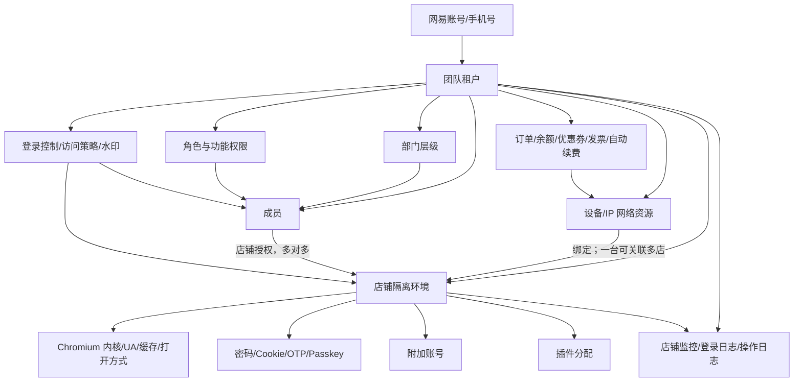
```mermaid
flowchart TB
    Account["网易账号/手机号"] --> Team["团队租户"]
    Team --> Dept["部门层级"]
    Team --> Role["角色与功能权限"]
    Team --> Member["成员"]
    Dept --> Member
    Role --> Member

    Team --> Store["店铺隔离环境"]
    Team --> Device["设备/IP 网络资源"]
    Device -->|"绑定；一台可关联多店"| Store
    Member -->|"店铺授权，多对多"| Store

    Store --> Browser["Chromium 内核/UA/缓存/打开方式"]
    Store --> Credential["密码/Cookie/OTP/Passkey"]
    Store --> Attached["附加账号"]
    Store --> Plugin["插件分配"]

    Team --> Policy["登录控制/访问策略/水印"]
    Policy --> Member
    Policy --> Store
    Team --> Monitor["店铺监控/登录日志/操作日志"]
    Store --> Monitor

    Team --> Billing["订单/余额/优惠券/发票/自动续费"]
    Billing --> Device
```

### 4.1 关键对象定义

| 对象 | 产品含义 | 关键关系与规则 |
|---|---|---|
| 团队 | 数据和权限的租户边界 | 团队名称唯一；承载成员、部门、角色、店铺、设备、策略、日志与费用 |
| 成员 | 团队内实际操作者 | 同时受角色权限、部门数据范围、店铺授权、登录控制和安全策略约束 |
| 店铺 | 某个平台账号的隔离浏览器环境 | 保存平台/站点、名称、浏览器环境、凭证、设备绑定、成员授权、缓存等 |
| 设备 | 以 IP/网络线路形式交付的资源 | 可购买平台设备或添加自有设备；店铺未绑定设备不能启动 |
| 登录凭证 | 帮助登录但作用不同的凭证集合 | 密码用于回填，Cookie 迁移会话，OTP 完成二步验证，Passkey 完成无密码认证 |
| 附加账号 | 与店铺相关的邮箱、支付、ERP 等账号 | 可由管理端添加或在环境中识别，授权范围可与主店铺不同 |
| 插件 | 团队统一管理的浏览器扩展 | 来自 Chrome 商店或上传 `.crx`/`.zip`；可全局或按店铺/成员分发 |
| 安全策略 | 对成员在店铺中的行为约束 | 包括登录时间/终端、页面/元素访问、密码显示、F12、打印和水印 |
| 监控与日志 | 事中留痕和事后追溯 | 店铺录像、访问命中记录、登录日志、操作日志分别承担不同审计用途 |

## 5. 核心业务流程

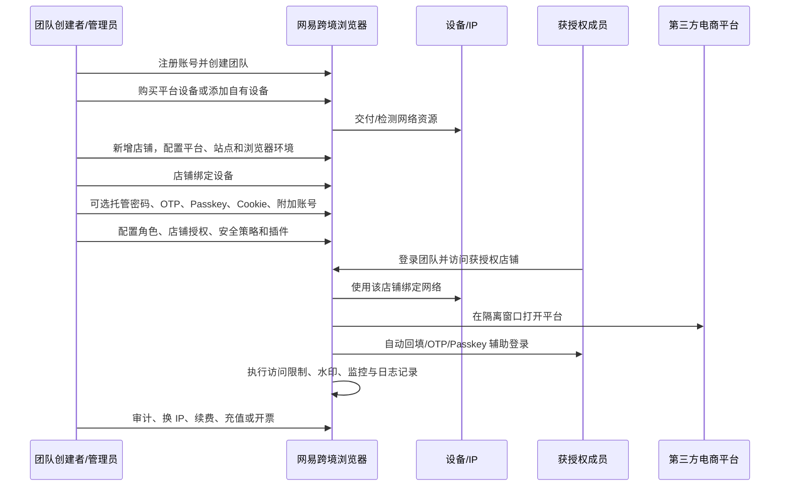
```mermaid
sequenceDiagram
    participant O as 团队创建者/管理员
    participant P as 网易跨境浏览器
    participant D as 设备/IP
    participant M as 获授权成员
    participant S as 第三方电商平台

    O->>P: 注册账号并创建团队
    O->>P: 购买平台设备或添加自有设备
    P->>D: 交付/检测网络资源
    O->>P: 新增店铺，配置平台、站点和浏览器环境
    O->>P: 店铺绑定设备
    O->>P: 可选托管密码、OTP、Passkey、Cookie、附加账号
    O->>P: 配置角色、店铺授权、安全策略和插件
    M->>P: 登录团队并访问获授权店铺
    P->>D: 使用该店铺绑定网络
    P->>S: 在隔离窗口打开平台
    P->>M: 自动回填/OTP/Passkey 辅助登录
    P->>P: 执行访问限制、水印、监控与日志记录
    O->>P: 审计、换 IP、续费、充值或开票
```

## 6. 产品功能清单与功能逻辑

### 6.1 账号、客户端与团队入口

| 功能 | 入口/动作 | 前置与权限 | 状态与结果 | 限制/异常 |
|---|---|---|---|---|
| 手机号注册 | 客户端立即注册，手机号+短信码+协议 | 可接收验证码 | 注册后回登录页再次取码登录 | 官网未给频控、注销和找回规则 |
| 账号登录 | 验证码登录或账号登录 | 团队成员首次激活可能需短信 | 进入所属团队；多团队时选择团队 | 登录控制可能拦截并进入审批 |
| 修改个人密码/手机 | 账号管理 | 需旧信息或短信校验 | 改名、密码、团队名后要求重新登录 | 文章未完整说明风控冷却期 |
| 安装与更新 | 下载页；客户端检查更新 | Windows 10+；macOS 10.12+ | 在线更新或重新安装 | 部分排障建议会降低系统安全，见第 12 节 |
| 团队切换 | 登录或账号菜单 | 账号属于多个团队 | 当前工作数据切换到所选租户 | 跨团队对象不能推定可共享 |

### 6.2 店铺环境

| 功能 | 功能逻辑 | 关键规则 |
|---|---|---|
| 单个添加店铺 | 选择平台/站点和店铺名称，可选凭证、设备、成员、并发配置 | 平台与店铺名称是最小必填；真正访问前必须绑定设备 |
| 批量添加店铺 | 下载模板、填写并上传、校验后批量创建 | 单次最多 300 行；错误行需修正；可带设备、成员和并发信息 |
| 编辑店铺 | 修改名称、站点、凭证、设备、授权及环境参数 | 修改浏览器内核后可能需要清缓存；高敏项应受店铺操作权限控制 |
| 绑定设备 | 从可用设备中搜索并单选 | 一台设备可绑定多个店铺，但系统会给关联风险提示；官方建议同平台不同店铺使用不同设备 |
| 授权成员 | 在新建/编辑页或授权入口选择成员 | 店铺与成员是多对多；授权只是进入条件，仍叠加角色与策略 |
| 店铺共用人数 | 无限制、1 人或自定义并发人数 | 超限后的强制退出选择流程文档描述不完整 |
| 浏览器内核/UA | 每店铺单独选择 Chromium 内核、UA、操作系统标识 | UA 与内核差异过大会警告；不一致可能导致兼容或风控问题 |
| 打开方式 | 打开平台默认页或恢复上次关闭前的页面 | 恢复的是该店铺环境的上次标签状态 |
| 清除缓存 | 清本地；清本地+云端保留 Cookie；清全部含 Cookie | 清理层次会影响登录态，不能视为同一种“重置” |
| Cookie 导入 | 插件内导入或管理端粘贴 JSON 并校验 | 需标准 Cookie 数据；过期、域冲突等细节未说明 |
| 自定义平台 | 自定义 URL 并配置自动回填 | 官网平台有账号保护；自定义平台能力较基础 |
| 移动端远程 | 微信小程序“网易跨境助手”远程访问获授权店铺 | 无独立 iOS/Android App；子账号需绑手机并完成首次 PC 激活；适合应急轻操作 |

#### 店铺生命周期

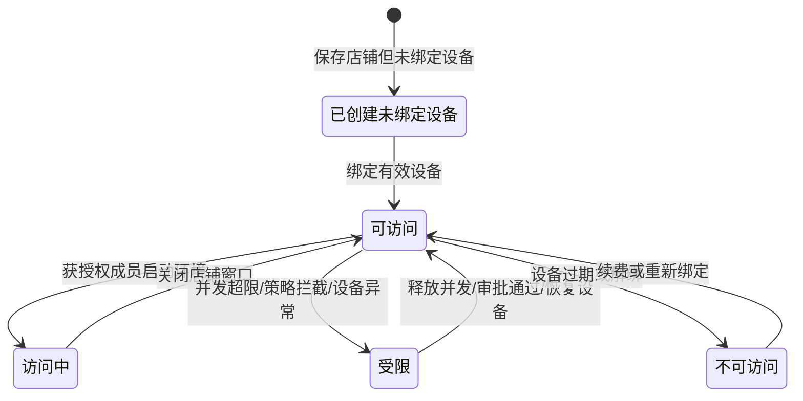
```mermaid
stateDiagram-v2
    [*] --> 已创建未绑定设备: 保存店铺但未绑定设备
    已创建未绑定设备 --> 可访问: 绑定有效设备
    可访问 --> 访问中: 获授权成员启动环境
    访问中 --> 可访问: 关闭店铺窗口
    可访问 --> 受限: 并发超限/策略拦截/设备异常
    受限 --> 可访问: 释放并发/审批通过/恢复设备
    可访问 --> 不可访问: 设备过期或解绑
    不可访问 --> 可访问: 续费或重新绑定
```

### 6.3 设备/IP 资源

| 功能 | 功能逻辑 | 状态/约束 |
|---|---|---|
| 购买平台设备 | 按地区、平台建议、服务商、库存和时长筛选，支付后交付 | 时长为 30/90/180/360/720 天，对应页面称 1/3/6/12/24 个月；通常 5-15 分钟交付 |
| 添加自有设备 | 单个或批量录入第三方网络资源并测试 | 支持 HTTP、HTTPS、SOCKS5、SSH、SSL；需填写主机、端口及认证信息 |
| 设备绑定 | 设备与店铺建立使用关系 | 店铺必须有设备才能访问；一设备可关联多店但存在关联风险提示 |
| 网络检测 | 在添加/管理时检测连通性和平台可达性 | “推荐/高速访问”是平台观测提示，不是第三方平台保证 |
| 续费 | 设备列表或费用链路选择续费时长 | 到期前 7 天有短信和界面提醒；到期时间按 23:59:59 处理 |
| 自动续费 | 从余额在到期前一天扣款 | 余额不足时能否重试、宽限多久，文档未完整说明 |
| 更换 IP | 在剩余额度内选择同价、同服务商设备 | 可自动重新绑定原店铺或先解绑；需要“设备管理-更换设备”权限 |
| 到期处置 | 设备到期后停止服务 | 文档称会永久移除并自动解绑，恢复路径是重新购买/绑定，而非续接旧对象 |

#### 设备状态逻辑

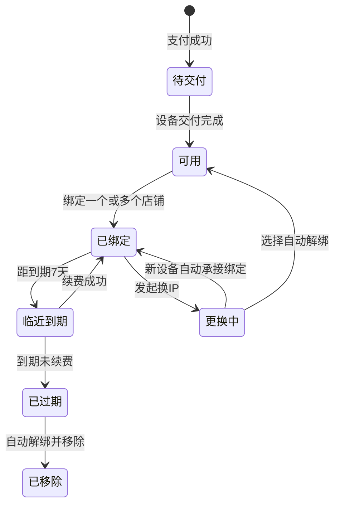
```mermaid
stateDiagram-v2
    [*] --> 待交付: 支付成功
    待交付 --> 可用: 设备交付完成
    可用 --> 已绑定: 绑定一个或多个店铺
    已绑定 --> 临近到期: 距到期7天
    临近到期 --> 已绑定: 续费成功
    临近到期 --> 已过期: 到期未续费
    已过期 --> 已移除: 自动解绑并移除
    已绑定 --> 更换中: 发起换IP
    更换中 --> 已绑定: 新设备自动承接绑定
    更换中 --> 可用: 选择自动解绑
```

### 6.4 凭证托管与账号保护

四类凭证不能混为一谈：

| 凭证 | 所在环节 | 主要能力 | 授权与特殊规则 |
|---|---|---|---|
| 账号/密码 | 首次登录 | 自动回填；托管后普通成员无需看到明文 | 账号保护可限制输入为托管账号；密码显示权限可单独禁止 |
| Cookie | 已登录会话迁移/保持 | 把外部浏览器现有会话导入指定店铺 | 可选择清缓存时保留或删除；Cookie 有效性由第三方站点决定 |
| OTP 二步验证 | 密码或 Passkey 后的二次校验 | 根据托管密钥生成动态码并查看/代填 | 当前重点支持亚马逊验证器；可默认全员或手动授权；配置受“操作二步验证”权限控制 |
| Passkey | 亚马逊账号认证 | 浏览器拦截并调用托管密钥完成登录 | 客户端 2.1.0+，当前仅亚马逊类平台；配置需“操作授权店铺”，使用沿用店铺授权 |

#### Passkey 关系与状态

- 网易侧一个店铺记录只能绑定 1 个托管 Passkey。
- 同一托管密钥可绑定同一个亚马逊账号的多个网易店铺记录。
- 网易侧解绑不会删除亚马逊侧 Passkey，也不会删除网易密钥对象。
- 亚马逊侧删除后，网易仍可能显示旧绑定，但实际认证会失效。
- Passkey 成功后，亚马逊仍可能继续触发 OTP，二者不是替代关系。
- 文档正文称“两种方式”，实际列出环境内创建、后台绑定、亚马逊强制创建三条路径，是文档口径错误。

### 6.5 团队、组织与权限

帮助中心反映的是“RBAC + 数据范围 + 对象授权 + 动态策略”四层组合，而不是只有角色名称。

| 层级 | 决定什么 | 例子 |
|---|---|---|
| 角色功能权限 | 能否看到或执行某类功能 | 店铺操作、设备更换、成员管理、二步验证、费用、日志 |
| 部门数据范围 | 能管理哪些组织数据 | 本部门、下级部门或更大范围 |
| 店铺/附加账号授权 | 能进入和使用哪些业务对象 | 成员 A 获得店铺 1、2，但附加账号还可另行收窄 |
| 登录与访问策略 | 在何时、何终端、何页面可做什么 | 登录时间/终端、URL 黑名单、页面元素屏蔽、审批 |

#### 主要角色

- **团队创建者/Boss**：最高控制者；部分高敏默认限制以其为例外。
- **超级管理员**：接近全量权限，但不能据帮助文档推断能越过创建者边界。
- **管理员**：由角色权限和数据范围决定可管理对象。
- **普通成员**：以获授权店铺的日常访问为主，默认不应拥有高敏配置能力。
- **自定义角色**：将权限项组合后分配给成员。

#### 成员生命周期

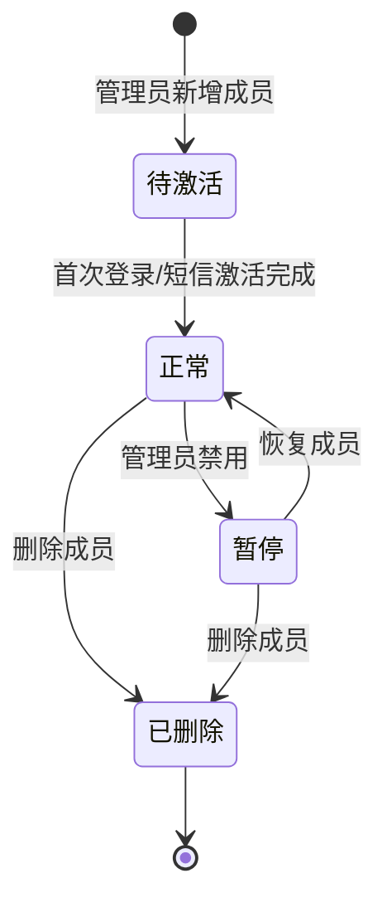
```mermaid
stateDiagram-v2
    [*] --> 待激活: 管理员新增成员
    待激活 --> 正常: 首次登录/短信激活完成
    正常 --> 暂停: 管理员禁用
    暂停 --> 正常: 恢复成员
    正常 --> 已删除: 删除成员
    暂停 --> 已删除: 删除成员
    已删除 --> [*]
```

关于“暂停”的官网文档存在冲突：FAQ 称暂停会自动取消店铺授权并终止访问；详细禁用文章又强调数据、配置和绑定保留、之后可恢复。因此能确定的是“立即禁止继续访问”，但授权关系究竟被删除还是仅冻结，需要登录后实测或产品方澄清。

### 6.6 安全控制、监控与审计

安全能力形成“事前限制 -> 事中记录 -> 事后追溯”的闭环：

```mermaid
flowchart LR
    A["登录控制：时间/终端/地域与审批"] --> B["店铺授权与角色权限"]
    B --> C["访问策略：URL/页面元素"]
    C --> D["会话限制：密码/F12/打印/水印"]
    D --> E["店铺屏幕监控"]
    E --> F["登录日志/操作日志/命中记录"]
    F --> G["管理员回看与调整策略"]
    G --> A
```

| 能力 | 粒度与行为 | 关键规则 |
|---|---|---|
| 登录控制 | 按成员限制登录时间、日期、终端等 | 命中限制时进入拒绝或申请审批链路 |
| 访问策略 | 预设或自定义 URL 黑名单，指定成员和店铺 | 可只限制页面访问，也可记录命中 |
| 页面元素限制 | 对页面内敏感元素做屏蔽/禁用 | 依赖页面结构，第三方改版可能使选择器失效 |
| 密码/F12/打印 | 限制查看密码、开发者工具和打印 | 帮助文档称默认对非 Boss 禁止部分高敏能力 |
| 屏幕水印 | 设置适用成员/店铺、场景和水印内容 | 用于泄漏追责，不等同于阻止拍屏 |
| 店铺监控 | 按店铺开启加密屏幕录像 | 可查近 30 天；支持回放、截图、URL/动作筛选；停止配置不删除既有录像 |
| 登录日志 | 记录成员登录时间、终端等 | 文档中的权限名称和菜单位置有不一致 |
| 操作日志 | 记录管理动作和业务操作 | 与录像用途不同，不能互相替代 |

### 6.7 插件、浏览器工具与协作能力

| 功能 | 核心逻辑 | 重要边界 |
|---|---|---|
| Chrome 商店插件 | 搜索、查看权限、确认风险后添加 | 通常自动更新；插件权限可能读取店铺页面数据 |
| 自研/外部插件 | 上传 `.crx` 或 `.zip`，填写名称和说明 | 需手动更新；配置后重启店铺环境生效 |
| 插件分配 | 自动分配全部店铺，或按店铺/成员手动分配 | 是独立授权层，不应等同店铺访问授权 |
| CRX 打包 | Chrome 扩展页打包并保存 `.pem` 私钥 | 更新时私钥连续性很重要；文档未充分说明泄露风险 |
| 团队/个人书签 | 团队统一分发或个人自用 | 2.0.60+；团队书签属于协作资产 |
| 上传/下载 | 每店铺/成员隔离文件目录 | 避免不同店铺文件混用；具体配额和病毒扫描未说明 |
| 翻译 | 内置整页翻译，支持 73 种语言；也可装第三方插件 | “任意页面可用”是官网陈述，未独立覆盖所有页面类型 |
| 浏览器设置 | 默认浏览器、缩放、窗口、启动页、下载、网络、缓存路径、终端识别码等 | 最新截图中可见 MCP 服务设置，但正文没有完整解释其产品用途 |
| 视频认证 | 媒体设备测试后使用 Amazon Chime，共享窗口/屏幕 | 1.5.5+；是否被亚马逊接受取决于第三方流程 |

### 6.8 费用与商业化

| 功能 | 入口与结果 | 规则/未说明项 |
|---|---|---|
| 订单明细 | 按时间、类型和状态筛选设备等订单 | 退款规则以“已售设备不支持退换”为主；异常订单处理未完整说明 |
| 余额明细 | 查看充值、消费、退款等资金变化 | 明细类型和筛选可见，冻结余额等概念未说明 |
| 在线充值 | 微信/支付宝充值团队余额 | 支付限额、到账延迟和实名要求未完整说明 |
| 对公转账 | 按页面账户信息线下汇款并等待入账 | 需严格核对收款主体；本次未进行真实转账 |
| 开票 | 从可开票订单选择、填写抬头和收件信息、查看状态 | 红冲、拆票和税率规则未完整说明 |
| 自动续费 | 为设备开启，余额在到期前一天自动扣款 | 依赖余额充足；失败重试机制未清晰 |

### 6.9 客服、反馈与临时授权

| 功能 | 流程 | 风险控制 |
|---|---|---|
| 问题反馈 | 填写问题、联系方式并上传图片 | 空内容会校验；日志和截图可能包含敏感信息 |
| 临时授权店铺 | 为排障向客服开放指定店铺环境 | 应是明确店铺、明确时效的临时授权；帮助文档需与实际授权弹窗共同确认范围 |
| 本地日志 | 按系统路径收集客户端日志 | 提交前应检查账号、Cookie、路径等隐私内容 |
| 在线客服/顾问 | 官网二维码或客户端反馈入口 | 本次未发送消息或添加联系人 |

## 7. 关键功能逻辑拆解

### 7.1 “防关联”的真正实现面

官网把防关联价值集中在四层：

1. **环境层**：每个店铺保存独立内核、UA、缓存、Cookie 和文件空间。
2. **网络层**：店铺绑定设备/IP，访问店铺时全部页面走该网络。
3. **身份层**：账号密码、Cookie、OTP、Passkey 和附加账号按店铺管理。
4. **组织层**：成员只在授权范围内访问，敏感动作由策略、监控和日志约束。

这是基于帮助中心的合理推导。不能据此直接得出“绝对不会关联”：网易服务协议同时说明固定 IP 不保证永远不变或唯一，第三方平台也会使用支付信息、设备信号、行为模式和账号资料等其他维度。准确说法应是“降低因环境、网络和协作混用导致的关联风险”。

### 7.2 授权判断顺序

根据各文章关系，可以归纳出一次访问的判定链：

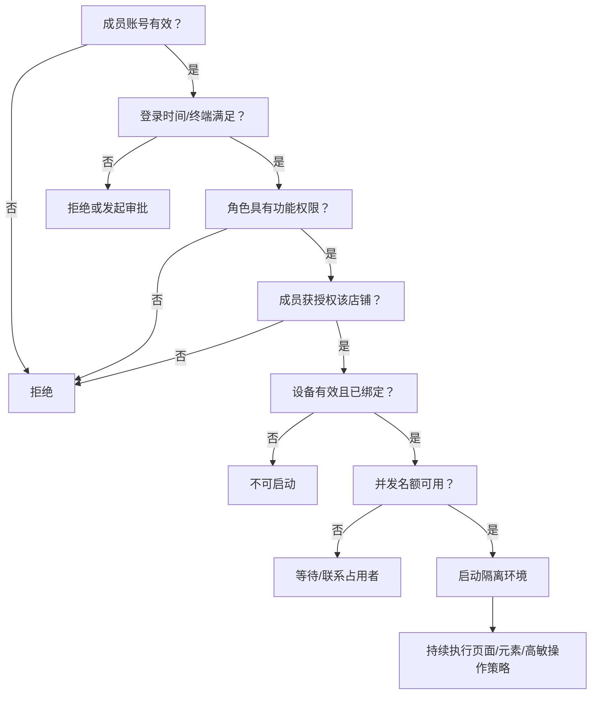
```mermaid
flowchart TD
    A["成员账号有效？"] -->|否| X["拒绝"]
    A -->|是| B["登录时间/终端满足？"]
    B -->|否| C["拒绝或发起审批"]
    B -->|是| D["角色具有功能权限？"]
    D -->|否| X
    D -->|是| E["成员获授权该店铺？"]
    E -->|否| X
    E -->|是| F["设备有效且已绑定？"]
    F -->|否| Y["不可启动"]
    F -->|是| G["并发名额可用？"]
    G -->|否| Z["等待/联系占用者"]
    G -->|是| H["启动隔离环境"]
    H --> I["持续执行页面/元素/高敏操作策略"]
```

这是产品逻辑推导，实际服务端判定顺序未由源码或登录态网络请求验证。

### 7.3 客户端与云端状态分离

帮助中心多次显示以下状态相互独立：

- 本地浏览器缓存；
- 云端同步缓存；
- Cookie/登录态；
- 店铺配置；
- 店铺绑定设备/IP；
- 成员授权；
- 凭证授权；
- 插件分配；
- 录像与审计记录。

因此“清缓存”“换 IP”“改内核”“撤销店铺授权”“解绑 Passkey”不会自动完成其他动作。产品设计上应把影响范围明确展示，否则管理员很容易误以为一次操作已经彻底重置店铺。

## 8. 图片证据选录

下列接触表来自帮助中心原图，主报告只放代表性证据；全部 99 张接触表与 474 张原图见第 2 节目录。

### 8.1 首次使用：下载、注册、购买设备、添加并访问店铺

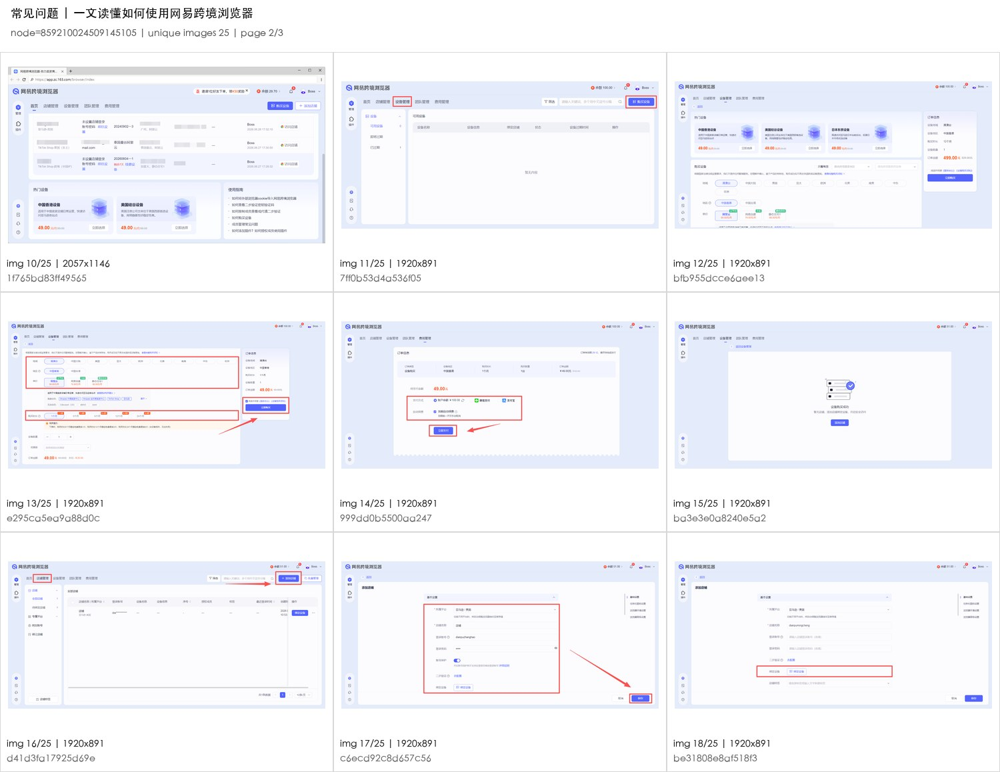

### 8.2 店铺运营：配置、绑定、启动与平台登录

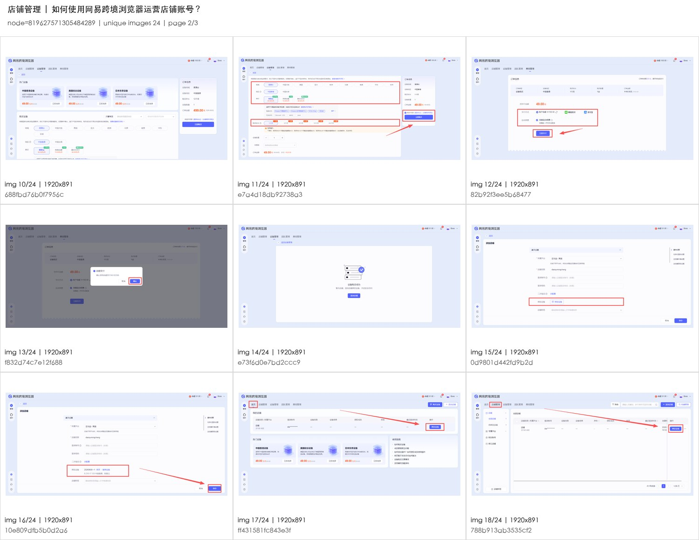

### 8.3 亚马逊 Passkey 托管与登录

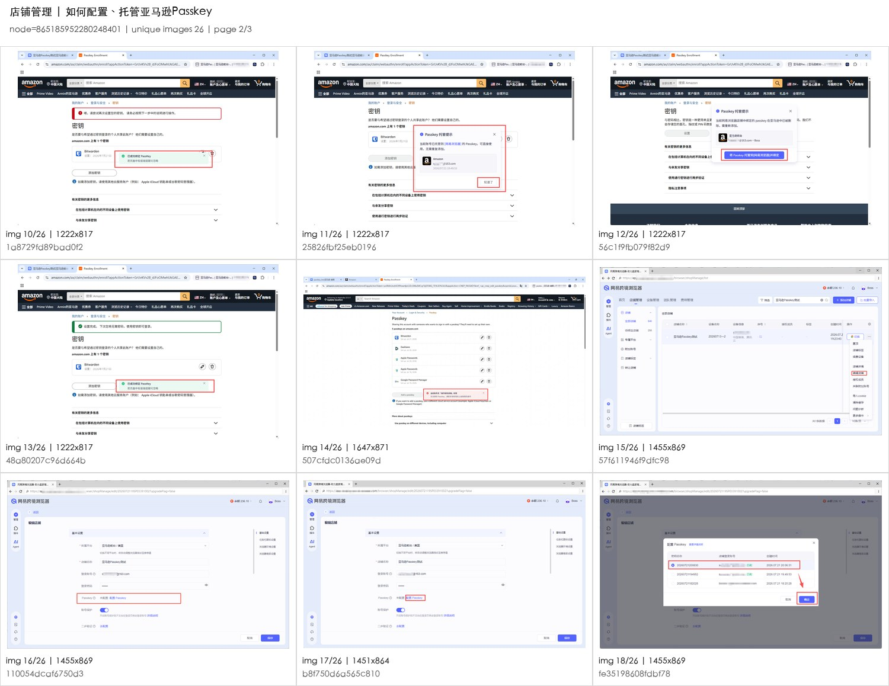

### 8.4 自有设备录入、协议选择与网络检测

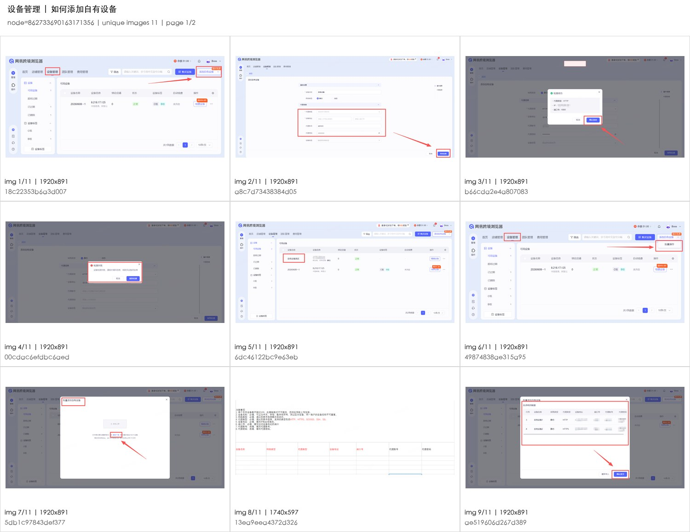

### 8.5 角色与权限配置

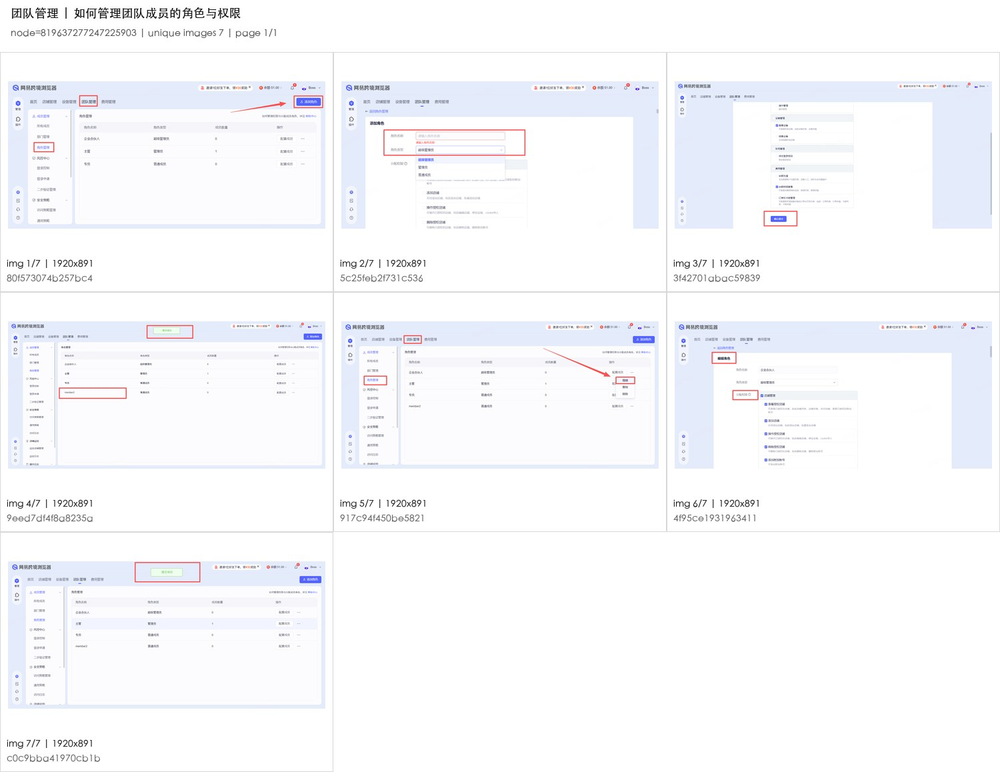

### 8.6 店铺监控配置与回放

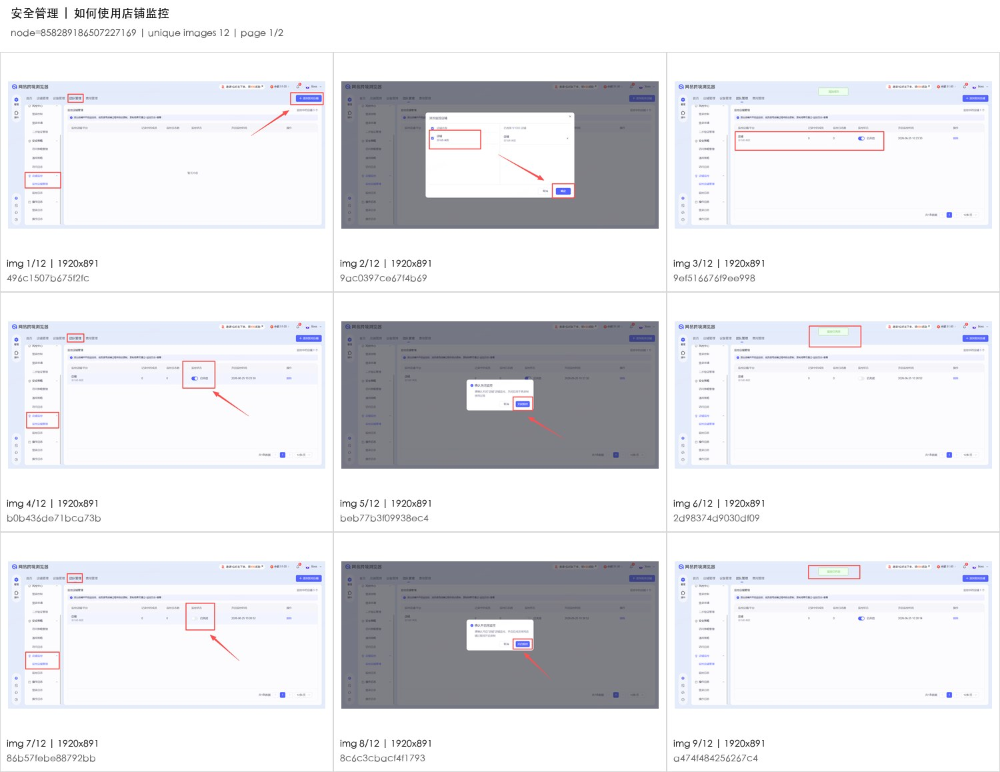

### 8.7 页面访问策略

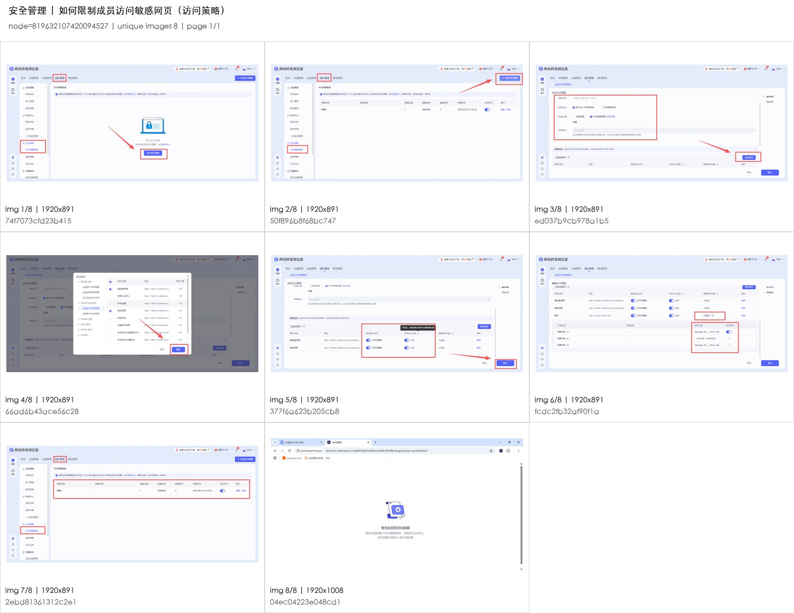

### 8.8 插件权限与分配

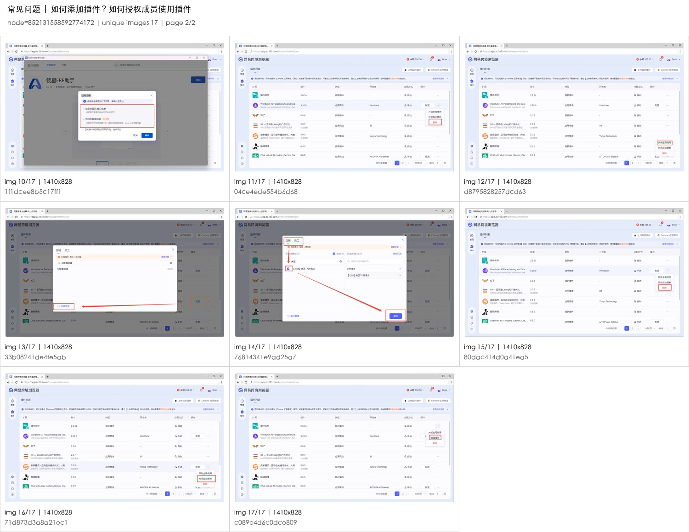

### 8.9 移动端远程访问

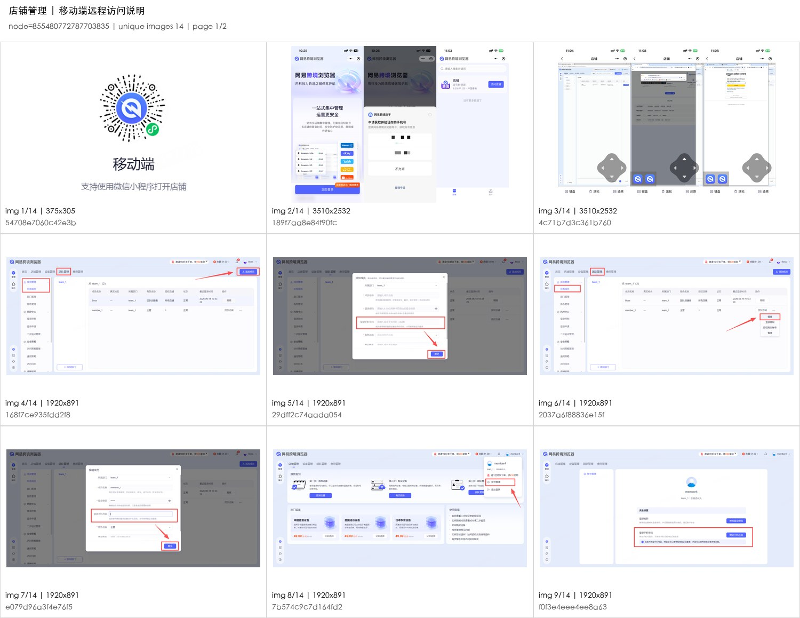

### 8.10 自动续费

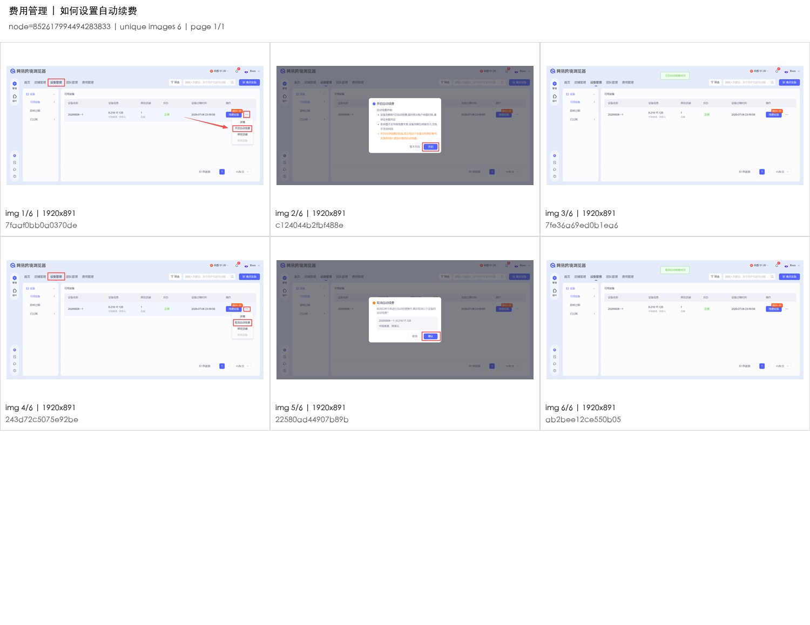

## 9. 版本演进脉络

帮助中心日志可见的主线如下：

| 版本阶段 | 能力演进 |
|---|---|
| 1.0.x（2023-11 起） | 基础店铺环境、设备、团队与访问能力 |
| 1.5.1 | 自动二步验证、账号保护 |
| 1.5.5 | 店铺访问人数限制；视频验证支持 |
| 1.6.0 | 浏览器翻译 |
| 1.6.4 | 附加账号 |
| 2.0.20 | 自研插件与插件权限 |
| 2.0.30 | 缓存清理、排序置顶、设备绑定风险提示 |
| 2.0.40 | 问题诊断、店铺监控、按成员同步 Cookie |
| 2.0.50 | 自助更换 IP |
| 2.0.60 | 团队书签 |
| 2.0.70（日志至 2026-05） | 批量店铺、二步验证查看、Passkey 前置能力 |
| 2.1.0（当前下载/专题要求） | 亚马逊 Passkey 托管等能力 |

更新日志目前只到 2.0.70，而下载页与 Passkey 文章已经使用 2.1.0，说明更新日志不是当前完整能力基线。

## 10. 文档矛盾、陈旧信息与风险点

以下不是“产品一定有 Bug”，而是帮助中心证据自身存在的矛盾或缺口：

1. **节点重复**：88 个节点含多篇跨板块重复文章，不能按节点数统计独立功能。
2. **品牌与界面陈旧**：部分图片仍出现“网易ZC浏览器”“网易跨境通浏览器”及旧导航，与当前品牌和菜单不一致。
3. **版本不同步**：当前下载/Passkey 使用 2.1.0，Windows/Mac 日志停在 2.0.70。
4. **Passkey 路径计数错误**：正文称“两种方式”，随后实际写了三种。
5. **清缓存文章陈旧**：写有“预计 v2.0.80 支持”等未来式描述，但当前下载已是 2.1.0。
6. **二步验证入口误写**：限制成员查看 OTP 的第二种方式正文复制了店铺编辑路径，图片实际显示团队管理-风控中心-二步验证管理。
7. **成员暂停语义冲突**：FAQ 写“自动取消店铺授权”，详细文章又写配置与绑定保留。
8. **并发超限流程不完整**：概述暗示可选择指定成员退出，操作文案主要是联系占用者或等待，未清晰展示管理员强制动作。
9. **设备月份口径**：页面以 1/3/6/12/24 月展示，正文实际按固定 30 天倍数计算，不等同自然月。
10. **安全性建议风险**：安装排障引导关闭安全软件、macOS 开启任何来源、Windows 加 `--no-sandbox`，都会降低系统防护，且未给出恢复步骤。
11. **菜单口径不一致**：访问策略在文章中分别出现“团队管理-访问策略管理”“风控中心”“安全策略”等入口名。
12. **日志权限口径不一致**：日志文章称 Boss/团队管理员可看全团队，角色权限表又把操作日志限定为超级管理员。
13. **访问策略权限冲突**：常见问题泛称团队管理员可管理，角色权限表却只列超级管理员。
14. **店铺授权对象误写**：店铺侧“授权成员”的真实图片是选择成员，部分正文却写成“勾选店铺”。
15. **改密文图冲突**：介绍称需原密码和新密码，步骤与图片只展示一个密码字段和短信验证。
16. **换绑手机恢复链缺失**：文章把“原手机号停机”列为场景，却仍要求原手机号接收短信，未说明无法接码时的身份恢复路径。
17. **对公转账新旧流程混杂**：索引摘要仍称联系客服，旧图只有微信/支付宝，新正文和新图已经提供对公账户与【我已汇款】。
18. **平台支持表存在空项**：部分平台在自动回填能力表中没有明确支持/不支持结论。
19. **敏感数据提示不足**：Cookie、临时店铺授权、运行日志、记住密码及第三方音视频测试均可能涉及高敏数据，文章没有始终明确范围、脱敏和撤销规则。
20. **营销结论不可当作独立证明**：“不会关联”“任意页面可翻译”“固定网络”等为官网陈述；协议本身也提示固定 IP 的变更与唯一性不作绝对保证。

## 11. 产品层面的归纳判断

以下是基于全量帮助中心信息的分析判断，不是网易官方原文：

1. **核心商品不是浏览器壳，而是“店铺环境 + 设备/IP + 组织治理”的组合**。设备带来持续付费，店铺环境形成日常入口，团队权限与安全能力提高组织迁移成本。
2. **店铺是最重要的聚合对象**。网络、浏览器指纹、凭证、成员、插件、文件、录像和访问策略最终都围绕店铺发生。
3. **凭证托管是协作效率与安全控制的交汇点**。平台通过让成员“能登录但不必看到密码”，同时解决多人协作和凭证泄漏；OTP、Passkey 又把这条链延伸到强认证。
4. **产品正从账号隔离工具转向企业治理平台**。2.0.x 后的监控、日志、插件权限、团队书签、批量店铺和 Passkey，明显服务于更大团队和标准化运营。
5. **文档治理落后于功能演进**。重复节点、旧品牌截图、版本断层和入口名称漂移，会直接增加管理员配置错误和客服成本。

## 12. 逐篇研读附录

每篇附录均按“节点/路由、图片、功能对象、入口、前置、步骤、字段、权限、状态、限制/异常、图片额外信息”整理：

- [01-常见问题与店铺管理：33 篇](./help-center-sections/01-common-store.md)
- [02-设备管理、团队管理与安全管理：28 篇](./help-center-sections/02-device-team-security.md)
- [03-费用管理、更新日志与其他：27 篇](./help-center-sections/03-billing-updates-other.md)

三份附录合计覆盖 88/88 个目录节点；重复文章仍按其所在板块保留，以证明页面级覆盖，不用于重复计算产品功能。

## 13. 尚未独立验证的事项

- 未登录真实团队，因此未验证每项角色权限在服务端是否严格拦截。
- 未购买设备，未验证交付时长、IP 唯一性、实际网络延迟、换 IP 和退款执行。
- 未托管真实账号密码、Cookie、OTP 或 Passkey，未验证加密实现及第三方平台登录成功率。
- 未开启真实店铺录像，未验证录像加密、保留 30 天和删除逻辑的实际执行。
- 未充值、转账、开票或自动续费，费用规则以当前页面和协议为准。
- 未提交反馈、临时授权或客服消息，避免产生真实业务数据。

这些未验证项不影响本报告对帮助中心页面内容的全量覆盖，但会影响对产品真实执行质量、安全强度和商业承诺的判断。
