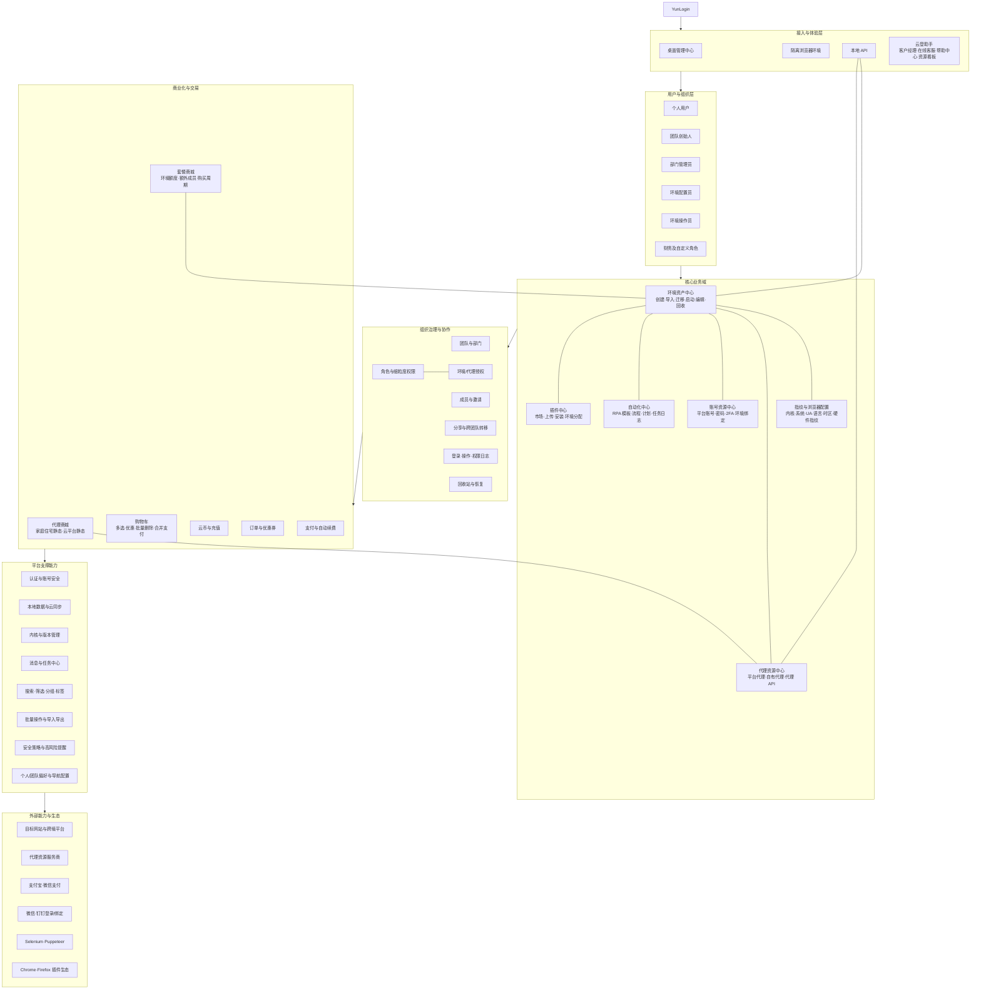
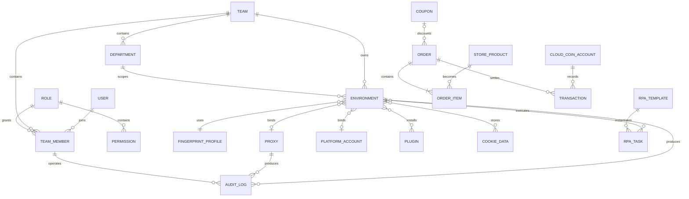
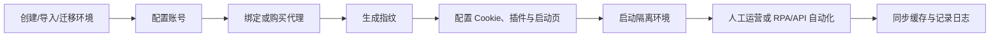
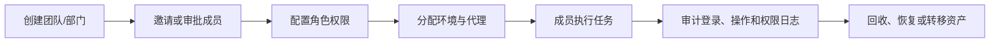
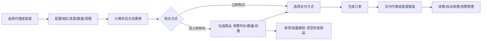

# YunLogin 产品架构

## 1. 架构结论

YunLogin 是面向跨境业务多账号运营团队的指纹浏览器与运营工作台。产品以“隔离浏览器环境”为核心资源，把账号、代理、指纹、Cookie、插件和自动化任务绑定到环境，再通过团队、角色、授权、日志、订单和本地 API 形成企业级治理闭环。

其产品架构可以概括为：

> 多端登录与管理入口 + 环境资产中枢 + 代理与账号资源层 + 团队权限治理 + RPA/API 自动化 + 商城与计费闭环。

## 2. 架构边界

本文描述产品业务能力、信息对象及模块依赖，不把页面菜单简单堆叠为架构，也不推断未呈现的后端微服务、数据库、风控算法和供应商结算系统。

状态说明：

- **已确认**：产品中存在明确入口、字段、状态或业务规则。
- **合理归纳**：由多个已确认能力抽象出的业务层或平台能力。
- **待确认**：存在入口但缺少完整流程或规则。

## 3. 产品架构图

可编辑源文件：[YunLogin产品架构图.svg](./YunLogin产品架构图.svg)

## 4. 分层架构

| 层级 | 定位 | 主要能力 | 关键价值 |
|---|---|---|---|
| 接入与体验层 | 用户进入、操作和获得支持的入口 | 管理中心、环境浏览器、本地 API、帮助、在线/电话/扫码咨询 | 降低使用门槛，覆盖人工操作与程序化调用 |
| 用户与组织层 | 定义谁使用、以什么身份使用 | 个人、创始人、部门管理员、配置员、操作员、财务、自定义角色 | 支持个人到团队的组织扩展 |
| 核心业务域 | 承载多账号运营的核心生产资料 | 环境、指纹、代理、账号、RPA、插件 | 建立账号隔离、资源复用与运营自动化能力 |
| 组织治理层 | 解决资产如何被分配、共享、审计 | 部门、成员、角色、权限、授权、分享、转移、日志、回收站 | 控制越权、误操作和资产流转风险 |
| 商业化与交易层 | 把资源和配额转化为可购买商品 | 代理、套餐、购物车、云币、优惠券、订单、支付、续费 | 形成订阅加资源交易的收入闭环 |
| 平台支撑层 | 为各业务域提供通用能力 | 认证、安全、同步、内核、消息、搜索、批处理、偏好设置 | 提升一致性、效率和可治理性 |
| 外部能力层 | 连接外部平台、资源和工具生态 | 目标网站、代理供应商、支付、第三方登录、自动化框架、插件生态 | 扩展业务覆盖与资源供给 |

## 5. 核心产品域

### 5.1 环境资产域

环境是产品的主对象，也是账号、代理、指纹、Cookie、插件和自动化执行的共同载体。

| 子域 | 能力 |
|---|---|
| 环境创建 | 单个创建、批量创建、文件导入、一键迁移 |
| 环境配置 | 名称、分组、账号、代理、内核、操作系统、User-Agent、指纹、Cookie、启动页、备注、插件、偏好 |
| 环境运行 | 启动、关闭、快速启动、批量启动、运行状态、IP 与指纹检测 |
| 环境维护 | 编辑、克隆、置顶、星标、标签、缓存管理、Cookie Robot、技术协助 |
| 环境流转 | 授权、分享、跨团队转移、组间转移、回收和恢复 |

### 5.2 指纹与浏览器域

该域通过内核、系统参数和多类浏览器指纹配置形成隔离身份，并提供 IP 匹配、随机值、真实值、噪声或自定义等策略。

核心范围包括语言、时区、地理位置、屏幕、字体、ClientRects、Canvas、WebGL、AudioContext、SpeechVoices、媒体设备、CPU 并发数、内存、设备名、MAC、硬件加速、蓝牙、DNT、电池和端口扫描白名单等。

### 5.3 代理资源域

| 资源类型 | 获取方式 | 生命周期能力 |
|---|---|---|
| 平台代理 | 商城购买或平台代理资源池 | 查询、绑定环境、授权、标签、续费、自动续费、到期管理、回收 |
| 自有代理 | 单条新增或批量导入 | 协议解析、连通性检测、编辑、环境分配、授权、删除与恢复 |
| 代理 API | 提取链接配置 | 名称、协议、提取方式、提取链接、IP 查询渠道、白名单提示、连通检测、授权、编辑与删除；其他提取方式待补充 |

### 5.4 账号资源域

账号对象独立于环境保存，可配置平台、账号名称、登录账号、密码、凭据锁定、备注和 2FA，再与一个或多个环境建立绑定关系。环境创建时也可直接新增或选择既有账号。

### 5.5 自动化域

RPA 提供模板市场、可视化流程编辑、环境分配、即时/优先/计划执行、异常策略和执行日志；本地 API 提供浏览器、分组、环境和代理的程序化调用，并可与 Selenium、Puppeteer 配合。

### 5.6 插件域

插件中心覆盖插件市场、官方/云端/团队/个人来源筛选、Chrome/Firefox 内核适配、上传安装、全局启用、团队可见性和环境分配。插件最终在隔离环境内运行。

### 5.7 协作与服务域

环境可按目标团队 ID 分享，支持多团队逐行输入、分享时长、缓存数据、备注和图片附件；分享管理负责查询分享记录和取消分享。云登助手作为左下角悬浮服务入口，汇聚客户经理、7×24 在线客服、帮助中心与资源看板。

窗口同步当前仅能确认权限入口。本文参考 AdsPower 同类能力，将其归纳为“主控窗口向多个受控环境同步点击、输入、滚动和标签操作”的建议能力模型；该模型不等同于 YunLogin 当前版本已实现。

## 6. 横向治理能力

| 能力 | 作用范围 | 关键规则 |
|---|---|---|
| 组织结构 | 团队、部门、成员 | 支持子部门、成员转移、加入申请和邀请 |
| 角色权限 | 全部业务模块 | 系统角色与自定义角色并存，可按操作粒度授权 |
| 数据权限 | 环境、代理等资产 | 创始人、部门管理员、普通成员的数据范围不同 |
| 审计 | 登录、业务操作、权限变更 | 记录操作者、时间、对象和操作内容 |
| 回收保护 | 环境、账号、代理、RPA 模板 | 删除后进入回收站，保留 30 天，可恢复或彻底删除 |
| 安全策略 | 账号、环境、代理、设备 | 设备退出、凭据锁定、高风险提醒、代理可见范围、环境安全监控 |
| 批量效率 | 环境、代理、账号、任务 | 批量新增、导入、编辑、分配、授权、删除和导出 |

## 7. 核心对象关系

## 8. 关键业务链路

### 8.1 环境生产链

### 8.2 团队治理链

### 8.3 商业交易链

## 9. 商业模式映射

| 收入来源 | 计价对象 | 主要计价维度 | 交付对象 |
|---|---|---|---|
| 套餐订阅 | 浏览器环境额度 | 环境数、额外成员数、30/90/180/360 天 | 团队配额与有效期 |
| 代理销售 | 静态代理 | 资源类型、国家/城市、资源卡、号段、数量、时长 | 平台代理资产 |
| 续费收入 | 套餐或代理 | 原商品、续费周期、自动续费 | 延长有效期 |
| 云币沉淀 | 内部结算余额 | 充值金额、CDKEY、消费记录 | 可购买套餐与代理的余额 |

## 10. 架构优势与风险

### 10.1 优势

- 环境是统一资产中枢，账号、代理、指纹、插件和自动化之间的关系清晰。
- 平台代理、自有代理、代理 API 并存，降低单一资源来源依赖。
- 团队、部门、角色、数据权限、日志和回收站组成较完整的治理体系。
- RPA 与本地 API 同时覆盖低代码和开发者自动化场景。
- 套餐、代理、云币、优惠券、订单和续费形成完整商业闭环。

### 10.2 风险与待确认

- 商城同一地区存在多个资源卡和不同价格，若缺少供应商、库存、质量和售后维度的清晰解释，用户难以比较真实成本。
- 分享创建字段、管理列表和取消分享已经明确；接收方权限、到期后的缓存处置与冲突规则仍需确认。
- API 目录覆盖多个对象，但接口参数、鉴权、错误码、版本兼容和完整限流规则仍需补齐。
- RPA 节点和模板丰富，但计划管理、失败重试、并发资源占用和告警闭环仍缺少完整规则。
- 购物车已覆盖多商品勾选、数量/时长/优惠调整、批量删除、清空失效商品和合并支付；多子订单优惠分摊及支付前价格重算仍需确认。
- 登录异常、插件生命周期、退款售后和窗口同步当前包含通用逻辑或竞品参考补全，不能当作 YunLogin 已实现规则。

## 11. 事实、归纳与未知边界

| 类型 | 内容 |
|---|---|
| 已确认 | 环境、代理、账号、团队、权限、插件、RPA、API、商城、费用、日志和回收站等产品域均有明确入口 |
| 已确认 | 套餐按环境数、额外成员数和周期计价；代理按类型、地区、资源、数量和周期计价 |
| 已确认 | 本地 API 默认地址示例为 `http://localhost:50213`，单接口每秒最多请求 1 次 |
| 已确认 | 回收站覆盖环境、账号、平台代理、自有代理、代理 API、RPA 模板，保留 30 天 |
| 已确认 | 代理 API 支持添加、检测、授权、编辑和删除，并可配置名称、协议、提取方式、提取链接及 IP 查询渠道 |
| 已确认 | 购物车支持多选商品合并支付、选择优惠、批量删除和清空失效商品 |
| 已确认 | 套餐 5000 环境是快捷预设而非企业档边界，数量可通过步进器连续调整 |
| 合理归纳 | 产品的核心定位是“多账号运营资产平台”，而不仅是单一指纹浏览器 |
| 合理归纳 | 环境、代理、账号、组织和订单共同组成业务对象中台 |
| 规则建议 | 窗口同步参考 AdsPower 的主控/受控窗口模型；登录异常、售后与插件异常按通用逻辑补齐 |
| 未知 | 服务端技术栈、数据库、微服务边界、代理供应链结算方式、指纹算法细节 |
| 未知 | 分享接收与到期、购物车优惠分摊、代理 API 其他提取方式、RPA 计划与失败恢复的完整状态机 |
