# YunLogin 产品三类结构图

## 1. 三类结构图的用途区别

| 图类型 | 回答的问题 | 组织依据 |
|---|---|---|
| 产品结构图 | 产品由哪些模块组成，用户从哪里进入 | 导航、页面、模块层级 |
| 产品功能结构图 | 产品能完成什么任务，能力如何分组 | 用户目标、业务动作、功能域 |
| 产品信息结构图 | 产品管理哪些信息，对象如何关联和流转 | 实体、属性、关系、状态 |

## 2. 产品结构图

```mermaid
flowchart TB
    Y["YunLogin"]
    Y --> L["登录与注册"]
    Y --> M["管理中心"]
    Y --> B["隔离浏览器"]
    Y --> S["全局设置"]

    L --> L1["密码登录"]
    L --> L2["验证码登录"]
    L --> L3["微信/钉钉扫码"]
    L --> L4["注册/找回密码"]
    L --> L5["团队选择"]

    M --> N1["新建浏览器"]
    M --> N2["环境管理"]
    M --> N3["代理管理"]
    M --> N4["商城"]
    M --> N5["费用管理"]
    M --> N6["团队管理"]
    M --> N7["账号管理"]
    M --> N8["分享转移"]
    M --> N9["日志管理"]
    M --> N10["账号设置"]
    M --> N11["插件管理"]
    M --> N12["API"]
    M --> N13["RPA"]
    M --> N14["回收站"]

    N1 --> N11A["单个创建"]
    N1 --> N11B["批量创建"]
    N1 --> N11C["批量导入"]
    N1 --> N11D["一键迁移"]

    N2 --> N21["环境列表"]
    N2 --> N22["分组管理"]
    N2 --> N23["环境编辑"]
    N2 --> N24["批量操作"]
    N2 --> N25["缓存/Cookie Robot"]
    N2 --> N26["授权/分享/转移"]
    N2 --> N27["窗口同步（参考模型）"]

    N3 --> N31["平台代理"]
    N3 --> N32["自有代理"]
    N3 --> N33["代理 API"]
    N3 --> N34["代理日志"]
    N33 --> N331["添加/编辑 API"]
    N33 --> N332["提取链接与方式"]
    N33 --> N333["检测/授权/删除"]

    N4 --> N41["代理"]
    N4 --> N42["套餐"]
    N4 --> N43["购物车"]
    N43 --> N431["多选与分组"]
    N43 --> N432["时长/数量/优惠"]
    N43 --> N433["批量删除/清空失效"]
    N43 --> N434["合并支付"]

    N5 --> N51["云币充值"]
    N5 --> N52["订单管理"]
    N5 --> N53["优惠券"]

    N6 --> N61["成员"]
    N6 --> N62["部门"]
    N6 --> N63["角色权限"]
    N6 --> N64["成员申请"]
    N6 --> N65["登录申请"]
    N6 --> N66["实名认证"]

    N8 --> N81["分享管理"]
    N8 --> N82["环境转移"]
    N8 --> N83["平台代理转移"]
    N81 --> N811["分享内容/时长"]
    N81 --> N812["目标团队/备注/附件"]
    N81 --> N813["查询/取消分享"]

    N9 --> N91["登录日志"]
    N9 --> N92["操作日志"]
    N9 --> N93["权限日志"]

    N10 --> N101["团队信息"]
    N10 --> N102["个人信息"]
    N10 --> N103["登录绑定"]
    N10 --> N104["设备列表"]
    N10 --> N105["咨询服务"]

    N11 --> N111["插件市场"]
    N11 --> N112["我的插件"]
    N11 --> N113["上传插件"]
    N11 --> N114["环境分配"]

    N12 --> N121["概览与状态"]
    N12 --> N122["浏览器接口"]
    N12 --> N123["分组接口"]
    N12 --> N124["环境接口"]
    N12 --> N125["代理接口"]

    N13 --> N131["任务模板"]
    N13 --> N132["模板市场"]
    N13 --> N133["流程编辑器"]
    N13 --> N134["计划管理"]
    N13 --> N135["任务日志"]

    B --> B1["环境标签页"]
    B --> B2["网页与平台运营"]
    B --> B3["扩展管理"]
    B --> B4["IP/指纹检测"]

    S --> S1["本地设置"]
    S --> S2["软件与内核"]
    S --> S3["个人偏好"]
    S --> S4["团队偏好"]
    S --> S5["侧边/Tab 导航"]
    S --> S6["服务协议"]
```

## 3. 产品功能结构图

```mermaid
flowchart TB
    F["YunLogin 功能体系"]

    F --> A["身份与访问"]
    A --> A1["注册/登录/找回"]
    A --> A2["扫码登录与第三方绑定"]
    A --> A3["团队切换与设备管理"]
    A --> A4["实名认证与账号安全"]

    F --> E["多账号环境运营"]
    E --> E1["创建、导入、迁移环境"]
    E --> E2["配置指纹与浏览器参数"]
    E --> E3["绑定账号、代理、Cookie、插件"]
    E --> E4["启动、关闭、批量管理"]
    E --> E5["克隆、分组、标签、搜索"]
    E --> E6["缓存同步、清理与恢复"]
    E --> E7["窗口同步（竞品参考模型）"]

    F --> P["代理供应与管理"]
    P --> P1["购买平台代理"]
    P --> P2["导入自有代理"]
    P --> P3["配置代理 API"]
    P --> P4["检测、分配、授权、续费"]
    P --> P5["到期、回收与日志"]

    F --> O["团队协作与治理"]
    O --> O1["团队、部门、成员"]
    O --> O2["邀请、申请与审批"]
    O --> O3["角色与操作权限"]
    O --> O4["环境/代理数据权限"]
    O --> O5["分享、授权与跨团队转移"]
    O --> O6["登录、操作、权限审计"]

    F --> R["自动化运营"]
    R --> R1["RPA 模板市场"]
    R --> R2["可视化流程编排"]
    R --> R3["即时/优先/计划任务"]
    R --> R4["环境分配与并发执行"]
    R --> R5["本地 API 与自动化框架"]

    F --> C["商业与计费"]
    C --> C1["套餐选配"]
    C --> C2["代理选购"]
    C --> C3["购物车与订单"]
    C --> C4["云币、优惠券与支付"]
    C --> C5["续费、自动续费与到期"]

    F --> X["平台体验支撑"]
    X --> X1["消息、任务、新手教程"]
    X --> X2["软件版本与内核下载"]
    X --> X3["个人/团队偏好"]
    X --> X4["导航自定义"]
    X --> X5["帮助与咨询"]
    X --> X6["云登助手与资源看板"]
```

## 4. 产品信息结构图

```mermaid
erDiagram
    ACCOUNT {
        string user_id PK
        string phone
        string email
        string nickname
        string password_status
        string wechat_binding
        string dingtalk_binding
    }
    DEVICE {
        string device_id PK
        string name
        string ip
        string online_status
        datetime last_active_at
    }
    TEAM {
        string team_id PK
        string name
        string certification_status
        date package_expire_at
    }
    DEPARTMENT {
        string department_id PK
        string parent_id
        string name
    }
    MEMBER {
        string member_id PK
        string account
        string nickname
        string status
        datetime last_login_at
    }
    ROLE {
        string role_id PK
        string name
        string type
    }
    PERMISSION {
        string permission_id PK
        string module
        string action
    }
    ENVIRONMENT {
        string environment_id PK
        int sequence_no
        string name
        string group_id
        string status
        string remark
    }
    FINGERPRINT {
        string fingerprint_id PK
        string kernel
        string os
        string user_agent
        string timezone
        string language
        string canvas_mode
        string webgl_mode
    }
    PLATFORM_ACCOUNT {
        string platform_account_id PK
        string platform
        string login_name
        string credential_lock
        string two_factor_secret
    }
    PROXY {
        string proxy_id PK
        string source_type
        string protocol
        string host
        int port
        string region
        date expire_at
        string status
    }
    PLUGIN {
        string plugin_id PK
        string name
        string source
        string kernel_type
        string enabled_status
    }
    RPA_TEMPLATE {
        string template_id PK
        string name
        string platform
        string group
        string exception_policy
    }
    RPA_TASK {
        string task_id PK
        string mode
        string schedule
        string status
        datetime started_at
        datetime ended_at
    }
    PRODUCT {
        string product_id PK
        string product_type
        string resource_type
        string region
        decimal unit_price
    }
    PACKAGE_QUOTA {
        string quota_id PK
        int environment_count
        int extra_member_count
        int duration_days
    }
    ORDER {
        string order_id PK
        string order_type
        decimal order_amount
        decimal discount_amount
        decimal payable_amount
        string payment_method
        string status
    }
    CART {
        string cart_id PK
        int selected_count
        int sub_order_count
        decimal total_amount
        decimal discount_amount
        decimal payable_amount
    }
    CART_ITEM {
        string cart_item_id PK
        string product_id
        int quantity
        int duration
        string selected_status
        string validity_status
    }
    SHARE_RECORD {
        string share_id PK
        string environment_id
        string target_team_id
        int duration_days
        string cache_data_status
        string remark
        datetime expire_at
        string status
    }
    PROXY_API_CONFIG {
        string proxy_api_id PK
        string name
        string proxy_type
        string extraction_method
        string extraction_url
        string ip_query_channel
        string detection_status
    }
    AFTER_SALES {
        string after_sales_id PK
        string order_id
        string request_type
        decimal requested_amount
        decimal approved_amount
        string status
    }
    COUPON {
        string coupon_id PK
        string status
        decimal discount_amount
        date expire_at
    }
    CLOUD_COIN_TXN {
        string transaction_id PK
        string transaction_type
        decimal amount
        decimal balance
        datetime created_at
    }
    AUDIT_LOG {
        string log_id PK
        string log_type
        string operator_id
        string action
        datetime created_at
    }
    RECYCLE_ITEM {
        string recycle_id PK
        string object_type
        string object_id
        datetime deleted_at
        datetime purge_at
    }

    ACCOUNT ||--o{ DEVICE : logs_in_on
    ACCOUNT ||--o{ MEMBER : becomes
    TEAM ||--o{ DEPARTMENT : contains
    TEAM ||--o{ MEMBER : contains
    DEPARTMENT ||--o{ MEMBER : groups
    MEMBER }o--o{ ROLE : holds
    ROLE }o--o{ PERMISSION : grants
    TEAM ||--o{ ENVIRONMENT : owns
    ENVIRONMENT ||--|| FINGERPRINT : uses
    ENVIRONMENT }o--o| PLATFORM_ACCOUNT : binds
    ENVIRONMENT }o--o| PROXY : binds
    ENVIRONMENT }o--o{ PLUGIN : assigns
    ENVIRONMENT }o--o{ RPA_TASK : executes
    RPA_TEMPLATE ||--o{ RPA_TASK : creates
    PRODUCT ||--o{ CART_ITEM : selected_as
    CART ||--|{ CART_ITEM : contains
    CART_ITEM }o--o| COUPON : applies
    CART ||--o{ ORDER : submits_as
    PRODUCT ||--o{ ORDER : purchased_in
    PACKAGE_QUOTA ||--o{ ORDER : configured_in
    COUPON o|--o{ ORDER : discounts
    ORDER ||--o{ CLOUD_COIN_TXN : settles
    ORDER ||--o{ AFTER_SALES : may_create
    ENVIRONMENT ||--o{ SHARE_RECORD : shared_as
    TEAM ||--o{ SHARE_RECORD : receives
    TEAM ||--o{ PROXY_API_CONFIG : owns
    ENVIRONMENT }o--o| PROXY_API_CONFIG : extracts_from
    MEMBER ||--o{ AUDIT_LOG : generates
    ENVIRONMENT ||--o{ RECYCLE_ITEM : may_become
    PROXY ||--o{ RECYCLE_ITEM : may_become
    PLATFORM_ACCOUNT ||--o{ RECYCLE_ITEM : may_become
```

## 5. 信息对象与状态

| 信息对象 | 核心属性 | 主要关系 | 已知状态或生命周期 |
|---|---|---|---|
| 用户账号 | 手机、邮箱、昵称、密码、第三方绑定 | 加入多个团队，登录多个设备 | 已绑定/未绑定，设备在线/离线 |
| 团队 | 团队 ID、名称、认证、套餐、到期时间 | 包含部门、成员、角色和资产 | 试用、VIP、到期；认证状态 |
| 成员 | 账号、昵称、部门、角色、联系方式、登录信息 | 隶属团队和部门，持有角色 | 在线/离线，启用状态，申请待审/通过/拒绝 |
| 环境 | ID、序号、名称、分组、状态、备注 | 绑定账号、代理、指纹、插件和任务 | 未启动、运行中、关闭、已删除、30 天后清除 |
| 指纹 | 内核、OS、UA、语言、时区、硬件与图形指纹 | 被环境使用 | 真实、随机、噪声、自定义、IP 匹配 |
| 代理 | 来源、协议、IP/域名、端口、地区、账号、到期时间 | 绑定环境、被授权、来自订单 | 运行中、即将过期、已过期、自动续费、已删除 |
| 平台账号 | 平台、账号、密码、2FA、备注 | 与环境绑定 | 凭据锁定/未锁定，已绑定/未绑定 |
| RPA 任务 | 模板、环境、模式、计划、线程、结果 | 由模板产生，在环境执行 | 普通、优先、计划；执行中、成功、失败 |
| 插件 | 来源、内核、版本、启用、可见性 | 分配到环境 | 已安装/未安装、启用/停用、团队可见范围 |
| 代理 API 配置 | 名称、代理类型、提取方式、提取链接、IP 查询渠道 | 被团队拥有，可供环境提取代理 | 未检测、提取成功、提取失败；可编辑、授权、删除 |
| 分享记录 | 环境、缓存、时长、目标团队、备注、附件、到期时间 | 连接环境与一个或多个目标团队 | 分享中、取消分享、到期；接收方后续状态待确认 |
| 购物车 | 已选商品、数量、周期、优惠、失效状态、金额 | 由多个商品项组成，可生成多个子订单 | 未选/已选、有效/失效、待结算 |
| 订单 | 类型、商品、金额、优惠、支付、时间 | 购买代理、套餐或云币 | 创建中、处理中、开通中、完成、关闭、退款、部分退款、异常 |
| 售后单 | 原订单、原因、凭证、申请/核准金额、退款路径 | 从订单发起并回写权益与资金 | 当前仅确认退款/部分退款结果；完整状态为规则建议 |
| 优惠券 | 面额、适用范围、有效期 | 抵扣订单 | 未使用、已使用、已失效 |
| 回收项 | 对象类型、原 ID、删除时间、清除时间 | 指向原业务对象 | 可恢复、可彻底删除、满 30 天自动清除 |

## 6. 结构边界与待补充

- 帮助中心已确认平台入口，图中采用“首页—搜索/分类—文章详情—关联内容”的通用信息结构；实际栏目仍待确认。
- 云登助手已确认客户经理、在线客服、帮助中心和资源看板，不应推导为 AI 会话或自动执行助手。
- 购物车已覆盖商品多选、时长/数量/优惠调整、单项/批量删除、清空失效商品和合并支付；优惠分摊及价格重算时点仍待确认。
- 分享发起、管理和取消分享已覆盖；接收方权限、到期缓存处理和冲突解决仍待确认。
- API 仅能确认目录和状态接口，不能补全全部请求/响应模型。
- RPA 计划管理和完整节点库未充分呈现，图中只保留已确认的核心能力。
- 窗口同步采用 AdsPower 同类能力作为参考模型，不代表 YunLogin 当前界面和规则已被确认。
