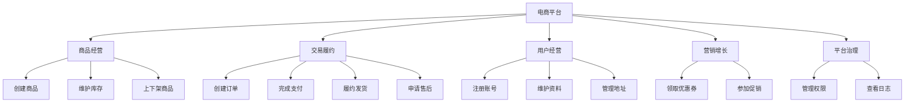
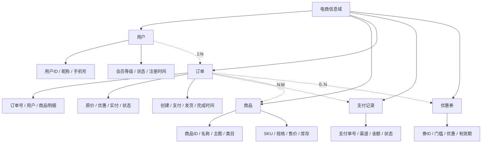
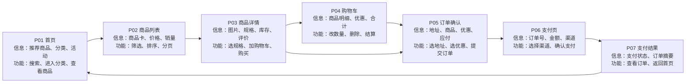
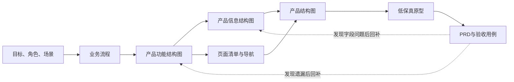

# 产品结构图、产品功能结构图、产品信息结构图制作规范

> 版本：1.0  
> 整理日期：2026-08-11  
> 适用对象：产品经理、交互设计师、研发、测试、项目负责人  
> 适用阶段：需求分析、概念设计、方案评审、原型设计前、竞品拆解和存量产品盘点

## 1. 规范定位

本文基于六篇“人人都是产品经理”文章归纳，并结合可落地的产品文档实践形成。六篇文章属于作者经验，不是国家、行业或平台强制标准；其中对“产品结构图”的定义存在分歧。因此，团队采用本规范前，应先确认术语口径。

本文采用以下定义：

- **产品功能结构图**：站在业务与用户能力角度，说明产品“能做什么”，表达功能模块的从属和逻辑关系，不展开具体字段。
- **产品信息结构图**：脱离具体页面，以业务对象为中心，说明产品“管理和展示什么信息”，表达对象、字段、关系和必要状态。
- **产品结构图**：以页面/界面容器为骨架，把功能、信息和页面跳转整合起来，形成产品原型的低成本简化表达。

这一定义与多篇文章提出的“功能结构图是骨架、信息结构图是血肉、产品结构图是简化原型”的观点一致；同时必须注意，行业内也有人把“产品结构图”直接当作“功能结构图”的简称，交付时务必在图名或图例中声明。参考：[结构图作用](https://www.woshipm.com/pd/5405037.html)、[产品结构图=功能结构图+信息结构图](https://www.woshipm.com/pd/2611357.html)、[三种结构图区分](https://www.woshipm.com/pmd/844937.html)。

## 2. 三类图的边界

| 对比项 | 产品功能结构图 | 产品信息结构图 | 产品结构图 |
|---|---|---|---|
| 核心问题 | 产品能做什么？ | 产品包含什么对象和信息？ | 用户在哪个页面看到什么、做什么、去哪里？ |
| 主组织维度 | 业务能力/功能模块 | 业务对象/实体 | 页面、导航、界面容器 |
| 核心节点 | 功能模块、功能点 | 对象、字段、关系、状态 | 页面、页面区块、功能、字段、跳转 |
| 是否包含字段 | 原则上不包含 | 必须包含 | 只放页面所需关键字段 |
| 是否包含页面 | 可辅助标注，但不按页面照抄 | 原则上脱离页面 | 必须包含 |
| 是否包含跳转 | 通常不包含 | 不包含 | 必须表达关键跳转 |
| 主要读者 | 产品、业务、研发、测试、管理者 | 产品、研发、数据、后台设计者 | 产品、交互、研发、测试、评审者 |
| 主要用途 | 明确范围、防遗漏、估算工作量 | 字段盘点、数据建模、内容设计 | 方案评审、原型前置、页面和路径校验 |
| 推荐阶段 | 概念设计初期 | 功能框架稳定之后 | 概念设计后期、原型之前 |

### 2.1 一句话判别

- 节点主要是“创建订单、查看订单、取消订单”——功能结构图。
- 节点主要是“订单号、用户、商品、金额、状态”——信息结构图。
- 节点主要是“订单列表页 → 订单详情页 → 支付结果页”，并在页面下列出操作和信息——产品结构图。

### 2.2 不要混淆“产品架构图”

“产品结构图”和“产品架构图”不是天然同义词。产品架构图在实践中还可能表达客户端、服务端、第三方服务、业务中台、数据流或系统依赖。如果要表达技术或系统关系，应命名为“业务架构图”“应用架构图”或“系统架构图”，不要借用本文三类结构图的口径。

## 3. 通用制作原则

### 3.1 先确定目的和读者

开始画图前，在标题下写清：

1. 图的类型；
2. 产品和版本范围；
3. 目标读者；
4. 本图要回答的问题；
5. 不在本图表达的内容；
6. 信息来源及验证日期。

同一产品没有唯一画法。评价标准不是“像不像某个模板”，而是目标读者能否快速获取预期信息。[结构图作用](https://www.woshipm.com/pd/5405037.html)也强调应先考虑“给谁看、希望对方理解什么”。

### 3.2 先业务，后页面

新产品不能一开始就按 Tab 分模块。功能来自业务场景和商业规则，Tab 只是其界面结果。推荐顺序：

```text
业务目标 → 用户角色 → 核心场景 → 业务流程 → 功能模块 → 信息对象 → 页面结构
```

已有产品或竞品可以从现有页面开始盘点，但最终功能结构图仍应回到业务能力重新归类，不能把导航栏截图文字直接复制成最终结果。参考：[一文说清楚3种结构图](https://www.woshipm.com/pd/5159192.html)。

### 3.3 同层同维度

同一父节点下的子节点必须使用相同划分维度。例如：

- 正确：订单管理 → 创建订单、查询订单、取消订单。
- 错误：订单管理 → 订单列表页、退款、订单状态。

错误示例混合了页面、动作和字段。

### 3.4 MECE 作为检查工具，不机械追求绝对互斥

- 尽量不重复：同一功能只保留一个主归属；跨模块复用时使用“公共能力”或引用关系。
- 尽量不遗漏：正常流程、异常流程、权限限制、空状态、失败状态都要检查。
- 业务本身存在交叉时允许交叉，但必须用图例说明主归属和复用关系。

### 3.5 控制层级与颗粒度

综合文章建议，功能结构图通常采用 2～3 级，一级主模块以 5～9 个为宜。该数字是经验值，不是硬性标准；复杂 B 端系统可以拆成总图与分域子图，而不是在一张图中无限加深。[功能结构图标准](https://www.woshipm.com/pd/5405037.html)和[功能结构图详解](https://www.woshipm.com/pmd/2911423.html)均强调应按实际复杂度控制颗粒度。

推荐分层：

- L0：产品/业务域；
- L1：一级业务能力或核心模块；
- L2：二级能力；
- L3：可独立验收的功能点。

超过 L3 的操作步骤、校验规则、状态机应转入流程图、状态图或 PRD。

### 3.6 视觉编码统一

| 元素 | 推荐样式 |
|---|---|
| 根节点 | 深色或品牌主色，唯一 |
| 一级模块 | 同色系实底，权重最高 |
| 二/三级节点 | 浅色底或白底描边 |
| 页面节点 | 圆角矩形 |
| 功能节点 | 普通矩形 |
| 信息对象 | 卡片或带对象标识的矩形 |
| 关键跳转 | 实线箭头 |
| 可选/异常跳转 | 虚线箭头 |
| 外部系统 | 虚线边框 |
| 未确定内容 | 灰色并标注“待确认” |

颜色只承担分类或状态含义，不要仅为美观使用大量颜色。整张图一般控制在 3～5 种语义颜色，并提供图例。

### 3.7 可读性基线

- 主阅读方向固定为从左到右或从上到下。
- 同层节点对齐、等距，连接线尽量不交叉。
- 节点文案优先 4～12 个汉字；详细解释放注释或附表。
- 全图缩放到 100% 时正文仍可读；超宽脑图拆分为总图和子图。
- 导出 SVG/PDF 或高分辨率 PNG，保留可编辑源文件。
- 标题、版本、日期、作者、状态、图例不可缺失。

## 4. 产品功能结构图制作规范

### 4.1 定义与目标

功能结构图表达功能之间的从属关系和逻辑结构，原则上脱离具体字段，帮助团队鸟瞰产品能力、发现遗漏并辅助研发估算。参考：[产品经理的必备技能：功能结构图](https://www.woshipm.com/pmd/2911423.html)。

### 4.2 输入材料

- 产品目标与范围；
- 用户角色和权限边界；
- 用户场景/用户故事；
- 业务流程和异常流程；
- 业务规则；
- 竞品或现有产品操作记录；
- 本期与后续版本边界。

### 4.3 绘制步骤

1. **梳理业务流程**：列出谁在什么场景下完成什么任务。
2. **提取关键能力**：把流程中的关键动作抽象为功能能力。
3. **聚类成模块**：按业务目标归类，不先按页面导航分类。
4. **确定一级模块**：保留真正稳定、可扩展的核心能力。
5. **逐级拆分**：拆到可独立说明、设计和验收的功能点。
6. **补齐横向能力**：搜索、消息、权限、配置、日志、导入导出等公共能力。
7. **检查异常与逆向操作**：编辑、撤销、失败重试、恢复、关闭等常被遗漏。
8. **标注范围**：用标签区分本期、后续、外部系统和角色权限。
9. **与流程、PRD互查**：功能图每个叶子节点应能在需求或原型中找到落点。

### 4.4 命名规范

功能叶子节点推荐使用“动词＋名词”：

- 创建订单、查看详情、修改地址、取消支付；
- 选择发放人群、导入用户、撤回优惠券；
- 绑定代理、检测网络、启动环境。

一级模块可使用稳定的业务名词，如“商品管理”“订单履约”“会员运营”。避免：

- 模糊词：其他、相关功能、更多；
- 实现词：调用接口、写数据库；
- 页面字段：订单号、金额；
- 操作步骤：点击右上角按钮。

### 4.5 推荐交付格式

```text
产品
├─ 一级业务能力
│  ├─ 二级能力
│  │  ├─ 动词+名词功能点
│  │  └─ 动词+名词功能点
│  └─ 公共能力
└─ 一级业务能力
```

### 4.6 示例：电商产品功能结构图



### 4.7 验收清单

- [ ] 一级模块反映业务能力，而非机械照抄 Tab。
- [ ] 同层节点划分维度一致。
- [ ] 叶子节点以功能为主，不混入字段。
- [ ] 核心、重要、辅助功能可识别。
- [ ] 正常、异常、逆向和权限功能已检查。
- [ ] 一级模块数量和层级可读。
- [ ] 每个叶子节点可映射到需求、流程或验收项。

## 5. 产品信息结构图制作规范

### 5.1 定义与目标

信息结构图应脱离实际页面，将产品数据抽象成业务对象并整理其字段和关系。它用于防止信息遗漏、混乱和重复，也可作为数据建模与后台字段设计的参考，但不能直接替代数据库 ER 图。参考：[信息结构图说明](https://www.woshipm.com/pmd/844937.html)。

### 5.2 组织原则：对象优先，而非页面优先

同一业务对象可能出现在首页、列表、详情、搜索结果和消息中。如果按页面分别抄字段，会造成重复和冲突。因此信息结构图首先按对象归档，再补充不同场景的展示范围。

例如“商品”对象：

```text
商品
├─ 标识：商品ID、SKU
├─ 基础信息：名称、主图、类目、品牌、描述
├─ 交易信息：售价、原价、库存、限购数
├─ 状态：草稿、在售、下架、售罄
└─ 关联：店铺、规格、评价、活动
```

首页可能只展示名称、主图、售价；详情页展示更多字段，但它们仍属于同一个“商品”对象。

### 5.3 输入材料

- 已确认的功能结构图；
- 业务术语表；
- 页面或竞品字段盘点；
- 表单、列表、详情、筛选和导出需求；
- 业务规则、权限和状态；
- 现有数据模型（如有）。

### 5.4 绘制步骤

1. 从场景和功能中圈出名词，形成候选对象。
2. 合并同义词，区分对象、属性、枚举和动作。
3. 确定核心对象、从属对象、关系对象和配置对象。
4. 为每个对象整理标识、基础字段、业务字段、状态字段、审计字段。
5. 标明对象关系：一对一、一对多、多对多、归属、引用。
6. 标注字段属性：必填/可选、数据类型、来源、权限、敏感级别。
7. 记录字段在哪些场景展示或编辑，但不以页面作为主树。
8. 与功能图互查：每项增删改查功能都应有对应对象和状态。
9. 与原型/PRD互查：原型出现的新字段应回补信息结构图。

### 5.5 字段分组规范

| 字段组 | 示例 |
|---|---|
| 唯一标识 | 商品ID、订单号、用户ID |
| 基础信息 | 名称、标题、描述、图片 |
| 业务属性 | 价格、库存、数量、折扣 |
| 状态信息 | 草稿、待支付、已完成、已关闭 |
| 关系字段 | 所属店铺、创建用户、关联活动 |
| 时间字段 | 创建时间、支付时间、到期时间 |
| 审计字段 | 创建人、修改人、版本、来源 |
| 衍生字段 | 实付金额、剩余天数、转化率 |

### 5.6 示例：电商产品信息结构图



### 5.7 信息字典示例

| 对象 | 字段 | 类型 | 必填 | 来源 | 可见角色 | 备注 |
|---|---|---|---|---|---|---|
| 订单 | 订单号 | string | 是 | 系统生成 | 用户/客服 | 全局唯一 |
| 订单 | 状态 | enum | 是 | 状态机 | 用户/客服 | 待支付、已支付、已关闭 |
| 订单 | 原价 | decimal | 是 | 商品明细计算 | 用户/客服 | 两位小数 |
| 订单 | 优惠金额 | decimal | 否 | 营销系统 | 用户/客服 | 不小于0 |
| 订单 | 实付金额 | decimal | 是 | 衍生计算 | 用户/客服 | 原价-优惠 |

### 5.8 验收清单

- [ ] 主树按对象组织，而不是按页面复制。
- [ ] 对象、字段、动作没有混在同一层。
- [ ] 唯一标识、状态、关系、时间和审计字段已检查。
- [ ] 同一字段只有一个权威定义。
- [ ] 敏感字段和角色可见性已标注。
- [ ] 对象关系清晰，但没有伪装成完整数据库设计。
- [ ] 与功能结构图和原型双向核对过。

## 6. 产品结构图制作规范

### 6.1 定义与目标

产品结构图以页面为主要容器，把页面中的关键功能、信息及页面跳转组合起来。它处在抽象功能设计与具体原型之间，可用于早期评审和低成本修改。[产品入门三类图](https://www.woshipm.com/pmd/1777211.html)将其概括为同时包含信息、功能和基本交互。

### 6.2 输入材料

- 已确认的功能结构图；
- 已确认的信息结构图/对象字典；
- 关键任务流程；
- 导航方案和角色权限；
- 页面状态与异常路径；
- 版本范围。

### 6.3 绘制步骤

1. 根据核心任务和导航确定页面清单。
2. 将页面按入口、列表、详情、编辑、结果等类型分组。
3. 在每个页面下放置关键展示信息。
4. 在每个页面下放置可执行功能。
5. 用箭头标明关键进入、返回、提交、成功和失败跳转。
6. 标注弹窗、抽屉、悬浮层等非页面容器。
7. 补齐空、加载、错误、无权限、禁用和确认状态。
8. 标注角色差异与条件跳转。
9. 按关键用户旅程走查一遍，确认能够从入口到结果闭环。
10. 与原型逐页映射；图中每个页面应有唯一 Page ID。

### 6.4 页面节点模板

```text
[P03] 商品详情页
信息：商品名称、主图、价格、库存、规格、评价摘要
功能：选择规格、调整数量、加入购物车、立即购买、收藏
状态：加载中、售罄、下架、无权限
跳转：购物车页、订单确认页、评价列表页
```

不要在产品结构图中展开像素、字号、间距、控件视觉样式；这些属于线框图、设计稿和设计规范。

### 6.5 示例：电商产品结构图



### 6.6 页面映射表示例

| Page ID | 页面 | 来源功能 | 核心对象 | 入口 | 去向 |
|---|---|---|---|---|---|
| P01 | 首页 | 浏览推荐商品 | 商品、活动 | 启动/导航 | P02、P03 |
| P02 | 商品列表 | 查询/筛选商品 | 商品、类目 | P01 | P03 |
| P03 | 商品详情 | 查看商品、选择规格 | 商品、SKU、评价 | P01/P02 | P04/P05 |
| P04 | 购物车 | 管理购物车 | 购物车、商品 | P03 | P05 |
| P05 | 订单确认 | 创建订单 | 订单、地址、优惠券 | P03/P04 | P06 |

### 6.7 验收清单

- [ ] 页面、功能、信息和跳转均可区分。
- [ ] 页面不是只有名称，已包含关键展示和操作。
- [ ] 关键用户旅程从入口到结果闭环。
- [ ] 返回、取消、失败、无权限等路径已检查。
- [ ] 弹窗/抽屉等容器与独立页面有明确区分。
- [ ] Page ID 与原型、PRD保持一致。
- [ ] 图的复杂度仍低于原型；没有塞入视觉细节。

## 7. 三类图的联合制作流程



### 7.1 追踪矩阵

建议给功能、对象和页面建立唯一编号：

| 功能ID | 功能 | 对象ID | 页面ID | PRD章节 | 验收用例 |
|---|---|---|---|---|---|
| F-ORD-01 | 创建订单 | O-ORDER | P05 | 5.2 | TC-ORD-001 |
| F-PAY-01 | 完成支付 | O-PAY | P06 | 5.3 | TC-PAY-001 |
| F-AFT-01 | 申请售后 | O-AFTERSALE | P08 | 5.5 | TC-AFT-001 |

这样可以检查：是否存在有功能无页面、有页面无需求、有字段无来源、有需求无验收。

## 8. 常见错误与修正

| 常见错误 | 后果 | 修正方式 |
|---|---|---|
| 把导航 Tab 直接当功能体系 | 被现有界面限制，无法表达真实业务 | 从目标、场景和流程重新聚类 |
| 功能图写大量字段 | 图的关注点混乱 | 字段移入信息结构图 |
| 信息图按页面重复字段 | 同义字段冲突、难以建模 | 按业务对象归一 |
| 产品结构图只有页面树 | 看不到页面能做什么 | 每页补充功能、信息、状态和跳转 |
| 一张图无限展开 | 无法阅读和评审 | 总图＋分域子图＋字段附表 |
| 只有正常路径 | 上线后异常处理缺失 | 补失败、取消、返回、恢复、权限路径 |
| 名称全用名词 | 无法识别功能和信息 | 功能用动词＋名词，对象/字段用名词 |
| 颜色没有语义 | 看似丰富但无法理解 | 限制语义色并提供图例 |
| 把文章示例当完整标准 | 示例本身可能有省略 | 回到项目目标和交付读者验收 |

## 9. 推荐文档目录模板

```markdown
# XX产品三类结构图

## 1. 文档说明
- 版本/日期/作者
- 范围与非范围
- 目标读者
- 术语定义
- 图例

## 2. 产品功能结构图
- 总图
- 分域子图
- 功能清单
- 范围标签

## 3. 产品信息结构图
- 对象总图
- 对象字段字典
- 对象关系
- 敏感与权限说明

## 4. 产品结构图
- 页面总图
- 页面节点明细
- 跳转与状态
- 角色差异

## 5. 追踪矩阵
- 功能—对象—页面—PRD—用例

## 6. 问题与待确认项
```

## 10. 最终质量门槛

一份合格的交付应满足：

1. 三类图术语已声明，不依赖读者自行猜测。
2. 功能结构图回答“做什么”，且不被页面导航绑架。
3. 信息结构图按对象归一字段，而不是按页面机械抄录。
4. 产品结构图同时表达页面、关键功能、关键信息、状态与跳转。
5. 三类图之间可追踪、无明显矛盾。
6. 核心任务、异常路径和权限边界均被检查。
7. 图在常用屏幕或导出文件中可读，复杂内容已拆图。
8. 事实、规划、推测和待确认项使用不同状态标识。
9. 每次需求变更同步更新图、版本和变更记录。
10. 图能够支持下一步评审、原型、开发估算或数据设计，而非只用于展示。

## 11. 参考文章

1. [结构图作用：功能结构图、信息结构图和产品结构图](https://www.woshipm.com/pd/5405037.html)
2. [产品结构图=功能结构图+信息结构图](https://www.woshipm.com/pd/2611357.html)
3. [产品入门：区分并绘制产品功能结构图、产品信息结构图和产品结构图](https://www.woshipm.com/pmd/1777211.html)
4. [一文说清楚3种结构图](https://www.woshipm.com/pd/5159192.html)
5. [产品经理的必备技能：功能结构图](https://www.woshipm.com/pmd/2911423.html)
6. [功能结构图、信息结构图、结构图，你还傻傻分不清吗？（下）](https://www.woshipm.com/pmd/844937.html)

