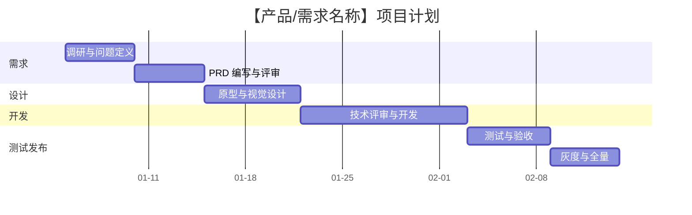
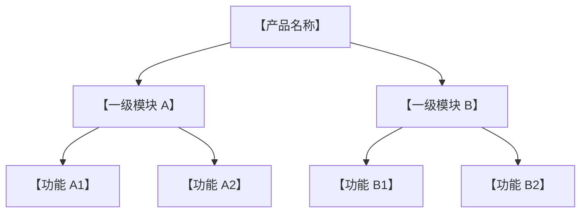
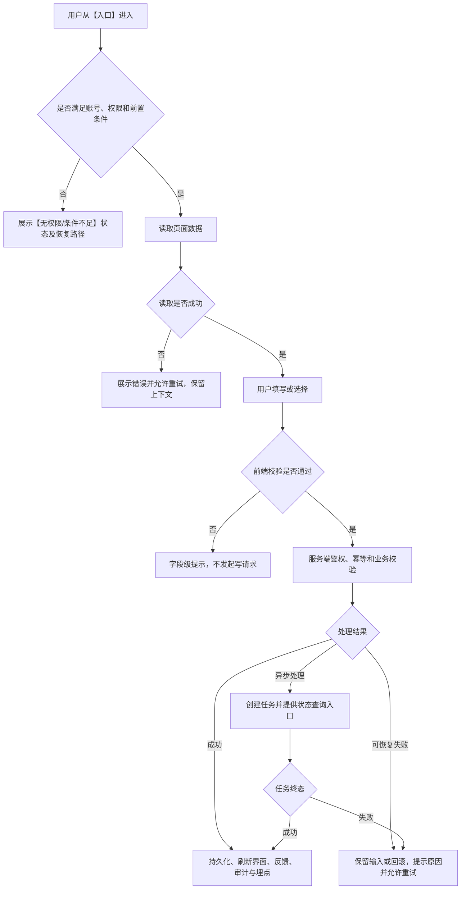

# 《传统产品 PRD 模板》

> **适用范围：**适用于 Web、桌面端、移动端及跨端产品的传统产品需求文档。
>
> **交付对象：**产品、设计、前端、后端、测试、数据、运维、安全及项目管理人员。
>
> **占位说明：**正文中的 `【】` 为待填写内容，`[ ]` 为待完成事项；交付评审前应填写完毕，无法确认的内容必须移入“待确认事项”，不得自行补全。影响 P0 主链路、权限、数据口径、验收阈值、隐私安全或发布回滚的未决项属于阻塞项，关闭前文档不得进入“已通过”或“开发中”。
>
> **信息定性：**事实应标注证据来源；推测应标注验证方式；主观判断应注明决策人；未知事项应注明 Owner 与最晚确认时间。

## 填写原则

1. 先说明用户问题与产品目标，再描述解决方案，不用功能数量代替产品价值。
2. 同一概念、字段、状态、权限、指标只保留一个权威定义，其他章节通过编号引用。
3. 每个功能必须覆盖正常、加载、空、失败、无权限、重复提交、并发冲突及恢复路径；不适用项须说明原因。
4. 每个写操作必须明确前置条件、校验、服务端鉴权、幂等或版本控制、成功刷新、失败回滚、审计及埋点。
5. 原型只表达界面，不替代业务规则、字段规则、接口语义、异常处理和验收标准。
6. 指标必须包含定义、基线、目标、周期、数据源和 Owner；没有数据时写“待测量”，不得虚构数值。

---

## 一、版本修订记录

**文档基本信息：**

| 项目 | 内容 |
|---|---|
| 文档名称 | 【产品/系统名称】·《【需求名称】PRD》 |
| 需求 ID | 【PRD-YYYY-编号】 |
| 所属产品 / 模块 | 【一级模块 / 二级模块】 |
| 需求类型 | 【新产品 / 新功能 / 功能改造 / 缺陷修复 / 实验】 |
| 优先级 | 【P0 / P1 / P2】；依据：【用户影响、业务时效与风险】 |
| 目标端 | 【Web / Windows / macOS / iOS / Android / H5】 |
| 计划版本 | 【Vx.y.z】 |
| 计划上线时间 | 【YYYY-MM-DD】 |
| 文档状态 | 【草稿 / 待评审 / 已通过 / 开发中 / 测试中 / 已上线 / 已废弃】 |
| 负责人 | 产品：【】；设计：【】；前端：【】；后端：【】；测试：【】；数据：【】；运维/安全：【】 |
| 关联材料 | 原型：【链接】；设计稿：【链接】；技术方案：【链接】；接口文档：【链接】；数据看板：【链接】 |
| 最后更新 | 【YYYY-MM-DD HH:mm】 |

### 1.1 修订记录

| 版本 | 日期 | 修改人 | 修订类型 | 变更摘要 | 影响范围 | 是否需重新评审 |
|---|---|---|---|---|---|---|
| v0.1 | 【YYYY-MM-DD】 | 【】 | 新建 | 创建初稿 | 产品、设计、研发、测试 | 是 |
| 【】 | 【】 | 【】 | 【新增 / 修改 / 删除 / 澄清】 | 【具体变更及原因】 | 【页面 / 接口 / 数据 / 排期 / 测试】 | 【是 / 否】 |

#### 1.1.1 评审与决策记录

| 评审轮次 | 日期 | 参会角色 | 结论 | 关键决策 | 未决事项 | Owner | 截止时间 |
|---|---|---|---|---|---|---|---|
| 【第 1 轮】 | 【】 | 【】 | 【通过 / 有条件通过 / 退回】 | 【】 | 【】 | 【】 | 【】 |

#### 1.1.2 待确认事项

| 编号 | 事项 | 当前信息性质 | 影响 | 阻塞级别 | 阻塞阶段 | 验证方式 / 备选方案 | Owner | 最晚确认时间 | 状态 | 关闭证据 |
|---|---|---|---|---|---|---|---|---|---|---|
| O-01 | 【】 | 【合理推测 / 主观判断 / 暂无法核实】 | 【范围 / 设计 / 技术 / 排期 / 合规】 | 【Blocker / P0 / P1 / P2】 | 【评审 / 设计 / 开发 / 提测 / 发布】 | 【】 | 【】 | 【】 | 【Open / Closed】 | 【决策记录、数据或验收链接】 |

**阻塞规则：**P0 主链路、权限模型、数据权威口径、验收阈值、隐私安全及发布回滚条件未确认时，相关评审不得通过、相关实现不得开始。非阻塞未决项若带入下一阶段，须记录风险接受人、适用期限和关闭证据。

### 1.2 甘特图

> 甘特图必须与项目计划表保持一致。日期、负责人、依赖或范围发生变化时，应同步更新修订记录。

#### 1.2.1 项目计划

| 阶段 | 任务 | 交付物 | 开始时间 | 结束时间 | 前置依赖 | Owner | 状态 | 完成门槛 |
|---|---|---|---|---|---|---|---|---|
| 需求 | 调研与问题定义 | 调研结论、问题陈述 | 【】 | 【】 | 无 | 【】 | 【未开始 / 进行中 / 已完成 / 阻塞】 | 事实、假设与待确认项已区分 |
| 需求 | PRD 编写与评审 | 已通过 PRD | 【】 | 【】 | 调研完成 | 【】 | 【】 | 范围、规则、验收标准已确认 |
| 设计 | 原型与视觉设计 | 原型、设计稿、标注 | 【】 | 【】 | PRD 初审 | 【】 | 【】 | 正常及异常状态齐全 |
| 技术 | 技术评审与开发 | 技术方案、可运行版本 | 【】 | 【】 | PRD / 设计评审 | 【】 | 【】 | 接口、数据、权限与监控完成 |
| 测试 | 测试与验收 | 测试报告、验收记录 | 【】 | 【】 | 提测版本 | 【】 | 【】 | P0/P1 用例通过，阻断问题清零 |
| 发布 | 灰度与全量 | 发布记录、监控看板 | 【】 | 【】 | 验收通过 | 【】 | 【】 | 达到灰度门槛且具备回滚能力 |
| 复盘 | 效果评估 | 复盘报告、后续计划 | 【】 | 【】 | 上线并达到观察周期 | 【】 | 【】 | 指标结论及偏差原因可追溯 |

#### 1.2.2 甘特图示例

> 下列日期仅用于保证 Mermaid 示例可渲染，使用时必须替换为真实计划日期。

#### 1.2.3 发布门禁与回滚

| 阶段 | 覆盖范围 | 进入条件 | 最短观察窗口 | 最小样本量 | 观察指标 ID | 数据源 / 延迟要求 | 判定时间点 | 通过条件 | 暂停 / 回滚条件 | Owner |
|---|---|---|---|---|---|---|---|---|---|---|
| 内部验证 | 【内部账号 / 测试环境】 | 【】 | 【】 | 【】 | 【引用 2.1.3 / 4.2 指标】 | 【】 | 【】 | 【】 | 【】 | 【】 |
| 灰度发布 | 【租户 / 用户 / 比例】 | 【】 | 【】 | 【】 | 【成功率、错误率、性能、投诉对应的指标 ID】 | 【数据完整率、最大延迟】 | 【】 | 【】 | 【阈值及处理动作】 | 【】 |
| 全量发布 | 【100% 目标用户】 | 【】 | 【】 | 【】 | 【】 | 【】 | 【】 | 【】 | 【】 | 【】 |

**放量规则：**未达到最短观察窗口或最小样本量、指标数据超过允许延迟、数据完整性不达标时，不得自动扩大灰度范围。人工例外决策须记录依据、风险接受人、有效期和复核时间。

---

## 二、产品概述

### 2.1 产品介绍

#### 2.1.1 产品背景

**现状说明：**【用 2-5 段说明目标用户当前如何完成任务、存在哪些问题、问题发生频率及不处理的成本。】

| 编号 | 信息 / 判断 | 定性 | 证据来源 | 可信度 | 对需求的影响 | 后续动作 |
|---|---|---|---|---|---|---|
| BG-01 | 【已观察到的问题】 | 已核实事实 | 【数据看板 / 访谈记录 / 客诉 / 竞品公开资料】 | 【高 / 中 / 低】 | 【】 | 【】 |
| BG-02 | 【对根因的解释】 | 合理推测 | 【现有线索】 | 【】 | 【】 | 【如何验证、何时验证】 |
| BG-03 | 【尚未掌握的信息】 | 暂无法核实 | 无 | — | 【】 | 【Owner 与截止时间】 |

**问题陈述：**【目标用户】在【触发场景】需要完成【核心任务】，但由于【已核实的阻碍】，导致【可衡量的损失或风险】。本需求拟验证【核心解法假设】，不预设尚未验证的结果。

#### 2.1.2 产品机遇

| 机遇类型 | 机遇描述 | 证据 / 信号 | 时间窗口 | 不行动的影响 | 置信度 |
|---|---|---|---|---|---|
| 用户机遇 | 【未被满足的需求】 | 【】 | 【】 | 【】 | 【高 / 中 / 低】 |
| 市场机遇 | 【市场变化、竞品空白或政策变化】 | 【】 | 【】 | 【】 | 【】 |
| 商业机遇 | 【收入、留存、成本或效率机会】 | 【】 | 【】 | 【】 | 【】 |
| 技术机遇 | 【技术成熟度、基础设施或数据能力变化】 | 【】 | 【】 | 【】 | 【】 |

**为什么是现在：**【说明当前时间点相较过去的新增条件；如依据不足，明确写为待验证假设。】

**方案比较：**

| 方案 | 核心做法 | 用户收益 | 业务收益 | 成本 / 风险 | 预计工作量 | 结论 |
|---|---|---|---|---|---|---|
| A：完整方案 | 【】 | 【】 | 【】 | 【】 | 【S / M / L / XL】 | 【采用 / 暂缓 / 否决】 |
| B：最小可行方案 | 【】 | 【】 | 【】 | 【】 | 【】 | 【】 |
| C：不开发 / 流程替代 | 【】 | 【】 | 【】 | 【】 | 【】 | 【】 |

#### 2.1.3 产品价值

**一句话价值主张：**【产品/功能】帮助【目标用户】在【场景】下，以【关键机制】完成【可衡量结果】，同时避免【主要成本或风险】。

| 价值对象 | 当前问题 | 提供的价值 | 价值衡量方式 | 证据状态 |
|---|---|---|---|---|
| 用户 | 【】 | 【效率、成功率、体验、风险降低】 | 【】 | 【已验证 / 待验证】 |
| 客户 / 购买者 | 【】 | 【ROI、管理、合规】 | 【】 | 【】 |
| 业务 | 【】 | 【增长、留存、收入、降本】 | 【】 | 【】 |
| 平台 / 组织 | 【】 | 【能力复用、数据沉淀、治理】 | 【】 | 【】 |

**目标与成功指标：**

| 目标 | 指标及计算口径 | 基线 | 目标值 | 统计周期 | 数据来源 | Owner |
|---|---|---|---|---|---|---|
| 核心结果目标 | 【分子 / 分母、去重及成功判定】 | 【实际值 / 待测量】 | 【】 | 【】 | 【】 | 【】 |
| 关键过程目标 | 【漏斗步骤与转化定义】 | 【】 | 【】 | 【】 | 【】 | 【】 |
| 质量护栏 | 【错误率、耗时、投诉率或风险率】 | 【】 | 【上限】 | 【】 | 【】 | 【】 |

**范围与非目标：**

| 本期范围（In scope） | 本期不做（Out of scope） | 后续版本 / 外部依赖 |
|---|---|---|
| 【可独立验收的交付能力】 | 【明确排除的能力及原因】 | 【二期能力、外部系统、组织依赖】 |

### 2.2 产品用户

#### 2.2.1 用户类型

| 用户类型 / 角色 | 识别条件 | 使用场景 | 核心任务（JTBD） | 主要痛点 | 使用频率 | 成功标准 | 权限级别 |
|---|---|---|---|---|---|---|---|
| 主要用户 | 【】 | 【】 | 当【场景】时，我想要【任务】，以便【结果】 | 【】 | 【】 | 【】 | 【】 |
| 次要用户 | 【】 | 【】 | 【】 | 【】 | 【】 | 【】 | 【】 |
| 管理 / 审批用户 | 【】 | 【】 | 【】 | 【】 | 【】 | 【】 | 【】 |
| 外部 / 访客用户 | 【】 | 【】 | 【】 | 【】 | 【】 | 【】 | 【】 |

**用户准入与排除规则：**【说明账号状态、组织归属、套餐、认证、年龄、地区或其他限制；不适用则说明原因。】

#### 2.2.2 地域分布

| 地域 / 市场 | 用户占比或规模 | 数据来源与日期 | 语言 | 时区 | 货币 / 单位 | 网络特征 | 法规 / 合规要求 | 产品差异 |
|---|---|---|---|---|---|---|---|---|
| 【国家 / 地区】 | 【实际值 / 待测量】 | 【】 | 【】 | 【】 | 【】 | 【】 | 【】 | 【】 |

**地域结论：**【明确哪些差异会影响功能、文案、日期、货币、数据存储、内容审核、支付或发布节奏。】

### 2.3 用户需求

#### 2.3.1 需求来源与证据

| 来源 | 样本 / 时间范围 | 原始信号 | 可核实结论 | 尚不能推出的结论 | 材料链接 |
|---|---|---|---|---|---|
| 用户访谈 | 【n=；日期】 | 【】 | 【】 | 【】 | 【】 |
| 行为数据 | 【口径；日期】 | 【】 | 【】 | 【】 | 【】 |
| 客服 / 销售反馈 | 【工单数；日期】 | 【】 | 【】 | 【】 | 【】 |
| 竞品 / 市场 | 【样本；日期】 | 【】 | 【】 | 【】 | 【】 |

#### 2.3.2 需求清单与优先级

| 需求 ID | 用户 / 场景 | 用户需求 | 当前替代方案 | 痛点 / 风险 | 期望结果 | 优先级 | 优先级依据 | 对应功能 |
|---|---|---|---|---|---|---|---|---|
| UR-01 | 【】 | 作为【角色】，我希望【动作】，从而【结果】 | 【】 | 【】 | 【可观察结果】 | 【P0 / P1 / P2】 | 【影响、频率、证据、成本】 | 【F-01】 |

#### 2.3.3 关键用户旅程

| 阶段 | 用户目标 | 用户动作 | 系统响应 | 情绪 / 阻碍 | 中断条件 | 恢复路径 | 对应功能 / 埋点 |
|---|---|---|---|---|---|---|---|
| 到达 | 【】 | 【】 | 【】 | 【】 | 【无权限 / 链接失效等】 | 【】 | 【】 |
| 处理 | 【】 | 【】 | 【】 | 【】 | 【校验 / 冲突 / 网络失败】 | 【】 | 【】 |
| 完成 | 【】 | 【】 | 【】 | 【】 | 【异步失败等】 | 【】 | 【】 |

### 2.4 功能清单

| 功能 ID | 一级模块 | 二级功能 | 功能说明 | 目标用户 | 对应需求 | 优先级 | 本期范围 | 依赖 | 计划版本 | 状态 | 详细章节 |
|---|---|---|---|---|---|---|---|---|---|---|---|
| F-01 | 【账号】 | 【登录】 | 【一句话说明】 | 【】 | UR-01 | P0 | 【包含 / 不包含及边界】 | 【】 | 【】 | 【待设计 / 待开发 / 已完成】 | 3.1.1 |
| F-02 | 【账号】 | 【注册】 | 【一句话说明】 | 【】 | 【】 | 【】 | 【】 | 【】 | 【】 | 【】 | 3.1.2 |

**功能优先级规则：**【说明 P0/P1/P2 的定义及裁决人。P0 应是版本不可缺失且具备证据支持的能力，不等同于“提出者认为重要”。】

### 2.5 产品架构

#### 2.5.1 功能架构

| 模块 | 核心职责 | 输入 | 输出 | 上下游模块 | 外部依赖 | Owner |
|---|---|---|---|---|---|---|
| 【】 | 【】 | 【】 | 【】 | 【】 | 【】 | 【】 |

#### 2.5.2 信息架构与入口

| 入口 | 前置条件 | 页面 / 路由 | 初始参数 | 默认状态 | 返回 / 关闭行为 | 权限要求 |
|---|---|---|---|---|---|---|
| 【导航菜单】 | 【】 | `【/path】` | 【】 | 【】 | 【是否保留筛选、页码和滚动位置】 | 【】 |
| 【消息 / 待办深链】 | 【对象存在】 | `【/path?id=】` | 【】 | 【】 | 【】 | 【】 |

#### 2.5.3 系统与数据边界

| 系统 / 服务 | 归属 | 提供能力 / 数据 | 交互方式 | 数据权威方 | 失败影响 | 降级方案 |
|---|---|---|---|---|---|---|
| 【本产品服务】 | 【团队】 | 【】 | 【API / 消息 / 文件】 | 【】 | 【】 | 【】 |
| 【第三方系统】 | 【供应方】 | 【】 | 【】 | 【】 | 【】 | 【】 |

### 2.6 专有名词解释

| 名词 / 缩写 | 英文全称 | 定义 | 使用边界 / 非本义 | 示例 | 权威来源 |
|---|---|---|---|---|---|
| 【】 | 【】 | 【一个概念只保留一个定义】 | 【避免与相近概念混淆】 | 【】 | 【业务规则 / 技术文档 / 法规】 |

---

## 三、功能说明

### 3.1 功能详细说明

> 每个独立页面、抽屉、弹窗、流程或后台任务复制一份“3.1.x”结构。`3.1.1` 可用于登录，`3.1.2` 可用于注册，其余功能依次编号，不使用重复编号。

> 功能内编号必须在全文唯一，统一采用 `<功能 ID>-<类型>-<序号>`，例如 `F-01-S-01`、`F-01-BR-01`、`F-01-API-01`、`F-01-AC-01`。跨章节引用必须使用完整编号，不得省略功能前缀。

#### 3.1.1 【功能名称，例如：登录】

| 项目 | 内容 |
|---|---|
| 功能 ID | 【F-01】 |
| 功能名称 | 【登录】 |
| 功能定位 | 【本功能解决的核心任务，以及明确不负责的事项】 |
| 目标用户 | 【】 |
| 入口 / 路由 | 【】 |
| 前置条件 | 【账号、权限、对象状态、网络及外部依赖】 |
| 触发条件 | 【】 |
| 成功结果 | 【界面状态、持久化结果、后续可达页面、埋点】 |
| 优先级 / 版本 | 【】 |
| 依赖项 | 【页面、接口、配置、第三方、组织协作】 |

##### a）原型

**原型信息：**

| 原型项 | 内容 |
|---|---|
| 原型链接 / 文件 | 【链接或相对路径】 |
| 页面 / 画板名称 | 【】 |
| 原型版本 | 【】 |
| PRD 版本 | 【】 |
| 设计稿版本 | 【】 |
| 最新冲突决策记录 | 【评审记录链接 / 决策 ID / 版本】 |
| 最后更新时间 | 【】 |
| 设计基准 | 【端、分辨率、缩放比例】 |
| 对应设计规范 | 【链接或章节】 |
| 冲突处理规则 | 明确处理该冲突的最新已批准评审决策优先；PRD 定义业务规则与验收，设计稿定义视觉与已评审交互；冲突必须登记并在相关实现开始前关闭 |

<!-- 在此插入原型图、流程截图或链接。图片应能看清真实界面，不用示意图替代最终原型。 -->

**页面整体布局：**

| 区域 | 职责与内容 | 位置 / 尺寸 | 固定 / 滚动规则 | 数据来源 | 状态与响应式规则 |
|---|---|---|---|---|---|
| 应用框架 | 【顶部栏、侧栏、主内容区】 | 【明确 px、最小/最大宽度或栅格】 | 【fixed / sticky / 独立滚动 / 内容流】 | 【】 | 【断点及降级】 |
| 页面头 | 【标题、说明、主操作】 | 【】 | 【】 | 【】 | 【长文本、无权限】 |
| 业务内容区 | 【表单、列表、详情、画布】 | 【】 | 【】 | 【】 | 【加载、空、失败】 |
| 底部操作区 | 【取消、保存、提交】 | 【】 | 【】 | — | 【提交中、失败、窄屏】 |
| 全局浮层 | 【弹窗、抽屉、Popover、通知】 | 【宽高、层级、内部滚动】 | 【打开、遮罩、Esc、关闭规则】 | 【】 | 【未保存、权限变化】 |

**页面状态：**

| 状态 | 触发条件 | 页面表现 | 可执行操作 | 恢复 / 离开后的规则 |
|---|---|---|---|---|
| 初始 / 默认 | 【】 | 【】 | 【】 | 【】 |
| 加载中 | 【】 | 【骨架屏 / Loading；是否阻断】 | 【】 | 【超时规则】 |
| 无数据 | 【默认无记录】 | 【正式空态文案与引导】 | 【】 | 【】 |
| 筛选无结果 | 【有筛选但无匹配】 | 【与默认空态区分】 | 【重置筛选】 | 【】 |
| 失败 | 【接口 / 网络 / 外部依赖失败】 | 【错误文案】 | 【重试 / 返回】 | 【是否保留输入】 |
| 无权限 | 【菜单 / 操作 / 数据权限不足】 | 【隐藏、禁用或无权限页】 | 【申请权限 / 返回】 | 【】 |

##### b）功能说明

**场景与用户故事：**

| 场景 ID | 优先级 | 用户故事 | 前置条件 | 触发入口 | 成功标准 | 异常 / 边界 |
|---|---|---|---|---|---|---|
| F-01-S-01 | P0 | 作为【角色】，我希望【动作】，从而【可衡量结果】 | 【】 | 【】 | 【可观察且可验证】 | 【】 |

**功能点清单：**

| 功能点 ID | 功能点 | 需求描述 | 展示条件 | 输入 | 系统处理 | 输出 / 反馈 | 不做事项 |
|---|---|---|---|---|---|---|---|
| F-01-FP-01 | 【】 | 【使用确定性语言描述】 | 【权限 + 状态】 | 【】 | 【】 | 【】 | 【】 |

**字段 / 表格列 / 表单项：**

| 字段名称 | 字段 key | 类型 / 格式 | 必填 | 读写 | 默认值 | 数据来源 | 展示规则 | 校验规则 | 脱敏 / 权限 | 示例 |
|---|---|---|---|---|---|---|---|---|---|---|
| 【名称】 | `name` | `string`，长度【】 | 是 | 写 | 【】 | 【用户输入 / API】 | 【空值、超长、换行、复制】 | 【前端预校验；服务端最终校验】 | 【】 | 【】 |
| 【状态】 | `status` | `enum` | 是 | 读 / 写 | 【】 | 【】 | 【代码值与显示文案】 | 【允许值及转换条件】 | 【】 | 【】 |

**操作与交互规则：**

| 操作 ID | 用户动作 | 前置条件 | 系统处理 | 成功反馈 | 失败 / 取消 | 防重复 / 并发 | 权限 / 审计 |
|---|---|---|---|---|---|---|---|
| F-01-A-01 | 点击【主操作】 | 【权限、数据和对象状态】 | 【前端校验 → 服务端鉴权与处理】 | 【刷新范围、跳转、正式文案】 | 【保留输入、回滚、重试】 | 【按钮 Loading、幂等键或版本号】 | 【权限码、审计内容】 |
| F-01-A-02 | 执行【危险操作】 | 【】 | 【二次确认；软删除 / 撤销规则】 | 【】 | 【取消后不改变数据】 | 【】 | 【】 |

**确认弹窗：**

| 场景 | 标题 | 正文 | 影响对象 / 范围 | 确认按钮 | 取消按钮 | 是否需二次输入 | 关闭后的状态 |
|---|---|---|---|---|---|---|---|
| 【删除 / 覆盖 / 提交】 | 【】 | 【明确后果和不可逆性】 | 【当前对象 / 已选 N 项 / 当前筛选全量】 | 【】 | 【】 | 【是 / 否；输入内容】 | 【】 |

**业务规则与边界：**

| 规则 ID | 触发条件 | 判定 / 计算规则 | 优先级 / 冲突规则 | 前端表现 | 服务端结果 | 恢复路径 | 验收关联 |
|---|---|---|---|---|---|---|---|
| F-01-BR-01 | 【】 | 如果【条件】，则【确定结果】 | 【】 | 【】 | 【状态 / 错误码】 | 【】 | F-01-AC-01 |
| F-01-BR-02 | 【极值、空值、过期或并发】 | 【】 | 【服务端结果为准】 | 【】 | 【】 | 【】 | 【】 |

**状态机：**

| 状态值 | 显示文案 | 进入条件 | 可执行操作 | 退出 / 迁移条件 | 终态 | 数据权威方 |
|---|---|---|---|---|---|---|
| `draft` | 【草稿】 | 【】 | 【】 | 【】 | 否 | 【服务端】 |
| `processing` | 【处理中】 | 【】 | 【查看 / 取消，如支持】 | 【成功 / 失败 / 超时】 | 否 | 【服务端】 |
| `success` | 【已完成】 | 【】 | 【】 | 【】 | 是 | 【服务端】 |
| `failed` | 【处理失败】 | 【】 | 【查看原因 / 重试】 | 【重试创建新任务】 | 【是 / 否】 | 【服务端】 |

**接口与前后端契约：**

| 接口 ID | 场景 | Method & Path | 鉴权 | 请求关键参数 | 响应关键字段 | 幂等 / 版本 | 错误码与产品语义 | 超时 / 重试 |
|---|---|---|---|---|---|---|---|---|
| F-01-API-01 | 【查询】 | `GET 【/api/v1/...】` | 【权限码】 | 【】 | 【】 | — | 【NOT_FOUND / FORBIDDEN 等】 | 【】 |
| F-01-API-02 | 【提交】 | `POST 【/api/v1/...】` | 【权限码】 | 【】 | 【】 | 【Idempotency-Key / version】 | 【VALIDATION_ERROR / CONFLICT 等】 | 【仅幂等请求可自动重试】 |

**正式文案与反馈：**

| 文案 ID | 位置 / 触发条件 | 类型 | 正式文案 | 变量规则 | 展示时长 / 关闭方式 | 后续动作 |
|---|---|---|---|---|---|---|
| F-01-CP-01 | 【提交成功】 | Toast | 【保存成功】 | 【】 | 【】 | 【刷新 / 跳转】 |
| F-01-CP-02 | 【字段校验失败】 | 字段级错误 | 【】 | 【】 | 修正后消失 | 聚焦首个错误字段 |
| F-01-CP-03 | 【加载失败】 | 页面错误态 | 【加载失败，请重试】 | 【】 | 常驻 | 点击重试 |

**埋点、日志与审计：**

| 事件 / 日志 ID | 触发时机 | 属性 | 去重口径 | 禁止采集 | 用途 | 告警关联 |
|---|---|---|---|---|---|---|
| F-01-EVT-01 | 【页面成功可见】 | 【scene、role、version】 | 【用户 / 会话 / 请求】 | 密码、Token、明文敏感信息 | 【使用量 / 漏斗】 | 【】 |
| F-01-AUD-01 | 【关键写操作完成】 | 【操作人、对象、before、after、requestId、时间】 | 按请求记录 | 【敏感值按规则脱敏】 | 审计追溯 | 【】 |

**验收标准：**

| 验收 ID | Given（前置条件） | When（操作） | Then（可观察结果） | 优先级 | 验证方式 |
|---|---|---|---|---|---|
| F-01-AC-01 | 用户拥有【权限】且【数据状态】 | 执行【操作】 | 界面显示【结果】；服务端数据为【结果】；产生【审计 / 埋点】 | P0 | 【功能 / 接口 / E2E】 |
| F-01-AC-02 | 用户无【权限】 | 访问页面并直接调用写接口 | 前端无可用入口；服务端拒绝；数据不变；记录安全日志 | P0 | 【】 |
| F-01-AC-03 | 网络失败或重复点击 | 提交【操作】 | 输入不丢失；不产生重复数据；可按规则重试 | P0 | 【】 |

##### c）流程图

**流程步骤：**

| 步骤 ID | 执行方 | 前置状态 | 动作 / 处理 | 输入 | 输出 / 新状态 | 失败分支 | 可恢复方式 | 关联规则 / 接口 |
|---|---|---|---|---|---|---|---|---|
| F-01-ST-01 | 用户 | 【】 | 【】 | 【】 | 【】 | 【】 | 【】 | 【F-01-BR-01 / F-01-API-01】 |
| F-01-ST-02 | 系统 | 【】 | 【】 | 【】 | 【】 | 【】 | 【】 | 【】 |

**分支覆盖检查：**首次进入、默认路径、带参数进入、返回 / 刷新、取消、重复提交、校验失败、无权限、数据不存在、并发冲突、网络中断、第三方超时、异步处理中、部分成功、任务终态。

#### 3.1.2 【功能名称，例如：注册】

##### a）原型

【复制 `3.1.1 a）原型` 的完整结构，并替换为本功能的真实原型、布局与页面状态。】

##### b）功能说明

【复制 `3.1.1 b）功能说明` 的完整结构，并将编号前缀替换为本功能 ID，例如 `F-02-BR-01`。不得仅写“同登录”；复用内容应引用明确的公共规则编号，并写清差异。】

##### c）流程图

【复制 `3.1.1 c）流程图` 的完整结构，覆盖本功能的主路径、异常分支、恢复路径及关联规则。】

#### 3.1.3 【其他功能名称】

> 按功能清单顺序继续编号并复制完整结构，例如 `3.1.3`、`3.1.4`。功能清单、产品架构与本章编号必须相互对应；每个功能内的引用 ID 必须使用对应功能前缀。

### 3.2 全局说明

#### 3.2.1 权限说明

> “权限”描述某个主体在什么条件下能对什么资源执行什么动作；前端隐藏或禁用仅是体验控制，服务端必须对每次读取和写入进行最终鉴权。

**角色定义：**

| 角色 | 准入条件 | 默认权限 | 数据范围 | 特殊限制 | 权限来源 |
|---|---|---|---|---|---|
| 【超级管理员】 | 【】 | 【】 | 【全局 / 组织】 | 【系统对象保护】 | 【系统内置】 |
| 【管理员】 | 【】 | 【】 | 【】 | 【】 | 【角色 / 授权】 |
| 【普通成员】 | 【】 | 【】 | 【本人 / 所属组 / 指定对象】 | 【】 | 【】 |
| 【只读角色】 | 【】 | 【查看】 | 【】 | 禁止写入 | 【】 |

**权限矩阵：**

| 资源 | 动作 | 权限码 | 管理员 | 普通成员 | 只读角色 | 数据范围 | 前端表现 | 服务端校验点 |
|---|---|---|---|---|---|---|---|---|
| 【对象】 | 查看列表 | `【entity.read】` | 是 | 【】 | 【】 | 【】 | 【菜单 / 页面 / 无权限态】 | `GET 【...】` |
| 【对象】 | 新增 | `【entity.create】` | 是 | 【】 | 否 | 【】 | 【隐藏 / 禁用并说明原因】 | `POST 【...】` |
| 【对象】 | 编辑 | `【entity.update】` | 是 | 【】 | 否 | 【】 | 【隐藏 / 禁用并说明原因】 | `PATCH 【...】` |
| 【对象】 | 删除 | `【entity.delete】` | 【】 | 【】 | 否 | 【】 | 【二次确认】 | `DELETE 【...】` |
| 【对象】 | 导出 | `【entity.export】` | 【】 | 【】 | 否 | 【】 | 【审批 / 水印 / 任务入口】 | `POST 【.../exports】` |

**原子权限规则：**查看、新增、编辑、删除、导出等动作必须分别定义权限码、数据范围、审批、审计和服务端校验点；单条与批量操作的策略不一致时也须拆行，不得使用 `write` 或 `delete/export` 之类的合并权限替代最小权限设计。

**权限边界：**菜单权限、页面权限、操作权限、数据权限、字段权限、对象级权限、临时权限、权限中途变更、直达链接越权、接口越权、缓存刷新、审计记录。

#### 3.2.2 授权说明

> “授权”描述权限如何授予、变更、审批、到期和撤销。若产品不存在授权流程，应写明权限由哪个外部系统或内置角色统一管理。

| 授权项 | 授权主体 | 被授权主体 | 资源 / 动作 | 作用范围 | 生效方式 | 有效期 | 审批人 | 撤销与回收 | 审计 |
|---|---|---|---|---|---|---|---|---|---|
| 【角色授权】 | 【管理员 / 系统】 | 【用户 / 角色 / 组织】 | 【】 | 【全局 / 组织 / 对象】 | 【即时 / 审批后 / 下次登录】 | 【永久 / 截止时间】 | 【】 | 【主动撤销 / 到期 / 离职】 | 【记录前后值】 |

**授权规则：**

| 规则 ID | 场景 | 规则 | 冲突处理 | 用户反馈 | 服务端行为 |
|---|---|---|---|---|---|
| AUTH-01 | 多角色叠加 | 【并集 / 交集 / 显式拒绝优先】 | 【】 | 【】 | 【】 |
| AUTH-02 | 授权过期 | 【】 | 【】 | 【】 | 【立即失效、刷新 Token / 缓存】 |
| AUTH-03 | 操作中撤权 | 【】 | 【】 | 【保留未提交内容 / 中断任务】 | 【重新鉴权】 |

#### 3.2.3 异常说明

| 异常 ID | 场景 | 触发条件 / 错误码 | 用户可见表现 | 数据处理 | 重试 / 恢复 | 日志 / 告警 |
|---|---|---|---|---|---|---|
| EX-01 | 首次加载失败 | 【超时 / INTERNAL_ERROR】 | 页面错误态 + “重新加载” | 不清空路由和筛选 | 手动重试 | 【】 |
| EX-02 | 网络中断 | 【离线 / 请求失败】 | 明确网络提示 | 不提交或回滚乐观更新；保留输入 | 网络恢复后按规则重试 | 【】 |
| EX-03 | 登录失效 | `UNAUTHENTICATED` | 提示后进入登录页 | 保存允许保留的上下文 | 登录后返回原页面 | 【】 |
| EX-04 | 权限不足 / 变化 | `FORBIDDEN` | 无权限页或操作提示 | 不发生数据变更 | 申请权限 / 返回 | 安全审计 |
| EX-05 | 并发冲突 | `VERSION_CONFLICT` | 提示数据已更新 | 不覆盖新版本 | 刷新、比较或重新提交 | 【】 |
| EX-06 | 部分成功 | 批量任务部分失败 | 显示成功 N、失败 N | 成功项保留，失败项不伪装成功 | 查看 / 下载失败明细并重试 | 【】 |
| EX-07 | 第三方超时 | 【】 | 显示处理中或服务不可用 | 不提前标记成功 | 任务中心查询 / 降级 | 【阈值】 |
| EX-08 | 未知异常 | `INTERNAL_ERROR` | 不暴露堆栈或内部错误 | 生成 `requestId` | 安全重试或联系客服 | error |

**异常文案原则：**说明发生了什么、数据是否已保存、用户下一步能做什么；不得只显示“Error”或无法行动的“操作失败”。

#### 3.2.4 键盘说明

| 场景 | 按键 | 行为 | 生效范围 | 禁用 / 冲突条件 | 焦点与可访问性要求 |
|---|---|---|---|---|---|
| 焦点移动 | `Tab` / `Shift+Tab` | 按视觉与语义顺序移动 | 全局 | 【】 | 焦点样式清晰，不进入不可用控件 |
| 激活控件 | `Enter` / `Space` | 触发当前按钮 / 选项 | 当前焦点控件 | 输入法组合态不触发提交 | 行为与鼠标一致 |
| 关闭浮层 | `Esc` | 关闭最上层可关闭浮层 | 弹窗 / 抽屉 / Popover | 未保存或高风险操作须二次确认 | 关闭后焦点返回触发器 |
| 提交表单 | `【快捷键】` | 【】 | 【】 | 多行输入框 / 输入法 / 提交中 | 必须提供可见按钮作为等价操作 |
| 搜索 | `【快捷键】` | 聚焦搜索框 | 【页面 / 全局】 | 与系统或浏览器快捷键冲突时禁用 | 【】 |

**键盘规则：**禁止焦点陷阱；Modal 打开后焦点进入弹窗并限制在弹窗内；关闭后回到触发控件；快捷键不得覆盖操作系统和浏览器保留键；危险操作不能仅靠单键直接执行。

#### 3.2.5 字段规则

| 字段类型 | 规则 | 空值 / 默认值 | 校验时机 | 错误表现 | 展示 / 存储口径 |
|---|---|---|---|---|---|
| 文本 | 【长度、字符集、前后空格、换行、特殊字符】 | 【空字符串 / null 的区分】 | 【失焦 / 提交 / 服务端】 | 字段级错误 | 【原文 / 规范化后】 |
| 名称 | 【长度、重复、大小写、保留字】 | 【】 | 前端预校验 + 服务端唯一性校验 | 【】 | 【】 |
| 密码 | 【复杂度、重试限制、重置、粘贴与显示规则】 | 不设默认值 | 实时提示 + 服务端校验 | 不泄露具体账号状态 | 使用经安全评审的带盐、抗暴力破解单向哈希；不得可逆加密；日志和埋点禁采集 |
| 密钥 / 可恢复凭证 | 【生成、首次展示、复制、轮换、吊销、过期规则】 | 不设默认值 | 服务端校验权限与状态 | 默认不回显；查看或复制须授权并审计 | 使用密钥管理 / 凭证管理服务加密托管，限制解密权限并支持轮换；日志和埋点禁采集 |
| 数字 | 【最小、最大、精度、负数、千分位】 | 【0 / null】 | 【】 | 【】 | 计算口径以服务端为准 |
| 金额 | 【币种、最小单位、舍入方式】 | 【】 | 【】 | 【】 | 服务端按最小货币单位存储 |
| 日期时间 | 【格式、时区、起止边界、是否含首尾】 | 【】 | 【】 | 【】 | 服务端存 UTC / 时间戳，前端按用户时区展示【如适用】 |
| 枚举 | 代码值与显示文案一一对应 | 【】 | 服务端拒绝未知值 | 【】 | 只传代码值，不传显示文案 |
| 手机 / 邮箱 | 【格式、区号、大小写、验证码规则】 | 【】 | 【】 | 【】 | 【脱敏、加密及可见权限】 |
| 文件 | 【类型、大小、数量、文件名、病毒扫描】 | 无文件 | 选择时 + 上传时 + 服务端 | 逐文件错误 | 【存储、访问签名、保留期】 |
| 搜索 | 【最大长度、精确 / 模糊、大小写、空查询】 | 【默认列表】 | 查询前 | 【】 | 【分词、转义、分页重置】 |

**全局字段约定：**

- 必填项须在标签和校验中一致表达，不以 placeholder 代替字段名称。
- 前端校验用于及时反馈，服务端校验是最终规则；两端规则冲突时不得静默修正。
- 超长文本必须说明换行、省略、Tooltip、复制及导出时的完整值规则。
- 敏感字段必须说明脱敏、查看明文、复制、导出、日志、埋点和审计规则。
- 所有枚举、日期、金额、数量、分页和排序规则应有唯一口径；不允许各页面自行解释。

---

## 四、非功能性需求

### 4.1 性能需求

> 产品负责依据用户任务和业务风险提出目标阈值，技术团队负责评估可行性、成本与方案；两者共同确认最终口径。目标未确认时必须登记为阻塞项，并在相关设计或开发门禁前关闭，不能长期以“待技术确认”代替可验收数值。

| 指标 ID | 场景 / 指标 | 测量起止点 | 数据规模 / 环境 | 目标值 | 分位数 / 成功率 | 超限处理 | 验收方式 |
|---|---|---|---|---|---|---|---|
| PERF-01 | 页面首次可交互 | 从【】到【】 | 【设备、网络、数据量】 | 【目标阈值及业务依据】 | P95 | 【降级 / 告警】 | 【实验室测试 + 真实监控】 |
| PERF-02 | 列表查询 | 请求发出至完整响应 | 【记录数、筛选条件】 | 【】 | P95 / P99 | 【】 | 压测 / APM |
| PERF-03 | 写操作响应 | 点击提交至明确反馈 | 【并发量】 | 【】 | 【】 | 超时后不得误报成功 | 接口测试 / 监控 |
| PERF-04 | 异步任务 | 创建至终态 | 【任务规模】 | 【】 | 【完成率】 | 【排队、限流、重试】 | 压测 / 任务监控 |
| PERF-05 | 容量 | 单次 / 单批 / 峰值并发 | 【】 | 【最大条数 / QPS / 并发】 | 【】 | 明确拒绝并返回可行动错误 | 容量测试 |

**性能口径：**必须注明测试环境与生产环境差异、缓存命中条件、冷启动 / 热启动、网络条件、数据规模及统计周期。平均值不能代替 P95/P99。

### 4.2 监控需求

#### 4.2.1 业务与产品监控

| 指标 | 定义 / 计算口径 | 数据源 | 上报时机 | 看板 | 告警阈值 | Owner |
|---|---|---|---|---|---|---|
| 【核心转化】 | 【分子 / 分母、去重、成功判定】 | 【】 | 【】 | 【链接】 | 【】 | 【】 |
| 【功能使用率】 | 【】 | 【】 | 【】 | 【】 | 【】 | 【】 |

#### 4.2.2 技术与质量监控

| 监控项 | 维度 | 采集方式 | 正常范围 | 告警阈值 / 持续时间 | 告警渠道 | 值班 / 处置人 | Runbook |
|---|---|---|---|---|---|---|---|
| API 成功率 | 接口、版本、租户、地区 | APM / 服务日志 | 【】 | 【】 | 【】 | 【】 | 【链接】 |
| 延迟 | P50 / P95 / P99 | APM | 【】 | 【】 | 【】 | 【】 | 【】 |
| 前端错误 | JS、资源、白屏 | RUM | 【】 | 【】 | 【】 | 【】 | 【】 |
| 异步队列 | 积压、失败、耗时 | 任务系统 | 【】 | 【】 | 【】 | 【】 | 【】 |
| 第三方依赖 | 可用性、超时、限流 | 探针 / 日志 | 【】 | 【】 | 【】 | 【】 | 【】 |
| 安全事件 | 越权、暴力尝试、敏感导出 | 安全日志 | 【】 | 【】 | 【】 | 【】 | 【】 |

**日志要求：**每次请求应具备可关联的 `requestId`；关键写操作可追溯操作人、对象、前后值和结果；日志不得记录密码、Token、完整凭证及未脱敏的敏感信息。

### 4.3 兼容性需求

| 兼容维度 | 支持范围 | 最低版本 / 基准 | 必测场景 | 降级 / 不支持表现 | 验收方式 |
|---|---|---|---|---|---|
| 操作系统 | 【Windows / macOS / iOS / Android / Linux】 | 【】 | 【安装、升级、核心流程】 | 【】 | 真机 / 虚拟机 |
| 浏览器 | 【Chrome / Edge / Safari / Firefox】 | 【】 | 【核心流程、下载、上传、权限】 | 【升级提示】 | 浏览器矩阵回归 |
| 屏幕 / 窗口 | 【最小宽度、基准分辨率、缩放比例】 | 【】 | 【长文本、表格、浮层、键盘】 | 【横向滚动 / 重排】 | 截图 + 交互验收 |
| 网络 | 【正常、弱网、离线、代理】 | 【】 | 【超时、重试、断点恢复】 | 【】 | 网络模拟 |
| 语言 / 地区 | 【语言、时区、货币、RTL】 | 【】 | 【长文案、日期、金额】 | 【】 | 多语言回归 |
| 辅助技术 | 【键盘、屏幕阅读器、高对比度】 | 【目标标准】 | 【焦点、标签、状态表达】 | 【】 | 可访问性检查 |

> “兼容全部主流环境”不可验收。必须列出明确版本、分辨率、设备、例外及不支持时的用户提示。

### 4.4 技术组件需求

| 组件 / 服务 | 用途 | 选型 / 版本 | 责任团队 | 输入 / 输出 | SLA / 容量 | 安全与合规 | 替代 / 降级方案 | 状态 |
|---|---|---|---|---|---|---|---|---|
| 前端框架 / 组件库 | 【】 | 【沿用现有技术栈 / 待评审】 | 【】 | 【】 | 【】 | 【】 | 【】 | 【】 |
| 后端服务 | 【】 | 【】 | 【】 | 【】 | 【】 | 【】 | 【】 | 【】 |
| 数据库 / 缓存 | 【】 | 【】 | 【】 | 【】 | 【】 | 【备份、加密、保留】 | 【】 | 【】 |
| 消息 / 异步任务 | 【】 | 【】 | 【】 | 【】 | 【】 | 【】 | 【】 | 【】 |
| 对象存储 / CDN | 【】 | 【】 | 【】 | 【】 | 【】 | 【签名、过期、地域】 | 【】 | 【】 |
| 第三方 SDK / API | 【】 | 【】 | 【供应方 / 内部 Owner】 | 【】 | 【限流、可用性】 | 【数据出境、隐私】 | 【熔断 / 关闭功能】 | 【】 |

**技术约束与决策：**

| 决策 ID | 问题 | 可选方案 | 选择 | 选择依据 | 代价 / 风险 | 决策人 | 日期 |
|---|---|---|---|---|---|---|---|
| ADR-01 | 【】 | 【A / B / C】 | 【】 | 【已核实事实与约束】 | 【】 | 【】 | 【】 |

**数据与迁移要求：**【说明新增 / 变更字段、历史数据处理、灰度期间兼容、回填、校验、备份、失败补偿及回滚；不涉及则说明原因。】

### 4.5 安全性需求

| 安全领域 | 要求 | 威胁 / 风险 | 控制措施 | 验收方式 | Owner |
|---|---|---|---|---|---|
| 身份认证 | 【登录、会话、MFA、设备 / IP 策略】 | 【冒用、会话劫持】 | 【】 | 【】 | 【】 |
| 权限控制 | 服务端 RBAC / ABAC 与对象级鉴权 | 越权访问 / 写入 | 【最小权限、逐请求鉴权】 | 越权测试 | 【】 |
| 输入与输出 | 【长度、类型、转义、文件扫描】 | 注入、XSS、恶意文件 | 【白名单、参数化、输出编码】 | 安全测试 | 【】 |
| 敏感数据 | 【数据分级、脱敏、加密、复制 / 导出】 | 泄露、滥用 | 【传输 / 静态加密、审批、水印】 | 审计抽检 | 【】 |
| 密钥与凭证 | 【存储、轮换、访问】 | 凭证泄露 | 不写入代码、日志、埋点 | 扫描 / 审计 | 【】 |
| 日志与审计 | 【记录范围、保留期、访问权限】 | 不可追溯 / 日志泄密 | 【防篡改、脱敏】 | 【】 | 【】 |
| 接口安全 | 【签名、限流、防重放、CSRF / CORS】 | 滥用、重放、跨站请求 | 【】 | 接口安全测试 | 【】 |
| 隐私与合规 | 【同意、最小采集、保留、删除、数据地域】 | 违规处理个人信息 | 【】 | 法务 / 合规评审 | 【】 |
| 可用性与恢复 | 【备份、容灾、RTO / RPO】 | 数据丢失、服务中断 | 【】 | 恢复演练 | 【】 |

#### 4.5.1 安全验收用例

| 用例 ID | 前置条件 | 攻击 / 异常操作 | 预期结果 | 证据 |
|---|---|---|---|---|
| SEC-01 | 用户无【对象】权限 | 修改 ID 直接访问或写入 | 服务端拒绝；不泄露对象是否存在；记录安全日志 | 【接口响应 / 日志】 |
| SEC-02 | 用户输入恶意内容 | 提交脚本、注入字符或异常文件 | 输入被拒绝或安全编码；页面不执行；数据不污染 | 【】 |
| SEC-03 | Token / 会话过期 | 重放请求 | 请求被拒绝；不产生数据变更；用户获得可恢复提示 | 【】 |

## 附录：交付前检查清单

- [ ] 文档信息、版本、负责人、优先级、端、关联链接及修订记录完整。
- [ ] 所有事实有来源，假设有验证计划，主观判断有决策人，未知项有 Owner 和期限。
- [ ] 目标指标具备定义、基线、目标、周期、数据源和护栏，没有把点击误写为外部业务成功。
- [ ] In scope、Out of scope、后续版本及外部依赖明确，功能清单与详细章节一一对应。
- [ ] 每个功能均有原型、布局、字段、操作、状态、规则、流程、接口、文案、埋点和验收标准。
- [ ] 默认、加载、空、失败、无权限、重复提交、并发、异步及恢复路径均已定义。
- [ ] 权限与授权已区分；前端表现和服务端鉴权一致；敏感数据规则覆盖展示、复制、导出、日志和埋点。
- [ ] 性能指标、兼容矩阵、监控告警、技术依赖、安全控制、灰度与回滚具备明确验收口径。
- [ ] 所有 `【】` 已填写，或已转为待确认事项；待确认事项均有阻塞级别、阻塞阶段、Owner、期限和关闭证据，所有阻塞项均已关闭。
- [ ] 产品、设计、研发、测试、数据、运维与安全已完成所需评审，结论已记录。
