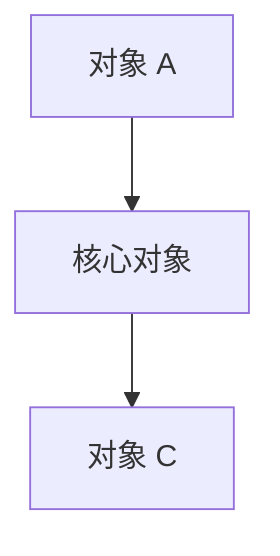

# 《{{本品}}与{{竞品}}竞品分析报告》模版

> 报告日期：{{YYYY-MM-DD}}  
> 本品证据快照：{{日期 / 版本}}  
> 竞品证据快照：{{日期 / 版本}}  
> 报告服务对象：{{产品规划 / 管理层 / 销售 / 融资 / 市场研究}}  
> 决策问题：{{本次报告必须回答的 1～3 个问题}}  
> 非报告范围：{{明确排除的内容}}  
> 配套附件：{{能力矩阵.xlsx / 价格矩阵.xlsx / 访谈记录}}

## 0. 使用说明

本模板用于形成可追溯、可更新、可直接用于决策的竞品分析。使用时先定义决策问题，再收集证据，最后形成判断；不要先写结论再寻找支持材料。

### 0.1 推荐交付形态

| 产物 | 适用内容 | 是否必需 |
|---|---|---|
| Markdown / 飞书文档 | 执行摘要、架构图、业务链、关键判断、风险与结论 | 必需 |
| Excel / 飞书表格 | 多维功能、价格、证据、来源、状态筛选和公式计算 | 功能或价格项较多时必需 |
| 演示文稿 | 管理层会议、融资或销售培训的一页式表达 | 按需 |
| 原始证据库 | 截图、录屏、网页存档、测试记录和访谈原文 | 必需，但不直接对外 |

### 0.2 证据等级

| 等级 | 定义 | 可使用的表述 | 禁止表述 |
|---|---|---|---|
| A：产品事实 | 实际产品页面、操作记录、订单/价格页、官方协议中的明确事实 | “页面显示”“实测已完成”“该版本支持” | 超出样本版本或流程范围的泛化结论 |
| B：官方自述 | 官网、帮助中心、官方博客、新闻稿、鉴证/认证展示 | “官方称”“官网展示” | 当作独立审计或第三方证实 |
| C：合理推断 | 由多项事实形成的定位、战略、体验或商业判断 | “合理推断”“分析判断” | 写成产品官方定位或确定市场事实 |
| D：待核实 | 一侧未覆盖、规则不完整、动态页面未回读或来源冲突 | “当前材料未确认” | “没有”“不支持”“明确落后” |

### 0.3 对比状态

| 状态 | 判定规则 | 使用场景 |
|---|---|---|
| 核心同构 | 双方解决同一用户任务，关键闭环基本一致 | 不再做简单有无比较，转向深度和效率验证 |
| 本品特色 | 本品有直接证据，竞品无同等深度证据，且对目标用户有价值 | 销售差异化，但需陈述证据边界 |
| 竞品证据更强 | 竞品有明确证据，本品当前材料不足 | 先核实本品，不直接记为缺失 |
| 路径差异 | 双方都解决问题，但组织、交互、收费或技术路径不同 | 分析与目标用户的匹配度 |
| 明确缺失 | 一方有能力，另一方存在明确“不支持/不存在”的证据 | 极少使用，需附双方证据 |
| 待核实 | 证据不足或口径不一致 | 建立核实清单，不纳入确定结论 |

### 0.4 质量红线

- 不用功能清单总数直接判断谁更强，除非拆分颗粒度完全一致。
- 不把“材料没写”解释为“产品没有”。
- 不把官网用户数、效率、鉴证/认证或市场排名当成独立事实。
- 不以单张截图推断完整状态机、权限规则或异常流程。
- 不把代理、云服务等异质商品只按价格横比。
- 不将限时活动价格写成长期标准价。
- 不把外部合作伙伴或跳转服务写成内部自研能力。
- 不输出无法由证据回溯的评分或小数精确排名。

## 1. 执行摘要

### 1.1 核心结论

用 5～7 条结论回答决策问题。每条按以下格式：

1. **{{结论标题}}。** {{事实依据}}；{{对业务的含义}}。【{{A/B/C/D}}】
2. **{{结论标题}}。** {{事实依据}}；{{对业务的含义}}。【{{A/B/C/D}}】
3. **{{结论标题}}。** {{事实依据}}；{{对业务的含义}}。【{{A/B/C/D}}】

### 1.2 一页式竞争判断

| 竞争维度 | {{本品}} | {{竞品}} | 结论性质 | 对目标客户的含义 |
|---|---|---|---|---|
| 核心资产 | {{}} | {{}} | {{核心同构/路径差异}} | {{}} |
| 用户与场景 | {{}} | {{}} | {{}} | {{}} |
| 产品能力 | {{}} | {{}} | {{}} | {{}} |
| 团队与安全 | {{}} | {{}} | {{}} | {{}} |
| 自动化与生态 | {{}} | {{}} | {{}} | {{}} |
| 商业化与价格 | {{}} | {{}} | {{}} | {{}} |
| 服务与信任 | {{}} | {{}} | {{}} | {{}} |

### 1.3 暂时不能下的结论

- {{结论 1}}：缺少 {{证据}}。
- {{结论 2}}：双方口径在 {{维度}} 不一致。
- {{结论 3}}：当前只有官方自述，缺少独立验证。

## 2. 研究目标、范围与方法

### 2.1 决策问题

1. {{管理层需要据此决定什么？}}
2. {{产品规划需要理解什么？}}
3. {{销售或融资材料需要证明什么？}}

### 2.2 研究范围

| 项目 | 内容 |
|---|---|
| 产品 | {{本品版本}} vs {{竞品版本}} |
| 用户 | {{核心用户}} |
| 场景 | {{核心场景}} |
| 地区 | {{国家/地区}} |
| 时间 | {{快照日期}} |
| 包含 | {{定位、功能、价格、商业、体验、安全、生态等}} |
| 排除 | {{路线图、技术黑盒、未授权操作等}} |

### 2.3 资料来源

| 编号 | 来源 | 类型 | 日期/版本 | 可验证内容 | 局限 | 证据等级 |
|---|---|---|---|---|---|---|
| S-001 | {{客户端操作记录}} | 一手产品 | {{}} | {{}} | {{}} | A |
| S-002 | {{官网 URL}} | 官方公开 | {{}} | {{}} | {{官方自述/动态页面}} | B |
| S-003 | {{第三方报告}} | 第三方 | {{}} | {{}} | {{样本/方法}} | {{}} |

### 2.4 研究限制

- {{版本、账号权限或地区限制}}
- {{未执行的高影响操作}}
- {{无法独立核验的官方数据}}
- {{不同清单颗粒度或统计口径}}
- {{价格、汇率与活动的时点性}}

## 3. 市场问题与品类定义

### 3.1 用户问题

描述用户为什么需要此类产品，避免无来源的市场规模数字。


### 3.2 品类演进

| 层次 | 用户价值 | 代表能力 |
|---|---|---|
| 基础工具 | {{}} | {{}} |
| 运营工作台 | {{}} | {{}} |
| 团队治理平台 | {{}} | {{}} |
| 自动化/生态平台 | {{}} | {{}} |

### 3.3 竞争集合

| 产品 | 直接/间接竞品 | 纳入原因 | 排除原因 |
|---|---|---|---|
| {{竞品 A}} | {{}} | {{}} | {{}} |

## 4. 公司与产品概览

### 4.1 公司边界

| 维度 | {{本品}} | {{竞品}} | 证据与边界 |
|---|---|---|---|
| 开发/运营主体 | {{}} | {{}} | {{}} |
| 销售/代理主体 | {{}} | {{}} | {{不要把授权代理商写成产品所有者}} |
| 成立/总部 | {{}} | {{}} | {{}} |
| 融资/规模 | {{}} | {{}} | {{未核实则留空}} |

### 4.2 产品定位

| 维度 | {{本品}} | {{竞品}} |
|---|---|---|
| 官方定位原文（≤25 字） | {{}} | {{}} |
| 分析定位 | {{}} | {{}} |
| 核心资产 | {{}} | {{}} |
| 核心用户 | {{}} | {{}} |
| 核心场景 | {{}} | {{}} |
| 收费边界 | {{}} | {{}} |

明确区分官方定位与分析定位，后者标为合理推断。

## 5. 用户与 JTBD

| 用户角色 | 触发情境 | 想完成的任务 | 成功标准 | {{本品}}支撑 | {{竞品}}支撑 | 判断 |
|---|---|---|---|---|---|---|
| {{角色}} | {{}} | {{}} | {{}} | {{}} | {{}} | {{}} |

## 6. 产品架构对比

### 6.1 {{本品}}架构

> 【插图占位】本地版使用证据库中的可访问相对路径；飞书版上传已脱敏的图片块，插入后删除本占位文本。不得把本地绝对路径直接写入飞书。

{{架构解释：核心对象、支撑层、交易层、服务层。}}

### 6.2 {{竞品}}架构

> 【插图占位】本地版使用证据库中的可访问相对路径；飞书版上传已脱敏的图片块，插入后删除本占位文本。不得把本地绝对路径直接写入飞书。

{{架构解释。}}

### 6.3 分层比较

| 架构层 | {{本品}} | {{竞品}} | 差异含义 | 证据等级 |
|---|---|---|---|---|
| 接入层 | {{}} | {{}} | {{}} | {{}} |
| 核心业务层 | {{}} | {{}} | {{}} | {{}} |
| 治理层 | {{}} | {{}} | {{}} | {{}} |
| 自动化层 | {{}} | {{}} | {{}} | {{}} |
| 商业层 | {{}} | {{}} | {{}} | {{}} |
| 生态层 | {{}} | {{}} | {{}} | {{}} |

## 7. 产品结构与关键链路

### 7.1 核心数据对象



### 7.2 信息架构

| 一级模块 | {{本品}} | {{竞品}} | 用户心智差异 |
|---|---|---|---|
| {{模块}} | {{}} | {{}} | {{}} |

### 7.3 关键业务链路

按相同任务画双方链路，避免只列菜单：


## 8. 功能能力对比

### 8.1 能力域总览

| 能力域 | 用户任务 | {{本品}}证据 | {{竞品}}证据 | 对比状态 | 结论 | 置信度 |
|---|---|---|---|---|---|---|
| {{能力域}} | {{}} | {{}} | {{}} | {{}} | {{}} | {{高/中/低}} |

### 8.2 关键能力深挖

每个关键能力采用相同结构：

#### {{能力名称}}

- 用户任务：{{}}
- {{本品}}：{{产品事实}}
- {{竞品}}：{{产品事实/官方自述}}
- 路径差异：{{}}
- 业务影响：{{}}
- 待验证指标：{{成功率、耗时、故障率、学习成本、资源占用等}}
- 当前结论：{{}}【{{证据等级}}】

## 9. 体验与任务测试

不要用主观“好看/易用”代替任务数据。至少记录：

| 任务 | 产品 | 前置条件 | 步骤数 | 完成时间 | 成功/失败 | 异常恢复 | 认知负担 | 证据 |
|---|---|---|---:|---:|---|---|---|---|
| {{任务}} | {{本品}} | {{}} | {{}} | {{}} | {{}} | {{}} | {{}} | {{录屏/日志}} |
| {{任务}} | {{竞品}} | {{}} | {{}} | {{}} | {{}} | {{}} | {{}} | {{录屏/日志}} |

高风险动作仅检查到最终确认前，并在结论中标记未提交。

## 10. 商业模式与价格

### 10.1 商业模式

| 变现/获客入口 | {{本品}} | {{竞品}} | 差异 | 证据等级 |
|---|---|---|---|---|
| 免费/试用 | {{}} | {{}} | {{}} | {{}} |
| 订阅 | {{}} | {{}} | {{}} | {{}} |
| 企业服务 | {{}} | {{}} | {{}} | {{}} |
| 成员/席位 | {{}} | {{}} | {{}} | {{}} |
| 资源商品 | {{}} | {{}} | {{}} | {{}} |
| 增值内容 | {{}} | {{}} | {{}} | {{}} |
| 钱包与支付 | {{}} | {{}} | {{}} | {{}} |
| 渠道与分成 | {{}} | {{}} | {{}} | {{}} |

### 10.2 同口径价格

| 场景 | 配置与周期 | {{本品}}原币种 | {{竞品}}原币种 | 可比项 | 不可比项 | 日期 |
|---|---|---:|---:|---|---|---|
| {{场景}} | {{}} | {{}} | {{}} | {{}} | {{}} | {{}} |

价格比较规则：

- 原币种价格与换算价格分列；汇率作为可编辑假设。
- 标价、活动、优惠券、税费、手续费、退款和续费分列。
- 代理等异质资源必须控制地区、类型、协议、质量和 SLA。
- 只写“当前页面样本”，不写永久性“更便宜”。

### 10.3 总拥有成本

```text
TCO = 订阅 + 成员 + 资源 + 支付/汇兑 + 实施迁移 + 自动化维护 + 故障与人工恢复 - 可确认优惠
```

## 11. 安全、合规与信任

| 维度 | {{本品}} | {{竞品}} | 验证状态 | 风险 |
|---|---|---|---|---|
| 数据存储与加密 | {{}} | {{}} | {{}} | {{}} |
| 身份与访问 | {{}} | {{}} | {{}} | {{}} |
| 审计与告警 | {{}} | {{}} | {{}} | {{}} |
| 鉴证/认证 | {{}} | {{}} | {{报告或证书范围/有效期}} | {{}} |
| 合规声明 | {{}} | {{}} | {{}} | {{}} |
| 第三方资源 | {{}} | {{}} | {{}} | {{}} |

鉴证报告或认证出现时必须核对：主体、覆盖产品、覆盖地区、审计周期、状态与报告/证书范围。

## 12. 增长、渠道与生态

| 维度 | {{本品}} | {{竞品}} | 证据 | 竞争含义 |
|---|---|---|---|---|
| 自助获客 | {{}} | {{}} | {{}} | {{}} |
| 内容与 SEO | {{}} | {{}} | {{}} | {{}} |
| 销售模式 | {{自助/销售驱动/混合}} | {{}} | {{}} | {{}} |
| 合作伙伴 | {{}} | {{}} | {{}} | {{}} |
| 推荐/分销 | {{}} | {{}} | {{}} | {{}} |
| 开发者生态 | {{}} | {{}} | {{}} | {{}} |

## 13. SWOT

### 13.1 {{本品}}

| 类别 | 内容 | 证据性质 |
|---|---|---|
| Strengths | {{}} | {{}} |
| Weaknesses | {{}} | {{}} |
| Opportunities | {{}} | {{分析判断}} |
| Threats | {{}} | {{分析判断}} |

### 13.2 {{竞品}}

| 类别 | 内容 | 证据性质 |
|---|---|---|
| Strengths | {{}} | {{}} |
| Weaknesses | {{}} | {{}} |
| Opportunities | {{}} | {{分析判断}} |
| Threats | {{}} | {{分析判断}} |

## 14. 销售竞争支持

### 14.1 我方更适配的情境

| 客户情境 | 可主张价值 | 证明材料 | 边界/风险 |
|---|---|---|---|
| {{}} | {{}} | {{截图/演示/数据}} | {{}} |

### 14.2 竞品更有说服力的情境

| 客户情境 | 竞品证据 | 我方可确认应答 | 禁止承诺 |
|---|---|---|---|
| {{}} | {{}} | {{}} | {{}} |

### 14.3 异议处理

| 客户异议 | 证据化回答 | 禁止回答 |
|---|---|---|
| {{}} | {{}} | {{}} |

## 15. 管理层与融资视角

### 15.1 壁垒与指标

| 壁垒 | 当前证据 | 关键指标 | 数据来源 | 是否已取得 |
|---|---|---|---|---|
| 切换成本 | {{}} | {{迁移率、留存等}} | {{}} | {{}} |
| 网络效应 | {{}} | {{供给、使用、复购等}} | {{}} | {{}} |
| 规模经济 | {{}} | {{毛利、单位成本等}} | {{}} | {{}} |
| 品牌与信任 | {{}} | {{企业转化、审计等}} | {{}} | {{}} |

### 15.2 不能由产品材料回答的问题

- 市场规模、份额和行业排名；
- 收入、毛利、续费、净收入留存、CAC 和回收期；
- 用户规模、活跃度和地区收入；
- 供应商集中度和资源毛利；
- 安全事件、封禁率和监管风险。

未取得一手经营数据时保持空白，不用营销数据代填。

## 16. 战略含义

本节回答定位、竞争叙事、目标客户和能力验证问题。是否包含功能优先级与版本路线，应在项目范围中事先明确；若明确排除，则不得变相输出 P0/P1/P2 或时间排期。

1. {{战略含义}}
2. {{战略含义}}
3. {{战略含义}}

## 17. 结论

用两至四段说明：

- 双方处于什么核心战场；
- 本品当前最可靠的竞争基础；
- 竞品当前最可靠的竞争基础；
- 哪些结论必须通过任务、客户或经营指标继续验证。

## 附录 A：能力矩阵字段

建议 Excel 至少包含以下字段：

| 字段 | 含义 |
|---|---|
| 编号 | 稳定 ID，便于版本追踪 |
| 能力域/子域 | 统一比较层级 |
| 用户任务 | 能力解决的问题 |
| 本品状态/描述 | 已确认、部分确认、待核实 |
| 竞品状态/描述 | 已确认、部分确认、待核实 |
| 对比状态 | 核心同构、特色、证据更强、路径差异、明确缺失、待核实 |
| 结论 | 不超过 80 字的证据化判断 |
| 双方来源 | 文件、页面、版本或 URL |
| 证据等级 | A/B/C/D |
| 置信度 | 高/中/低 |
| 最后核验日期 | YYYY-MM-DD |

## 附录 B：截图与隐私检查

- [ ] 截图来自目标版本和真实页面，不用原型冒充产品。
- [ ] 手机号、邮箱、账号、密码、2FA、IP、MAC、设备 ID、团队 ID 已裁剪或打码。
- [ ] 客户经理姓名、电话、微信和内部群信息已处理。
- [ ] 图片标题包含产品、模块、版本/日期和结论用途。
- [ ] 双方截图使用相同任务、相近缩放和可比较范围。
- [ ] 原图保存在证据库，对外报告只使用脱敏副本。

## 附录 C：更新与飞书归档规则

- 动态价格、版本、活动、用户规模和认证每次发布前重新核验。
- 新增事实先更新对应证据行，再同步复核受影响的执行摘要、SWOT、销售话术、价格判断和结论，并保留历史版本或变更记录。
- 新建飞书文档首次写入使用正常样式。
- 对已有飞书文档的后续修改不直接覆盖原文，按团队约定使用紫色文字并配合删除线标记变更。
- 飞书中的图片与 Excel 必须上传为图片块/附件；本地路径或占位链接不算远端交付。
- 写入后回读标题、正文首尾、图片/附件、目录归属、warnings 和 revision；未回读不得宣称归档完成。
